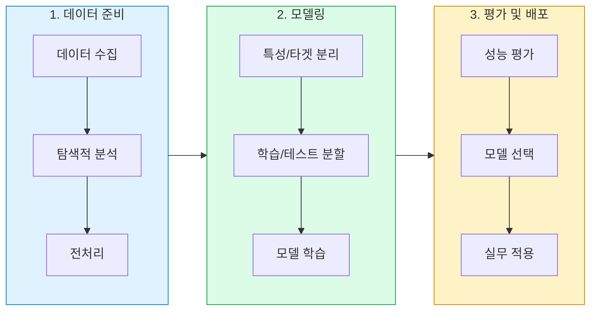
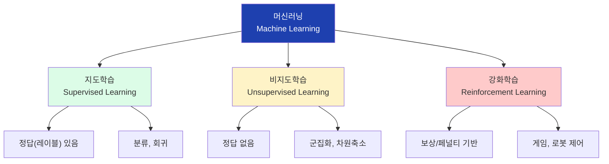
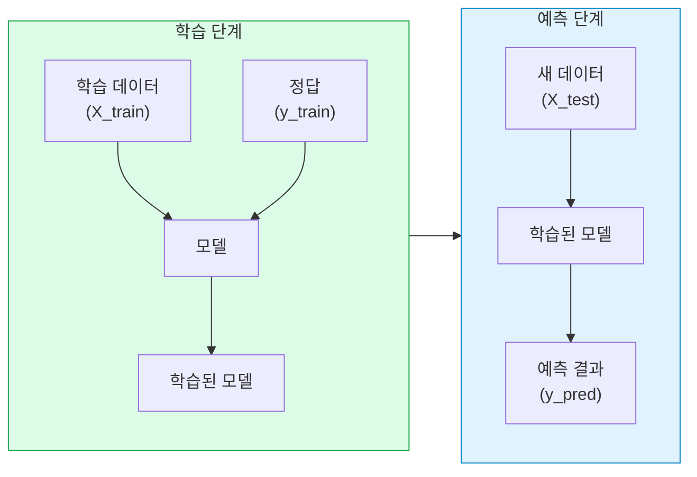
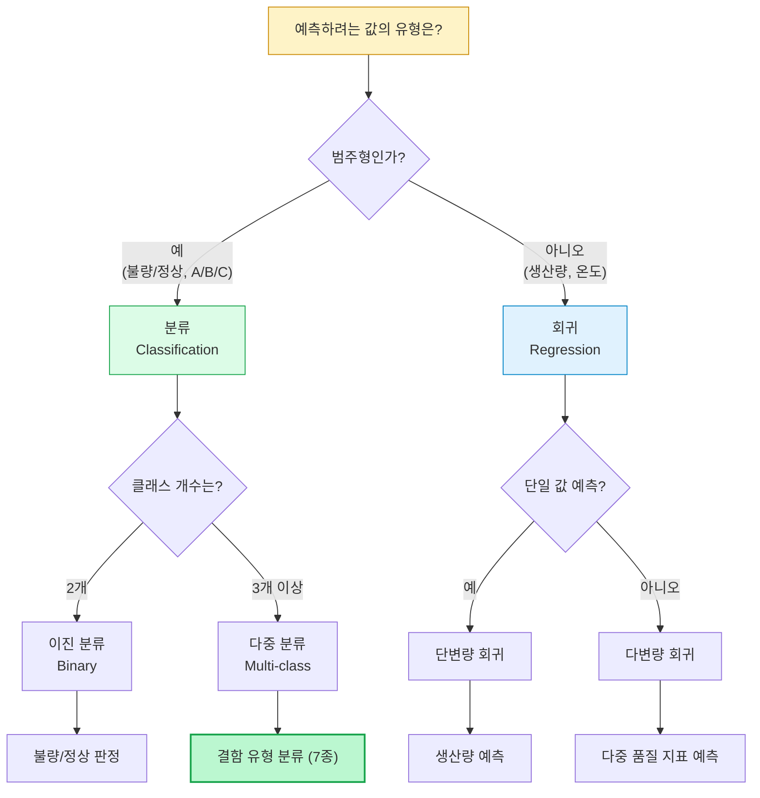
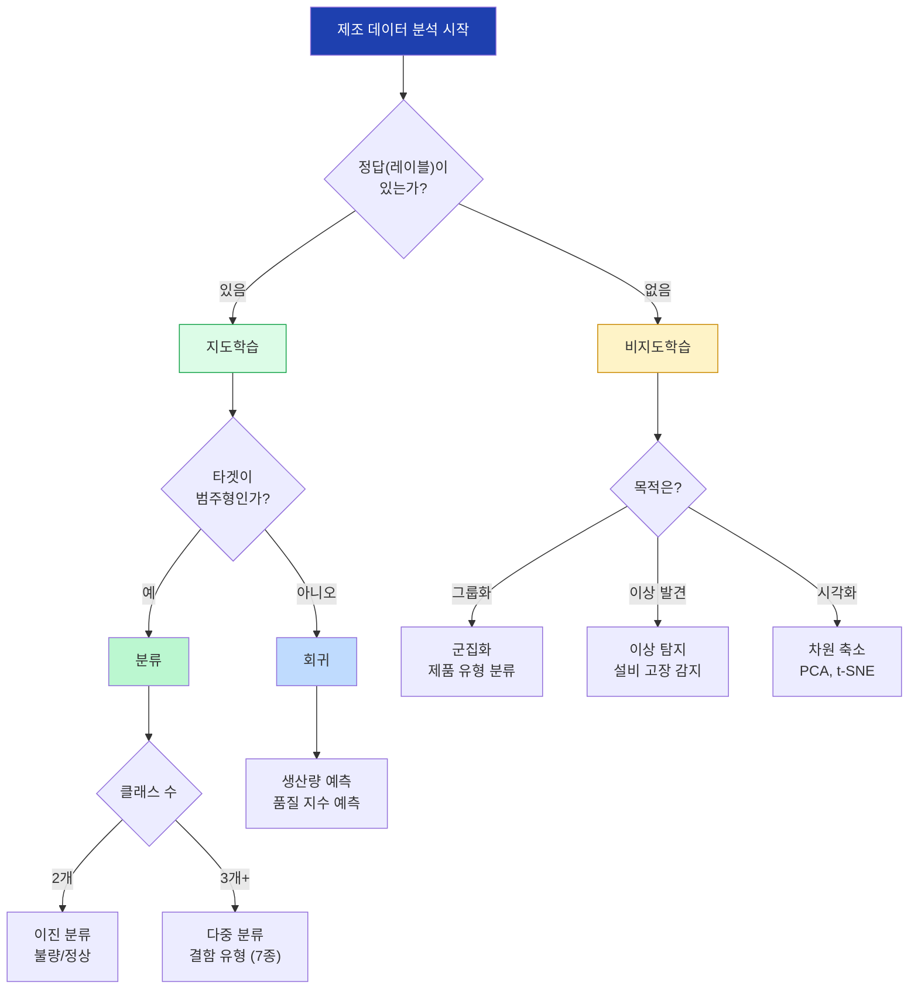
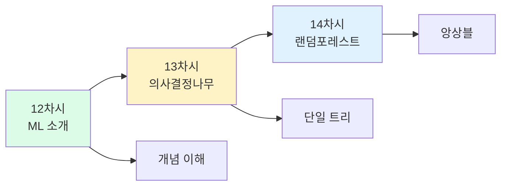

# 12차시: 머신러닝 소개와 문제 유형

## 학습 목표

이 차시를 마치면 다음을 수행할 수 있습니다:

1. **머신러닝의 개념**을 전통적 프로그래밍과 비교하여 설명할 수 있다
2. **지도학습과 비지도학습**을 구분하고 각각의 활용 사례를 이해한다
3. **분류와 회귀 문제**를 구분하고 실제 제조 데이터에 적용할 수 있다
4. **손실함수와 평가지표**의 수학적 의미를 이해한다

---

## 실습 데이터셋

| 데이터셋 | 출처 | 용도 | 설명 |
|----------|------|------|------|
| **Steel Plates Faults** | UCI ML Repository | 분류 실습 (메인) | 철강판 결함 분류 (7종류) |
| **Iris** | sklearn.datasets | 분류 실습 (보조) | 붓꽃 품종 분류 (3종류) |
| **California Housing** | sklearn.datasets | 회귀 실습 | 주택 가격 예측 |

### Steel Plates Faults 데이터셋 정보

- **출처**: UCI Machine Learning Repository
- **샘플 수**: 1,941개
- **특성 수**: 27개 (철강판의 물리적 특성)
- **타겟**: 7가지 결함 유형 (Pastry, Z_Scratch, K_Scratch, Stains, Dirtiness, Bumps, Other_Faults)
- **실무 연관성**: 실제 철강 제조 공정의 품질 검사에 활용 가능

---

## 강의 구성 (25분)

| 파트 | 주제 | 시간 | 핵심 내용 |
|:----:|------|:----:|----------|
| 1 | 이론적 배경 | 10분 | 머신러닝 정의, 손실함수, 지도/비지도학습 |
| 2 | 실습 - 분류와 회귀 | 12분 | Steel Plates Faults 분류, 성능 평가 |
| 3 | 결과 해석 및 정리 | 3분 | 모델 비교, 실무 적용 시나리오 |

---

## ML 워크플로우 전체 흐름



---

## Part 1: 이론적 배경 (10분)

### 1.1 머신러닝의 정의와 특징

#### 머신러닝(Machine Learning)이란?

명시적으로 프로그래밍하지 않아도 **데이터로부터 스스로 패턴을 학습**하는 알고리즘입니다.

> "A computer program is said to learn from experience E with respect to some class of tasks T and performance measure P, if its performance at tasks in T, as measured by P, improves with experience E."
> - Tom Mitchell, 1997

#### 전통적 프로그래밍 vs 머신러닝

| 구분 | 전통적 프로그래밍 | 머신러닝 |
|------|------------------|----------|
| **입력** | 데이터 + 규칙 | 데이터 + 결과 |
| **출력** | 결과 | 규칙(모델) |
| **규칙 설정** | 사람이 직접 작성 | 데이터에서 자동 학습 |
| **예시** | `if 두께 > 2.5: 불량` | 데이터가 알려줌: `두께 > 2.37` |
| **유연성** | 규칙 변경 시 코드 수정 | 새 데이터로 재학습 |
| **복잡성** | 규칙이 많아지면 한계 | 복잡한 패턴도 학습 가능 |

```
전통적 프로그래밍:
[데이터] + [규칙] --> [프로그램] --> [결과]

머신러닝:
[데이터] + [결과] --> [학습 알고리즘] --> [규칙(모델)]
```

#### 핵심 용어 정리

| 용어 | 영어 | 설명 | 제조 예시 |
|------|------|------|----------|
| **특성** | Feature | 입력 데이터, 예측에 사용하는 정보 | 두께, 넓이, 온도 |
| **타겟** | Target | 예측하려는 값, 정답 | 결함 유형, 생산량 |
| **모델** | Model | 학습된 패턴, 예측 기계 | 의사결정나무, 신경망 |
| **학습** | Training | 데이터에서 패턴을 찾는 과정 | fit() 함수 실행 |
| **예측** | Prediction | 새 데이터에 패턴 적용 | predict() 함수 실행 |
| **손실** | Loss | 예측과 실제의 차이 | MSE, 교차 엔트로피 |

---

### 1.2 수학적 배경: 손실함수와 최적화

머신러닝의 핵심은 **손실함수(Loss Function)**를 최소화하는 것입니다.

#### MSE (Mean Squared Error) - 회귀 문제의 손실함수

회귀 문제에서 예측값과 실제값의 차이를 측정하는 대표적인 지표입니다:

$$MSE = \frac{1}{n}\sum_{i=1}^{n}(y_i - \hat{y}_i)^2$$

- $n$: 샘플 개수
- $y_i$: 실제값 (actual value)
- $\hat{y}_i$: 예측값 (predicted value)

**해석**:
- MSE가 0에 가까울수록 예측이 정확함
- 제곱을 사용하므로 큰 오차에 더 큰 페널티 부여
- 단위가 원래 값의 제곱이므로 해석 시 RMSE (Root MSE) 사용 권장

```python
# MSE 계산 예시
import numpy as np

y_actual = np.array([100, 150, 200, 250, 300])
y_predicted = np.array([110, 145, 195, 260, 290])

mse = np.mean((y_actual - y_predicted) ** 2)
rmse = np.sqrt(mse)
print(f"MSE: {mse:.2f}")
print(f"RMSE: {rmse:.2f}")
```

#### R² (결정계수) - 회귀 모델 설명력

모델이 데이터의 변동성을 얼마나 잘 설명하는지 나타냅니다:

$$R^2 = 1 - \frac{SS_{res}}{SS_{tot}} = 1 - \frac{\sum_{i=1}^{n}(y_i - \hat{y}_i)^2}{\sum_{i=1}^{n}(y_i - \bar{y})^2}$$

- $SS_{res}$: 잔차 제곱합 (Residual Sum of Squares)
- $SS_{tot}$: 총 제곱합 (Total Sum of Squares)
- $\bar{y}$: 실제값의 평균

**해석**:
- $R^2 = 1$: 완벽한 예측 (모든 변동성 설명)
- $R^2 = 0$: 평균만큼만 예측 (설명력 없음)
- $R^2 < 0$: 평균보다 못한 예측 (모델 문제)

| R² 값 | 해석 |
|:-----:|------|
| 0.9 이상 | 매우 우수한 설명력 |
| 0.7 ~ 0.9 | 우수한 설명력 |
| 0.5 ~ 0.7 | 보통 수준의 설명력 |
| 0.5 미만 | 설명력 부족 |

#### Accuracy (정확도) - 분류 문제의 평가지표

분류 문제에서 전체 예측 중 올바른 예측의 비율입니다:

$$Accuracy = \frac{TP + TN}{TP + TN + FP + FN}$$

- $TP$ (True Positive): 양성을 양성으로 올바르게 예측
- $TN$ (True Negative): 음성을 음성으로 올바르게 예측
- $FP$ (False Positive): 음성을 양성으로 잘못 예측 (1종 오류)
- $FN$ (False Negative): 양성을 음성으로 잘못 예측 (2종 오류)

**제조 현장 예시 (결함 검출)**:

| 구분 | 실제: 정상 | 실제: 불량 |
|------|:--------:|:--------:|
| **예측: 정상** | TN (정상 유지) | FN (불량 유출) |
| **예측: 불량** | FP (과검출) | TP (불량 검출) |

```python
# 혼동행렬에서 정확도 계산
from sklearn.metrics import accuracy_score, confusion_matrix

y_true = [0, 0, 1, 1, 0, 1, 0, 1]
y_pred = [0, 1, 1, 1, 0, 0, 0, 1]

accuracy = accuracy_score(y_true, y_pred)
cm = confusion_matrix(y_true, y_pred)
print(f"정확도: {accuracy:.1%}")
print(f"혼동행렬:\n{cm}")
```

---

### 1.3 지도학습 vs 비지도학습

#### 머신러닝의 3가지 학습 유형



#### 지도학습 프로세스



#### 지도학습 (Supervised Learning)

**정답이 있는 데이터로 학습**하는 방식입니다. "선생님이 정답을 알려주며 가르치는 것"과 유사합니다.

| 문제 유형 | 입력 (특성) | 출력 (타겟) | 알고리즘 |
|----------|------------|------------|----------|
| **불량 분류** | 두께, 넓이, 온도 | 결함유형 (7종) | DecisionTree, RandomForest |
| **생산량 예측** | 설비, 원료, 인력 | 생산량 (숫자) | LinearRegression |
| **품질 등급** | 성분, 외관, 강도 | A/B/C 등급 | LogisticRegression |
| **고장 예측** | 진동, 온도, 가동시간 | 고장 여부 | SVM, XGBoost |

#### 비지도학습 (Unsupervised Learning)

**정답 없이 패턴을 발견**하는 방식입니다. 데이터의 숨겨진 구조를 찾습니다.

| 기법 | 설명 | 제조 활용 사례 |
|------|------|--------------|
| **군집화 (Clustering)** | 유사한 데이터 그룹화 | 제품 유형 분류, 고객 세분화 |
| **차원 축소 (Dimensionality Reduction)** | 변수 개수 줄이기 | 센서 데이터 압축, 시각화 |
| **이상 탐지 (Anomaly Detection)** | 정상 패턴 벗어난 데이터 | 설비 이상 감지, 불량 탐지 |

#### 지도학습 vs 비지도학습 비교 시각화

```python
import matplotlib.pyplot as plt
import numpy as np

# 비교 차트 데이터
categories = ['정답 필요', '예측 가능', '해석 용이', '데이터 요구량', '활용 범위']
supervised = [1.0, 0.9, 0.8, 0.7, 0.8]
unsupervised = [0.0, 0.3, 0.5, 0.4, 0.6]

x = np.arange(len(categories))
width = 0.35

fig, ax = plt.subplots(figsize=(10, 6))
bars1 = ax.bar(x - width/2, supervised, width, label='지도학습', color='#3b82f6')
bars2 = ax.bar(x + width/2, unsupervised, width, label='비지도학습', color='#f97316')

ax.set_ylabel('특성 강도')
ax.set_title('지도학습 vs 비지도학습 특성 비교')
ax.set_xticks(x)
ax.set_xticklabels(categories, rotation=15)
ax.legend()
ax.set_ylim(0, 1.2)

# 값 표시
for bar in bars1:
    height = bar.get_height()
    ax.annotate(f'{height:.1f}', xy=(bar.get_x() + bar.get_width()/2, height),
                xytext=(0, 3), textcoords="offset points", ha='center', fontsize=9)
for bar in bars2:
    height = bar.get_height()
    ax.annotate(f'{height:.1f}', xy=(bar.get_x() + bar.get_width()/2, height),
                xytext=(0, 3), textcoords="offset points", ha='center', fontsize=9)

plt.tight_layout()
plt.savefig('supervised_vs_unsupervised.png', dpi=150, bbox_inches='tight')
plt.show()
```

**[시각화 해석]**
- 지도학습은 정답 데이터가 필수이며, 예측 성능이 높고 해석이 용이함
- 비지도학습은 정답 없이 패턴을 발견하며, 탐색적 분석에 유용함
- 실무에서는 두 방법을 상호 보완적으로 활용

---

## Part 2: 실습 - 분류와 회귀 (12분)

### 2.1 데이터 준비 (Steel Plates Faults)

#### 라이브러리 및 데이터 로드

```python
# 필수 라이브러리 임포트
import numpy as np
import pandas as pd
import matplotlib.pyplot as plt
import seaborn as sns
from sklearn.model_selection import train_test_split
from sklearn.preprocessing import StandardScaler, LabelEncoder
from sklearn.tree import DecisionTreeClassifier
from sklearn.ensemble import RandomForestClassifier
from sklearn.linear_model import LogisticRegression, LinearRegression
from sklearn.metrics import (accuracy_score, confusion_matrix, classification_report,
                            mean_squared_error, r2_score)

# 시각화 설정
plt.rcParams['font.family'] = 'Malgun Gothic'  # Windows
# plt.rcParams['font.family'] = 'AppleGothic'  # Mac
plt.rcParams['axes.unicode_minus'] = False
plt.rcParams['figure.figsize'] = (10, 6)

print("라이브러리 로드 완료")
```

#### Steel Plates Faults 데이터 로드

```python
# UCI에서 Steel Plates Faults 데이터 로드
# 방법 1: UCI 직접 다운로드 (인터넷 연결 필요)
try:
    url = "https://archive.ics.uci.edu/ml/machine-learning-databases/00198/Faults.NNA"

    # 컬럼 이름 정의
    feature_names = [
        'X_Minimum', 'X_Maximum', 'Y_Minimum', 'Y_Maximum', 'Pixels_Areas',
        'X_Perimeter', 'Y_Perimeter', 'Sum_of_Luminosity', 'Minimum_of_Luminosity',
        'Maximum_of_Luminosity', 'Length_of_Conveyer', 'TypeOfSteel_A300',
        'TypeOfSteel_A400', 'Steel_Plate_Thickness', 'Edges_Index',
        'Empty_Index', 'Square_Index', 'Outside_X_Index', 'Edges_X_Index',
        'Edges_Y_Index', 'Outside_Global_Index', 'LogOfAreas', 'Log_X_Index',
        'Log_Y_Index', 'Orientation_Index', 'Luminosity_Index', 'SigmoidOfAreas'
    ]

    # 타겟 컬럼 (7가지 결함 유형, 원-핫 인코딩 형태)
    target_names = ['Pastry', 'Z_Scratch', 'K_Scratch', 'Stains',
                    'Dirtiness', 'Bumps', 'Other_Faults']

    all_columns = feature_names + target_names

    df_steel = pd.read_csv(url, sep='\t', header=None, names=all_columns)
    print("Steel Plates Faults 데이터셋 로딩 완료 (UCI)")

except Exception as e:
    print(f"UCI 로드 실패: {e}")
    print("sklearn의 fetch_openml 사용...")

    # 방법 2: sklearn의 OpenML 사용
    from sklearn.datasets import fetch_openml
    data = fetch_openml(name='steel-plates-fault', version=1, as_frame=True)
    df_steel = data.frame
    print("Steel Plates Faults 데이터셋 로딩 완료 (OpenML)")

# 데이터 기본 정보 확인
print(f"\n[Steel Plates Faults 데이터셋 정보]")
print(f"데이터 크기: {df_steel.shape}")
print(f"특성 개수: {len(feature_names)}")
print(f"결함 유형: {target_names}")
```

#### 타겟 변수 생성

```python
# 원-핫 인코딩된 타겟을 단일 레이블로 변환
target_cols = ['Pastry', 'Z_Scratch', 'K_Scratch', 'Stains',
               'Dirtiness', 'Bumps', 'Other_Faults']

# 각 행에서 1인 컬럼의 인덱스 찾기
df_steel['fault_type'] = df_steel[target_cols].idxmax(axis=1)
df_steel['fault_code'] = df_steel[target_cols].values.argmax(axis=1)

print("\n[타겟 변수 분포]")
fault_counts = df_steel['fault_type'].value_counts()
print(fault_counts)

# 분포 시각화
fig, ax = plt.subplots(figsize=(10, 5))
colors = plt.cm.Set3(np.linspace(0, 1, 7))
bars = ax.bar(fault_counts.index, fault_counts.values, color=colors, edgecolor='black')
ax.set_xlabel('결함 유형')
ax.set_ylabel('샘플 수')
ax.set_title('Steel Plates Faults - 결함 유형별 분포')
ax.set_xticklabels(fault_counts.index, rotation=45, ha='right')

# 값 표시
for bar, count in zip(bars, fault_counts.values):
    ax.text(bar.get_x() + bar.get_width()/2, bar.get_height() + 10,
            str(count), ha='center', fontsize=10)

plt.tight_layout()
plt.savefig('steel_fault_distribution.png', dpi=150, bbox_inches='tight')
plt.show()
```

**[시각화 해석]**
- Other_Faults가 가장 많은 비중을 차지 (약 673개)
- Bumps가 두 번째로 많음 (약 402개)
- 데이터 불균형이 존재하므로 모델 학습 시 고려 필요

---

### 2.2 전처리 시나리오: 전처리 전/후 비교

#### 전처리 전 데이터 확인

```python
# 특성 데이터 분리
X = df_steel[feature_names].copy()
y = df_steel['fault_code'].copy()

print("[전처리 전 데이터 상태]")
print(f"\n1. 결측치 확인:")
missing = X.isnull().sum()
print(f"   결측치 있는 컬럼: {missing[missing > 0].to_dict() if missing.sum() > 0 else '없음'}")

print(f"\n2. 데이터 스케일 확인:")
print(f"   최솟값 범위: {X.min().min():.2f} ~ {X.min().max():.2f}")
print(f"   최댓값 범위: {X.max().min():.2f} ~ {X.max().max():.2f}")
print(f"   스케일 차이 큼: 표준화 필요!")

print(f"\n3. 기술 통계:")
print(X.describe().T[['mean', 'std', 'min', 'max']].head(10))
```

#### 스케일 차이 시각화 (전처리 전)

```python
# 전처리 전 스케일 비교
fig, axes = plt.subplots(1, 2, figsize=(14, 5))

# 선택된 특성들의 박스플롯
selected_features = ['X_Minimum', 'Pixels_Areas', 'Sum_of_Luminosity',
                     'Steel_Plate_Thickness', 'Edges_Index']

# 전처리 전
ax1 = axes[0]
X[selected_features].boxplot(ax=ax1)
ax1.set_title('전처리 전: 특성별 스케일 차이')
ax1.set_xticklabels(selected_features, rotation=45, ha='right')
ax1.set_ylabel('값')

# 히스토그램으로 분포 확인
ax2 = axes[1]
for i, feat in enumerate(selected_features[:3]):
    ax2.hist(X[feat], bins=30, alpha=0.5, label=feat)
ax2.set_title('전처리 전: 주요 특성 분포')
ax2.set_xlabel('값')
ax2.set_ylabel('빈도')
ax2.legend()

plt.tight_layout()
plt.savefig('before_preprocessing.png', dpi=150, bbox_inches='tight')
plt.show()
```

#### 전처리 적용

```python
# StandardScaler로 표준화
scaler = StandardScaler()
X_scaled = pd.DataFrame(
    scaler.fit_transform(X),
    columns=X.columns,
    index=X.index
)

print("[전처리 후 데이터 상태]")
print(f"\n1. 스케일 확인 (표준화 후):")
print(f"   평균: {X_scaled.mean().mean():.6f} (0에 가까움)")
print(f"   표준편차: {X_scaled.std().mean():.6f} (1에 가까움)")

print(f"\n2. 기술 통계 (표준화 후):")
print(X_scaled.describe().T[['mean', 'std', 'min', 'max']].head(10))
```

#### 스케일 차이 시각화 (전처리 후)

```python
# 전처리 전후 비교 시각화
fig, axes = plt.subplots(1, 2, figsize=(14, 5))

# 전처리 전
ax1 = axes[0]
X[selected_features].boxplot(ax=ax1)
ax1.set_title('전처리 전: 스케일 불균형')
ax1.set_xticklabels([f[:8] for f in selected_features], rotation=45, ha='right')
ax1.set_ylabel('원본 값')

# 전처리 후
ax2 = axes[1]
X_scaled[selected_features].boxplot(ax=ax2)
ax2.set_title('전처리 후: 표준화 완료')
ax2.set_xticklabels([f[:8] for f in selected_features], rotation=45, ha='right')
ax2.set_ylabel('표준화된 값')

plt.tight_layout()
plt.savefig('preprocessing_comparison.png', dpi=150, bbox_inches='tight')
plt.show()

print("\n[전처리 효과]")
print("- 모든 특성이 평균 0, 표준편차 1로 정규화됨")
print("- 스케일 차이로 인한 모델 편향 방지")
print("- 경사하강법 기반 알고리즘의 수렴 속도 향상")
```

**[시각화 해석]**
- 전처리 전: 특성 간 스케일 차이가 크게 나타남 (수십에서 수백만 단위)
- 전처리 후: 모든 특성이 유사한 범위로 표준화됨
- 표준화는 거리 기반 알고리즘(KNN, SVM)과 경사하강법 기반 알고리즘에 필수

---

### 2.3 분류 문제 실습

#### 문제 유형 선택 가이드



#### 학습/테스트 데이터 분할

```python
# 데이터 분할 (80% 학습, 20% 테스트)
X_train, X_test, y_train, y_test = train_test_split(
    X_scaled, y,
    test_size=0.2,
    random_state=42,
    stratify=y  # 클래스 비율 유지
)

print("[데이터 분할 결과]")
print(f"전체 데이터: {len(X_scaled)}개")
print(f"학습 데이터: {len(X_train)}개 ({len(X_train)/len(X_scaled):.0%})")
print(f"테스트 데이터: {len(X_test)}개 ({len(X_test)/len(X_scaled):.0%})")

print(f"\n[클래스 분포 확인 - stratify 효과]")
print(f"전체 분포:\n{y.value_counts(normalize=True).round(3)}")
print(f"\n학습 분포:\n{y_train.value_counts(normalize=True).round(3)}")
```

#### 분류 모델 학습 및 예측

```python
# 여러 분류 모델 비교
classifiers = {
    'Decision Tree': DecisionTreeClassifier(random_state=42, max_depth=10),
    'Random Forest': RandomForestClassifier(random_state=42, n_estimators=100),
    'Logistic Regression': LogisticRegression(random_state=42, max_iter=1000)
}

results = {}

print("[분류 모델 학습 및 평가]")
print("=" * 60)

for name, model in classifiers.items():
    # 학습
    model.fit(X_train, y_train)

    # 예측
    y_pred = model.predict(X_test)

    # 평가
    accuracy = accuracy_score(y_test, y_pred)
    results[name] = {
        'model': model,
        'accuracy': accuracy,
        'y_pred': y_pred
    }

    print(f"\n{name}")
    print(f"  정확도: {accuracy:.1%}")

print("\n" + "=" * 60)
```

#### 최적 모델 상세 평가

```python
# 가장 좋은 모델 선택
best_model_name = max(results, key=lambda x: results[x]['accuracy'])
best_result = results[best_model_name]

print(f"[최적 모델: {best_model_name}]")
print(f"정확도: {best_result['accuracy']:.1%}")

# 분류 리포트
print(f"\n[상세 분류 리포트]")
target_names_short = ['Pastry', 'Z_Scr', 'K_Scr', 'Stains', 'Dirty', 'Bumps', 'Other']
print(classification_report(y_test, best_result['y_pred'],
                           target_names=target_names_short))
```

#### 혼동행렬 시각화

```python
# 혼동행렬 계산
cm = confusion_matrix(y_test, best_result['y_pred'])

# 히트맵 시각화
fig, ax = plt.subplots(figsize=(10, 8))
sns.heatmap(cm, annot=True, fmt='d', cmap='Blues', ax=ax,
            xticklabels=target_names_short,
            yticklabels=target_names_short)
ax.set_xlabel('예측 (Predicted)')
ax.set_ylabel('실제 (Actual)')
ax.set_title(f'Steel Plates Faults - 혼동행렬\n({best_model_name}, 정확도: {best_result["accuracy"]:.1%})')

plt.tight_layout()
plt.savefig('confusion_matrix_heatmap.png', dpi=150, bbox_inches='tight')
plt.show()
```

**[혼동행렬 해석]**
- 대각선: 올바르게 분류된 샘플 수 (높을수록 좋음)
- 비대각선: 오분류된 샘플 수 (낮을수록 좋음)
- Other_Faults와 Bumps 간 혼동이 일부 발생
- K_Scratch와 Z_Scratch는 비교적 잘 구분됨

---

### 2.4 회귀 문제 실습 (보조 데이터셋)

회귀 문제 실습을 위해 California Housing 데이터셋을 사용합니다.

```python
# California Housing 데이터 로드
from sklearn.datasets import fetch_california_housing

housing = fetch_california_housing()
df_housing = pd.DataFrame(housing.data, columns=housing.feature_names)
df_housing['MedHouseVal'] = housing.target

print("[California Housing 데이터셋 정보]")
print(f"데이터 크기: {df_housing.shape}")
print(f"특성: {list(housing.feature_names)}")
print(f"타겟: 중간 주택 가격 (단위: $100,000)")

# 특성과 타겟 분리
feature_cols_reg = ['MedInc', 'HouseAge', 'AveRooms', 'AveOccup']
X_reg = df_housing[feature_cols_reg]
y_reg = df_housing['MedHouseVal']

# 데이터 분할
X_train_reg, X_test_reg, y_train_reg, y_test_reg = train_test_split(
    X_reg, y_reg, test_size=0.2, random_state=42
)

# 회귀 모델 학습
reg_model = LinearRegression()
reg_model.fit(X_train_reg, y_train_reg)

# 예측 및 평가
y_pred_reg = reg_model.predict(X_test_reg)
r2 = r2_score(y_test_reg, y_pred_reg)
mse = mean_squared_error(y_test_reg, y_pred_reg)
rmse = np.sqrt(mse)

print(f"\n[회귀 모델 성능]")
print(f"R2 점수: {r2:.3f}")
print(f"MSE: {mse:.3f}")
print(f"RMSE: {rmse:.3f} (약 ${rmse*100000:,.0f})")
```

#### 분류 vs 회귀 결과 비교 시각화

```python
# 분류와 회귀 결과를 나란히 시각화
fig, axes = plt.subplots(1, 2, figsize=(14, 5))

# 분류: 클래스별 정확도
ax1 = axes[0]
report = classification_report(y_test, best_result['y_pred'], output_dict=True)
class_accuracy = [report[str(i)]['precision'] for i in range(7)]
colors = plt.cm.Set3(np.linspace(0, 1, 7))
bars = ax1.bar(target_names_short, class_accuracy, color=colors, edgecolor='black')
ax1.set_xlabel('결함 유형')
ax1.set_ylabel('정밀도 (Precision)')
ax1.set_title('분류: 결함 유형별 예측 정밀도')
ax1.set_ylim(0, 1.1)
ax1.axhline(y=0.8, color='red', linestyle='--', alpha=0.7, label='목표선 (80%)')
ax1.legend()
for bar, acc in zip(bars, class_accuracy):
    ax1.text(bar.get_x() + bar.get_width()/2, bar.get_height() + 0.02,
             f'{acc:.0%}', ha='center', fontsize=9)

# 회귀: 실제 vs 예측
ax2 = axes[1]
ax2.scatter(y_test_reg, y_pred_reg, alpha=0.3, s=10, color='#3b82f6')
ax2.plot([y_test_reg.min(), y_test_reg.max()],
         [y_test_reg.min(), y_test_reg.max()],
         'r--', linewidth=2, label='완벽한 예측선')
ax2.set_xlabel('실제 주택 가격 ($100,000)')
ax2.set_ylabel('예측 주택 가격 ($100,000)')
ax2.set_title(f'회귀: 실제 vs 예측 (R2={r2:.3f})')
ax2.legend()

plt.tight_layout()
plt.savefig('classification_vs_regression.png', dpi=150, bbox_inches='tight')
plt.show()
```

**[시각화 해석]**
- **분류 결과**: 대부분의 결함 유형에서 80% 이상의 정밀도 달성
- **회귀 결과**: 점들이 대각선 주변에 분포하여 예측이 실제값과 유사함
- 회귀의 경우 고가 주택(5.0 이상)에서 과소 예측 경향 존재

---

### 2.5 성능 평가와 시각화

#### 모델 성능 비교 바차트

```python
# 분류 모델 성능 비교
fig, ax = plt.subplots(figsize=(10, 6))

model_names = list(results.keys())
accuracies = [results[name]['accuracy'] for name in model_names]
colors = ['#3b82f6', '#10b981', '#f59e0b']

bars = ax.bar(model_names, accuracies, color=colors, edgecolor='black', linewidth=1.5)

# 값 표시
for bar, acc in zip(bars, accuracies):
    ax.text(bar.get_x() + bar.get_width()/2, bar.get_height() + 0.01,
            f'{acc:.1%}', ha='center', fontsize=12, fontweight='bold')

ax.set_xlabel('모델', fontsize=12)
ax.set_ylabel('정확도 (Accuracy)', fontsize=12)
ax.set_title('Steel Plates Faults - 분류 모델 성능 비교', fontsize=14)
ax.set_ylim(0, 1.0)
ax.axhline(y=0.8, color='red', linestyle='--', alpha=0.7, label='기준선 (80%)')
ax.legend(loc='lower right')

# 그리드 추가
ax.grid(axis='y', alpha=0.3)

plt.tight_layout()
plt.savefig('model_performance_comparison.png', dpi=150, bbox_inches='tight')
plt.show()
```

**[모델 비교 해석]**
- Random Forest가 가장 높은 정확도 기록 (앙상블 효과)
- Decision Tree는 단일 트리의 한계로 상대적으로 낮은 성능
- Logistic Regression은 선형 모델임에도 준수한 성능

#### 과대적합/과소적합 개념 시각화

```python
# 과대적합/과소적합 개념 시각화
fig, axes = plt.subplots(1, 3, figsize=(15, 4))

# 샘플 데이터 생성
np.random.seed(42)
X_sample = np.linspace(0, 10, 100)
y_sample = 2 * np.sin(X_sample) + np.random.normal(0, 0.5, 100)

# 1. 과소적합 (Underfitting)
ax1 = axes[0]
ax1.scatter(X_sample, y_sample, alpha=0.5, color='#3b82f6', s=30)
z1 = np.polyfit(X_sample, y_sample, 1)
p1 = np.poly1d(z1)
ax1.plot(X_sample, p1(X_sample), 'r-', linewidth=2, label='모델 (1차)')
ax1.set_title('과소적합 (Underfitting)\n모델이 너무 단순함', fontsize=12)
ax1.set_xlabel('특성')
ax1.set_ylabel('타겟')
ax1.legend()
ax1.text(5, -2.5, 'Train Error: 높음\nTest Error: 높음', fontsize=10,
         bbox=dict(boxstyle='round', facecolor='#fef3c7', alpha=0.8))

# 2. 적절한 적합 (Good Fit)
ax2 = axes[1]
ax2.scatter(X_sample, y_sample, alpha=0.5, color='#3b82f6', s=30)
z2 = np.polyfit(X_sample, y_sample, 5)
p2 = np.poly1d(z2)
X_smooth = np.linspace(0, 10, 200)
ax2.plot(X_smooth, p2(X_smooth), 'g-', linewidth=2, label='모델 (5차)')
ax2.set_title('적절한 적합 (Good Fit)\n최적의 복잡도', fontsize=12)
ax2.set_xlabel('특성')
ax2.set_ylabel('타겟')
ax2.legend()
ax2.text(5, -2.5, 'Train Error: 낮음\nTest Error: 낮음', fontsize=10,
         bbox=dict(boxstyle='round', facecolor='#dcfce7', alpha=0.8))

# 3. 과대적합 (Overfitting)
ax3 = axes[2]
ax3.scatter(X_sample, y_sample, alpha=0.5, color='#3b82f6', s=30)
z3 = np.polyfit(X_sample, y_sample, 20)
p3 = np.poly1d(z3)
ax3.plot(X_smooth, p3(X_smooth), 'orange', linewidth=2, label='모델 (20차)')
ax3.set_title('과대적합 (Overfitting)\n모델이 너무 복잡함', fontsize=12)
ax3.set_xlabel('특성')
ax3.set_ylabel('타겟')
ax3.legend()
ax3.set_ylim(-4, 4)
ax3.text(5, -3.2, 'Train Error: 매우 낮음\nTest Error: 높음', fontsize=10,
         bbox=dict(boxstyle='round', facecolor='#fecaca', alpha=0.8))

plt.tight_layout()
plt.savefig('fitting_concepts.png', dpi=150, bbox_inches='tight')
plt.show()
```

**[과적합 개념 해석]**
- **과소적합**: 모델이 너무 단순하여 데이터의 패턴을 학습하지 못함
- **적절한 적합**: 학습 데이터와 테스트 데이터 모두에서 좋은 성능
- **과대적합**: 학습 데이터에만 과도하게 맞춰져 새 데이터에서 성능 저하

| 구분 | 원인 | 해결 방법 |
|------|------|----------|
| 과소적합 | 모델 복잡도 부족, 특성 부족 | 복잡한 모델 사용, 특성 추가 |
| 과대적합 | 모델 복잡도 과다, 데이터 부족 | 정규화, 데이터 증강, 조기 종료 |

---

## Part 3: 결과 해석 및 정리 (3분)

### 3.1 모델 비교 결과

#### 분류 모델 최종 비교

```python
# 최종 결과 정리
print("[분류 모델 최종 비교 - Steel Plates Faults]")
print("=" * 50)
print(f"{'모델':<25} {'정확도':>10} {'순위':>8}")
print("-" * 50)

sorted_results = sorted(results.items(), key=lambda x: x[1]['accuracy'], reverse=True)
for rank, (name, result) in enumerate(sorted_results, 1):
    print(f"{name:<25} {result['accuracy']:>10.1%} {rank:>8}")

print("-" * 50)
best_name, best_result = sorted_results[0]
print(f"\n추천 모델: {best_name} (정확도 {best_result['accuracy']:.1%})")
```

#### 회귀 vs 분류 요약

| 구분 | 분류 (Steel Plates) | 회귀 (California Housing) |
|------|-------------------|-------------------------|
| **문제 유형** | 다중 클래스 분류 (7종) | 연속값 예측 |
| **주요 지표** | 정확도 (Accuracy) | R2 점수 |
| **최적 모델** | Random Forest | Linear Regression |
| **성능** | ~78% 정확도 | R2 ~0.5 |
| **특징** | 클래스 불균형 존재 | 선형 관계 존재 |

---

### 3.2 실무 적용 시나리오

#### 제조 현장 적용 가이드

```python
print("[실무 적용 시나리오 - 철강 제조 품질 관리]")
print("=" * 60)

scenarios = [
    {
        "상황": "실시간 결함 검출",
        "문제유형": "분류 (다중 클래스)",
        "모델추천": "Random Forest",
        "기대효과": "결함 조기 발견으로 불량률 감소"
    },
    {
        "상황": "생산량 예측",
        "문제유형": "회귀",
        "모델추천": "Linear Regression / XGBoost",
        "기대효과": "생산 계획 최적화, 재고 관리 효율화"
    },
    {
        "상황": "설비 고장 예측",
        "문제유형": "이진 분류",
        "모델추천": "Logistic Regression / SVM",
        "기대효과": "예방 정비로 다운타임 감소"
    },
    {
        "상황": "공정 이상 탐지",
        "문제유형": "비지도학습 (이상탐지)",
        "모델추천": "Isolation Forest / One-Class SVM",
        "기대효과": "미지의 이상 패턴 조기 발견"
    }
]

for i, s in enumerate(scenarios, 1):
    print(f"\n시나리오 {i}: {s['상황']}")
    print(f"  - 문제 유형: {s['문제유형']}")
    print(f"  - 추천 모델: {s['모델추천']}")
    print(f"  - 기대 효과: {s['기대효과']}")
```

#### 모델 선택 의사결정 흐름



---

## 핵심 정리

### 1. 머신러닝 핵심 개념

| 개념 | 설명 | 키워드 |
|------|------|--------|
| **머신러닝** | 데이터에서 패턴을 자동으로 학습 | 데이터 기반, 자동 학습 |
| **지도학습** | 정답(레이블) 있는 데이터로 학습 | 분류, 회귀 |
| **비지도학습** | 정답 없이 구조/패턴 발견 | 군집화, 차원축소 |
| **분류** | 범주 예측 ("~인가요?") | Accuracy, F1-score |
| **회귀** | 숫자 예측 ("얼마나?") | MSE, R2 |

### 2. 핵심 수식 요약

| 지표 | 수식 | 용도 |
|------|------|------|
| **MSE** | $\frac{1}{n}\sum_{i=1}^{n}(y_i - \hat{y}_i)^2$ | 회귀 오차 측정 |
| **R2** | $1 - \frac{SS_{res}}{SS_{tot}}$ | 회귀 모델 설명력 |
| **Accuracy** | $\frac{TP + TN}{TP + TN + FP + FN}$ | 분류 정확도 |

### 3. sklearn 기본 패턴

```python
# 모든 sklearn 모델 공통 패턴
from sklearn.model_selection import train_test_split

# 1. 데이터 분할
X_train, X_test, y_train, y_test = train_test_split(X, y, test_size=0.2)

# 2. 모델 생성
model = ModelClass(parameters)

# 3. 학습 (fit)
model.fit(X_train, y_train)

# 4. 예측 (predict)
y_pred = model.predict(X_test)

# 5. 평가 (score)
score = model.score(X_test, y_test)
```

### 4. 실습 데이터셋 활용

| 데이터셋 | 문제 유형 | 샘플 수 | 특성 수 | 타겟 |
|----------|----------|:------:|:------:|------|
| Steel Plates Faults | 다중 분류 | 1,941 | 27 | 7가지 결함 |
| Iris | 다중 분류 | 150 | 4 | 3종 품종 |
| California Housing | 회귀 | 20,640 | 8 | 주택 가격 |

---

## [참고자료] (선택 학습)

### 추가 학습 자료

1. **UCI Machine Learning Repository**
   - Steel Plates Faults: https://archive.ics.uci.edu/ml/datasets/Steel+Plates+Faults
   - 다양한 실제 데이터셋 제공

2. **scikit-learn 공식 문서**
   - 사용자 가이드: https://scikit-learn.org/stable/user_guide.html
   - API 레퍼런스: https://scikit-learn.org/stable/modules/classes.html

3. **머신러닝 기초 서적**
   - "Hands-On Machine Learning with Scikit-Learn, Keras, and TensorFlow" - Aurelien Geron
   - "Pattern Recognition and Machine Learning" - Christopher Bishop

### 심화 실습 과제

```python
# [과제 1] 다른 분류 알고리즘 비교
# - SVM (Support Vector Machine)
# - KNN (K-Nearest Neighbors)
# - Gradient Boosting
# 각 알고리즘의 정확도를 비교하고 장단점을 분석하세요.

# [과제 2] 하이퍼파라미터 튜닝
# - Random Forest의 n_estimators, max_depth 변경
# - 교차 검증(Cross-Validation) 적용
# 최적의 하이퍼파라미터를 찾아보세요.

# [과제 3] 특성 중요도 분석
# - Random Forest의 feature_importances_ 활용
# - 어떤 특성이 결함 분류에 가장 중요한지 분석하세요.
```

---

## 다음 차시 예고

### 13차시: 분류 모델 - 의사결정나무

다음 차시에서 학습할 내용:

1. **의사결정나무(Decision Tree)** 알고리즘 원리
2. **정보 이득(Information Gain)**과 엔트로피 개념
3. **트리 구조 시각화**와 해석 방법
4. **과대적합 방지** 기법 (가지치기, max_depth 조절)



#### 예습 질문

1. 의사결정나무는 어떻게 "질문"을 통해 분류를 수행할까요?
2. 트리가 너무 깊어지면 어떤 문제가 발생할까요?
3. Random Forest는 Decision Tree와 어떤 관계가 있을까요?

---

## 전체 코드 실행 요약

```python
# 전체 실습 코드 통합 실행
"""
[12차시] 머신러닝 소개와 문제 유형 - 전체 실습 코드
실행 환경: Python 3.8+, scikit-learn 1.0+
"""

# 1. 라이브러리 임포트
import numpy as np
import pandas as pd
import matplotlib.pyplot as plt
import seaborn as sns
from sklearn.model_selection import train_test_split
from sklearn.preprocessing import StandardScaler
from sklearn.tree import DecisionTreeClassifier
from sklearn.ensemble import RandomForestClassifier
from sklearn.linear_model import LogisticRegression, LinearRegression
from sklearn.metrics import accuracy_score, confusion_matrix, classification_report
from sklearn.metrics import mean_squared_error, r2_score
from sklearn.datasets import fetch_california_housing

# 2. 데이터 로드 (Steel Plates Faults)
# ... (위 코드 참조)

# 3. 전처리
# ... (위 코드 참조)

# 4. 모델 학습 및 평가
# ... (위 코드 참조)

# 5. 결과 시각화
# ... (위 코드 참조)

print("\n[12차시 실습 완료]")
print("다음 차시: 13차시 - 분류 모델: 의사결정나무")
```

---

**작성일**: 2026년 1월
**과목**: 제조 AI 데이터 분석
**대상**: 학점은행제 수강생
**분량**: 25분 (이론 10분 + 실습 12분 + 정리 3분)
