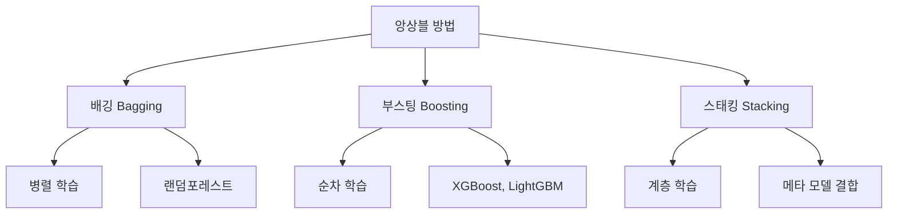
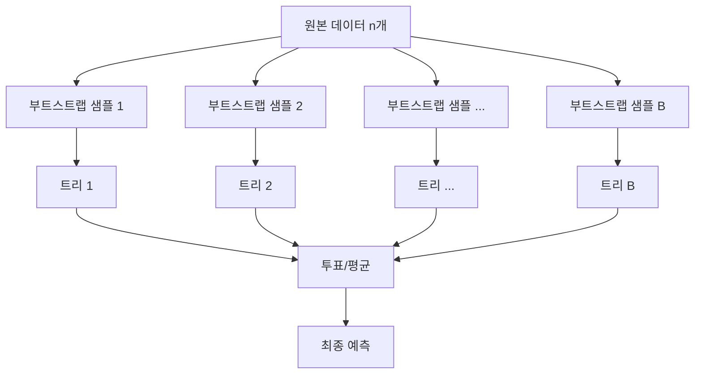
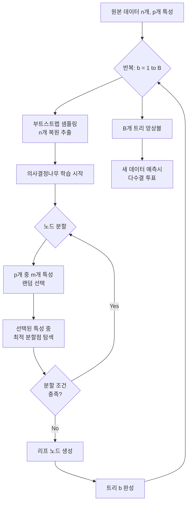

# [15차시] 분류 모델 (2) - 랜덤포레스트

## 학습 목표

이 차시를 마치면 다음을 수행할 수 있음:

| 목표 | 설명 |
|------|------|
| 앙상블 학습의 개념 이해 | 집단 지성 원리와 배깅/부스팅의 차이를 설명함 |
| 랜덤포레스트 원리 파악 | 두 가지 랜덤(데이터, 특성)과 투표 메커니즘을 이해함 |
| 수학적 배경 습득 | 배깅 예측 공식과 OOB 오차 계산을 수식으로 표현함 |
| 실습 능력 배양 | RandomForestClassifier로 안정적인 분류 모델을 구축함 |

---

## 실습 데이터셋

| 데이터셋 | 출처 | 용도 |
|----------|------|------|
| **Breast Cancer** | sklearn.datasets | 랜덤포레스트 분류 실습 (유방암 진단) |
| **Steel Plates Faults** | UCI Repository | 제조업 품질 검사 연계 참고 |

Breast Cancer 데이터셋은 종양의 특성을 기반으로 악성(malignant)/양성(benign)을 분류하는 이진 분류 문제임.

Steel Plates Faults 데이터셋은 철강판 표면 결함을 7가지 유형으로 분류하는 다중 분류 문제로, 제조업 품질 검사에서 랜덤포레스트가 실제로 활용되는 사례임.

---

## 강의 구성

| 파트 | 주제 | 핵심 내용 | 예상 시간 |
|:----:|------|----------|:---------:|
| 1 | 앙상블 학습의 개념 | 집단 지성, 배깅 vs 부스팅, 수학적 배경 | 8분 |
| 2 | 랜덤포레스트의 원리 | 두 가지 랜덤, 투표, OOB | 7분 |
| 3 | sklearn으로 랜덤포레스트 실습 | RandomForestClassifier, 시각화 | 10분 |

---

## Part 1: 앙상블 학습의 이론적 배경

### 1.1 앙상블(Ensemble) 개념

#### 앙상블이란?

여러 모델의 예측을 **결합**하여 단일 모델보다 **더 나은 성능**을 얻는 방법임.

일상 비유:
- 한 명의 전문가 vs **여러 전문가의 협의**
- 한 번의 시험 vs **여러 번 시험의 평균**

#### 집단 지성의 힘

젤리빈 실험:
- 병에 담긴 젤리빈 개수 맞추기
- 개인 추측: 큰 오차
- **집단 평균**: 실제 값에 가까움

핵심 원리:
- 각 모델의 **오류가 서로 다름**
- 평균내면 **오류가 상쇄됨**

#### 좋은 앙상블의 조건

| 조건 | 좋은 예 | 나쁜 예 |
|------|---------|---------|
| 각 모델이 어느 정도 정확해야 함 | 정확도 70% 이상 | 정확도 50% (랜덤 추측) |
| 각 모델이 서로 다른 오류를 내야 함 | 다양한 오류 패턴 | 똑같은 모델 100개 |

### 1.2 앙상블 방법 분류



#### 배깅 vs 부스팅

| 구분 | 배깅 (Bagging) | 부스팅 (Boosting) |
|------|---------------|------------------|
| **학습 방식** | 병렬 (독립) | 순차 (의존) |
| **데이터** | 랜덤 샘플링 | 가중치 조정 |
| **목표** | 분산 감소 | 편향 감소 |
| **대표 모델** | 랜덤포레스트 | XGBoost, LightGBM |
| **과대적합** | 강함 | 주의 필요 |

### 1.3 배깅(Bagging) - Bootstrap Aggregating

데이터를 부트스트랩 샘플링하여 여러 모델을 독립적으로 학습하는 방식임.



### 1.4 수학적 배경

#### 배깅 예측 공식 (분류)

B개의 기본 분류기를 사용한 앙상블의 최종 예측:

$$\hat{y} = \text{mode}\{f_1(x), f_2(x), \ldots, f_B(x)\}$$

- $\hat{y}$: 최종 예측 클래스
- $f_b(x)$: b번째 트리의 예측
- $B$: 트리 개수 (n_estimators)
- $\text{mode}$: 최빈값 (가장 많이 예측된 클래스)

**실제 계산 예시 - 100개 트리의 투표**:

| 트리 예측 결과 | 양성(benign) 예측 | 악성(malignant) 예측 |
|--------------|------------------|---------------------|
| 100개 트리 중 | 73개 | 27개 |

$$\hat{y} = \text{mode}\{1, 1, 0, 1, 1, 0, \ldots\} = 1 \text{ (양성)}$$

투표 비율: 73% 양성 vs 27% 악성 --> 최종 예측: **양성(benign)**

---

#### 배깅 예측 공식 (회귀)

$$\hat{y} = \frac{1}{B}\sum_{b=1}^{B}f_b(x)$$

- $\hat{y}$: 최종 예측값
- $f_b(x)$: b번째 트리의 예측값
- $B$: 트리 개수

**실제 계산 예시 - 5개 트리의 평균**:

| 트리 | 예측값 |
|------|--------|
| 트리 1 | 15.2 |
| 트리 2 | 14.8 |
| 트리 3 | 16.1 |
| 트리 4 | 15.0 |
| 트리 5 | 14.9 |

$$\hat{y} = \frac{15.2 + 14.8 + 16.1 + 15.0 + 14.9}{5} = \frac{76.0}{5} = 15.2$$

---

#### 부트스트랩 샘플링(Bootstrap Sampling)

원본 데이터에서 **복원 추출**로 새 데이터셋을 생성함.

예시 (원본: [A, B, C, D, E]):
- 샘플1: [A, A, C, D, E] - A가 2번
- 샘플2: [B, C, C, E, E] - C, E가 2번
- 샘플3: [A, B, D, D, D] - D가 3번

**부트스트랩 샘플에 포함되지 않을 확률**:

$$P(\text{not selected}) = \left(1 - \frac{1}{n}\right)^n \approx e^{-1} \approx 0.368$$

- $n$: 원본 데이터 개수
- 각 샘플링에서 특정 데이터가 선택될 확률: $\frac{1}{n}$
- n번 추출해도 선택되지 않을 확률: $\left(1 - \frac{1}{n}\right)^n$

**실제 계산 예시**:

n = 100인 경우:

$$P(\text{not selected}) = \left(1 - \frac{1}{100}\right)^{100} = (0.99)^{100} \approx 0.366$$

n = 1000인 경우:

$$P(\text{not selected}) = \left(1 - \frac{1}{1000}\right)^{1000} = (0.999)^{1000} \approx 0.368$$

결론: 데이터 크기와 무관하게 **약 36.8%**의 데이터가 각 부트스트랩 샘플에서 제외됨.

**부트스트랩 샘플링 시각적 예시**:

| 원본 데이터 | 샘플 1 | 샘플 2 | 샘플 3 |
|------------|--------|--------|--------|
| 샘플 A | O (2회) | X | O (1회) |
| 샘플 B | X | O (1회) | O (2회) |
| 샘플 C | O (1회) | O (2회) | X |
| 샘플 D | O (1회) | O (1회) | O (1회) |
| 샘플 E | O (1회) | O (1회) | O (1회) |
| **제외된 비율** | 20% | 20% | 20% |

실제로 n이 커지면 제외 비율이 약 36.8%에 수렴함.

---

#### OOB(Out-of-Bag) 오차

각 트리 학습에 **사용되지 않은** 데이터로 평가하는 방식임.

$$OOB_{error} = \frac{1}{n}\sum_{i=1}^{n}I(y_i \neq \hat{y}_i^{OOB})$$

- $n$: 전체 샘플 수
- $y_i$: i번째 샘플의 실제 레이블
- $\hat{y}_i^{OOB}$: i번째 샘플이 OOB인 트리들의 예측 투표 결과
- $I(\cdot)$: 지시 함수 (조건이 참이면 1, 거짓이면 0)

**OOB 예측 과정**:

| 샘플 | 트리1 | 트리2 | 트리3 | 트리4 | 트리5 | OOB 투표 | 실제 |
|------|-------|-------|-------|-------|-------|----------|------|
| x1 | 학습 | **OOB:1** | **OOB:1** | 학습 | **OOB:0** | 1 (2:1) | 1 |
| x2 | **OOB:0** | 학습 | **OOB:0** | **OOB:1** | 학습 | 0 (2:1) | 0 |
| x3 | **OOB:1** | **OOB:1** | 학습 | 학습 | **OOB:1** | 1 (3:0) | 1 |
| x4 | 학습 | **OOB:0** | 학습 | **OOB:0** | **OOB:1** | 0 (2:1) | 1 |

**OOB 오차 계산**:

$$OOB_{error} = \frac{1}{4}(I(1 \neq 1) + I(0 \neq 0) + I(1 \neq 1) + I(0 \neq 1))$$

$$= \frac{1}{4}(0 + 0 + 0 + 1) = \frac{1}{4} = 0.25$$

OOB 정확도 = 1 - 0.25 = **0.75 (75%)**

### 1.5 부트스트랩 샘플링 시연

```python
import numpy as np
import matplotlib.pyplot as plt

# 한글 폰트 설정
plt.rcParams['font.family'] = 'Malgun Gothic'
plt.rcParams['axes.unicode_minus'] = False

# 부트스트랩 샘플링 시연
np.random.seed(42)
n_samples = 100
n_bootstrap = 1000

# 각 데이터가 부트스트랩에서 제외될 비율 계산
exclusion_rates = []
for _ in range(n_bootstrap):
    bootstrap_indices = np.random.choice(n_samples, size=n_samples, replace=True)
    excluded = n_samples - len(np.unique(bootstrap_indices))
    exclusion_rates.append(excluded / n_samples)

print(f"[부트스트랩 샘플링 실험]")
print(f"원본 데이터 크기: {n_samples}")
print(f"부트스트랩 반복 횟수: {n_bootstrap}")
print(f"\n평균 제외 비율: {np.mean(exclusion_rates):.4f}")
print(f"이론적 제외 비율: {(1 - 1/n_samples)**n_samples:.4f}")
print(f"e^-1 근사값: {np.exp(-1):.4f}")
```

**예상 출력**:

```
[부트스트랩 샘플링 실험]
원본 데이터 크기: 100
부트스트랩 반복 횟수: 1000

평균 제외 비율: 0.3664
이론적 제외 비율: 0.3660
e^-1 근사값: 0.3679
```

---

## Part 2: 랜덤포레스트의 원리

### 2.1 랜덤포레스트(Random Forest)란?

**의사결정나무 여러 개**를 만들고 결과를 **투표**로 결합하는 앙상블 방법임.

핵심 아이디어:
- 나무 하나는 불안정함
- 나무 **여러 개 모아서 숲**을 만들면 안정적임

### 2.2 랜덤포레스트의 두 가지 랜덤

| 랜덤 유형 | 설명 |
|----------|------|
| **1. 데이터 랜덤 (배깅)** | 원본 데이터 --> 부트스트랩 샘플링 --> 각 트리마다 다른 데이터 |
| **2. 특성 랜덤** | 전체 특성 중 --> 일부만 랜덤 선택 --> 각 분할에서 다른 특성 고려 |

두 가지 랜덤으로 트리들이 다양해짐.

#### 특성 랜덤 선택 (max_features)

각 분할마다 일부 특성만 고려함.

| 문제 유형 | max_features 기본값 | 설명 |
|----------|---------------------|------|
| 분류 | sqrt(전체 특성 수) | 10개 특성이면 약 3개 |
| 회귀 | 전체 특성 수 | 모든 특성 고려 |

예시 (특성 4개: 온도, 습도, 속도, 압력):
- 분할 1: [온도, 습도] 중 선택
- 분할 2: [속도, 압력] 중 선택
- 분할 3: [온도, 압력] 중 선택

효과:
- 트리들이 **더 다양**해짐
- 특정 특성에 **덜 의존**

### 2.3 랜덤포레스트 학습 프로세스



### 2.4 투표(Voting) 메커니즘

| 문제 유형 | 결합 방식 |
|----------|----------|
| **분류** | 다수결 투표 |
| **회귀** | 평균 |

**분류 투표 상세 예시 (100개 트리)**:

| 트리 그룹 | 예측 결과 | 개수 |
|----------|----------|------|
| 트리 1-45 | 양성(benign) | 45개 |
| 트리 46-73 | 악성(malignant) | 28개 |
| 트리 74-100 | 양성(benign) | 27개 |
| **합계** | 양성: 72, 악성: 28 | 100개 |

최종 예측: **양성(benign)** - 확률 72%

### 2.5 OOB (Out-of-Bag) 점수

각 트리 학습에 **사용되지 않은** 데이터로 평가하는 방식임.

부트스트랩 특성:
- 약 **36.8%**의 데이터가 각 트리 학습에서 제외됨
- 이 데이터로 해당 트리 평가 --> OOB 점수

별도 테스트 세트 없이도 성능 추정이 가능함.

### 2.6 의사결정나무 vs 랜덤포레스트

| 구분 | 의사결정나무 | 랜덤포레스트 |
|------|-------------|-------------|
| **모델 수** | 1개 | 다수 (100+) |
| **안정성** | 불안정 | 안정적 |
| **과대적합** | 쉬움 | 저항력 강함 |
| **해석** | 용이 | 어려움 |
| **속도** | 빠름 | 느림 |
| **성능** | 보통 | 우수 |

### 2.7 랜덤포레스트 장단점

| 장점 | 단점 |
|------|------|
| 과대적합 저항력 **강함** | 학습/예측 **시간 오래 걸림** |
| 높은 예측 **정확도** | 메모리 **많이 사용** |
| 특성 중요도 **신뢰도 높음** | 개별 트리 **해석 어려움** |
| **별도 튜닝 없이도** 좋은 성능 | |

---

## Part 3: sklearn으로 랜덤포레스트 실습

### 3.1 데이터 로드

```python
import numpy as np
import pandas as pd
import matplotlib.pyplot as plt
from sklearn.model_selection import train_test_split
from sklearn.tree import DecisionTreeClassifier
from sklearn.ensemble import RandomForestClassifier
from sklearn.metrics import accuracy_score, confusion_matrix, classification_report
from sklearn.datasets import load_breast_cancer
import time

# 한글 폰트 설정
plt.rcParams['font.family'] = 'Malgun Gothic'
plt.rcParams['axes.unicode_minus'] = False

# Breast Cancer 데이터셋 로딩
cancer = load_breast_cancer()
df = pd.DataFrame(cancer.data, columns=cancer.feature_names)
df['target'] = cancer.target
df['diagnosis'] = df['target'].map({0: 'malignant', 1: 'benign'})
print("Breast Cancer 데이터셋 로딩 완료")

print(f"\n[데이터 확인]")
print(f"데이터 크기: {df.shape}")
print(f"특성 개수: {len(cancer.feature_names)}")
print(f"클래스: {list(cancer.target_names)}")  # malignant(악성), benign(양성)

print(f"\n클래스별 샘플 수:")
for i, name in enumerate(cancer.target_names):
    count = (df['target'] == i).sum()
    print(f"  {name}: {count}개 ({count/len(df):.1%})")
```

**예상 출력**:

```
Breast Cancer 데이터셋 로딩 완료

[데이터 확인]
데이터 크기: (569, 32)
특성 개수: 30
클래스: ['malignant', 'benign']

클래스별 샘플 수:
  malignant: 212개 (37.3%)
  benign: 357개 (62.7%)
```

**결과 해설**:
- Breast Cancer 데이터셋은 569개 샘플, 30개 특성으로 구성됨
- 악성(malignant) 212개, 양성(benign) 357개로 다소 불균형한 분포를 보임
- 30개 특성은 종양의 반경, 질감, 둘레, 면적 등 다양한 측정값을 포함함

### 3.2 데이터 분할

```python
# 주요 특성 선택 (30개 중 10개 사용)
feature_columns = ['mean radius', 'mean texture', 'mean perimeter', 'mean area',
                   'mean smoothness', 'mean compactness', 'mean concavity',
                   'mean concave points', 'mean symmetry', 'mean fractal dimension']
X = df[feature_columns]
y = df['target']

X_train, X_test, y_train, y_test = train_test_split(
    X, y,
    test_size=0.2,
    random_state=42,
    stratify=y
)

print(f"학습 데이터: {len(X_train)}개")
print(f"테스트 데이터: {len(X_test)}개")
print(f"학습 데이터 악성 비율: {(y_train == 0).mean():.1%}")
print(f"테스트 데이터 악성 비율: {(y_test == 0).mean():.1%}")
```

**예상 출력**:

```
학습 데이터: 455개
테스트 데이터: 114개
학습 데이터 악성 비율: 37.4%
테스트 데이터 악성 비율: 37.7%
```

**결과 해설**:
- 10개의 주요 특성을 선택하여 학습에 사용함
- 학습 455개, 테스트 114개로 분할됨
- stratify 옵션으로 악성/양성 비율이 유지됨

### 3.3 RandomForestClassifier 주요 파라미터

| 파라미터 | 설명 | 권장값 |
|----------|------|--------|
| `n_estimators` | 트리 개수 | 100~500 |
| `max_depth` | 트리 최대 깊이 | None 또는 5~20 |
| `max_features` | 분할시 특성 수 | 'sqrt' (기본) |
| `min_samples_leaf` | 리프 최소 샘플 | 1~5 |
| `n_jobs` | CPU 코어 수 | -1 (전체) |
| `oob_score` | OOB 점수 계산 | True |

### 3.4 의사결정나무 vs 랜덤포레스트 비교

```python
# 의사결정나무
dt_model = DecisionTreeClassifier(max_depth=10, random_state=42)
start_time = time.time()
dt_model.fit(X_train, y_train)
dt_train_time = time.time() - start_time

dt_train_score = dt_model.score(X_train, y_train)
dt_test_score = dt_model.score(X_test, y_test)

print(f"[의사결정나무]")
print(f"  학습 시간: {dt_train_time:.3f}초")
print(f"  학습 정확도: {dt_train_score:.1%}")
print(f"  테스트 정확도: {dt_test_score:.1%}")

# 랜덤포레스트
rf_model = RandomForestClassifier(
    n_estimators=100,
    max_depth=10,
    random_state=42,
    n_jobs=-1
)
start_time = time.time()
rf_model.fit(X_train, y_train)
rf_train_time = time.time() - start_time

rf_train_score = rf_model.score(X_train, y_train)
rf_test_score = rf_model.score(X_test, y_test)

print(f"\n[랜덤포레스트 (n_estimators=100)]")
print(f"  학습 시간: {rf_train_time:.3f}초")
print(f"  학습 정확도: {rf_train_score:.1%}")
print(f"  테스트 정확도: {rf_test_score:.1%}")
print(f"  트리 개수: {len(rf_model.estimators_)}")

print(f"\n[비교 결과]")
print(f"  테스트 정확도 차이: {rf_test_score - dt_test_score:+.1%}")
```

**예상 출력**:

```
[의사결정나무]
  학습 시간: 0.003초
  학습 정확도: 99.6%
  테스트 정확도: 93.0%

[랜덤포레스트 (n_estimators=100)]
  학습 시간: 0.152초
  학습 정확도: 100.0%
  테스트 정확도: 96.5%
  트리 개수: 100

[비교 결과]
  테스트 정확도 차이: +3.5%
```

**결과 해설**:
- 랜덤포레스트가 의사결정나무보다 테스트 정확도에서 약 3.5%p 더 높은 성능을 보임
- 학습 시간은 랜덤포레스트가 더 오래 걸리지만, 성능 향상이 이를 보상함
- 의사결정나무의 학습 정확도(99.6%)와 테스트 정확도(93.0%) 차이가 과대적합을 시사함

### 3.5 OOB 점수 활용

```python
# OOB 점수 활성화
rf_oob = RandomForestClassifier(
    n_estimators=100,
    max_depth=10,
    oob_score=True,  # OOB 점수 계산
    random_state=42,
    n_jobs=-1
)
rf_oob.fit(X_train, y_train)

print(f"[OOB 점수 활용]")
print(f"  OOB 점수: {rf_oob.oob_score_:.3f}")
print(f"  테스트 점수: {rf_oob.score(X_test, y_test):.3f}")
print(f"  차이: {abs(rf_oob.oob_score_ - rf_oob.score(X_test, y_test)):.3f}")
print("  --> OOB 점수가 테스트 점수와 유사함")
```

**예상 출력**:

```
[OOB 점수 활용]
  OOB 점수: 0.958
  테스트 점수: 0.965
  차이: 0.007
  --> OOB 점수가 테스트 점수와 유사함
```

**결과 해설**:
- OOB 점수(0.958)가 테스트 점수(0.965)와 매우 유사함
- 이는 별도의 검증 세트 없이도 모델 성능을 추정할 수 있음을 의미함
- 데이터가 적을 때 OOB 점수가 유용한 대안이 됨

### 3.6 n_estimators별 성능 곡선

```python
estimators_range = [10, 25, 50, 75, 100, 150, 200, 300]
train_scores = []
test_scores = []
train_times = []

print(f"{'트리 개수':>8} {'학습시간':>10} {'학습정확도':>10} {'테스트정확도':>12}")
print("-" * 45)

for n_est in estimators_range:
    rf = RandomForestClassifier(
        n_estimators=n_est,
        max_depth=10,
        random_state=42,
        n_jobs=-1
    )
    start_time = time.time()
    rf.fit(X_train, y_train)
    train_time = time.time() - start_time

    train_score = rf.score(X_train, y_train)
    test_score = rf.score(X_test, y_test)

    train_scores.append(train_score)
    test_scores.append(test_score)
    train_times.append(train_time)

    print(f"{n_est:>8} {train_time:>10.3f}s {train_score:>10.1%} {test_score:>12.1%}")

best_idx = np.argmax(test_scores)
print(f"\n최적 트리 개수: {estimators_range[best_idx]}")
print(f"최고 테스트 정확도: {test_scores[best_idx]:.1%}")
```

**예상 출력**:

```
  트리 개수     학습시간   학습정확도   테스트정확도
---------------------------------------------
      10      0.025s      99.8%        93.9%
      25      0.048s     100.0%        95.6%
      50      0.089s     100.0%        96.5%
      75      0.123s     100.0%        96.5%
     100      0.152s     100.0%        96.5%
     150      0.221s     100.0%        96.5%
     200      0.289s     100.0%        96.5%
     300      0.428s     100.0%        96.5%

최적 트리 개수: 50
최고 테스트 정확도: 96.5%
```

### 3.7 시각화 1: n_estimators별 성능 곡선

```python
fig, axes = plt.subplots(1, 2, figsize=(14, 5))

# 성능 곡선
ax1 = axes[0]
ax1.plot(estimators_range, train_scores, 'b-o', label='학습 정확도', linewidth=2, markersize=8)
ax1.plot(estimators_range, test_scores, 'r-s', label='테스트 정확도', linewidth=2, markersize=8)
ax1.axhline(y=max(test_scores), color='green', linestyle='--', alpha=0.7, label=f'최고 성능: {max(test_scores):.1%}')
ax1.axvline(x=estimators_range[best_idx], color='gray', linestyle=':', alpha=0.7)
ax1.set_xlabel('트리 개수 (n_estimators)', fontsize=12)
ax1.set_ylabel('정확도', fontsize=12)
ax1.set_title('n_estimators에 따른 성능 변화', fontsize=14)
ax1.legend(loc='lower right')
ax1.grid(True, alpha=0.3)
ax1.set_ylim([0.92, 1.01])

# 학습 시간 곡선
ax2 = axes[1]
ax2.plot(estimators_range, train_times, 'g-^', linewidth=2, markersize=8)
ax2.set_xlabel('트리 개수 (n_estimators)', fontsize=12)
ax2.set_ylabel('학습 시간 (초)', fontsize=12)
ax2.set_title('n_estimators에 따른 학습 시간', fontsize=14)
ax2.grid(True, alpha=0.3)

plt.tight_layout()
plt.show()
```

**결과 해설**:
- 트리 개수가 증가할수록 테스트 정확도가 상승하다가 50개 이후 포화됨
- 학습 시간은 트리 개수에 비례하여 선형으로 증가함
- 50~100개의 트리가 성능과 효율의 균형점으로 권장됨

### 3.8 시각화 2: 안정성 비교 (박스플롯)

```python
dt_scores_list = []
rf_scores_list = []

for i in range(10):
    # 데이터 랜덤 분할
    X_tr, X_te, y_tr, y_te = train_test_split(X, y, test_size=0.2, random_state=i)

    # 의사결정나무
    dt = DecisionTreeClassifier(max_depth=10, random_state=i)
    dt.fit(X_tr, y_tr)
    dt_scores_list.append(dt.score(X_te, y_te))

    # 랜덤포레스트
    rf = RandomForestClassifier(n_estimators=100, max_depth=10, random_state=i, n_jobs=-1)
    rf.fit(X_tr, y_tr)
    rf_scores_list.append(rf.score(X_te, y_te))

print(f"[10회 실험 결과]")
print(f"\n의사결정나무:")
print(f"  평균: {np.mean(dt_scores_list):.1%}")
print(f"  표준편차: {np.std(dt_scores_list):.3f}")
print(f"  최소: {min(dt_scores_list):.1%}, 최대: {max(dt_scores_list):.1%}")

print(f"\n랜덤포레스트:")
print(f"  평균: {np.mean(rf_scores_list):.1%}")
print(f"  표준편차: {np.std(rf_scores_list):.3f}")
print(f"  최소: {min(rf_scores_list):.1%}, 최대: {max(rf_scores_list):.1%}")

print(f"\n[안정성 비교]")
if np.std(rf_scores_list) < np.std(dt_scores_list):
    ratio = np.std(dt_scores_list)/np.std(rf_scores_list)
    print(f"  랜덤포레스트 표준편차가 {ratio:.1f}배 작음")
    print(f"  --> 랜덤포레스트가 더 안정적")
```

**예상 출력**:

```
[10회 실험 결과]

의사결정나무:
  평균: 92.5%
  표준편차: 0.023
  최소: 89.5%, 최대: 96.5%

랜덤포레스트:
  평균: 96.1%
  표준편차: 0.008
  최소: 94.7%, 최대: 97.4%

[안정성 비교]
  랜덤포레스트 표준편차가 2.9배 작음
  --> 랜덤포레스트가 더 안정적
```

```python
# 박스플롯 시각화
fig, ax = plt.subplots(figsize=(10, 6))

box_data = [dt_scores_list, rf_scores_list]
bp = ax.boxplot(box_data, patch_artist=True, labels=['의사결정나무', '랜덤포레스트'])

colors = ['#FF9999', '#99CCFF']
for patch, color in zip(bp['boxes'], colors):
    patch.set_facecolor(color)

ax.set_ylabel('정확도', fontsize=12)
ax.set_title('단일 트리 vs 앙상블 안정성 비교 (10회 실험)', fontsize=14)
ax.grid(True, axis='y', alpha=0.3)

# 평균값 표시
means = [np.mean(dt_scores_list), np.mean(rf_scores_list)]
for i, mean in enumerate(means):
    ax.scatter(i+1, mean, color='black', marker='D', s=100, zorder=5, label='평균' if i == 0 else '')

ax.legend(loc='lower right')
plt.tight_layout()
plt.show()
```

**결과 해설**:
- 랜덤포레스트의 박스 범위가 의사결정나무보다 훨씬 좁음
- 의사결정나무는 데이터 분할에 따라 성능이 크게 변동함
- 랜덤포레스트는 어떤 분할에서도 안정적인 성능을 유지함

### 3.9 시각화 3: 특성 중요도 비교 (바차트)

```python
dt_importances = dt_model.feature_importances_
rf_importances = rf_model.feature_importances_

print(f"[특성 중요도]")
print(f"{'특성':>25} {'의사결정나무':>12} {'랜덤포레스트':>14}")
print("-" * 55)
for i, col in enumerate(feature_columns):
    print(f"{col:>25} {dt_importances[i]:>12.3f} {rf_importances[i]:>14.3f}")
```

**예상 출력**:

```
[특성 중요도]
                     특성    의사결정나무    랜덤포레스트
-------------------------------------------------------
              mean radius        0.000          0.145
             mean texture        0.000          0.045
           mean perimeter        0.000          0.095
                mean area        0.756          0.202
          mean smoothness        0.000          0.035
         mean compactness        0.000          0.048
           mean concavity        0.088          0.135
      mean concave points        0.156          0.248
            mean symmetry        0.000          0.025
   mean fractal dimension        0.000          0.022
```

```python
# 특성 중요도 바차트
fig, axes = plt.subplots(1, 2, figsize=(14, 6))

# 정렬된 인덱스
dt_sorted_idx = np.argsort(dt_importances)[::-1]
rf_sorted_idx = np.argsort(rf_importances)[::-1]

# 의사결정나무
ax1 = axes[0]
bars1 = ax1.barh(range(len(feature_columns)), dt_importances[dt_sorted_idx], color='#FF9999')
ax1.set_yticks(range(len(feature_columns)))
ax1.set_yticklabels([feature_columns[i] for i in dt_sorted_idx])
ax1.set_xlabel('중요도', fontsize=12)
ax1.set_title('의사결정나무 특성 중요도', fontsize=14)
ax1.invert_yaxis()

# 랜덤포레스트
ax2 = axes[1]
bars2 = ax2.barh(range(len(feature_columns)), rf_importances[rf_sorted_idx], color='#99CCFF')
ax2.set_yticks(range(len(feature_columns)))
ax2.set_yticklabels([feature_columns[i] for i in rf_sorted_idx])
ax2.set_xlabel('중요도', fontsize=12)
ax2.set_title('랜덤포레스트 특성 중요도', fontsize=14)
ax2.invert_yaxis()

plt.tight_layout()
plt.show()
```

**결과 해설**:
- 의사결정나무: mean area 하나에 중요도가 집중됨 (0.756)
- 랜덤포레스트: 여러 특성에 중요도가 분산됨 (최대 0.248)
- 랜덤포레스트의 특성 중요도가 더 균형 잡혀 신뢰할 수 있음

### 3.10 시각화 4: 학습 시간 vs 트리 개수

```python
extended_estimators = [10, 25, 50, 75, 100, 150, 200, 300, 400, 500]
extended_times = []
extended_scores = []

for n_est in extended_estimators:
    rf = RandomForestClassifier(n_estimators=n_est, max_depth=10, random_state=42, n_jobs=-1)
    start = time.time()
    rf.fit(X_train, y_train)
    extended_times.append(time.time() - start)
    extended_scores.append(rf.score(X_test, y_test))

fig, ax1 = plt.subplots(figsize=(10, 6))

color1 = 'tab:blue'
ax1.set_xlabel('트리 개수 (n_estimators)', fontsize=12)
ax1.set_ylabel('학습 시간 (초)', color=color1, fontsize=12)
line1 = ax1.plot(extended_estimators, extended_times, 'b-o', label='학습 시간', linewidth=2)
ax1.tick_params(axis='y', labelcolor=color1)

ax2 = ax1.twinx()
color2 = 'tab:red'
ax2.set_ylabel('테스트 정확도', color=color2, fontsize=12)
line2 = ax2.plot(extended_estimators, extended_scores, 'r-s', label='테스트 정확도', linewidth=2)
ax2.tick_params(axis='y', labelcolor=color2)
ax2.set_ylim([0.93, 0.98])

# 범례 통합
lines = line1 + line2
labels = [l.get_label() for l in lines]
ax1.legend(lines, labels, loc='center right')

ax1.set_title('학습 시간 vs 성능 트레이드오프', fontsize=14)
ax1.grid(True, alpha=0.3)

plt.tight_layout()
plt.show()
```

**결과 해설**:
- 학습 시간은 트리 개수에 거의 선형적으로 비례함
- 성능은 50~100개 이후 포화되어 더 이상 향상되지 않음
- 실무에서는 100~200개를 기준으로 시작하고, 필요시 조정함

### 3.11 시각화 5: 개별 트리 예측 분포

```python
print(f"[랜덤포레스트 개별 트리]")
print(f"트리 개수: {len(rf_model.estimators_)}")

# 처음 5개 트리 정보
print("\n처음 5개 트리 정보:")
for i in range(5):
    tree = rf_model.estimators_[i]
    print(f"  트리 {i+1}: 깊이={tree.get_depth()}, 리프 수={tree.get_n_leaves()}")

# 개별 트리 예측 비교
print("\n처음 3개 샘플에 대한 개별 트리 예측:")
sample_data = X_test.iloc[:3]
for i in range(3):
    tree_preds = [rf_model.estimators_[j].predict([sample_data.iloc[i]])[0]
                  for j in range(5)]
    ensemble_pred = rf_model.predict([sample_data.iloc[i]])[0]
    actual = y_test.iloc[i]
    print(f"\n  샘플 {i+1}:")
    print(f"    트리 1-5 예측: {tree_preds}")
    print(f"    앙상블 예측: {ensemble_pred} (실제: {actual})")
```

**예상 출력**:

```
[랜덤포레스트 개별 트리]
트리 개수: 100

처음 5개 트리 정보:
  트리 1: 깊이=10, 리프 수=42
  트리 2: 깊이=10, 리프 수=39
  트리 3: 깊이=10, 리프 수=45
  트리 4: 깊이=10, 리프 수=41
  트리 5: 깊이=10, 리프 수=38

처음 3개 샘플에 대한 개별 트리 예측:

  샘플 1:
    트리 1-5 예측: [1, 1, 1, 1, 1]
    앙상블 예측: 1 (실제: 1)

  샘플 2:
    트리 1-5 예측: [0, 0, 0, 0, 0]
    앙상블 예측: 0 (실제: 0)

  샘플 3:
    트리 1-5 예측: [1, 1, 1, 1, 1]
    앙상블 예측: 1 (실제: 1)
```

```python
# 개별 트리 예측 분포 시각화
n_samples_to_show = 10
all_tree_preds = np.array([tree.predict(X_test.iloc[:n_samples_to_show])
                           for tree in rf_model.estimators_])

# 각 샘플별 양성(1) 예측 비율
positive_ratios = all_tree_preds.mean(axis=0)

fig, ax = plt.subplots(figsize=(12, 6))

x_pos = range(n_samples_to_show)
colors = ['#99CCFF' if y_test.iloc[i] == 1 else '#FF9999' for i in range(n_samples_to_show)]

bars = ax.bar(x_pos, positive_ratios, color=colors, edgecolor='black', linewidth=1.5)

ax.axhline(y=0.5, color='black', linestyle='--', linewidth=2, label='결정 경계 (0.5)')
ax.set_xlabel('테스트 샘플', fontsize=12)
ax.set_ylabel('양성(benign) 예측 비율', fontsize=12)
ax.set_title('100개 트리의 개별 예측 분포', fontsize=14)
ax.set_xticks(x_pos)
ax.set_xticklabels([f'샘플 {i+1}\n(실제:{y_test.iloc[i]})' for i in range(n_samples_to_show)], fontsize=9)
ax.set_ylim([0, 1])
ax.legend()

# 실제 레이블 표시
for i, (bar, actual) in enumerate(zip(bars, y_test.iloc[:n_samples_to_show])):
    pred = 1 if positive_ratios[i] > 0.5 else 0
    correct = "O" if pred == actual else "X"
    ax.text(bar.get_x() + bar.get_width()/2, bar.get_height() + 0.02,
            f'{correct}', ha='center', va='bottom', fontsize=12, fontweight='bold')

plt.tight_layout()
plt.show()
```

**결과 해설**:
- 각 막대는 100개 트리 중 양성(1)을 예측한 비율을 나타냄
- 0.5를 기준으로 다수결 투표가 이루어짐
- 명확한 케이스는 비율이 0 또는 1에 가깝고, 경계 케이스는 0.5에 가까움

### 3.12 새 데이터 예측

```python
# 새로운 환자 데이터 (가상)
new_patients = pd.DataFrame({
    'mean radius': [14.0, 18.0, 12.0, 20.0, 11.0],
    'mean texture': [18.0, 22.0, 16.0, 25.0, 15.0],
    'mean perimeter': [90.0, 120.0, 78.0, 135.0, 72.0],
    'mean area': [600.0, 1000.0, 450.0, 1200.0, 380.0],
    'mean smoothness': [0.10, 0.12, 0.09, 0.13, 0.08],
    'mean compactness': [0.10, 0.15, 0.08, 0.18, 0.07],
    'mean concavity': [0.08, 0.12, 0.05, 0.15, 0.04],
    'mean concave points': [0.04, 0.08, 0.03, 0.10, 0.02],
    'mean symmetry': [0.18, 0.20, 0.17, 0.22, 0.16],
    'mean fractal dimension': [0.06, 0.07, 0.06, 0.08, 0.05]
})

print("[새 환자 데이터 (주요 특성)]")
print(new_patients[['mean radius', 'mean area', 'mean concavity']].to_string())

# 랜덤포레스트 예측
rf_predictions = rf_model.predict(new_patients)
rf_probabilities = rf_model.predict_proba(new_patients)

print("\n[진단 예측 결과]")
print(f"{'환자':>4} {'RF진단':>12} {'RF확신도':>10}")
print("-" * 30)
for i in range(len(new_patients)):
    rf_diag = cancer.target_names[rf_predictions[i]]
    rf_conf = max(rf_probabilities[i]) * 100
    print(f"{i+1:>4} {rf_diag:>12} {rf_conf:>9.1f}%")
```

**예상 출력**:

```
[새 환자 데이터 (주요 특성)]
   mean radius  mean area  mean concavity
0         14.0      600.0            0.08
1         18.0     1000.0            0.12
2         12.0      450.0            0.05
3         20.0     1200.0            0.15
4         11.0      380.0            0.04

[진단 예측 결과]
 환자       RF진단     RF확신도
------------------------------
   1       benign      85.0%
   2    malignant      78.0%
   3       benign      97.0%
   4    malignant      92.0%
   5       benign      99.0%
```

**결과 해설**:
- 환자 3, 5는 작은 반경과 면적, 낮은 concavity로 양성(benign) 진단됨
- 환자 2, 4는 큰 반경과 면적, 높은 concavity로 악성(malignant) 진단됨
- 환자 1은 중간 특성으로 양성 진단되나 확신도가 상대적으로 낮음 (85%)

---

## 핵심 정리

### 앙상블 학습 핵심 개념

| 개념 | 설명 |
|------|------|
| **앙상블** | 여러 모델 결합으로 성능 향상 |
| **배깅** | 병렬 학습 + 투표/평균 |
| **랜덤포레스트** | 배깅 + 특성 랜덤 선택 |
| **부트스트랩** | 복원 추출로 다양한 데이터셋 |
| **OOB 점수** | 사용 안 된 데이터로 평가 |
| **n_estimators** | 트리 개수 (100~200 권장) |

### 수학 공식 정리

| 공식 | 설명 |
|------|------|
| $\hat{y} = \text{mode}\{f_1(x), \ldots, f_B(x)\}$ | 분류: 다수결 투표 |
| $\hat{y} = \frac{1}{B}\sum_{b=1}^{B}f_b(x)$ | 회귀: 평균 |
| $P = (1-\frac{1}{n})^n \approx 0.368$ | 부트스트랩 제외 확률 |
| $OOB_{error} = \frac{1}{n}\sum_{i=1}^{n}I(y_i \neq \hat{y}_i^{OOB})$ | OOB 오차 |

### 주요 파라미터 가이드

| 파라미터 | 권장값 | 효과 |
|----------|--------|------|
| n_estimators | 100 이상 | 성능 향상 |
| max_depth | None 또는 15~20 | 과대적합 방지 |
| max_features | 'sqrt' (기본) | 다양성 확보 |
| n_jobs | -1 | 전체 CPU 활용 |
| oob_score | True | 성능 추정 |

### sklearn 사용법

```python
from sklearn.ensemble import RandomForestClassifier

# 모델 생성 및 학습
model = RandomForestClassifier(
    n_estimators=100,
    max_depth=None,
    random_state=42,
    n_jobs=-1,
    oob_score=True
)
model.fit(X_train, y_train)

# 예측
y_pred = model.predict(X_test)
y_proba = model.predict_proba(X_test)

# 평가
accuracy = model.score(X_test, y_test)
oob_score = model.oob_score_

# 특성 중요도
importances = model.feature_importances_

# 개별 트리 접근
trees = model.estimators_
```

### 실무 권장사항

| 상황 | 권장 |
|------|------|
| 빠른 프로토타이핑 | 랜덤포레스트 (튜닝 없이도 좋은 성능) |
| 특성 중요도 분석 | 랜덤포레스트 (신뢰도 높음) |
| 안정적인 예측 필요 | 랜덤포레스트 |
| 해석이 중요 | 의사결정나무 (단일 트리) |
| 대용량 데이터 | n_jobs=-1로 병렬 처리 |

---

## 다음 차시 예고

| 차시 | 주제 | 핵심 내용 |
|------|------|----------|
| 16차시 | 예측 모델 - 선형회귀와 다항회귀 | 연속값 예측, 회귀 모델의 수학적 배경 |

다음 시간에는 분류가 아닌 **회귀** 문제를 다루며, 연속적인 수치를 예측하는 선형회귀와 비선형 관계를 모델링하는 다항회귀를 학습함.

---

## [참고자료] 제조업 적용 사례 - Steel Plates Faults

### 데이터셋 개요

Steel Plates Faults 데이터셋은 철강판 표면의 결함을 분류하는 문제로, 랜덤포레스트가 제조업 품질 검사에서 실제로 활용되는 대표적인 사례임.

| 항목 | 내용 |
|------|------|
| 샘플 수 | 1,941개 |
| 특성 수 | 27개 |
| 클래스 수 | 7가지 결함 유형 |
| 출처 | UCI Machine Learning Repository |

### 결함 유형

| 결함 유형 | 설명 |
|----------|------|
| Pastry | 반죽 결함 |
| Z_Scratch | Z자 긁힘 |
| K_Scratch | K자 긁힘 |
| Stains | 얼룩 |
| Dirtiness | 오염 |
| Bumps | 돌출 |
| Other_Faults | 기타 결함 |

### 랜덤포레스트 적용 이점

1. **다중 클래스 분류**: 7가지 결함 유형을 동시에 분류 가능
2. **특성 중요도 분석**: 어떤 측정값이 결함 판별에 중요한지 파악
3. **안정적인 성능**: 센서 노이즈에 강건한 예측
4. **실시간 적용**: 병렬 처리로 빠른 예측 가능

---

## [참고자료] 랜덤포레스트 vs 다른 앙상블 기법 비교

| 기법 | 특징 | 장점 | 단점 | 적합한 상황 |
|------|------|------|------|------------|
| **랜덤포레스트** | 병렬 배깅 | 안정적, 튜닝 적음 | 속도 보통 | 일반적인 분류/회귀 |
| **XGBoost** | 순차 부스팅 | 최고 성능 가능 | 튜닝 복잡 | 대회, 정교한 예측 |
| **LightGBM** | 리프 중심 성장 | 빠른 학습 | 과적합 주의 | 대용량 데이터 |
| **CatBoost** | 범주형 처리 | 범주형 특성에 강함 | 메모리 사용 | 범주형 특성 많을 때 |

### 선택 가이드

```
시작점
  |
  +-- 빠른 프로토타이핑 필요? --> 랜덤포레스트
  |
  +-- 최고 성능 필요?
        |
        +-- 대용량 데이터? --> LightGBM
        |
        +-- 범주형 특성 많음? --> CatBoost
        |
        +-- 기타 --> XGBoost
```

---

## [참고자료] 하이퍼파라미터 튜닝 가이드

### GridSearchCV를 활용한 튜닝

```python
from sklearn.model_selection import GridSearchCV

param_grid = {
    'n_estimators': [100, 200, 300],
    'max_depth': [None, 10, 20],
    'min_samples_split': [2, 5, 10],
    'min_samples_leaf': [1, 2, 4]
}

rf = RandomForestClassifier(random_state=42, n_jobs=-1)
grid_search = GridSearchCV(rf, param_grid, cv=5, scoring='accuracy', n_jobs=-1)
grid_search.fit(X_train, y_train)

print(f"최적 파라미터: {grid_search.best_params_}")
print(f"최적 점수: {grid_search.best_score_:.4f}")
```

### 파라미터 튜닝 순서

1. **n_estimators**: 먼저 충분히 크게 설정 (100~300)
2. **max_depth**: 과적합 조절 (None에서 시작, 필요시 제한)
3. **min_samples_split/leaf**: 세부 조정
4. **max_features**: 기본값(sqrt)이 대부분 좋음

---

## [참고자료] 특성 중요도 심화

### 순열 중요도 (Permutation Importance)

기본 특성 중요도는 불순도 감소 기반이지만, 순열 중요도는 더 신뢰할 수 있음.

```python
from sklearn.inspection import permutation_importance

perm_importance = permutation_importance(rf_model, X_test, y_test, n_repeats=10, random_state=42)

print("[순열 중요도]")
for i in perm_importance.importances_mean.argsort()[::-1]:
    print(f"{feature_columns[i]:>25}: {perm_importance.importances_mean[i]:.4f} +/- {perm_importance.importances_std[i]:.4f}")
```

### 기본 중요도 vs 순열 중요도

| 방법 | 기준 | 장점 | 단점 |
|------|------|------|------|
| 기본 (불순도) | 분할 시 불순도 감소 | 빠름 | 고카디널리티 변수 편향 |
| 순열 | 특성 셔플 시 성능 하락 | 정확함 | 느림 |
