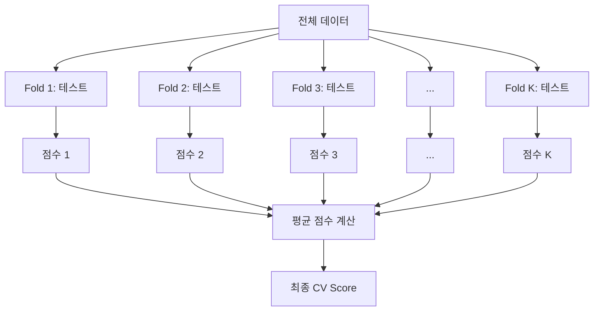
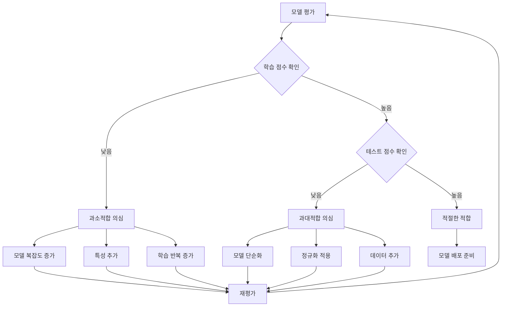
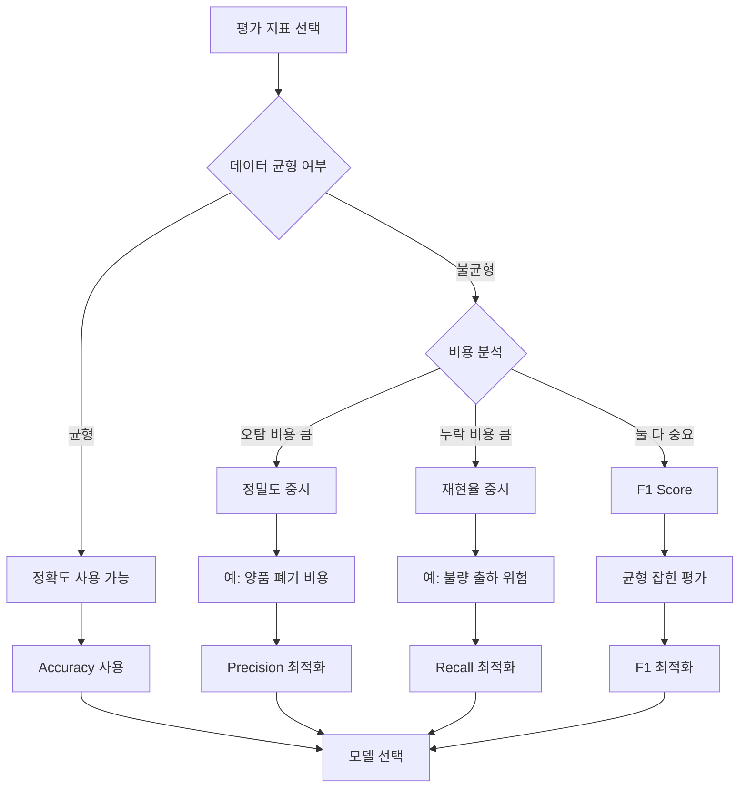

# 17차시: 모델 평가와 반복 검증

## 학습 목표

| 번호 | 학습 목표 |
|:----:|----------|
| 1 | 교차검증의 원리와 K-Fold 수식을 이해함 |
| 2 | 과대적합/과소적합을 학습 곡선으로 진단함 |
| 3 | 정밀도, 재현율, F1, ROC-AUC 등 평가 지표를 활용함 |

---

## 강의 구성

| 파트 | 주제 | 핵심 내용 | 시간 |
|:----:|------|----------|:----:|
| 1 | 교차검증 원리 | K-Fold, cross_val_score, 수학적 배경 | 8분 |
| 2 | 적합도 진단 | 과대적합, 과소적합, 학습/검증 곡선 | 8분 |
| 3 | 평가 지표 심화 | 정밀도, 재현율, F1, ROC-AUC | 9분 |

---

## Part 1: 교차검증의 원리

### 1.1 기존 평가 방식의 문제점

단순 학습/테스트 분할의 구조:

```
       전체 데이터
           |
    +------+------+
    |             |
 학습 80%     테스트 20%
```

**문제점**

| 문제 | 설명 |
|------|------|
| 분할 의존성 | 데이터 분할 방식에 따라 결과가 달라짐 |
| 우연의 영향 | 테스트 세트가 우연히 쉬운 데이터일 수 있음 |
| 낮은 신뢰도 | 한 번의 평가로는 모델 성능을 정확히 파악하기 어려움 |
| 데이터 낭비 | 테스트 세트는 학습에 활용되지 않음 |

---

### 1.2 교차검증 (Cross-Validation) 개념

데이터를 여러 번 나누어 평가하고 평균을 내는 방법임.

**핵심 아이디어**
- 모든 데이터가 한 번씩 테스트에 사용됨
- 여러 번 평가하여 평균과 표준편차를 확인함
- 운에 덜 의존하는 신뢰할 수 있는 평가임



---

### 1.3 K-Fold 교차검증의 수학적 배경

가장 많이 사용하는 교차검증 방법임.

**K-Fold 교차검증 점수 공식**

$$CV_{score} = \frac{1}{K}\sum_{k=1}^{K}Score_k$$

| 기호 | 의미 |
|------|------|
| $K$ | 전체 Fold 수 (보통 5 또는 10) |
| $Score_k$ | k번째 Fold에서의 검증 점수 |
| $CV_{score}$ | 최종 교차검증 점수 (평균) |

**계산 예시**

5-Fold 교차검증에서 각 Fold의 점수가 다음과 같은 경우:

| Fold | 점수 |
|:----:|:----:|
| 1 | 0.85 |
| 2 | 0.87 |
| 3 | 0.84 |
| 4 | 0.88 |
| 5 | 0.86 |

$$CV_{score} = \frac{1}{5}(0.85 + 0.87 + 0.84 + 0.88 + 0.86) = \frac{4.30}{5} = 0.86$$

**표준편차 계산**

$$\sigma = \sqrt{\frac{1}{K}\sum_{k=1}^{K}(Score_k - CV_{score})^2}$$

예시 계산:
- 편차 제곱의 합: $(0.85-0.86)^2 + (0.87-0.86)^2 + (0.84-0.86)^2 + (0.88-0.86)^2 + (0.86-0.86)^2$
- $= 0.0001 + 0.0001 + 0.0004 + 0.0004 + 0 = 0.001$
- $\sigma = \sqrt{0.001/5} = \sqrt{0.0002} \approx 0.014$

결과: $0.86 \pm 0.014$ (약 1.4%의 변동)

---

### 1.4 K-Fold 분할 시각화

```
K = 5 예시:

Fold 1: [테스트] [학습] [학습] [학습] [학습]
Fold 2: [학습] [테스트] [학습] [학습] [학습]
Fold 3: [학습] [학습] [테스트] [학습] [학습]
Fold 4: [학습] [학습] [학습] [테스트] [학습]
Fold 5: [학습] [학습] [학습] [학습] [테스트]

최종 점수 = (점수1 + 점수2 + ... + 점수5) / 5
```

---

### 1.5 실습: K-Fold 분할 시각화

```python
import numpy as np
import pandas as pd
import matplotlib.pyplot as plt
from sklearn.model_selection import KFold
from sklearn.datasets import load_wine

# 한글 폰트 설정
plt.rcParams['font.family'] = 'Malgun Gothic'
plt.rcParams['axes.unicode_minus'] = False

# 데이터 로딩
wine = load_wine()
X = pd.DataFrame(wine.data, columns=wine.feature_names)
y = wine.target

# K-Fold 분할 시각화
n_samples = len(X)
n_splits = 5
kfold = KFold(n_splits=n_splits, shuffle=True, random_state=42)

fig, ax = plt.subplots(figsize=(12, 4))

for fold_idx, (train_idx, test_idx) in enumerate(kfold.split(X)):
    # 학습 데이터는 파란색, 테스트 데이터는 빨간색
    indices = np.zeros(n_samples)
    indices[test_idx] = 1

    # 막대 그래프로 표현
    for i, val in enumerate(indices):
        color = 'coral' if val == 1 else 'steelblue'
        ax.barh(fold_idx, 1, left=i, height=0.8, color=color, edgecolor='white', linewidth=0.5)

ax.set_yticks(range(n_splits))
ax.set_yticklabels([f'Fold {i+1}' for i in range(n_splits)])
ax.set_xlabel('데이터 인덱스')
ax.set_title('5-Fold 교차검증 데이터 분할')

# 범례
from matplotlib.patches import Patch
legend_elements = [Patch(facecolor='steelblue', label='학습 데이터'),
                   Patch(facecolor='coral', label='테스트 데이터')]
ax.legend(handles=legend_elements, loc='upper right')
plt.tight_layout()
plt.show()

print(f"전체 데이터: {n_samples}개")
print(f"각 Fold 학습 데이터: 약 {int(n_samples * 0.8)}개")
print(f"각 Fold 테스트 데이터: 약 {int(n_samples * 0.2)}개")
```

---

### 1.6 K-Fold 장점과 K 값 선택

**K-Fold 장점**

| 장점 | 설명 |
|------|------|
| 전체 활용 | 모든 데이터가 한 번씩 검증에 사용됨 |
| 평균 성능 | K번 평가해서 평균 성능을 확인함 |
| 안정성 파악 | 표준편차로 안정성을 파악함 |
| 효율성 | 데이터를 효율적으로 사용함 |

**K 값 선택 가이드**

| K 값 | 용도 | 장단점 |
|------|------|--------|
| K = 3 | 데이터가 적을 때 | 빠르지만 분산이 큼 |
| K = 5 | 가장 보편적 | 균형 잡힌 선택 |
| K = 10 | 더 정확한 평가 필요시 | 정확하지만 느림 |
| K = N (LOOCV) | 데이터가 매우 적을 때 | 편향 낮지만 분산 큼 |

---

### 1.7 cross_val_score 사용법

```python
from sklearn.model_selection import cross_val_score
from sklearn.tree import DecisionTreeClassifier

model = DecisionTreeClassifier()

# 5-Fold 교차검증
scores = cross_val_score(model, X, y, cv=5)

print(f"각 Fold 점수: {scores}")
print(f"평균: {scores.mean():.3f}")
print(f"표준편차: {scores.std():.3f}")
```

**결과 해석**
```
각 Fold 점수: [0.85, 0.87, 0.84, 0.86, 0.85]
평균: 0.854
표준편차: 0.011
```
- 평균 85.4%: 일반적인 성능 수준임
- 표준편차 1.1%: 안정적임 (2~3% 이하면 안정적)
- 표준편차가 크면(5% 이상) 모델이나 데이터 확인이 필요함

---

### 1.8 실습: 단일 분할의 불안정성

```python
import numpy as np
import pandas as pd
from sklearn.model_selection import train_test_split
from sklearn.ensemble import RandomForestClassifier
from sklearn.datasets import load_wine

# 데이터 로딩
wine = load_wine()
X = pd.DataFrame(wine.data, columns=wine.feature_names)
y = wine.target

print("[여러 번 train_test_split 결과]")
scores_single = []

for i in range(10):
    X_train, X_test, y_train, y_test = train_test_split(
        X, y, test_size=0.2, random_state=i
    )
    model = RandomForestClassifier(n_estimators=50, random_state=42)
    model.fit(X_train, y_train)
    score = model.score(X_test, y_test)
    scores_single.append(score)
    print(f"  시도 {i+1:2d}: {score:.3f}")

print(f"\n점수 범위: {min(scores_single):.3f} ~ {max(scores_single):.3f}")
print(f"표준편차: {np.std(scores_single):.3f}")
print("-> 같은 모델인데 점수가 불안정함!")
```

**결과 해설**
- 동일한 모델임에도 불구하고 분할 방식에 따라 점수가 달라짐
- 단일 분할만으로는 신뢰할 수 있는 평가가 어려움

---

### 1.9 실습: K-Fold 교차검증

```python
from sklearn.model_selection import cross_val_score, KFold
from sklearn.ensemble import RandomForestClassifier

# cross_val_score 사용
model = RandomForestClassifier(n_estimators=50, random_state=42)
cv_scores = cross_val_score(model, X, y, cv=5)

print("[5-Fold 교차검증 결과]")
for i, score in enumerate(cv_scores, 1):
    print(f"  Fold {i}: {score:.3f}")

print(f"\n평균: {cv_scores.mean():.3f}")
print(f"표준편차: {cv_scores.std():.3f}")
print(f"결과: {cv_scores.mean():.3f} (+/-{cv_scores.std():.3f})")

# CV Score 수식 적용 확인
cv_manual = sum(cv_scores) / len(cv_scores)
print(f"\n[수식 검증]")
print(f"CV_score = (1/K) * sum(Score_k)")
print(f"        = (1/5) * {sum(cv_scores):.3f}")
print(f"        = {cv_manual:.3f}")
```

---

### 1.10 실습: 수동 K-Fold 구현

```python
from sklearn.model_selection import KFold

print("[수동 K-Fold 구현]")
kfold = KFold(n_splits=5, shuffle=True, random_state=42)

manual_scores = []
for fold, (train_idx, test_idx) in enumerate(kfold.split(X), 1):
    X_train, X_test = X.iloc[train_idx], X.iloc[test_idx]
    y_train, y_test = y[train_idx], y[test_idx]

    model = RandomForestClassifier(n_estimators=50, random_state=42)
    model.fit(X_train, y_train)
    score = model.score(X_test, y_test)
    manual_scores.append(score)
    print(f"  Fold {fold}: 학습 {len(train_idx)}개, 테스트 {len(test_idx)}개 -> {score:.3f}")

print(f"\n평균: {np.mean(manual_scores):.3f} (+/-{np.std(manual_scores):.3f})")
```

---

### 1.11 실습: 여러 모델 비교

```python
from sklearn.tree import DecisionTreeClassifier
from sklearn.ensemble import RandomForestClassifier
from sklearn.linear_model import LogisticRegression
from sklearn.neighbors import KNeighborsClassifier
from sklearn.svm import SVC

models = {
    'DecisionTree': DecisionTreeClassifier(max_depth=10),
    'RandomForest': RandomForestClassifier(n_estimators=100),
    'LogisticRegression': LogisticRegression(max_iter=1000),
    'KNN': KNeighborsClassifier(n_neighbors=5),
    'SVM': SVC(kernel='rbf')
}

print(f"{'모델':<20} {'평균':>8} {'표준편차':>8} {'CV Score 수식':>20}")
print("-" * 60)
for name, model in models.items():
    scores = cross_val_score(model, X, y, cv=5)
    cv_formula = f"(1/5)*{sum(scores):.2f}={scores.mean():.3f}"
    print(f"{name:<20} {scores.mean():>8.3f} {scores.std():>8.3f} {cv_formula:>20}")
```

**결과 해설**
- 교차검증을 통해 여러 모델을 공정하게 비교할 수 있음
- 평균 점수와 표준편차를 함께 고려하여 모델을 선택함

---

## Part 2: 과대적합/과소적합 진단

### 2.1 과대적합 vs 과소적합 개념

```
        정확도
          ^
        1.0|     ----------- 학습 점수
           |           \
           |            \
           |             - 테스트 점수
        0.0+-----------------> 모델 복잡도
              과소적합   최적   과대적합
```



---

### 2.2 과소적합 (Underfitting)

모델이 너무 단순한 상태임.

| 항목 | 설명 |
|------|------|
| 증상 | 학습 정확도 낮음, 테스트 정확도도 낮음, 둘 다 비슷하게 낮음 |
| 원인 | 모델이 너무 단순함, 특성이 부족함, 학습이 부족함 |
| 해결 | 모델 복잡도 높이기, 특성 추가, 하이퍼파라미터 조정 |

**과소적합 예시 (수치)**
```
학습 점수: 0.65 (65%)
테스트 점수: 0.62 (62%)
갭: 0.03 (3%)
```
- 갭은 작지만 둘 다 낮음 -> 과소적합

---

### 2.3 과대적합 (Overfitting)

모델이 너무 복잡한 상태임.

| 항목 | 설명 |
|------|------|
| 증상 | 학습 정확도 높음(거의 100%), 테스트 정확도 낮음, 둘 사이 큰 차이 |
| 원인 | 모델이 너무 복잡함, 데이터 부족함, 노이즈까지 학습함 |
| 해결 | 모델 단순화, 데이터 추가, 정규화 적용 |

**과대적합 예시 (수치)**
```
학습 점수: 1.00 (100%)
테스트 점수: 0.75 (75%)
갭: 0.25 (25%)
```
- 학습은 완벽하지만 테스트는 낮음 -> 과대적합

---

### 2.4 적합도 진단 기준표

| 학습 점수 | 테스트 점수 | 갭 | 진단 | 대응 |
|:--------:|:---------:|:---:|:----:|------|
| 낮음 | 낮음 | 작음 | 과소적합 | 모델 복잡도 증가 |
| 높음 | 높음 | 작음 | 적절함 | 모델 채택 |
| 높음 | 낮음 | 큼 | 과대적합 | 정규화, 단순화 |
| 낮음 | 높음 | - | 데이터 문제 | 데이터 점검 |

---

### 2.5 실습: 적합도 진단

```python
from sklearn.tree import DecisionTreeClassifier
from sklearn.model_selection import train_test_split

X_train, X_test, y_train, y_test = train_test_split(
    X, y, test_size=0.2, random_state=42
)

print("[의사결정나무 - max_depth별 성능]")
print(f"{'max_depth':>10} {'학습 점수':>12} {'테스트 점수':>12} {'갭':>8} {'상태':>10}")
print("-" * 56)

results = []
for depth in [1, 2, 3, 5, 7, 10, None]:
    model = DecisionTreeClassifier(max_depth=depth, random_state=42)
    model.fit(X_train, y_train)

    train_score = model.score(X_train, y_train)
    test_score = model.score(X_test, y_test)
    gap = train_score - test_score

    depth_str = str(depth) if depth else "None"

    if gap > 0.15:
        status = "과대적합"
    elif train_score < 0.7:
        status = "과소적합"
    else:
        status = "적절"

    results.append((depth, train_score, test_score, gap, status))
    print(f"{depth_str:>10} {train_score:>12.3f} {test_score:>12.3f} {gap:>8.3f} {status:>10}")
```

**결과 해설**
- max_depth가 낮으면 과소적합 발생 가능함
- max_depth가 없으면(None) 과대적합 위험이 있음
- 학습/테스트 점수 차이(갭)가 0.15 이상이면 과대적합을 의심함

---

### 2.6 학습 곡선 (Learning Curve) 이론

데이터 양에 따른 성능 변화를 확인함.

```
      정확도
        ^
        |  ----------- 학습 점수
        |     /
        |   /
        | /----------- 검증 점수
        +-----------------> 데이터 양
```

**학습 곡선 해석 패턴**

| 패턴 | 의미 | 대응 |
|------|------|------|
| 두 곡선이 수렴 | 좋은 모델 | 모델 채택 |
| 학습만 높음 | 과대적합 | 데이터 추가, 정규화 |
| 둘 다 낮음 | 과소적합 | 모델 복잡도 증가 |
| 큰 갭 유지 | 과대적합 | 모델 단순화 |

---

### 2.7 실습: 학습 곡선 시각화

```python
import matplotlib.pyplot as plt
from sklearn.model_selection import learning_curve
from sklearn.ensemble import RandomForestClassifier

plt.rcParams['font.family'] = 'Malgun Gothic'
plt.rcParams['axes.unicode_minus'] = False

model = RandomForestClassifier(n_estimators=50, random_state=42)

train_sizes, train_scores, val_scores = learning_curve(
    model, X, y, cv=5,
    train_sizes=[0.1, 0.2, 0.4, 0.6, 0.8, 1.0],
    random_state=42
)

print("[학습 곡선 데이터]")
print(f"{'학습 데이터':>12} {'학습 점수':>12} {'검증 점수':>12} {'갭':>8}")
print("-" * 48)

for size, train_mean, val_mean in zip(
    train_sizes,
    train_scores.mean(axis=1),
    val_scores.mean(axis=1)
):
    gap = train_mean - val_mean
    print(f"{size:>12} {train_mean:>12.3f} {val_mean:>12.3f} {gap:>8.3f}")

# 시각화
fig, ax = plt.subplots(figsize=(10, 6))

ax.plot(train_sizes, train_scores.mean(axis=1), 'o-', label='학습 점수', color='blue', linewidth=2)
ax.fill_between(train_sizes,
                  train_scores.mean(axis=1) - train_scores.std(axis=1),
                  train_scores.mean(axis=1) + train_scores.std(axis=1),
                  alpha=0.2, color='blue')

ax.plot(train_sizes, val_scores.mean(axis=1), 'o-', label='검증 점수', color='orange', linewidth=2)
ax.fill_between(train_sizes,
                  val_scores.mean(axis=1) - val_scores.std(axis=1),
                  val_scores.mean(axis=1) + val_scores.std(axis=1),
                  alpha=0.2, color='orange')

ax.set_xlabel('학습 데이터 수', fontsize=12)
ax.set_ylabel('점수', fontsize=12)
ax.set_title('학습 곡선 (Learning Curve)', fontsize=14)
ax.legend(loc='lower right', fontsize=11)
ax.grid(True, alpha=0.3)
ax.set_ylim(0.5, 1.05)

plt.tight_layout()
plt.show()
```

---

### 2.8 검증 곡선 (Validation Curve) 이론

하이퍼파라미터 값에 따른 성능 변화를 확인함.

```
      정확도
        ^
        |      /---------\
        |     /           \---- 학습 점수
        |    /  ----\
        |   /        \--------- 검증 점수
        +-------------------------> 하이퍼파라미터 값
          최적값
```

**검증 곡선 활용**
- 최적의 하이퍼파라미터 값을 찾음
- 과대/과소적합이 발생하는 구간을 확인함
- 다음 차시(모델 설정값 최적화)의 기초가 됨

---

### 2.9 실습: 검증 곡선 시각화

```python
from sklearn.model_selection import validation_curve
from sklearn.tree import DecisionTreeClassifier

param_range = [1, 2, 3, 5, 7, 10, 15, 20]

train_scores_vc, val_scores_vc = validation_curve(
    DecisionTreeClassifier(random_state=42),
    X, y,
    param_name="max_depth",
    param_range=param_range,
    cv=5
)

print("[max_depth별 검증 곡선]")
print(f"{'max_depth':>10} {'학습 점수':>12} {'검증 점수':>12} {'갭':>8}")
print("-" * 44)

for depth, train_mean, val_mean in zip(
    param_range,
    train_scores_vc.mean(axis=1),
    val_scores_vc.mean(axis=1)
):
    gap = train_mean - val_mean
    print(f"{depth:>10} {train_mean:>12.3f} {val_mean:>12.3f} {gap:>8.3f}")

# 최적 max_depth
best_idx = np.argmax(val_scores_vc.mean(axis=1))
best_depth = param_range[best_idx]
print(f"\n최적 max_depth: {best_depth} (검증 점수: {val_scores_vc.mean(axis=1)[best_idx]:.3f})")

# 시각화
fig, ax = plt.subplots(figsize=(10, 6))

ax.plot(param_range, train_scores_vc.mean(axis=1), 'o-', label='학습 점수', color='blue', linewidth=2)
ax.fill_between(param_range,
                train_scores_vc.mean(axis=1) - train_scores_vc.std(axis=1),
                train_scores_vc.mean(axis=1) + train_scores_vc.std(axis=1),
                alpha=0.2, color='blue')

ax.plot(param_range, val_scores_vc.mean(axis=1), 'o-', label='검증 점수', color='orange', linewidth=2)
ax.fill_between(param_range,
                val_scores_vc.mean(axis=1) - val_scores_vc.std(axis=1),
                val_scores_vc.mean(axis=1) + val_scores_vc.std(axis=1),
                alpha=0.2, color='orange')

ax.axvline(x=best_depth, color='green', linestyle='--', label=f'최적 max_depth={best_depth}')

ax.set_xlabel('max_depth', fontsize=12)
ax.set_ylabel('점수', fontsize=12)
ax.set_title('검증 곡선 (Validation Curve) - DecisionTree max_depth', fontsize=14)
ax.legend(loc='lower right', fontsize=11)
ax.grid(True, alpha=0.3)
ax.set_ylim(0.5, 1.05)

plt.tight_layout()
plt.show()
```

---

## Part 3: 평가 지표 심화

### 3.1 정확도의 한계

불균형 데이터에서 정확도만으로는 부족함.

**예시**: 불량률 1%인 경우
- 전부 "정상"으로 예측해도 정확도 99%임
- 실제로는 불량을 전혀 찾지 못함

**불균형 데이터 예시**
```
전체 1000개 제품:
- 정상: 990개 (99%)
- 불량: 10개 (1%)

모든 것을 "정상"으로 예측:
- 정확도 = 990/1000 = 99%
- 불량 검출률 = 0/10 = 0%
```

---

### 3.2 혼동 행렬 (Confusion Matrix)

|  | 예측: 정상 (Negative) | 예측: 불량 (Positive) |
|--|-----------|-----------|
| **실제: 정상** | TN (True Negative) | FP (False Positive) |
| **실제: 불량** | FN (False Negative) | TP (True Positive) |

| 약어 | 의미 | 설명 | 제조 현장 예시 |
|------|------|------|----------------|
| TN | True Negative | 정상을 정상으로 맞춤 | 양품을 양품으로 판정 |
| TP | True Positive | 불량을 불량으로 맞춤 | 불량품을 불량으로 판정 |
| FP | False Positive | 정상을 불량으로 틀림 | 양품을 불량으로 오판 (과검출) |
| FN | False Negative | 불량을 정상으로 틀림 | 불량품을 양품으로 오판 (누락) |

---

### 3.3 정밀도 (Precision)

"불량이라고 예측한 것 중 실제 불량 비율"

$$Precision = \frac{TP}{TP + FP}$$

**계산 예시**

| 항목 | 값 |
|------|:---:|
| TP (실제 불량, 예측 불량) | 80 |
| FP (실제 정상, 예측 불량) | 20 |

$$Precision = \frac{80}{80 + 20} = \frac{80}{100} = 0.80 = 80\%$$

**해석**: 불량이라고 예측한 100개 중 80개가 실제 불량임

**정밀도가 중요한 경우**
- 오탐(FP) 비용이 클 때
- 예: 정상 제품을 버리면 손해
- 예: 스팸 필터에서 정상 메일 차단

---

### 3.4 재현율 (Recall)

"실제 불량 중 불량으로 예측한 비율" (= 민감도, Sensitivity)

$$Recall = \frac{TP}{TP + FN}$$

**계산 예시**

| 항목 | 값 |
|------|:---:|
| TP (실제 불량, 예측 불량) | 80 |
| FN (실제 불량, 예측 정상) | 20 |

$$Recall = \frac{80}{80 + 20} = \frac{80}{100} = 0.80 = 80\%$$

**해석**: 실제 불량 100개 중 80개를 불량으로 검출함

**재현율이 중요한 경우**
- 누락(FN) 비용이 클 때
- 예: 불량 제품이 출하되면 큰 문제
- 예: 암 진단에서 환자 누락
- 예: 금융 사기 탐지

---

### 3.5 F1 점수

정밀도와 재현율의 조화 평균임.

$$F1 = 2 \times \frac{Precision \times Recall}{Precision + Recall}$$

**계산 예시**

| 항목 | 값 |
|------|:---:|
| Precision | 0.80 |
| Recall | 0.70 |

$$F1 = 2 \times \frac{0.80 \times 0.70}{0.80 + 0.70} = 2 \times \frac{0.56}{1.50} = 2 \times 0.373 = 0.747$$

**왜 조화 평균인가?**
- 산술 평균: $(0.80 + 0.70) / 2 = 0.75$
- 조화 평균: $0.747$
- 조화 평균은 낮은 값에 더 큰 가중치를 둠
- 한쪽만 높으면 F1도 낮아짐

**F1 점수 예시 비교**

| 케이스 | Precision | Recall | 산술평균 | F1 (조화평균) |
|--------|:---------:|:------:|:--------:|:-------------:|
| 균형 | 0.80 | 0.80 | 0.80 | 0.80 |
| 불균형 A | 0.95 | 0.50 | 0.725 | 0.655 |
| 불균형 B | 0.50 | 0.95 | 0.725 | 0.655 |

---

### 3.6 평가지표 선택 가이드



**상황별 지표 선택**

| 상황 | 권장 지표 | 이유 |
|------|----------|------|
| 균형 데이터 | Accuracy | 단순하고 직관적임 |
| 불균형 + 오탐 비용 큼 | Precision | FP 최소화 |
| 불균형 + 누락 비용 큼 | Recall | FN 최소화 |
| 불균형 + 균형 필요 | F1 Score | 조화 평균 |
| 확률 기반 순위 필요 | ROC-AUC | 임계값 독립 평가 |

---

### 3.7 ROC 곡선과 AUC

**ROC (Receiver Operating Characteristic) 곡선**

다양한 임계값에서 TPR과 FPR의 관계를 나타낸 곡선임.

- **TPR (True Positive Rate)**: 재현율과 동일 = $\frac{TP}{TP + FN}$
- **FPR (False Positive Rate)**: $\frac{FP}{FP + TN}$

**AUC (Area Under Curve) 계산 개념**

$$AUC = \int_{0}^{1} TPR(FPR^{-1}(x))dx$$

| AUC 값 | 해석 |
|:------:|------|
| 1.0 | 완벽한 분류기 |
| 0.9-1.0 | 우수함 |
| 0.8-0.9 | 좋음 |
| 0.7-0.8 | 보통 |
| 0.5-0.7 | 개선 필요 |
| 0.5 | 랜덤 분류기 수준 |

**AUC의 의미**
- 임의의 양성 샘플이 임의의 음성 샘플보다 높은 점수를 받을 확률임
- AUC = 0.85: 랜덤으로 뽑은 불량품이 랜덤으로 뽑은 양품보다 높은 점수를 받을 확률이 85%

---

### 3.8 실습: 혼동 행렬 히트맵 시각화

```python
import matplotlib.pyplot as plt
import seaborn as sns
from sklearn.metrics import confusion_matrix, classification_report
from sklearn.metrics import accuracy_score, precision_score, recall_score, f1_score
from sklearn.ensemble import RandomForestClassifier
from sklearn.model_selection import train_test_split

# 데이터 분할
X_train, X_test, y_train, y_test = train_test_split(
    X, y, test_size=0.2, random_state=42
)

# 모델 학습 및 예측
model = RandomForestClassifier(n_estimators=50, random_state=42)
model.fit(X_train, y_train)
y_pred = model.predict(X_test)

# 혼동행렬
cm = confusion_matrix(y_test, y_pred)
print("[혼동행렬]")
print(cm)

# 혼동행렬 히트맵 시각화
fig, ax = plt.subplots(figsize=(8, 6))
sns.heatmap(cm, annot=True, fmt='d', cmap='Blues',
            xticklabels=wine.target_names,
            yticklabels=wine.target_names,
            ax=ax)
ax.set_xlabel('예측값', fontsize=12)
ax.set_ylabel('실제값', fontsize=12)
ax.set_title('혼동 행렬 (Confusion Matrix)', fontsize=14)
plt.tight_layout()
plt.show()

# 각 셀 해석
print("\n[혼동행렬 해석]")
for i, true_class in enumerate(wine.target_names):
    for j, pred_class in enumerate(wine.target_names):
        count = cm[i, j]
        if i == j:
            print(f"  {true_class} -> {pred_class}: {count}개 (정분류)")
        else:
            print(f"  {true_class} -> {pred_class}: {count}개 (오분류)")
```

---

### 3.9 실습: 분류 평가 지표 계산

```python
from sklearn.metrics import accuracy_score, precision_score, recall_score, f1_score

# 평가 지표 계산
accuracy = accuracy_score(y_test, y_pred)
precision = precision_score(y_test, y_pred, average='weighted')
recall = recall_score(y_test, y_pred, average='weighted')
f1 = f1_score(y_test, y_pred, average='weighted')

print(f"[평가 지표 (weighted average)]")
print(f"정확도 (Accuracy):  {accuracy:.3f}")
print(f"정밀도 (Precision): {precision:.3f}")
print(f"재현율 (Recall):    {recall:.3f}")
print(f"F1 Score:           {f1:.3f}")

# 수식 검증 (클래스 0 기준)
print("\n[클래스 0 (class_0) 수식 검증]")
# 이진 분류로 변환하여 계산
y_test_binary = (y_test == 0).astype(int)
y_pred_binary = (y_pred == 0).astype(int)

TP = ((y_test_binary == 1) & (y_pred_binary == 1)).sum()
TN = ((y_test_binary == 0) & (y_pred_binary == 0)).sum()
FP = ((y_test_binary == 0) & (y_pred_binary == 1)).sum()
FN = ((y_test_binary == 1) & (y_pred_binary == 0)).sum()

print(f"TP={TP}, TN={TN}, FP={FP}, FN={FN}")

precision_manual = TP / (TP + FP) if (TP + FP) > 0 else 0
recall_manual = TP / (TP + FN) if (TP + FN) > 0 else 0
f1_manual = 2 * (precision_manual * recall_manual) / (precision_manual + recall_manual) if (precision_manual + recall_manual) > 0 else 0

print(f"\nPrecision = TP/(TP+FP) = {TP}/({TP}+{FP}) = {precision_manual:.3f}")
print(f"Recall = TP/(TP+FN) = {TP}/({TP}+{FN}) = {recall_manual:.3f}")
print(f"F1 = 2*(P*R)/(P+R) = 2*({precision_manual:.3f}*{recall_manual:.3f})/({precision_manual:.3f}+{recall_manual:.3f}) = {f1_manual:.3f}")

# classification_report
print("\n[Classification Report]")
print(classification_report(y_test, y_pred, target_names=wine.target_names))
```

---

### 3.10 실습: ROC 곡선 시각화 (이진 분류)

```python
from sklearn.metrics import roc_curve, auc
from sklearn.preprocessing import label_binarize

# 다중 클래스를 이진으로 변환 (class 0 vs 나머지)
y_test_binary = (y_test == 0).astype(int)
y_scores = model.predict_proba(X_test)[:, 0]  # class 0의 확률

# ROC 곡선 계산
fpr, tpr, thresholds = roc_curve(y_test_binary, y_scores)
roc_auc = auc(fpr, tpr)

# 시각화
fig, ax = plt.subplots(figsize=(8, 6))

ax.plot(fpr, tpr, color='darkorange', lw=2,
        label=f'ROC Curve (AUC = {roc_auc:.3f})')
ax.plot([0, 1], [0, 1], color='navy', lw=2, linestyle='--', label='Random (AUC = 0.5)')

ax.fill_between(fpr, tpr, alpha=0.3, color='darkorange')

ax.set_xlim([0.0, 1.0])
ax.set_ylim([0.0, 1.05])
ax.set_xlabel('False Positive Rate (FPR)', fontsize=12)
ax.set_ylabel('True Positive Rate (TPR)', fontsize=12)
ax.set_title('ROC Curve - Wine Class 0 vs Others', fontsize=14)
ax.legend(loc='lower right', fontsize=11)
ax.grid(True, alpha=0.3)

plt.tight_layout()
plt.show()

print(f"[ROC-AUC 해석]")
print(f"AUC = {roc_auc:.3f}")
print(f"-> Class 0을 랜덤한 다른 클래스보다 높게 순위 매길 확률: {roc_auc*100:.1f}%")
```

---

### 3.11 회귀 평가 지표

| 지표 | 수식 | 설명 | 특징 |
|------|------|------|------|
| MSE | $\frac{1}{n}\sum(y_i - \hat{y}_i)^2$ | 평균 제곱 오차 | 큰 오차 강조 |
| RMSE | $\sqrt{MSE}$ | MSE의 제곱근 | 원래 단위 |
| MAE | $\frac{1}{n}\sum\|y_i - \hat{y}_i\|$ | 평균 절대 오차 | 이상치에 강건 |
| R^2 | $1 - \frac{SS_{res}}{SS_{tot}}$ | 결정계수 | 0~1 해석 쉬움 |

---

### 3.12 실습: 회귀 평가 지표 (California Housing)

```python
from sklearn.metrics import mean_squared_error, mean_absolute_error, r2_score
from sklearn.ensemble import RandomForestRegressor
from sklearn.datasets import fetch_california_housing

# 회귀 데이터 로딩
housing = fetch_california_housing()
X_reg = pd.DataFrame(housing.data, columns=housing.feature_names)
y_reg = housing.target

print(f"[California Housing 데이터셋]")
print(f"샘플 수: {len(X_reg)}")
print(f"특성 수: {len(housing.feature_names)}")
print(f"타겟: 주택 가격 중앙값 (단위: $100,000)")

# 샘플링 (학습 시간 단축)
np.random.seed(42)
idx = np.random.choice(len(X_reg), 5000, replace=False)
X_reg = X_reg.iloc[idx].reset_index(drop=True)
y_reg = y_reg[idx]

# 분할
X_train_r, X_test_r, y_train_r, y_test_r = train_test_split(
    X_reg, y_reg, test_size=0.2, random_state=42
)

# 모델 학습
model_reg = RandomForestRegressor(n_estimators=50, random_state=42)
model_reg.fit(X_train_r, y_train_r)
y_pred_r = model_reg.predict(X_test_r)

# 평가 지표 계산
mse = mean_squared_error(y_test_r, y_pred_r)
rmse = np.sqrt(mse)
mae = mean_absolute_error(y_test_r, y_pred_r)
r2 = r2_score(y_test_r, y_pred_r)

print("\n[회귀 평가 지표]")
print(f"MSE:  {mse:.4f} (평균 제곱 오차)")
print(f"RMSE: {rmse:.4f} (MSE의 제곱근)")
print(f"MAE:  {mae:.4f} (평균 절대 오차)")
print(f"R^2:  {r2:.3f} (결정계수, 1에 가까울수록 좋음)")

print("\n[지표 해석]")
print(f"-> 평균적으로 ${rmse*100000:,.0f} 정도의 오차")
print(f"-> 모델이 데이터 변동의 {r2*100:.1f}%를 설명")

# 회귀 교차검증
from sklearn.model_selection import cross_val_score

cv_scores_r2 = cross_val_score(model_reg, X_reg, y_reg, cv=5, scoring='r2')
cv_scores_rmse = -cross_val_score(model_reg, X_reg, y_reg, cv=5, scoring='neg_root_mean_squared_error')

print("\n[회귀 교차검증 결과]")
print(f"R^2: {cv_scores_r2.mean():.3f} (+/- {cv_scores_r2.std():.3f})")
print(f"RMSE: {cv_scores_rmse.mean():.3f} (+/- {cv_scores_rmse.std():.3f})")
```

---

### 3.13 실습: 예측값 vs 실제값 시각화

```python
# 예측값 vs 실제값 산점도
fig, axes = plt.subplots(1, 2, figsize=(14, 5))

# 산점도
ax1 = axes[0]
ax1.scatter(y_test_r, y_pred_r, alpha=0.5, s=20)
ax1.plot([y_test_r.min(), y_test_r.max()],
         [y_test_r.min(), y_test_r.max()],
         'r--', lw=2, label='완벽한 예측')
ax1.set_xlabel('실제 값', fontsize=12)
ax1.set_ylabel('예측 값', fontsize=12)
ax1.set_title(f'예측값 vs 실제값 (R^2 = {r2:.3f})', fontsize=14)
ax1.legend()
ax1.grid(True, alpha=0.3)

# 잔차 분포
ax2 = axes[1]
residuals = y_test_r - y_pred_r
ax2.hist(residuals, bins=30, edgecolor='black', alpha=0.7)
ax2.axvline(x=0, color='red', linestyle='--', lw=2, label='0 (완벽한 예측)')
ax2.set_xlabel('잔차 (실제 - 예측)', fontsize=12)
ax2.set_ylabel('빈도', fontsize=12)
ax2.set_title(f'잔차 분포 (MAE = {mae:.3f})', fontsize=14)
ax2.legend()
ax2.grid(True, alpha=0.3)

plt.tight_layout()
plt.show()

print(f"[잔차 통계] 평균: {np.mean(residuals):.4f}, 표준편차: {np.std(residuals):.4f}")
```

---

## 핵심 정리

### 수식 요약

| 지표 | 수식 | 의미 |
|------|------|------|
| CV Score | $\frac{1}{K}\sum_{k=1}^{K}Score_k$ | K개 Fold 점수의 평균 |
| Precision | $\frac{TP}{TP + FP}$ | 예측 양성 중 실제 양성 비율 |
| Recall | $\frac{TP}{TP + FN}$ | 실제 양성 중 예측 양성 비율 |
| F1 Score | $2 \times \frac{P \times R}{P + R}$ | 정밀도와 재현율의 조화 평균 |
| AUC | $\int_{0}^{1} TPR(FPR^{-1}(x))dx$ | ROC 곡선 아래 면적 |

### 개념 요약

| 개념 | 설명 |
|------|------|
| 교차검증 | K번 평가 후 평균 (더 신뢰성 있음) |
| K-Fold | 데이터를 K개로 나눠 순환 평가 |
| 과소적합 | 모델 너무 단순 (둘 다 낮음) |
| 과대적합 | 모델 너무 복잡 (학습만 높음) |
| 학습 곡선 | 데이터 양에 따른 성능 변화 |
| 검증 곡선 | 하이퍼파라미터에 따른 성능 변화 |
| 혼동 행렬 | TP, TN, FP, FN 정리 표 |
| ROC-AUC | 임계값 독립적 분류기 평가 |

---

## 실무 가이드

**권장 사항**

| 항목 | 권장 사항 |
|------|----------|
| 교차검증 | 항상 사용 (최소 5-Fold) |
| 표준편차 | 반드시 확인 (안정성 체크) |
| 불균형 데이터 | F1, 재현율, ROC-AUC 주목 |
| 적합도 진단 | 학습/테스트 점수 차이 모니터링 |
| 시각화 | 학습 곡선, 혼동 행렬 필수 확인 |

**주의 사항**

| 항목 | 주의 사항 |
|------|----------|
| 단일 분할 | 결과만 보지 말 것 |
| 정확도 | 불균형 데이터에서는 부족함 |
| 테스트 세트 | 파라미터 튜닝에 사용하지 말 것 |
| 과대적합 | 학습 점수만 보지 말 것 |

---

## sklearn 주요 함수 요약

```python
# 교차검증 관련
from sklearn.model_selection import (
    cross_val_score,     # 교차검증 점수
    KFold,               # K-Fold 분할기
    learning_curve,      # 학습 곡선
    validation_curve     # 검증 곡선
)

# 분류 평가 지표
from sklearn.metrics import (
    confusion_matrix,        # 혼동행렬
    classification_report,   # 분류 보고서
    accuracy_score,          # 정확도
    precision_score,         # 정밀도
    recall_score,            # 재현율
    f1_score,                # F1 점수
    roc_curve,               # ROC 곡선
    auc                      # AUC 계산
)

# 회귀 평가 지표
from sklearn.metrics import (
    mean_squared_error,      # MSE
    mean_absolute_error,     # MAE
    r2_score                 # R^2 (결정계수)
)
```

---

## 다음 차시 예고

**18차시: 모델 설정값 최적화 (Hyperparameter Tuning)**

| 주제 | 내용 |
|------|------|
| GridSearchCV | 격자 탐색으로 최적 파라미터 찾기 |
| RandomizedSearchCV | 무작위 탐색으로 효율적 튜닝 |
| 파라미터 공간 | 탐색 범위 설정 방법 |
| 실습 | Wine 데이터로 RandomForest 튜닝 |

이번 차시에서 배운 교차검증과 평가 지표를 활용하여, 다음 차시에서는 모델의 하이퍼파라미터를 체계적으로 최적화하는 방법을 학습함.

---

## 실습 과제

### Q4: 모델평가와 교차검증

이번 차시 학습 내용을 바탕으로 실습 과제를 수행합니다.

| 항목 | 내용 |
|------|------|
| **과제 파일** | `실습과제/Q4_모델평가_교차검증.md` |
| **참조 노트북** | `실습과제/Q4_모델평가_교차검증.ipynb` |
| **난이도** | ★★★☆☆ (중급) |

#### 과제 내용
1. Q3 모델의 예측 결과로 혼동행렬 작성
2. TP, TN, FP, FN 각각의 의미 해석 (제조 관점)
3. 정밀도, 재현율, F1 스코어 계산
4. cross_val_score로 5-Fold 교차검증 수행
5. 과적합 여부 판단 및 max_depth 조정 실험

과제를 통해 학습한 내용을 직접 적용해 보세요!