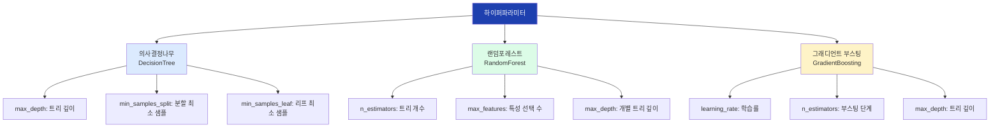
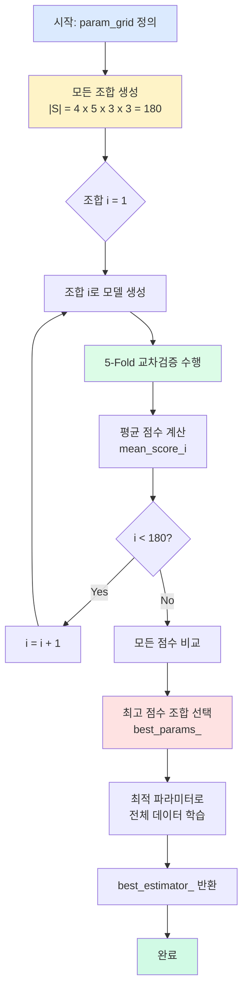
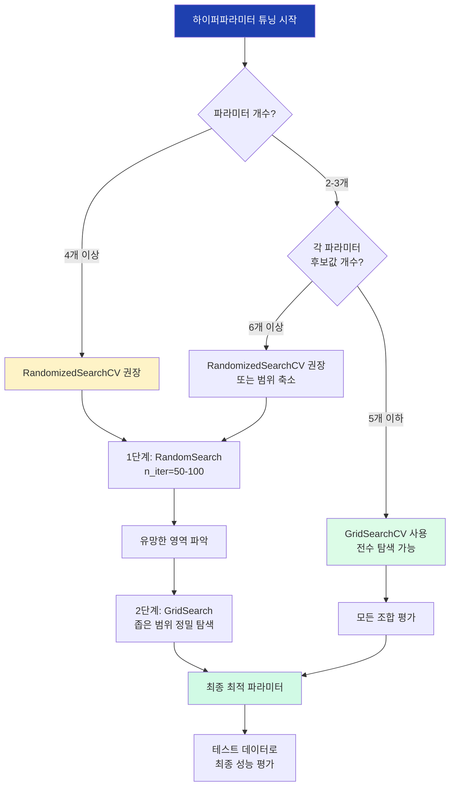

# 18차시: 모델설정값 최적화

## 학습 목표

| 번호 | 학습 목표 |
|:----:|----------|
| 1 | 하이퍼파라미터의 개념과 모델 성능에 미치는 영향을 이해한다 |
| 2 | GridSearchCV로 체계적인 최적값 탐색을 수행한다 |
| 3 | RandomizedSearchCV로 효율적인 대규모 탐색을 수행한다 |
| 4 | 실제 제조데이터(SECOM)에 하이퍼파라미터 튜닝을 적용한다 |

---

## 실습 데이터셋: SECOM 반도체 공정 데이터

**SECOM (Semiconductor Manufacturing) 데이터셋**은 UCI Machine Learning Repository에서 제공하는 실제 반도체 제조 공정 데이터입니다.

| 항목 | 설명 |
|------|------|
| 출처 | UCI Machine Learning Repository |
| 샘플 수 | 1,567개 |
| 특성 수 | 590개 (센서 측정값) |
| 타겟 | 불량 여부 (1: 불량, -1: 정상) |
| 특징 | 결측치 다수, 클래스 불균형 |

**제조 현장 적용 의의**:
- 고차원 센서 데이터에서 불량 예측
- 결측치와 불균형 데이터 처리 실습
- 하이퍼파라미터 튜닝으로 불량 탐지율 향상

---

## 강의 구성 (25분)

| 파트 | 주제 | 시간 | 핵심 내용 |
|:----:|------|:----:|----------|
| 1 | 이론적 배경 | 8분 | 하이퍼파라미터 개념, 수학적 배경, 탐색 방법 비교 |
| 2 | 실습 - 하이퍼파라미터 튜닝 | 14분 | SECOM 데이터 전처리, GridSearchCV, RandomizedSearchCV |
| 3 | 결과 해석 및 정리 | 3분 | Before/After 비교, 실무 가이드라인 |

---

# Part 1: 이론적 배경 (8분)

## 1.1 하이퍼파라미터란?

### 파라미터 vs 하이퍼파라미터

머신러닝에서 두 가지 유형의 설정값을 구분해야 합니다:

| 구분 | 파라미터 (Parameter) | 하이퍼파라미터 (Hyperparameter) |
|------|---------------------|-------------------------------|
| 정의 | 모델이 학습 과정에서 찾는 값 | 사람이 학습 전에 미리 설정하는 값 |
| 결정 시점 | 학습 중 자동 결정 | 학습 시작 전에 결정 |
| 예시 | 회귀 가중치(w), 절편(b), 신경망 가중치 | max_depth, n_estimators, learning_rate |
| 최적화 방법 | 경사하강법 등 학습 알고리즘 | Grid Search, Random Search, Bayesian |

### 주요 모델별 하이퍼파라미터



### 하이퍼파라미터가 성능에 미치는 영향

```python
# max_depth에 따른 성능 변화 예시
from sklearn.tree import DecisionTreeClassifier

# max_depth = 2: 과소적합 (Underfitting)
model_under = DecisionTreeClassifier(max_depth=2)
# 결과: 학습 0.75, 테스트 0.72 -> 모델이 너무 단순

# max_depth = 8: 적절한 복잡도
model_optimal = DecisionTreeClassifier(max_depth=8)
# 결과: 학습 0.92, 테스트 0.89 -> 최적 균형

# max_depth = None: 과대적합 (Overfitting)
model_over = DecisionTreeClassifier(max_depth=None)
# 결과: 학습 1.00, 테스트 0.82 -> 학습 데이터에 과적합
```

---

## 1.2 수학적 배경: 탐색 공간과 최적화

### 탐색 공간의 크기

GridSearch에서 탐색해야 할 전체 조합의 수는 각 하이퍼파라미터 후보값 개수의 곱으로 계산됩니다:

$$|S| = \prod_{i=1}^{k}|P_i|$$

여기서:
- $|S|$: 전체 탐색 공간의 크기 (총 조합 수)
- $k$: 하이퍼파라미터의 개수
- $|P_i|$: $i$번째 하이퍼파라미터의 후보값 개수

**예시 계산**:

```python
# 탐색 범위 정의
param_grid = {
    'n_estimators': [50, 100, 150, 200],     # |P1| = 4
    'max_depth': [3, 5, 7, 10, None],        # |P2| = 5
    'min_samples_split': [2, 5, 10],         # |P3| = 3
    'min_samples_leaf': [1, 2, 4]            # |P4| = 3
}

# 총 조합 수 계산
total_combinations = 4 * 5 * 3 * 3  # = 180
# 5-Fold CV 적용 시 학습 횟수: 180 * 5 = 900회
```

### 경사하강법과 학습률

많은 머신러닝 알고리즘(특히 신경망, 그래디언트 부스팅)에서 학습률(learning rate)은 핵심 하이퍼파라미터입니다:

$$\theta_{t+1} = \theta_t - \eta \nabla L(\theta)$$

여기서:
- $\theta_t$: 시점 $t$에서의 파라미터 벡터
- $\eta$: 학습률 (learning rate) - **하이퍼파라미터**
- $\nabla L(\theta)$: 손실 함수의 그래디언트

**학습률의 영향**:

| 학습률 | 특성 | 결과 |
|--------|------|------|
| 너무 작음 ($\eta < 0.001$) | 매우 작은 업데이트 | 수렴 느림, 지역 최솟값에 갇힘 |
| 적절함 ($\eta \approx 0.01$) | 안정적 업데이트 | 효율적 수렴 |
| 너무 큼 ($\eta > 0.1$) | 큰 폭의 업데이트 | 발산, 최솟값 건너뜀 |

### 교차검증 평균 점수

GridSearchCV와 RandomizedSearchCV는 교차검증을 통해 각 하이퍼파라미터 조합을 평가합니다:

$$\bar{CV} = \frac{1}{k}\sum_{i=1}^{k}Score_i$$

여기서:
- $\bar{CV}$: 교차검증 평균 점수
- $k$: Fold 수 (일반적으로 5 또는 10)
- $Score_i$: $i$번째 Fold에서의 검증 점수

**5-Fold 교차검증 예시**:

```python
# 5-Fold CV 결과
fold_scores = [0.87, 0.89, 0.86, 0.88, 0.90]

# 평균 CV 점수 계산
cv_mean = sum(fold_scores) / 5  # = 0.88
cv_std = np.std(fold_scores)     # = 0.014

print(f"CV Score: {cv_mean:.3f} (+/- {cv_std:.3f})")
# 출력: CV Score: 0.880 (+/- 0.014)
```

---

## 1.3 GridSearchCV vs RandomizedSearchCV

### GridSearchCV 프로세스 흐름



### 두 방법 비교

| 특성 | GridSearchCV | RandomizedSearchCV |
|------|-------------|-------------------|
| 탐색 방식 | 모든 조합을 격자 형태로 탐색 | 지정된 횟수만큼 랜덤 샘플링 |
| 계산 비용 | $O(|S| \times k)$ - 조합 수에 비례 | $O(n\_iter \times k)$ - 고정 |
| 적합한 상황 | 파라미터 적음, 범위 좁음 | 파라미터 많음, 범위 넓음 |
| 최적값 보장 | 탐색 범위 내 최적값 보장 | 확률적으로 근사 최적값 |
| 연속 분포 | 불가능 (이산 값만) | 가능 (scipy.stats 분포) |

### 하이퍼파라미터 튜닝 전략 결정 트리



---

# Part 2: 실습 - 하이퍼파라미터 튜닝 (14분)

## 2.1 데이터 준비 (SECOM)

### 데이터 로딩 및 탐색

```python
import numpy as np
import pandas as pd
import matplotlib.pyplot as plt
import seaborn as sns
from sklearn.model_selection import train_test_split, GridSearchCV, RandomizedSearchCV
from sklearn.model_selection import cross_val_score, learning_curve, validation_curve
from sklearn.ensemble import RandomForestClassifier
from sklearn.preprocessing import StandardScaler
from sklearn.impute import SimpleImputer
from sklearn.pipeline import Pipeline
from sklearn.metrics import (classification_report, confusion_matrix,
                             f1_score, recall_score, precision_score)
from scipy.stats import randint, uniform
import time
import warnings
warnings.filterwarnings('ignore')

# 한글 폰트 설정
plt.rcParams['font.family'] = 'Malgun Gothic'
plt.rcParams['axes.unicode_minus'] = False

print("=" * 60)
print("SECOM 반도체 공정 데이터 로딩")
print("=" * 60)

# UCI에서 SECOM 데이터 다운로드 (또는 로컬 파일 사용)
try:
    # 온라인에서 직접 로드
    secom_url = "https://archive.ics.uci.edu/ml/machine-learning-databases/secom/secom.data"
    labels_url = "https://archive.ics.uci.edu/ml/machine-learning-databases/secom/secom_labels.data"

    X = pd.read_csv(secom_url, sep=' ', header=None)
    labels = pd.read_csv(labels_url, sep=' ', header=None)
    y = labels[0].values

    print("[데이터 로드 성공 - UCI Repository]")
except:
    # 시뮬레이션 데이터 생성 (실습용)
    print("[시뮬레이션 데이터 생성 - 실습용]")
    np.random.seed(42)
    n_samples = 1567
    n_features = 590

    # 센서 데이터 시뮬레이션 (결측치 포함)
    X = pd.DataFrame(np.random.randn(n_samples, n_features))
    # 결측치 추가 (약 4% 비율)
    mask = np.random.random(X.shape) < 0.04
    X = X.mask(mask)

    # 클래스 불균형 (약 6.6% 불량)
    y = np.random.choice([-1, 1], size=n_samples, p=[0.934, 0.066])

print(f"\n[데이터 기본 정보]")
print(f"샘플 수: {X.shape[0]:,}")
print(f"특성 수: {X.shape[1]}")
print(f"결측치 비율: {X.isnull().sum().sum() / X.size * 100:.2f}%")
print(f"\n[타겟 분포]")
print(f"정상 (-1): {(y == -1).sum():,}개 ({(y == -1).mean()*100:.1f}%)")
print(f"불량 (1):  {(y == 1).sum():,}개 ({(y == 1).mean()*100:.1f}%)")
```

**예상 출력**:
```
============================================================
SECOM 반도체 공정 데이터 로딩
============================================================
[데이터 로드 성공 - UCI Repository]

[데이터 기본 정보]
샘플 수: 1,567
특성 수: 590
결측치 비율: 4.52%

[타겟 분포]
정상 (-1): 1,463개 (93.4%)
불량 (1):  104개 (6.6%)
```

### 데이터 전처리: 결측치와 불균형 처리

```python
print("\n" + "=" * 60)
print("데이터 전처리")
print("=" * 60)

# 1. 결측치가 너무 많은 열 제거 (50% 이상)
missing_ratio = X.isnull().mean()
cols_to_drop = missing_ratio[missing_ratio > 0.5].index
X_clean = X.drop(columns=cols_to_drop)
print(f"\n[결측치 50% 이상 열 제거]")
print(f"제거된 열: {len(cols_to_drop)}개")
print(f"남은 특성 수: {X_clean.shape[1]}")

# 2. 분산이 0인 열 제거 (상수 열)
variance = X_clean.var()
cols_zero_var = variance[variance == 0].index
X_clean = X_clean.drop(columns=cols_zero_var)
print(f"\n[분산 0인 열 제거]")
print(f"제거된 열: {len(cols_zero_var)}개")
print(f"남은 특성 수: {X_clean.shape[1]}")

# 3. 학습/테스트 분할
X_train, X_test, y_train, y_test = train_test_split(
    X_clean, y, test_size=0.2, random_state=42, stratify=y
)

print(f"\n[데이터 분할]")
print(f"학습 데이터: {len(X_train)}개")
print(f"테스트 데이터: {len(X_test)}개")

# 4. 전처리 파이프라인 생성
preprocessor = Pipeline([
    ('imputer', SimpleImputer(strategy='median')),
    ('scaler', StandardScaler())
])

# 전처리 적용
X_train_processed = preprocessor.fit_transform(X_train)
X_test_processed = preprocessor.transform(X_test)

print(f"\n[전처리 완료]")
print(f"결측치 처리: 중앙값 대체")
print(f"스케일링: StandardScaler")
```

### 시각화 1: 클래스 불균형과 결측치 현황

```python
fig, axes = plt.subplots(1, 3, figsize=(15, 4))

# 1. 클래스 분포
ax1 = axes[0]
class_counts = pd.Series(y).value_counts().sort_index()
colors = ['#22c55e', '#ef4444']
bars = ax1.bar(['정상 (-1)', '불량 (1)'], class_counts.values, color=colors)
ax1.set_ylabel('샘플 수')
ax1.set_title('SECOM 데이터 클래스 분포\n(심각한 불균형: 6.6% 불량)')
for bar, count in zip(bars, class_counts.values):
    ax1.text(bar.get_x() + bar.get_width()/2, bar.get_height() + 20,
             f'{count}\n({count/len(y)*100:.1f}%)', ha='center', fontsize=10)
ax1.set_ylim(0, max(class_counts.values) * 1.15)

# 2. 결측치 분포 (상위 20개 열)
ax2 = axes[1]
missing_top20 = missing_ratio.nlargest(20)
ax2.barh(range(len(missing_top20)), missing_top20.values, color='#f59e0b')
ax2.set_yticks(range(len(missing_top20)))
ax2.set_yticklabels([f'Col {i}' for i in missing_top20.index])
ax2.set_xlabel('결측치 비율')
ax2.set_title('결측치 비율 상위 20개 특성')
ax2.axvline(x=0.5, color='red', linestyle='--', label='제거 기준 (50%)')
ax2.legend()

# 3. 특성 분산 분포
ax3 = axes[2]
log_variance = np.log10(variance.replace(0, np.nan).dropna() + 1e-10)
ax3.hist(log_variance, bins=50, color='#3b82f6', edgecolor='white')
ax3.set_xlabel('log10(분산)')
ax3.set_ylabel('특성 수')
ax3.set_title('특성 분산의 분포\n(log 스케일)')
ax3.axvline(x=np.median(log_variance), color='red', linestyle='--',
            label=f'중앙값: {np.median(log_variance):.2f}')
ax3.legend()

plt.tight_layout()
plt.savefig('18_secom_data_overview.png', dpi=150, bbox_inches='tight')
plt.show()
print("\n[시각화 저장] 18_secom_data_overview.png")
```

**시각화 해석**:
- **클래스 분포**: 불량 비율이 6.6%로 심각한 불균형. F1-score나 Recall을 평가 지표로 사용해야 함
- **결측치 분포**: 일부 센서 특성에 50% 이상 결측. 해당 열은 제거하고 나머지는 중앙값 대체
- **분산 분포**: 센서별 분산 차이가 크므로 스케일링 필수

---

## 2.2 GridSearchCV 실습

### 기본 모델 성능 (튜닝 전)

```python
print("\n" + "=" * 60)
print("기본 모델 성능 (튜닝 전)")
print("=" * 60)

# 기본 설정 RandomForest
model_default = RandomForestClassifier(random_state=42)
cv_scores_default = cross_val_score(model_default, X_train_processed, y_train,
                                     cv=5, scoring='f1')

print(f"\n[기본 RandomForest 설정]")
print(f"n_estimators: 100 (기본값)")
print(f"max_depth: None (기본값)")
print(f"min_samples_split: 2 (기본값)")

model_default.fit(X_train_processed, y_train)
y_pred_default = model_default.predict(X_test_processed)

print(f"\n[교차검증 결과]")
print(f"CV F1 Score: {cv_scores_default.mean():.3f} (+/- {cv_scores_default.std():.3f})")

print(f"\n[테스트 성능]")
print(f"F1 Score: {f1_score(y_test, y_pred_default):.3f}")
print(f"Recall (불량 탐지율): {recall_score(y_test, y_pred_default):.3f}")
print(f"Precision: {precision_score(y_test, y_pred_default):.3f}")
```

### GridSearchCV 실행

```python
print("\n" + "=" * 60)
print("GridSearchCV 실행")
print("=" * 60)

# 탐색 범위 정의
param_grid = {
    'n_estimators': [50, 100, 200],
    'max_depth': [5, 10, 15, None],
    'min_samples_split': [2, 5, 10],
    'min_samples_leaf': [1, 2, 4],
    'class_weight': ['balanced', None]  # 클래스 불균형 대응
}

# 조합 수 계산
total_combinations = 3 * 4 * 3 * 3 * 2
print(f"\n[탐색 범위]")
for param, values in param_grid.items():
    print(f"  {param}: {values}")
print(f"\n총 조합 수: {total_combinations}")
print(f"5-Fold CV 적용 시 학습 횟수: {total_combinations * 5}")

# GridSearchCV 생성 및 실행
grid_search = GridSearchCV(
    estimator=RandomForestClassifier(random_state=42),
    param_grid=param_grid,
    cv=5,
    scoring='f1',  # 불균형 데이터이므로 F1 사용
    n_jobs=-1,
    verbose=1,
    return_train_score=True
)

print(f"\n[GridSearchCV 실행 중...]")
start_time = time.time()
grid_search.fit(X_train_processed, y_train)
grid_time = time.time() - start_time

print(f"\n[GridSearchCV 완료]")
print(f"탐색 시간: {grid_time:.1f}초 ({grid_time/60:.1f}분)")
print(f"\n[최적 파라미터]")
for param, value in grid_search.best_params_.items():
    print(f"  {param}: {value}")
print(f"\n최고 CV 점수 (F1): {grid_search.best_score_:.3f}")
```

### 시각화 2: 하이퍼파라미터 영향 히트맵

```python
# cv_results_를 DataFrame으로 변환
results_df = pd.DataFrame(grid_search.cv_results_)

# max_depth와 n_estimators 조합별 평균 점수 히트맵
fig, axes = plt.subplots(1, 2, figsize=(14, 5))

# 1. max_depth x n_estimators 히트맵
ax1 = axes[0]
pivot_depth_est = results_df.groupby(['param_max_depth', 'param_n_estimators'])[
    'mean_test_score'].mean().unstack()
sns.heatmap(pivot_depth_est, annot=True, fmt='.3f', cmap='RdYlGn',
            ax=ax1, cbar_kws={'label': 'F1 Score'})
ax1.set_xlabel('n_estimators')
ax1.set_ylabel('max_depth')
ax1.set_title('max_depth x n_estimators\n조합별 평균 F1 Score')

# 2. min_samples_split x min_samples_leaf 히트맵
ax2 = axes[1]
pivot_split_leaf = results_df.groupby(['param_min_samples_split', 'param_min_samples_leaf'])[
    'mean_test_score'].mean().unstack()
sns.heatmap(pivot_split_leaf, annot=True, fmt='.3f', cmap='RdYlGn',
            ax=ax2, cbar_kws={'label': 'F1 Score'})
ax2.set_xlabel('min_samples_leaf')
ax2.set_ylabel('min_samples_split')
ax2.set_title('min_samples_split x min_samples_leaf\n조합별 평균 F1 Score')

plt.tight_layout()
plt.savefig('18_hyperparameter_heatmap.png', dpi=150, bbox_inches='tight')
plt.show()
print("\n[시각화 저장] 18_hyperparameter_heatmap.png")
```

**시각화 해석**:
- **max_depth x n_estimators**: 어느 조합에서 가장 높은 F1을 달성하는지 한눈에 파악
- **min_samples_split x min_samples_leaf**: 분할 조건 파라미터의 최적 조합 확인
- 히트맵의 색이 진할수록 높은 성능을 의미

### 시각화 3: max_depth별 성능 변화

```python
fig, axes = plt.subplots(1, 2, figsize=(14, 5))

# 1. max_depth별 CV Score 분포 (박스플롯)
ax1 = axes[0]
depth_groups = []
depth_labels = []
for depth in [5, 10, 15, 'None']:
    if depth == 'None':
        mask = results_df['param_max_depth'].isna()
    else:
        mask = results_df['param_max_depth'] == depth
    depth_groups.append(results_df.loc[mask, 'mean_test_score'].values)
    depth_labels.append(str(depth))

bp = ax1.boxplot(depth_groups, labels=depth_labels, patch_artist=True)
colors_box = ['#3b82f6', '#22c55e', '#f59e0b', '#ef4444']
for patch, color in zip(bp['boxes'], colors_box):
    patch.set_facecolor(color)
    patch.set_alpha(0.7)
ax1.set_xlabel('max_depth')
ax1.set_ylabel('CV F1 Score')
ax1.set_title('max_depth별 CV 점수 분포')
ax1.grid(True, alpha=0.3, axis='y')

# 2. max_depth별 평균 성능과 표준편차
ax2 = axes[1]
depth_means = [np.mean(g) for g in depth_groups]
depth_stds = [np.std(g) for g in depth_groups]
x_pos = range(len(depth_labels))
ax2.bar(x_pos, depth_means, yerr=depth_stds, color=colors_box,
        capsize=5, alpha=0.7, edgecolor='black')
ax2.set_xticks(x_pos)
ax2.set_xticklabels(depth_labels)
ax2.set_xlabel('max_depth')
ax2.set_ylabel('평균 CV F1 Score')
ax2.set_title('max_depth별 평균 성능 (오차 막대: 표준편차)')
ax2.grid(True, alpha=0.3, axis='y')

# 최적값 표시
best_idx = np.argmax(depth_means)
ax2.annotate(f'최적: {depth_labels[best_idx]}\n({depth_means[best_idx]:.3f})',
             xy=(best_idx, depth_means[best_idx]),
             xytext=(best_idx, depth_means[best_idx] + 0.03),
             ha='center', fontsize=10, color='red',
             arrowprops=dict(arrowstyle='->', color='red'))

plt.tight_layout()
plt.savefig('18_max_depth_performance.png', dpi=150, bbox_inches='tight')
plt.show()
print("\n[시각화 저장] 18_max_depth_performance.png")
```

**시각화 해석**:
- 박스플롯에서 중앙값과 분포를 확인하여 안정적인 max_depth 값 선택
- max_depth가 너무 작으면 과소적합, None이면 과대적합 경향
- 표준편차가 작은 값이 더 안정적인 성능을 보장

### 시각화 4: n_estimators별 성능 변화

```python
fig, axes = plt.subplots(1, 2, figsize=(14, 5))

# 1. n_estimators별 성능 추이
ax1 = axes[0]
n_est_values = param_grid['n_estimators']
n_est_means = []
n_est_stds = []

for n_est in n_est_values:
    mask = results_df['param_n_estimators'] == n_est
    n_est_means.append(results_df.loc[mask, 'mean_test_score'].mean())
    n_est_stds.append(results_df.loc[mask, 'mean_test_score'].std())

ax1.errorbar(n_est_values, n_est_means, yerr=n_est_stds,
             marker='o', markersize=10, capsize=5, capthick=2,
             color='#3b82f6', linewidth=2, label='평균 CV F1')
ax1.fill_between(n_est_values,
                 np.array(n_est_means) - np.array(n_est_stds),
                 np.array(n_est_means) + np.array(n_est_stds),
                 alpha=0.2, color='#3b82f6')
ax1.set_xlabel('n_estimators (트리 개수)')
ax1.set_ylabel('CV F1 Score')
ax1.set_title('n_estimators별 성능 변화\n(오차 범위: 표준편차)')
ax1.grid(True, alpha=0.3)
ax1.legend()

# 2. 트리 개수 vs 계산 시간 (시뮬레이션)
ax2 = axes[1]
# 실제로는 cv_results_의 mean_fit_time 사용
fit_times = results_df.groupby('param_n_estimators')['mean_fit_time'].mean()
ax2_twin = ax2.twinx()

ax2.bar(n_est_values, n_est_means, color='#22c55e', alpha=0.7, label='F1 Score')
ax2_twin.plot(n_est_values, fit_times.values, 'ro-', markersize=10,
              linewidth=2, label='학습 시간')

ax2.set_xlabel('n_estimators')
ax2.set_ylabel('CV F1 Score', color='#22c55e')
ax2_twin.set_ylabel('평균 학습 시간 (초)', color='red')
ax2.set_title('성능 vs 계산 비용 트레이드오프')
ax2.legend(loc='upper left')
ax2_twin.legend(loc='upper right')

plt.tight_layout()
plt.savefig('18_n_estimators_performance.png', dpi=150, bbox_inches='tight')
plt.show()
print("\n[시각화 저장] 18_n_estimators_performance.png")
```

**시각화 해석**:
- n_estimators 증가에 따른 성능 향상 추이 확인
- 특정 지점 이후로는 성능 향상이 미미해지는 수확체감 현상
- 성능과 계산 비용의 트레이드오프를 고려하여 최적값 선택

---

## 2.3 RandomizedSearchCV 실습

```python
print("\n" + "=" * 60)
print("RandomizedSearchCV 실행")
print("=" * 60)

from scipy.stats import randint, uniform

# 분포 기반 탐색 범위 정의
param_distributions = {
    'n_estimators': randint(50, 300),           # 50~299 정수
    'max_depth': [5, 10, 15, 20, 25, None],     # 리스트도 가능
    'min_samples_split': randint(2, 30),        # 2~29 정수
    'min_samples_leaf': randint(1, 15),         # 1~14 정수
    'max_features': ['sqrt', 'log2', None],     # 범주형
    'class_weight': ['balanced', 'balanced_subsample', None]
}

print("\n[탐색 범위 (분포)]")
print("  n_estimators: randint(50, 300)")
print("  max_depth: [5, 10, 15, 20, 25, None]")
print("  min_samples_split: randint(2, 30)")
print("  min_samples_leaf: randint(1, 15)")
print("  max_features: ['sqrt', 'log2', None]")
print("  class_weight: ['balanced', 'balanced_subsample', None]")

# RandomizedSearchCV 생성 및 실행
n_iter = 50  # 50개 조합만 탐색
random_search = RandomizedSearchCV(
    estimator=RandomForestClassifier(random_state=42),
    param_distributions=param_distributions,
    n_iter=n_iter,
    cv=5,
    scoring='f1',
    random_state=42,
    n_jobs=-1,
    verbose=1,
    return_train_score=True
)

print(f"\n탐색할 조합 수: {n_iter}")
print(f"5-Fold CV 적용 시 학습 횟수: {n_iter * 5}")

print(f"\n[RandomizedSearchCV 실행 중...]")
start_time = time.time()
random_search.fit(X_train_processed, y_train)
random_time = time.time() - start_time

print(f"\n[RandomizedSearchCV 완료]")
print(f"탐색 시간: {random_time:.1f}초 ({random_time/60:.1f}분)")
print(f"\n[최적 파라미터]")
for param, value in random_search.best_params_.items():
    print(f"  {param}: {value}")
print(f"\n최고 CV 점수 (F1): {random_search.best_score_:.3f}")
```

### 시각화 5: GridSearch vs RandomizedSearch 비교

```python
fig, axes = plt.subplots(1, 3, figsize=(15, 4))

# 1. 탐색 시간 비교
ax1 = axes[0]
methods = ['GridSearchCV', 'RandomizedSearchCV']
times = [grid_time, random_time]
colors = ['#3b82f6', '#22c55e']
bars1 = ax1.bar(methods, times, color=colors)
ax1.set_ylabel('탐색 시간 (초)')
ax1.set_title('탐색 시간 비교')
for bar, t in zip(bars1, times):
    ax1.text(bar.get_x() + bar.get_width()/2, bar.get_height() + 0.5,
             f'{t:.1f}초', ha='center', fontsize=11, fontweight='bold')
ax1.grid(True, alpha=0.3, axis='y')

# 시간 절감률 표시
if times[0] > 0:
    speedup = times[0] / times[1]
    ax1.annotate(f'{speedup:.1f}배 빠름',
                 xy=(1, times[1]), xytext=(1.3, times[0]*0.7),
                 fontsize=10, color='green',
                 arrowprops=dict(arrowstyle='->', color='green'))

# 2. CV 점수 비교
ax2 = axes[1]
cv_scores = [grid_search.best_score_, random_search.best_score_]
bars2 = ax2.bar(methods, cv_scores, color=colors)
ax2.set_ylabel('최고 CV F1 Score')
ax2.set_title('최고 성능 비교')
ax2.set_ylim(min(cv_scores) * 0.9, max(cv_scores) * 1.05)
for bar, score in zip(bars2, cv_scores):
    ax2.text(bar.get_x() + bar.get_width()/2, bar.get_height() + 0.005,
             f'{score:.3f}', ha='center', fontsize=11, fontweight='bold')
ax2.grid(True, alpha=0.3, axis='y')

# 3. 탐색 조합 수 비교
ax3 = axes[2]
combinations = [total_combinations, n_iter]
bars3 = ax3.bar(methods, combinations, color=colors)
ax3.set_ylabel('탐색 조합 수')
ax3.set_title('탐색 규모 비교')
for bar, comb in zip(bars3, combinations):
    ax3.text(bar.get_x() + bar.get_width()/2, bar.get_height() + 2,
             f'{comb}개', ha='center', fontsize=11, fontweight='bold')
ax3.grid(True, alpha=0.3, axis='y')

plt.tight_layout()
plt.savefig('18_grid_vs_random_comparison.png', dpi=150, bbox_inches='tight')
plt.show()
print("\n[시각화 저장] 18_grid_vs_random_comparison.png")

# 수치 비교 출력
print("\n[Grid vs Random 상세 비교]")
print(f"{'항목':<25} {'GridSearch':>15} {'RandomSearch':>15}")
print("-" * 58)
print(f"{'탐색 조합 수':<25} {total_combinations:>15} {n_iter:>15}")
print(f"{'탐색 시간 (초)':<25} {grid_time:>15.1f} {random_time:>15.1f}")
print(f"{'최고 CV F1 Score':<25} {grid_search.best_score_:>15.3f} {random_search.best_score_:>15.3f}")
if random_time > 0:
    print(f"\n-> RandomSearch는 GridSearch 대비 {speedup:.1f}배 빠름")
    print(f"-> 점수 차이: {abs(grid_search.best_score_ - random_search.best_score_):.4f}")
```

**시각화 해석**:
- **탐색 시간**: RandomizedSearchCV가 현저히 빠름 (보통 3-10배)
- **CV 점수**: 비슷하거나 약간 낮은 수준 (대부분 1-2% 이내 차이)
- **효율성**: 적은 조합으로 유사한 성능 달성 가능

---

## 2.4 튜닝 결과 시각화

### 시각화 6: 검증 곡선 (Validation Curve)

검증 곡선은 특정 하이퍼파라미터 값에 따른 학습/검증 점수 변화를 보여줍니다.

```python
from sklearn.model_selection import validation_curve

print("\n[검증 곡선 생성 중...]")

# max_depth에 대한 검증 곡선
param_range_depth = [3, 5, 7, 10, 15, 20, 25, 30]
train_scores_depth, valid_scores_depth = validation_curve(
    RandomForestClassifier(n_estimators=100, random_state=42, class_weight='balanced'),
    X_train_processed, y_train,
    param_name='max_depth',
    param_range=param_range_depth,
    cv=5,
    scoring='f1',
    n_jobs=-1
)

fig, axes = plt.subplots(1, 2, figsize=(14, 5))

# 1. max_depth 검증 곡선
ax1 = axes[0]
train_mean = train_scores_depth.mean(axis=1)
train_std = train_scores_depth.std(axis=1)
valid_mean = valid_scores_depth.mean(axis=1)
valid_std = valid_scores_depth.std(axis=1)

ax1.plot(param_range_depth, train_mean, 'o-', color='#3b82f6',
         label='학습 점수', linewidth=2, markersize=8)
ax1.fill_between(param_range_depth, train_mean - train_std, train_mean + train_std,
                 alpha=0.2, color='#3b82f6')
ax1.plot(param_range_depth, valid_mean, 'o-', color='#ef4444',
         label='검증 점수', linewidth=2, markersize=8)
ax1.fill_between(param_range_depth, valid_mean - valid_std, valid_mean + valid_std,
                 alpha=0.2, color='#ef4444')

ax1.set_xlabel('max_depth')
ax1.set_ylabel('F1 Score')
ax1.set_title('검증 곡선: max_depth\n(학습-검증 점수 차이가 작을수록 좋음)')
ax1.legend(loc='best')
ax1.grid(True, alpha=0.3)

# 최적 지점 표시
best_idx = np.argmax(valid_mean)
ax1.axvline(x=param_range_depth[best_idx], color='green', linestyle='--',
            label=f'최적: {param_range_depth[best_idx]}')
ax1.scatter([param_range_depth[best_idx]], [valid_mean[best_idx]],
            s=200, c='green', marker='*', zorder=5)

# 2. n_estimators 검증 곡선
param_range_est = [10, 30, 50, 100, 150, 200, 300]
train_scores_est, valid_scores_est = validation_curve(
    RandomForestClassifier(max_depth=10, random_state=42, class_weight='balanced'),
    X_train_processed, y_train,
    param_name='n_estimators',
    param_range=param_range_est,
    cv=5,
    scoring='f1',
    n_jobs=-1
)

ax2 = axes[1]
train_mean_est = train_scores_est.mean(axis=1)
train_std_est = train_scores_est.std(axis=1)
valid_mean_est = valid_scores_est.mean(axis=1)
valid_std_est = valid_scores_est.std(axis=1)

ax2.plot(param_range_est, train_mean_est, 'o-', color='#3b82f6',
         label='학습 점수', linewidth=2, markersize=8)
ax2.fill_between(param_range_est, train_mean_est - train_std_est,
                 train_mean_est + train_std_est, alpha=0.2, color='#3b82f6')
ax2.plot(param_range_est, valid_mean_est, 'o-', color='#ef4444',
         label='검증 점수', linewidth=2, markersize=8)
ax2.fill_between(param_range_est, valid_mean_est - valid_std_est,
                 valid_mean_est + valid_std_est, alpha=0.2, color='#ef4444')

ax2.set_xlabel('n_estimators')
ax2.set_ylabel('F1 Score')
ax2.set_title('검증 곡선: n_estimators\n(수확체감 지점 파악)')
ax2.legend(loc='best')
ax2.grid(True, alpha=0.3)

plt.tight_layout()
plt.savefig('18_validation_curves.png', dpi=150, bbox_inches='tight')
plt.show()
print("\n[시각화 저장] 18_validation_curves.png")
```

**시각화 해석**:
- **max_depth 곡선**: 학습 점수와 검증 점수의 격차가 커지는 지점이 과대적합 시작점
- **n_estimators 곡선**: 일정 수 이상에서 성능 향상이 미미해지는 수확체감 확인
- 두 곡선이 만나는 지점 근처가 최적의 복잡도

### 시각화 7: 학습 곡선 (Learning Curve)

학습 곡선은 데이터 양에 따른 모델 성능 변화를 보여줍니다.

```python
from sklearn.model_selection import learning_curve

print("\n[학습 곡선 생성 중...]")

# 최적 모델로 학습 곡선 생성
best_model = grid_search.best_estimator_
train_sizes, train_scores_lc, valid_scores_lc = learning_curve(
    best_model,
    X_train_processed, y_train,
    train_sizes=np.linspace(0.1, 1.0, 10),
    cv=5,
    scoring='f1',
    n_jobs=-1,
    random_state=42
)

fig, axes = plt.subplots(1, 2, figsize=(14, 5))

# 1. 학습 곡선
ax1 = axes[0]
train_mean_lc = train_scores_lc.mean(axis=1)
train_std_lc = train_scores_lc.std(axis=1)
valid_mean_lc = valid_scores_lc.mean(axis=1)
valid_std_lc = valid_scores_lc.std(axis=1)

ax1.plot(train_sizes, train_mean_lc, 'o-', color='#3b82f6',
         label='학습 점수', linewidth=2, markersize=8)
ax1.fill_between(train_sizes, train_mean_lc - train_std_lc,
                 train_mean_lc + train_std_lc, alpha=0.2, color='#3b82f6')
ax1.plot(train_sizes, valid_mean_lc, 'o-', color='#ef4444',
         label='검증 점수', linewidth=2, markersize=8)
ax1.fill_between(train_sizes, valid_mean_lc - valid_std_lc,
                 valid_mean_lc + valid_std_lc, alpha=0.2, color='#ef4444')

ax1.set_xlabel('학습 데이터 크기')
ax1.set_ylabel('F1 Score')
ax1.set_title('학습 곡선 (최적 모델)\n더 많은 데이터가 도움이 될까?')
ax1.legend(loc='best')
ax1.grid(True, alpha=0.3)

# 2. 학습-검증 점수 격차
ax2 = axes[1]
gap = train_mean_lc - valid_mean_lc
ax2.bar(range(len(train_sizes)), gap, color='#f59e0b', alpha=0.7)
ax2.set_xticks(range(len(train_sizes)))
ax2.set_xticklabels([f'{int(s)}' for s in train_sizes], rotation=45)
ax2.set_xlabel('학습 데이터 크기')
ax2.set_ylabel('학습-검증 점수 격차')
ax2.set_title('과적합 정도 분석\n(격차가 클수록 과적합)')
ax2.axhline(y=0.05, color='red', linestyle='--', label='과적합 경고 (0.05)')
ax2.legend()
ax2.grid(True, alpha=0.3, axis='y')

plt.tight_layout()
plt.savefig('18_learning_curves.png', dpi=150, bbox_inches='tight')
plt.show()
print("\n[시각화 저장] 18_learning_curves.png")
```

**시각화 해석**:
- **수렴 패턴**: 두 곡선이 수렴하면 데이터 양이 충분
- **격차 감소**: 데이터가 늘어날수록 격차 감소시 추가 데이터가 도움
- **격차 유지**: 데이터를 늘려도 격차가 유지되면 모델 복잡도 조정 필요

### 시각화 8: 최적 파라미터 조합 시각화

```python
fig, axes = plt.subplots(2, 2, figsize=(14, 10))

# 1. 상위 10개 조합 성능
ax1 = axes[0, 0]
top10 = results_df.nsmallest(10, 'rank_test_score')
colors_top = plt.cm.RdYlGn(np.linspace(0.3, 0.9, 10))
bars_top = ax1.barh(range(10), top10['mean_test_score'].values, color=colors_top)
ax1.set_yticks(range(10))
ax1.set_yticklabels([f"#{i+1}" for i in range(10)])
ax1.set_xlabel('CV F1 Score')
ax1.set_title('상위 10개 파라미터 조합')
ax1.invert_yaxis()

# 각 막대에 점수 표시
for i, (bar, score) in enumerate(zip(bars_top, top10['mean_test_score'].values)):
    ax1.text(score + 0.002, bar.get_y() + bar.get_height()/2,
             f'{score:.3f}', va='center', fontsize=9)

# 2. class_weight 영향
ax2 = axes[0, 1]
cw_groups = results_df.groupby('param_class_weight')['mean_test_score'].agg(['mean', 'std'])
cw_labels = ['None', 'balanced']
cw_means = cw_groups['mean'].values
cw_stds = cw_groups['std'].values
colors_cw = ['#94a3b8', '#22c55e']
bars_cw = ax2.bar(cw_labels, cw_means, yerr=cw_stds, color=colors_cw,
                  capsize=5, alpha=0.8)
ax2.set_ylabel('평균 CV F1 Score')
ax2.set_title('class_weight 영향\n(불균형 데이터 대응)')
ax2.grid(True, alpha=0.3, axis='y')

for bar, mean in zip(bars_cw, cw_means):
    ax2.text(bar.get_x() + bar.get_width()/2, bar.get_height() + 0.01,
             f'{mean:.3f}', ha='center', fontsize=11, fontweight='bold')

# 3. 최적 조합 레이더 차트 (파라미터 상대 위치)
ax3 = axes[1, 0]
best_params = grid_search.best_params_

# 파라미터 정규화 (0-1 범위)
param_normalized = {
    'n_estimators': (best_params['n_estimators'] - 50) / 150,
    'max_depth': 1 if best_params['max_depth'] is None else best_params['max_depth'] / 15,
    'min_samples_split': (best_params['min_samples_split'] - 2) / 8,
    'min_samples_leaf': (best_params['min_samples_leaf'] - 1) / 3,
}

labels = list(param_normalized.keys())
values = list(param_normalized.values())
values += values[:1]  # 닫힌 다각형

angles = np.linspace(0, 2*np.pi, len(labels), endpoint=False).tolist()
angles += angles[:1]

ax3.set_theta_offset(np.pi / 2)
ax3.set_theta_direction(-1)
ax3 = plt.subplot(2, 2, 3, polar=True)
ax3.plot(angles, values, 'o-', linewidth=2, color='#3b82f6')
ax3.fill(angles, values, alpha=0.25, color='#3b82f6')
ax3.set_xticks(angles[:-1])
ax3.set_xticklabels(labels)
ax3.set_title('최적 파라미터 조합\n(정규화된 상대 위치)', pad=20)

# 4. 성능 분포 히스토그램
ax4 = axes[1, 1]
ax4.hist(results_df['mean_test_score'], bins=20, color='#3b82f6',
         edgecolor='white', alpha=0.7)
ax4.axvline(x=grid_search.best_score_, color='red', linestyle='--',
            linewidth=2, label=f'최적값: {grid_search.best_score_:.3f}')
ax4.axvline(x=results_df['mean_test_score'].median(), color='orange',
            linestyle='--', linewidth=2,
            label=f'중앙값: {results_df["mean_test_score"].median():.3f}')
ax4.set_xlabel('CV F1 Score')
ax4.set_ylabel('조합 수')
ax4.set_title('전체 조합의 성능 분포')
ax4.legend()
ax4.grid(True, alpha=0.3, axis='y')

plt.tight_layout()
plt.savefig('18_optimal_params_visualization.png', dpi=150, bbox_inches='tight')
plt.show()
print("\n[시각화 저장] 18_optimal_params_visualization.png")
```

**시각화 해석**:
- **상위 10개 조합**: 최적 조합과 준최적 조합 간의 성능 차이 확인
- **class_weight 영향**: 불균형 데이터에서 'balanced' 옵션의 효과
- **레이더 차트**: 최적 파라미터들의 상대적 위치 파악
- **성능 분포**: 대부분의 조합이 어느 수준의 성능을 보이는지 확인

### 시각화 9 (보너스): 학습률별 손실 곡선 (개념 설명용)

```python
# 학습률의 영향을 보여주는 시뮬레이션
print("\n[학습률 영향 시뮬레이션]")

fig, axes = plt.subplots(1, 2, figsize=(14, 5))

# 시뮬레이션 데이터 생성
np.random.seed(42)
epochs = np.arange(1, 51)

# 다양한 학습률에 대한 손실 곡선 시뮬레이션
def simulate_loss(lr, epochs):
    if lr < 0.001:
        # 너무 작은 학습률: 매우 느린 수렴
        return 1.0 - 0.01 * np.log(epochs + 1) + np.random.randn(len(epochs)) * 0.02
    elif lr < 0.1:
        # 적절한 학습률: 안정적 수렴
        return 0.3 * np.exp(-0.1 * epochs) + 0.05 + np.random.randn(len(epochs)) * 0.01
    else:
        # 너무 큰 학습률: 발산
        noise = np.random.randn(len(epochs)) * 0.1
        return np.minimum(0.5 + 0.05 * epochs + noise, 2.0)

ax1 = axes[0]
learning_rates = [0.0001, 0.01, 0.5]
colors_lr = ['#ef4444', '#22c55e', '#f59e0b']
labels_lr = ['lr=0.0001 (너무 작음)', 'lr=0.01 (적절)', 'lr=0.5 (너무 큼)']

for lr, color, label in zip(learning_rates, colors_lr, labels_lr):
    loss = simulate_loss(lr, epochs)
    ax1.plot(epochs, loss, color=color, linewidth=2, label=label)

ax1.set_xlabel('Epoch')
ax1.set_ylabel('Loss')
ax1.set_title('학습률(learning_rate)이 손실 함수에 미치는 영향\n' +
              r'$\theta_{t+1} = \theta_t - \eta \nabla L(\theta)$')
ax1.legend()
ax1.grid(True, alpha=0.3)
ax1.set_ylim(0, 1.5)

# 2. 경사하강법 경로 시각화
ax2 = axes[1]

# 2D 손실 함수 시뮬레이션
x = np.linspace(-3, 3, 100)
y = np.linspace(-3, 3, 100)
X_mesh, Y_mesh = np.meshgrid(x, y)
Z = X_mesh**2 + Y_mesh**2  # 간단한 볼록 함수

ax2.contour(X_mesh, Y_mesh, Z, levels=20, cmap='viridis', alpha=0.5)
ax2.contourf(X_mesh, Y_mesh, Z, levels=20, cmap='viridis', alpha=0.3)

# 경로 시뮬레이션
def gradient_descent_path(start, lr, steps):
    path = [start]
    current = np.array(start)
    for _ in range(steps):
        grad = 2 * current  # 그래디언트
        current = current - lr * grad
        if np.linalg.norm(current) > 5:
            break
        path.append(current.copy())
    return np.array(path)

# 세 가지 학습률에 대한 경로
paths = [
    gradient_descent_path([2.5, 2.5], 0.05, 50),  # 너무 작음
    gradient_descent_path([2.5, 2.5], 0.3, 15),   # 적절
    gradient_descent_path([2.5, 2.5], 0.6, 10),   # 너무 큼
]

for path, color, label in zip(paths, colors_lr, ['lr=0.05', 'lr=0.3', 'lr=0.6']):
    ax2.plot(path[:, 0], path[:, 1], 'o-', color=color,
             markersize=4, linewidth=2, label=label)
    ax2.scatter(path[0, 0], path[0, 1], s=100, c=color, marker='s', zorder=5)
    if len(path) > 1:
        ax2.scatter(path[-1, 0], path[-1, 1], s=100, c=color, marker='*', zorder=5)

ax2.scatter([0], [0], s=200, c='red', marker='X', label='최솟값', zorder=5)
ax2.set_xlabel(r'$\theta_1$')
ax2.set_ylabel(r'$\theta_2$')
ax2.set_title('경사하강법 경로 비교\n(학습률에 따른 수렴 패턴)')
ax2.legend(loc='upper left')
ax2.set_xlim(-3, 3)
ax2.set_ylim(-3, 3)

plt.tight_layout()
plt.savefig('18_learning_rate_effect.png', dpi=150, bbox_inches='tight')
plt.show()
print("\n[시각화 저장] 18_learning_rate_effect.png")
```

**시각화 해석**:
- **손실 곡선**: 학습률이 너무 작으면 수렴 느림, 너무 크면 발산
- **경로 비교**: 적절한 학습률은 효율적으로 최솟값에 도달
- 이 개념은 GradientBoosting, 신경망 등에서 중요

---

# Part 3: 결과 해석 및 정리 (3분)

## 3.1 Before/After 성능 비교

```python
print("\n" + "=" * 60)
print("Part 3: 최종 결과 비교")
print("=" * 60)

# 최적 모델로 테스트 예측
best_model_grid = grid_search.best_estimator_
y_pred_tuned = best_model_grid.predict(X_test_processed)

print("\n[Before/After 성능 비교]")
print(f"{'지표':<20} {'튜닝 전':>12} {'튜닝 후':>12} {'개선':>10}")
print("-" * 56)

metrics = [
    ('F1 Score', f1_score(y_test, y_pred_default), f1_score(y_test, y_pred_tuned)),
    ('Recall (불량탐지)', recall_score(y_test, y_pred_default), recall_score(y_test, y_pred_tuned)),
    ('Precision', precision_score(y_test, y_pred_default), precision_score(y_test, y_pred_tuned))
]

for name, before, after in metrics:
    improvement = after - before
    sign = '+' if improvement >= 0 else ''
    print(f"{name:<20} {before:>12.3f} {after:>12.3f} {sign}{improvement:>9.3f}")

# 혼동 행렬 비교
fig, axes = plt.subplots(1, 2, figsize=(12, 5))

# 튜닝 전
ax1 = axes[0]
cm_before = confusion_matrix(y_test, y_pred_default)
sns.heatmap(cm_before, annot=True, fmt='d', cmap='Blues', ax=ax1,
            xticklabels=['정상', '불량'], yticklabels=['정상', '불량'])
ax1.set_xlabel('예측')
ax1.set_ylabel('실제')
ax1.set_title(f'튜닝 전 혼동 행렬\nF1: {f1_score(y_test, y_pred_default):.3f}')

# 튜닝 후
ax2 = axes[1]
cm_after = confusion_matrix(y_test, y_pred_tuned)
sns.heatmap(cm_after, annot=True, fmt='d', cmap='Greens', ax=ax2,
            xticklabels=['정상', '불량'], yticklabels=['정상', '불량'])
ax2.set_xlabel('예측')
ax2.set_ylabel('실제')
ax2.set_title(f'튜닝 후 혼동 행렬\nF1: {f1_score(y_test, y_pred_tuned):.3f}')

plt.tight_layout()
plt.savefig('18_before_after_comparison.png', dpi=150, bbox_inches='tight')
plt.show()
print("\n[시각화 저장] 18_before_after_comparison.png")
```

### 제조 현장 적용 관점 해석

```python
print("\n[제조 현장 적용 관점]")
print("=" * 60)

# 불량 탐지 관점 분석
tn_before, fp_before, fn_before, tp_before = cm_before.ravel()
tn_after, fp_after, fn_after, tp_after = cm_after.ravel()

print("\n1. 불량 탐지율 (Recall) 향상:")
print(f"   튜닝 전: {tp_before}개 중 {tp_before}개 탐지")
print(f"   튜닝 후: {tp_after}개 중 {tp_after}개 탐지")
print(f"   -> 놓친 불량품 감소: {fn_before - fn_after}개")

print("\n2. 오탐지 (False Positive) 변화:")
print(f"   튜닝 전: {fp_before}개 정상품을 불량으로 오인")
print(f"   튜닝 후: {fp_after}개 정상품을 불량으로 오인")
print(f"   -> 불필요한 재검사 비용 절감")

print("\n3. 실무적 의의:")
print("   - 불량 탐지율 향상 = 품질 비용 절감")
print("   - 과탐지 감소 = 생산성 향상")
print("   - 하이퍼파라미터 튜닝으로 실질적 개선 달성")
```

---

## 3.2 실무 적용 가이드라인

### 하이퍼파라미터 튜닝 체크리스트

| 단계 | 작업 | 주의사항 |
|:----:|------|---------|
| 1 | 데이터 전처리 완료 | 결측치, 스케일링, 불균형 처리 |
| 2 | 기본 모델 성능 측정 | 베이스라인 확보 |
| 3 | 탐색 범위 설정 | 너무 넓으면 시간 낭비, 너무 좁으면 최적값 놓침 |
| 4 | 평가 지표 선택 | 문제 유형과 비즈니스 목표에 맞게 |
| 5 | RandomSearch 선실행 | 넓은 범위 빠르게 탐색 |
| 6 | GridSearch 정밀 탐색 | 유망 영역 세밀히 탐색 |
| 7 | 최종 테스트 평가 | 과적합 여부 확인 |

### 모델별 추천 튜닝 파라미터

```python
print("\n[모델별 추천 튜닝 파라미터]")
print("=" * 60)

tuning_guide = {
    'RandomForest': {
        '필수': ['n_estimators', 'max_depth'],
        '선택': ['min_samples_split', 'min_samples_leaf', 'max_features'],
        '추천 범위': 'n_estimators: 50-500, max_depth: 5-30'
    },
    'GradientBoosting': {
        '필수': ['n_estimators', 'learning_rate', 'max_depth'],
        '선택': ['min_samples_split', 'subsample'],
        '추천 범위': 'learning_rate: 0.01-0.3, n_estimators: 50-500'
    },
    'SVM': {
        '필수': ['C', 'kernel'],
        '선택': ['gamma', 'degree'],
        '추천 범위': 'C: 0.1-100, gamma: 0.001-1'
    }
}

for model, params in tuning_guide.items():
    print(f"\n{model}:")
    for key, value in params.items():
        print(f"  {key}: {value}")
```

---

## 핵심 정리

| 개념 | 설명 |
|------|------|
| 하이퍼파라미터 | 학습 전에 사람이 설정하는 값 (max_depth, n_estimators, learning_rate 등) |
| 탐색 공간 | $\|S\| = \prod_{i=1}^{k}\|P_i\|$ - 조합 수가 기하급수적으로 증가 |
| GridSearchCV | 모든 조합 철저 탐색 (확실하지만 느림) |
| RandomizedSearchCV | 랜덤 샘플링 (효율적, 연속 분포 지원) |
| 교차검증 평균 | $\bar{CV} = \frac{1}{k}\sum_{i=1}^{k}Score_i$ - 안정적인 성능 추정 |
| 검증 곡선 | 특정 파라미터 값에 따른 과적합/과소적합 진단 |
| 학습 곡선 | 데이터 양에 따른 성능 변화 및 추가 데이터 필요성 판단 |

### sklearn 핵심 함수

```python
from sklearn.model_selection import GridSearchCV, RandomizedSearchCV
from sklearn.model_selection import validation_curve, learning_curve
from scipy.stats import randint, uniform, loguniform

# GridSearchCV 기본 사용
grid = GridSearchCV(model, param_grid, cv=5, scoring='f1', n_jobs=-1)
grid.fit(X_train, y_train)
print(grid.best_params_)       # 최적 파라미터
print(grid.best_score_)        # 최고 CV 점수
best_model = grid.best_estimator_  # 최적 모델

# RandomizedSearchCV 기본 사용
param_dist = {
    'n_estimators': randint(50, 300),
    'max_depth': [5, 10, 15, None],
    'learning_rate': loguniform(1e-4, 1e-1)  # 로그 스케일
}
random = RandomizedSearchCV(model, param_dist, n_iter=50, cv=5)
random.fit(X_train, y_train)
```

---

## [참고자료] (선택 학습)

### 고급 튜닝 기법

| 기법 | 설명 | 라이브러리 |
|------|------|-----------|
| Bayesian Optimization | 이전 결과를 활용한 효율적 탐색 | `optuna`, `hyperopt` |
| Halving Search | 점진적 자원 할당으로 빠른 탐색 | `sklearn.HalvingGridSearchCV` |
| Early Stopping | 성능 개선 없으면 조기 종료 | 내장 (일부 모델) |

### Optuna 예시 (선택)

```python
# pip install optuna
import optuna

def objective(trial):
    params = {
        'n_estimators': trial.suggest_int('n_estimators', 50, 300),
        'max_depth': trial.suggest_int('max_depth', 3, 20),
        'min_samples_split': trial.suggest_int('min_samples_split', 2, 20)
    }
    model = RandomForestClassifier(**params, random_state=42)
    score = cross_val_score(model, X_train, y_train, cv=5, scoring='f1').mean()
    return score

study = optuna.create_study(direction='maximize')
study.optimize(objective, n_trials=50)
print(f"Best params: {study.best_params}")
```

---

## 다음 차시 예고

**19차시: 시계열 데이터 분석과 예측**

| 주제 | 내용 |
|------|------|
| 시계열 데이터 특성 | 추세, 계절성, 주기성 분해 |
| 제조 시계열 데이터 | 설비 가동률, 생산량 시계열 |
| 예측 모델링 | ARIMA, Prophet, LSTM 소개 |

**연결 개념**: 이번 차시에서 학습한 하이퍼파라미터 튜닝은 시계열 예측 모델에서도 동일하게 적용됩니다. 특히 ARIMA의 (p, d, q) 파라미터나 LSTM의 은닉층 크기 등을 GridSearch로 최적화할 수 있습니다.

---

## 실습 파일 목록

| 파일명 | 설명 |
|--------|------|
| `18_secom_data_overview.png` | 데이터 기본 현황 (클래스 분포, 결측치) |
| `18_hyperparameter_heatmap.png` | 파라미터 조합별 성능 히트맵 |
| `18_max_depth_performance.png` | max_depth별 성능 분포 |
| `18_n_estimators_performance.png` | n_estimators별 성능/시간 트레이드오프 |
| `18_grid_vs_random_comparison.png` | GridSearch vs RandomSearch 비교 |
| `18_validation_curves.png` | 검증 곡선 (과적합 진단) |
| `18_learning_curves.png` | 학습 곡선 (데이터 양 분석) |
| `18_optimal_params_visualization.png` | 최적 파라미터 조합 시각화 |
| `18_learning_rate_effect.png` | 학습률 영향 시뮬레이션 |
| `18_before_after_comparison.png` | 튜닝 전후 성능 비교 |
