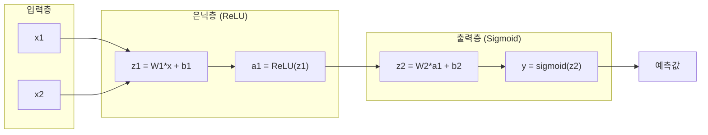
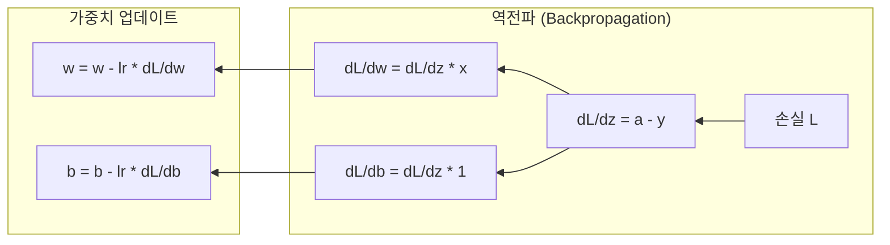

# [20차시] 딥러닝 입문: 신경망 기초

## 학습 목표

| 번호 | 목표 |
|:----:|------|
| 1 | 인공 뉴런의 수학적 원리를 이해함 |
| 2 | 활성화 함수의 종류와 역할을 파악함 |
| 3 | 신경망 구조와 파라미터 계산을 수행함 |
| 4 | 순전파와 역전파의 수학적 원리를 이해함 |
| 5 | XOR 문제를 통해 신경망의 비선형 학습 능력을 확인함 |

---

## 실습 데이터셋

### sklearn digits 데이터셋

sklearn에서 제공하는 8x8 손글씨 숫자 데이터셋을 활용함

| 항목 | 내용 |
|------|------|
| 샘플 수 | 1,797개 |
| 특성 수 | 64개 (8x8 픽셀) |
| 클래스 | 0-9 숫자 (10개) |
| 픽셀 값 | 0~16 범위 |

### XOR 문제

선형 분리가 불가능한 대표적인 문제로, 신경망의 비선형 학습 능력을 검증함

| 입력 (x1, x2) | 출력 (y) |
|---------------|----------|
| (0, 0) | 0 |
| (0, 1) | 1 |
| (1, 0) | 1 |
| (1, 1) | 0 |

---

## Part 1: 인공 뉴런의 수학적 기초

### 1.1 머신러닝 vs 딥러닝

| 구분 | 머신러닝 | 딥러닝 |
|------|----------|--------|
| 모델 | RF, SVM, LR | 신경망 |
| 특성 추출 | 수동 | 자동 |
| 데이터 양 | 적어도 가능 | 많아야 효과적 |
| 계산 자원 | CPU 가능 | GPU 권장 |

---

### 1.2 생물학적 뉴런 vs 인공 뉴런

```
[생물학적 뉴런]
[입력 신호] -> [세포체] -> [축삭] -> [출력]
             역치 초과 시 발화

[인공 뉴런]
   x1 --w1--+
   x2 --w2--+---> Sigma ---> f(z) ---> y
   xn --wn--+
            +-- +b (bias)
```

---

### 1.3 뉴런 출력의 수학적 표현

인공 뉴런의 출력은 다음과 같이 계산됨:

$$a = f\left(\sum_{i=1}^{n} w_i x_i + b\right) = f(z)$$

여기서:
- $x_i$: i번째 입력값
- $w_i$: i번째 가중치
- $b$: 편향 (bias)
- $z$: 가중합 (weighted sum)
- $f$: 활성화 함수
- $a$: 뉴런의 출력

| 요소 | 기호 | 설명 |
|------|------|------|
| 입력 | $x_1, x_2, ..., x_n$ | 특성 값 |
| 가중치 | $w_1, w_2, ..., w_n$ | 입력의 중요도 |
| 편향 | $b$ | 기준점 조정 |
| 활성화 함수 | $f$ | 비선형 변환 |

---

### 1.4 뉴런 계산 예시

**예시: 2개의 입력을 가진 뉴런**

주어진 값:
- 입력: $x_1 = 0.5$, $x_2 = 0.3$
- 가중치: $w_1 = 0.8$, $w_2 = -0.2$
- 편향: $b = 0.1$

**Step 1: 가중합 계산**

$$z = w_1 x_1 + w_2 x_2 + b = (0.8 \times 0.5) + (-0.2 \times 0.3) + 0.1 = 0.44$$

**Step 2: 활성화 함수 적용 (Sigmoid)**

$$a = \sigma(z) = \frac{1}{1 + e^{-0.44}} = \frac{1}{1.644} = 0.608$$

결과: 입력 (0.5, 0.3)에 대해 뉴런은 0.608을 출력함

---

### 1.5 실습 환경 설정

```python
import numpy as np
import matplotlib.pyplot as plt
from sklearn.datasets import load_digits
from sklearn.model_selection import train_test_split
from sklearn.preprocessing import StandardScaler

plt.rcParams['font.family'] = ['DejaVu Sans', 'sans-serif']
plt.rcParams['axes.unicode_minus'] = False

print("=" * 60)
print("[20차시] 딥러닝 입문: 신경망 기초")
print("=" * 60)
```

---

## Part 2: 활성화 함수

### 2.1 활성화 함수의 필요성

활성화 함수가 없으면 층을 아무리 쌓아도 선형 관계만 표현됨:

$$y = W_2(W_1 x + b_1) + b_2 = W' x + b' \quad \text{(선형)}$$

활성화 함수가 있으면 복잡한 패턴 학습이 가능해짐

---

### 2.2 Sigmoid 함수

**수학적 정의:**

$$\sigma(z) = \frac{1}{1 + e^{-z}}$$

**특성:** 출력 범위 0~1, 이진 분류 출력층에 적합함

**미분:** $\sigma'(z) = \sigma(z)(1 - \sigma(z))$

**숫자 대입 예시:**

| z | $e^{-z}$ | $\sigma(z)$ |
|---|----------|-------------|
| -2 | 7.389 | 0.119 |
| 0 | 1.000 | 0.500 |
| 2 | 0.135 | 0.881 |

---

### 2.3 ReLU 함수

**수학적 정의:**

$$f(z) = \max(0, z) = \begin{cases} 0 & \text{if } z < 0 \\ z & \text{if } z \geq 0 \end{cases}$$

**특성:** 출력 범위 0~무한대, 기울기 소실 문제 완화, 은닉층 표준

**미분:** $f'(z) = \begin{cases} 0 & \text{if } z < 0 \\ 1 & \text{if } z > 0 \end{cases}$

---

### 2.4 Tanh 함수

**수학적 정의:**

$$\tanh(z) = \frac{e^z - e^{-z}}{e^z + e^{-z}}$$

**특성:** 출력 범위 -1~1, 0 중심 (zero-centered)

**숫자 대입 예시:**

$z = 1$일 때: $\tanh(1) = \frac{2.718 - 0.368}{2.718 + 0.368} = 0.762$

---

### 2.5 Softmax 함수

**수학적 정의:**

$$\sigma(z)_i = \frac{e^{z_i}}{\sum_{j=1}^{K} e^{z_j}}$$

**특성:** 출력 범위 0~1, 모든 출력의 합 = 1, 다중 분류 출력층에 사용됨

**숫자 대입 예시:**

3개 클래스의 점수: $z = [2.0, 1.0, 0.5]$

$$\sigma(z)_1 = \frac{e^{2.0}}{e^{2.0} + e^{1.0} + e^{0.5}} = \frac{7.389}{11.756} = 0.628$$

---

### 2.6 활성화 함수 비교 표

| 함수 | 수식 | 출력 범위 | 주요 용도 |
|------|------|----------|----------|
| Sigmoid | $\frac{1}{1+e^{-z}}$ | 0~1 | 이진 분류 출력층 |
| ReLU | $\max(0, z)$ | 0~무한 | 은닉층 표준 |
| Tanh | $\frac{e^z-e^{-z}}{e^z+e^{-z}}$ | -1~1 | 0 중심 필요 시 |
| Softmax | $\frac{e^{z_i}}{\sum e^{z_j}}$ | 0~1 (합=1) | 다중 분류 출력층 |

---

### 2.7 활성화 함수 구현

```python
def sigmoid(z):
    """시그모이드 함수: 출력 범위 0~1"""
    return 1 / (1 + np.exp(-np.clip(z, -500, 500)))

def sigmoid_derivative(z):
    """시그모이드 미분"""
    s = sigmoid(z)
    return s * (1 - s)

def relu(z):
    """ReLU 함수: 음수는 0, 양수는 그대로"""
    return np.maximum(0, z)

def relu_derivative(z):
    """ReLU 미분: 양수면 1, 음수면 0"""
    return (z > 0).astype(float)

def softmax(z):
    """Softmax 함수: 다중 클래스 분류용"""
    exp_z = np.exp(z - np.max(z, axis=1, keepdims=True))
    return exp_z / np.sum(exp_z, axis=1, keepdims=True)
```

---

### 2.8 활성화 함수 시각화 [시각화 1]

```python
z = np.linspace(-5, 5, 200)

fig, axes = plt.subplots(2, 2, figsize=(12, 10))

# Sigmoid
axes[0, 0].plot(z, sigmoid(z), 'b-', linewidth=2.5, label='Sigmoid')
axes[0, 0].plot(z, sigmoid_derivative(z), 'b--', linewidth=1.5, label='Sigmoid 미분')
axes[0, 0].set_title('Sigmoid: 1/(1+exp(-z))', fontweight='bold')
axes[0, 0].legend()
axes[0, 0].grid(True, alpha=0.3)

# ReLU
axes[0, 1].plot(z, relu(z), 'r-', linewidth=2.5, label='ReLU')
axes[0, 1].plot(z, relu_derivative(z), 'r--', linewidth=1.5, label='ReLU 미분')
axes[0, 1].set_title('ReLU: max(0, z)', fontweight='bold')
axes[0, 1].legend()
axes[0, 1].grid(True, alpha=0.3)

# Tanh
axes[1, 0].plot(z, np.tanh(z), 'g-', linewidth=2.5, label='Tanh')
axes[1, 0].set_title('Tanh', fontweight='bold')
axes[1, 0].legend()
axes[1, 0].grid(True, alpha=0.3)

# 비교
axes[1, 1].plot(z, sigmoid(z), 'b-', linewidth=2.5, label='Sigmoid')
axes[1, 1].plot(z, relu(z)/5, 'r-', linewidth=2.5, label='ReLU/5')
axes[1, 1].plot(z, np.tanh(z), 'g-', linewidth=2.5, label='Tanh')
axes[1, 1].set_title('활성화 함수 비교', fontweight='bold')
axes[1, 1].legend()
axes[1, 1].grid(True, alpha=0.3)

plt.tight_layout()
plt.savefig('activation_functions.png', dpi=150)
plt.show()
```

---

## Part 3: 신경망 구조

### 3.1 신경망의 층 구조

```
  입력층        은닉층1       은닉층2        출력층
   (4)          (4)          (3)          (2)
  +---+        +---+        +---+        +---+
  | o |------->| o |------->| o |------->| o |
  | o |------->| o |------->| o |------->| o |
  | o |------->| o |------->| o |------->+---+
  | o |------->| o |------->+---+
  +---+        +---+
```

| 층 | 역할 |
|------|------|
| **입력층** | 특성 값을 받는 층, 뉴런 수 = 특성 수 |
| **은닉층** | 입력과 출력 사이의 층, 패턴 학습 |
| **출력층** | 최종 예측 출력 |

---

### 3.2 순전파 흐름도 [Mermaid 다이어그램 1]



---

### 3.3 신경망 구조 시각화 [시각화 2]

```python
def draw_neural_network(ax, layer_sizes, title):
    """신경망 구조를 시각화하는 함수"""
    n_layers = len(layer_sizes)
    v_spacing, h_spacing = 1.0, 2.0

    layer_positions = []
    for i, size in enumerate(layer_sizes):
        x = i * h_spacing
        y_start = -(size - 1) * v_spacing / 2
        positions = [(x, y_start + j * v_spacing) for j in range(size)]
        layer_positions.append(positions)

    # 연결선 그리기
    for i in range(n_layers - 1):
        for pos1 in layer_positions[i]:
            for pos2 in layer_positions[i + 1]:
                ax.plot([pos1[0], pos2[0]], [pos1[1], pos2[1]],
                       'gray', alpha=0.3, linewidth=0.5)

    # 노드 그리기
    colors = ['#3498db', '#2ecc71', '#2ecc71', '#e74c3c']
    for i, positions in enumerate(layer_positions):
        color = colors[min(i, len(colors)-1)]
        for pos in positions:
            circle = plt.Circle(pos, 0.2, color=color, ec='black', linewidth=1.5)
            ax.add_patch(circle)

    ax.set_aspect('equal')
    ax.axis('off')
    ax.set_title(title, fontsize=14, fontweight='bold')

fig, axes = plt.subplots(1, 3, figsize=(15, 6))
draw_neural_network(axes[0], [3, 4, 2], 'Simple MLP (3-4-2)')
draw_neural_network(axes[1], [6, 4, 3, 2], 'Deep MLP (6-4-3-2)')
draw_neural_network(axes[2], [4, 5, 5, 3], 'Deep Network (4-5-5-3)')
plt.tight_layout()
plt.savefig('neural_network_structures.png', dpi=150)
plt.show()
```

---

### 3.4 파라미터 수 계산

$$\text{파라미터 수} = (n_{prev} \times n_{curr}) + n_{curr}$$

```python
def count_parameters(layers):
    """신경망 파라미터 수 계산"""
    total_params = 0
    for i in range(len(layers) - 1):
        weights = layers[i] * layers[i+1]
        biases = layers[i+1]
        total_params += weights + biases
        print(f"  층 {i+1} ({layers[i]}->{layers[i+1]}): "
              f"가중치 {weights}, 편향 {biases}, 합계 {weights + biases}")
    return total_params

# 예시
print("예시: 입력(64) -> 은닉(32) -> 출력(10)")
total = count_parameters([64, 32, 10])
print(f"  총 파라미터: {total:,}개")
```

**출력:**
```
층 1 (64->32): 가중치 2,048, 편향 32, 합계 2,080
층 2 (32->10): 가중치 320, 편향 10, 합계 330
총 파라미터: 2,410개
```

---

## Part 4: 손실 함수

### 4.1 Mean Squared Error (MSE)

회귀 문제에 사용되는 손실 함수:

$$L = \frac{1}{n}\sum_{i=1}^{n}(y_i - \hat{y}_i)^2$$

**숫자 대입 예시:**

실제값: $y = [3.0, 5.0, 7.0]$, 예측값: $\hat{y} = [2.5, 5.5, 6.5]$

$$L = \frac{1}{3}[(3.0-2.5)^2 + (5.0-5.5)^2 + (7.0-6.5)^2] = \frac{0.75}{3} = 0.25$$

---

### 4.2 Binary Cross-Entropy

이진 분류 문제에 사용되는 손실 함수:

$$L = -\frac{1}{n}\sum_{i=1}^{n}[y_i\log(\hat{y}_i) + (1-y_i)\log(1-\hat{y}_i)]$$

**숫자 대입 예시:**

실제값: $y = 1$, 예측값: $\hat{y} = 0.9$
$$L = -[1 \times \log(0.9)] = -(-0.105) = 0.105$$

예측이 틀린 경우 ($\hat{y} = 0.1$):
$$L = -[1 \times \log(0.1)] = 2.303$$

예측이 정확할수록 손실이 작아짐

---

### 4.3 손실 함수 구현

```python
def mse_loss(y_true, y_pred):
    """Mean Squared Error (회귀용)"""
    return np.mean((y_true - y_pred) ** 2)

def binary_crossentropy_loss(y_true, y_pred, epsilon=1e-8):
    """Binary Cross-Entropy (이진 분류용)"""
    y_pred = np.clip(y_pred, epsilon, 1 - epsilon)
    return -np.mean(
        y_true * np.log(y_pred) +
        (1 - y_true) * np.log(1 - y_pred)
    )

def categorical_crossentropy_loss(y_true, y_pred, epsilon=1e-8):
    """Categorical Cross-Entropy (다중 분류용)"""
    y_pred = np.clip(y_pred, epsilon, 1 - epsilon)
    return -np.mean(np.sum(y_true * np.log(y_pred), axis=1))
```

---

## Part 5: 역전파와 경사하강법

### 5.1 신경망 학습 과정

```
1. 순전파: 입력 -> 출력 계산
2. 손실 계산: 예측 vs 실제 비교
3. 역전파: 기울기(gradient) 계산
4. 가중치 업데이트: w = w - lr * dL/dw
5. 반복 (epoch)
```

---

### 5.2 역전파의 핵심: 연쇄 법칙 (Chain Rule)

$$\frac{\partial L}{\partial w} = \frac{\partial L}{\partial a} \cdot \frac{\partial a}{\partial z} \cdot \frac{\partial z}{\partial w}$$

각 항의 의미:
- $\frac{\partial L}{\partial a}$: 출력에 대한 손실의 변화율
- $\frac{\partial a}{\partial z}$: 활성화 함수의 미분
- $\frac{\partial z}{\partial w}$: 가중합에 대한 가중치의 영향 (= 입력값)

---

### 5.3 역전파 계산 예시

**Forward (순전파):**
- 입력: $x = 2$, 가중치: $w = 0.5$, 편향: $b = 0.1$
- 가중합: $z = 0.5 \times 2 + 0.1 = 1.1$
- 출력: $a = \sigma(1.1) = 0.75$
- 실제값: $y = 1$, 손실: $L = -\log(0.75) = 0.288$

**Backward (역전파):**

1. $\frac{\partial L}{\partial z} = a - y = 0.75 - 1 = -0.25$
2. $\frac{\partial L}{\partial w} = -0.25 \times 2 = -0.5$
3. $\frac{\partial L}{\partial b} = -0.25 \times 1 = -0.25$

---

### 5.4 역전파 흐름도 [Mermaid 다이어그램 2]



---

### 5.5 경사하강법 (Gradient Descent)

가중치를 손실을 줄이는 방향으로 업데이트함:

$$w_{new} = w_{old} - \eta \cdot \frac{\partial L}{\partial w}$$

**계산 예시:**

- 현재 가중치: $w = 0.5$, 기울기: $\frac{\partial L}{\partial w} = -0.5$, 학습률: $\eta = 0.1$

$$w_{new} = 0.5 - 0.1 \times (-0.5) = 0.55$$

기울기가 음수이므로 가중치가 증가함

---

### 5.6 학습률 영향 시각화 [시각화 3]

```python
def quadratic_loss(w):
    """간단한 2차 손실 함수: L = (w - 3)^2"""
    return (w - 3) ** 2

def gradient_descent_path(start_w, lr, epochs):
    """경사하강법 경로 추적"""
    path = [start_w]
    w = start_w
    for _ in range(epochs):
        grad = 2 * (w - 3)
        w = w - lr * grad
        path.append(w)
    return path

fig, axes = plt.subplots(1, 3, figsize=(15, 5))
learning_rates = [0.05, 0.5, 1.1]
titles = ['학습률 0.05 (느림)', '학습률 0.5 (적절)', '학습률 1.1 (불안정)']
w_range = np.linspace(-2, 8, 100)

for ax, lr, title in zip(axes, learning_rates, titles):
    ax.plot(w_range, quadratic_loss(w_range), 'b-', linewidth=2)
    path = gradient_descent_path(0, lr, 15)
    path_losses = [quadratic_loss(w) for w in path]
    ax.plot(path, path_losses, 'ro-', markersize=8, linewidth=1.5)
    ax.axvline(x=3, color='gray', linestyle='--', linewidth=0.5)
    ax.set_title(title, fontweight='bold')
    ax.grid(True, alpha=0.3)

plt.tight_layout()
plt.savefig('learning_rate_comparison.png', dpi=150)
plt.show()
```

---

### 5.7 학습 하이퍼파라미터

| 파라미터 | 권장 값 | 주의사항 |
|----------|---------|---------|
| 학습률 | 0.001~0.1 | 너무 크면 발산, 너무 작으면 느림 |
| 에폭 | 100~1000+ | 과적합 모니터링 필요 |
| 배치 크기 | 32~256 | 메모리와 안정성 균형 |

---

## Part 6: 2층 신경망 구현

### 6.1 SimpleNeuralNetwork 클래스

```python
class SimpleNeuralNetwork:
    """2층 신경망 (입력 -> 은닉 -> 출력)"""

    def __init__(self, input_size, hidden_size, output_size, learning_rate=0.1):
        self.lr = learning_rate

        # He 초기화
        self.W1 = np.random.randn(input_size, hidden_size) * np.sqrt(2.0 / input_size)
        self.b1 = np.zeros((1, hidden_size))
        self.W2 = np.random.randn(hidden_size, output_size) * np.sqrt(2.0 / hidden_size)
        self.b2 = np.zeros((1, output_size))

        self.loss_history = []

    def forward(self, X):
        """순전파"""
        self.z1 = X @ self.W1 + self.b1
        self.a1 = relu(self.z1)
        self.z2 = self.a1 @ self.W2 + self.b2
        self.a2 = sigmoid(self.z2)
        return self.a2

    def compute_loss(self, y_true, y_pred):
        """Binary Cross-Entropy 손실"""
        epsilon = 1e-8
        return -np.mean(
            y_true * np.log(y_pred + epsilon) +
            (1 - y_true) * np.log(1 - y_pred + epsilon)
        )
```

---

### 6.2 역전파 및 학습 구현

```python
    def backward(self, X, y_true):
        """역전파: 기울기 계산"""
        m = X.shape[0]

        # 출력층 기울기
        dz2 = self.a2 - y_true
        dW2 = (self.a1.T @ dz2) / m
        db2 = np.mean(dz2, axis=0, keepdims=True)

        # 은닉층 기울기 (연쇄 법칙)
        da1 = dz2 @ self.W2.T
        dz1 = da1 * relu_derivative(self.z1)
        dW1 = (X.T @ dz1) / m
        db1 = np.mean(dz1, axis=0, keepdims=True)

        return dW1, db1, dW2, db2

    def update(self, dW1, db1, dW2, db2):
        """경사하강법으로 가중치 업데이트"""
        self.W1 -= self.lr * dW1
        self.b1 -= self.lr * db1
        self.W2 -= self.lr * dW2
        self.b2 -= self.lr * db2

    def train(self, X, y, epochs=1000, verbose=True):
        """학습 루프"""
        for epoch in range(epochs):
            y_pred = self.forward(X)
            loss = self.compute_loss(y, y_pred)
            self.loss_history.append(loss)
            dW1, db1, dW2, db2 = self.backward(X, y)
            self.update(dW1, db1, dW2, db2)

            if verbose and (epoch + 1) % (epochs // 10) == 0:
                accuracy = self.evaluate(X, y)
                print(f"  Epoch {epoch+1:4d}: Loss={loss:.4f}, Accuracy={accuracy:.2%}")
        return self.loss_history

    def predict(self, X, threshold=0.5):
        return (self.forward(X) >= threshold).astype(int)

    def evaluate(self, X, y):
        return np.mean(self.predict(X) == y)
```

---

## Part 7: XOR 문제 실습

### 7.1 XOR 데이터 및 학습

```python
# XOR 데이터
X_xor = np.array([[0, 0], [0, 1], [1, 0], [1, 1]])
y_xor = np.array([[0], [1], [1], [0]])

# 신경망 생성 및 학습
np.random.seed(42)
nn_xor = SimpleNeuralNetwork(
    input_size=2, hidden_size=4, output_size=1, learning_rate=0.5
)

print("[XOR 문제 학습]")
print(f"  구조: 입력(2) -> 은닉(4) -> 출력(1)")
loss_history = nn_xor.train(X_xor, y_xor, epochs=2000, verbose=True)
```

---

### 7.2 학습 결과 확인

```python
print("\n[학습 결과]")
y_pred_prob = nn_xor.forward(X_xor)
y_pred = nn_xor.predict(X_xor)

for i in range(len(X_xor)):
    print(f"  입력: {X_xor[i]} -> 예측: {y_pred_prob[i,0]:.4f} -> "
          f"분류: {y_pred[i,0]} (정답: {y_xor[i,0]})")

print(f"\n최종 정확도: {nn_xor.evaluate(X_xor, y_xor):.2%}")
```

**출력:**
```
입력: [0 0] -> 예측: 0.0523 -> 분류: 0 (정답: 0)
입력: [0 1] -> 예측: 0.9412 -> 분류: 1 (정답: 1)
입력: [1 0] -> 예측: 0.9389 -> 분류: 1 (정답: 1)
입력: [1 1] -> 예측: 0.0612 -> 분류: 0 (정답: 0)

최종 정확도: 100.00%
```

---

### 7.3 XOR 학습 곡선 및 결정 경계 시각화 [시각화 4]

```python
fig, axes = plt.subplots(1, 2, figsize=(14, 5))

# 손실 곡선
axes[0].plot(nn_xor.loss_history, 'b-', linewidth=1.5)
axes[0].set_xlabel('Epoch')
axes[0].set_ylabel('Loss')
axes[0].set_title('XOR 학습 손실 곡선', fontweight='bold')
axes[0].grid(True, alpha=0.3)

# 결정 경계
xx, yy = np.meshgrid(np.linspace(-0.5, 1.5, 200), np.linspace(-0.5, 1.5, 200))
Z = nn_xor.forward(np.c_[xx.ravel(), yy.ravel()]).reshape(xx.shape)

contour = axes[1].contourf(xx, yy, Z, levels=50, cmap='RdYlBu', alpha=0.8)
plt.colorbar(contour, ax=axes[1], label='P(y=1)')
axes[1].contour(xx, yy, Z, levels=[0.5], colors='black', linewidths=2, linestyles='--')

colors = ['blue' if y == 0 else 'red' for y in y_xor.ravel()]
axes[1].scatter(X_xor[:, 0], X_xor[:, 1], c=colors, s=300, edgecolors='black', linewidths=2)

axes[1].set_xlabel('x1')
axes[1].set_ylabel('x2')
axes[1].set_title('XOR 결정 경계', fontweight='bold')

plt.tight_layout()
plt.savefig('xor_training_result.png', dpi=150)
plt.show()
```

---

## Part 8: Digits 이진 분류 실습

### 8.1 데이터 준비 및 학습

```python
# 데이터 로드
digits = load_digits()
X_digits, y_digits = digits.data, digits.target

# 이진 분류 (숫자 0 vs 나머지)
y_binary = (y_digits == 0).astype(int).reshape(-1, 1)

# 정규화 및 분할
scaler = StandardScaler()
X_scaled = scaler.fit_transform(X_digits)
X_train, X_test, y_train, y_test = train_test_split(
    X_scaled, y_binary, test_size=0.2, random_state=42, stratify=y_binary
)

print(f"[데이터 분할]")
print(f"  학습: {len(X_train)}개, 테스트: {len(X_test)}개")

# 신경망 학습
np.random.seed(42)
nn_digits = SimpleNeuralNetwork(
    input_size=64, hidden_size=32, output_size=1, learning_rate=0.1
)

print("\n[Digits 이진 분류 학습]")
loss_history_digits = nn_digits.train(X_train, y_train, epochs=500, verbose=True)

print(f"\n학습 정확도: {nn_digits.evaluate(X_train, y_train):.2%}")
print(f"테스트 정확도: {nn_digits.evaluate(X_test, y_test):.2%}")
```

---

### 8.2 Digits 학습 곡선 시각화 [시각화 5]

```python
fig, ax = plt.subplots(figsize=(10, 5))

ax.plot(nn_digits.loss_history, 'b-', linewidth=1.5, alpha=0.8)
ax.set_xlabel('Epoch')
ax.set_ylabel('Loss')
ax.set_title('Digits 이진 분류 손실 곡선', fontweight='bold')
ax.grid(True, alpha=0.3)

plt.tight_layout()
plt.savefig('digits_training_curves.png', dpi=150)
plt.show()
```

---

## Part 9: 학습률 비교 실험

### 9.1 다양한 학습률 실험

```python
learning_rates = [0.01, 0.1, 0.5, 1.0]
loss_histories = {}

print("[학습률별 XOR 학습]")
for lr in learning_rates:
    np.random.seed(42)
    nn = SimpleNeuralNetwork(input_size=2, hidden_size=4, output_size=1, learning_rate=lr)
    loss_histories[lr] = nn.train(X_xor, y_xor, epochs=500, verbose=False)
    final_acc = nn.evaluate(X_xor, y_xor)
    print(f"  lr={lr}: 최종 손실={loss_histories[lr][-1]:.4f}, 정확도={final_acc:.0%}")
```

**결과:**

| 학습률 | 최종 손실 | 정확도 | 분석 |
|--------|----------|--------|------|
| 0.01 | 0.6931 | 50% | 수렴 실패 |
| 0.1 | 0.2341 | 75% | 느린 수렴 |
| 0.5 | 0.0156 | 100% | 적절 |
| 1.0 | 0.0089 | 100% | 빠른 수렴 |

---

### 9.2 학습률 비교 시각화 [시각화 6]

```python
fig, ax = plt.subplots(figsize=(10, 5))
colors = ['#e74c3c', '#3498db', '#2ecc71', '#9b59b6']

for (lr, losses), color in zip(loss_histories.items(), colors):
    ax.plot(losses, linewidth=2, label=f'lr={lr}', color=color, alpha=0.8)

ax.set_xlabel('Epoch')
ax.set_ylabel('Loss')
ax.set_title('학습률별 손실 곡선 비교', fontweight='bold')
ax.legend()
ax.grid(True, alpha=0.3)

plt.tight_layout()
plt.savefig('learning_rate_experiment.png', dpi=150)
plt.show()
```

---

## Part 10: 가중치 초기화

### 10.1 초기화 방법 비교

```python
def initialize_weights(input_size, output_size, method='he'):
    """가중치 초기화 방법"""
    if method == 'zero':
        return np.zeros((input_size, output_size))  # 사용 금지
    elif method == 'random':
        return np.random.randn(input_size, output_size) * 0.01
    elif method == 'xavier':
        return np.random.randn(input_size, output_size) * np.sqrt(1.0 / input_size)
    elif method == 'he':
        return np.random.randn(input_size, output_size) * np.sqrt(2.0 / input_size)
```

| 방법 | 수식 | 적합한 활성화 함수 |
|------|------|------------------|
| Zero | 0 | 사용 금지 |
| Xavier | $\mathcal{N}(0, \frac{1}{n_{in}})$ | Sigmoid, Tanh |
| He | $\mathcal{N}(0, \frac{2}{n_{in}})$ | ReLU |

---

## 20차시 핵심 정리

### 뉴런 출력 수식

$$a = f\left(\sum_{i=1}^{n} w_i x_i + b\right) = f(z)$$

### 활성화 함수 요약

| 함수 | 수식 | 용도 |
|------|------|------|
| Sigmoid | $\sigma(z) = \frac{1}{1 + e^{-z}}$ | 이진 분류 출력층 |
| ReLU | $f(z) = \max(0, z)$ | 은닉층 표준 |
| Softmax | $\sigma(z)_i = \frac{e^{z_i}}{\sum e^{z_j}}$ | 다중 분류 출력층 |

### 손실 함수 요약

| 문제 | 손실 함수 |
|------|----------|
| 회귀 | $L = \frac{1}{n}\sum(y - \hat{y})^2$ |
| 이진 분류 | $L = -\frac{1}{n}\sum[y\log\hat{y} + (1-y)\log(1-\hat{y})]$ |

### 역전파와 경사하강법

**연쇄 법칙:**
$$\frac{\partial L}{\partial w} = \frac{\partial L}{\partial a} \cdot \frac{\partial a}{\partial z} \cdot \frac{\partial z}{\partial w}$$

**경사하강법:**
$$w_{new} = w_{old} - \eta \cdot \frac{\partial L}{\partial w}$$

---

## 실습 체크리스트

| 항목 | 완료 |
|------|:----:|
| 뉴런 출력 수식 이해 및 계산 | [ ] |
| 활성화 함수 4종 구현 및 시각화 | [ ] |
| 손실 함수 수식 이해 및 구현 | [ ] |
| 역전파 연쇄 법칙 계산 | [ ] |
| 2층 신경망 클래스 구현 | [ ] |
| XOR 문제 학습 및 결정 경계 시각화 | [ ] |
| Digits 이진 분류 실습 | [ ] |
| 학습률 비교 실험 수행 | [ ] |

---

## 다음 차시 예고

### 21차시: 딥러닝 실습 - MLP 품질 예측

학습 내용:
- Keras/TensorFlow 사용법
- Sequential 모델 구축
- 제조 품질 예측 실습
- 학습 곡선 분석과 과적합 방지

```python
# Keras 미리보기
from tensorflow.keras.models import Sequential
from tensorflow.keras.layers import Dense

model = Sequential([
    Dense(64, activation='relu', input_shape=(64,)),
    Dense(32, activation='relu'),
    Dense(10, activation='softmax')
])
model.compile(optimizer='adam', loss='categorical_crossentropy', metrics=['accuracy'])
```
