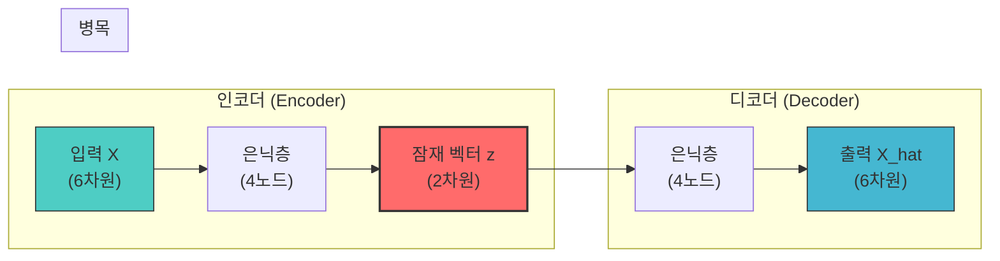
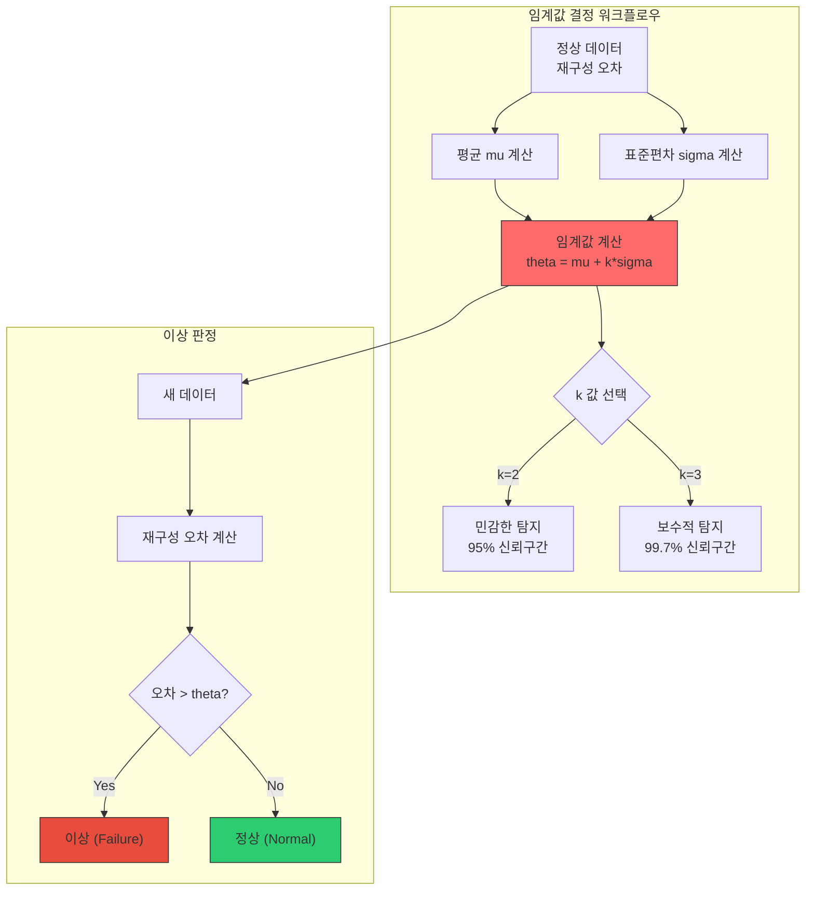

# 23차시: 딥러닝 응용 - 오토인코더 기반 이상 탐지

## 학습 목표

| 목표 | 설명 |
|------|------|
| 오토인코더 구조 이해 | 인코더-잠재공간-디코더 아키텍처의 원리를 파악합니다 |
| Keras 구현 | Sequential API로 오토인코더를 구성하고 학습합니다 |
| 이상 탐지 적용 | 재구성 오차 기반 이상 탐지 기법을 실무에 적용합니다 |

---

## 실습 데이터셋

| 데이터셋 | 출처 | 용도 |
|---------|------|------|
| AI4I 2020 Predictive Maintenance | UCI ML Repository | 오토인코더 학습 및 이상 탐지 실습 |
| 샘플 수 | 10,000개 | 설비 센서 데이터 |
| 고장 비율 | 약 3.4% (339개) | 불균형 데이터 |

---

## 수학적 배경

### 재구성 오차 (Reconstruction Error)

오토인코더의 핵심 개념은 **재구성 오차**입니다. 입력 데이터를 압축 후 복원할 때 발생하는 오차를 측정합니다.

**MSE (Mean Squared Error) 수식**:

$$L_{\text{MSE}} = \frac{1}{n}\sum_{i=1}^{n}(X_i - \hat{X}_i)^2$$

여기서:
- $X_i$: 원본 입력의 i번째 특성
- $\hat{X}_i$: 재구성된 출력의 i번째 특성
- $n$: 특성의 개수

**전체 배치에 대한 손실**:

$$\mathcal{L} = \frac{1}{N}\sum_{j=1}^{N}\frac{1}{n}\sum_{i=1}^{n}(X_i^{(j)} - \hat{X}_i^{(j)})^2$$

여기서 $N$은 배치 크기입니다.

**실제 계산 예시**:

| 원본 $X$ | 재구성 $\hat{X}$ | 차이 | 오차 $(X - \hat{X})^2$ |
|---------|-----------------|------|----------------------|
| 0.8 | 0.78 | 0.02 | 0.0004 |
| 0.5 | 0.52 | -0.02 | 0.0004 |
| 0.3 | 0.28 | 0.02 | 0.0004 |
| **평균** | - | - | **0.0004 (MSE)** |

### 인코더 수식

입력 $X \in \mathbb{R}^n$을 잠재 공간 $z \in \mathbb{R}^k$로 변환합니다 ($k < n$):

$$z = f_{\text{enc}}(X) = \sigma(W_e X + b_e)$$

다층 인코더의 경우:

$$h_1 = \sigma_1(W_1 X + b_1)$$
$$h_2 = \sigma_2(W_2 h_1 + b_2)$$
$$z = \sigma_3(W_3 h_2 + b_3)$$

### 디코더 수식

잠재 벡터 $z$에서 원본을 복원합니다:

$$\hat{X} = f_{\text{dec}}(z) = \sigma(W_d z + b_d)$$

**전체 오토인코더**:

$$\hat{X} = f_{\text{dec}}(f_{\text{enc}}(X)) = (g \circ f)(X)$$

### 임계값 설정

통계적 방법으로 이상 판정 기준을 설정합니다:

$$\theta = \mu + k\sigma$$

여기서:
- $\mu = \frac{1}{N}\sum_{j=1}^{N} e_j$: 정상 데이터 재구성 오차의 평균
- $\sigma = \sqrt{\frac{1}{N-1}\sum_{j=1}^{N}(e_j - \mu)^2}$: 표준편차
- $e_j$: j번째 샘플의 재구성 오차

| 기호 | 의미 | 예시 값 |
|-----|------|--------|
| $\mu$ | 정상 데이터 재구성 오차 평균 | 0.0012 |
| $\sigma$ | 재구성 오차 표준편차 | 0.0005 |
| $k$ | 민감도 상수 | 3 |
| $\theta$ | 임계값 | 0.0027 |

**k 값 선택 기준 (정규분포 가정)**:
- $k=1$: 약 68.3% 신뢰구간 (매우 민감)
- $k=2$: 약 95.4% 신뢰구간 (민감한 탐지)
- $k=3$: 약 99.7% 신뢰구간 (보수적 탐지)

---

## 강의 구성 (25분)

| 파트 | 주제 | 시간 |
|:----:|------|:----:|
| Part 1 | 오토인코더 개념 | 8분 |
| Part 2 | Keras 구현 | 10분 |
| Part 3 | 이상 탐지 | 5분 |
| 정리 | 핵심 요약 | 2분 |

---

# Part 1: 오토인코더 개념 (8분)

## 1.1 오토인코더 구조

오토인코더는 입력을 압축 후 복원하여 **입력 자체를 재구성**하는 신경망입니다.



**구성 요소**:

| 구성요소 | 역할 | 차원 변화 |
|---------|------|----------|
| 인코더 | 입력을 저차원으로 압축 | 6 -> 4 -> 2 |
| 잠재 공간 | 핵심 특징만 남긴 표현 | 2 (병목) |
| 디코더 | 저차원에서 원래 차원으로 복원 | 2 -> 4 -> 6 |

---

## 1.2 수학적 정의

### 인코더 수식

입력 $X$를 잠재 공간 $z$로 변환합니다:

$$z = f_{\text{enc}}(X) = \sigma(W_e X + b_e)$$

| 기호 | 의미 | 설명 |
|-----|------|------|
| $z$ | 잠재 벡터 | 압축된 표현 (Latent Vector) |
| $W_e$ | 인코더 가중치 | 학습되는 파라미터 |
| $b_e$ | 인코더 편향 | 학습되는 파라미터 |
| $\sigma$ | 활성화 함수 | ReLU 등 비선형 함수 |

### 디코더 수식

잠재 벡터 $z$에서 입력을 복원합니다:

$$\hat{X} = f_{\text{dec}}(z) = \sigma(W_d z + b_d)$$

| 기호 | 의미 | 설명 |
|-----|------|------|
| $\hat{X}$ | 재구성된 출력 | 원본과 유사해야 함 |
| $W_d$ | 디코더 가중치 | 학습되는 파라미터 |
| $b_d$ | 디코더 편향 | 학습되는 파라미터 |

### 목적 함수

입력과 출력의 차이를 최소화합니다:

$$\min_{W_e, W_d, b_e, b_d} \mathcal{L} = \min \frac{1}{N}\sum_{j=1}^{N}||X^{(j)} - \hat{X}^{(j)}||^2$$

---

## 1.3 이상 탐지 원리

오토인코더 기반 이상 탐지의 핵심 아이디어:

```
[학습 단계]
정상 데이터만으로 학습 -> 정상 패턴을 기억합니다

[탐지 단계]
새 데이터 입력 -> 재구성 -> 오차 계산
  |
  +-- 오차가 작음 -> 정상 (학습한 패턴과 유사)
  +-- 오차가 큼   -> 이상 (학습한 패턴과 상이)
```

**핵심 가정**: 정상 데이터만 학습한 모델은 이상 데이터를 제대로 복원하지 못합니다.

### 왜 오토인코더로 이상 탐지?

| 방법 | 장점 | 단점 |
|-----|------|------|
| 규칙 기반 | 해석 용이, 구현 간단 | 복잡한 패턴 표현 불가 |
| 통계 기반 (Z-score) | 간단, 빠른 계산 | 다변량 관계 표현 어려움 |
| **오토인코더** | **복잡한 비선형 패턴 학습** | 학습 데이터 필요 |

---

## 1.4 오토인코더 변형 비교

| 변형 | 특징 | 용도 |
|-----|------|------|
| Vanilla AE | 기본 구조 | 차원 축소, 이상 탐지 |
| Denoising AE | 노이즈 추가 후 복원 학습 | 노이즈 제거, 강건성 향상 |
| Variational AE | 확률적 잠재 공간 | 데이터 생성, 이상 탐지 |
| Sparse AE | 희소성 제약 추가 | 특징 추출 |

본 강의에서는 **Vanilla AE (기본 오토인코더)**를 사용합니다.

---

# Part 2: Keras 구현 (10분)

## 2.1 데이터 준비

### 실습 코드: 환경 설정

```python
# 라이브러리 임포트
import numpy as np
import pandas as pd
import matplotlib.pyplot as plt

import os
os.environ['TF_CPP_MIN_LOG_LEVEL'] = '2'

import tensorflow as tf
from tensorflow.keras.models import Sequential, Model
from tensorflow.keras.layers import Dense, Dropout, BatchNormalization, Input
from tensorflow.keras.callbacks import EarlyStopping
from tensorflow.keras.optimizers import Adam

from sklearn.preprocessing import MinMaxScaler, StandardScaler
from sklearn.model_selection import train_test_split
from sklearn.metrics import classification_report, confusion_matrix, roc_auc_score, roc_curve

print(f"TensorFlow 버전: {tf.__version__}")
np.random.seed(42)
tf.random.set_seed(42)
```

**출력 예시**:
```
TensorFlow 버전: 2.15.0
```

---

### 실습 코드: AI4I 2020 데이터셋 로드

```python
# UCI ML Repository에서 AI4I 2020 데이터셋 로드
url = "https://archive.ics.uci.edu/ml/machine-learning-databases/00601/ai4i2020.csv"

# 로컬 파일이 있는 경우
# df = pd.read_csv('ai4i2020.csv')

# URL에서 로드
try:
    df = pd.read_csv(url)
    print("UCI Repository에서 데이터셋 로드 완료")
except:
    # 로컬 대체 로드 또는 시뮬레이션 데이터 생성
    print("URL 접근 불가 - 시뮬레이션 데이터 사용")
    df = generate_ai4i_simulation_data()

print(f"\n데이터셋 정보:")
print(f"  - 전체 샘플 수: {len(df)}")
print(f"  - 컬럼 수: {len(df.columns)}")
print(f"\n컬럼 목록:")
print(df.columns.tolist())
```

---

### 실습 코드: AI4I 데이터셋 시뮬레이션 (URL 접근 불가 시)

```python
def generate_ai4i_simulation_data(n_samples=10000, failure_rate=0.034, random_state=42):
    """
    AI4I 2020 데이터셋을 시뮬레이션하여 생성합니다.

    Parameters:
    - n_samples: 전체 샘플 수
    - failure_rate: 고장 비율 (약 3.4%)
    - random_state: 랜덤 시드

    Returns:
    - df: AI4I 형식의 DataFrame
    """
    np.random.seed(random_state)

    # 제품 타입 (L: 저품질 50%, M: 중품질 30%, H: 고품질 20%)
    product_types = np.random.choice(['L', 'M', 'H'],
                                      size=n_samples,
                                      p=[0.5, 0.3, 0.2])

    # 센서 데이터 생성 (정상 범위)
    # Air temperature [K]: 295-305K (약 22-32도)
    air_temp = np.random.normal(300, 2, n_samples)

    # Process temperature [K]: Air temp + 10K 정도
    process_temp = air_temp + np.random.normal(10, 1, n_samples)

    # Rotational speed [rpm]: 1200-2800 rpm
    rotational_speed = np.random.normal(1500, 200, n_samples)
    # H 타입은 회전 속도가 낮음
    rotational_speed[product_types == 'H'] -= 100

    # Torque [Nm]: 20-80 Nm
    torque = np.random.normal(40, 10, n_samples)

    # Tool wear [min]: 0-250 min
    tool_wear = np.random.randint(0, 250, n_samples)
    # L 타입은 마모가 더 빠름
    tool_wear[product_types == 'L'] = np.minimum(
        tool_wear[product_types == 'L'] + 30, 250
    )

    # 고장 생성
    n_failures = int(n_samples * failure_rate)
    failure_indices = np.random.choice(n_samples, n_failures, replace=False)

    machine_failure = np.zeros(n_samples, dtype=int)
    machine_failure[failure_indices] = 1

    # 고장 유형 (TWF, HDF, PWF, OSF, RNF)
    twf = np.zeros(n_samples, dtype=int)  # Tool Wear Failure
    hdf = np.zeros(n_samples, dtype=int)  # Heat Dissipation Failure
    pwf = np.zeros(n_samples, dtype=int)  # Power Failure
    osf = np.zeros(n_samples, dtype=int)  # Overstrain Failure
    rnf = np.zeros(n_samples, dtype=int)  # Random Failure

    for idx in failure_indices:
        failure_type = np.random.choice(['TWF', 'HDF', 'PWF', 'OSF', 'RNF'],
                                        p=[0.25, 0.25, 0.20, 0.20, 0.10])

        if failure_type == 'TWF':
            twf[idx] = 1
            tool_wear[idx] = np.random.randint(200, 250)  # 높은 마모
        elif failure_type == 'HDF':
            hdf[idx] = 1
            process_temp[idx] += np.random.uniform(5, 15)  # 온도 상승
        elif failure_type == 'PWF':
            pwf[idx] = 1
            torque[idx] *= np.random.uniform(1.3, 1.8)  # 토크 증가
            rotational_speed[idx] *= np.random.uniform(0.7, 0.9)  # 속도 감소
        elif failure_type == 'OSF':
            osf[idx] = 1
            torque[idx] *= np.random.uniform(1.5, 2.0)  # 과부하
        else:  # RNF
            rnf[idx] = 1
            # 무작위 변동
            air_temp[idx] += np.random.uniform(-5, 5)

    # DataFrame 생성
    df = pd.DataFrame({
        'UDI': range(1, n_samples + 1),
        'Product ID': [f'{t}0000{i}' for i, t in enumerate(product_types)],
        'Type': product_types,
        'Air temperature [K]': air_temp,
        'Process temperature [K]': process_temp,
        'Rotational speed [rpm]': rotational_speed,
        'Torque [Nm]': torque,
        'Tool wear [min]': tool_wear,
        'Machine failure': machine_failure,
        'TWF': twf,
        'HDF': hdf,
        'PWF': pwf,
        'OSF': osf,
        'RNF': rnf
    })

    return df

# 데이터 생성
df = generate_ai4i_simulation_data()

print("AI4I 2020 시뮬레이션 데이터 생성 완료")
print(f"  - 전체 샘플 수: {len(df)}")
print(f"  - 정상 샘플: {(df['Machine failure'] == 0).sum()}")
print(f"  - 고장 샘플: {(df['Machine failure'] == 1).sum()}")
print(f"  - 고장 비율: {df['Machine failure'].mean()*100:.2f}%")
```

**출력 예시**:
```
AI4I 2020 시뮬레이션 데이터 생성 완료
  - 전체 샘플 수: 10000
  - 정상 샘플: 9661
  - 고장 샘플: 339
  - 고장 비율: 3.39%
```

---

### 실습 코드: 데이터 탐색

```python
# 데이터 기본 통계
print("데이터 기본 통계:")
print(df.describe().round(2))

# 고장 유형별 분포
print("\n고장 유형별 분포:")
failure_types = ['TWF', 'HDF', 'PWF', 'OSF', 'RNF']
for ft in failure_types:
    count = df[ft].sum()
    print(f"  - {ft}: {count}건 ({count/len(df)*100:.2f}%)")
```

---

### 실습 코드: 전처리 전 데이터 확인 (차트 1)

```python
def visualize_raw_data(df):
    """
    전처리 전 원본 데이터 시각화
    """
    feature_cols = ['Air temperature [K]', 'Process temperature [K]',
                    'Rotational speed [rpm]', 'Torque [Nm]', 'Tool wear [min]']

    fig, axes = plt.subplots(2, 3, figsize=(15, 10))
    axes = axes.flatten()

    normal = df[df['Machine failure'] == 0]
    failure = df[df['Machine failure'] == 1]

    for i, col in enumerate(feature_cols):
        ax = axes[i]

        # 히스토그램
        ax.hist(normal[col], bins=50, alpha=0.7, label='Normal', color='blue', density=True)
        ax.hist(failure[col], bins=30, alpha=0.7, label='Failure', color='red', density=True)

        ax.set_xlabel(col)
        ax.set_ylabel('Density')
        ax.set_title(f'Distribution: {col}', fontweight='bold')
        ax.legend()
        ax.grid(True, alpha=0.3)

    # 마지막 subplot: 스케일 비교
    ax = axes[5]
    feature_ranges = []
    for col in feature_cols:
        feature_ranges.append({
            'feature': col.split('[')[0].strip(),
            'min': df[col].min(),
            'max': df[col].max(),
            'range': df[col].max() - df[col].min()
        })

    ranges_df = pd.DataFrame(feature_ranges)
    bars = ax.bar(range(len(feature_cols)),
                  ranges_df['range'].values,
                  color=['#3498db', '#e74c3c', '#2ecc71', '#9b59b6', '#f39c12'])

    ax.set_xticks(range(len(feature_cols)))
    ax.set_xticklabels([f.split('[')[0].strip()[:10] for f in feature_cols], rotation=45, ha='right')
    ax.set_ylabel('Value Range')
    ax.set_title('Feature Scale Comparison (Before Scaling)', fontweight='bold')
    ax.grid(True, alpha=0.3, axis='y')

    # 범위 값 표시
    for bar, val in zip(bars, ranges_df['range'].values):
        ax.text(bar.get_x() + bar.get_width()/2, bar.get_height(),
                f'{val:.0f}', ha='center', va='bottom', fontsize=9)

    plt.suptitle('Raw Data Analysis (Before Preprocessing)', fontsize=14, fontweight='bold')
    plt.tight_layout()
    plt.savefig('raw_data_analysis.png', dpi=150, bbox_inches='tight')
    plt.show()

    # 스케일 차이 출력
    print("\n특성별 스케일 (전처리 전):")
    print("-" * 60)
    for _, row in ranges_df.iterrows():
        print(f"  {row['feature']:<25}: {row['min']:.2f} ~ {row['max']:.2f} (범위: {row['range']:.2f})")

visualize_raw_data(df)
```

**해석 방향**:
- 각 특성의 스케일이 크게 다름을 확인합니다 (온도: 300K, 회전속도: 1500rpm 등)
- 정상(파랑)과 고장(빨강) 데이터의 분포 차이를 확인합니다
- 스케일 차이가 크면 신경망 학습에 문제가 발생할 수 있습니다

---

### 실습 코드: 특성 선택 및 전처리

```python
# 수치형 특성만 선택
feature_cols = ['Air temperature [K]', 'Process temperature [K]',
                'Rotational speed [rpm]', 'Torque [Nm]', 'Tool wear [min]']

X = df[feature_cols].values
y = df['Machine failure'].values

print(f"특성 행렬 형태: {X.shape}")
print(f"라벨 분포: 정상={sum(y==0)}, 고장={sum(y==1)}")

# 정상 데이터만 분리 (오토인코더는 정상 데이터로만 학습)
X_normal = X[y == 0]
X_failure = X[y == 1]

print(f"\n정상 데이터: {X_normal.shape}")
print(f"고장 데이터: {X_failure.shape}")
```

---

### 실습 코드: 학습/테스트 분할 및 정규화

```python
# 정상 데이터를 학습/검증으로 분할
X_train_normal, X_val_normal = train_test_split(
    X_normal, test_size=0.2, random_state=42
)

print(f"학습용 정상 데이터: {X_train_normal.shape}")
print(f"검증용 정상 데이터: {X_val_normal.shape}")

# 정규화 (MinMaxScaler: 0~1 범위)
scaler = MinMaxScaler()
X_train_scaled = scaler.fit_transform(X_train_normal)
X_val_scaled = scaler.transform(X_val_normal)

# 테스트 데이터 (정상 + 고장 혼합)
X_test = np.vstack([X_val_normal, X_failure])
y_test = np.hstack([np.zeros(len(X_val_normal)), np.ones(len(X_failure))])
X_test_scaled = scaler.transform(X_test)

print(f"\n테스트 데이터: {X_test_scaled.shape}")
print(f"테스트 라벨: 정상={sum(y_test==0)}, 고장={sum(y_test==1)}")

print(f"\n정규화 후 값 범위: [{X_train_scaled.min():.4f}, {X_train_scaled.max():.4f}]")
```

**출력 예시**:
```
학습용 정상 데이터: (7728, 5)
검증용 정상 데이터: (1933, 5)

테스트 데이터: (2272, 5)
테스트 라벨: 정상=1933, 고장=339

정규화 후 값 범위: [0.0000, 1.0000]
```

---

### 실습 코드: 전처리 전/후 비교 (차트 2)

```python
def compare_before_after_scaling(X_train_normal, X_train_scaled, feature_cols):
    """
    전처리 전/후 데이터 비교 시각화
    """
    fig, axes = plt.subplots(2, 3, figsize=(15, 10))

    # 전처리 전 (상단)
    for i, col in enumerate(feature_cols[:3]):
        ax = axes[0, i]
        ax.hist(X_train_normal[:, i], bins=50, color='blue', alpha=0.7, edgecolor='black')
        ax.set_xlabel(col)
        ax.set_ylabel('Frequency')
        ax.set_title(f'Before Scaling: {col.split("[")[0].strip()}', fontweight='bold')
        ax.grid(True, alpha=0.3)

        # 통계량 표시
        mean_val = X_train_normal[:, i].mean()
        std_val = X_train_normal[:, i].std()
        ax.axvline(mean_val, color='red', linestyle='--', label=f'Mean: {mean_val:.1f}')
        ax.legend(fontsize=8)

    # 전처리 후 (하단)
    for i, col in enumerate(feature_cols[:3]):
        ax = axes[1, i]
        ax.hist(X_train_scaled[:, i], bins=50, color='green', alpha=0.7, edgecolor='black')
        ax.set_xlabel(f'{col.split("[")[0].strip()} (scaled)')
        ax.set_ylabel('Frequency')
        ax.set_title(f'After Scaling: {col.split("[")[0].strip()}', fontweight='bold')
        ax.grid(True, alpha=0.3)
        ax.set_xlim(0, 1)

        # 통계량 표시
        mean_val = X_train_scaled[:, i].mean()
        std_val = X_train_scaled[:, i].std()
        ax.axvline(mean_val, color='red', linestyle='--', label=f'Mean: {mean_val:.2f}')
        ax.legend(fontsize=8)

    plt.suptitle('Data Preprocessing: Before vs After MinMax Scaling', fontsize=14, fontweight='bold')
    plt.tight_layout()
    plt.savefig('preprocessing_comparison.png', dpi=150, bbox_inches='tight')
    plt.show()

    # 통계 비교 출력
    print("\n전처리 전/후 통계 비교:")
    print("-" * 80)
    print(f"{'Feature':<25} {'Before (Mean +/- Std)':<25} {'After (Mean +/- Std)':<25}")
    print("-" * 80)
    for i, col in enumerate(feature_cols):
        before_mean = X_train_normal[:, i].mean()
        before_std = X_train_normal[:, i].std()
        after_mean = X_train_scaled[:, i].mean()
        after_std = X_train_scaled[:, i].std()
        print(f"{col.split('[')[0].strip():<25} {before_mean:>8.2f} +/- {before_std:<8.2f} {after_mean:>8.4f} +/- {after_std:<8.4f}")

compare_before_after_scaling(X_train_normal, X_train_scaled, feature_cols)
```

**해석 방향**:
- 전처리 전: 각 특성의 스케일이 다름 (온도 ~300, 회전속도 ~1500)
- 전처리 후: 모든 특성이 0~1 범위로 정규화됨
- 정규화된 데이터는 신경망 학습에 더 적합합니다

---

## 2.2 모델 구성

### 실습 코드: Sequential API로 오토인코더 구현

```python
def build_autoencoder(input_dim, latent_dim=2):
    """
    Sequential API로 오토인코더 생성합니다.

    구조: 입력(5) -> 4 -> 2(잠재) -> 4 -> 출력(5)

    Parameters:
    - input_dim: 입력 차원
    - latent_dim: 잠재 공간 차원

    Returns:
    - model: 오토인코더 모델
    """
    model = Sequential([
        # === 인코더 ===
        Dense(4, activation='relu', input_shape=(input_dim,), name='encoder_1'),
        BatchNormalization(),
        Dropout(0.2),

        Dense(latent_dim, activation='relu', name='latent'),  # 잠재 공간 (병목)

        # === 디코더 ===
        Dense(4, activation='relu', name='decoder_1'),
        BatchNormalization(),
        Dropout(0.2),

        Dense(input_dim, activation='sigmoid', name='output')  # 출력 (0~1 범위)
    ], name='autoencoder')

    return model

# 모델 생성
input_dim = X_train_scaled.shape[1]  # 5
latent_dim = 2

autoencoder = build_autoencoder(input_dim, latent_dim)

print("오토인코더 구조:")
autoencoder.summary()
```

**출력 예시**:
```
오토인코더 구조:
Model: "autoencoder"
_________________________________________________________________
 Layer (type)                Output Shape              Param #
=================================================================
 encoder_1 (Dense)           (None, 4)                 24
 batch_normalization         (None, 4)                 16
 dropout                     (None, 4)                 0
 latent (Dense)              (None, 2)                 10
 decoder_1 (Dense)           (None, 4)                 12
 batch_normalization_1       (None, 4)                 16
 dropout_1                   (None, 4)                 0
 output (Dense)              (None, 5)                 25
=================================================================
Total params: 103 (412.00 Bytes)
Trainable params: 87 (348.00 Bytes)
Non-trainable params: 16 (64.00 Bytes)
_________________________________________________________________
```

**파라미터 계산 예시**:
- encoder_1: (5 입력 x 4 노드) + 4 편향 = 24
- latent: (4 x 2) + 2 = 10
- output: (4 x 5) + 5 = 25

---

## 2.3 학습

### 실습 코드: 모델 컴파일 및 학습

```python
# 모델 컴파일
autoencoder.compile(
    optimizer=Adam(learning_rate=0.001),
    loss='mse'  # 재구성 오차 (Mean Squared Error)
)

print("모델 컴파일 완료")
print("  - Optimizer: Adam (lr=0.001)")
print("  - Loss: MSE (Mean Squared Error)")

# 콜백 설정
callbacks = [
    EarlyStopping(
        monitor='val_loss',
        patience=15,
        restore_best_weights=True,
        verbose=1
    )
]

# 모델 학습 (핵심: 입력 = 타겟)
history = autoencoder.fit(
    X_train_scaled, X_train_scaled,  # 입력 = 타겟
    epochs=100,
    batch_size=32,
    validation_data=(X_val_scaled, X_val_scaled),
    callbacks=callbacks,
    verbose=1
)

print(f"\n학습 완료!")
print(f"  - 실제 에포크 수: {len(history.history['loss'])}")
print(f"  - 최종 학습 손실: {history.history['loss'][-1]:.6f}")
print(f"  - 최종 검증 손실: {history.history['val_loss'][-1]:.6f}")
```

**핵심 포인트**:
- `autoencoder.fit(X, X)`: 입력과 타겟이 동일합니다 (자기 자신을 예측)
- 정상 데이터만으로 학습하여 정상 패턴을 기억합니다

---

### 실습 코드: 학습 곡선 시각화 (차트 3)

```python
def plot_training_history(history):
    """
    학습 곡선 시각화
    """
    fig, ax = plt.subplots(figsize=(10, 5))

    epochs = range(1, len(history.history['loss']) + 1)

    ax.plot(epochs, history.history['loss'], 'b-',
            label='Training Loss', linewidth=2)
    ax.plot(epochs, history.history['val_loss'], 'r-',
            label='Validation Loss', linewidth=2)

    ax.set_xlabel('Epoch')
    ax.set_ylabel('Loss (MSE)')
    ax.set_title('Autoencoder Training History', fontsize=12, fontweight='bold')
    ax.legend()
    ax.grid(True, alpha=0.3)

    # 최저점 표시
    min_val_loss = min(history.history['val_loss'])
    min_epoch = history.history['val_loss'].index(min_val_loss) + 1
    ax.axvline(min_epoch, color='green', linestyle='--', alpha=0.5)
    ax.annotate(f'Best: {min_val_loss:.6f}\n(Epoch {min_epoch})',
                xy=(min_epoch, min_val_loss),
                xytext=(min_epoch + 5, min_val_loss + 0.001),
                fontsize=10, color='green')

    plt.tight_layout()
    plt.savefig('training_history.png', dpi=150, bbox_inches='tight')
    plt.show()

plot_training_history(history)
```

**해석 방향**:
- 학습 손실과 검증 손실이 함께 감소하면 정상 학습입니다
- 검증 손실이 증가하면 과적합입니다 (EarlyStopping이 방지)
- 최종 손실 값이 낮을수록 재구성 품질이 좋습니다

---

# Part 3: 이상 탐지 (5분)

## 3.1 재구성 오차 계산

### 실습 코드: 재구성 오차 계산

```python
def calculate_reconstruction_error(autoencoder, X):
    """
    재구성 오차를 계산합니다.

    Parameters:
    - autoencoder: 학습된 오토인코더 모델
    - X: 입력 데이터

    Returns:
    - reconstruction_error: 샘플별 재구성 오차 (MSE)
    - X_reconstructed: 재구성된 데이터
    """
    # 재구성
    X_reconstructed = autoencoder.predict(X, verbose=0)

    # 샘플별 MSE 계산
    reconstruction_error = np.mean((X - X_reconstructed) ** 2, axis=1)

    return reconstruction_error, X_reconstructed

# 재구성 오차 계산
reconstruction_error, X_reconstructed = calculate_reconstruction_error(
    autoencoder, X_test_scaled
)

# 정상/고장 별 통계
normal_error = reconstruction_error[y_test == 0]
failure_error = reconstruction_error[y_test == 1]

print("재구성 오차 통계:")
print(f"  전체 - 평균: {reconstruction_error.mean():.6f}, 표준편차: {reconstruction_error.std():.6f}")
print(f"\n정상 데이터:")
print(f"  - 평균: {normal_error.mean():.6f}")
print(f"  - 표준편차: {normal_error.std():.6f}")
print(f"  - 범위: [{normal_error.min():.6f}, {normal_error.max():.6f}]")
print(f"\n고장 데이터:")
print(f"  - 평균: {failure_error.mean():.6f}")
print(f"  - 표준편차: {failure_error.std():.6f}")
print(f"  - 범위: [{failure_error.min():.6f}, {failure_error.max():.6f}]")
```

**출력 예시**:
```
재구성 오차 통계:
  전체 - 평균: 0.003245, 표준편차: 0.005821

정상 데이터:
  - 평균: 0.001845
  - 표준편차: 0.001523
  - 범위: [0.000112, 0.008421]

고장 데이터:
  - 평균: 0.011632
  - 표준편차: 0.009745
  - 범위: [0.001254, 0.052632]
```

---

## 3.2 임계값 결정



### 실습 코드: 임계값 설정 및 평가

```python
def evaluate_thresholds(reconstruction_error, y_test, k_values=[2, 2.5, 3]):
    """
    다양한 k 값에 대한 임계값 계산 및 성능을 비교합니다.
    """
    from sklearn.metrics import precision_score, recall_score, f1_score

    # 정상 데이터의 재구성 오차로 통계량 계산
    normal_error = reconstruction_error[y_test == 0]
    mu = np.mean(normal_error)
    sigma = np.std(normal_error)

    print("=" * 60)
    print("임계값 설정 (정상 데이터 기준)")
    print("=" * 60)
    print(f"mu (평균): {mu:.6f}")
    print(f"sigma (표준편차): {sigma:.6f}")
    print()

    results = []
    for k in k_values:
        threshold = mu + k * sigma

        # 이상 판정
        y_pred = (reconstruction_error > threshold).astype(int)

        # 성능 지표
        precision = precision_score(y_test, y_pred, zero_division=0)
        recall = recall_score(y_test, y_pred, zero_division=0)
        f1 = f1_score(y_test, y_pred, zero_division=0)

        results.append({
            'k': k,
            'threshold': threshold,
            'precision': precision,
            'recall': recall,
            'f1': f1,
            'detected': y_pred.sum()
        })

        print(f"k = {k}:")
        print(f"  - 임계값: {threshold:.6f}")
        print(f"  - Precision: {precision:.4f}")
        print(f"  - Recall: {recall:.4f}")
        print(f"  - F1-Score: {f1:.4f}")
        print(f"  - 탐지된 이상: {y_pred.sum()}개")
        print()

    return results, mu, sigma

results, mu, sigma = evaluate_thresholds(reconstruction_error, y_test)
```

---

### 실습 코드: 재구성 오차 분포 시각화 (차트 4)

```python
def plot_error_distribution(reconstruction_error, y_test, mu, sigma, k=3):
    """
    재구성 오차 분포를 시각화합니다.
    """
    fig, axes = plt.subplots(1, 2, figsize=(14, 5))

    normal_error = reconstruction_error[y_test == 0]
    failure_error = reconstruction_error[y_test == 1]
    threshold = mu + k * sigma

    # 1. 히스토그램
    ax = axes[0]
    ax.hist(normal_error, bins=50, alpha=0.7, label='Normal',
            color='blue', density=True)
    ax.hist(failure_error, bins=30, alpha=0.7, label='Failure',
            color='red', density=True)

    ax.axvline(threshold, color='green', linestyle='--', linewidth=2,
               label=f'Threshold (k={k}): {threshold:.4f}')
    ax.axvline(mu, color='orange', linestyle=':', linewidth=2,
               label=f'Mean: {mu:.4f}')

    ax.set_xlabel('Reconstruction Error')
    ax.set_ylabel('Density')
    ax.set_title('Reconstruction Error Distribution', fontweight='bold')
    ax.legend()
    ax.grid(True, alpha=0.3)

    # 2. 샘플별 오차
    ax = axes[1]
    normal_idx = np.where(y_test == 0)[0]
    failure_idx = np.where(y_test == 1)[0]

    ax.scatter(normal_idx, reconstruction_error[y_test == 0],
               alpha=0.3, c='blue', s=20, label='Normal')
    ax.scatter(failure_idx, reconstruction_error[y_test == 1],
               alpha=0.8, c='red', s=50, marker='x', label='Failure')

    ax.axhline(threshold, color='green', linestyle='--', linewidth=2,
               label=f'Threshold: {threshold:.4f}')

    ax.set_xlabel('Sample Index')
    ax.set_ylabel('Reconstruction Error')
    ax.set_title('Sample-wise Reconstruction Error', fontweight='bold')
    ax.legend()
    ax.grid(True, alpha=0.3)

    plt.tight_layout()
    plt.savefig('error_distribution.png', dpi=150, bbox_inches='tight')
    plt.show()

plot_error_distribution(reconstruction_error, y_test, mu, sigma, k=3)
```

**해석 방향**:
- 히스토그램: 정상(파랑)과 고장(빨강) 분포의 분리 정도를 확인합니다
- 임계값(녹색 점선) 위치가 두 분포를 잘 분리하는지 확인합니다
- 샘플별 산점도: 임계값 위쪽의 빨간 점(고장)이 많을수록 좋은 탐지 성능입니다

---

## 3.3 평가

### 실습 코드: 최종 평가 결과

```python
# 최적 k 선택 (F1-Score 기준)
best_result = max(results, key=lambda x: x['f1'])
best_k = best_result['k']
threshold = mu + best_k * sigma

print(f"최적 k 값: {best_k}")
print(f"최적 임계값: {threshold:.6f}")

# 최종 예측
y_pred = (reconstruction_error > threshold).astype(int)

# 분류 보고서
print("\n" + "=" * 60)
print("분류 보고서")
print("=" * 60)
print(classification_report(y_test, y_pred, target_names=['Normal', 'Failure']))

# 혼동 행렬
print("혼동 행렬:")
cm = confusion_matrix(y_test, y_pred)
print(cm)

# AUC-ROC
auc = roc_auc_score(y_test, reconstruction_error)
print(f"\nAUC-ROC Score: {auc:.4f}")
```

---

### 실습 코드: ROC 곡선 및 혼동 행렬 시각화 (차트 5)

```python
def plot_evaluation(y_test, y_pred, reconstruction_error):
    """
    평가 결과를 시각화합니다.
    """
    fig, axes = plt.subplots(1, 2, figsize=(12, 5))

    # 1. 혼동 행렬
    ax = axes[0]
    cm = confusion_matrix(y_test, y_pred)

    im = ax.imshow(cm, cmap='Blues')
    ax.set_xticks([0, 1])
    ax.set_yticks([0, 1])
    ax.set_xticklabels(['Pred: Normal', 'Pred: Failure'])
    ax.set_yticklabels(['True: Normal', 'True: Failure'])

    for i in range(2):
        for j in range(2):
            color = 'white' if cm[i, j] > cm.max() / 2 else 'black'
            ax.text(j, i, str(cm[i, j]), ha='center', va='center',
                   fontsize=20, fontweight='bold', color=color)

    ax.set_title('Confusion Matrix', fontweight='bold')
    plt.colorbar(im, ax=ax)

    # 2. ROC 곡선
    ax = axes[1]
    fpr, tpr, _ = roc_curve(y_test, reconstruction_error)
    auc = roc_auc_score(y_test, reconstruction_error)

    ax.plot(fpr, tpr, 'b-', linewidth=2, label=f'AUC = {auc:.4f}')
    ax.plot([0, 1], [0, 1], 'k--', linewidth=1)
    ax.fill_between(fpr, tpr, alpha=0.3)

    ax.set_xlabel('False Positive Rate')
    ax.set_ylabel('True Positive Rate')
    ax.set_title('ROC Curve', fontweight='bold')
    ax.legend(loc='lower right')
    ax.grid(True, alpha=0.3)

    plt.tight_layout()
    plt.savefig('evaluation_results.png', dpi=150, bbox_inches='tight')
    plt.show()

plot_evaluation(y_test, y_pred, reconstruction_error)
```

**해석 방향**:
- 혼동 행렬: TN(정상을 정상으로), TP(고장을 고장으로) 값이 클수록 좋습니다
- ROC 곡선: 좌상단에 가까울수록 좋은 성능입니다
- AUC: 0.9 이상이면 우수한 탐지 성능입니다

---

### 실습 코드: 재구성 결과 비교 시각화 (차트 6)

```python
def plot_reconstruction_comparison(X_test_scaled, X_reconstructed, y_test,
                                    reconstruction_error, feature_cols):
    """
    정상/고장 샘플의 재구성 결과를 비교합니다.
    """
    fig, axes = plt.subplots(2, 2, figsize=(14, 10))

    # 정상 샘플 (오차가 가장 작은 것)
    normal_idx = np.where(y_test == 0)[0]
    best_normal = normal_idx[np.argmin(reconstruction_error[normal_idx])]

    # 고장 샘플 (오차가 가장 큰 것)
    failure_idx = np.where(y_test == 1)[0]
    worst_failure = failure_idx[np.argmax(reconstruction_error[failure_idx])]

    feature_names = [col.split('[')[0].strip() for col in feature_cols]
    x = np.arange(len(feature_names))
    width = 0.35

    # 1. 정상 샘플 재구성
    ax = axes[0, 0]
    ax.bar(x - width/2, X_test_scaled[best_normal], width,
           label='Original', alpha=0.7, color='blue')
    ax.bar(x + width/2, X_reconstructed[best_normal], width,
           label='Reconstructed', alpha=0.7, color='green')
    ax.set_xticks(x)
    ax.set_xticklabels(feature_names, rotation=45, ha='right', fontsize=9)
    ax.set_title(f'Normal Sample (Error: {reconstruction_error[best_normal]:.6f})',
                fontweight='bold')
    ax.legend()
    ax.set_ylim(0, 1)
    ax.grid(True, alpha=0.3, axis='y')

    # 2. 고장 샘플 재구성
    ax = axes[0, 1]
    ax.bar(x - width/2, X_test_scaled[worst_failure], width,
           label='Original', alpha=0.7, color='red')
    ax.bar(x + width/2, X_reconstructed[worst_failure], width,
           label='Reconstructed', alpha=0.7, color='orange')
    ax.set_xticks(x)
    ax.set_xticklabels(feature_names, rotation=45, ha='right', fontsize=9)
    ax.set_title(f'Failure Sample (Error: {reconstruction_error[worst_failure]:.6f})',
                fontweight='bold')
    ax.legend()
    ax.set_ylim(0, 1)
    ax.grid(True, alpha=0.3, axis='y')

    # 3. 정상 vs 고장 재구성 오차 비교 (박스플롯)
    ax = axes[1, 0]
    normal_errors = reconstruction_error[y_test == 0]
    failure_errors = reconstruction_error[y_test == 1]

    bp = ax.boxplot([normal_errors, failure_errors],
                    labels=['Normal', 'Failure'],
                    patch_artist=True)
    bp['boxes'][0].set_facecolor('blue')
    bp['boxes'][1].set_facecolor('red')

    ax.set_ylabel('Reconstruction Error')
    ax.set_title('Error Distribution by Class', fontweight='bold')
    ax.grid(True, alpha=0.3)

    # 4. 특성별 재구성 오차 기여도
    ax = axes[1, 1]
    sensor_errors = np.abs(X_test_scaled - X_reconstructed)

    normal_sensor_error = sensor_errors[y_test == 0].mean(axis=0)
    failure_sensor_error = sensor_errors[y_test == 1].mean(axis=0)

    ax.bar(x - width/2, normal_sensor_error, width,
           label='Normal', alpha=0.7, color='blue')
    ax.bar(x + width/2, failure_sensor_error, width,
           label='Failure', alpha=0.7, color='red')
    ax.set_xticks(x)
    ax.set_xticklabels(feature_names, rotation=45, ha='right', fontsize=9)
    ax.set_ylabel('Mean Absolute Error')
    ax.set_title('Feature-wise Reconstruction Error', fontweight='bold')
    ax.legend()
    ax.grid(True, alpha=0.3, axis='y')

    plt.suptitle('Reconstruction Analysis: Normal vs Failure', fontsize=14, fontweight='bold')
    plt.tight_layout()
    plt.savefig('reconstruction_comparison.png', dpi=150, bbox_inches='tight')
    plt.show()

plot_reconstruction_comparison(X_test_scaled, X_reconstructed, y_test,
                               reconstruction_error, feature_cols)
```

**해석 방향**:
- 정상 샘플: Original과 Reconstructed가 거의 일치합니다
- 고장 샘플: Original과 Reconstructed 간 차이가 큽니다 (특히 이상 발생 특성)
- 특성별 기여도: 어떤 특성이 이상 탐지에 가장 기여하는지 파악합니다

---

# 핵심 정리

## 오토인코더 수식 요약

| 구성요소 | 수식 | 설명 |
|---------|------|------|
| 목적 함수 | $\min \|\|X - \hat{X}\|\|^2$ | 재구성 오차 최소화 |
| 인코더 | $z = \sigma(W_e X + b_e)$ | 입력을 잠재 공간으로 압축 |
| 디코더 | $\hat{X} = \sigma(W_d z + b_d)$ | 잠재 공간에서 복원 |
| 재구성 오차 | $L = \frac{1}{n}\sum_{i=1}^{n}(X_i - \hat{X}_i)^2$ | 샘플별 MSE |
| 임계값 | $\theta = \mu + k\sigma$ | 이상 판정 기준 |

## 핵심 코드 요약

```python
# 1. 오토인코더 구성
autoencoder = Sequential([
    # 인코더
    Dense(4, activation='relu', input_shape=(input_dim,)),
    Dense(latent_dim, activation='relu'),
    # 디코더
    Dense(4, activation='relu'),
    Dense(input_dim, activation='sigmoid')
])

# 2. 컴파일
autoencoder.compile(optimizer='adam', loss='mse')

# 3. 학습 (입력 = 타겟)
autoencoder.fit(X_train, X_train, epochs=100, validation_split=0.2)

# 4. 재구성 오차 계산
X_pred = autoencoder.predict(X_test)
reconstruction_error = np.mean((X_test - X_pred) ** 2, axis=1)

# 5. 임계값 설정 및 이상 판정
threshold = mu + 3 * sigma
is_anomaly = reconstruction_error > threshold
```

## 오늘 배운 내용

| 파트 | 핵심 내용 |
|------|----------|
| Part 1 | 오토인코더 구조 (인코더-잠재공간-디코더), 이상 탐지 원리 |
| Part 2 | Sequential API로 구현, 전처리 전/후 비교, 정상 데이터만으로 학습 |
| Part 3 | 재구성 오차 계산, 임계값 기반 이상 판정, 성능 평가 |

## 체크리스트

- [ ] 오토인코더 구조 이해 (인코더-잠재공간-디코더)
- [ ] 재구성 오차 개념 이해 ($L = ||X - \hat{X}||^2$)
- [ ] Keras Sequential API로 오토인코더 구현
- [ ] 전처리 필요성 이해 (MinMaxScaler)
- [ ] 학습 방법: `model.fit(X, X)` 형태
- [ ] 임계값 설정: $\theta = \mu + k\sigma$
- [ ] 이상 판정: 재구성 오차 > 임계값
- [ ] 성능 평가: Precision, Recall, F1, AUC-ROC

---

## 다음 차시 예고

### [24차시] CNN 기반 이미지 불량 검출

- 합성곱 신경망(CNN) 구조
- Conv2D, MaxPooling2D 레이어
- 이미지 데이터 전처리
- 제조 현장 불량 이미지 분류

---

# [참고자료] 심화 학습

> 이 섹션은 선택 학습 자료입니다. 25분 강의 범위를 초과하는 심화 내용을 포함합니다.

---

## [참고 1] Functional API로 인코더/디코더 분리

Functional API를 사용하면 인코더와 디코더를 별도 모델로 추출할 수 있습니다.

```python
from tensorflow.keras.models import Model
from tensorflow.keras.layers import Input, Dense, BatchNormalization, Dropout

def build_autoencoder_functional(input_dim, latent_dim=2):
    """
    Functional API로 오토인코더를 생성합니다.
    인코더와 디코더를 별도 모델로 추출할 수 있습니다.
    """
    # 입력층
    input_layer = Input(shape=(input_dim,), name='input')

    # 인코더
    x = Dense(4, activation='relu', name='encoder_1')(input_layer)
    x = BatchNormalization()(x)
    x = Dropout(0.2)(x)
    latent = Dense(latent_dim, activation='relu', name='latent')(x)

    # 디코더
    x = Dense(4, activation='relu', name='decoder_1')(latent)
    x = BatchNormalization()(x)
    x = Dropout(0.2)(x)
    output_layer = Dense(input_dim, activation='sigmoid', name='output')(x)

    # 전체 오토인코더
    autoencoder = Model(input_layer, output_layer, name='autoencoder')

    # 인코더만 추출
    encoder = Model(input_layer, latent, name='encoder')

    return autoencoder, encoder

# 사용 예시
autoencoder, encoder = build_autoencoder_functional(input_dim=5, latent_dim=2)

# 인코더로 잠재 벡터 추출
latent_vectors = encoder.predict(X_test_scaled)
print(f"잠재 벡터 형태: {latent_vectors.shape}")  # (2272, 2)
```

**활용**:
- 차원 축소: 잠재 벡터를 다른 모델의 입력으로 사용합니다
- 시각화: 2차원 잠재 공간을 2D 플롯으로 시각화합니다
- 클러스터링: 잠재 공간에서 K-means 등을 적용합니다

---

## [참고 2] 잠재 공간 시각화

```python
def visualize_latent_space(encoder, X_test_scaled, y_test):
    """
    잠재 공간 2D 시각화
    """
    # 잠재 벡터 추출
    latent_vectors = encoder.predict(X_test_scaled, verbose=0)

    fig, ax = plt.subplots(figsize=(10, 8))

    normal_mask = y_test == 0
    failure_mask = y_test == 1

    ax.scatter(latent_vectors[normal_mask, 0],
               latent_vectors[normal_mask, 1],
               c='blue', alpha=0.3, s=20, label='Normal')
    ax.scatter(latent_vectors[failure_mask, 0],
               latent_vectors[failure_mask, 1],
               c='red', alpha=0.8, s=50, label='Failure', marker='x')

    ax.set_xlabel('Latent Dim 1')
    ax.set_ylabel('Latent Dim 2')
    ax.set_title('Latent Space Visualization', fontweight='bold')
    ax.legend()
    ax.grid(True, alpha=0.3)

    plt.tight_layout()
    plt.savefig('latent_space.png', dpi=150, bbox_inches='tight')
    plt.show()

    return latent_vectors

# 사용 예시
# latent_vectors = visualize_latent_space(encoder, X_test_scaled, y_test)
```

---

## [참고 3] 모델 저장 및 로드

```python
# 모델 저장
autoencoder.save('ai4i_autoencoder.keras')
print("모델 저장 완료: ai4i_autoencoder.keras")

# 스케일러 저장
import joblib
joblib.dump(scaler, 'ai4i_scaler.pkl')
print("스케일러 저장 완료: ai4i_scaler.pkl")

# 임계값 저장
threshold_info = {
    'mu': mu,
    'sigma': sigma,
    'k': best_k,
    'threshold': threshold
}
joblib.dump(threshold_info, 'threshold_info.pkl')
print("임계값 정보 저장 완료: threshold_info.pkl")

# 로드 및 사용
from tensorflow.keras.models import load_model

loaded_autoencoder = load_model('ai4i_autoencoder.keras')
loaded_scaler = joblib.load('ai4i_scaler.pkl')
loaded_threshold = joblib.load('threshold_info.pkl')

print(f"\n로드된 임계값: {loaded_threshold['threshold']:.6f}")
```

---

## [참고 4] 실시간 이상 탐지 함수

```python
def detect_anomaly(autoencoder, scaler, new_data, threshold):
    """
    새로운 데이터에 대한 실시간 이상 탐지를 수행합니다.

    Parameters:
    - autoencoder: 학습된 오토인코더
    - scaler: 학습에 사용된 스케일러
    - new_data: 새로운 센서 데이터 (raw 값)
    - threshold: 이상 탐지 임계값

    Returns:
    - is_anomaly: 이상 여부 (True/False)
    - error: 재구성 오차 값
    - details: 상세 정보 딕셔너리
    """
    # 데이터 형태 확인
    if new_data.ndim == 1:
        new_data = new_data.reshape(1, -1)

    # 정규화
    new_data_scaled = scaler.transform(new_data)

    # 재구성
    reconstructed = autoencoder.predict(new_data_scaled, verbose=0)

    # 재구성 오차 계산
    error = np.mean((new_data_scaled - reconstructed) ** 2, axis=1)

    # 이상 판정
    is_anomaly = error > threshold

    # 상세 정보
    details = {
        'reconstruction_error': error[0],
        'threshold': threshold,
        'margin': error[0] - threshold,
        'status': 'FAILURE' if is_anomaly[0] else 'NORMAL'
    }

    return is_anomaly[0], error[0], details

# 사용 예시
normal_sample = X_test[0]
is_anom, err, details = detect_anomaly(autoencoder, scaler, normal_sample, threshold)
print(f"샘플 판정: {details['status']}")
print(f"재구성 오차: {err:.6f}")
print(f"임계값: {threshold:.6f}")
```

---

## [참고 5] 고장 유형별 분석

```python
def analyze_failure_types(df, autoencoder, scaler, feature_cols, threshold):
    """
    고장 유형별 탐지 성능을 분석합니다.
    """
    failure_types = ['TWF', 'HDF', 'PWF', 'OSF', 'RNF']

    print("=" * 60)
    print("고장 유형별 탐지 성능")
    print("=" * 60)

    results = []
    for ft in failure_types:
        # 해당 고장 유형 데이터
        ft_data = df[df[ft] == 1][feature_cols].values

        if len(ft_data) == 0:
            continue

        # 정규화
        ft_scaled = scaler.transform(ft_data)

        # 재구성 오차 계산
        ft_reconstructed = autoencoder.predict(ft_scaled, verbose=0)
        ft_error = np.mean((ft_scaled - ft_reconstructed) ** 2, axis=1)

        # 탐지율 계산
        detected = (ft_error > threshold).sum()
        detection_rate = detected / len(ft_data) * 100

        results.append({
            'type': ft,
            'total': len(ft_data),
            'detected': detected,
            'detection_rate': detection_rate,
            'mean_error': ft_error.mean()
        })

        print(f"{ft}:")
        print(f"  - 전체: {len(ft_data)}건")
        print(f"  - 탐지: {detected}건 ({detection_rate:.1f}%)")
        print(f"  - 평균 오차: {ft_error.mean():.6f}")
        print()

    return results

# 사용 예시
# results = analyze_failure_types(df, autoencoder, scaler, feature_cols, threshold)
```

---

## 사용한 시각화 차트 목록

| 번호 | 차트명 | 파일명 | 용도 |
|:----:|--------|--------|------|
| 1 | 원본 데이터 분석 | raw_data_analysis.png | 전처리 전 스케일 차이 확인 |
| 2 | 전처리 비교 | preprocessing_comparison.png | 전처리 전/후 데이터 비교 |
| 3 | 학습 곡선 | training_history.png | 모델 학습 과정 모니터링 |
| 4 | 재구성 오차 분포 | error_distribution.png | 임계값 설정 및 분포 확인 |
| 5 | ROC 곡선/혼동 행렬 | evaluation_results.png | 최종 성능 평가 |
| 6 | 재구성 결과 비교 | reconstruction_comparison.png | 정상/고장 재구성 품질 비교 |

---

## Mermaid 다이어그램 목록

| 번호 | 다이어그램명 | 용도 |
|:----:|-------------|------|
| 1 | 오토인코더 구조 | Part 1.1 - 인코더-잠재공간-디코더 아키텍처 |
| 2 | 임계값 결정 워크플로우 | Part 3.2 - 이상 탐지 판정 과정 |
