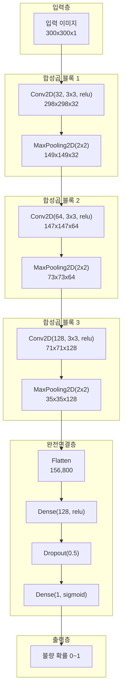

# 24차시: 딥러닝 응용 - CNN 기반 이미지 불량 검출

## 학습 목표

| 목표 | 설명 |
|------|------|
| CNN 구조 이해 | 합성곱 신경망의 구조와 각 층의 역할을 이해합니다 |
| 수식 전개 | 합성곱 연산, 다채널 확장, 특성 맵 크기 계산의 수학적 원리를 학습합니다 |
| Keras 구현 | CNN 모델을 Keras로 구성하고 학습합니다 |
| 불량 분류 | Casting Product Image를 활용하여 주조 제품 불량 검출을 수행합니다 |

---

## 실습 데이터셋

| 데이터셋 | 출처 | 용도 |
|---------|------|------|
| Casting Product Image | Kaggle | 주조 제품 결함 이진 분류 |

```python
# 데이터셋 다운로드 (Kaggle CLI 또는 수동)
# https://www.kaggle.com/datasets/ravirajsinh45/real-life-industrial-dataset-of-casting-product

# 디렉토리 구조:
# casting_data/
#   train/
#     ok_front/
#     def_front/
#   test/
#     ok_front/
#     def_front/
```

---

## 수학적 배경

### 합성곱 연산 (단채널)

입력 이미지 $I$와 커널(필터) $K$의 2D 합성곱 연산:

$$
(I * K)(i,j) = \sum_{m=0}^{k_h-1} \sum_{n=0}^{k_w-1} I(i+m, j+n) \cdot K(m,n)
$$

| 기호 | 의미 |
|------|------|
| $I$ | 입력 이미지 (2D 행렬) |
| $K$ | 커널/필터 (작은 2D 행렬) |
| $(i,j)$ | 출력 특성 맵의 위치 |
| $(m,n)$ | 커널 내부의 상대 위치 |
| $k_h, k_w$ | 커널의 높이, 너비 |

### 다채널 합성곱 연산

컬러 이미지(RGB)나 여러 입력 채널을 처리하는 합성곱:

$$
O_{c_{out}}(i,j) = b_{c_{out}} + \sum_{c_{in}=0}^{C_{in}-1} \sum_{m=0}^{k_h-1} \sum_{n=0}^{k_w-1} I_{c_{in}}(i+m, j+n) \cdot K_{c_{out}, c_{in}}(m,n)
$$

| 기호 | 의미 |
|------|------|
| $C_{in}$ | 입력 채널 수 (RGB면 3, 흑백이면 1) |
| $C_{out}$ | 출력 채널 수 (필터 개수) |
| $c_{out}$ | 출력 채널(필터) 인덱스 |
| $c_{in}$ | 입력 채널 인덱스 |
| $b_{c_{out}}$ | 편향(bias) 항 |
| $K_{c_{out}, c_{in}}$ | c_out번째 필터의 c_in번째 채널에 대한 커널 |

### 특성 맵 크기 계산

$$
O = \left\lfloor \frac{W - K + 2P}{S} \right\rfloor + 1
$$

| 기호 | 의미 | 예시 |
|------|------|------|
| $O$ | 출력 크기 | 298 |
| $W$ | 입력 크기 | 300 |
| $K$ | 커널 크기 | 3 |
| $P$ | 패딩 | 0 |
| $S$ | 스트라이드 | 1 |

**계산 예시 (Casting 이미지 첫 번째 합성곱층)**:

$$
O = \left\lfloor \frac{300 - 3 + 2 \times 0}{1} \right\rfloor + 1 = \lfloor 297 \rfloor + 1 = 298
$$

### 풀링 연산

Max Pooling 연산:

$$
y_{ij} = \max_{(m,n) \in R_{ij}} x_{mn}
$$

| 기호 | 의미 |
|------|------|
| $y_{ij}$ | 출력 위치 $(i,j)$의 값 |
| $R_{ij}$ | 풀링 영역 (예: 2x2) |
| $x_{mn}$ | 영역 내 입력값 |

---

## 강의 구성 (25분)

| 파트 | 주제 | 시간 |
|:----:|------|:----:|
| Part 1 | CNN 구조 이해 | 8분 |
| Part 2 | Keras CNN 구현 | 10분 |
| Part 3 | 평가 및 해석 | 5분 |
| 정리 | 핵심 요약 | 2분 |

---

## Part 1: CNN 구조 이해 (8분)

### 1.1 CNN 전체 구조

CNN(Convolutional Neural Network)은 이미지 처리에 특화된 신경망으로, 공간적 구조를 유지하면서 특징을 추출합니다.



| 층 유형 | 역할 | 파라미터 |
|--------|------|----------|
| Conv2D | 지역적 특징 추출 | 필터 수, 커널 크기 |
| MaxPooling2D | 공간 크기 축소, 강건성 확보 | 풀링 크기 |
| Flatten | 다차원을 1차원으로 변환 | 없음 |
| Dense | 분류 수행 | 뉴런 수 |
| Dropout | 과적합 방지 | 드롭 비율 |

---

### 1.2 합성곱 연산 수동 계산

```python
import numpy as np

def convolution_2d_manual(image, kernel):
    """
    2D 합성곱 연산을 수동으로 계산합니다.

    수식: (I * K)(i,j) = sum_m sum_n I(i+m, j+n) * K(m,n)

    Parameters:
        image: 2D numpy 배열 (입력 이미지)
        kernel: 2D numpy 배열 (필터)

    Returns:
        output: 2D numpy 배열 (특성 맵)
    """
    img_h, img_w = image.shape
    ker_h, ker_w = kernel.shape

    # 출력 크기 계산: O = W - K + 1 (패딩 0, 스트라이드 1)
    out_h = img_h - ker_h + 1
    out_w = img_w - ker_w + 1

    output = np.zeros((out_h, out_w))

    for i in range(out_h):
        for j in range(out_w):
            # 현재 위치의 영역 추출
            region = image[i:i+ker_h, j:j+ker_w]
            # 요소별 곱셈 후 합산
            output[i, j] = np.sum(region * kernel)

    return output

# 예시: 3x3 입력, 2x2 커널
image = np.array([
    [1, 2, 3],
    [4, 5, 6],
    [7, 8, 9]
], dtype=float)

kernel = np.array([
    [1, 0],
    [0, 1]
], dtype=float)

print("입력 이미지 (3x3):")
print(image)
print("\n커널 (2x2):")
print(kernel)

# 합성곱 연산 수행
output = convolution_2d_manual(image, kernel)
print("\n합성곱 결과 (2x2):")
print(output)
```

**실제 데이터 계산 과정**:

| 위치 | 연산 | 결과 |
|------|------|------|
| (0,0) | 1x1 + 2x0 + 4x0 + 5x1 | 6 |
| (0,1) | 2x1 + 3x0 + 5x0 + 6x1 | 8 |
| (1,0) | 4x1 + 5x0 + 7x0 + 8x1 | 12 |
| (1,1) | 5x1 + 6x0 + 8x0 + 9x1 | 14 |

---

### 1.3 다채널 합성곱 연산

```python
def convolution_multichannel(image, kernels, bias=None):
    """
    다채널 합성곱 연산을 수동으로 계산합니다.

    수식: O_c(i,j) = b_c + sum_cin sum_m sum_n I_cin(i+m,j+n) * K_c,cin(m,n)

    Parameters:
        image: (C_in, H, W) 형태의 다채널 입력
        kernels: (C_out, C_in, K_h, K_w) 형태의 필터
        bias: (C_out,) 형태의 편향 (선택)

    Returns:
        output: (C_out, H_out, W_out) 형태의 출력
    """
    c_in, img_h, img_w = image.shape
    c_out, _, ker_h, ker_w = kernels.shape

    out_h = img_h - ker_h + 1
    out_w = img_w - ker_w + 1

    output = np.zeros((c_out, out_h, out_w))

    for co in range(c_out):  # 각 출력 채널에 대해
        for i in range(out_h):
            for j in range(out_w):
                # 모든 입력 채널에서 합성곱 수행 후 합산
                for ci in range(c_in):
                    region = image[ci, i:i+ker_h, j:j+ker_w]
                    output[co, i, j] += np.sum(region * kernels[co, ci])
                # 편향 추가
                if bias is not None:
                    output[co, i, j] += bias[co]

    return output

# 예시: RGB 이미지 (3채널), 2개의 필터
image_rgb = np.random.rand(3, 4, 4)  # 3채널, 4x4 이미지
kernels = np.random.rand(2, 3, 2, 2)  # 2개 필터, 각 필터는 3채널 x 2x2
bias = np.array([0.1, 0.2])

output_multichannel = convolution_multichannel(image_rgb, kernels, bias)
print(f"입력 형태: {image_rgb.shape}")  # (3, 4, 4)
print(f"필터 형태: {kernels.shape}")    # (2, 3, 2, 2)
print(f"출력 형태: {output_multichannel.shape}")  # (2, 3, 3)
```

---

### 1.4 특성 맵 크기 계산 실습

```python
def calculate_output_size(W, K, P=0, S=1):
    """
    합성곱 출력 크기 계산

    공식: O = floor((W - K + 2P) / S) + 1

    Parameters:
        W: 입력 크기
        K: 커널 크기
        P: 패딩
        S: 스트라이드

    Returns:
        O: 출력 크기
    """
    O = (W - K + 2*P) // S + 1
    return O

print("특성 맵 크기 계산 공식: O = floor((W - K + 2P) / S) + 1")
print("=" * 70)

# Casting Image CNN 각 층의 크기 변화 추적 (300x300 입력)
print("\nCasting Image CNN 크기 변화 (입력: 300x300x1):")
print("-" * 70)

layers_info = [
    ("입력", 300, "-", "-", "-", 300),
    ("Conv2D(32, 3x3)", 300, 3, 0, 1, calculate_output_size(300, 3, 0, 1)),
    ("MaxPooling(2x2)", 298, 2, 0, 2, calculate_output_size(298, 2, 0, 2)),
    ("Conv2D(64, 3x3)", 149, 3, 0, 1, calculate_output_size(149, 3, 0, 1)),
    ("MaxPooling(2x2)", 147, 2, 0, 2, calculate_output_size(147, 2, 0, 2)),
    ("Conv2D(128, 3x3)", 73, 3, 0, 1, calculate_output_size(73, 3, 0, 1)),
    ("MaxPooling(2x2)", 71, 2, 0, 2, calculate_output_size(71, 2, 0, 2)),
]

for name, W, K, P, S, O in layers_info:
    if K == "-":
        print(f"  {name}: {O}x{O}")
    else:
        print(f"  {name}: ({W} - {K} + 2x{P}) / {S} + 1 = {O}x{O}")
```

**Casting Image CNN 크기 변화 요약**:

| 층 | 입력 크기 | 연산 | 출력 크기 |
|----|----------|------|----------|
| 입력 | - | - | 300x300x1 |
| Conv2D(32) | 300x300x1 | (300-3+0)/1+1 | 298x298x32 |
| MaxPool | 298x298x32 | (298-2)/2+1 | 149x149x32 |
| Conv2D(64) | 149x149x32 | (149-3+0)/1+1 | 147x147x64 |
| MaxPool | 147x147x64 | (147-2)/2+1 | 73x73x64 |
| Conv2D(128) | 73x73x128 | (73-3+0)/1+1 | 71x71x128 |
| MaxPool | 71x71x128 | (71-2)/2+1 | 35x35x128 |
| Flatten | 35x35x128 | 35x35x128 | 156,800 |

---

### 1.5 풀링 연산 수동 계산

```python
def max_pooling_2d(image, pool_size=2, stride=2):
    """
    2x2 Max Pooling 연산

    수식: y_ij = max_{(m,n) in R_ij} x_mn

    Parameters:
        image: 2D numpy 배열
        pool_size: 풀링 윈도우 크기
        stride: 스트라이드

    Returns:
        output: 풀링된 2D 배열
    """
    h, w = image.shape
    out_h = (h - pool_size) // stride + 1
    out_w = (w - pool_size) // stride + 1

    output = np.zeros((out_h, out_w))

    for i in range(out_h):
        for j in range(out_w):
            region = image[i*stride:i*stride+pool_size,
                          j*stride:j*stride+pool_size]
            output[i, j] = np.max(region)

    return output

# 예시 특성 맵 (4x4)
feature_map = np.array([
    [1, 3, 2, 4],
    [5, 6, 7, 8],
    [9, 10, 11, 12],
    [2, 1, 3, 2]
], dtype=float)

print("입력 특성 맵 (4x4):")
print(feature_map.astype(int))

max_pooled = max_pooling_2d(feature_map)
print("\n2x2 Max Pooling 결과 (2x2):")
print(max_pooled.astype(int))
```

**Max Pooling 계산 과정**:

| 영역 | 값 | 최댓값 |
|------|-----|--------|
| 좌상단 | [1, 3, 5, 6] | 6 |
| 우상단 | [2, 4, 7, 8] | 8 |
| 좌하단 | [9, 10, 2, 1] | 10 |
| 우하단 | [11, 12, 3, 2] | 12 |

---

### 1.6 CNN 파라미터 수 계산

파라미터 수 계산 공식:
- **Conv2D**: $(K_h \times K_w \times C_{in} + 1) \times C_{out}$
- **Dense**: $(n_{in} + 1) \times n_{out}$

```python
def calculate_conv_params(kernel_h, kernel_w, in_channels, out_channels):
    """Conv2D 층의 파라미터 수 계산"""
    weights = kernel_h * kernel_w * in_channels * out_channels
    biases = out_channels
    return weights + biases

def calculate_dense_params(in_features, out_features):
    """Dense 층의 파라미터 수 계산"""
    return (in_features + 1) * out_features

print("Casting Image CNN 파라미터 수 계산:")
print("=" * 50)

layers = [
    ("Conv2D(32, 3x3)", calculate_conv_params(3, 3, 1, 32)),
    ("Conv2D(64, 3x3)", calculate_conv_params(3, 3, 32, 64)),
    ("Conv2D(128, 3x3)", calculate_conv_params(3, 3, 64, 128)),
    ("Dense(128)", calculate_dense_params(156800, 128)),
    ("Dense(1)", calculate_dense_params(128, 1)),
]

total = 0
for name, params in layers:
    print(f"  {name}: {params:,} 파라미터")
    total += params

print("-" * 50)
print(f"  총 파라미터: {total:,}")
```

**파라미터 수 상세 계산**:

| 층 | 계산식 | 파라미터 수 |
|----|--------|------------|
| Conv2D(32) | (3x3x1+1)x32 | 320 |
| Conv2D(64) | (3x3x32+1)x64 | 18,496 |
| Conv2D(128) | (3x3x64+1)x128 | 73,856 |
| Dense(128) | (156800+1)x128 | 20,070,528 |
| Dense(1) | (128+1)x1 | 129 |
| **합계** | - | **20,163,329** |

---

## Part 2: Keras CNN 구현 (10분)

### 2.1 환경 설정 및 데이터 로드

```python
import numpy as np
import matplotlib.pyplot as plt
import os
from pathlib import Path

os.environ['TF_CPP_MIN_LOG_LEVEL'] = '2'

import tensorflow as tf
from tensorflow import keras
from tensorflow.keras.models import Sequential
from tensorflow.keras.layers import (
    Conv2D, MaxPooling2D, Flatten, Dense, Dropout
)
from tensorflow.keras.callbacks import EarlyStopping
from tensorflow.keras.preprocessing.image import ImageDataGenerator
from sklearn.metrics import classification_report, confusion_matrix

print(f"TensorFlow 버전: {tf.__version__}")

# 데이터 경로 설정
DATA_DIR = Path("casting_data")
TRAIN_DIR = DATA_DIR / "train"
TEST_DIR = DATA_DIR / "test"

# 이미지 크기 설정
IMG_HEIGHT = 300
IMG_WIDTH = 300
BATCH_SIZE = 32

print(f"\n데이터 디렉토리: {DATA_DIR}")
print(f"이미지 크기: {IMG_HEIGHT}x{IMG_WIDTH}")
print(f"배치 크기: {BATCH_SIZE}")
```

---

### 2.2 데이터 로드 및 전처리

```python
# ImageDataGenerator로 데이터 로드 및 전처리
train_datagen = ImageDataGenerator(
    rescale=1./255,           # 정규화 (0-255 -> 0-1)
    validation_split=0.2      # 검증 데이터 20%
)

test_datagen = ImageDataGenerator(
    rescale=1./255            # 테스트 데이터도 동일하게 정규화
)

# 학습 데이터 로드
train_generator = train_datagen.flow_from_directory(
    TRAIN_DIR,
    target_size=(IMG_HEIGHT, IMG_WIDTH),
    batch_size=BATCH_SIZE,
    color_mode='grayscale',   # 흑백으로 변환
    class_mode='binary',      # 이진 분류
    subset='training'
)

# 검증 데이터 로드
validation_generator = train_datagen.flow_from_directory(
    TRAIN_DIR,
    target_size=(IMG_HEIGHT, IMG_WIDTH),
    batch_size=BATCH_SIZE,
    color_mode='grayscale',
    class_mode='binary',
    subset='validation'
)

# 테스트 데이터 로드
test_generator = test_datagen.flow_from_directory(
    TEST_DIR,
    target_size=(IMG_HEIGHT, IMG_WIDTH),
    batch_size=BATCH_SIZE,
    color_mode='grayscale',
    class_mode='binary',
    shuffle=False
)

print(f"\n클래스 매핑: {train_generator.class_indices}")
print(f"학습 샘플 수: {train_generator.samples}")
print(f"검증 샘플 수: {validation_generator.samples}")
print(f"테스트 샘플 수: {test_generator.samples}")
```

**Casting Product Image 데이터셋 정보**:

| 항목 | 값 |
|------|-----|
| 원본 이미지 크기 | 512x512 픽셀 |
| 리사이즈 크기 | 300x300 픽셀 |
| 채널 | 1 (흑백 변환) |
| 클래스 | 2 (ok_front, def_front) |
| 학습 샘플 수 | 약 5,300 |
| 검증 샘플 수 | 약 1,300 |
| 테스트 샘플 수 | 약 700 |

---

### 2.3 전처리 전/후 비교

```python
# 원본 이미지 로드 (전처리 전)
from tensorflow.keras.preprocessing import image

# 샘플 이미지 경로
sample_ok = list((TRAIN_DIR / "ok_front").glob("*.jpeg"))[0]
sample_def = list((TRAIN_DIR / "def_front").glob("*.jpeg"))[0]

# 원본 이미지 로드
img_ok_original = image.load_img(sample_ok)
img_def_original = image.load_img(sample_def)

# 전처리 후 이미지
img_ok_processed = image.load_img(sample_ok, target_size=(IMG_HEIGHT, IMG_WIDTH), color_mode='grayscale')
img_def_processed = image.load_img(sample_def, target_size=(IMG_HEIGHT, IMG_WIDTH), color_mode='grayscale')

# 배열 변환
arr_ok_original = image.img_to_array(img_ok_original)
arr_ok_processed = image.img_to_array(img_ok_processed) / 255.0

arr_def_original = image.img_to_array(img_def_original)
arr_def_processed = image.img_to_array(img_def_processed) / 255.0

# 시각화 1: 전처리 전/후 비교
fig, axes = plt.subplots(2, 4, figsize=(16, 8))

# 정상 제품
axes[0, 0].imshow(img_ok_original)
axes[0, 0].set_title(f'Original OK\n{arr_ok_original.shape}')
axes[0, 0].axis('off')

axes[0, 1].imshow(img_ok_processed, cmap='gray')
axes[0, 1].set_title(f'Processed OK\n{arr_ok_processed.shape}')
axes[0, 1].axis('off')

axes[0, 2].hist(arr_ok_original.ravel(), bins=50, alpha=0.7)
axes[0, 2].set_title('Pixel Distribution (Before)')
axes[0, 2].set_xlabel('Pixel Value')

axes[0, 3].hist(arr_ok_processed.ravel(), bins=50, alpha=0.7, color='green')
axes[0, 3].set_title('Pixel Distribution (After)')
axes[0, 3].set_xlabel('Pixel Value (0-1)')

# 불량 제품
axes[1, 0].imshow(img_def_original)
axes[1, 0].set_title(f'Original Defect\n{arr_def_original.shape}')
axes[1, 0].axis('off')

axes[1, 1].imshow(img_def_processed, cmap='gray')
axes[1, 1].set_title(f'Processed Defect\n{arr_def_processed.shape}')
axes[1, 1].axis('off')

axes[1, 2].hist(arr_def_original.ravel(), bins=50, alpha=0.7)
axes[1, 2].set_title('Pixel Distribution (Before)')
axes[1, 2].set_xlabel('Pixel Value')

axes[1, 3].hist(arr_def_processed.ravel(), bins=50, alpha=0.7, color='red')
axes[1, 3].set_title('Pixel Distribution (After)')
axes[1, 3].set_xlabel('Pixel Value (0-1)')

plt.suptitle('Preprocessing Before/After Comparison', fontsize=14)
plt.tight_layout()
plt.savefig('preprocessing_comparison.png', dpi=150, bbox_inches='tight')
plt.show()

print("\n전처리 전/후 비교:")
print("-" * 50)
print(f"  원본 이미지 크기: {arr_ok_original.shape}")
print(f"  전처리 후 크기: {arr_ok_processed.shape}")
print(f"  원본 픽셀 범위: {arr_ok_original.min():.0f} ~ {arr_ok_original.max():.0f}")
print(f"  전처리 후 범위: {arr_ok_processed.min():.4f} ~ {arr_ok_processed.max():.4f}")
```

**전처리 단계 요약**:

| 단계 | 변환 전 | 변환 후 | 목적 |
|------|---------|---------|------|
| 리사이즈 | 512x512 | 300x300 | 계산량 감소, 메모리 효율 |
| 색상 변환 | RGB (3채널) | 흑백 (1채널) | 특징 단순화 |
| 정규화 | 0~255 | 0~1 | 학습 안정화 |
| Reshape | (H, W, C) | (N, H, W, C) | CNN 입력 형태 |

---

### 2.4 샘플 이미지 시각화

```python
# 시각화 2: 정상/불량 샘플 이미지
fig, axes = plt.subplots(2, 5, figsize=(15, 6))

# 정상 제품 샘플
ok_images = list((TRAIN_DIR / "ok_front").glob("*.jpeg"))[:5]
for i, img_path in enumerate(ok_images):
    img = image.load_img(img_path, target_size=(IMG_HEIGHT, IMG_WIDTH), color_mode='grayscale')
    axes[0, i].imshow(img, cmap='gray')
    axes[0, i].set_title(f'OK #{i+1}')
    axes[0, i].axis('off')

# 불량 제품 샘플
def_images = list((TRAIN_DIR / "def_front").glob("*.jpeg"))[:5]
for i, img_path in enumerate(def_images):
    img = image.load_img(img_path, target_size=(IMG_HEIGHT, IMG_WIDTH), color_mode='grayscale')
    axes[1, i].imshow(img, cmap='gray')
    axes[1, i].set_title(f'Defect #{i+1}')
    axes[1, i].axis('off')

plt.suptitle('Casting Product Samples: OK vs Defect', fontsize=14)
plt.tight_layout()
plt.savefig('casting_samples.png', dpi=150, bbox_inches='tight')
plt.show()
```

**샘플 이미지 해석 방향**:
- 정상 제품: 균일한 표면, 매끄러운 질감
- 불량 제품: 기포, 균열, 표면 거칠기 등의 결함 패턴

---

### 2.5 기본 CNN 모델 구성

```python
def create_casting_cnn(input_shape=(300, 300, 1)):
    """
    주조 제품 불량 검출용 CNN 모델 생성

    구조:
    - Conv2D(32) -> MaxPooling
    - Conv2D(64) -> MaxPooling
    - Conv2D(128) -> MaxPooling
    - Flatten -> Dense(128) -> Dense(1)

    Parameters:
        input_shape: 입력 이미지 형태 (H, W, C)

    Returns:
        model: 컴파일된 Keras 모델
    """
    model = Sequential([
        # 첫 번째 합성곱 블록
        Conv2D(32, (3, 3), activation='relu', input_shape=input_shape,
               name='conv1'),
        MaxPooling2D((2, 2), name='pool1'),

        # 두 번째 합성곱 블록
        Conv2D(64, (3, 3), activation='relu', name='conv2'),
        MaxPooling2D((2, 2), name='pool2'),

        # 세 번째 합성곱 블록
        Conv2D(128, (3, 3), activation='relu', name='conv3'),
        MaxPooling2D((2, 2), name='pool3'),

        # 분류기
        Flatten(name='flatten'),
        Dense(128, activation='relu', name='dense1'),
        Dropout(0.5, name='dropout'),
        Dense(1, activation='sigmoid', name='output')  # 이진 분류
    ])

    return model

# 모델 생성
model = create_casting_cnn()
model.summary()
```

**모델 구조 요약**:

| 층 | 출력 형태 | 파라미터 수 |
|----|----------|------------|
| conv1 (Conv2D) | (298, 298, 32) | 320 |
| pool1 (MaxPooling2D) | (149, 149, 32) | 0 |
| conv2 (Conv2D) | (147, 147, 64) | 18,496 |
| pool2 (MaxPooling2D) | (73, 73, 64) | 0 |
| conv3 (Conv2D) | (71, 71, 128) | 73,856 |
| pool3 (MaxPooling2D) | (35, 35, 128) | 0 |
| flatten | (156,800,) | 0 |
| dense1 | (128,) | 20,070,528 |
| dropout | (128,) | 0 |
| output | (1,) | 129 |

---

### 2.6 모델 컴파일 및 학습

```python
# 모델 컴파일
model.compile(
    optimizer='adam',
    loss='binary_crossentropy',
    metrics=['accuracy']
)

print("컴파일 설정:")
print("  - Optimizer: Adam")
print("  - Loss: binary_crossentropy (이진 분류)")
print("  - Metrics: accuracy")

# 콜백 설정
early_stop = EarlyStopping(
    monitor='val_loss',
    patience=5,
    restore_best_weights=True,
    verbose=1
)

# 모델 학습
print("\n모델 학습 시작...")
history = model.fit(
    train_generator,
    epochs=20,
    validation_data=validation_generator,
    callbacks=[early_stop],
    verbose=1
)

print(f"\n학습 완료!")
print(f"  실제 에포크 수: {len(history.history['loss'])}")
print(f"  최종 학습 정확도: {history.history['accuracy'][-1]:.4f}")
print(f"  최종 검증 정확도: {history.history['val_accuracy'][-1]:.4f}")
```

**학습 설정 요약**:

| 항목 | 설정값 | 설명 |
|------|--------|------|
| Optimizer | Adam | 적응형 학습률 |
| Loss | binary_crossentropy | 이진 분류용 |
| Batch Size | 32 | 메모리 효율성 |
| Validation Split | 0.2 | 검증 데이터 20% |
| Early Stopping | patience=5 | 조기 종료 |

---

### 2.7 학습 곡선 시각화

```python
# 시각화 3: 학습 곡선
fig, axes = plt.subplots(1, 2, figsize=(14, 5))

# 손실 곡선
axes[0].plot(history.history['loss'], label='Train', linewidth=2)
axes[0].plot(history.history['val_loss'], label='Validation', linewidth=2)
axes[0].set_title('Loss Curve', fontsize=14)
axes[0].set_xlabel('Epoch')
axes[0].set_ylabel('Loss')
axes[0].legend()
axes[0].grid(True, alpha=0.3)

# 정확도 곡선
axes[1].plot(history.history['accuracy'], label='Train', linewidth=2)
axes[1].plot(history.history['val_accuracy'], label='Validation', linewidth=2)
axes[1].set_title('Accuracy Curve', fontsize=14)
axes[1].set_xlabel('Epoch')
axes[1].set_ylabel('Accuracy')
axes[1].legend()
axes[1].grid(True, alpha=0.3)

plt.tight_layout()
plt.savefig('learning_curves.png', dpi=150, bbox_inches='tight')
plt.show()
```

**학습 곡선 해석 가이드**:

| 패턴 | 의미 | 조치 |
|------|------|------|
| Train/Val 수렴 | 정상 학습 | 유지 |
| Train 감소, Val 증가 | 과적합 | Dropout 증가, 데이터 증강 |
| Train/Val 높은 손실 | 과소적합 | 모델 복잡도 증가 |
| Val 불안정 | 학습률 문제 | 학습률 감소 |

---

## Part 3: 평가 및 해석 (5분)

### 3.1 테스트 데이터 평가

```python
# 테스트 데이터 평가
test_loss, test_accuracy = model.evaluate(test_generator, verbose=0)

print("테스트 데이터 평가 결과:")
print("=" * 40)
print(f"  테스트 손실: {test_loss:.4f}")
print(f"  테스트 정확도: {test_accuracy:.2%}")

# 예측 수행
y_pred_prob = model.predict(test_generator, verbose=0)
y_pred = (y_pred_prob > 0.5).astype(int).ravel()
y_true = test_generator.classes

print(f"\n예측 결과:")
print(f"  총 테스트 샘플: {len(y_true):,}")
print(f"  정확한 예측: {np.sum(y_pred == y_true):,}")
print(f"  오분류: {np.sum(y_pred != y_true):,}")
```

---

### 3.2 혼동 행렬 시각화

```python
# 시각화 4: 혼동 행렬
cm = confusion_matrix(y_true, y_pred)
class_names = ['OK (Normal)', 'Defect']

fig, ax = plt.subplots(figsize=(8, 6))
im = ax.imshow(cm, cmap='Blues')

ax.set_xticks([0, 1])
ax.set_yticks([0, 1])
ax.set_xticklabels(class_names)
ax.set_yticklabels(class_names)

for i in range(2):
    for j in range(2):
        color = 'white' if cm[i, j] > cm.max()/2 else 'black'
        ax.text(j, i, cm[i, j], ha='center', va='center', color=color, fontsize=20)

ax.set_xlabel('Predicted Label', fontsize=12)
ax.set_ylabel('True Label', fontsize=12)
ax.set_title('Confusion Matrix - Casting Defect Detection', fontsize=14)

plt.colorbar(im)
plt.tight_layout()
plt.savefig('confusion_matrix.png', dpi=150, bbox_inches='tight')
plt.show()

# 혼동 행렬 해석
tn, fp, fn, tp = cm.ravel()
print("\n혼동 행렬 상세:")
print(f"  True Negative (정상->정상): {tn}")
print(f"  False Positive (정상->불량): {fp} - 과검출")
print(f"  False Negative (불량->정상): {fn} - 미검출 (위험!)")
print(f"  True Positive (불량->불량): {tp}")
```

**혼동 행렬 해석 (제조업 관점)**:
- **TN (True Negative)**: 정상 제품을 정상으로 정확히 분류
- **FP (False Positive)**: 정상인데 불량으로 오판 (과검출) - 재검사 비용 발생
- **FN (False Negative)**: 불량인데 정상으로 오판 (미검출) - 불량 유출 위험!
- **TP (True Positive)**: 불량 제품을 불량으로 정확히 검출

---

### 3.3 분류 보고서

```python
# 분류 보고서 출력
print("분류 보고서:")
print("=" * 60)
print(classification_report(y_true, y_pred, target_names=class_names))
```

**주요 성능 지표 (제조업 관점)**:

| 지표 | 의미 | 제조업 적용 |
|------|------|------------|
| Precision | 불량 예측 중 실제 불량 비율 | 과검출 최소화 |
| Recall | 실제 불량 중 검출된 비율 | **불량 유출 방지 (최우선!)** |
| F1-score | Precision과 Recall의 조화평균 | 균형 잡힌 성능 |

---

### 3.4 Precision-Recall 분석

```python
from sklearn.metrics import precision_score, recall_score, f1_score, roc_auc_score, roc_curve

precision = precision_score(y_true, y_pred)
recall = recall_score(y_true, y_pred)
f1 = f1_score(y_true, y_pred)
auc = roc_auc_score(y_true, y_pred_prob)

print("불량 검출 성능 지표:")
print(f"  정밀도 (Precision): {precision:.4f}")
print(f"  재현율 (Recall): {recall:.4f}")
print(f"  F1-score: {f1:.4f}")
print(f"  AUC-ROC: {auc:.4f}")

# 시각화 5: ROC 곡선
fpr, tpr, thresholds = roc_curve(y_true, y_pred_prob)

fig, ax = plt.subplots(figsize=(8, 6))
ax.plot(fpr, tpr, linewidth=2, label=f'CNN Model (AUC = {auc:.3f})')
ax.plot([0, 1], [0, 1], 'k--', label='Random (AUC = 0.5)')
ax.set_xlabel('False Positive Rate')
ax.set_ylabel('True Positive Rate (Recall)')
ax.set_title('ROC Curve - Casting Defect Detection')
ax.legend()
ax.grid(True, alpha=0.3)
plt.tight_layout()
plt.savefig('roc_curve.png', dpi=150, bbox_inches='tight')
plt.show()
```

---

### 3.5 오분류 분석

```python
# 오분류 샘플 인덱스
wrong_idx = np.where(y_pred != y_true)[0]

# 시각화 6: 오분류 샘플
if len(wrong_idx) > 0:
    sample_size = min(10, len(wrong_idx))
    sample_idx = np.random.choice(wrong_idx, sample_size, replace=False)

    fig, axes = plt.subplots(2, 5, figsize=(15, 6))

    for i, ax in enumerate(axes.flat):
        if i < sample_size:
            idx = sample_idx[i]
            # 이미지 로드
            img_path = test_generator.filepaths[idx]
            img = image.load_img(img_path, target_size=(IMG_HEIGHT, IMG_WIDTH), color_mode='grayscale')

            ax.imshow(img, cmap='gray')
            true_label = class_names[y_true[idx]]
            pred_label = class_names[y_pred[idx]]
            prob = y_pred_prob[idx][0]
            ax.set_title(f'True: {true_label}\nPred: {pred_label}\nProb: {prob:.2f}', fontsize=9)
            ax.axis('off')
        else:
            ax.axis('off')

    plt.suptitle('Misclassified Samples', fontsize=14)
    plt.tight_layout()
    plt.savefig('misclassified_samples.png', dpi=150, bbox_inches='tight')
    plt.show()

print(f"\n오분류 분석:")
print(f"  총 오분류: {len(wrong_idx)}개")
print(f"  미검출 (불량->정상): {np.sum((y_true == 1) & (y_pred == 0))}개")
print(f"  과검출 (정상->불량): {np.sum((y_true == 0) & (y_pred == 1))}개")
```

**오분류 원인 분석**:
- 미세한 결함으로 검출 어려움
- 조명 조건 차이
- 정상 제품의 자연적 표면 변동
- 결함 패턴의 다양성

---

### 3.6 예측 확신도 분석

```python
# 시각화 7: 예측 확신도 분포
correct_mask = (y_pred == y_true)
correct_confidences = np.where(y_pred[correct_mask] == 1,
                                y_pred_prob[correct_mask].ravel(),
                                1 - y_pred_prob[correct_mask].ravel())
wrong_confidences = np.where(y_pred[~correct_mask] == 1,
                              y_pred_prob[~correct_mask].ravel(),
                              1 - y_pred_prob[~correct_mask].ravel())

fig, ax = plt.subplots(figsize=(10, 5))
ax.hist(correct_confidences, bins=30, alpha=0.7, label='Correct', color='green')
if len(wrong_confidences) > 0:
    ax.hist(wrong_confidences, bins=30, alpha=0.7, label='Wrong', color='red')
ax.set_xlabel('Prediction Confidence')
ax.set_ylabel('Count')
ax.set_title('Confidence Distribution: Correct vs Wrong Predictions')
ax.legend()
ax.grid(True, alpha=0.3)
plt.tight_layout()
plt.savefig('confidence_distribution.png', dpi=150, bbox_inches='tight')
plt.show()

print("\n확신도 통계:")
print(f"  정확한 예측 평균 확신도: {correct_confidences.mean():.3f}")
if len(wrong_confidences) > 0:
    print(f"  오분류 평균 확신도: {wrong_confidences.mean():.3f}")
```

**확신도 분석 의미**:
- 정확한 예측: 높은 확신도 기대
- 오분류: 낮은 확신도 경향
- 확신도 임계값으로 불확실한 예측 필터링 가능

---

### 3.7 이미지 분류 파이프라인

```mermaid
flowchart LR
    subgraph DataPrep["데이터 준비"]
        A["이미지 수집"] --> B["라벨링<br/>(OK/Defect)"]
        B --> C["Train/Test 분리"]
    end

    subgraph Preprocess["전처리"]
        D["리사이즈<br/>(512->300)"] --> E["흑백 변환"]
        E --> F["정규화<br/>(0-255 -> 0-1)"]
    end

    subgraph Training["모델 학습"]
        G["CNN 구성"] --> H["Compile"]
        H --> I["Fit"]
        I --> J["Early Stopping"]
    end

    subgraph Evaluation["평가"]
        K["Predict"] --> L["혼동 행렬"]
        L --> M["Recall 분석"]
        M --> N["오분류 검토"]
    end

    subgraph Deploy["배포"]
        O["모델 저장<br/>(.keras)"] --> P["실시간 추론"]
    end

    C --> D
    F --> G
    J --> K
    N --> O
```



---

### 3.8 모델 저장 및 예측 함수

```python
# 모델 저장
model.save('casting_defect_cnn.keras')
print("모델 저장 완료: casting_defect_cnn.keras")

# 단일 이미지 예측 함수
def predict_single_image(model, image_path, threshold=0.5):
    """
    단일 이미지 불량 여부 예측

    Parameters:
        model: 학습된 CNN 모델
        image_path: 이미지 파일 경로
        threshold: 분류 임계값 (기본 0.5)

    Returns:
        prediction: 예측 결과 ('OK' 또는 'Defect')
        confidence: 확신도
    """
    # 이미지 로드 및 전처리
    img = image.load_img(image_path, target_size=(IMG_HEIGHT, IMG_WIDTH), color_mode='grayscale')
    img_array = image.img_to_array(img) / 255.0
    img_array = np.expand_dims(img_array, axis=0)

    # 예측
    prob = model.predict(img_array, verbose=0)[0][0]

    if prob > threshold:
        return 'Defect', prob
    else:
        return 'OK', 1 - prob

# 예측 테스트
print("\n단일 이미지 예측 테스트:")
test_images = test_generator.filepaths[:5]
for img_path in test_images:
    pred, conf = predict_single_image(model, img_path)
    actual = 'Defect' if 'def_front' in img_path else 'OK'
    status = "O" if pred == actual else "X"
    print(f"  [{status}] 예측: {pred:8} | 실제: {actual:8} | 확신도: {conf:.2%}")
```

---

## 핵심 정리

### 오늘 배운 내용

| 주제 | 핵심 내용 |
|------|----------|
| 합성곱 연산 | $(I * K)(i,j) = \sum_m \sum_n I(i+m, j+n) \cdot K(m,n)$ |
| 다채널 합성곱 | $O_c(i,j) = b_c + \sum_{c_{in}} \sum_m \sum_n I_{c_{in}}(i+m,j+n) \cdot K_{c,c_{in}}(m,n)$ |
| 특성 맵 크기 | $O = \lfloor \frac{W - K + 2P}{S} \rfloor + 1$ |
| Max Pooling | $y_{ij} = \max_{(m,n) \in R_{ij}} x_{mn}$ |
| CNN 구조 | Conv2D -> MaxPooling -> Flatten -> Dense |
| 출력 활성화 | 이진분류: sigmoid, 다중분류: softmax |
| 손실 함수 | 이진분류: binary_crossentropy |

### 핵심 코드

```python
# CNN 모델 구성 (이진 분류)
model = Sequential([
    Conv2D(32, (3, 3), activation='relu', input_shape=(300, 300, 1)),
    MaxPooling2D((2, 2)),
    Conv2D(64, (3, 3), activation='relu'),
    MaxPooling2D((2, 2)),
    Conv2D(128, (3, 3), activation='relu'),
    MaxPooling2D((2, 2)),
    Flatten(),
    Dense(128, activation='relu'),
    Dropout(0.5),
    Dense(1, activation='sigmoid')
])

model.compile(optimizer='adam',
              loss='binary_crossentropy',
              metrics=['accuracy'])

model.fit(train_generator, epochs=20,
          validation_data=validation_generator,
          callbacks=[EarlyStopping(patience=5)])
```

### 체크리스트

| 항목 | 확인 |
|------|------|
| 합성곱 연산 수식 이해 (단채널, 다채널) | [ ] |
| 특성 맵 크기 계산 공식 적용 | [ ] |
| Conv2D, MaxPooling2D 층 구성 | [ ] |
| 이미지 데이터 전처리 (리사이즈, 정규화) | [ ] |
| 이진 분류 설정 (sigmoid, binary_crossentropy) | [ ] |
| 혼동 행렬과 Recall로 불량 검출 성능 분석 | [ ] |
| 모델 저장 및 단일 이미지 예측 | [ ] |

---

## 다음 차시 예고

### [25차시] 딥러닝 모델 해석

- 학습된 모델의 예측 근거 이해
- Grad-CAM: 어디를 보고 판단했는가?
- 변수별 영향력 분석 (SHAP, LIME)
- 모델 해석의 제조업 활용

---

---

## [참고자료] 심화 학습

> 선택 학습 - 25분 초과 콘텐츠

### A. 개선된 CNN 모델 (BatchNormalization)

BatchNormalization은 각 층의 입력을 정규화하여 학습을 안정화하고 수렴 속도를 향상시킵니다.

```python
from tensorflow.keras.layers import BatchNormalization

def create_improved_cnn(input_shape=(300, 300, 1)):
    """
    개선된 CNN 모델 (BatchNormalization 포함)

    개선사항:
    - BatchNormalization: 학습 안정화
    - Dropout: 과적합 방지
    - 더 깊은 구조
    """
    model = Sequential([
        # 첫 번째 합성곱 블록
        Conv2D(32, (3, 3), padding='same', activation='relu',
               input_shape=input_shape),
        BatchNormalization(),
        Conv2D(32, (3, 3), padding='same', activation='relu'),
        BatchNormalization(),
        MaxPooling2D((2, 2)),
        Dropout(0.25),

        # 두 번째 합성곱 블록
        Conv2D(64, (3, 3), padding='same', activation='relu'),
        BatchNormalization(),
        Conv2D(64, (3, 3), padding='same', activation='relu'),
        BatchNormalization(),
        MaxPooling2D((2, 2)),
        Dropout(0.25),

        # 세 번째 합성곱 블록
        Conv2D(128, (3, 3), padding='same', activation='relu'),
        BatchNormalization(),
        Conv2D(128, (3, 3), padding='same', activation='relu'),
        BatchNormalization(),
        MaxPooling2D((2, 2)),
        Dropout(0.25),

        # 분류기
        Flatten(),
        Dense(256, activation='relu'),
        BatchNormalization(),
        Dropout(0.5),
        Dense(1, activation='sigmoid')
    ])

    return model

model_improved = create_improved_cnn()
model_improved.summary()
```

**BatchNormalization 효과**:

| 항목 | 설명 |
|------|------|
| 학습 안정화 | 각 층의 입력 분포 정규화 |
| 수렴 속도 향상 | 더 높은 학습률 사용 가능 |
| 정규화 효과 | 약간의 과적합 방지 |

---

### B. 데이터 증강 기법

데이터 증강은 원본 데이터를 변환하여 학습 데이터를 늘리는 기법으로, 과적합을 방지하고 일반화 성능을 향상시킵니다.

```python
train_datagen_aug = ImageDataGenerator(
    rescale=1./255,
    rotation_range=10,        # 회전 범위 (도)
    width_shift_range=0.1,    # 수평 이동 범위
    height_shift_range=0.1,   # 수직 이동 범위
    zoom_range=0.1,           # 확대/축소 범위
    horizontal_flip=True,     # 수평 반전
    fill_mode='nearest',
    validation_split=0.2
)

# 증강된 데이터로 학습
train_generator_aug = train_datagen_aug.flow_from_directory(
    TRAIN_DIR,
    target_size=(IMG_HEIGHT, IMG_WIDTH),
    batch_size=BATCH_SIZE,
    color_mode='grayscale',
    class_mode='binary',
    subset='training'
)
```

**데이터 증강 설정 (주조 제품)**:

| 파라미터 | 값 | 설명 |
|----------|-----|------|
| rotation_range | 10 | 무작위 회전 각도 |
| width_shift_range | 0.1 | 수평 이동 비율 |
| height_shift_range | 0.1 | 수직 이동 비율 |
| zoom_range | 0.1 | 확대/축소 범위 |
| horizontal_flip | True | 수평 반전 적용 |

---

### C. 특징 맵 시각화

CNN이 학습한 특징을 시각화하여 모델의 작동 방식을 이해합니다.

```python
def visualize_feature_maps(model, image_array, layer_names=None):
    """
    CNN 특징 맵 시각화

    Parameters:
        model: 학습된 CNN 모델
        image_array: 입력 이미지 (H, W, C)
        layer_names: 시각화할 층 이름 리스트
    """
    if layer_names is None:
        layer_names = [layer.name for layer in model.layers
                      if 'conv' in layer.name]

    outputs = [model.get_layer(name).output for name in layer_names]
    feature_model = keras.Model(inputs=model.input, outputs=outputs)

    # 입력 형태 맞추기
    if len(image_array.shape) == 3:
        image_array = np.expand_dims(image_array, axis=0)

    feature_maps = feature_model.predict(image_array, verbose=0)

    for layer_name, fmap in zip(layer_names, feature_maps):
        n_features = min(fmap.shape[-1], 8)

        fig, axes = plt.subplots(1, n_features, figsize=(15, 2))
        fig.suptitle(f'Layer: {layer_name}', fontsize=12)

        for i in range(n_features):
            axes[i].imshow(fmap[0, :, :, i], cmap='viridis')
            axes[i].set_title(f'Filter {i}')
            axes[i].axis('off')

        plt.tight_layout()
        plt.savefig(f'feature_map_{layer_name}.png', dpi=150, bbox_inches='tight')
        plt.show()

# 특징 맵 시각화 실행
sample_img_path = test_generator.filepaths[0]
sample_img = image.load_img(sample_img_path, target_size=(IMG_HEIGHT, IMG_WIDTH), color_mode='grayscale')
sample_array = image.img_to_array(sample_img) / 255.0

visualize_feature_maps(model, sample_array)
```

**특징 맵 해석**:
- 초기 층: 엣지, 질감 등 저수준 특징
- 후반 층: 형태, 결함 패턴 등 고수준 특징
- 필터별로 다른 특징 감지

---

### D. 클래스 가중치 적용

불균형 데이터에서 클래스 가중치를 적용하여 불량 클래스의 학습을 강화합니다.

```python
from sklearn.utils.class_weight import compute_class_weight

# 클래스 가중치 계산
class_weights = compute_class_weight(
    class_weight='balanced',
    classes=np.array([0, 1]),
    y=train_generator.classes
)
class_weight_dict = dict(enumerate(class_weights))

print(f"클래스 가중치:")
print(f"  OK (0): {class_weight_dict[0]:.3f}")
print(f"  Defect (1): {class_weight_dict[1]:.3f}")

# 클래스 가중치 적용 학습
model.fit(
    train_generator,
    epochs=20,
    validation_data=validation_generator,
    class_weight=class_weight_dict,
    callbacks=[EarlyStopping(patience=5, restore_best_weights=True)]
)
```

**클래스 가중치 효과**:
- 불량 클래스에 높은 가중치 부여
- Recall (재현율) 향상
- 불량 유출 방지에 효과적

---

### E. Recall 우선 임계값 조정

제조업에서는 불량 유출 방지가 중요하므로, Recall을 높이기 위해 분류 임계값을 조정합니다.

```python
# 다양한 임계값에서 성능 분석
thresholds = [0.3, 0.4, 0.5, 0.6, 0.7]

print("임계값별 성능 분석:")
print("-" * 60)
print(f"{'임계값':^10} {'Precision':^12} {'Recall':^12} {'F1':^12}")
print("-" * 60)

for threshold in thresholds:
    y_pred_t = (y_pred_prob > threshold).astype(int).ravel()
    prec = precision_score(y_true, y_pred_t)
    rec = recall_score(y_true, y_pred_t)
    f1 = f1_score(y_true, y_pred_t)
    print(f"{threshold:^10.1f} {prec:^12.4f} {rec:^12.4f} {f1:^12.4f}")

print("-" * 60)
print("제조업 권장: 낮은 임계값으로 Recall 우선 (불량 유출 방지)")
```

**임계값 조정 가이드**:

| 임계값 | Precision | Recall | 적용 시나리오 |
|--------|-----------|--------|--------------|
| 0.3 | 낮음 | 높음 | 불량 유출 방지 우선 |
| 0.5 | 균형 | 균형 | 일반적 사용 |
| 0.7 | 높음 | 낮음 | 재검사 비용 최소화 |

---

### F. 전체 파이프라인 코드

```python
# 완전한 CNN 불량 검출 파이프라인
import numpy as np
import matplotlib.pyplot as plt
from pathlib import Path
import tensorflow as tf
from tensorflow.keras.models import Sequential
from tensorflow.keras.layers import Conv2D, MaxPooling2D, Flatten, Dense, Dropout
from tensorflow.keras.callbacks import EarlyStopping
from tensorflow.keras.preprocessing.image import ImageDataGenerator
from sklearn.metrics import classification_report, confusion_matrix

# 1. 설정
DATA_DIR = Path("casting_data")
IMG_HEIGHT, IMG_WIDTH = 300, 300
BATCH_SIZE = 32

# 2. 데이터 로드
train_datagen = ImageDataGenerator(rescale=1./255, validation_split=0.2)
test_datagen = ImageDataGenerator(rescale=1./255)

train_gen = train_datagen.flow_from_directory(
    DATA_DIR / "train", target_size=(IMG_HEIGHT, IMG_WIDTH),
    color_mode='grayscale', class_mode='binary', subset='training'
)
val_gen = train_datagen.flow_from_directory(
    DATA_DIR / "train", target_size=(IMG_HEIGHT, IMG_WIDTH),
    color_mode='grayscale', class_mode='binary', subset='validation'
)
test_gen = test_datagen.flow_from_directory(
    DATA_DIR / "test", target_size=(IMG_HEIGHT, IMG_WIDTH),
    color_mode='grayscale', class_mode='binary', shuffle=False
)

# 3. 모델 구성
model = Sequential([
    Conv2D(32, (3, 3), activation='relu', input_shape=(IMG_HEIGHT, IMG_WIDTH, 1)),
    MaxPooling2D((2, 2)),
    Conv2D(64, (3, 3), activation='relu'),
    MaxPooling2D((2, 2)),
    Conv2D(128, (3, 3), activation='relu'),
    MaxPooling2D((2, 2)),
    Flatten(),
    Dense(128, activation='relu'),
    Dropout(0.5),
    Dense(1, activation='sigmoid')
])

# 4. 컴파일
model.compile(optimizer='adam', loss='binary_crossentropy', metrics=['accuracy'])

# 5. 학습
history = model.fit(
    train_gen, epochs=20, validation_data=val_gen,
    callbacks=[EarlyStopping(patience=5, restore_best_weights=True)]
)

# 6. 평가
test_loss, test_acc = model.evaluate(test_gen, verbose=0)
print(f"테스트 정확도: {test_acc:.2%}")

# 7. 저장
model.save('casting_defect_cnn.keras')
```
