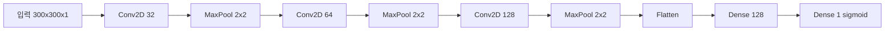

<!-- _class: lead -->
# [24차시] 딥러닝 응용: CNN 기반 이미지 불량 검출

## 합성곱 신경망으로 주조 제품 결함 검사하기

---

# 학습 목표

1. **합성곱 신경망(CNN)**의 구조와 수학적 원리를 이해한다
2. **Keras**로 CNN 모델을 구성하고 학습한다
3. **Casting Product Image** 데이터셋으로 불량 검출을 수행한다

---

# 지난 시간 복습

- **오토인코더**: 인코더-디코더 구조로 차원 축소
- **재구성 오차**: 이상 탐지의 핵심 지표
- **비지도학습**: 라벨 없이 데이터의 핵심 표현 학습

**오늘**: CNN을 활용한 이미지 기반 불량 검출 실습

---

# 수업 흐름

| 구간 | 시간 | 내용 |
|:----:|:----:|------|
| 대주제 1 | 8분 | CNN 수학적 배경 |
| 대주제 2 | 10분 | Keras CNN 모델 구성 |
| 대주제 3 | 5분 | 주조 제품 불량 분류 실습 |
| 정리 | 2분 | 핵심 요약 |

---

<!-- _class: lead -->
# 대주제 1
## CNN 수학적 배경

---

# CNN의 핵심 구조

```
입력 이미지
    |
[합성곱층 Conv2D]     <- 필터로 특징 추출
    |
[풀링층 MaxPooling]   <- 공간 크기 축소
    |
(반복)
    |
[평탄화 Flatten]      <- 1차원 변환
    |
[완전연결층 Dense]    <- 분류
    |
출력
```

---

# 합성곱 연산 (Convolution)

입력 이미지 $I$와 커널(필터) $K$의 2D 합성곱:

$$
(I * K)(i,j) = \sum_{m=0}^{k_h-1} \sum_{n=0}^{k_w-1} I(i+m, j+n) \cdot K(m,n)
$$

| 기호 | 의미 |
|------|------|
| $I$ | 입력 이미지 (2D 행렬) |
| $K$ | 커널/필터 (작은 2D 행렬) |
| $(i,j)$ | 출력 특성 맵의 위치 |
| $k_h, k_w$ | 커널의 높이, 너비 |

---

# 합성곱 연산 예시

```
입력 (3x3):           커널 (2x2):
[1  2  3]             [1  0]
[4  5  6]             [0  1]
[7  8  9]

출력 (2x2):
(0,0): 1*1 + 2*0 + 4*0 + 5*1 = 6
(0,1): 2*1 + 3*0 + 5*0 + 6*1 = 8
(1,0): 4*1 + 5*0 + 7*0 + 8*1 = 12
(1,1): 5*1 + 6*0 + 8*0 + 9*1 = 14

결과: [6  8 ]
      [12 14]
```

---

# 다채널 합성곱 연산

컬러 이미지(RGB)나 여러 필터 출력에 대한 합성곱:

$$
O_{c_{out}}(i,j) = b_{c_{out}} + \sum_{c_{in}=0}^{C_{in}-1} \sum_{m=0}^{k_h-1} \sum_{n=0}^{k_w-1} I_{c_{in}}(i+m, j+n) \cdot K_{c_{out}, c_{in}}(m,n)
$$

| 기호 | 의미 |
|------|------|
| $C_{in}$ | 입력 채널 수 (RGB면 3) |
| $c_{out}$ | 출력 필터 인덱스 |
| $b_{c_{out}}$ | 편향(bias) |

---

# 특성 맵 크기 계산

출력 크기 공식:

$$
O = \left\lfloor \frac{W - K + 2P}{S} \right\rfloor + 1
$$

| 기호 | 의미 | 예시 |
|------|------|------|
| $W$ | 입력 크기 | 300 |
| $K$ | 커널 크기 | 3 |
| $P$ | 패딩 | 0 |
| $S$ | 스트라이드 | 1 |
| $O$ | 출력 크기 | (300-3+0)/1+1 = 298 |

---

# 패딩과 스트라이드

**패딩 (Padding)**:
- `valid`: 패딩 없음 (크기 감소)
- `same`: 입력과 동일 크기 유지 ($P = \lfloor K/2 \rfloor$)

**스트라이드 (Stride)**:
- 필터 이동 간격
- stride=2: 출력 크기 약 절반

```
stride=1: [1][2][3][4][5] -> 5-3+1 = 3 출력
stride=2: [1][2][3][4][5] -> (5-3)/2+1 = 2 출력
```

---

# 풀링 연산 (Max Pooling)

영역 $R_{ij}$ 내 최댓값 선택:

$$
y_{ij} = \max_{(m,n) \in R_{ij}} x_{mn}
$$

```
2x2 Max Pooling:

입력 (4x4):          출력 (2x2):
[1 3 | 2 4]          [6  8]
[5 6 | 7 8]    ->    [10 12]
---------
[9 10| 11 12]
[2 1 | 3  2]
```

**효과**: 크기 축소, 위치 불변성, 계산량 감소

---

# CNN 파라미터 계산

**Conv2D 파라미터 수**:
$$
\text{params} = (K_h \times K_w \times C_{in} + 1) \times C_{out}
$$

예시: Conv2D(32, (3,3)), 입력 채널 3개 (RGB)
- $(3 \times 3 \times 3 + 1) \times 32 = 896$

**Dense 파라미터 수**:
$$
\text{params} = (n_{in} + 1) \times n_{out}
$$

---

# 계층적 특징 학습

```
입력 이미지
    |
[Conv1] -> 저수준 특징 (엣지, 코너)
    |
[Conv2] -> 중간 특징 (텍스처, 패턴)
    |
[Conv3] -> 고수준 특징 (형태, 결함 패턴)
    |
[Dense] -> 분류 결정 (정상/불량)
```

**깊어질수록 추상적인 특징 학습**

---

<!-- _class: lead -->
# 대주제 2
## Keras CNN 모델 구성

---

# CNN 모델 아키텍처



---

# Conv2D 층 구성

```python
Conv2D(filters, kernel_size, activation, padding, strides)
```

| 파라미터 | 의미 | 권장값 |
|---------|------|--------|
| filters | 필터 개수 | 32, 64, 128 |
| kernel_size | 필터 크기 | (3,3) |
| activation | 활성화 함수 | 'relu' |
| padding | 패딩 방식 | 'same' |
| strides | 이동 간격 | (1,1) |

---

# MaxPooling2D 층

```python
MaxPooling2D(pool_size=(2, 2))
```

**효과**:
- 공간 크기 절반 축소
- 파라미터 없음 (학습 대상 X)
- 위치 변화에 강건

**대안**: AveragePooling2D (평균값 사용)

---

# Flatten과 Dense

**Flatten**:
- 다차원 특성 맵을 1차원으로 변환
- (37, 37, 128) -> (175232,)

**Dense**:
- 완전 연결층
- 분류 수행

```python
Flatten(),
Dense(128, activation='relu'),
Dropout(0.5),
Dense(1, activation='sigmoid')  # 이진분류
```

---

# 이미지 데이터 형태

```
Keras CNN 입력 형태: (samples, height, width, channels)

예시:
- 흑백 이미지: (1000, 300, 300, 1)
- 컬러 이미지: (1000, 300, 300, 3)

정규화:
- 픽셀값 범위: 0~255 -> 0~1
- X = X / 255.0
```

---

# 이진 분류 설정

| 항목 | 설정 |
|------|------|
| 출력층 | Dense(1, activation='sigmoid') |
| 손실 함수 | 'binary_crossentropy' |
| 라벨 형태 | 0 (정상) 또는 1 (불량) |

```python
model.compile(
    optimizer='adam',
    loss='binary_crossentropy',
    metrics=['accuracy']
)
```

---

# 전처리 전/후 비교

| 항목 | 전처리 전 | 전처리 후 |
|------|----------|----------|
| 이미지 크기 | 다양함 (512x512 등) | 300x300 통일 |
| 픽셀 범위 | 0~255 (uint8) | 0~1 (float32) |
| 채널 | RGB (3채널) | 흑백 (1채널) |
| 형태 | (H, W, C) | (N, H, W, C) |

**정규화 수식**: $X_{norm} = \frac{X}{255}$

---

<!-- _class: lead -->
# 대주제 3
## 주조 제품 불량 분류 실습

---

# 실습 데이터: Casting Product Image

| 항목 | 내용 |
|------|------|
| 이미지 크기 | 512 x 512 픽셀 (원본) |
| 학습 데이터 | 약 6,600장 |
| 테스트 데이터 | 약 700장 |
| 클래스 수 | 2개 (ok_front, def_front) |

**제조 시나리오**: 주조 부품 외관 결함 검출

---

# 클래스 구성

| 라벨 | 품목 | 설명 |
|------|------|------|
| 0 | ok_front | 정상 제품 |
| 1 | def_front | 결함 제품 (기포, 균열 등) |

**불량 유형**:
- 기포 (Air Pocket)
- 수축 결함 (Shrinkage)
- 균열 (Crack)
- 표면 거칠기

---

# 모델 성능 평가

**혼동 행렬 (Confusion Matrix)**:
- 실제 vs 예측 클래스 비교
- 오분류 패턴 파악

**분류 보고서**:
- Precision: 불량 예측 중 실제 불량 비율
- Recall: 실제 불량 중 검출된 비율 (중요!)
- F1-score: 조화 평균

---

# 제조업 품질 검사 파이프라인

```
주조 제품 생산 라인:

[주조 공정]
    |
[카메라 촬영]
    |
[이미지 전처리]
    |
[CNN 모델 추론]
    |
[정상/불량 분류]
    |
[자동 선별 / 재검사]
```

---

<!-- _class: lead -->
# 핵심 정리

---

# CNN 수학 공식 요약

| 연산 | 공식 |
|------|------|
| 합성곱 | $(I * K)(i,j) = \sum_{m} \sum_{n} I(i+m, j+n) \cdot K(m,n)$ |
| 다채널 합성곱 | $O_{c}(i,j) = b_c + \sum_{c_{in}} \sum_{m} \sum_{n} I_{c_{in}}(i+m, j+n) \cdot K_{c,c_{in}}(m,n)$ |
| Max Pooling | $y_{ij} = \max_{(m,n) \in R_{ij}} x_{mn}$ |
| 출력 크기 | $O = \lfloor \frac{W - K + 2P}{S} \rfloor + 1$ |

---

# CNN 구성 요약

```
1. 특징 추출부
   +-- Conv2D (필터로 특징 추출)
   +-- MaxPooling2D (크기 축소)
   +-- (반복)

2. 분류부
   +-- Flatten (1차원 변환)
   +-- Dense + Dropout (분류)
   +-- Dense(sigmoid) (이진 출력)
```

---

# 오늘 배운 내용

1. **CNN 수학적 배경**
   - 합성곱 연산과 다채널 확장
   - 특성 맵 크기 계산 공식

2. **Keras CNN 구현**
   - Conv2D, MaxPooling2D, Flatten
   - 이진 분류 설정 (sigmoid, binary_crossentropy)

3. **이미지 불량 분류**
   - Casting Product Image 데이터셋
   - 전처리 전/후 비교, 성능 평가

---

# 체크리스트

- [ ] 합성곱 연산 수식 이해 (단채널, 다채널)
- [ ] 특성 맵 크기 계산 공식 적용
- [ ] Conv2D, MaxPooling2D 층 구성
- [ ] 이미지 데이터 전처리 (정규화, reshape)
- [ ] 이진 분류 모델 학습 (sigmoid, binary_crossentropy)
- [ ] 혼동 행렬과 Recall로 성능 분석

---

# 다음 차시 예고

## [25차시] 딥러닝 모델 해석

- 학습된 모델의 예측 근거 이해
- Grad-CAM: 어디를 보고 판단했는가?
- 변수별 영향력 분석

---

<!-- _class: lead -->
# 수고하셨습니다!

## 질문: CNN 불량 검출 모델을 현장에 적용할 때 고려사항은?
