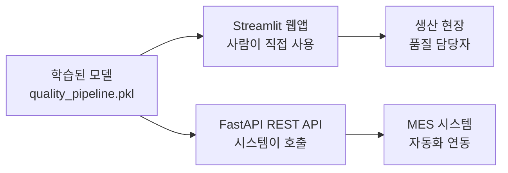
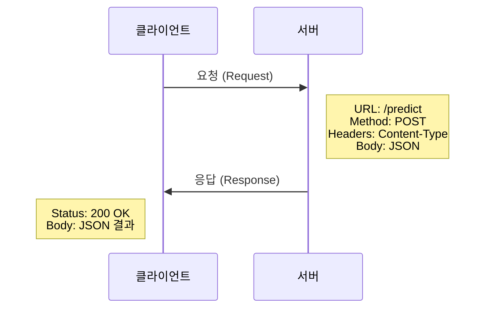
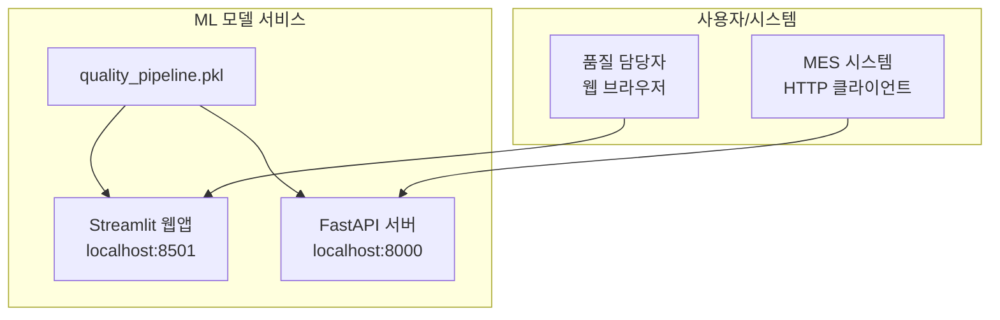

# 27차시: ML 모델 서비스 배포 - API 기초부터 웹앱/API 서버 구축까지

## 학습 목표

| 목표 | 설명 |
|------|------|
| REST API 이해 | HTTP 통신 방식과 REST API 구조를 이해함 |
| requests 활용 | Python requests 라이브러리로 API 호출을 실습함 |
| Streamlit 웹앱 구현 | Python만으로 대화형 예측 웹앱을 제작함 |
| FastAPI REST API 구축 | HTTP 엔드포인트로 예측 서비스를 제공함 |
| Pydantic 데이터 검증 | 타입 힌트 기반 자동 입력 검증을 구현함 |

---

## 실습 환경

| 항목 | 설명 |
|------|------|
| Python 버전 | 3.9 이상 |
| 필수 라이브러리 | requests, streamlit, fastapi, uvicorn, pydantic, joblib |
| 실습 데이터 | 26차시에서 저장한 quality_pipeline.pkl |
| 개발 환경 | Jupyter Notebook 또는 .py 스크립트 |

---

## 강의 구성 (25분)

| 파트 | 주제 | 시간 |
|:----:|------|:----:|
| Part 1 | REST API 기초와 requests | 7분 |
| Part 2 | Streamlit 웹앱 구축 | 8분 |
| Part 3 | FastAPI 엔드포인트 구현 | 8분 |
| 정리 | 전체 과정 마무리 및 체크리스트 | 2분 |

---

## 도입: ML 모델 서비스 배포의 필요성

학습된 머신러닝 모델은 `.pkl` 파일로 저장되어 있습니다. 이 모델을 실제 현장에서 활용하려면 **서비스 형태**로 배포해야 합니다.



### 두 가지 배포 방식 비교

| 항목 | Streamlit | FastAPI |
|-----|-----------|---------|
| **용도** | 사용자 인터페이스 | API 서버 |
| **호출 방식** | 웹 브라우저 | HTTP 요청 |
| **대상** | 사람 (직접 입력) | 프로그램 (자동 호출) |
| **출력** | 웹 페이지 | JSON 데이터 |
| **사용 사례** | 품질 담당자 예측 | MES 시스템 연동 |

---

## Part 1: REST API 기초와 requests (7분)

### 1.1 API란?

**API (Application Programming Interface)**
- 프로그램 간 통신 방법을 정의한 규약입니다
- 다른 프로그램의 기능을 빌려 쓰는 표준화된 방법입니다


**일상 속 API 활용 사례**

| 서비스 | API 활용 |
|--------|----------|
| 날씨 앱 | 기상청 API로 날씨 데이터 조회 |
| 지도 앱 | 구글/네이버 지도 API |
| ML 서비스 | 품질 예측 API 호출 |

---

### 1.2 REST API란?

**REST (Representational State Transfer)**
- 웹에서 자원(Resource)을 다루는 설계 원칙입니다
- HTTP 프로토콜 기반으로 URL로 자원을 식별합니다

```
https://api.example.com/predict
       |--- 서버 주소 ---|  |자원|
```

**HTTP 메서드와 CRUD 연산**

| 메서드 | 동작 | 설명 | 예시 |
|--------|------|------|------|
| **GET** | 조회 | 데이터 가져오기 | 제품 목록 조회, 헬스체크 |
| **POST** | 생성 | 새 데이터 만들기 | 예측 요청 전송 |
| **PUT** | 수정 | 데이터 전체 수정 | 설정 업데이트 |
| **DELETE** | 삭제 | 데이터 삭제 | 기록 삭제 |

ML 예측 서비스에서는 주로 **GET** (상태 확인)과 **POST** (예측 요청)를 사용합니다.

---

### 1.3 REST API 통신 흐름



**HTTP 상태 코드**

| 코드 | 의미 | 대응 방법 |
|------|------|-----------|
| **200** | 성공 | 정상 처리 |
| **400** | 잘못된 요청 | 요청 데이터 확인 |
| **401** | 인증 필요 | API 키 확인 |
| **404** | 자원 없음 | URL 확인 |
| **500** | 서버 오류 | 잠시 후 재시도 |

---

### 1.4 requests 라이브러리

Python에서 가장 널리 사용되는 HTTP 라이브러리입니다.

```bash
pip install requests
```

**실습: GET 요청**

```python
import requests

# 공개 API 호출 (JSONPlaceholder - 테스트용 무료 API)
url = 'https://jsonplaceholder.typicode.com/posts/1'
response = requests.get(url, timeout=10)

print(f"상태 코드: {response.status_code}")
print(f"성공 여부: {response.ok}")
print(f"응답 본문:\n{response.text[:200]}...")
```

**실행 결과**
```
상태 코드: 200
성공 여부: True
응답 본문:
{
  "userId": 1,
  "id": 1,
  "title": "sunt aut facere repellat provident..."
}...
```

---

### 1.5 POST 요청과 JSON 전송

```python
import requests

url = 'https://httpbin.org/post'

# JSON 데이터 전송 (제조 센서 데이터 예시)
sensor_data = {
    'temperature': 200,
    'pressure': 50,
    'speed': 100
}

response = requests.post(url, json=sensor_data, timeout=10)
result = response.json()

print(f"상태 코드: {response.status_code}")
print(f"전송된 JSON: {result.get('json', {})}")
```

**실행 결과**
```
상태 코드: 200
전송된 JSON: {'temperature': 200, 'pressure': 50, 'speed': 100}
```

---

### 1.6 에러 처리 패턴

```python
import requests

def safe_api_call(url, data=None, timeout=10):
    """안전한 API 호출 함수"""
    try:
        if data:
            response = requests.post(url, json=data, timeout=timeout)
        else:
            response = requests.get(url, timeout=timeout)

        response.raise_for_status()  # 4xx, 5xx 에러 시 예외 발생
        return {'success': True, 'data': response.json()}

    except requests.Timeout:
        return {'success': False, 'error': '요청 시간 초과'}
    except requests.ConnectionError:
        return {'success': False, 'error': '연결 실패'}
    except requests.HTTPError as e:
        return {'success': False, 'error': f'HTTP 에러: {e}'}

# 사용 예시
result = safe_api_call('https://jsonplaceholder.typicode.com/posts/1')
print(result)
```

---

### 1.7 JSON 데이터 처리

**Python-JSON 타입 대응표**

| Python | JSON |
|--------|------|
| dict | object { } |
| list | array [ ] |
| str | string |
| int, float | number |
| True, False | true, false |
| None | null |

```python
import json

# 직렬화 (Python -> JSON 문자열)
data = {'temperature': 200, 'status': True}
json_str = json.dumps(data, indent=2, ensure_ascii=False)
print(json_str)

# 역직렬화 (JSON 문자열 -> Python)
json_str = '{"temperature": 200, "status": true}'
parsed_data = json.loads(json_str)
print(f"온도: {parsed_data['temperature']}")
```

---

## Part 2: Streamlit 웹앱 구축 (8분)

### 2.1 Streamlit 개요

**Streamlit**은 Python만으로 웹앱을 구현하는 프레임워크입니다. HTML, CSS, JavaScript 없이 Python 코드만으로 인터랙티브 웹앱을 생성합니다.

```python
# pip install streamlit

import streamlit as st

st.title("품질 예측 시스템")
st.write("센서 데이터를 입력하세요.")
```

```bash
# 앱 실행
streamlit run app.py
# 브라우저에서 http://localhost:8501 접속
```

---

### 2.2 핵심 출력 위젯

```python
import streamlit as st
import pandas as pd

# 텍스트 출력
st.title("제목")
st.header("헤더")
st.subheader("서브헤더")

# 범용 출력 (타입 자동 감지)
st.write("문자열")
st.write({"key": "value"})

# DataFrame 출력
df = pd.DataFrame({
    'temperature': [200, 210, 220],
    'pressure': [50, 55, 60]
})
st.dataframe(df)

# KPI 지표 표시
col1, col2, col3 = st.columns(3)
col1.metric("불량률", "2.3%", "-0.2%")
col2.metric("가동률", "94.5%", "+1.2%")
col3.metric("생산량", "15,234", "+234")
```

**출력 위젯 요약**

| 함수 | 용도 |
|-----|------|
| `st.title()` | 제목 표시 |
| `st.write()` | 범용 출력 |
| `st.dataframe()` | 인터랙티브 테이블 |
| `st.metric()` | KPI 지표 |
| `st.line_chart()` | 라인 차트 |

---

### 2.3 핵심 입력 위젯

```python
import streamlit as st

# 버튼
if st.button("분석 시작"):
    st.success("분석 완료!")

# 슬라이더
temperature = st.slider("온도", 100, 300, 200)

# 숫자 입력
pressure = st.number_input("압력", min_value=20, max_value=100, value=50)

# 드롭다운 선택
line = st.selectbox("생산 라인", ["라인 A", "라인 B", "라인 C"])

# 다중 선택
features = st.multiselect("분석 항목", ["온도", "압력", "속도"])

# 체크박스
apply_preprocessing = st.checkbox("전처리 적용")

# 라디오 버튼
model_type = st.radio("모델 선택", ["RandomForest", "XGBoost"])
```

**입력 위젯 요약**

| 함수 | 용도 | 반환 타입 |
|-----|------|----------|
| `st.button()` | 버튼 | bool |
| `st.slider()` | 범위 선택 | int/float |
| `st.number_input()` | 숫자 입력 | int/float |
| `st.selectbox()` | 단일 선택 | 선택된 값 |
| `st.multiselect()` | 다중 선택 | list |
| `st.checkbox()` | 체크박스 | bool |

---

### 2.4 레이아웃 구성

```python
import streamlit as st

# 열 분할
col1, col2 = st.columns(2)
with col1:
    temp = st.number_input("온도", value=200)
with col2:
    pres = st.number_input("압력", value=50)

# 사이드바
st.sidebar.title("설정")
model = st.sidebar.selectbox("모델", ["RF", "XGB"])

# 접기/펼치기
with st.expander("상세 설정"):
    n_estimators = st.number_input("트리 수", value=100)

# 탭
tab1, tab2 = st.tabs(["데이터", "결과"])
with tab1:
    st.write("데이터 입력")
```

---

### 2.5 폼과 모델 캐싱

```python
import streamlit as st
import joblib

# 폼 (일괄 제출)
with st.form("prediction_form"):
    temp = st.number_input("온도", value=200)
    pres = st.number_input("압력", value=50)
    submitted = st.form_submit_button("예측 실행")
    if submitted:
        st.write(f"온도: {temp}, 압력: {pres}")

# 상태 메시지
st.success("성공")
st.warning("경고")
st.error("에러")

# 모델 캐싱 (한 번만 로드)
@st.cache_resource
def load_model():
    return joblib.load('quality_pipeline.pkl')

model = load_model()
```

**캐싱 데코레이터**
- `@st.cache_resource`: 모델, DB 연결 등 리소스
- `@st.cache_data`: DataFrame, 계산 결과 등

---

### 2.6 품질 예측 웹앱 완전한 예제

```python
# app.py
import streamlit as st
import pandas as pd

st.set_page_config(page_title="품질 예측", layout="wide")
st.title("제조 품질 예측 시스템")

# 모델 캐싱 (데모용 - 실제 환경에서는 joblib.load 사용)
@st.cache_resource
def load_model():
    class DemoPredictor:
        def predict(self, X):
            risk = (X['temperature'].values[0] - 200) / 100
            risk += (X['vibration'].values[0] - 5) / 10
            return [1 if risk > 0.5 else 0]
        def predict_proba(self, X):
            risk = (X['temperature'].values[0] - 200) / 100
            risk += (X['vibration'].values[0] - 5) / 10
            prob = min(max(risk, 0), 1)
            return [[1-prob, prob]]
    return DemoPredictor()

model = load_model()

# 입력 폼
with st.form("prediction_form"):
    col1, col2 = st.columns(2)
    with col1:
        temperature = st.slider("온도 (도)", 100, 300, 200)
        pressure = st.slider("압력 (kPa)", 20, 100, 50)
        speed = st.slider("속도 (rpm)", 50, 200, 100)
    with col2:
        humidity = st.slider("습도 (%)", 20, 80, 50)
        vibration = st.slider("진동 (mm/s)", 0.0, 15.0, 5.0)

    submitted = st.form_submit_button("품질 예측", type="primary")

if submitted:
    input_data = pd.DataFrame({
        'temperature': [temperature], 'pressure': [pressure],
        'speed': [speed], 'humidity': [humidity], 'vibration': [vibration]
    })

    prediction = model.predict(input_data)
    probability = model.predict_proba(input_data)

    st.header("예측 결과")
    col1, col2 = st.columns(2)
    with col1:
        if prediction[0] == 1:
            st.error(f"불량 예측 (확률: {probability[0][1]:.1%})")
        else:
            st.success(f"정상 예측 (확률: {probability[0][0]:.1%})")
    with col2:
        st.metric("위험 점수", f"{int(probability[0][1] * 100)}")

    st.subheader("입력 데이터")
    st.dataframe(input_data.T.rename(columns={0: '값'}))
```

---

## Part 3: FastAPI 엔드포인트 구현 (8분)

### 3.1 FastAPI 개요

**FastAPI**는 고성능 Python 웹 프레임워크입니다. REST API를 구축하여 다른 시스템에서 HTTP 요청으로 모델을 호출합니다.

```python
# pip install fastapi uvicorn

from fastapi import FastAPI

app = FastAPI(title="품질 예측 API", version="1.0.0")

@app.get("/")
def read_root():
    return {"message": "Hello, FastAPI!"}

@app.get("/health")
def health_check():
    return {"status": "healthy"}
```

```bash
# 서버 실행
uvicorn main:app --reload
# http://127.0.0.1:8000/docs  -> Swagger UI 자동 생성
```

---

### 3.2 HTTP 메서드와 매개변수

```python
from fastapi import FastAPI

app = FastAPI()

# GET - 경로 매개변수
@app.get("/items/{item_id}")
def read_item(item_id: int):
    return {"item_id": item_id}

# GET - 쿼리 매개변수
@app.get("/search")
def search_items(q: str, limit: int = 10):
    return {"query": q, "limit": limit}

# POST - 요청 본문
@app.post("/predict")
def predict(data: dict):
    return {"received": data}
```

**HTTP 메서드 요약**

| 메서드 | 용도 | 데코레이터 |
|-------|------|-----------|
| GET | 데이터 조회 | `@app.get()` |
| POST | 데이터 생성/예측 | `@app.post()` |
| PUT | 데이터 수정 | `@app.put()` |
| DELETE | 데이터 삭제 | `@app.delete()` |

---

### 3.3 Pydantic 데이터 검증

**Pydantic**은 타입 힌트 기반 자동 검증 라이브러리입니다.

```python
from pydantic import BaseModel, Field
from typing import List
from datetime import datetime

# 요청 모델
class SensorData(BaseModel):
    temperature: float = Field(..., ge=100, le=300, description="온도 (도)")
    pressure: float = Field(..., ge=20, le=100, description="압력 (kPa)")
    speed: float = Field(..., ge=50, le=200, description="속도 (rpm)")
    humidity: float = Field(50.0, ge=20, le=80, description="습도 (%)")
    vibration: float = Field(5.0, ge=0, le=15, description="진동 (mm/s)")

# 응답 모델
class PredictionResponse(BaseModel):
    prediction: str
    probability: float
    risk_score: int
    timestamp: datetime
    anomalies: List[str] = []
```

**Field 검증 옵션**

| 옵션 | 의미 | 예시 |
|-----|------|------|
| `...` | 필수 필드 | `Field(...)` |
| `ge` | >= | `ge=100` |
| `le` | <= | `le=300` |
| `gt` | > | `gt=0` |
| `lt` | < | `lt=100` |
| `description` | 설명 | API 문서에 표시 |

---

### 3.4 예측 API 엔드포인트 구현

```python
# main.py
from fastapi import FastAPI, HTTPException
from fastapi.middleware.cors import CORSMiddleware
from pydantic import BaseModel, Field
from typing import List
from datetime import datetime

app = FastAPI(title="품질 예측 API", version="1.0.0")

# CORS 설정 (다른 도메인에서 호출 허용)
app.add_middleware(
    CORSMiddleware,
    allow_origins=["*"],
    allow_methods=["*"],
    allow_headers=["*"],
)

# 요청/응답 모델 정의
class SensorData(BaseModel):
    temperature: float = Field(..., ge=100, le=300)
    pressure: float = Field(..., ge=20, le=100)
    speed: float = Field(..., ge=50, le=200)
    humidity: float = Field(50.0, ge=20, le=80)
    vibration: float = Field(5.0, ge=0, le=15)

class PredictionResponse(BaseModel):
    prediction: str
    probability: float
    risk_score: int
    timestamp: str
    anomalies: List[str] = []

# 예측 로직 (실제 환경에서는 joblib.load로 모델 로드)
def predict_quality(data: dict) -> dict:
    risk_score = 0
    anomalies = []

    if data['temperature'] > 250:
        risk_score += 30
        anomalies.append("온도 초과")
    if data['vibration'] > 10:
        risk_score += 20
        anomalies.append("진동 초과")
    if data['pressure'] > 70:
        risk_score += 15
        anomalies.append("압력 초과")

    risk_score = min(100, risk_score)
    prediction = 'defect' if risk_score >= 50 else 'warning' if risk_score >= 30 else 'normal'

    return {
        'prediction': prediction,
        'probability': risk_score / 100,
        'risk_score': risk_score,
        'anomalies': anomalies
    }

# 엔드포인트 정의
@app.get("/")
def root():
    return {"service": "품질 예측 API", "docs": "/docs"}

@app.get("/health")
def health_check():
    return {"status": "healthy", "timestamp": datetime.now().isoformat()}

@app.post("/predict", response_model=PredictionResponse)
def predict(data: SensorData):
    try:
        result = predict_quality(data.model_dump())
        return PredictionResponse(
            prediction=result['prediction'],
            probability=result['probability'],
            risk_score=result['risk_score'],
            timestamp=datetime.now().isoformat(),
            anomalies=result['anomalies']
        )
    except Exception as e:
        raise HTTPException(status_code=500, detail=str(e))

if __name__ == "__main__":
    import uvicorn
    uvicorn.run("main:app", host="0.0.0.0", port=8000, reload=True)
```

---

### 3.5 API 테스트 방법

**curl 명령어**

```bash
# 헬스 체크
curl http://localhost:8000/health

# 예측 요청
curl -X POST http://localhost:8000/predict \
  -H "Content-Type: application/json" \
  -d '{"temperature": 200, "pressure": 50, "speed": 100}'

# 이상 조건 테스트
curl -X POST http://localhost:8000/predict \
  -H "Content-Type: application/json" \
  -d '{"temperature": 260, "pressure": 75, "speed": 100, "vibration": 12}'
```

**Python requests**

```python
import requests

url = "http://localhost:8000/predict"
data = {"temperature": 200, "pressure": 50, "speed": 100}

response = requests.post(url, json=data, timeout=10)

if response.ok:
    result = response.json()
    print(f"예측: {result['prediction']}")
    print(f"위험 점수: {result['risk_score']}")
else:
    print(f"에러: {response.status_code}")
```

---

### 3.6 배치 예측 엔드포인트

```python
from typing import List

class BatchRequest(BaseModel):
    items: List[SensorData]

class BatchResponse(BaseModel):
    results: List[PredictionResponse]
    total: int
    defect_count: int

@app.post("/predict/batch", response_model=BatchResponse)
def predict_batch(request: BatchRequest):
    results = []
    for item in request.items:
        result = predict_quality(item.model_dump())
        results.append(PredictionResponse(
            prediction=result['prediction'],
            probability=result['probability'],
            risk_score=result['risk_score'],
            timestamp=datetime.now().isoformat(),
            anomalies=result['anomalies']
        ))

    defect_count = sum(1 for r in results if r.prediction == 'defect')
    return BatchResponse(results=results, total=len(results), defect_count=defect_count)
```

---

## 통합 서비스 아키텍처

### 서비스 배포 구조



### 프로젝트 디렉토리 구조

```
quality_service/
+-- streamlit_app/
|   +-- app.py              # Streamlit 웹앱
|   +-- requirements.txt
+-- fastapi_app/
|   +-- main.py             # FastAPI 서버
|   +-- requirements.txt
+-- models/
|   +-- quality_pipeline.pkl
+-- docker/
|   +-- Dockerfile.streamlit
|   +-- Dockerfile.fastapi
+-- docker-compose.yml
```

---

### Docker 배포

**FastAPI Dockerfile**

```dockerfile
FROM python:3.9-slim
WORKDIR /app
COPY requirements.txt .
RUN pip install --no-cache-dir -r requirements.txt
COPY . .
CMD ["uvicorn", "main:app", "--host", "0.0.0.0", "--port", "8000"]
```

**Streamlit Dockerfile**

```dockerfile
FROM python:3.9-slim
WORKDIR /app
COPY requirements.txt .
RUN pip install --no-cache-dir -r requirements.txt
COPY . .
CMD ["streamlit", "run", "app.py", "--server.port", "8501"]
```

**docker-compose.yml**

```yaml
version: '3.8'
services:
  fastapi:
    build:
      context: ./fastapi_app
    ports:
      - "8000:8000"
    restart: unless-stopped

  streamlit:
    build:
      context: ./streamlit_app
    ports:
      - "8501:8501"
    depends_on:
      - fastapi
    restart: unless-stopped
```

**Docker 명령어**

```bash
# 개별 실행
docker build -t quality-api -f Dockerfile.fastapi .
docker run -p 8000:8000 quality-api

# docker-compose 실행
docker-compose up -d
```

---

### requirements.txt

**Streamlit용**

```
streamlit>=1.28.0
pandas>=2.0.0
numpy>=1.24.0
scikit-learn>=1.3.0
joblib>=1.3.0
requests>=2.28.0
```

**FastAPI용**

```
fastapi>=0.104.0
uvicorn>=0.24.0
pydantic>=2.5.0
pandas>=2.0.0
scikit-learn>=1.3.0
joblib>=1.3.0
```

---

## 실습: Streamlit + FastAPI 연동

```python
# streamlit_app/app.py
import streamlit as st
import requests
from datetime import datetime

st.set_page_config(page_title="품질 예측", layout="wide")
st.title("제조 품질 예측 시스템")

# 사이드바 설정
st.sidebar.title("설정")
use_api = st.sidebar.checkbox("FastAPI 서버 사용", value=True)
api_url = st.sidebar.text_input("API URL", "http://localhost:8000")

# 입력 폼
with st.form("prediction_form"):
    col1, col2 = st.columns(2)
    with col1:
        temperature = st.slider("온도 (도)", 100, 300, 200)
        pressure = st.slider("압력 (kPa)", 20, 100, 50)
        speed = st.slider("속도 (rpm)", 50, 200, 100)
    with col2:
        humidity = st.slider("습도 (%)", 20, 80, 50)
        vibration = st.slider("진동 (mm/s)", 0.0, 15.0, 5.0)

    submitted = st.form_submit_button("품질 예측", type="primary")

if submitted:
    input_data = {
        "temperature": temperature, "pressure": pressure,
        "speed": speed, "humidity": humidity, "vibration": vibration
    }

    if use_api:
        try:
            response = requests.post(f"{api_url}/predict", json=input_data, timeout=10)
            if response.ok:
                result = response.json()
            else:
                st.error(f"API 에러: {response.status_code}")
                result = None
        except Exception as e:
            st.error(f"연결 실패: {e}")
            result = None
    else:
        # 로컬 예측 (API 없이)
        risk_score = 0
        anomalies = []
        if temperature > 250:
            risk_score += 30
            anomalies.append("온도 초과")
        if vibration > 10:
            risk_score += 20
            anomalies.append("진동 초과")
        prediction = 'defect' if risk_score >= 50 else 'normal'
        result = {
            'prediction': prediction,
            'probability': risk_score/100,
            'risk_score': risk_score,
            'anomalies': anomalies
        }

    if result:
        st.header("예측 결과")
        col1, col2, col3 = st.columns(3)
        with col1:
            if result['prediction'] == 'defect':
                st.error("불량 예측")
            elif result['prediction'] == 'warning':
                st.warning("주의 필요")
            else:
                st.success("정상")
        with col2:
            st.metric("위험 점수", f"{result['risk_score']}점")
        with col3:
            st.metric("불량 확률", f"{result['probability']:.1%}")

        if result.get('anomalies'):
            st.subheader("이상 항목")
            for anomaly in result['anomalies']:
                st.warning(anomaly)
```

---

## 핵심 정리

### 기술별 비교

| 항목 | requests | Streamlit | FastAPI |
|------|----------|-----------|---------|
| **목적** | API 호출 | 웹 UI | API 서버 |
| **설치** | pip install requests | pip install streamlit | pip install fastapi uvicorn |
| **실행** | Python 스크립트 | streamlit run app.py | uvicorn main:app |
| **포트** | - | 8501 | 8000 |
| **입력** | json 파라미터 | 슬라이더, 버튼 등 위젯 | JSON 요청 본문 |
| **출력** | response.json() | 웹 페이지 | JSON 응답 |

### 핵심 코드 패턴

**requests**

```python
response = requests.post(url, json=data, timeout=10)
if response.ok:
    result = response.json()
```

**Streamlit**

```python
@st.cache_resource
def load_model():
    return joblib.load('model.pkl')

if st.button("예측"):
    result = model.predict(input_data)
    st.success("정상") if result == 0 else st.error("불량")
```

**FastAPI**

```python
class SensorData(BaseModel):
    temperature: float = Field(..., ge=100, le=300)

@app.post("/predict", response_model=PredictionResponse)
def predict(data: SensorData):
    return predictor.predict(data.model_dump())
```

---

## 체크리스트

| 구분 | 항목 | 완료 |
|------|------|:----:|
| API 기초 | REST API 개념 이해 | [ ] |
| API 기초 | HTTP 메서드 (GET, POST) 구분 | [ ] |
| API 기초 | HTTP 상태 코드 의미 파악 | [ ] |
| requests | requests.get(), post() 사용 | [ ] |
| requests | 에러 처리 (try-except, timeout) | [ ] |
| Streamlit | 설치 및 기본 앱 실행 | [ ] |
| Streamlit | 입력 위젯 (slider, button) 사용 | [ ] |
| Streamlit | @st.cache_resource로 모델 캐싱 | [ ] |
| FastAPI | 설치 및 서버 실행 | [ ] |
| FastAPI | Pydantic 모델로 데이터 검증 | [ ] |
| FastAPI | POST 엔드포인트 구현 | [ ] |
| FastAPI | Swagger UI (/docs)에서 API 문서 확인 | [ ] |
| 배포 | Dockerfile 작성 | [ ] |

---

## 전체 과정 요약

| 단계 | 차시 | 핵심 내용 |
|-----|------|----------|
| 데이터 기초 | 1-8 | Python, Pandas, 시각화, 통계 |
| 전처리/분석 | 9-11 | 결측치, 이상치, EDA |
| 머신러닝 | 12-17 | 분류, 회귀, 평가, 튜닝 |
| 시계열/딥러닝 | 18-24 | 시계열, MLP, CNN, 해석 |
| 배포 | 25-27 | 저장, API, 웹앱, 서비스 |

---

## 선택 학습 안내

이번 차시에서 다루지 않은 LLM API 연동과 프롬프트 엔지니어링은 선택 학습으로 제공됩니다. 관심 있는 분은 다음 내용을 참고하시기 바랍니다.

| 주제 | 내용 |
|------|------|
| LLM API | OpenAI, Claude API 호출 방법 |
| 프롬프트 엔지니어링 | 역할 지정, 맥락 제공, Few-shot 학습 |
| 하이브리드 분석 | ML 예측 결과를 LLM으로 해석 |

---

## 참고 자료

| 자료 | URL |
|------|-----|
| requests 공식 문서 | https://docs.python-requests.org |
| Streamlit 공식 문서 | https://docs.streamlit.io |
| FastAPI 공식 문서 | https://fastapi.tiangolo.com |
| Pydantic 공식 문서 | https://docs.pydantic.dev |
| Docker 공식 문서 | https://docs.docker.com |

---

## 종합 프로젝트

### 제조 품질 예측 파이프라인

전체 과정(1~27차시)에서 배운 내용을 통합하여 종합 프로젝트를 수행합니다.

| 항목 | 내용 |
|------|------|
| **과제 파일** | `실습과제/Project_품질예측_파이프라인.md` |
| **참조 노트북** | `실습과제/Project_품질예측_파이프라인.ipynb` |
| **난이도** | ★★★★☆ (고급) |

#### 프로젝트 구성
1. **Step 1: 데이터 탐색 (EDA)** - 기초 통계, 시각화, 상관분석
2. **Step 2: 데이터 전처리** - 결측치 처리, 스케일링, 데이터 분할
3. **Step 3: 모델 학습** - 로지스틱 회귀, 의사결정나무, 랜덤포레스트
4. **Step 4: 모델 평가** - 혼동행렬, 정밀도, 재현율, 교차검증
5. **Step 5: 결과 해석** - 모델 선택 근거, 실무 적용 제안

이 프로젝트를 통해 데이터 분석의 전체 파이프라인을 경험해 보세요!
