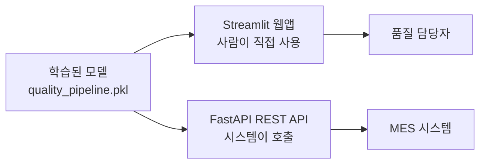
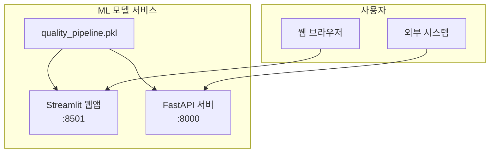

<!-- _class: lead -->
# [27차시] ML 모델 서비스 배포

## API 기초부터 웹앱/API 서버 구축까지

---

# 학습 목표

1. **REST API** 개념과 HTTP 통신 방식을 이해함
2. **requests** 라이브러리로 API 호출을 실습함
3. **Streamlit**으로 대화형 예측 웹앱을 제작함
4. **FastAPI**로 예측 API 엔드포인트를 구축함

---

# 수업 흐름

| 구간 | 시간 | 내용 |
|:----:|:----:|------|
| Part 1 | 7분 | REST API 기초와 requests |
| Part 2 | 8분 | Streamlit 웹앱 구축 |
| Part 3 | 8분 | FastAPI 엔드포인트 구현 |
| 정리 | 2분 | 전체 과정 마무리 |

---

# ML 모델 서비스 배포 개요



**두 가지 배포 방식**
- **Streamlit**: 사람이 직접 사용하는 웹 인터페이스
- **FastAPI**: 프로그램이 호출하는 API 서버

---

<!-- _class: lead -->
# Part 1
## REST API 기초와 requests

---

# API란?

**API (Application Programming Interface)**

- 프로그램 간 통신 방법을 정의한 규약
- "다른 프로그램의 기능을 빌려 쓰는 방법"


---

# REST API 구조

**REST (Representational State Transfer)**
- 웹에서 자원을 다루는 설계 원칙
- HTTP 프로토콜 기반

**HTTP 메서드**

| 메서드 | 동작 | 설명 |
|-------|-----|------|
| **GET** | 조회 | 데이터 가져오기 |
| **POST** | 생성 | 새 데이터 만들기 (ML 예측 요청) |

---

# HTTP 상태 코드

| 코드 | 의미 | 대응 방법 |
|-----|------|----------|
| **200** | 성공 | 정상 처리 |
| **400** | 잘못된 요청 | 요청 데이터 확인 |
| **401** | 인증 필요 | API 키 확인 |
| **500** | 서버 오류 | 잠시 후 재시도 |

---

# requests 라이브러리

**Python에서 가장 많이 쓰는 HTTP 라이브러리**

```python
import requests

# GET 요청 (데이터 조회)
response = requests.get(url, timeout=10)

# POST 요청 (데이터 전송/예측 요청)
response = requests.post(url, json=data, timeout=10)

# 응답 처리
if response.ok:
    result = response.json()
```

---

# POST 요청 예시

```python
import requests

url = "http://localhost:8000/predict"

# 센서 데이터 전송
sensor_data = {
    "temperature": 200,
    "pressure": 50,
    "speed": 100
}

response = requests.post(url, json=sensor_data, timeout=10)

if response.ok:
    result = response.json()
    print(f"예측 결과: {result['prediction']}")
```

---

<!-- _class: lead -->
# Part 2
## Streamlit 웹앱 구축

---

# Streamlit 핵심 개념

**Python만으로 웹앱을 구현하는 프레임워크**

| 특징 | 설명 |
|-----|------|
| 설치 | `pip install streamlit` |
| 실행 | `streamlit run app.py` |
| 접속 | http://localhost:8501 |

```python
import streamlit as st

st.title("품질 예측 시스템")
st.write("센서 데이터를 입력하세요.")
```

---

# 핵심 출력 위젯

| 함수 | 용도 |
|-----|------|
| `st.title()` | 제목 표시 |
| `st.write()` | 범용 출력 (자동 타입 감지) |
| `st.dataframe()` | 인터랙티브 테이블 |
| `st.metric()` | KPI 지표 표시 |
| `st.success()` / `st.error()` | 상태 메시지 |

---

# 핵심 입력 위젯

| 함수 | 용도 |
|-----|------|
| `st.button()` | 버튼 (클릭 시 True) |
| `st.slider()` | 슬라이더 (범위 선택) |
| `st.number_input()` | 숫자 입력 |
| `st.selectbox()` | 드롭다운 선택 |
| `st.form()` | 폼 (일괄 제출) |

---

# 레이아웃과 캐싱

```python
import streamlit as st
import joblib

# 열 분할
col1, col2 = st.columns(2)
with col1:
    temp = st.slider("온도", 100, 300, 200)
with col2:
    pres = st.slider("압력", 20, 100, 50)

# 모델 캐싱 (한 번만 로드)
@st.cache_resource
def load_model():
    return joblib.load('quality_pipeline.pkl')

model = load_model()
```

---

# 품질 예측 웹앱 구조

```python
import streamlit as st
import pandas as pd

st.title("제조 품질 예측 시스템")

col1, col2 = st.columns(2)
with col1:
    temp = st.slider("온도", 100, 300, 200)
with col2:
    pres = st.slider("압력", 20, 100, 50)

if st.button("예측"):
    X = pd.DataFrame([[temp, pres]], columns=['temperature','pressure'])
    pred = model.predict(X)[0]
    if pred == 1:
        st.error("불량 예측")
    else:
        st.success("정상 예측")
```

---

<!-- _class: lead -->
# Part 3
## FastAPI 엔드포인트 구현

---

# Streamlit vs FastAPI

| 항목 | Streamlit | FastAPI |
|-----|-----------|---------|
| **용도** | 사용자 UI | API 서버 |
| **호출 방식** | 브라우저 | HTTP 요청 |
| **대상** | 사람 | 프로그램 |
| **출력** | 웹 페이지 | JSON |

---

# FastAPI 핵심 개념

**고성능 Python 웹 프레임워크**

```python
from fastapi import FastAPI

app = FastAPI()

@app.get("/")
def read_root():
    return {"message": "Hello, FastAPI!"}

@app.get("/health")
def health_check():
    return {"status": "healthy"}
```

```bash
pip install fastapi uvicorn
uvicorn main:app --reload
```

---

# HTTP 메서드와 경로

```python
@app.get("/items/{item_id}")    # 경로 매개변수
def read_item(item_id: int):
    return {"item_id": item_id}

@app.get("/search")             # 쿼리 매개변수
def search(q: str, limit: int = 10):
    return {"query": q, "limit": limit}

@app.post("/predict")           # POST 요청
def predict(data: dict):
    return {"prediction": "normal"}
```

**자동 문서**: http://localhost:8000/docs

---

# Pydantic 데이터 검증

```python
from pydantic import BaseModel, Field

class SensorData(BaseModel):
    temperature: float = Field(..., ge=100, le=300)
    pressure: float = Field(..., ge=20, le=100)
    speed: float = Field(..., ge=50, le=200)

class PredictionResponse(BaseModel):
    prediction: str
    probability: float
    risk_score: int
```

| 옵션 | 의미 |
|-----|------|
| `ge` | >= (이상) |
| `le` | <= (이하) |
| `...` | 필수 필드 |

---

# 예측 API 엔드포인트

```python
from fastapi import FastAPI, HTTPException
from datetime import datetime

@app.post("/predict", response_model=PredictionResponse)
def predict(data: SensorData):
    try:
        result = predictor.predict(data.model_dump())
        return PredictionResponse(
            prediction=result['prediction'],
            probability=result['probability'],
            risk_score=int(result['probability'] * 100)
        )
    except Exception as e:
        raise HTTPException(status_code=500, detail=str(e))
```

---

# API 호출 방법

**curl 명령어**
```bash
curl -X POST http://localhost:8000/predict \
  -H "Content-Type: application/json" \
  -d '{"temperature": 200, "pressure": 50, "speed": 100}'
```

**Python requests**
```python
import requests

response = requests.post(
    "http://localhost:8000/predict",
    json={"temperature": 200, "pressure": 50, "speed": 100}
)
print(response.json())
```

---

# 서비스 배포 아키텍처



---

# Docker 배포

**Dockerfile (FastAPI)**
```dockerfile
FROM python:3.9-slim
WORKDIR /app
COPY requirements.txt .
RUN pip install -r requirements.txt
COPY . .
CMD ["uvicorn", "main:app", "--host", "0.0.0.0", "--port", "8000"]
```

```bash
docker build -t quality-api .
docker run -p 8000:8000 quality-api
```

---

<!-- _class: lead -->
# 핵심 정리

---

# 전체 학습 과정 요약

| 단계 | 차시 | 핵심 내용 |
|-----|------|----------|
| 데이터 기초 | 1-8 | Python, Pandas, 시각화 |
| 전처리/분석 | 9-11 | 결측치, 이상치, EDA |
| 머신러닝 | 12-17 | 분류, 회귀, 평가, 튜닝 |
| 시계열/딥러닝 | 18-24 | 시계열, MLP, CNN, 해석 |
| 배포 | 25-27 | 저장, API, 웹앱, 서비스 |

---

# 오늘 배운 내용

1. **REST API 기초**
   - HTTP 메서드 (GET, POST)
   - 상태 코드 (200, 400, 500)
   - requests 라이브러리

2. **Streamlit 웹앱**
   - st.slider, st.button, st.columns
   - @st.cache_resource 모델 캐싱

3. **FastAPI API 서버**
   - @app.post() 엔드포인트
   - Pydantic BaseModel, Field 검증

---

# 핵심 코드 비교

**Streamlit**
```python
if st.button("예측"):
    pred = model.predict(input_data)
    st.success("정상" if pred == 0 else "불량")
```

**FastAPI**
```python
@app.post("/predict", response_model=PredictionResponse)
def predict(data: SensorData):
    result = model.predict(data.model_dump())
    return PredictionResponse(prediction=result)
```

---

# 체크리스트

- [ ] REST API 개념과 HTTP 메서드 이해
- [ ] requests로 GET/POST 요청 실행
- [ ] Streamlit 설치 및 웹앱 실행
- [ ] 입력 위젯과 레이아웃 구성
- [ ] FastAPI 설치 및 서버 실행
- [ ] Pydantic 모델로 데이터 검증
- [ ] POST 엔드포인트 구현
- [ ] Swagger UI (/docs) 확인

---

<!-- _class: lead -->
# 전체 27차시 과정을 마칩니다

## 수고하셨습니다!

데이터 수집 - 전처리 - 분석 - 모델링 - 배포
완전한 데이터 분석 파이프라인을 완성했습니다.
