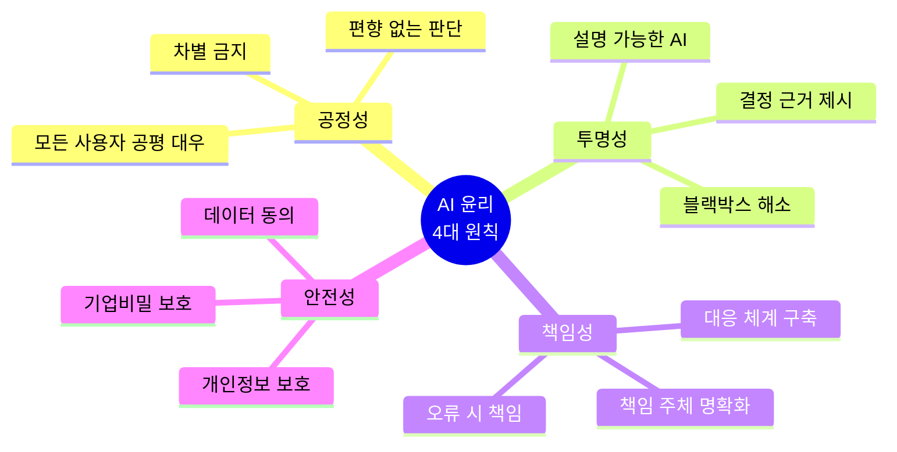
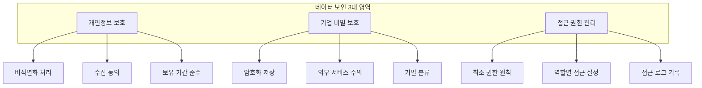
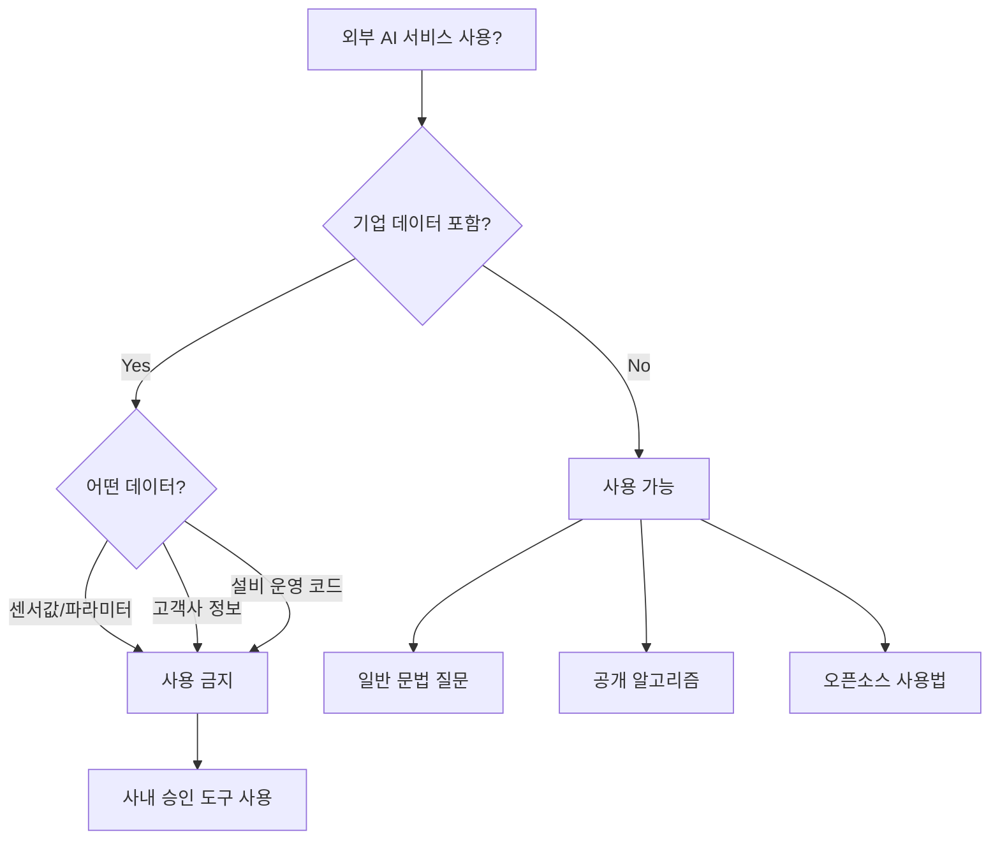
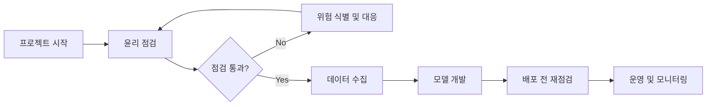
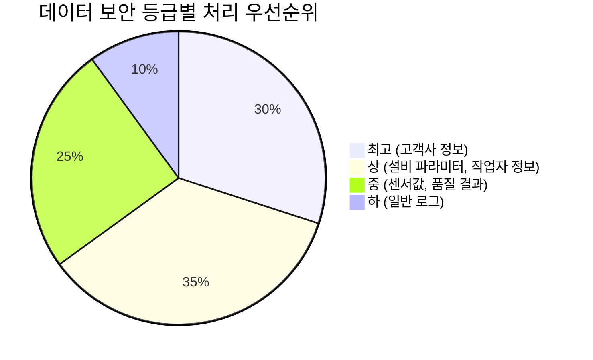
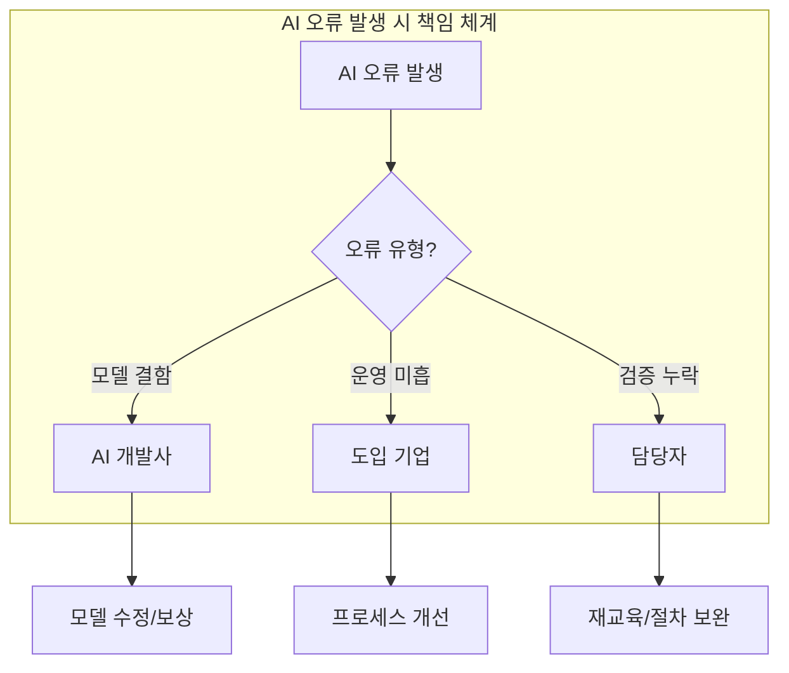
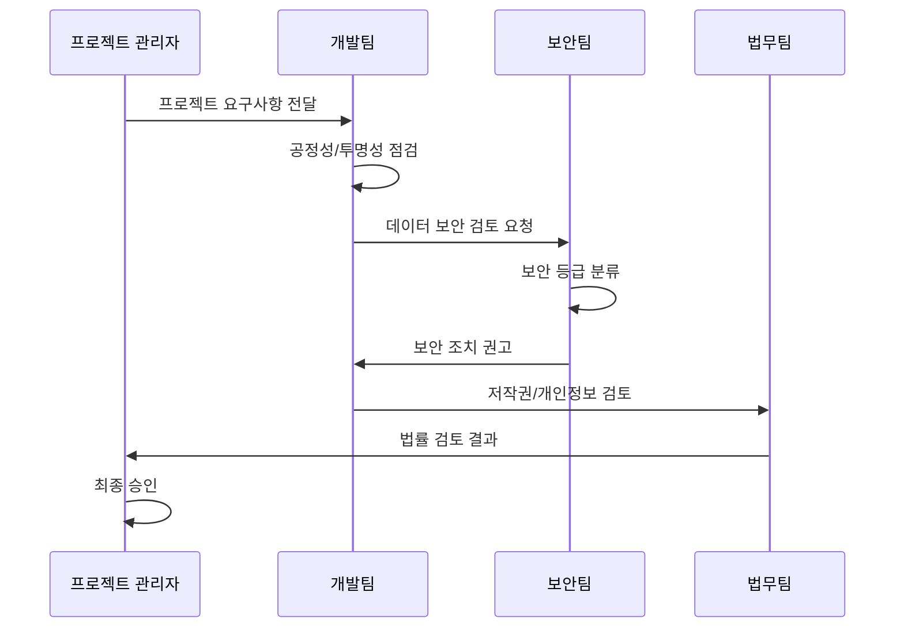
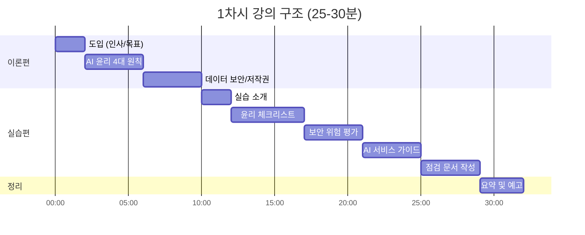

# [1차시] AI 활용 윤리와 데이터 보호 - 다이어그램

## 1. AI 윤리 4대 원칙

## 2. 데이터 보안 3대 영역

## 3. 외부 AI 서비스 사용 판단

## 4. AI 프로젝트 윤리 점검 프로세스

## 5. 데이터 보안 등급 분류

## 6. 제조 AI 프로젝트 책임 체계

## 7. AI 윤리 체크리스트 흐름

## 8. 이론-실습 구조

