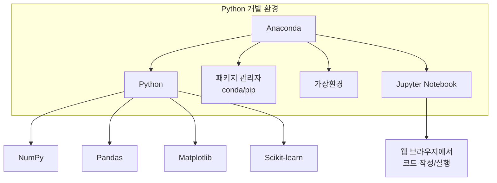
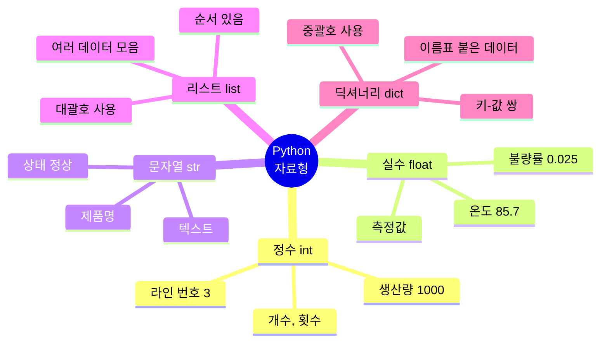
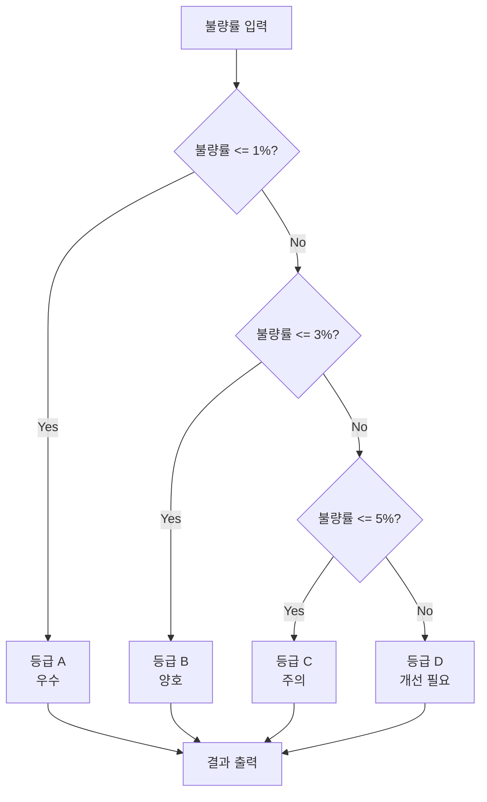
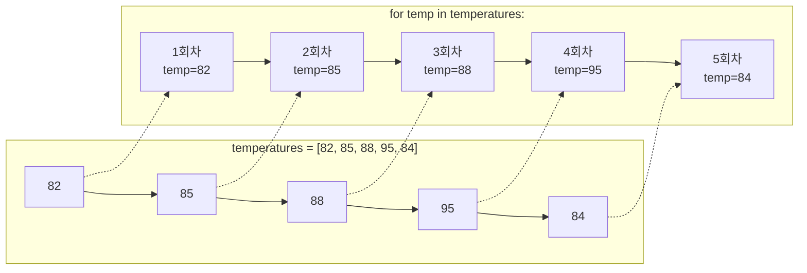
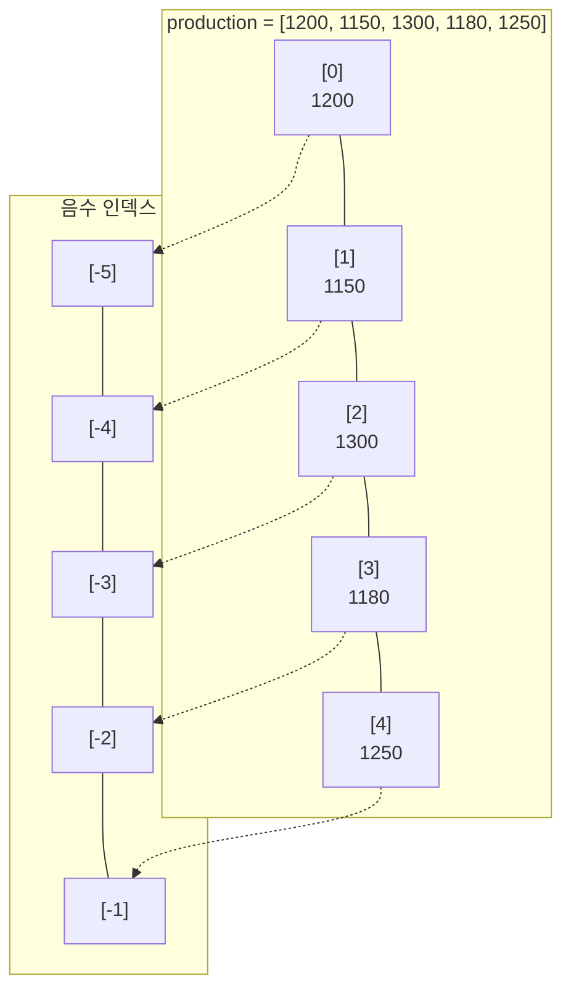
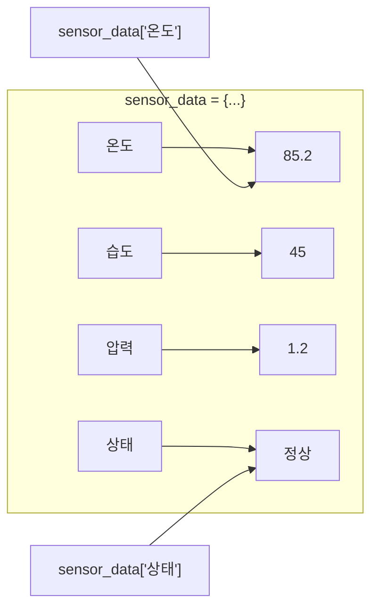
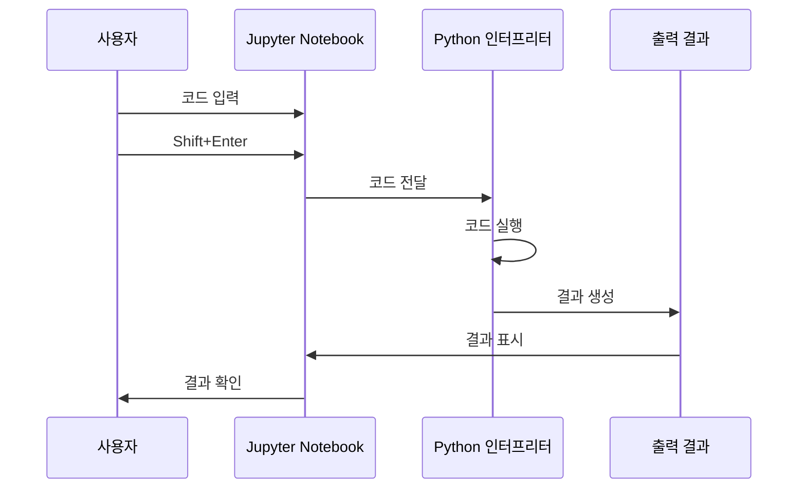
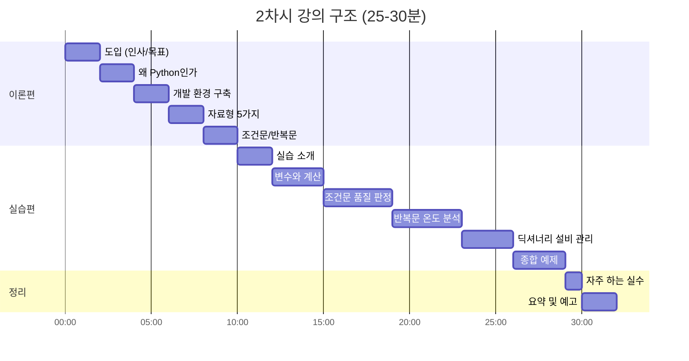
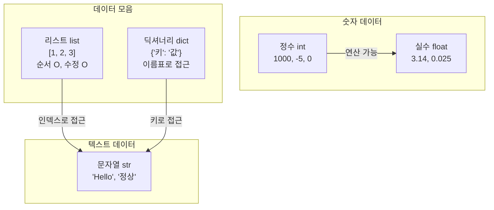
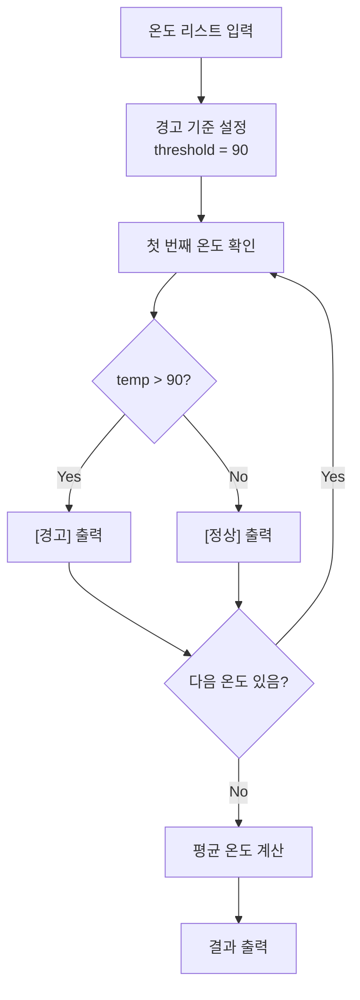

# [2차시] Python 시작하기 - 다이어그램

## 1. Python 개발 환경 구조

## 2. Python 5대 자료형

## 3. 조건문 흐름

## 4. 반복문 동작 원리

## 5. 리스트 인덱싱

## 6. 딕셔너리 구조

## 7. 프로그램 실행 흐름

## 8. 강의 구조

## 9. 자료형 비교

## 10. 온도 모니터링 실습 흐름

