# [4차시] 공개 데이터셋 확보 및 데이터 생태계 이해 - 다이어그램

## 1. AI 학습 핵심 요소

## 2. 공개 데이터 생태계

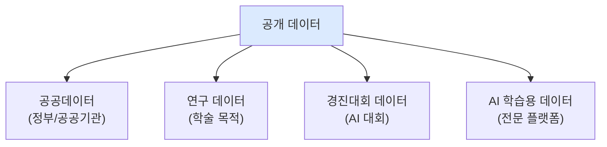

## 3. 주요 데이터 플랫폼 4가지

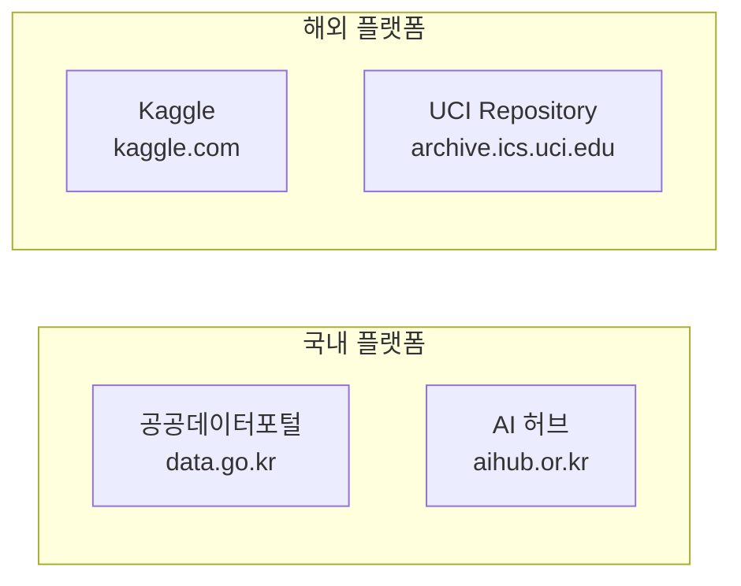

## 4. 공공데이터포털 특징

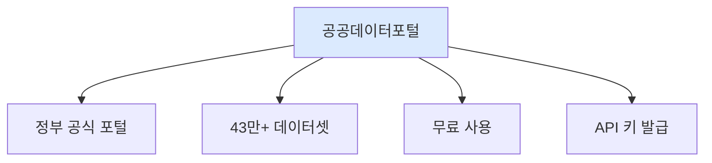

## 5. AI 허브 특징

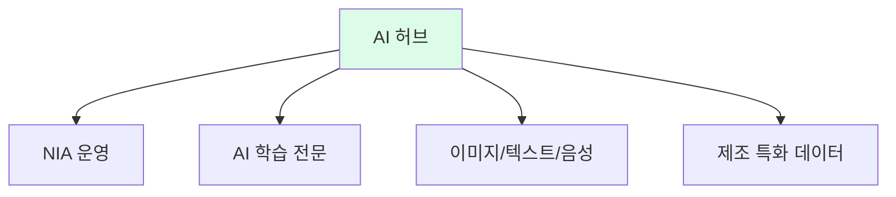

## 6. Kaggle 특징

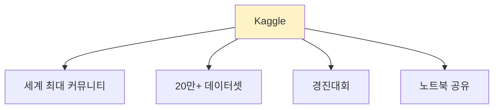

## 7. UCI Repository 특징

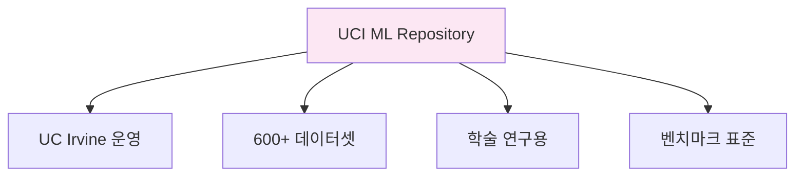

## 8. 플랫폼 선택 가이드

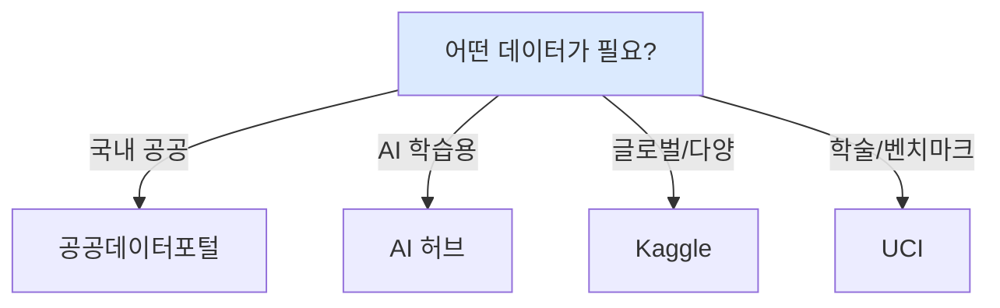

## 9. API 키 발급 과정

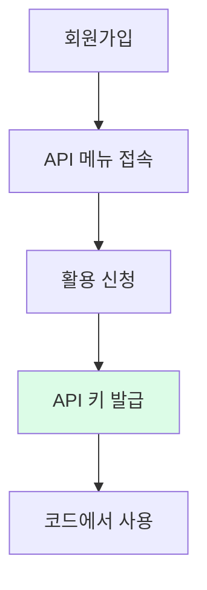

## 10. 공공데이터 API 호출 흐름

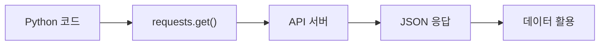

## 11. Kaggle 데이터 다운로드 방법

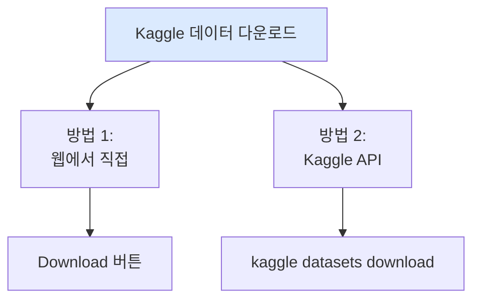

## 12. UCI 데이터 로드 방법

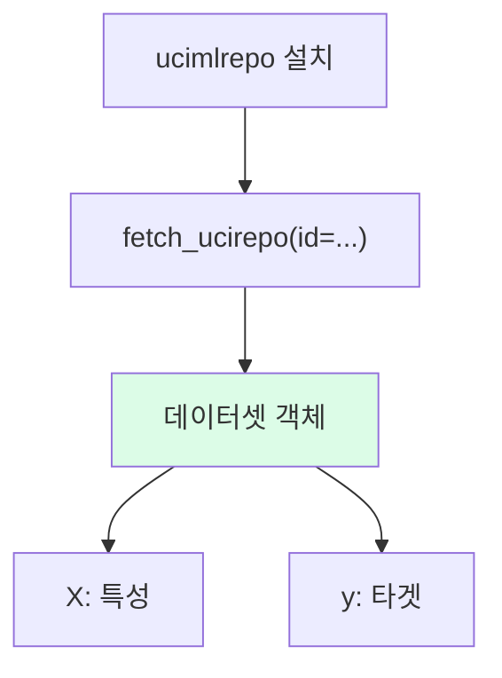

## 13. 제조 분야 추천 데이터셋

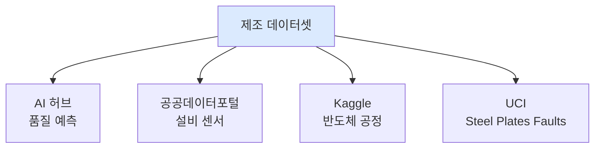

## 14. 데이터 활용 목적별 분류

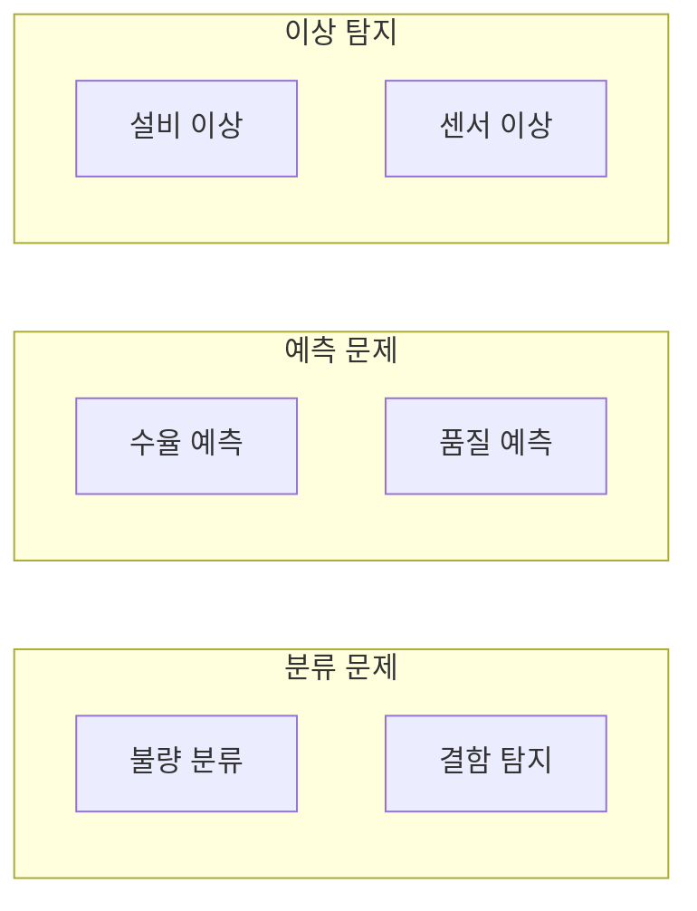

## 15. 데이터 구조 확인 5단계

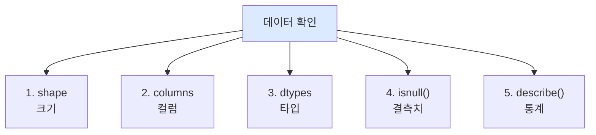

## 16. 데이터 품질 점검

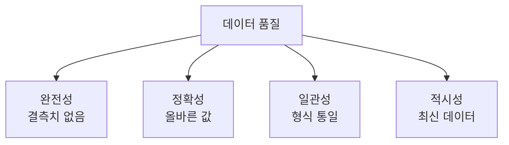

## 17. 실습 환경 구성

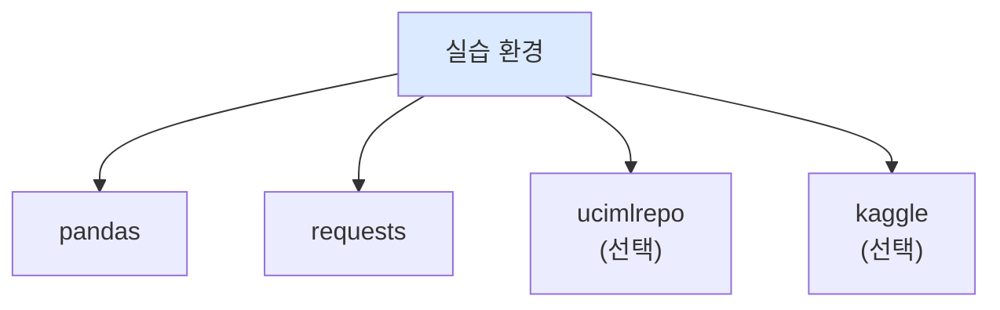

## 18. 데이터셋 파일 형식

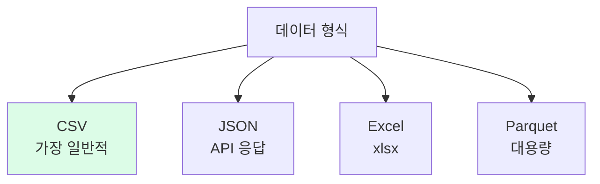

## 19. 4차시 학습 흐름

## 20. 다음 차시 연결

