# [7차시] 제조 데이터 전처리 (1) - 다이어그램

## 1. 데이터 분석 프로젝트 시간 배분

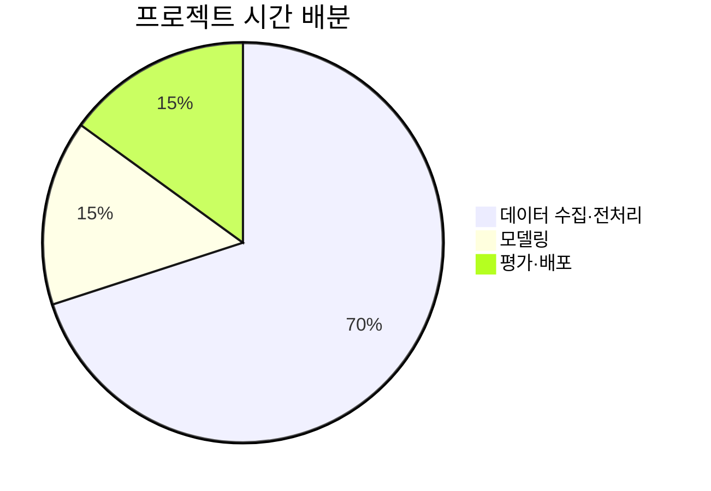

## 2. 전처리가 중요한 이유

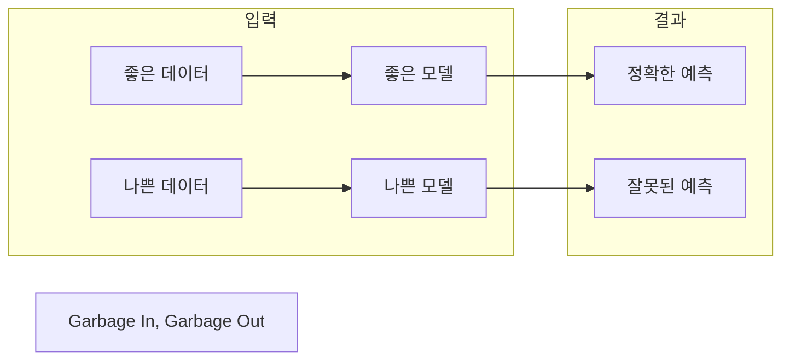

## 3. 결측치 발생 원인

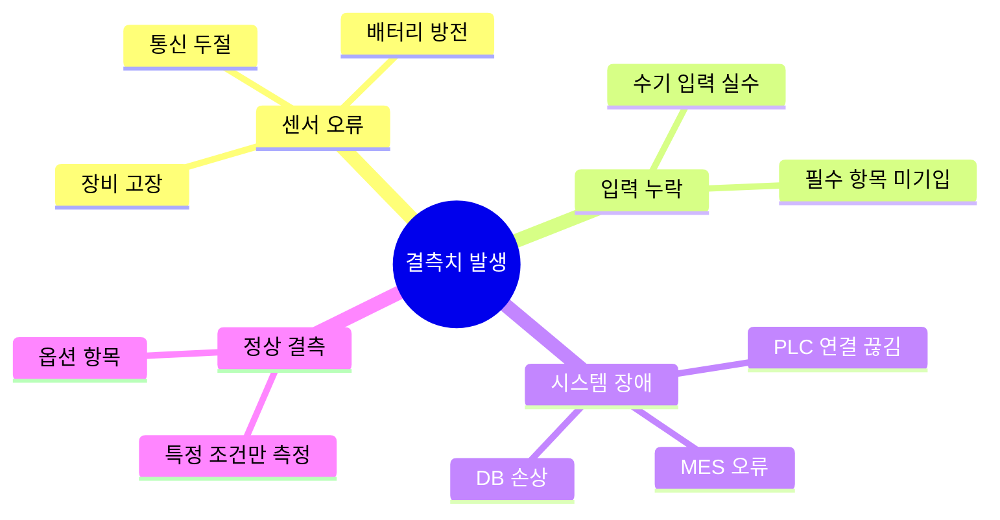

## 4. 결측치 탐지 방법

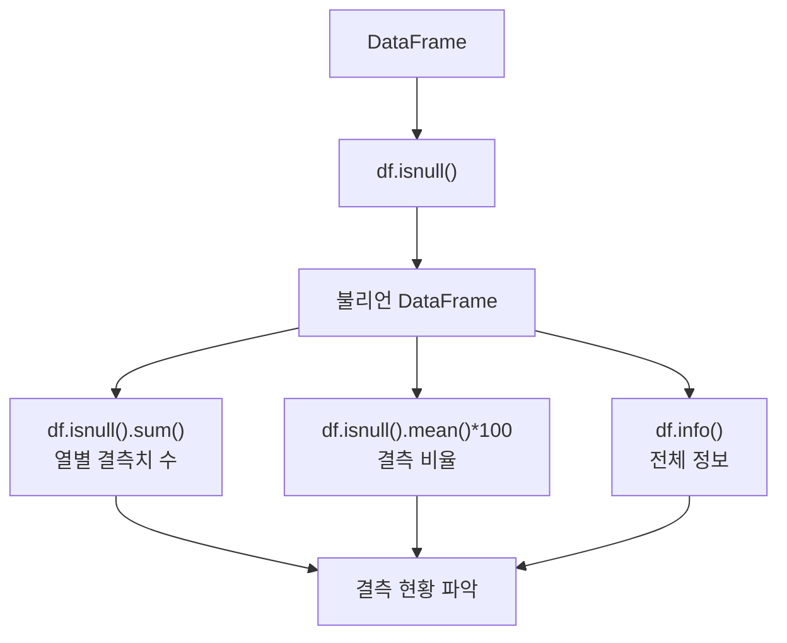

## 5. 결측치 처리 전략

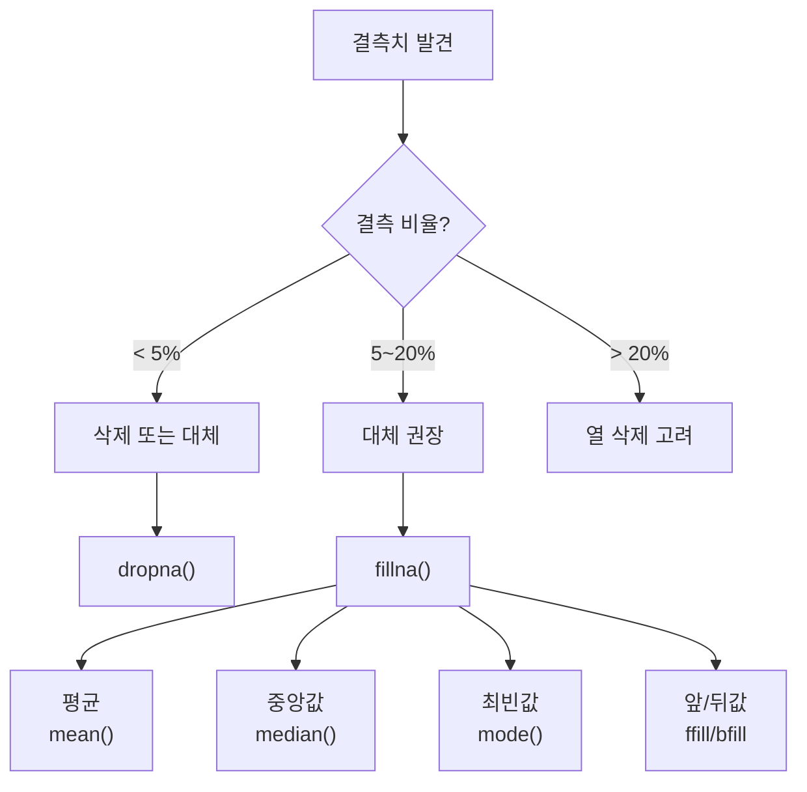

## 6. 결측치 대체 방법 선택

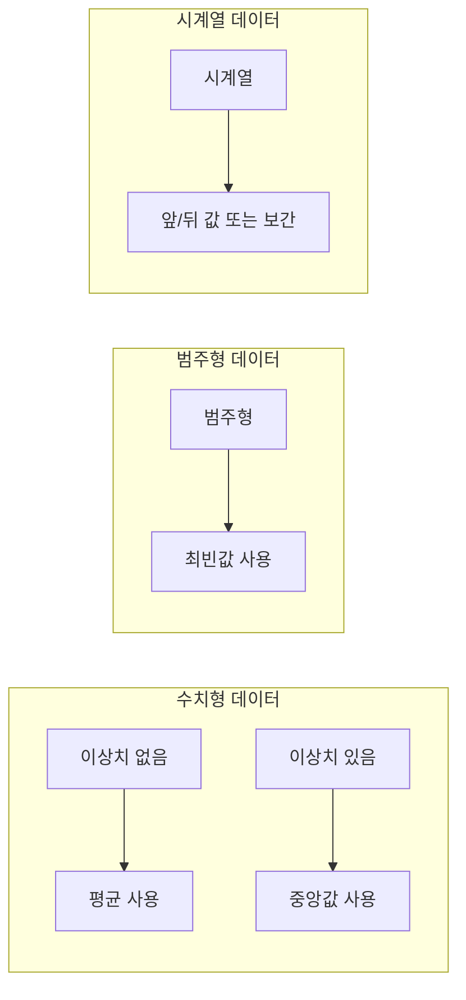

## 7. 이상치 발생 원인

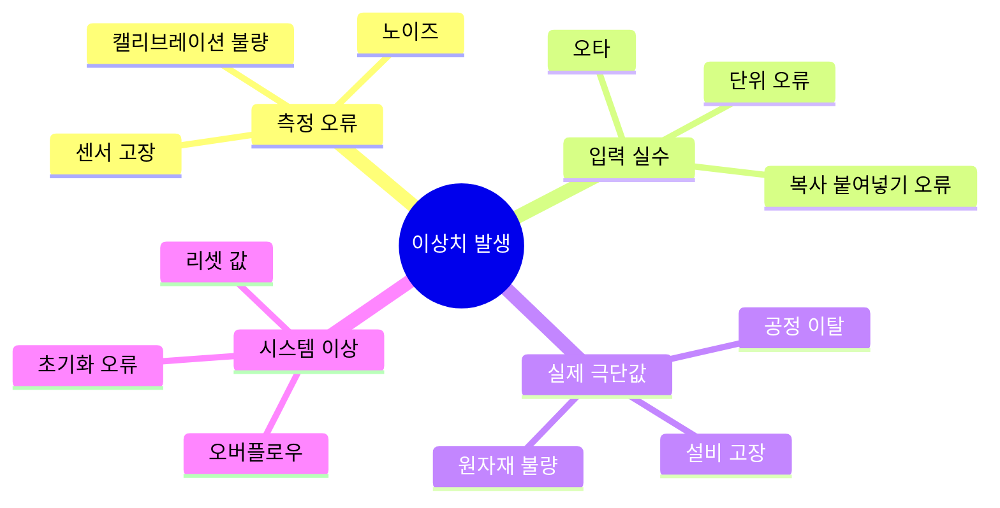

## 8. IQR 이상치 탐지

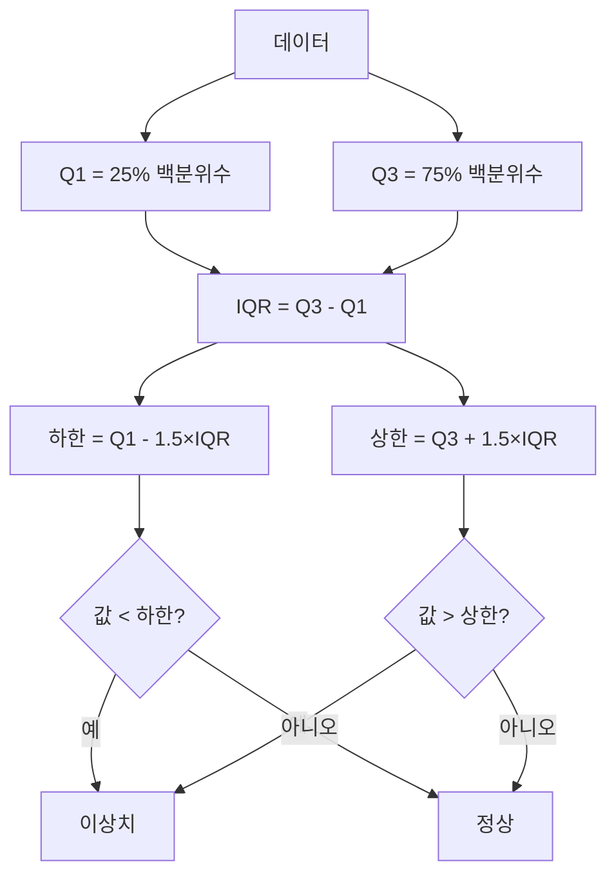

## 9. Z-score 이상치 탐지

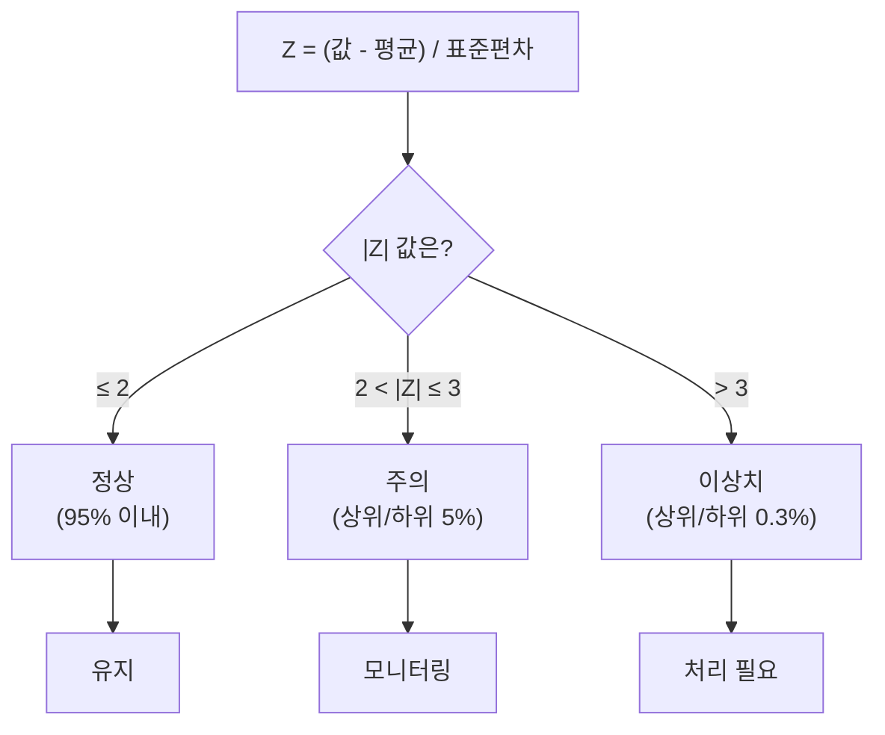

## 10. 이상치 처리 전략

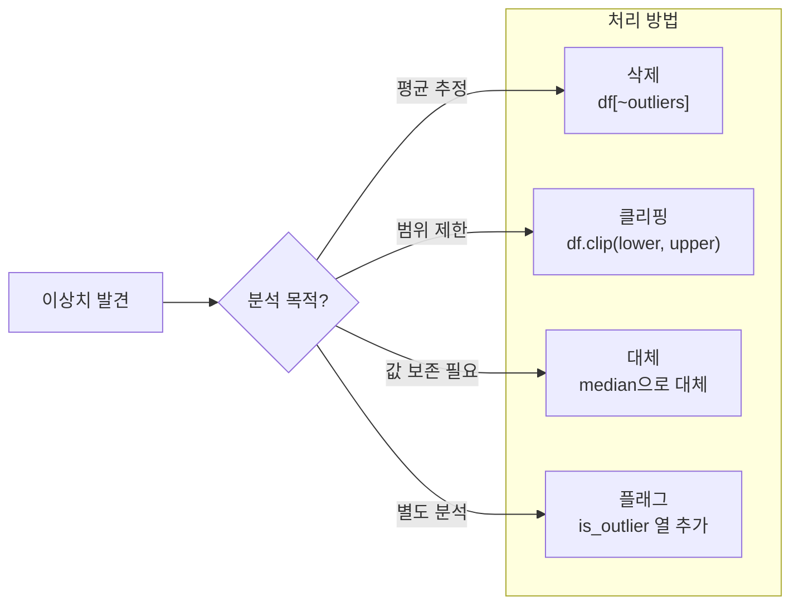

## 11. 이상치 처리 의사결정

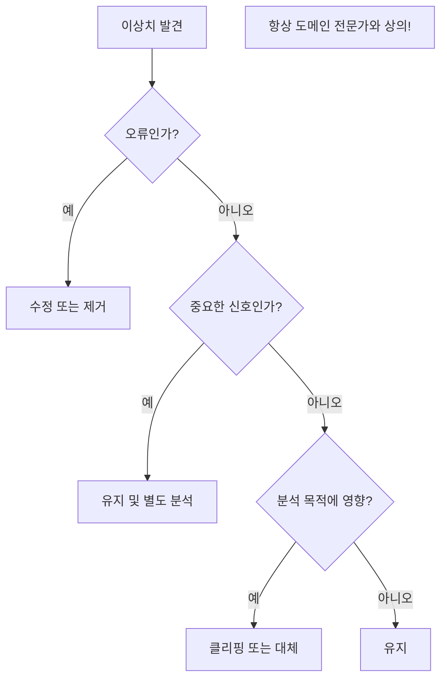

## 12. 전처리 워크플로우

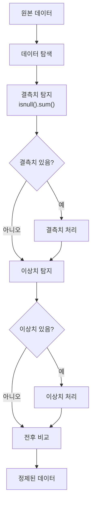

## 13. 강의 구조

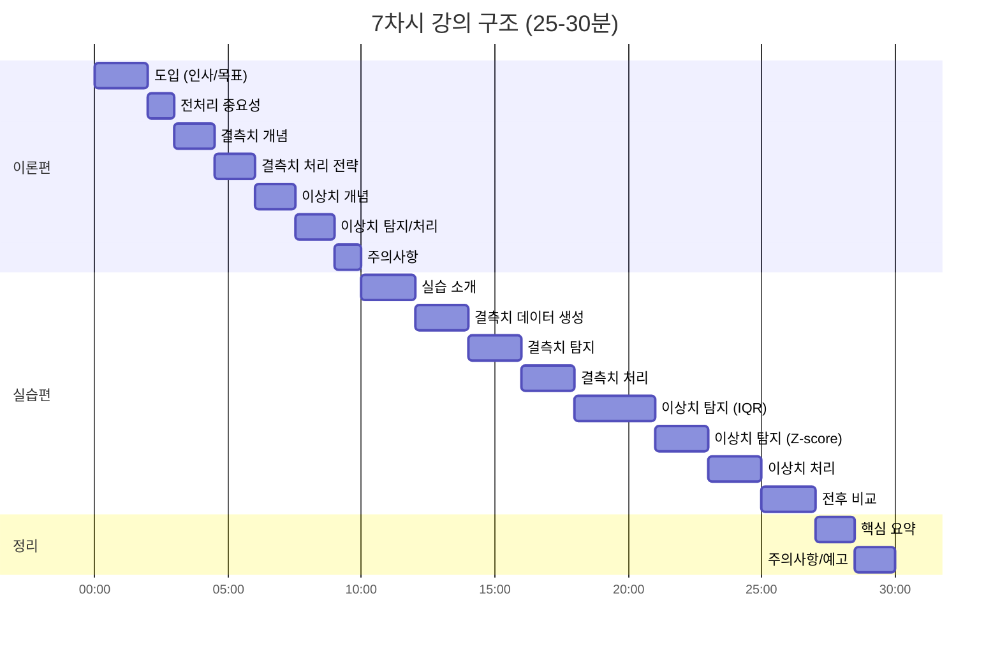
