# [9차시] 제조 데이터 탐색 분석 종합 - 다이어그램

## 1. EDA 5단계 워크플로우

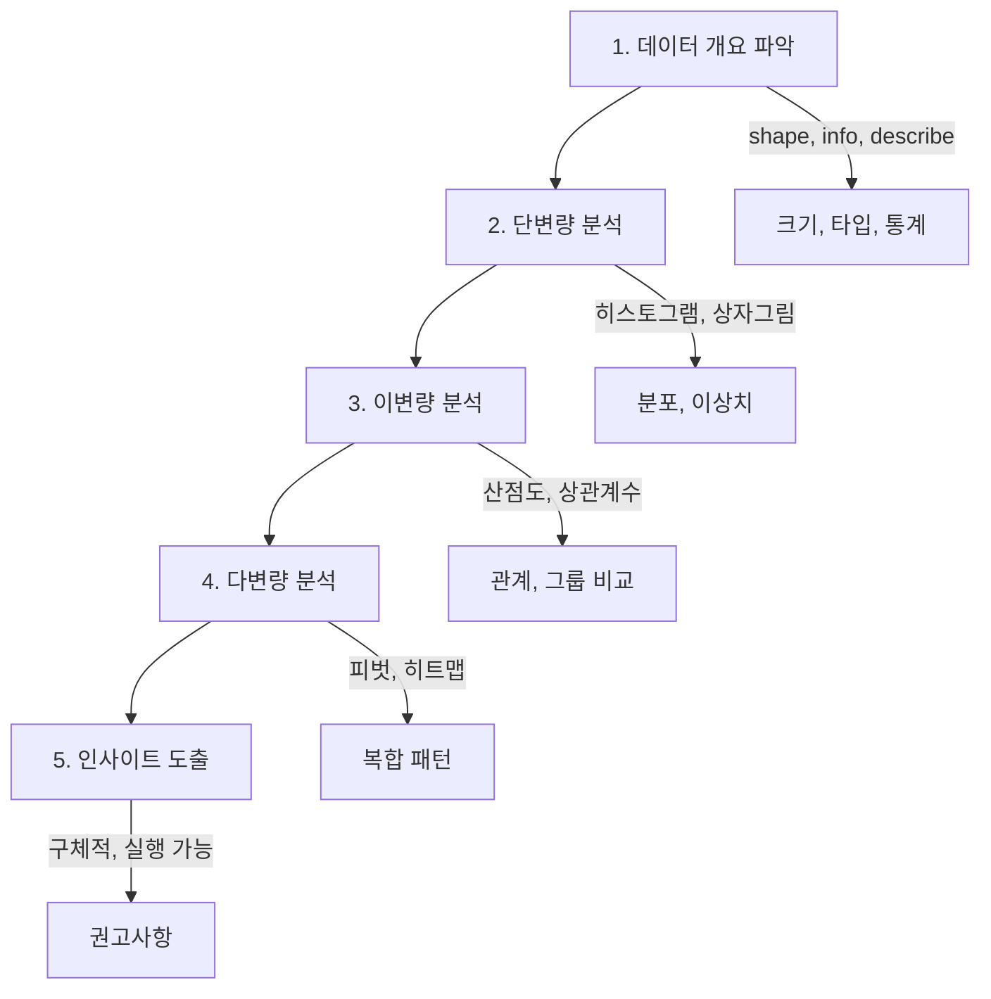

## 2. 1단계: 데이터 개요

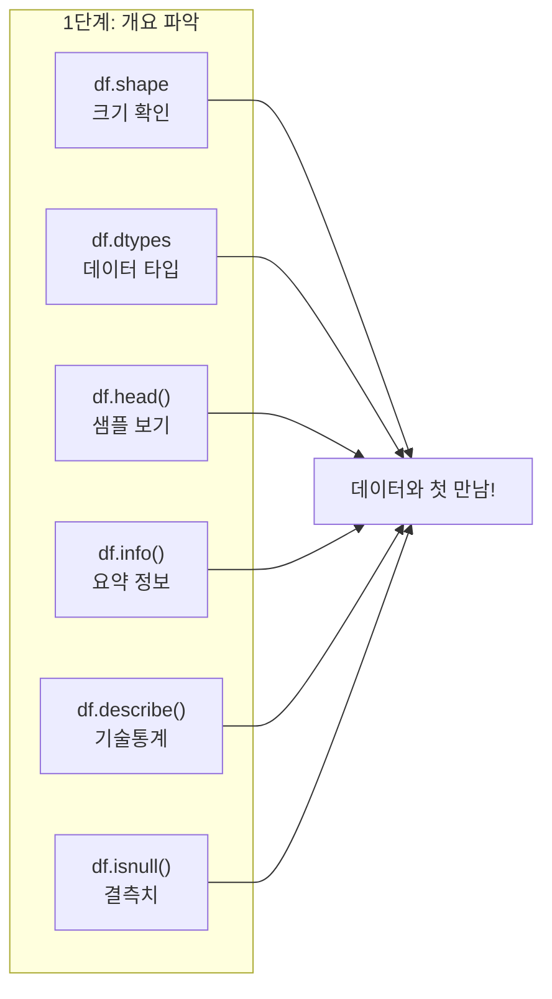

## 3. 2단계: 단변량 분석

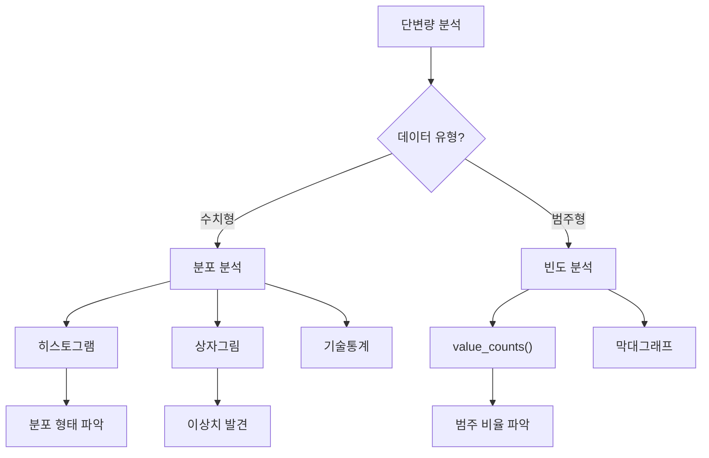

## 4. 3단계: 이변량 분석

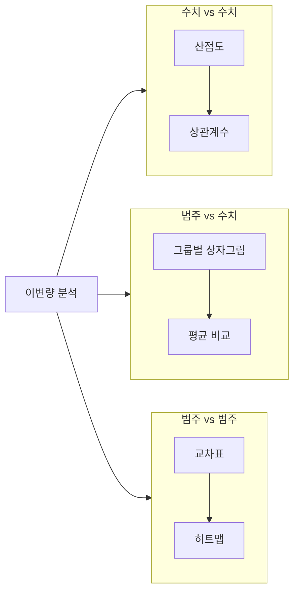

## 5. 4단계: 다변량 분석

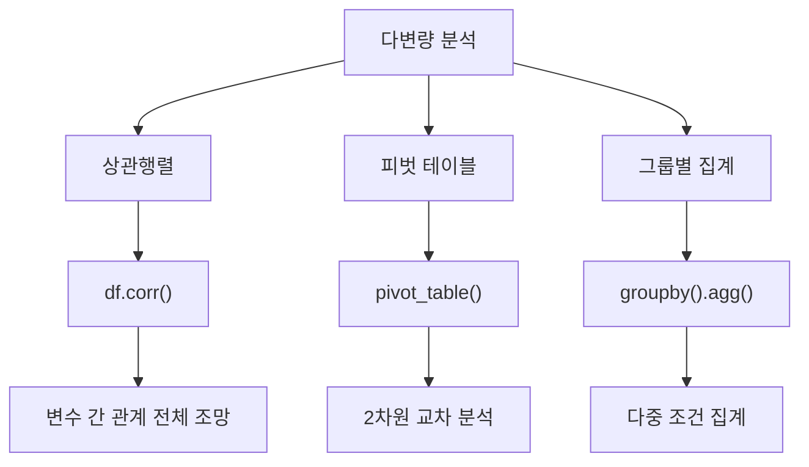

## 6. 좋은 인사이트 vs 나쁜 인사이트

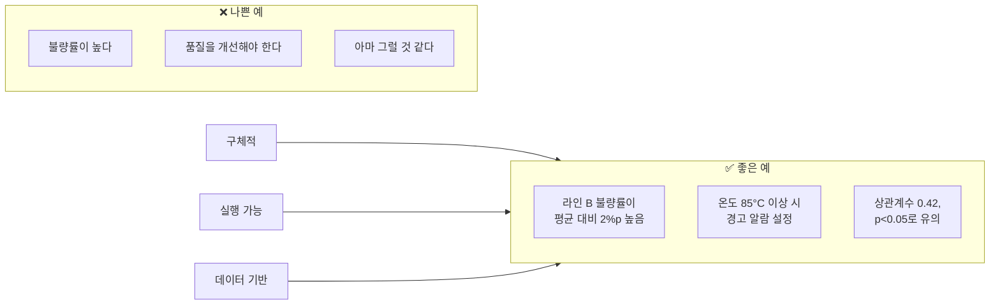

## 7. EDA 체크리스트

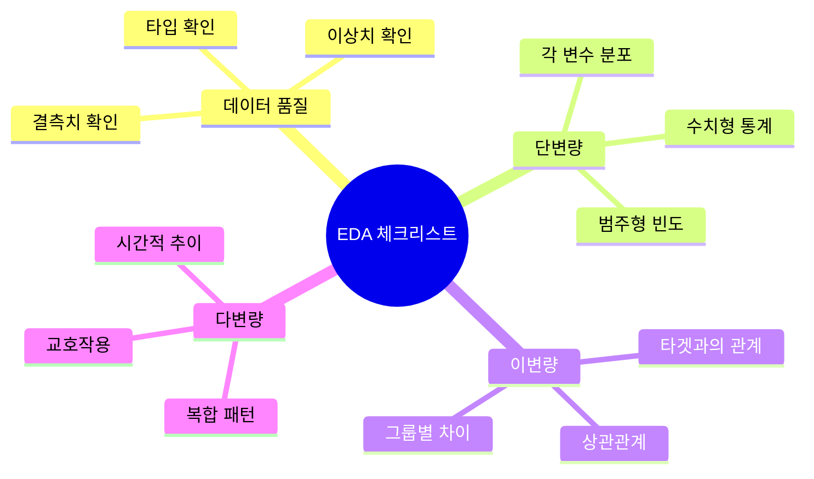

## 8. 분석 시나리오: 품질 문제

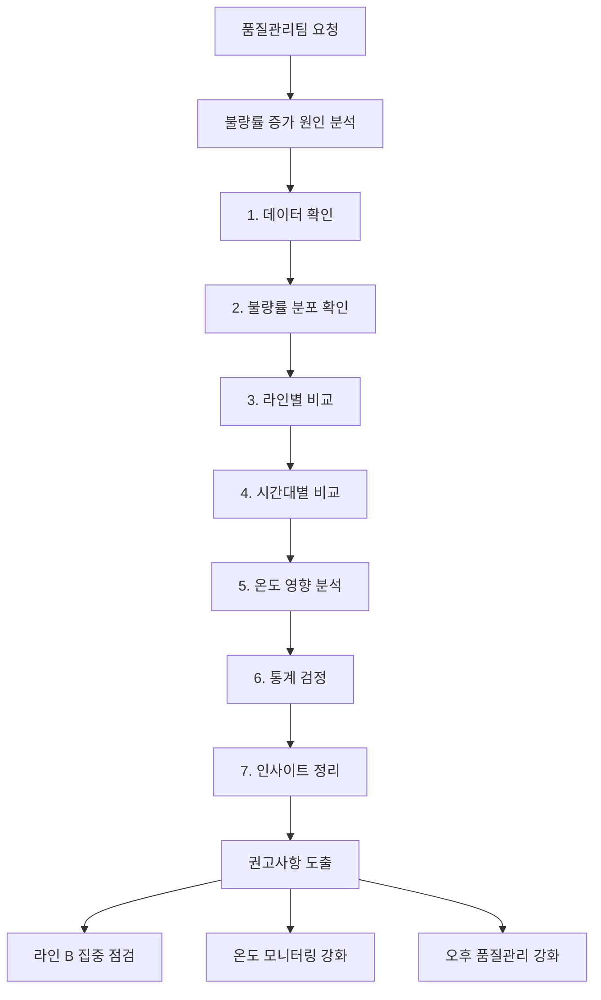

## 9. 불량률 요인 분석 결과

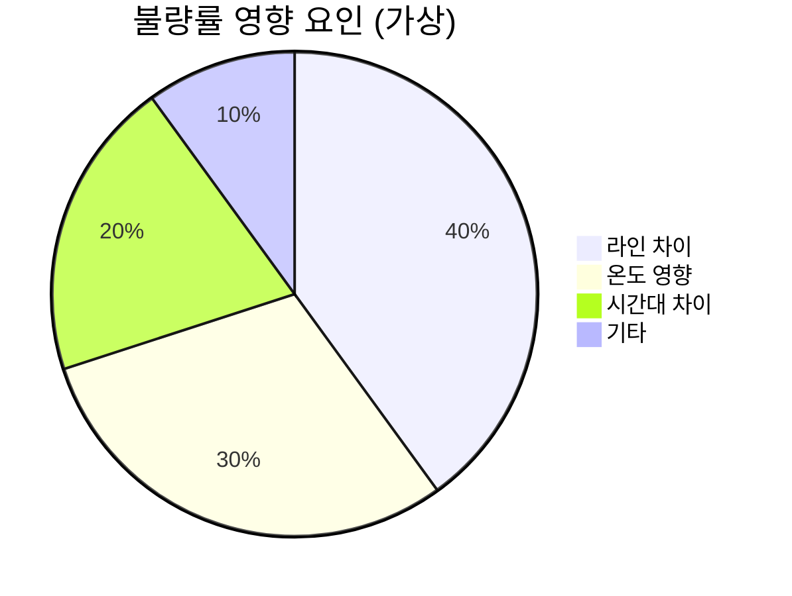

## 10. Part II 종합

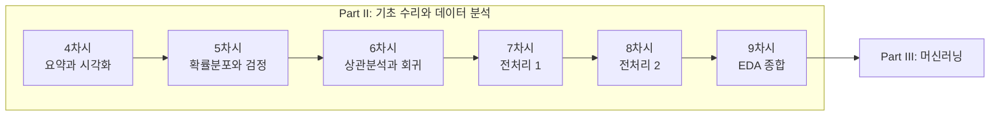

## 11. EDA 보고서 구조

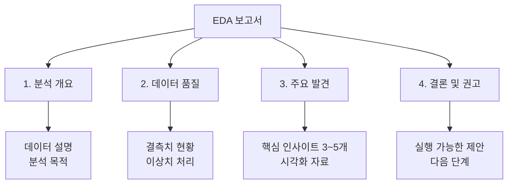

## 12. 강의 구조

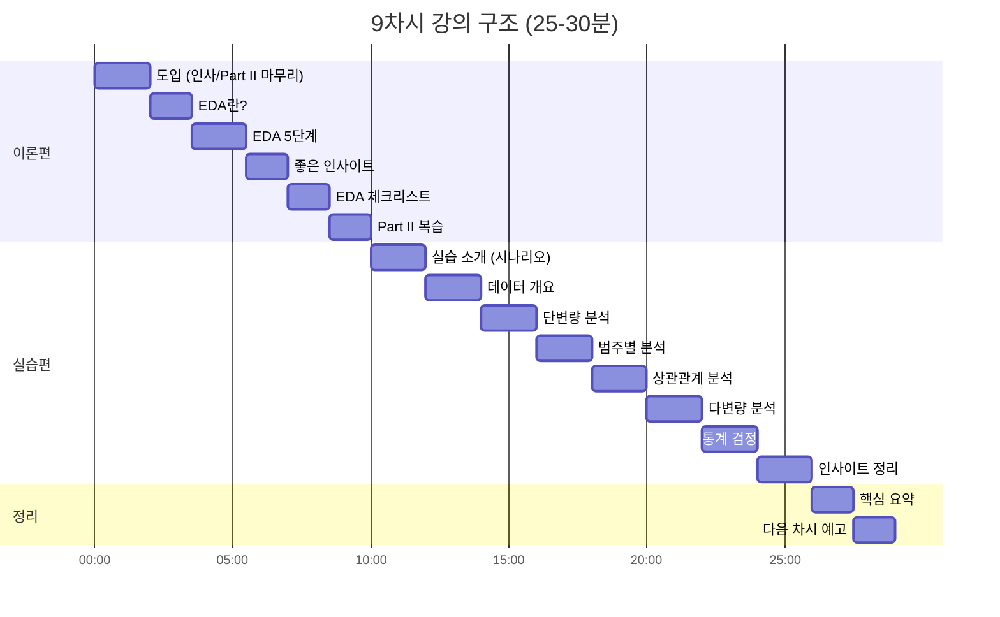

## 13. Part II → Part III 연결

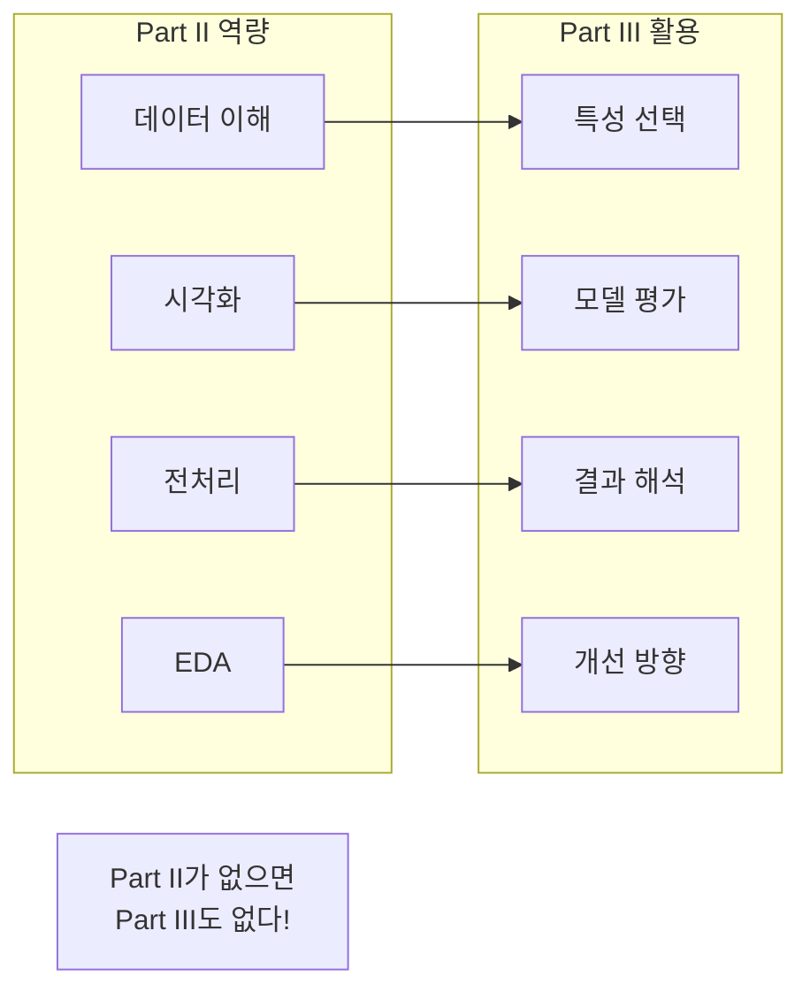
