# [13차시] 예측 모델: 선형회귀와 다항회귀 - 다이어그램

## 1. 분류 vs 회귀

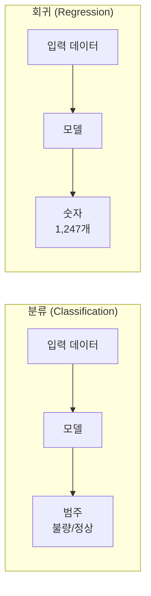

## 2. 선형회귀 원리

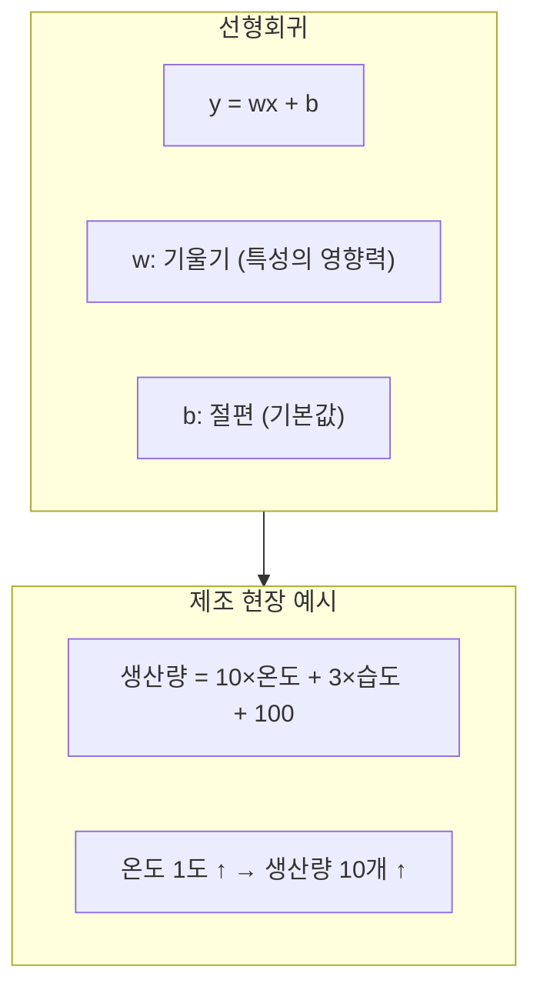

## 3. 다중 선형회귀

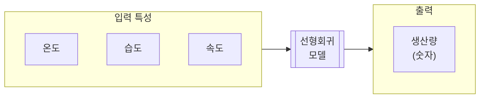

## 4. 회귀 평가 지표

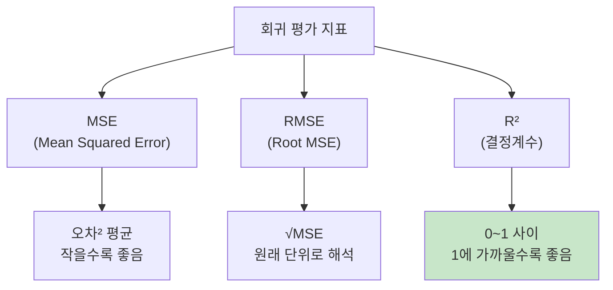

## 5. R² 해석

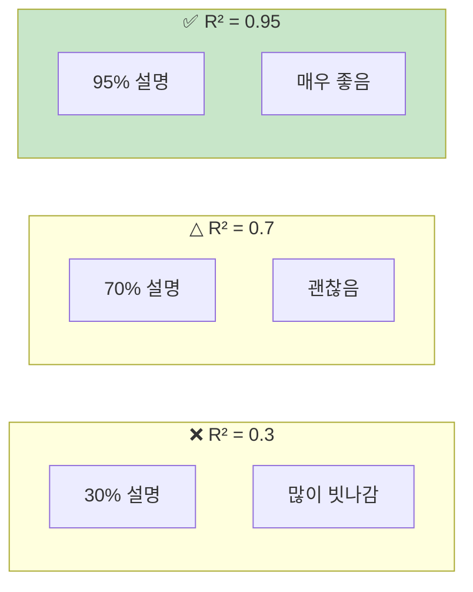

## 6. 선형회귀의 한계

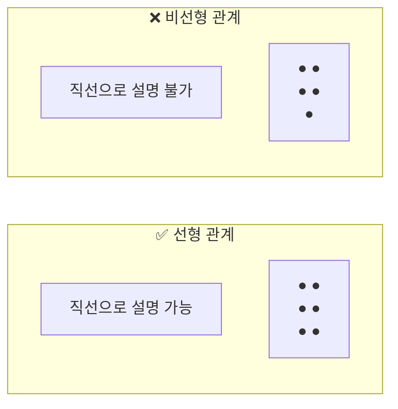

## 7. 다항회귀 개념

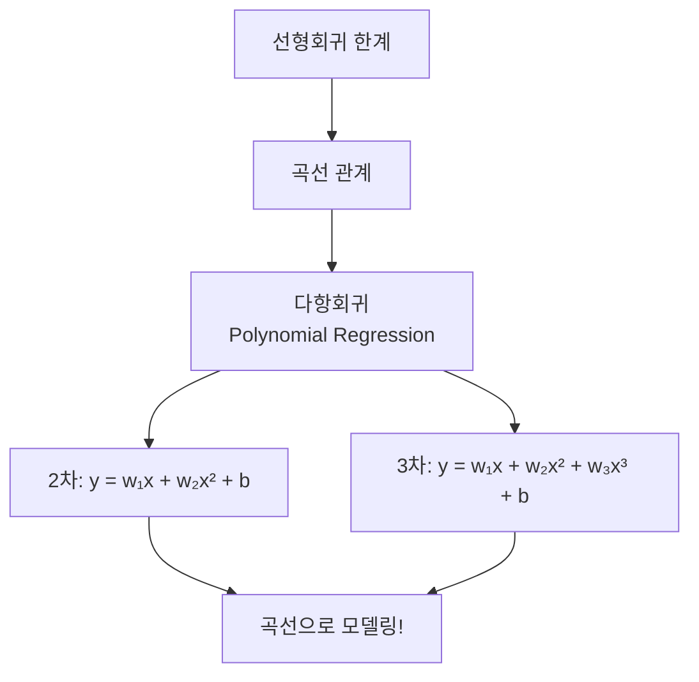

## 8. PolynomialFeatures 동작

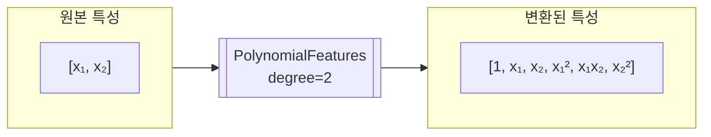

## 9. Pipeline 구조

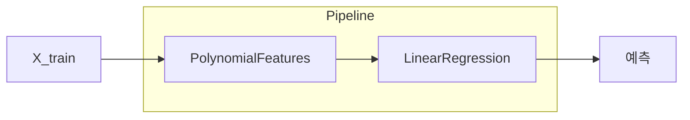

## 10. degree에 따른 변화

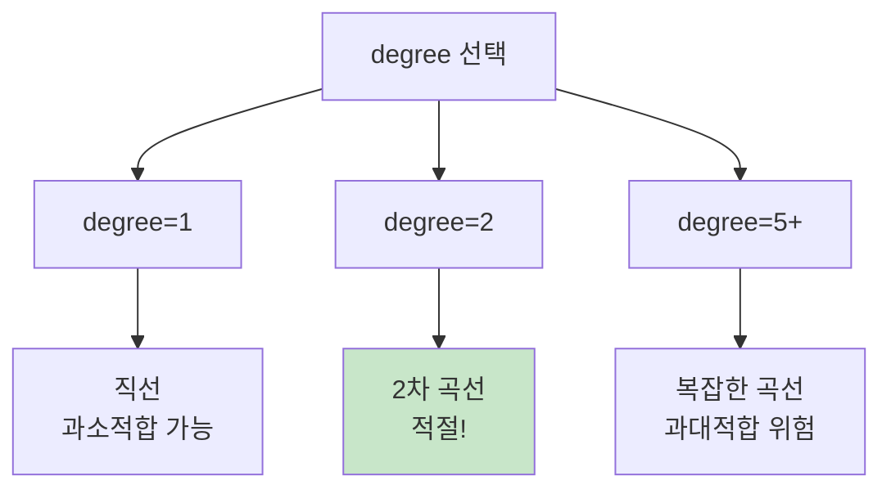

## 11. 과대적합 진단

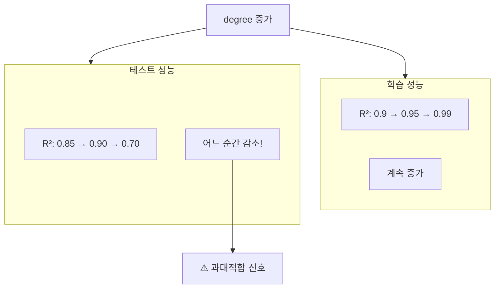

## 12. sklearn 사용 흐름

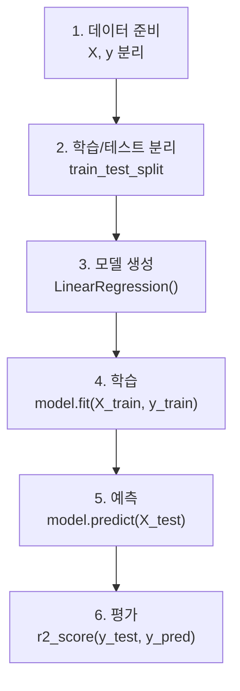

## 13. 회귀 모델 비교

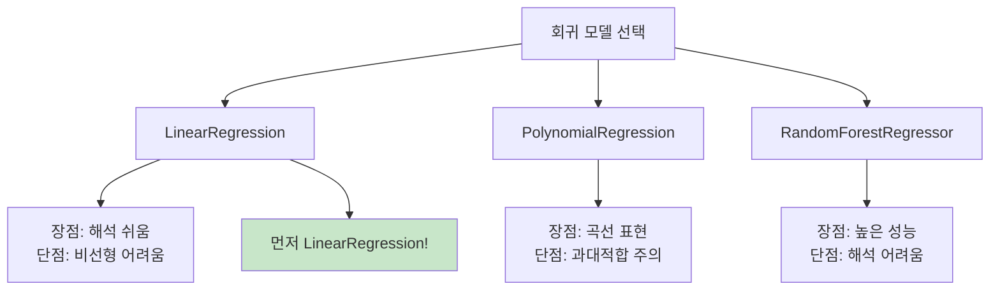

## 14. Classifier vs Regressor

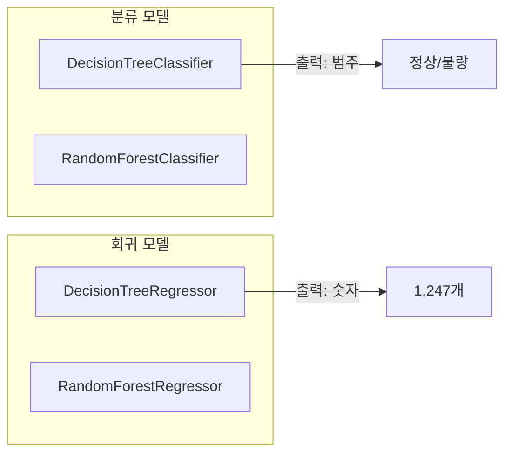

## 15. 강의 구조

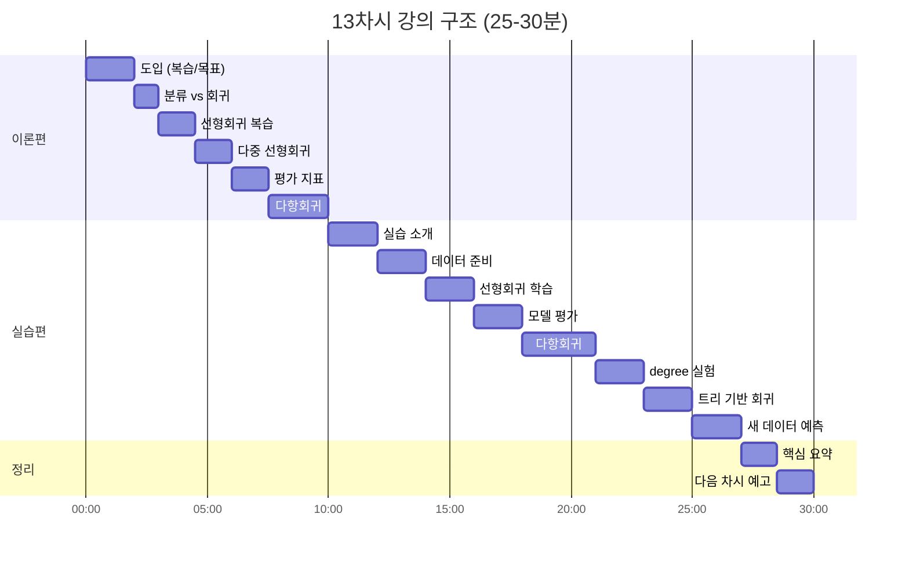

## 16. 핵심 요약

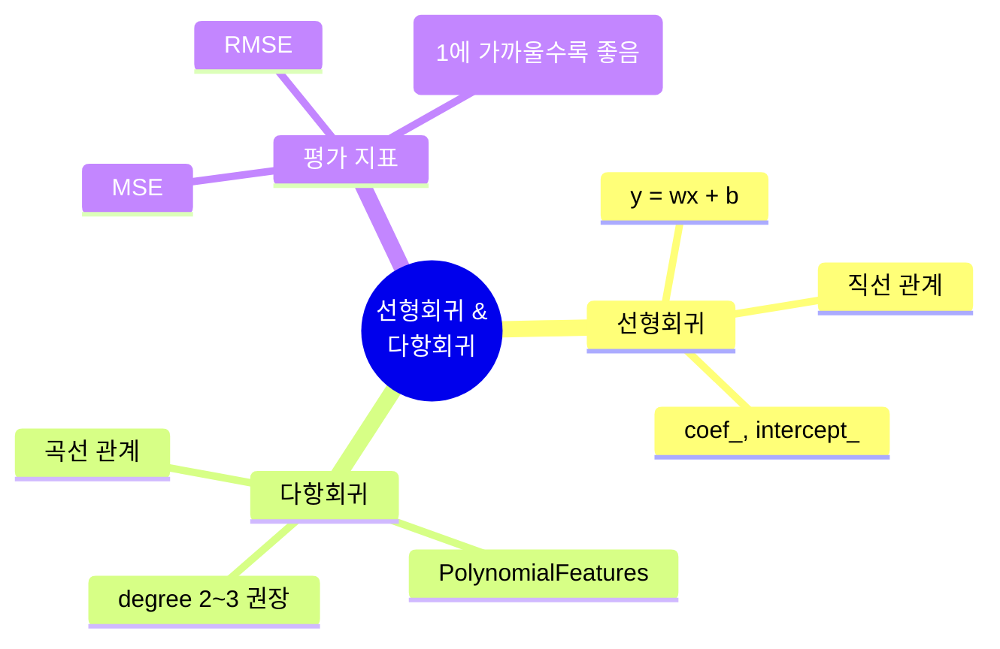
