# [14차시] 모델 평가와 반복 검증 - 다이어그램

## 1. train_test_split의 한계

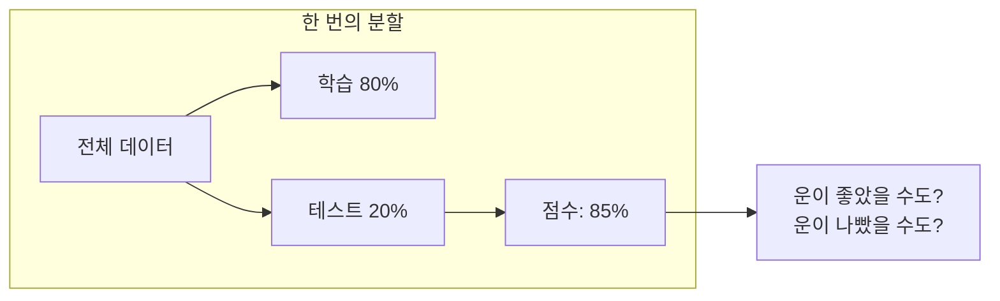

## 2. K-Fold 교차검증

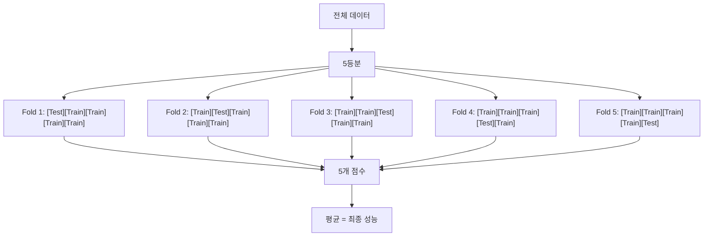

## 3. 교차검증 결과 해석

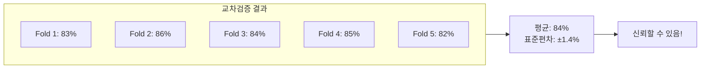

## 4. 과대적합 vs 과소적합

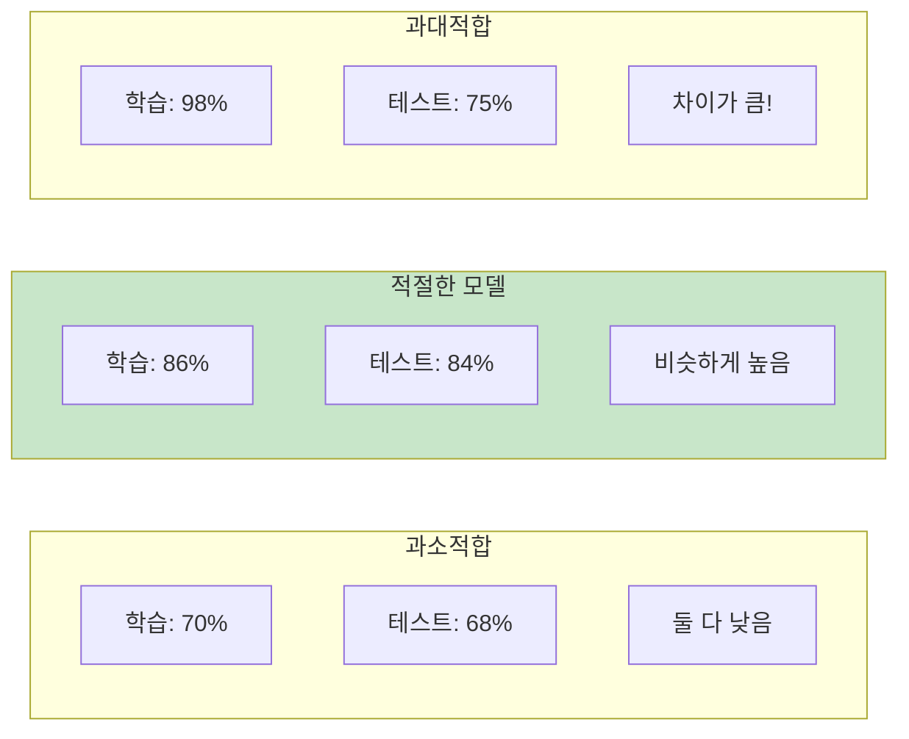

## 5. 과대적합 발생 과정

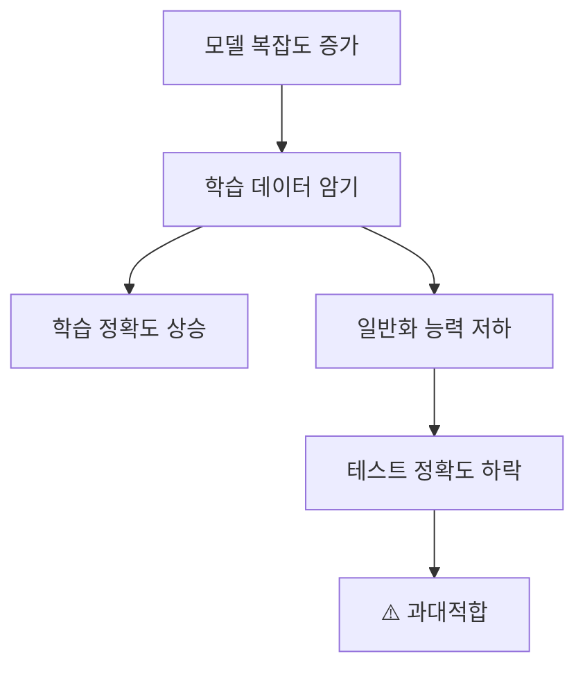

## 6. 해결 방법

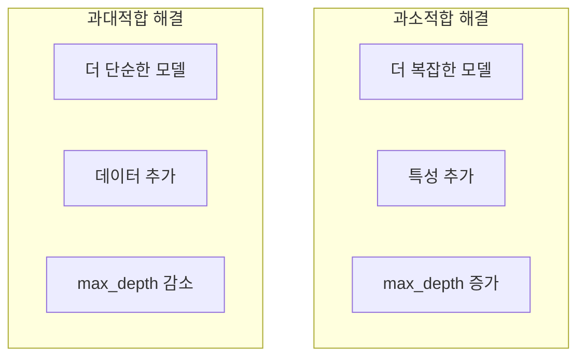

## 7. 혼동행렬 구조

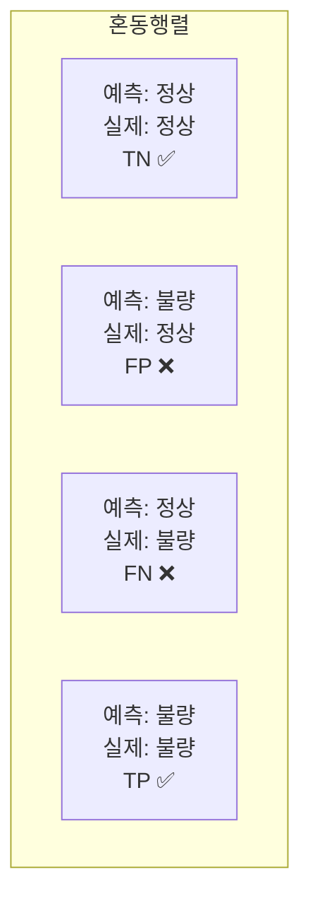

## 8. TN, FP, FN, TP 의미

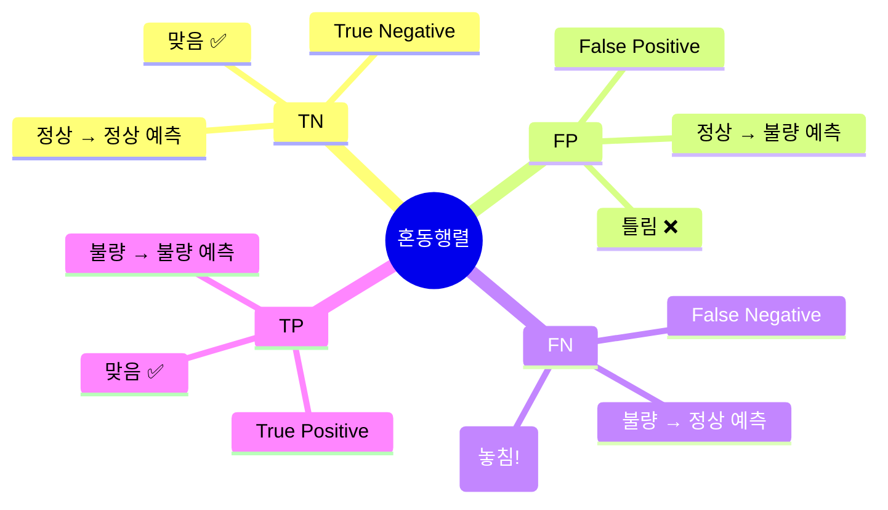

## 9. 정밀도와 재현율

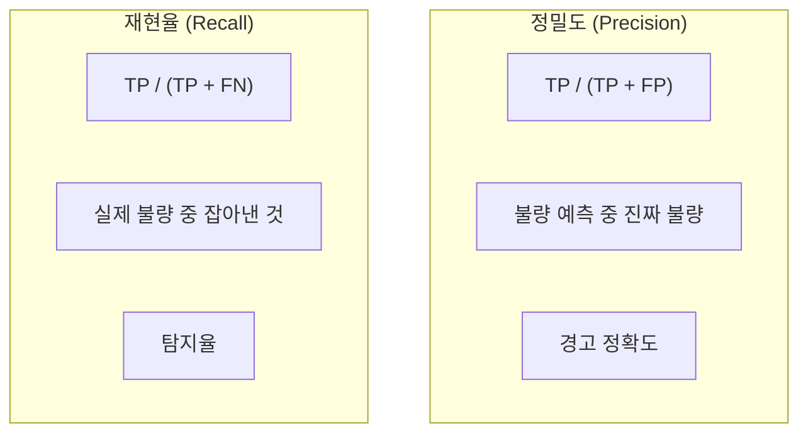

## 10. 상황별 중요 지표

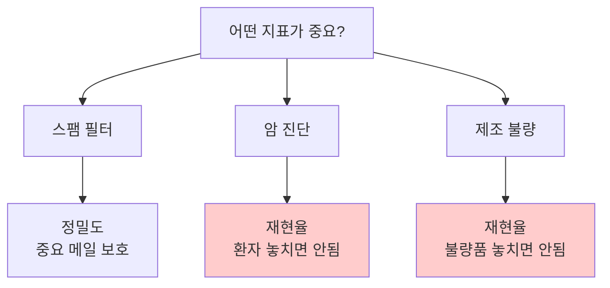

## 11. F1 Score

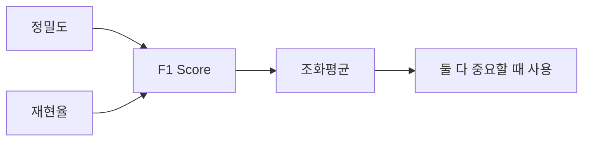

## 12. sklearn 평가 함수

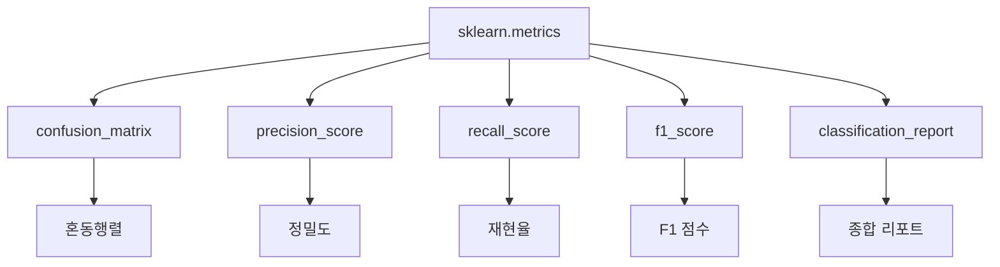

## 13. 분류 vs 회귀 평가 지표

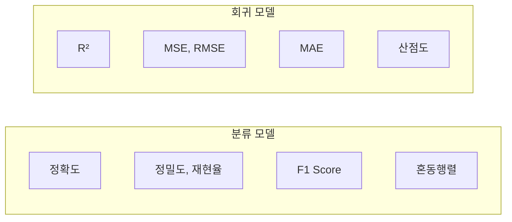

## 14. 강의 구조

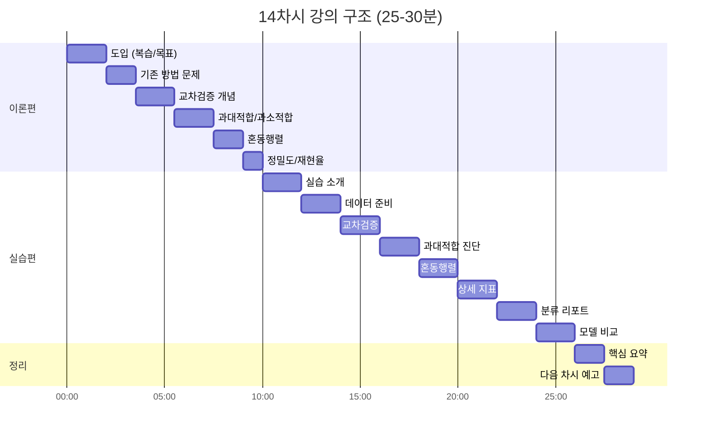

## 15. 모델 평가 체크리스트

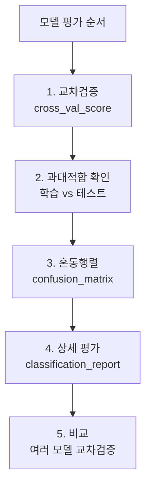

## 16. 핵심 요약

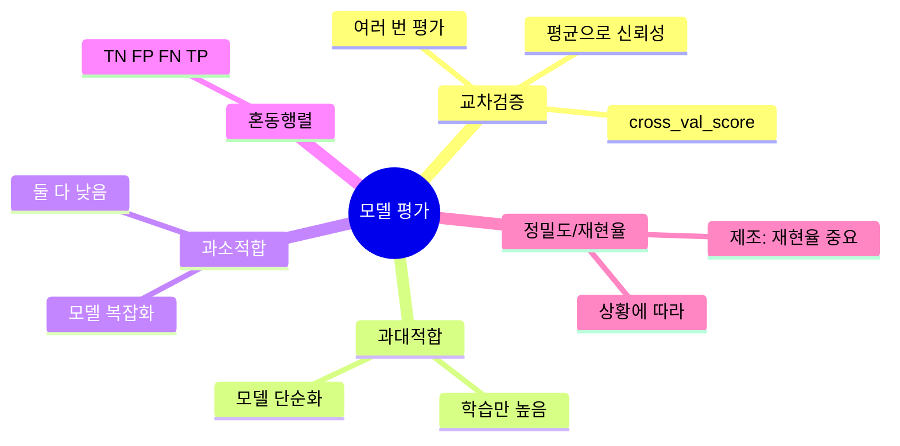
