# [16차시] 시계열 데이터 기초 - 다이어그램

## 1. 시계열 데이터란?

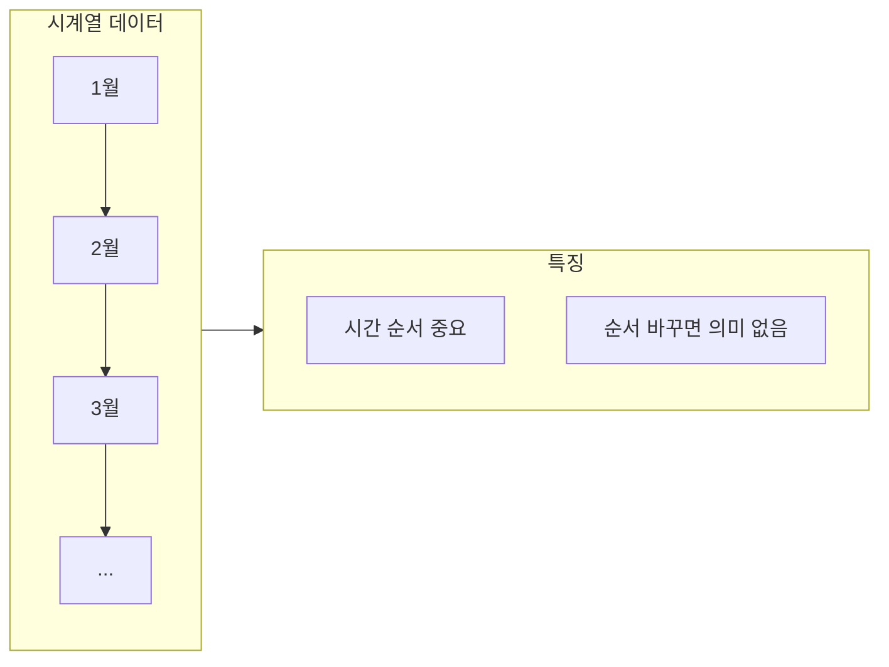

## 2. 제조 현장 시계열 예시

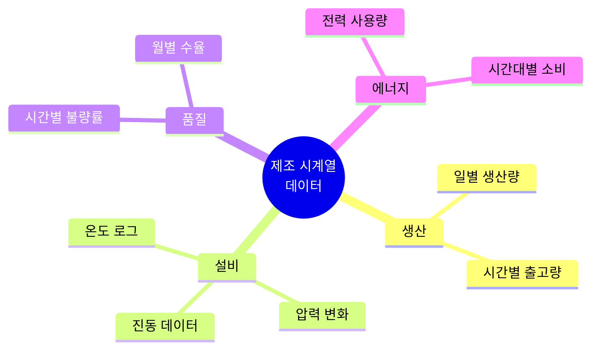

## 3. 일반 데이터 vs 시계열 데이터

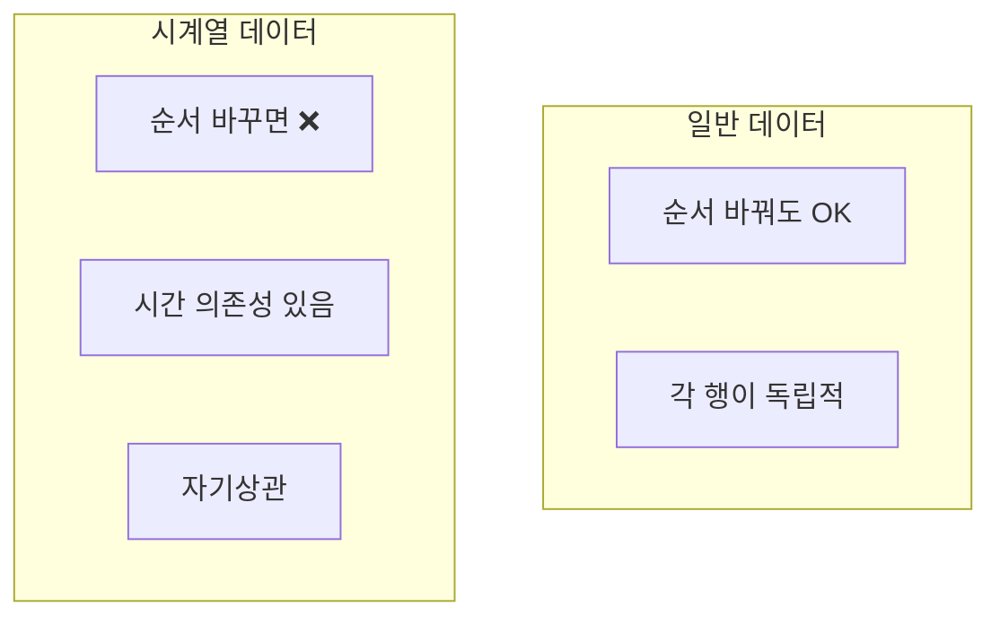

## 4. 시계열 특성

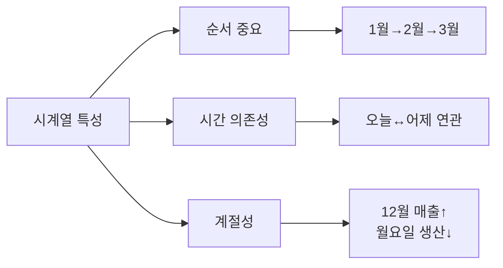

## 5. 자기상관 개념

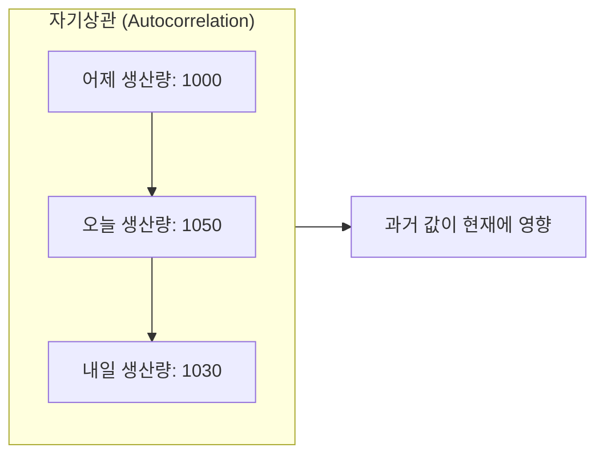

## 6. datetime 모듈

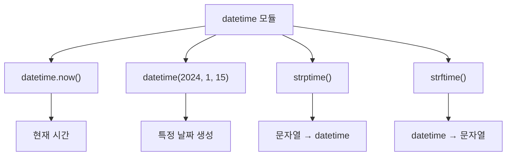

## 7. strptime vs strftime

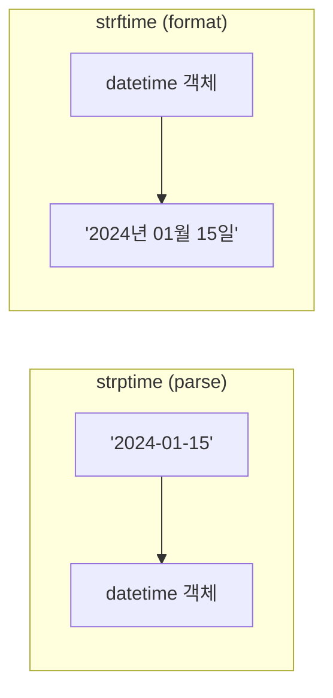

## 8. Pandas 날짜 처리

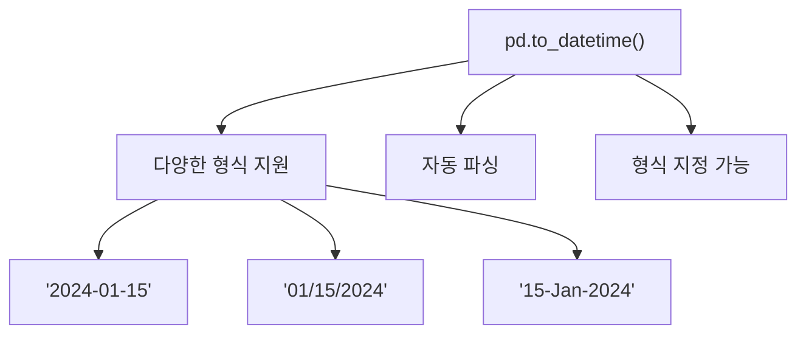

## 9. dt 접근자

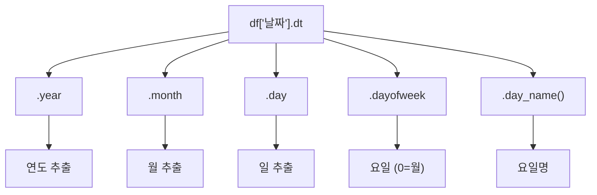

## 10. 날짜 인덱스

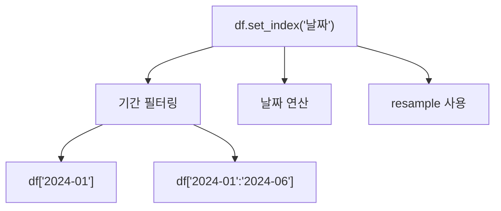

## 11. resample 개념

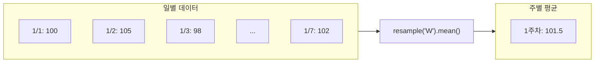

## 12. resample 주기

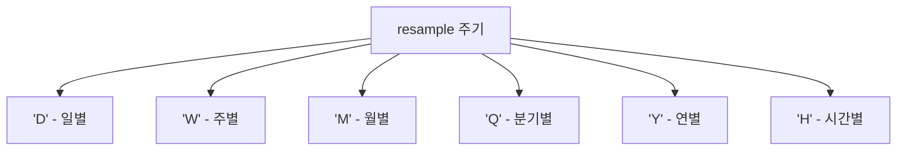

## 13. rolling 이동평균

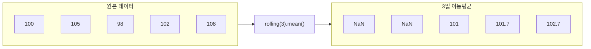

## 14. shift 연산

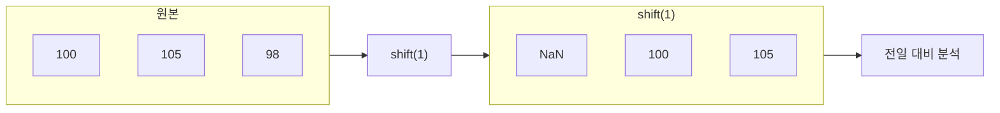

## 15. 시계열 분할

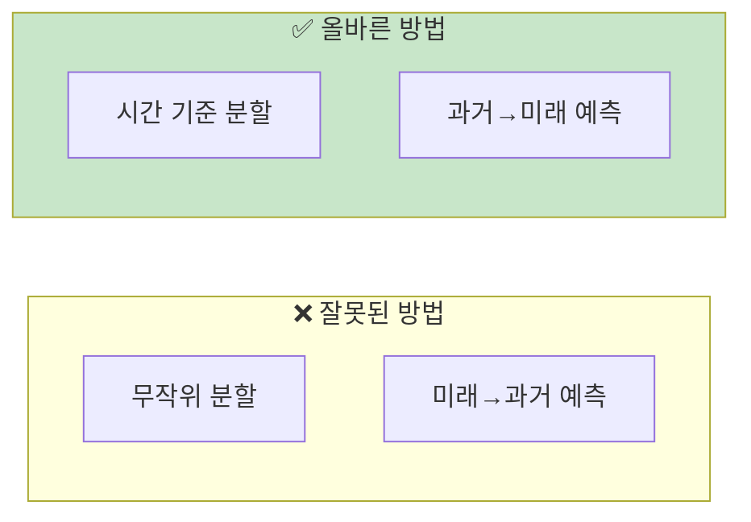

## 16. 시간 기준 분할

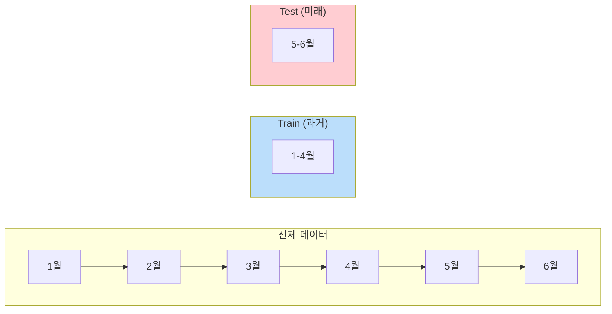

## 17. 시계열 처리 워크플로우

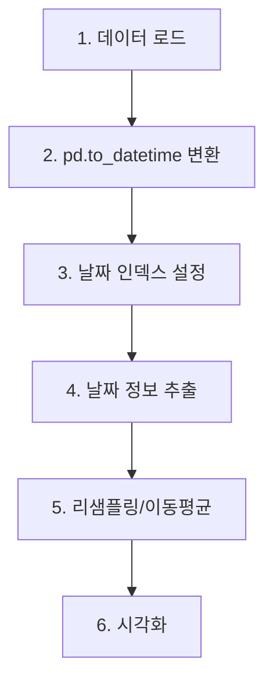

## 18. 강의 구조

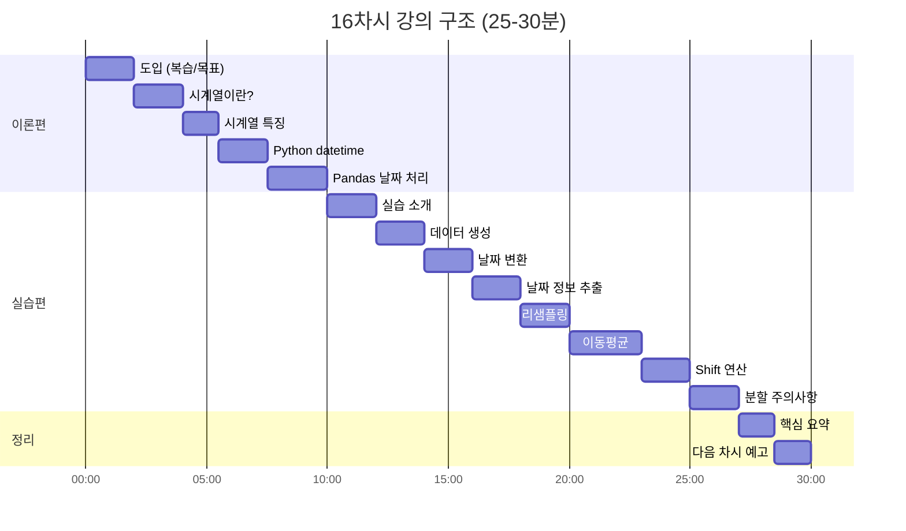

## 19. 핵심 요약

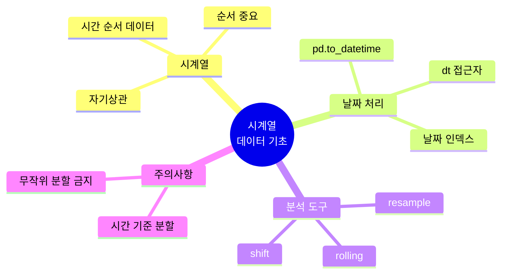

## 20. 제조 현장 활용

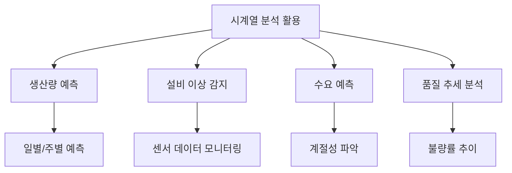
