# [23차시] FastAPI로 예측 서비스 만들기 - 다이어그램

## 1. FastAPI란?

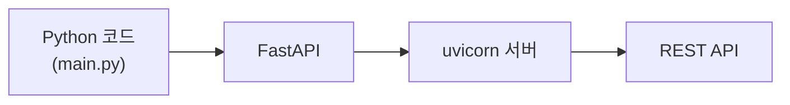

## 2. Streamlit vs FastAPI

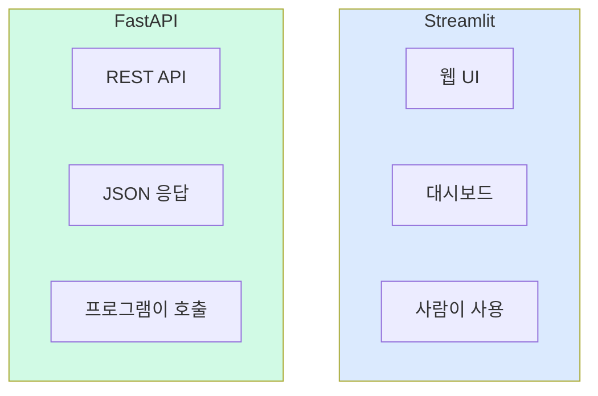

## 3. REST API 흐름

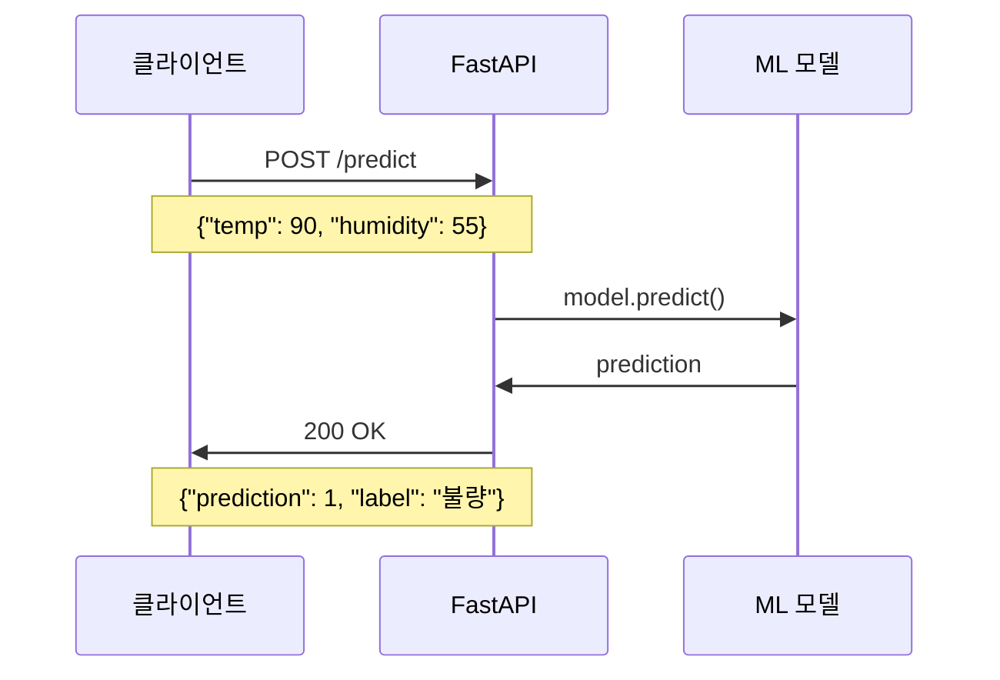

## 4. HTTP 메서드

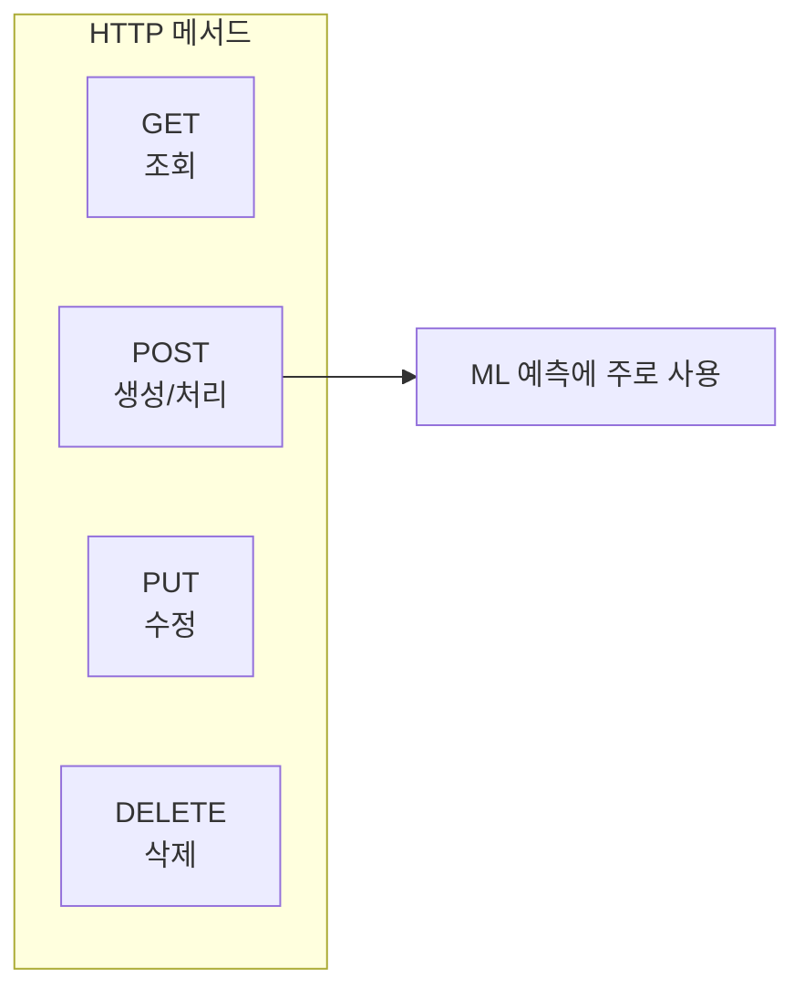

## 5. FastAPI 앱 구조

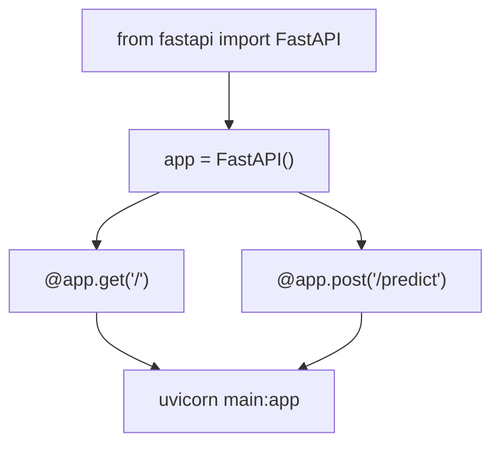

## 6. 경로 매개변수

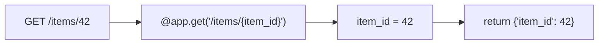

## 7. 쿼리 매개변수

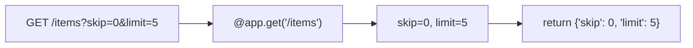

## 8. Pydantic 모델

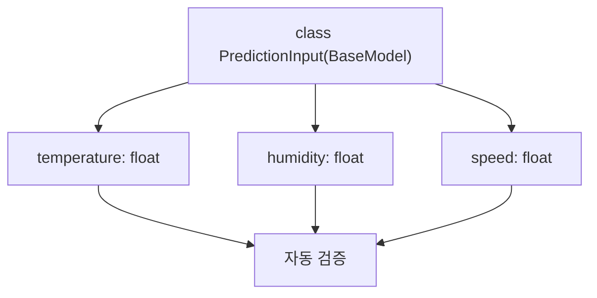

## 9. 요청/응답 구조

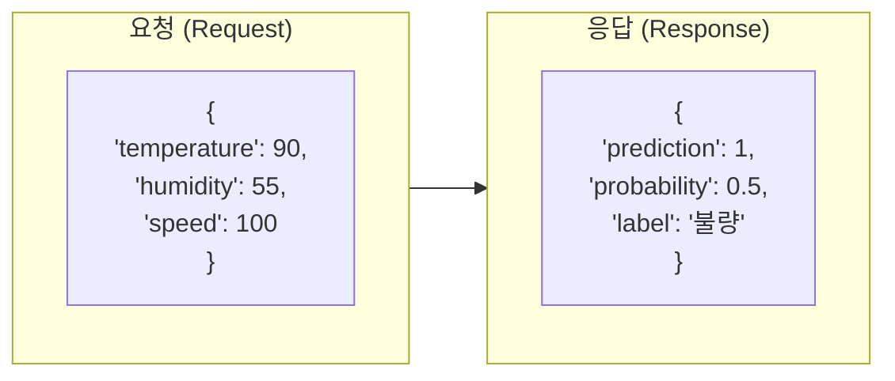

## 10. POST /predict 흐름

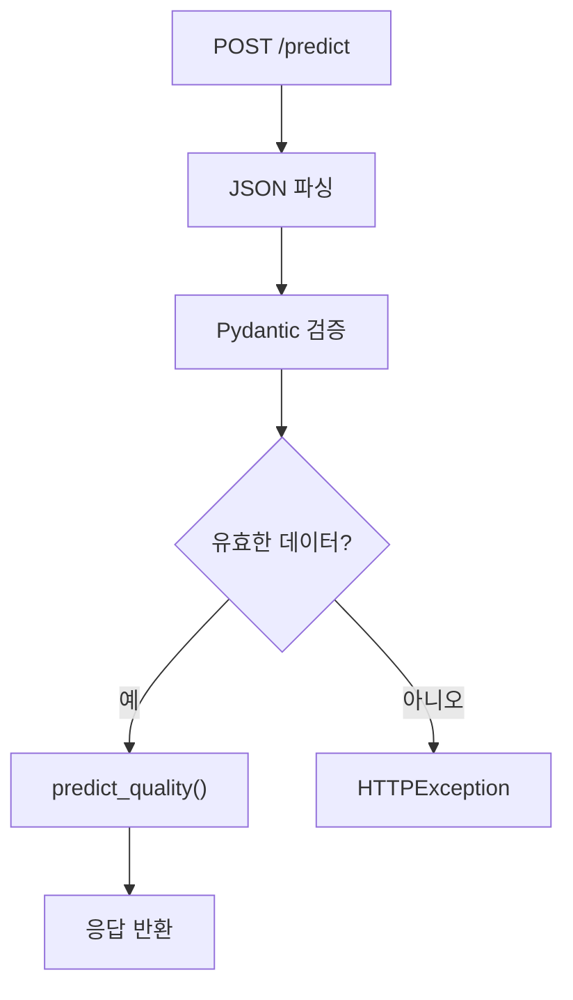

## 11. 에러 처리

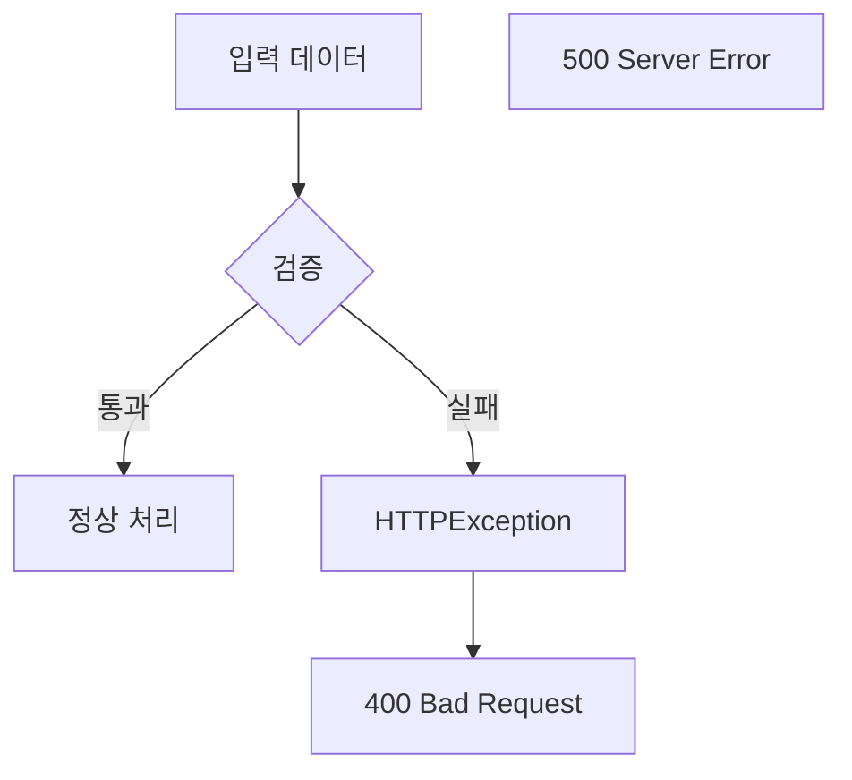

## 12. 자동 문서화

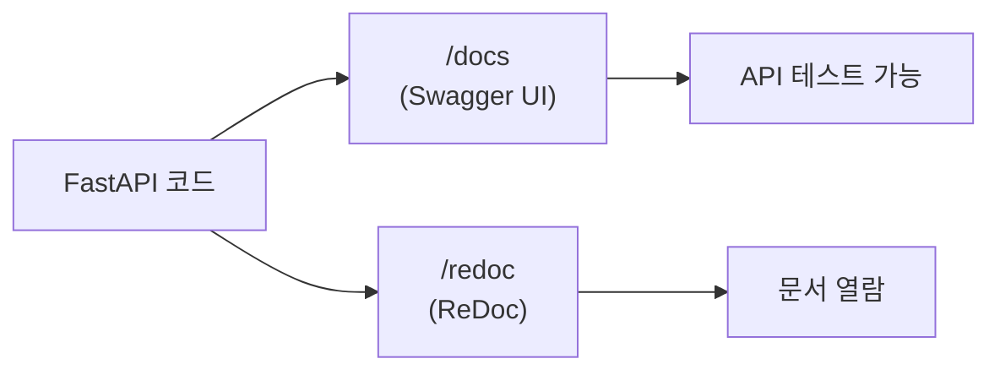

## 13. ML 모델 연동

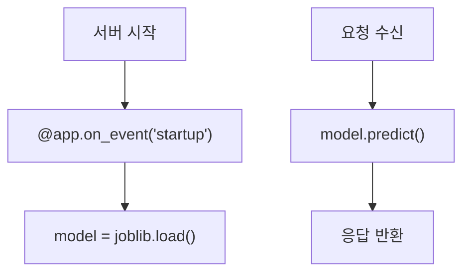

## 14. 배치 예측

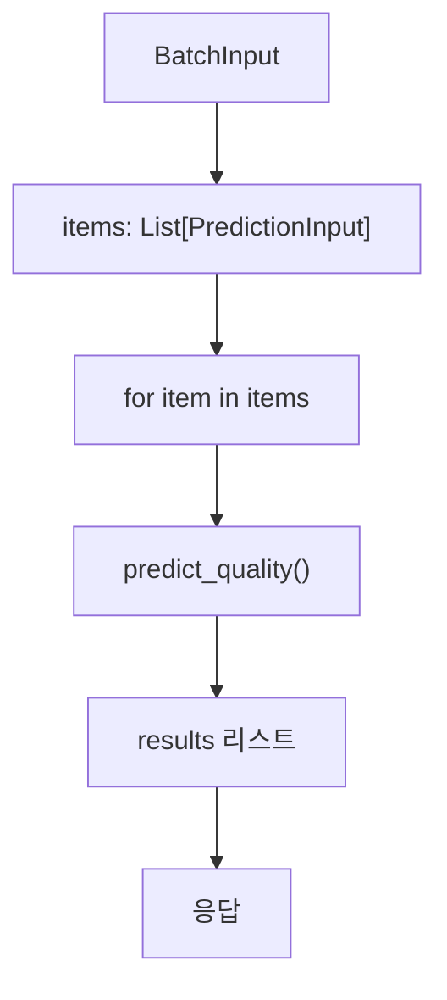

## 15. Docker 배포

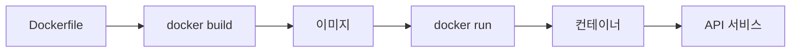

## 16. API 클라이언트

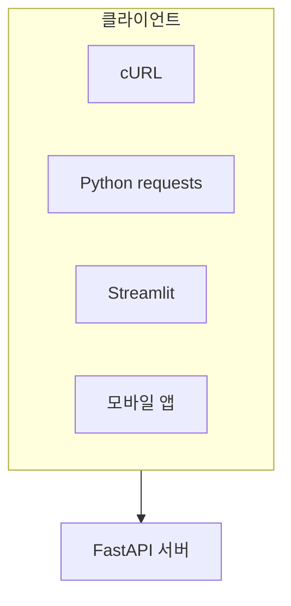

## 17. 전체 아키텍처

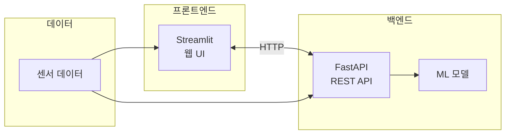

## 18. 강의 구조

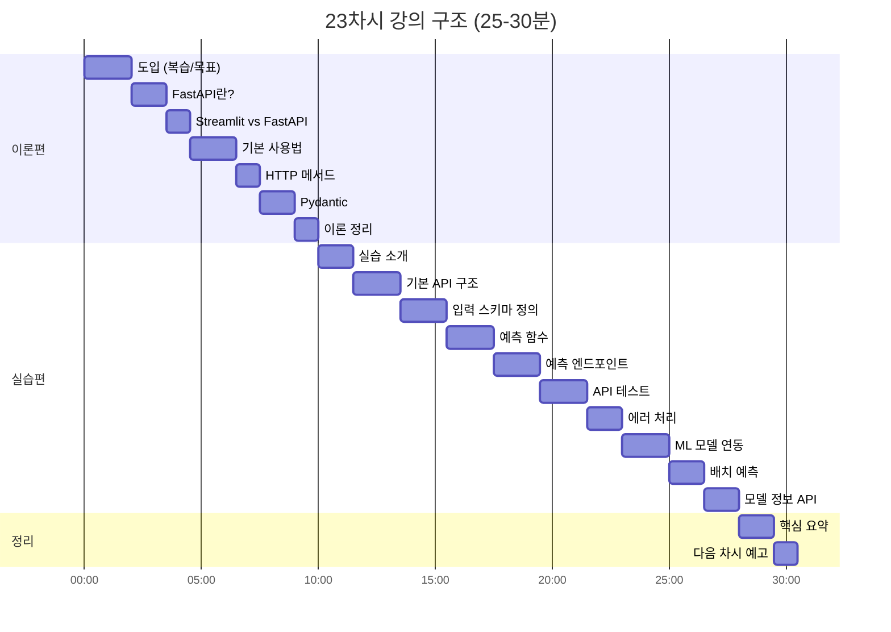

## 19. 핵심 요약

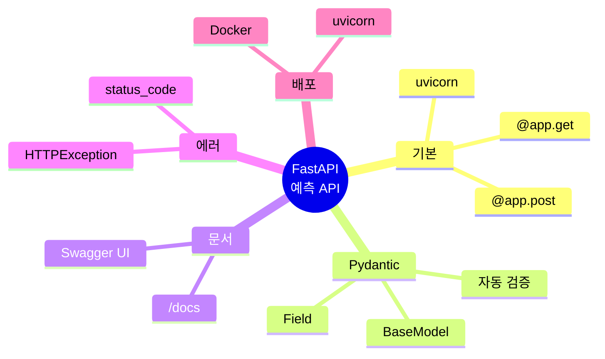

## 20. 다음 단계

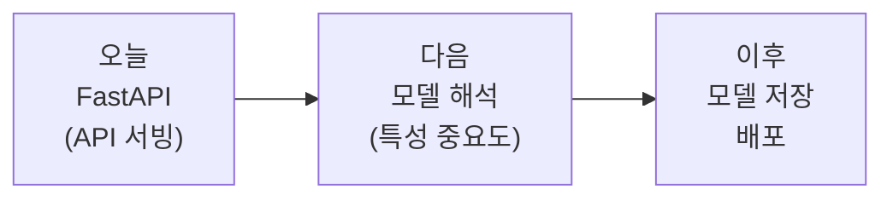
