# [25차시] 모델 저장과 실무 배포 준비 - 다이어그램

## 1. 왜 모델을 저장하나?

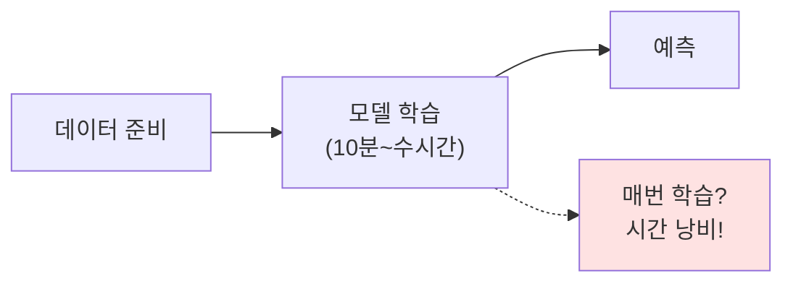

## 2. 모델 저장 워크플로우

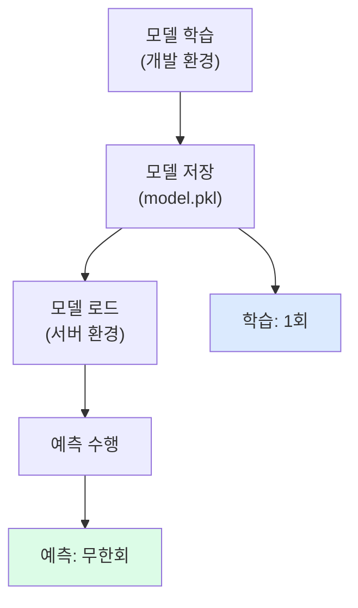

## 3. joblib 사용법

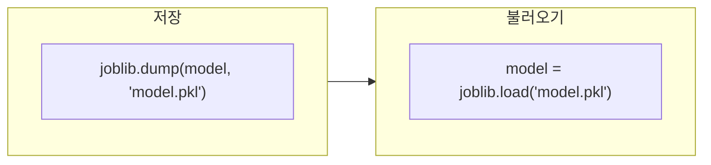

## 4. 저장 코드 흐름

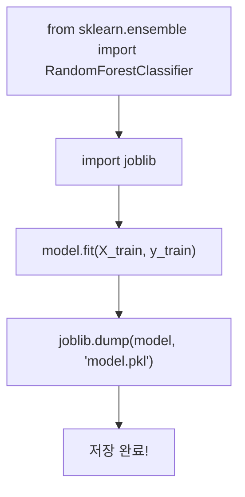

## 5. 전처리기도 함께 저장

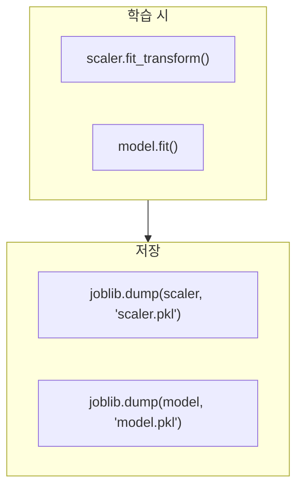

## 6. 불러와서 예측

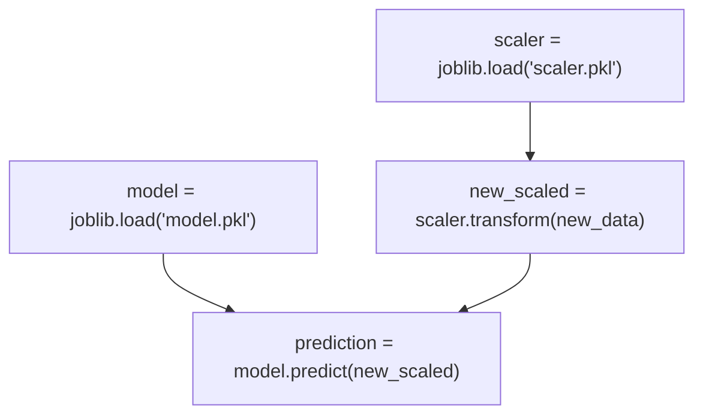

## 7. 파이프라인 장점

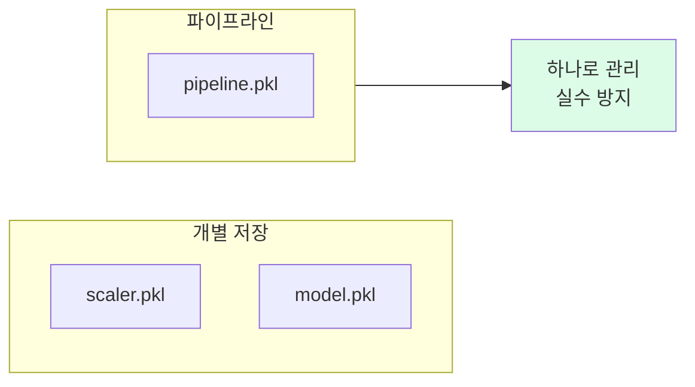

## 8. 파이프라인 구조

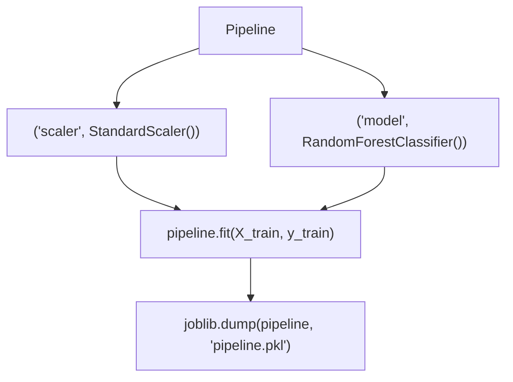

## 9. pickle vs joblib

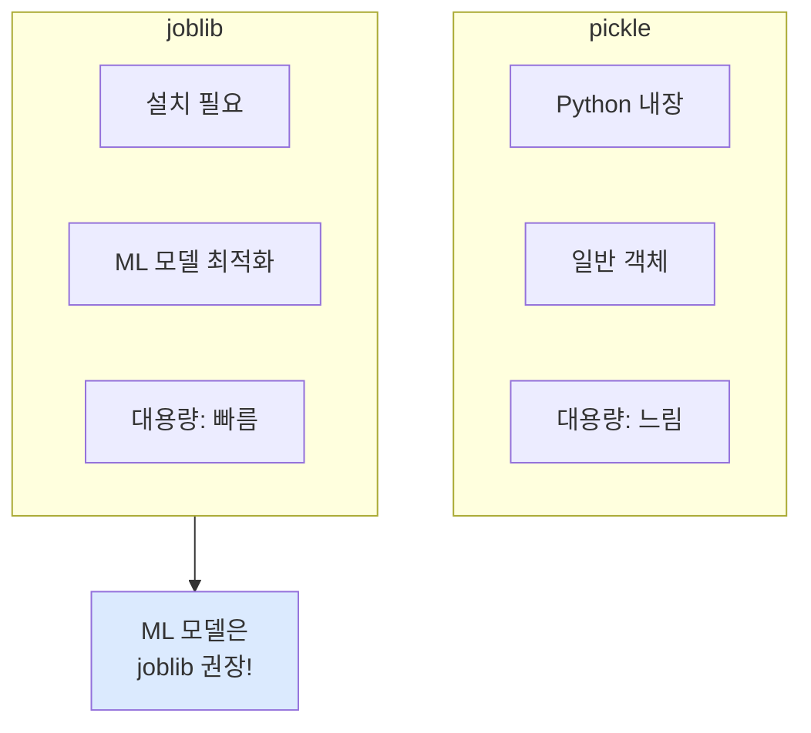

## 10. 메타데이터 저장

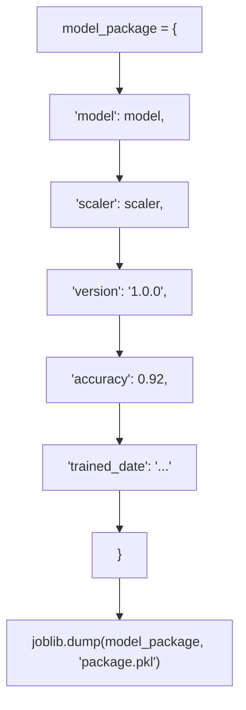

## 11. 버전 관리 파일명

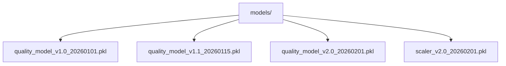

## 12. 배포 전 체크리스트

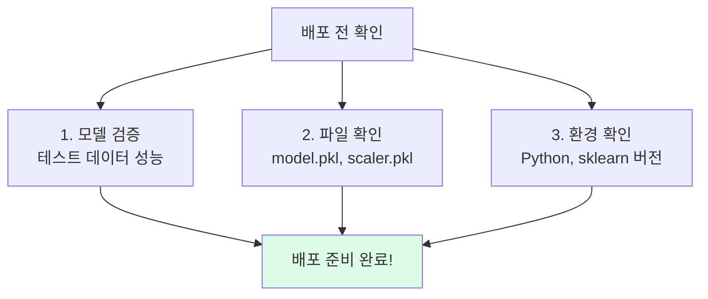

## 13. requirements.txt

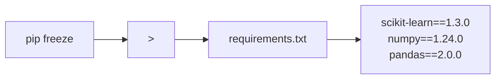

## 14. 프로젝트 폴더 구조

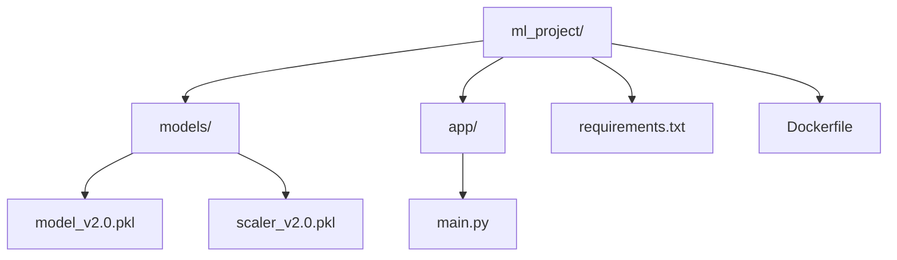

## 15. FastAPI 연동

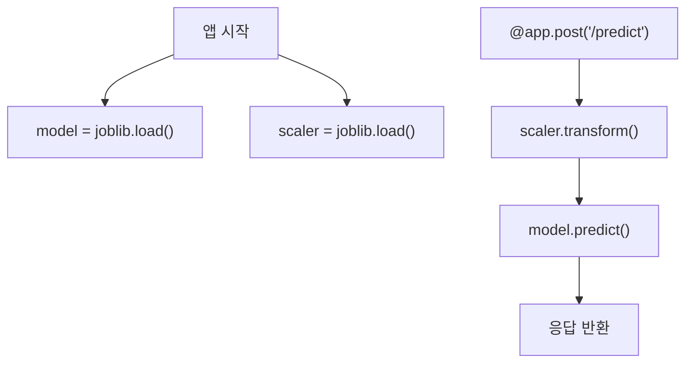

## 16. 배포 아키텍처

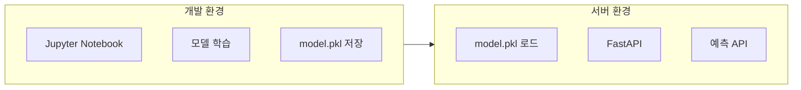

## 17. 버전 불일치 문제

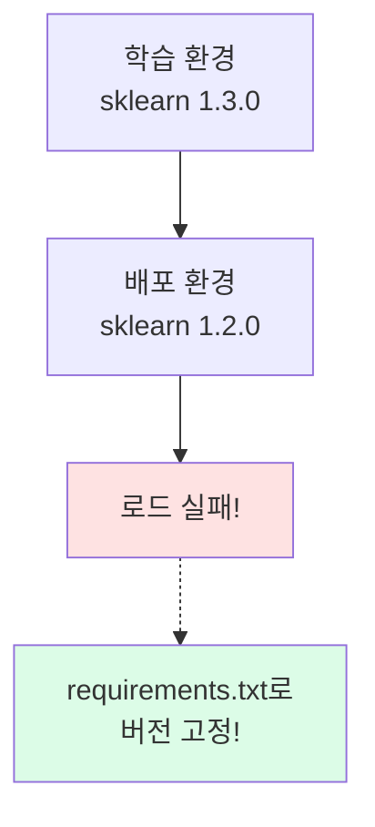

## 18. 강의 구조

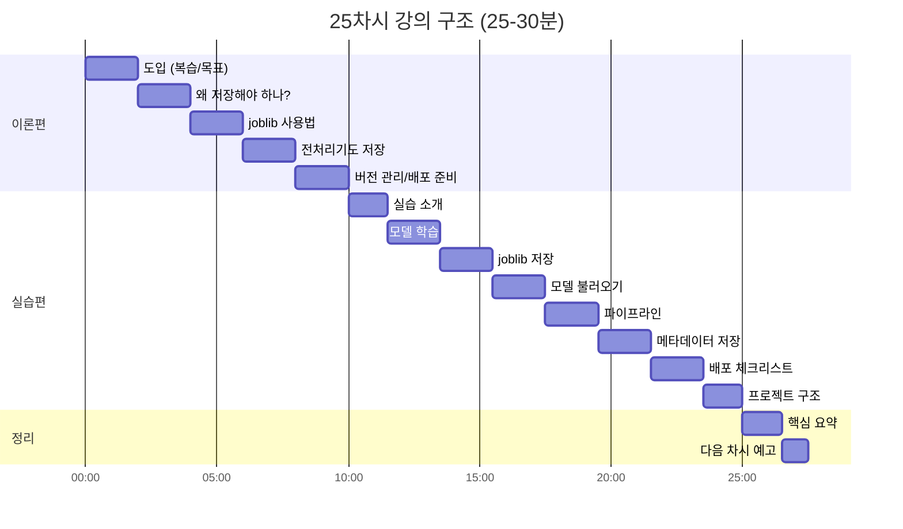

## 19. 핵심 요약

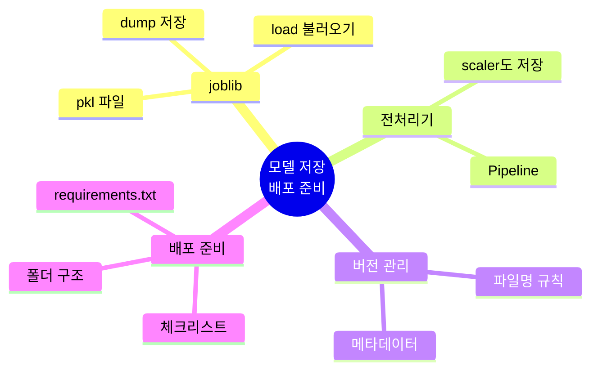

## 20. 다음 단계

