# [26차시] AI 프로젝트 종합 실습 - 다이어그램

## 1. ML 프로젝트 전체 워크플로우

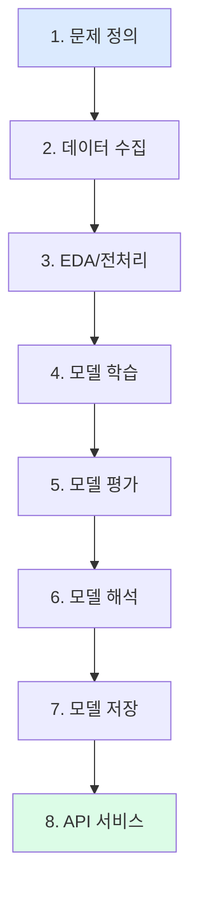

## 2. 종합 실습 목표

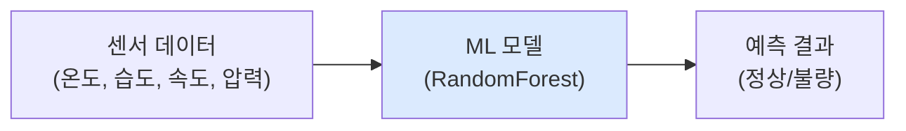

## 3. 문제 정의 단계

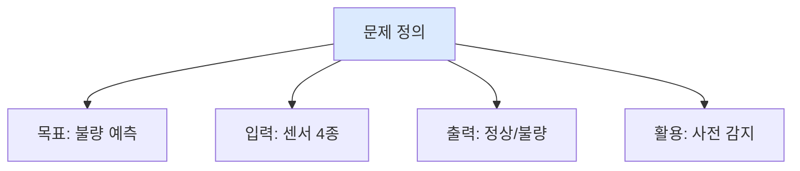

## 4. 데이터 확인 체크리스트

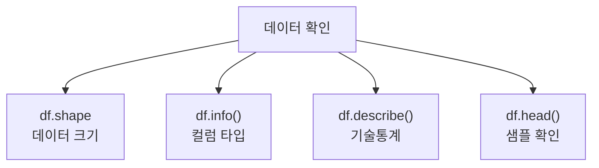

## 5. EDA 및 전처리

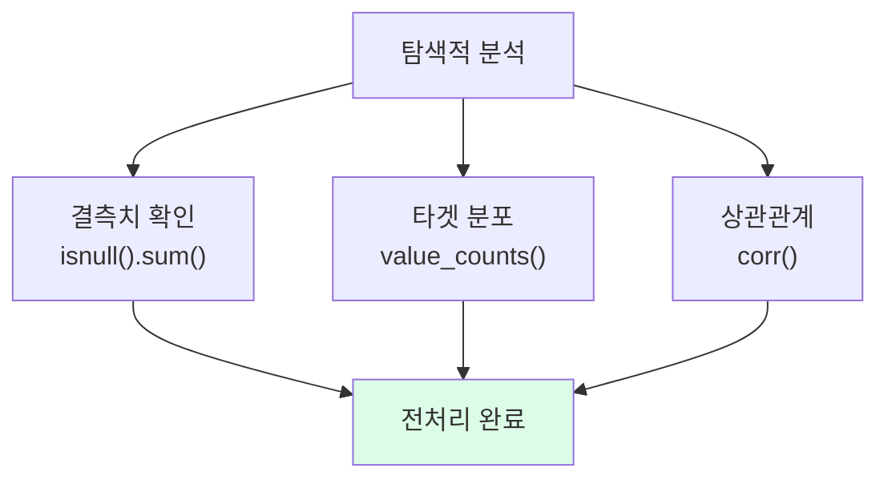

## 6. 모델 학습 파이프라인

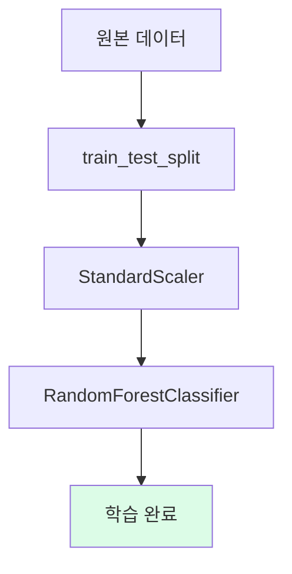

## 7. 모델 평가 지표

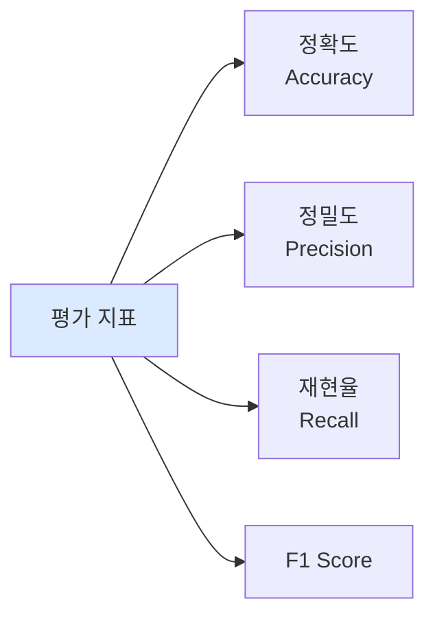

## 8. 특성 중요도 분석

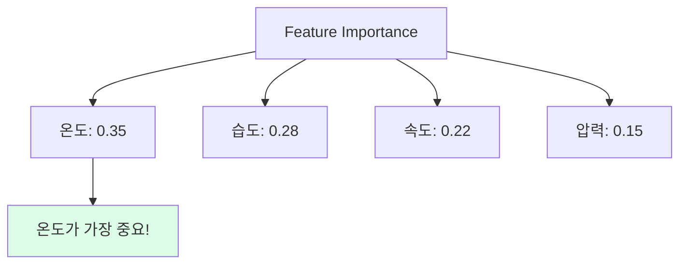

## 9. 모델 저장 구조

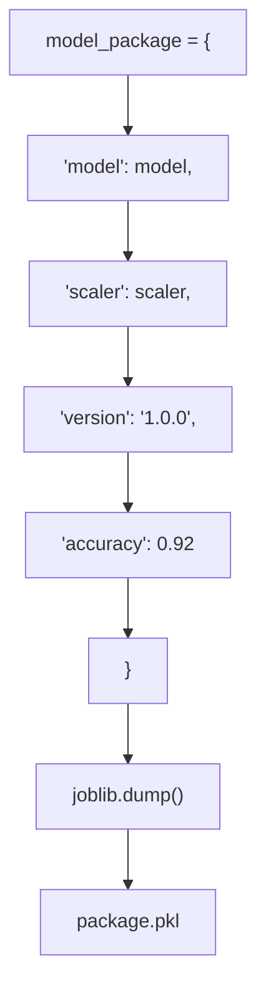

## 10. FastAPI 서비스

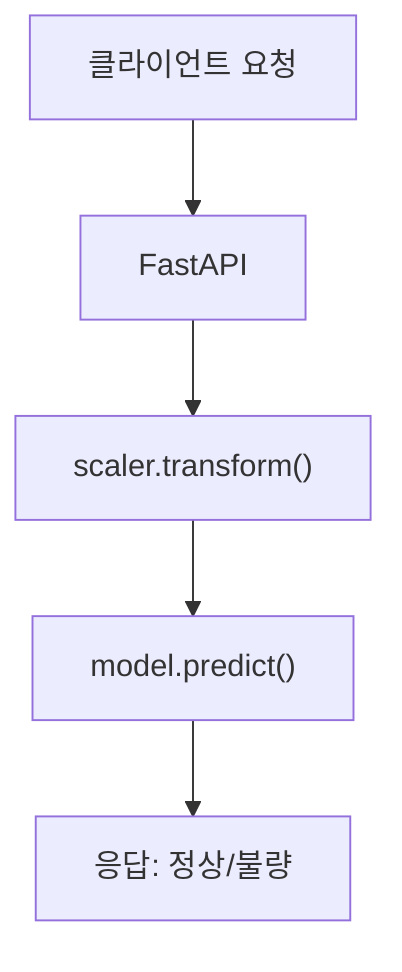

## 11. 8단계 워크플로우 완성

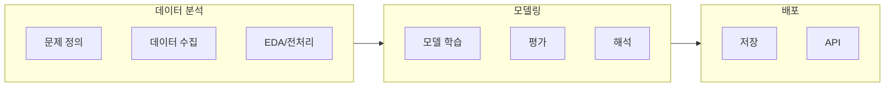

## 12. Part I 요약 (1-3차시)

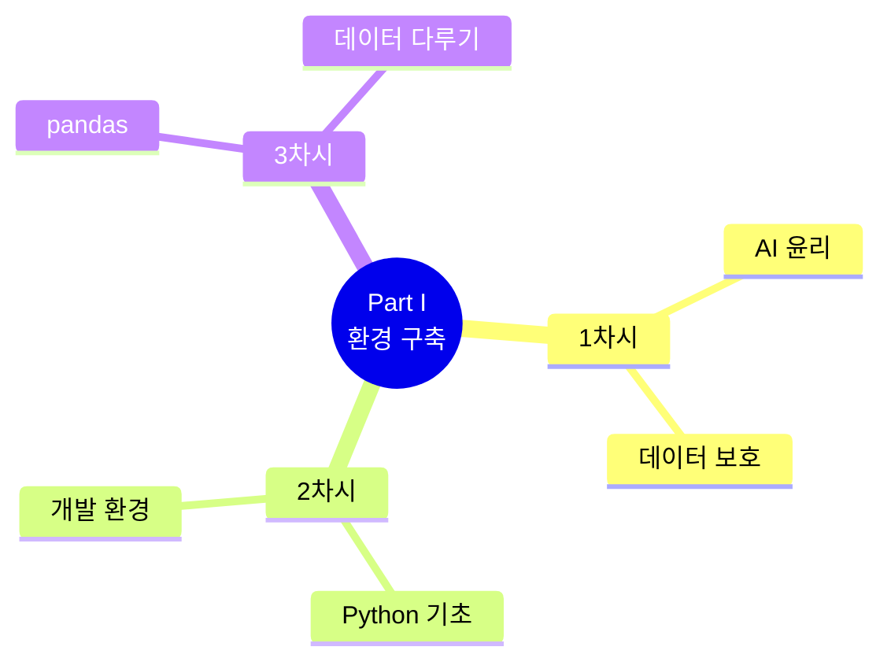

## 13. Part II 요약 (4-9차시)

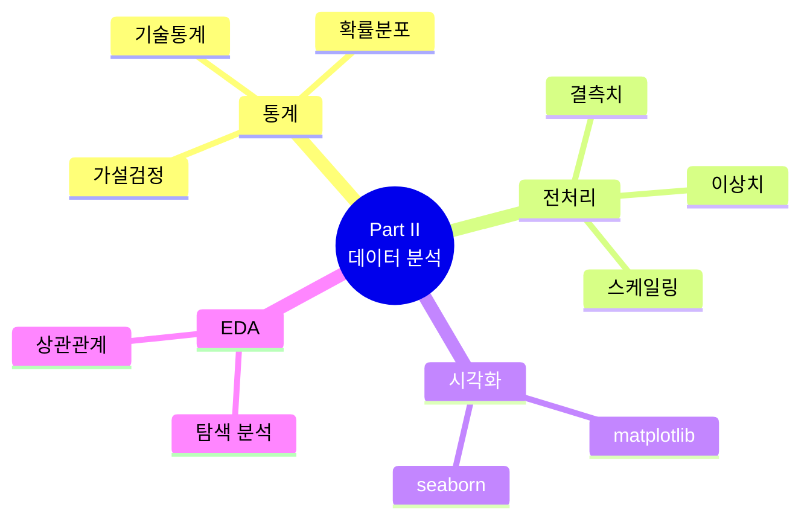

## 14. Part III 요약 (10-19차시)

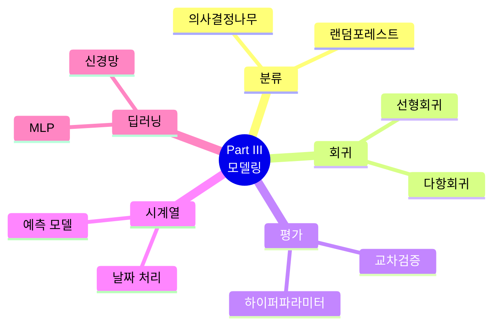

## 15. Part IV 요약 (20-26차시)

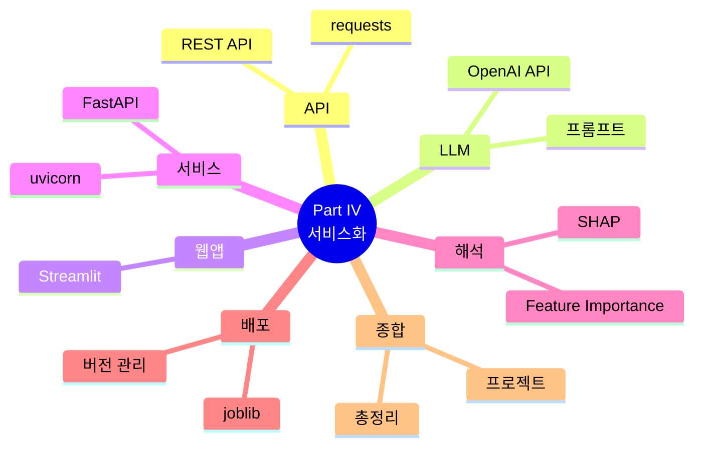

## 16. 핵심 라이브러리 정리

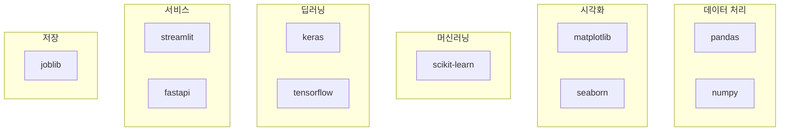

## 17. 후속 학습 로드맵

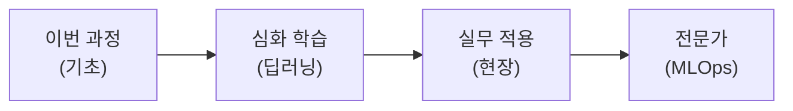

## 18. 심화 학습 방향

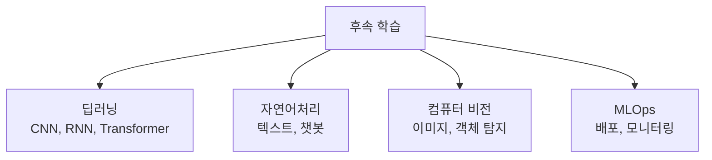

## 19. 수료 조건

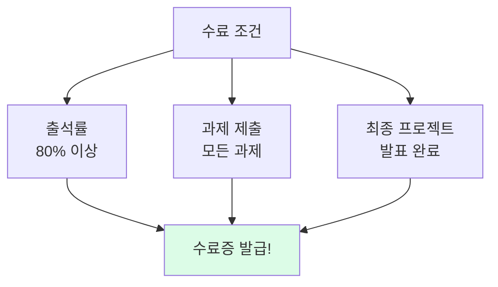

## 20. 과정 전체 여정

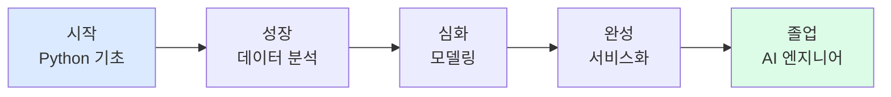

