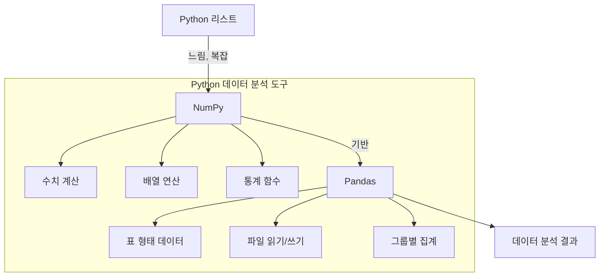
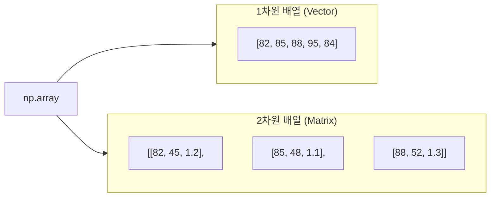
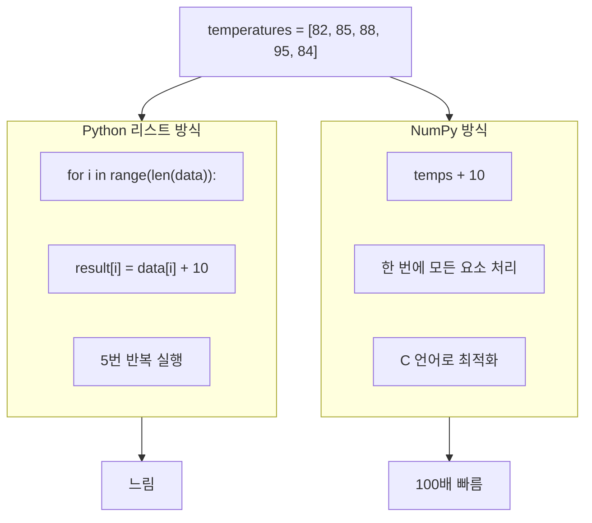
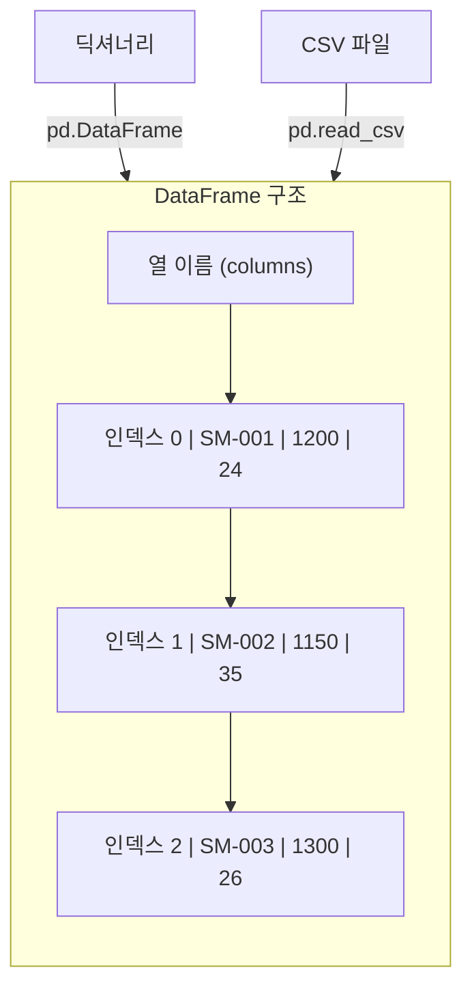
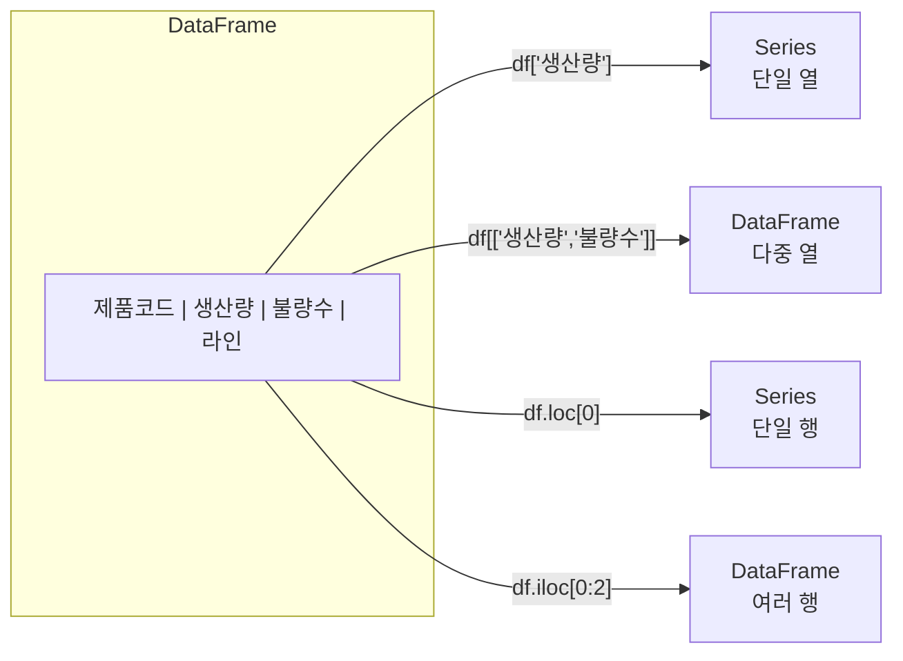
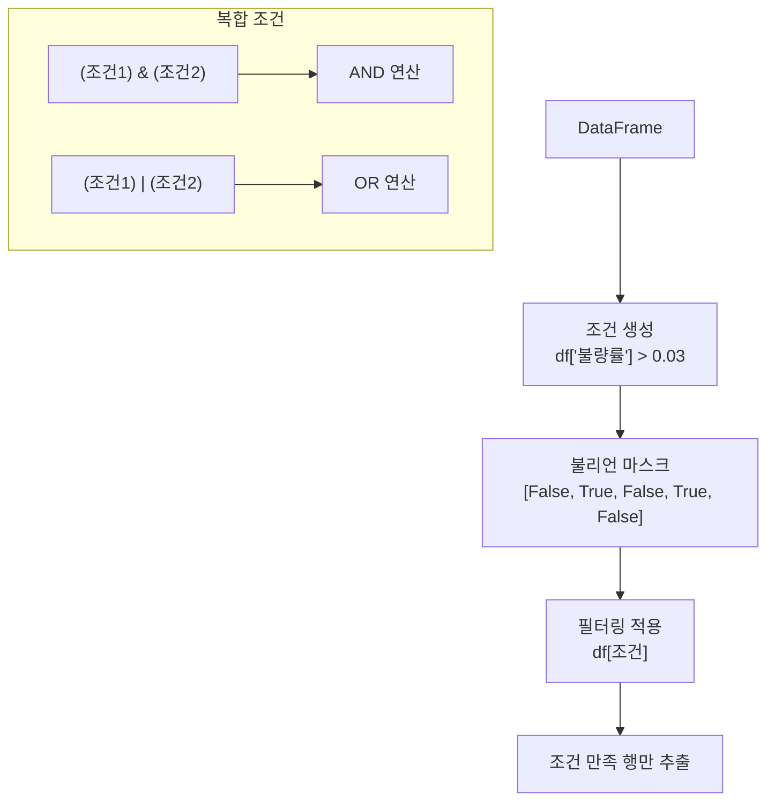
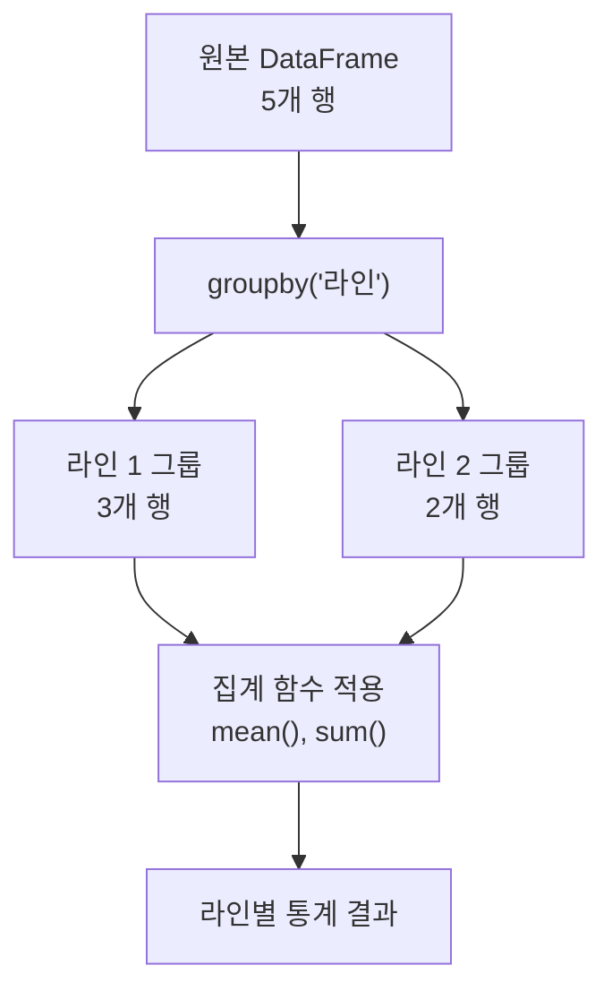
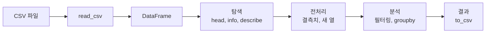
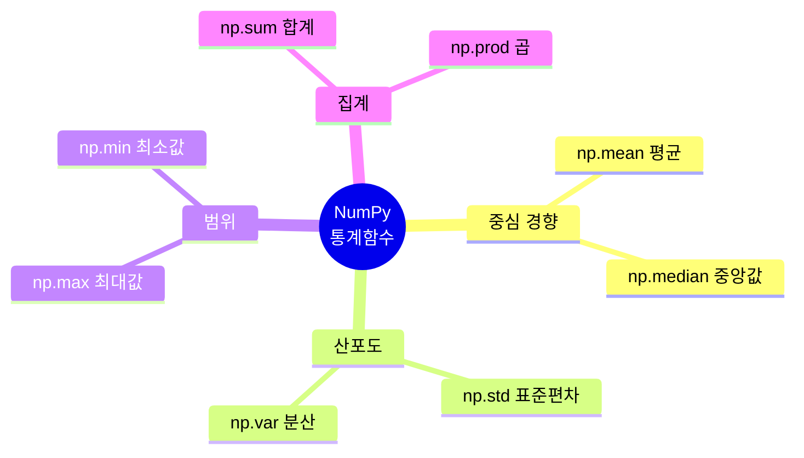
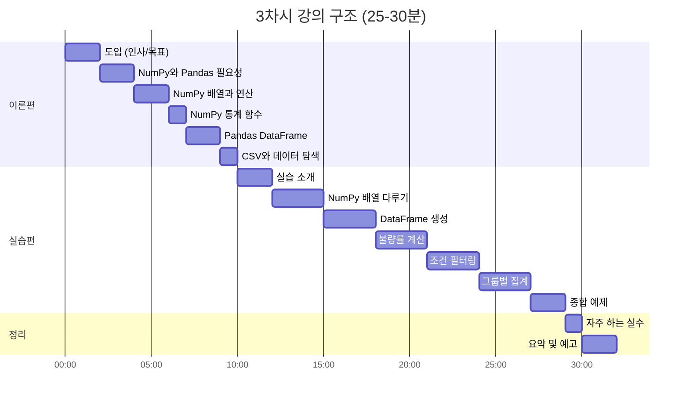

# [3차시] 제조 데이터 다루기 기초 - 다이어그램

## 1. NumPy와 Pandas 개요

## 2. NumPy 배열 구조

## 3. NumPy 벡터화 연산

## 4. Pandas DataFrame 구조

## 5. DataFrame 열/행 선택

## 6. 조건 필터링 흐름

## 7. groupby 집계 과정

## 8. 데이터 분석 워크플로우

## 9. NumPy 통계 함수

## 10. 강의 구조

