# [4차시] 데이터 요약과 시각화 - 다이어그램

## 1. 시각화의 중요성 (앤스콤의 4분면)

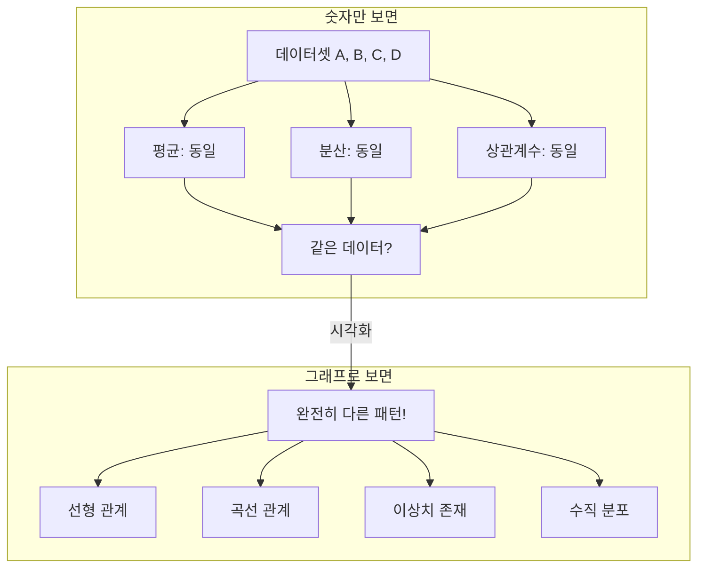

## 2. 기술통계량 분류

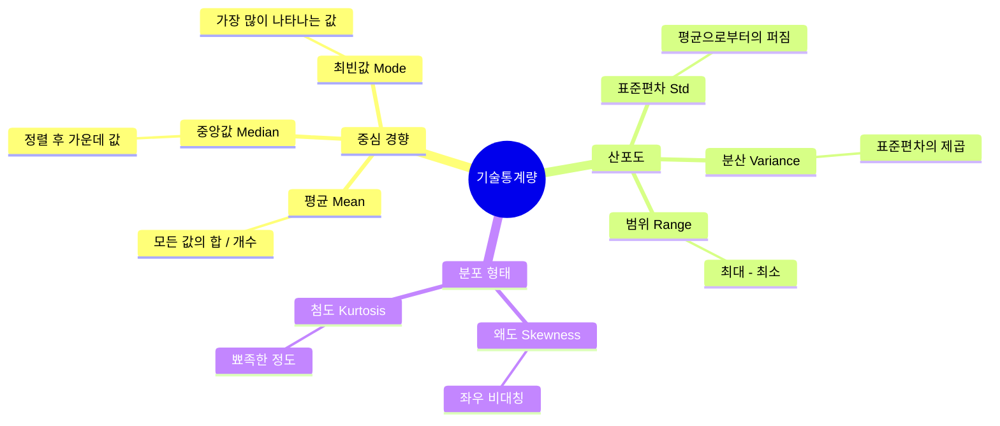

## 3. 평균 vs 중앙값 비교

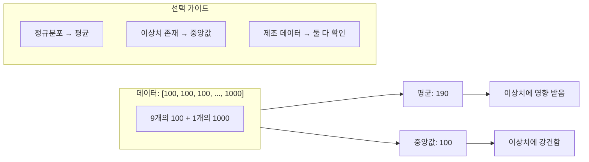

## 4. 표준편차와 품질 일관성

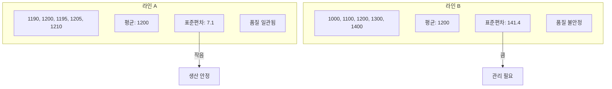

## 5. 그래프 종류 선택 가이드

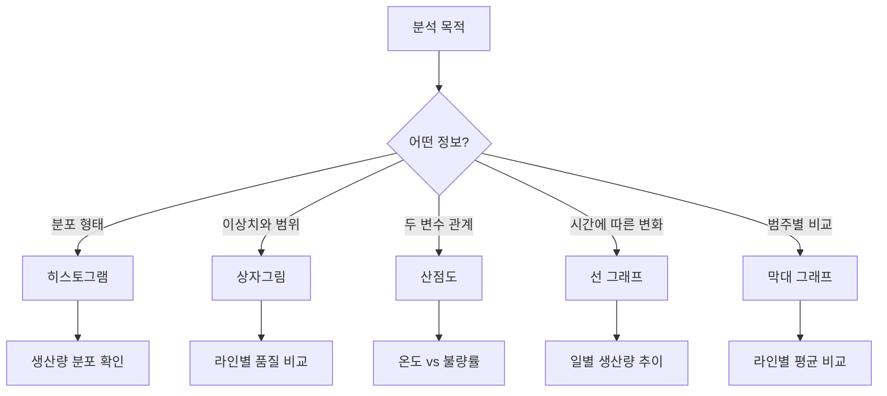

## 6. Matplotlib 기본 구조

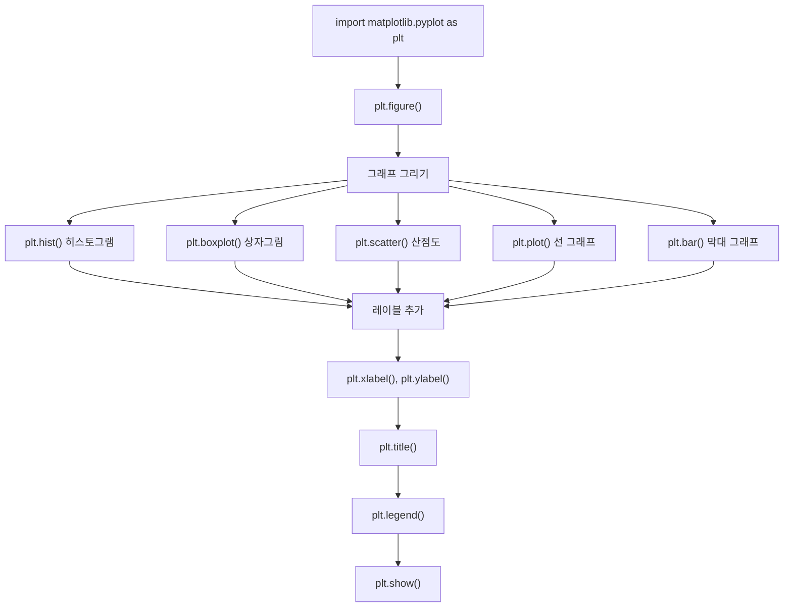

## 7. 히스토그램 해석

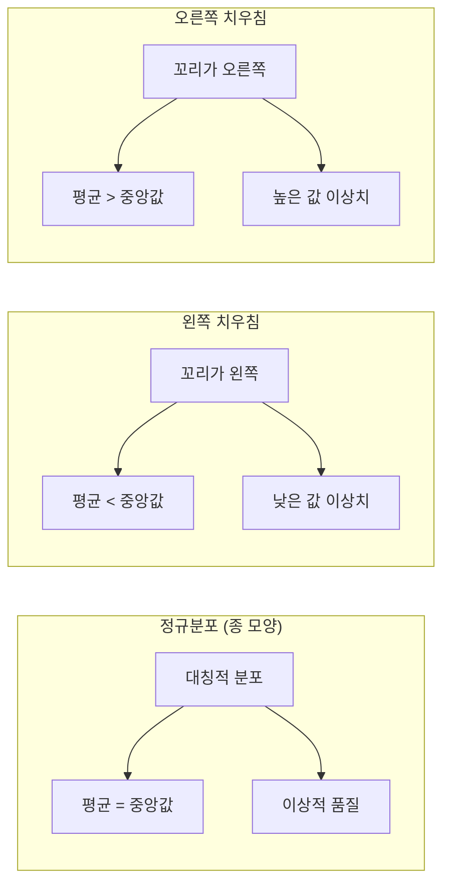

## 8. 상자그림 구성 요소

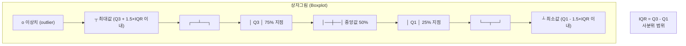

## 9. 산점도와 상관관계

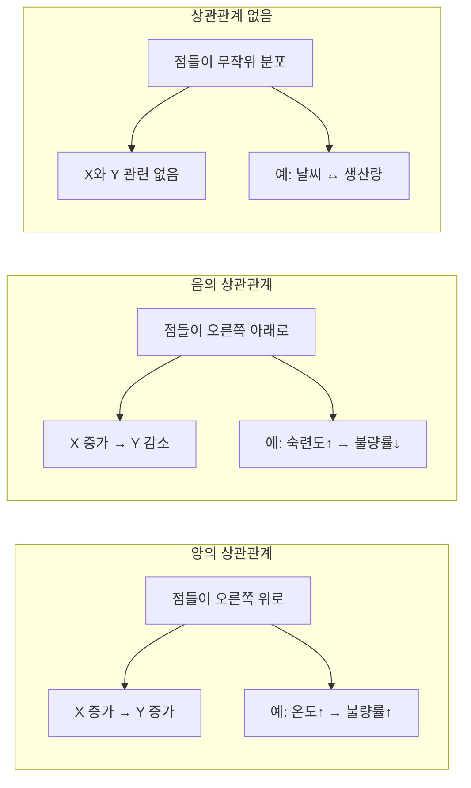

## 10. 시각화 Best Practices

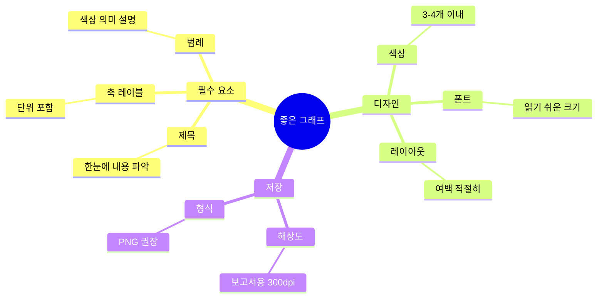

## 11. 데이터 시각화 워크플로우

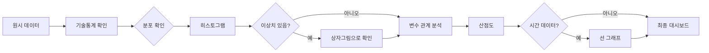

## 12. 강의 구조

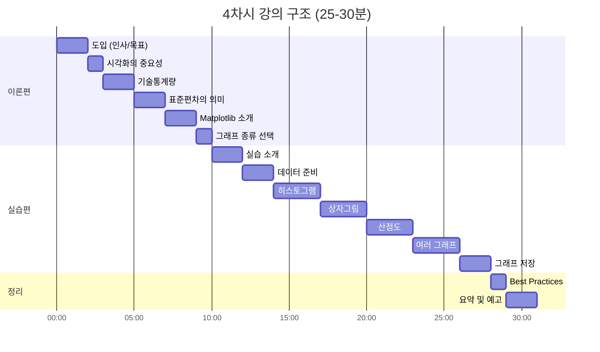
