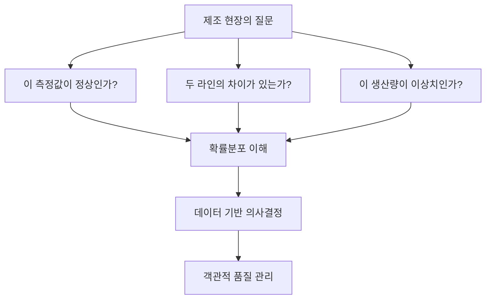
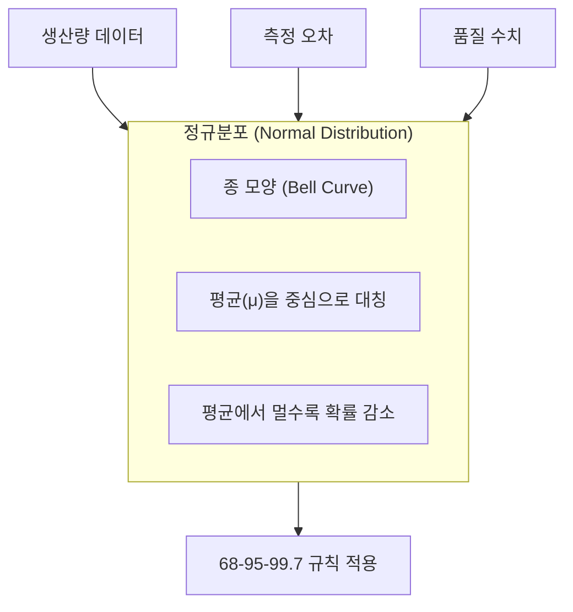
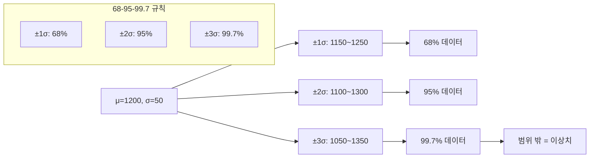
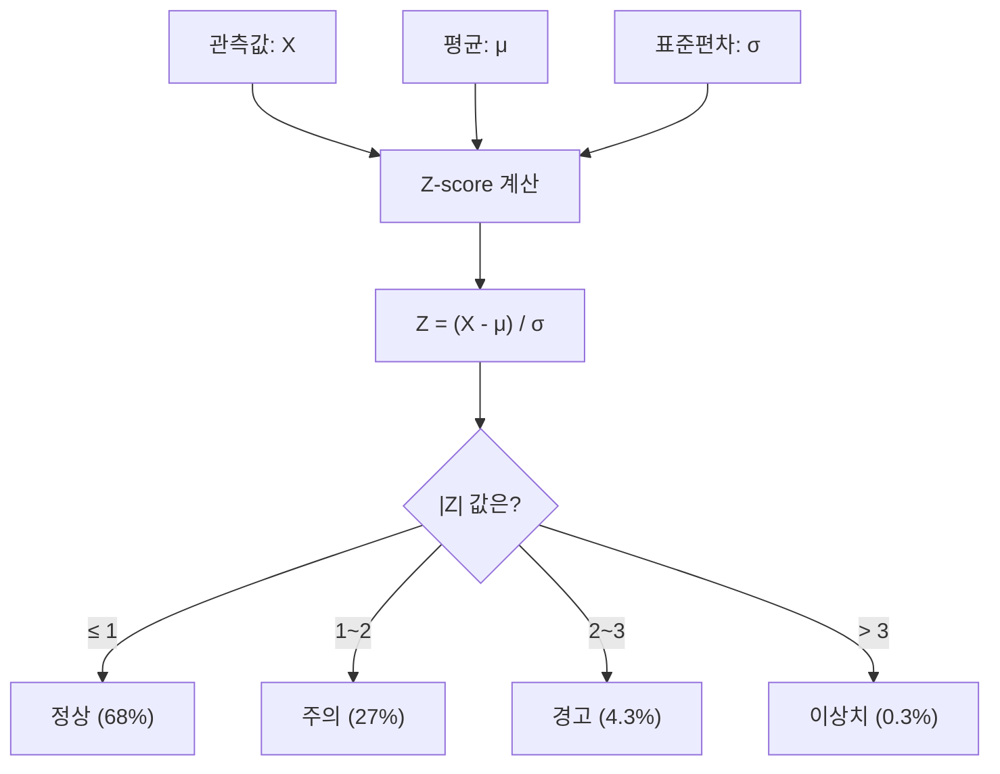
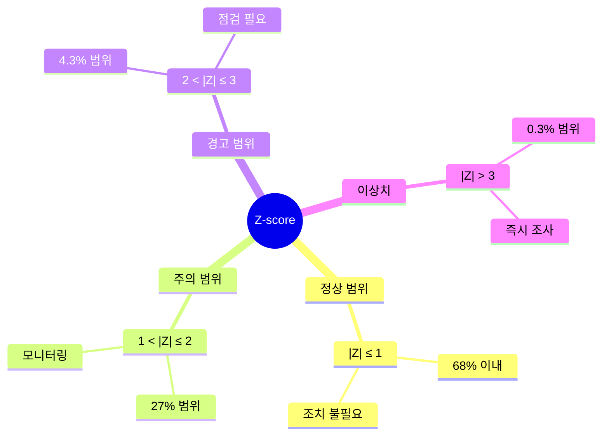
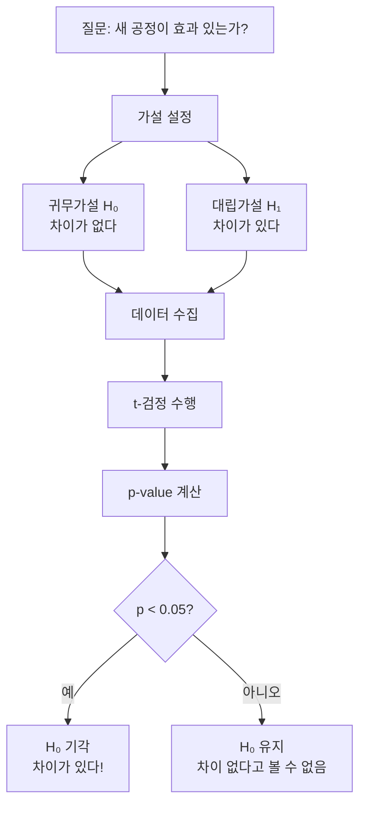
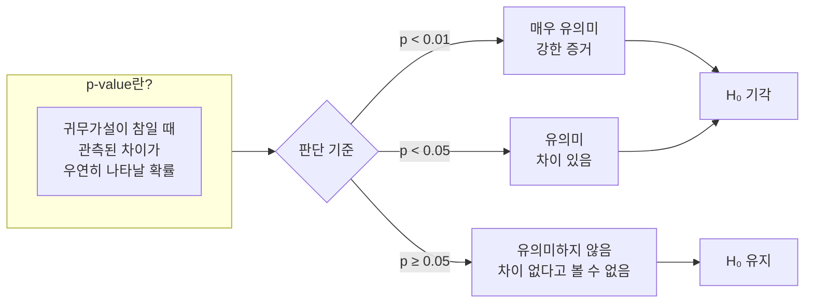
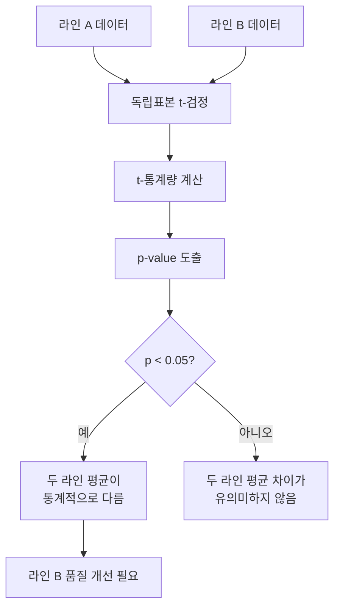
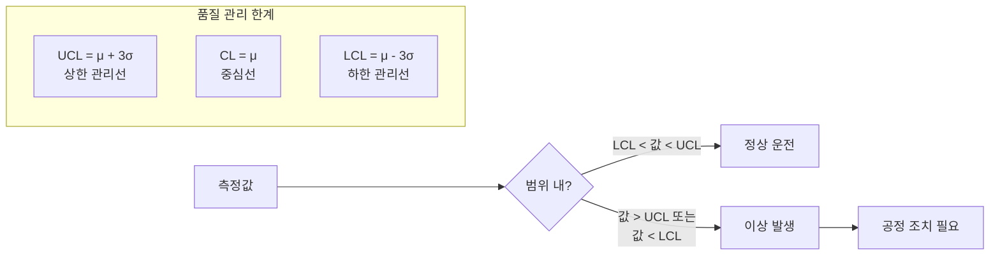
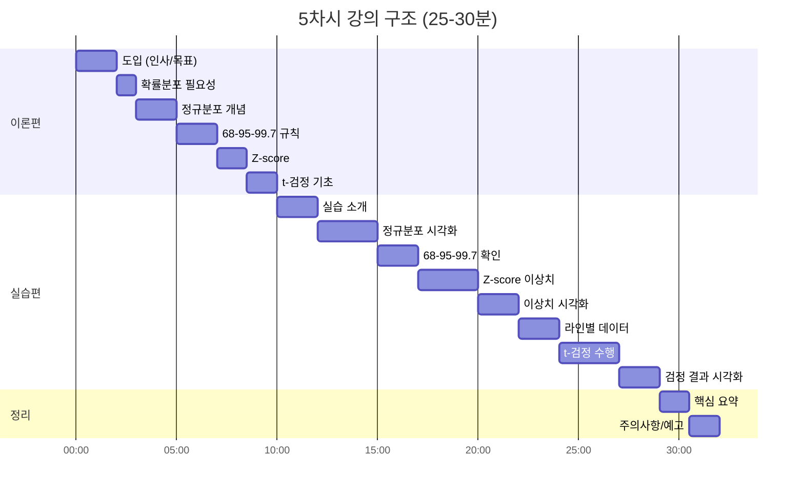

# [5차시] 확률분포와 품질 검정 - 다이어그램

## 1. 확률분포가 필요한 이유



## 2. 정규분포 구조



## 3. 68-95-99.7 규칙



## 4. Z-score 계산



## 5. Z-score 해석 기준



## 6. 가설검정 구조



## 7. p-value 해석



## 8. t-검정 과정



## 9. 이상치 탐지 워크플로우

```mermaid
flowchart TD
    A[일별 생산 데이터] --> B[기술통계 계산]
    B --> C["평균, 표준편차"]

    C --> D[Z-score 계산]
    D --> E{|Z| > 2?}

    E --> |예| F[이상치 플래그]
    E --> |아니오| G[정상 데이터]

    F --> H[원인 조사]
    H --> I["설비 이상?<br>작업자 실수?<br>원자재 문제?"]

    I --> J[조치 및 기록]
```

## 10. 품질 검정 판단 기준

```mermaid
flowchart TD
    subgraph 개별값["개별 데이터 검정"]
        A[Z-score 계산] --> B{|Z| > 2?}
        B --> |예| C[이상치]
        B --> |아니오| D[정상]
    end

    subgraph 그룹비교["그룹 간 비교"]
        E[t-검정] --> F{p < 0.05?}
        F --> |예| G[유의미한 차이]
        F --> |아니오| H[차이 없음]
    end

    I[품질 데이터] --> 개별값
    I --> 그룹비교
```

## 11. 정규분포와 품질 관리 기준



## 12. 강의 구조


