# [6차시] 상관분석과 예측의 기초 - 다이어그램

## 1. 상관분석이 필요한 이유

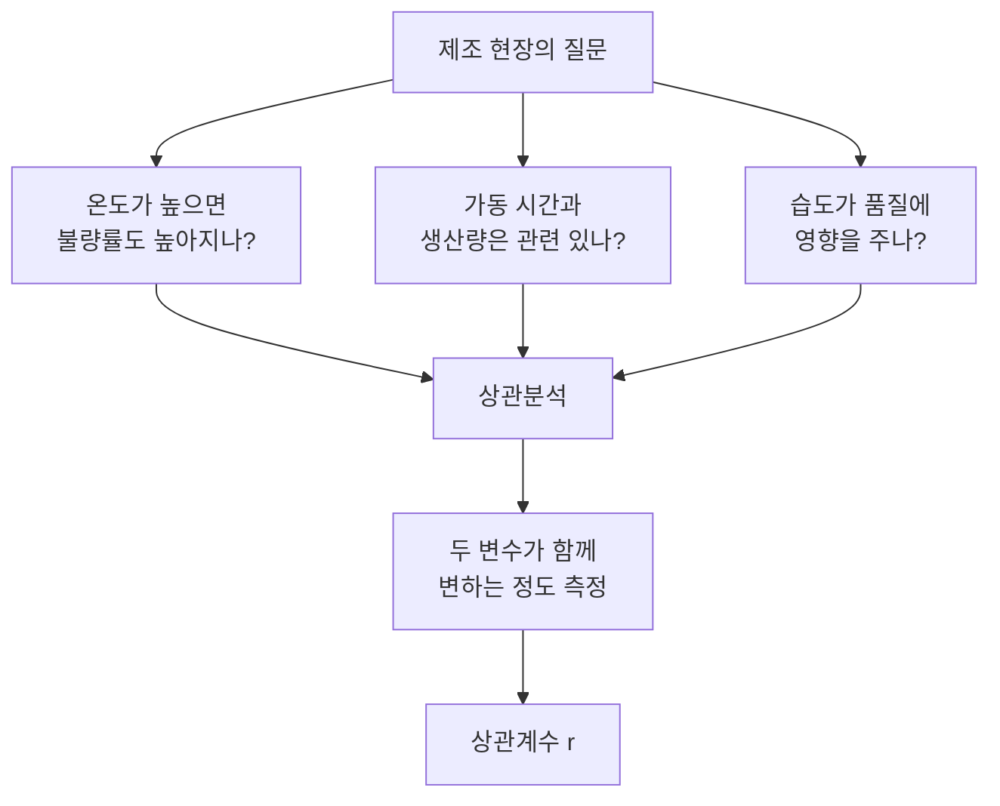

## 2. 상관계수 해석

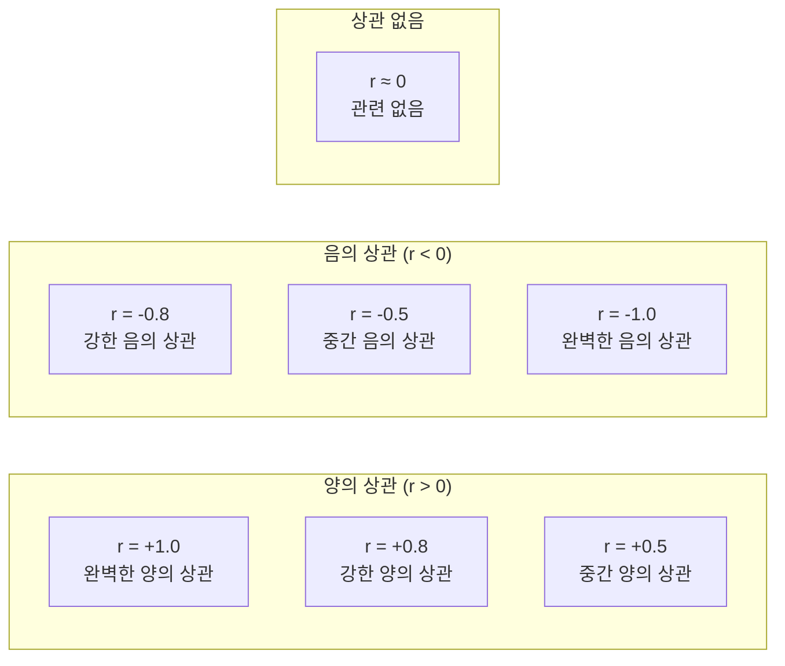

## 3. 상관계수 강도 기준

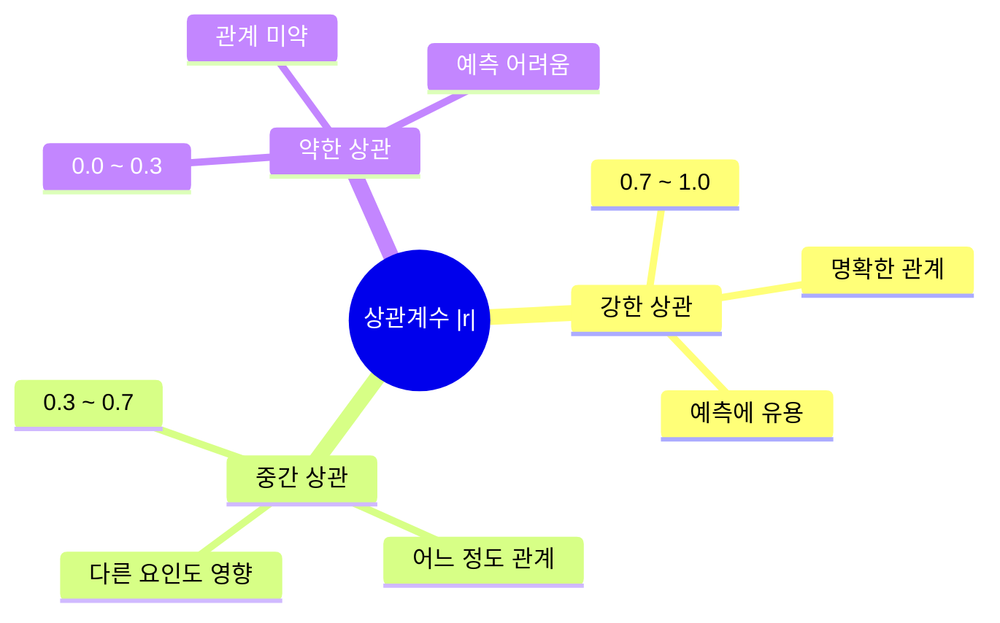

## 4. 상관관계 vs 인과관계

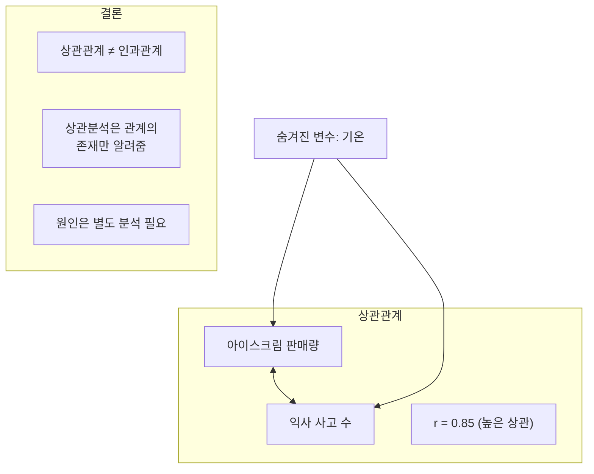

## 5. 선형회귀 개념

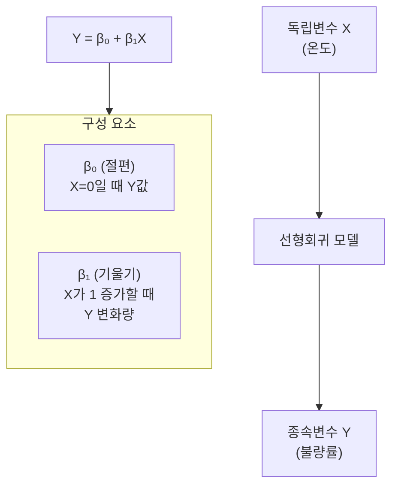

## 6. 최소제곱법 (OLS)

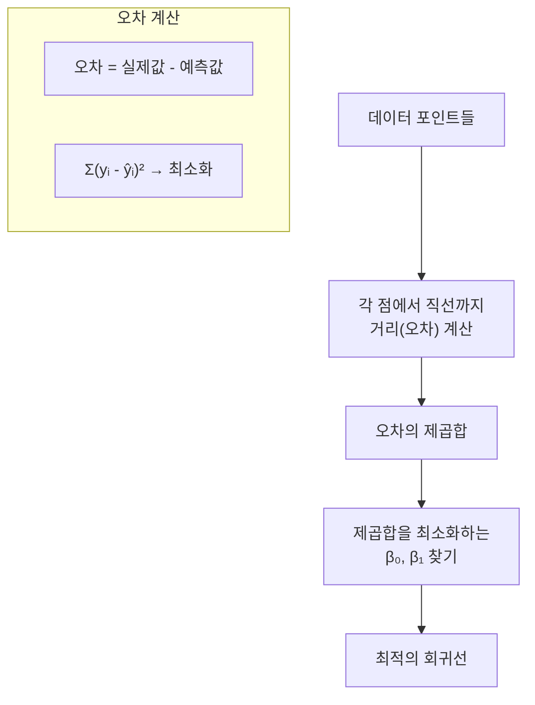

## 7. R² (결정계수) 해석

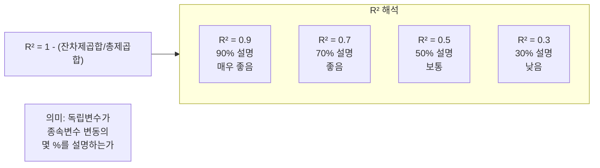

## 8. sklearn 선형회귀 흐름

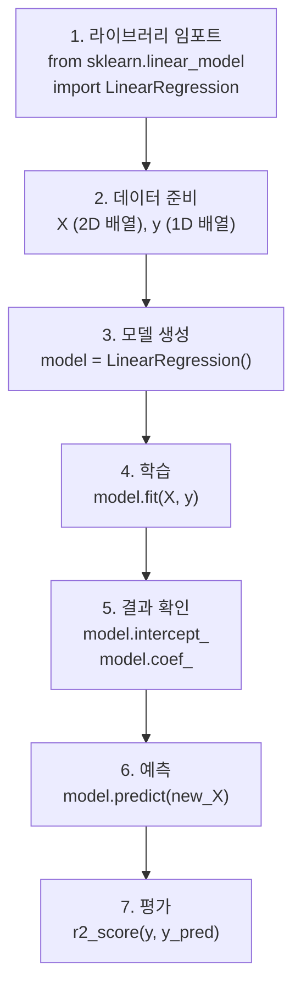

## 9. 회귀선 시각화

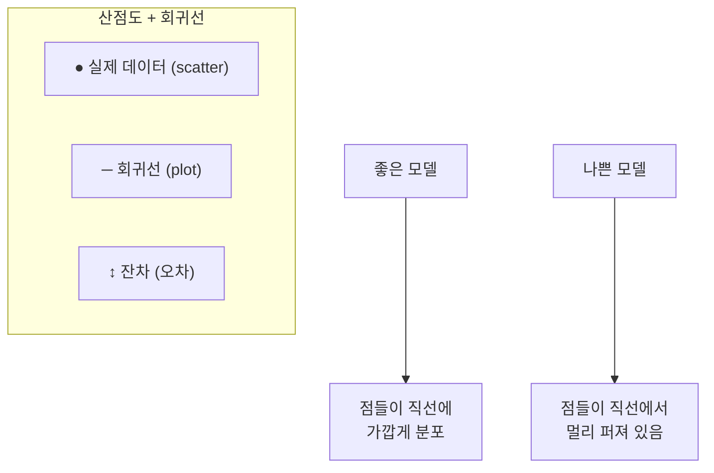

## 10. 예측 활용

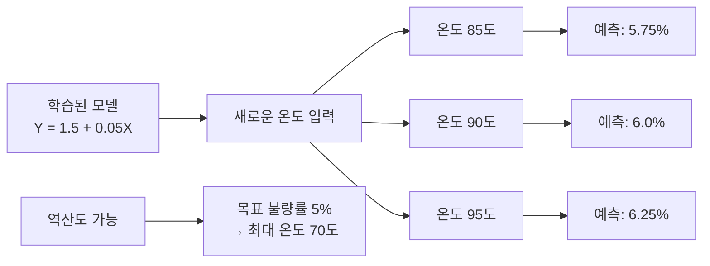

## 11. 상관분석 vs 회귀분석

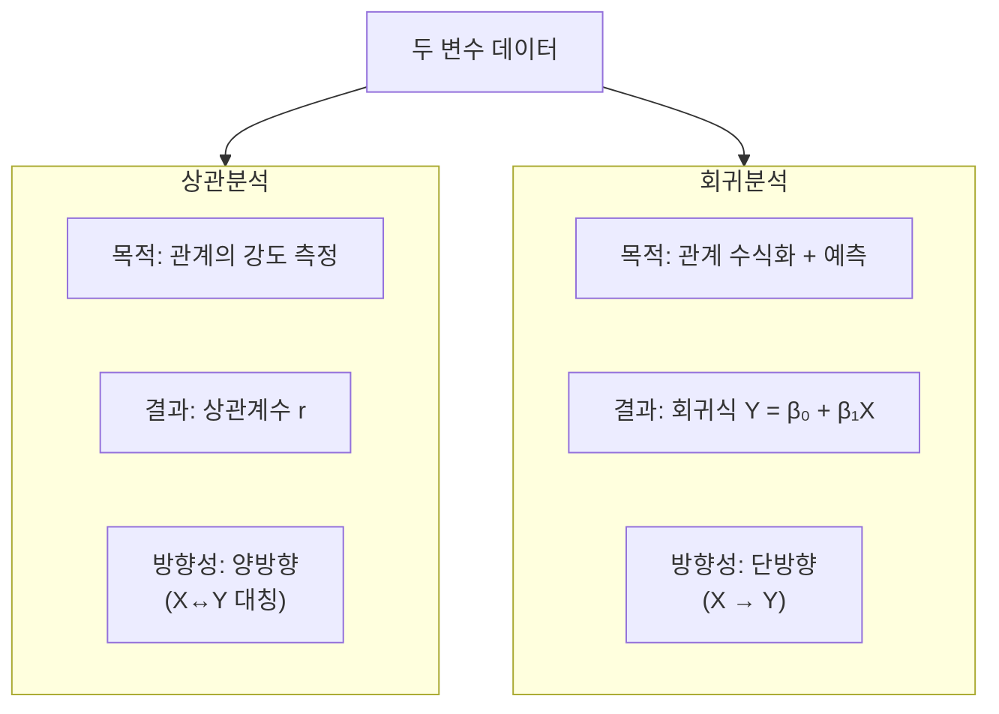

## 12. 강의 구조

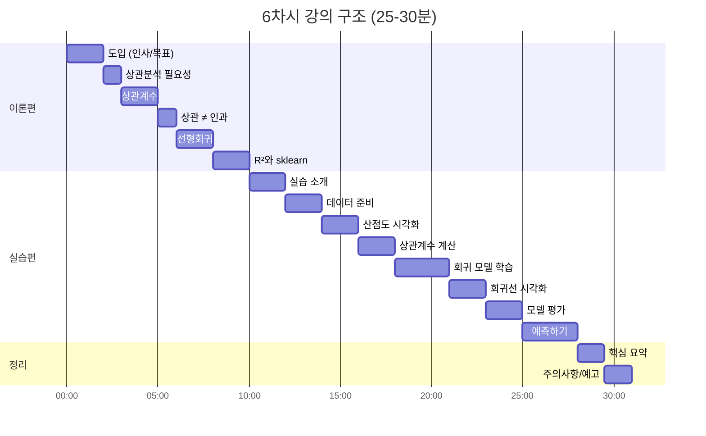
