# [8차시] 제조 데이터 전처리 (2) - 다이어그램

## 1. 전처리 워크플로우 (Part 2)

## 2. 스케일링이 필요한 이유

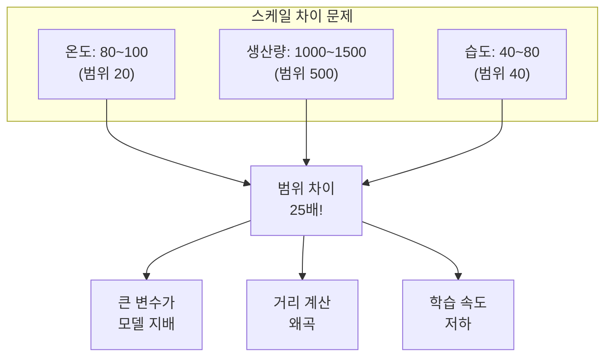

## 3. 표준화 (StandardScaler)

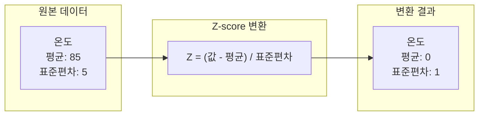

## 4. 정규화 (MinMaxScaler)

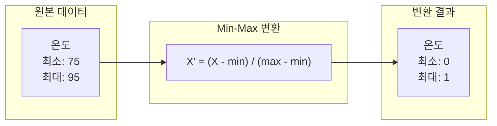

## 5. 스케일링 방법 비교

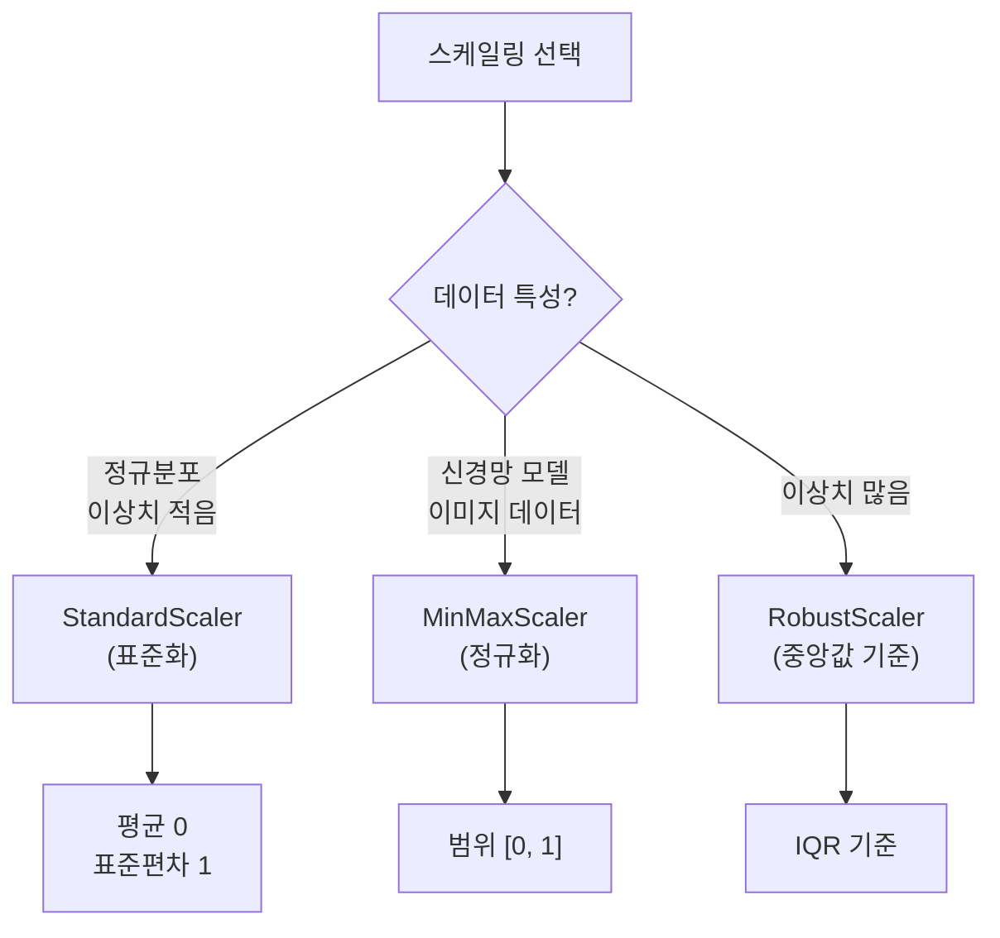

## 6. 범주형 데이터의 문제

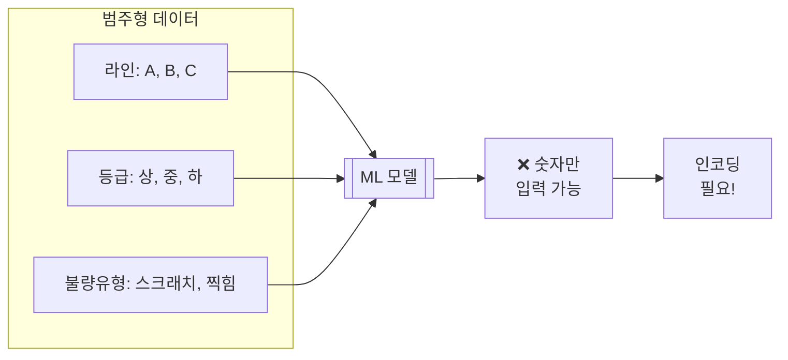

## 7. 레이블 인코딩

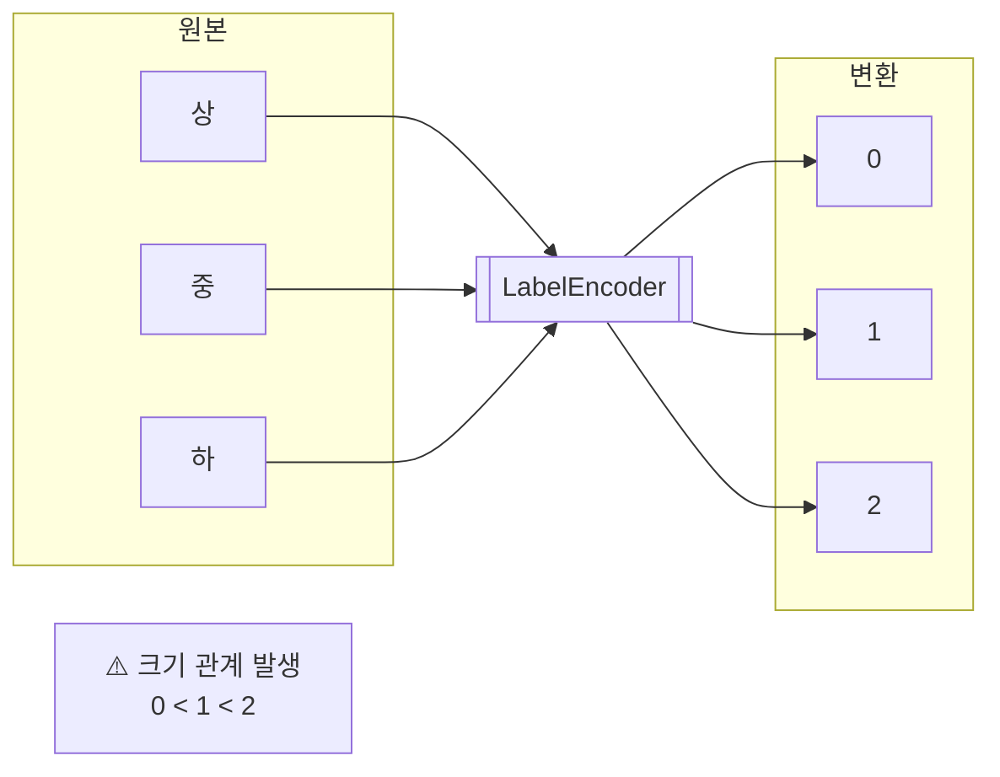

## 8. 원-핫 인코딩

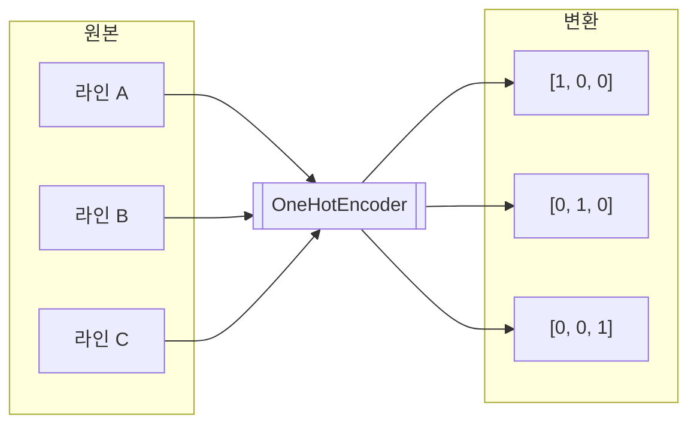

## 9. 인코딩 선택 가이드

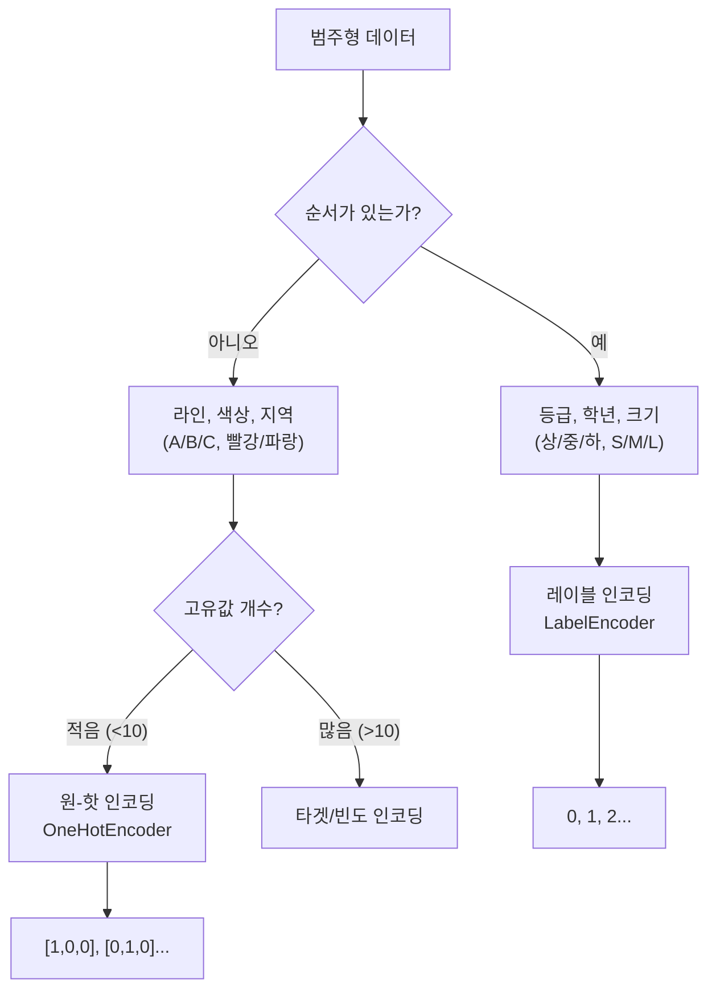

## 10. fit과 transform의 차이

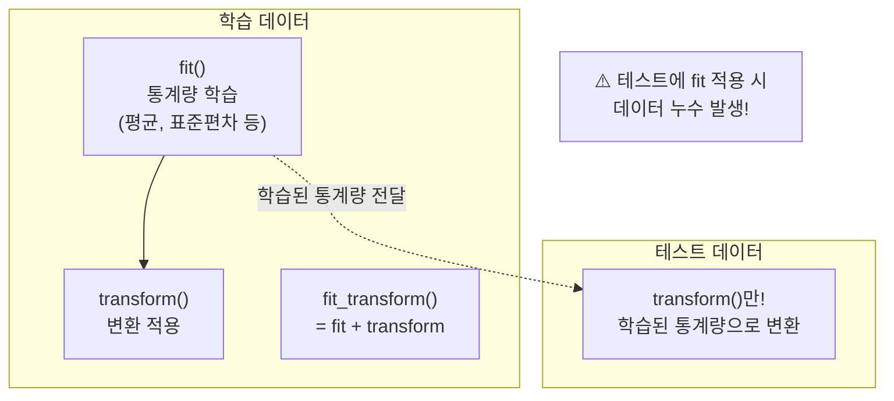

## 11. 데이터 누수 방지

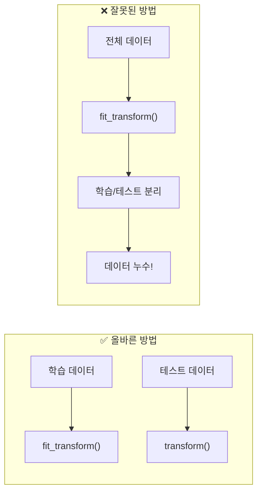

## 12. 종합 전처리 파이프라인

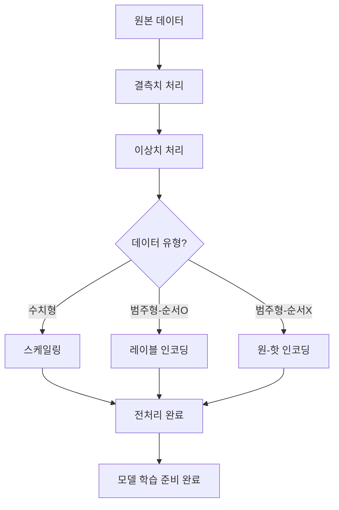

## 13. 강의 구조

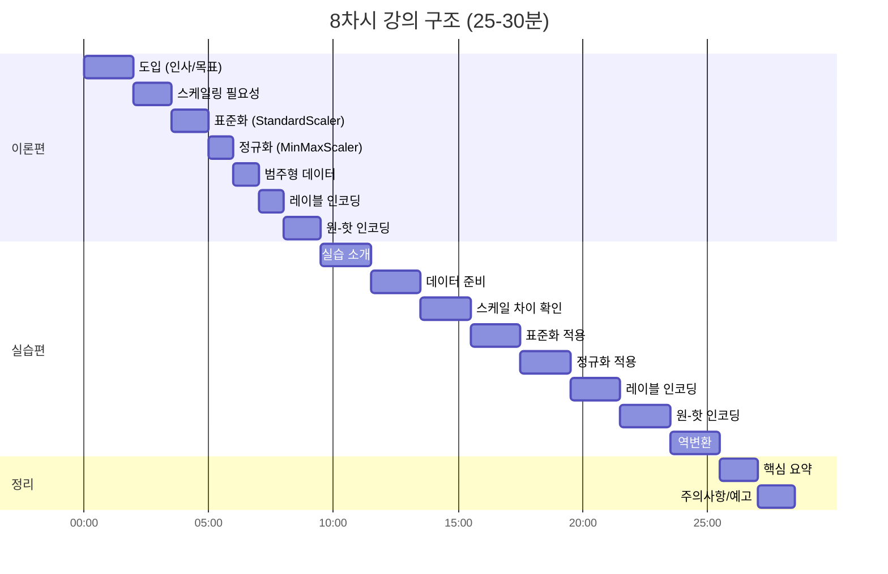
