# [10차시] 머신러닝 소개와 문제 유형 - 다이어그램

## 1. 전통적 프로그래밍 vs 머신러닝

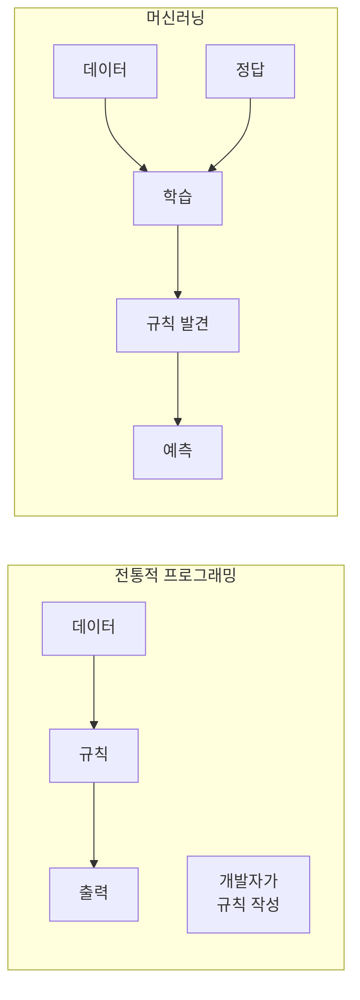

## 2. 머신러닝 핵심 개념

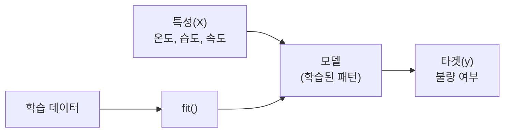

## 3. 머신러닝의 3가지 유형

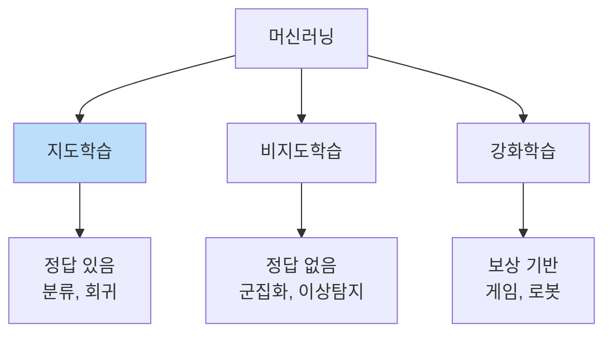

## 4. 지도학습: 분류 vs 회귀

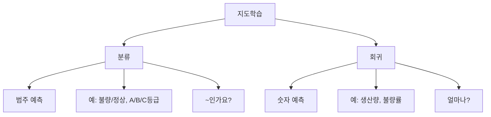

## 5. 분류 문제 예시

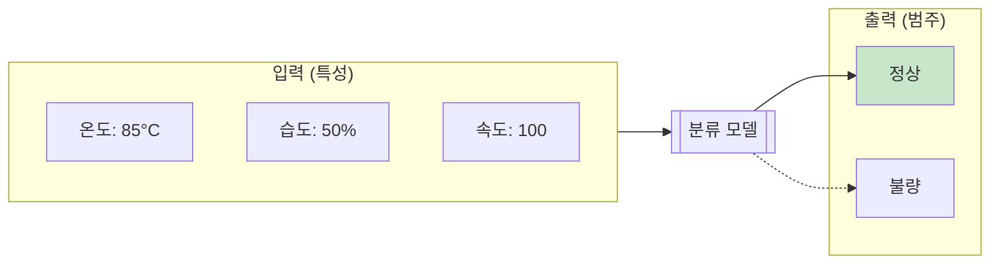

## 6. 회귀 문제 예시

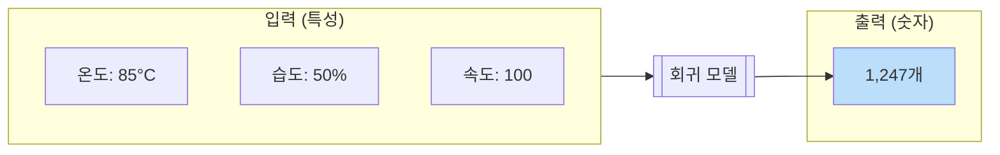

## 7. 분류 vs 회귀 구분법

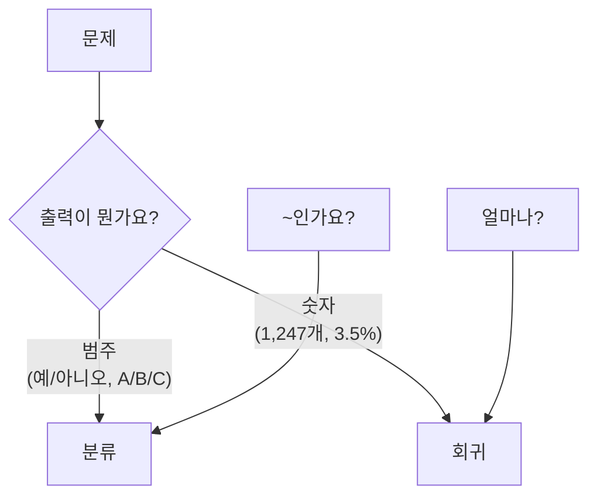

## 8. sklearn 기본 패턴

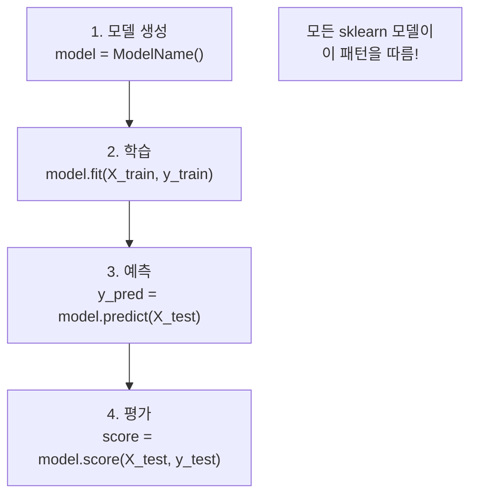

## 9. 학습/테스트 분리

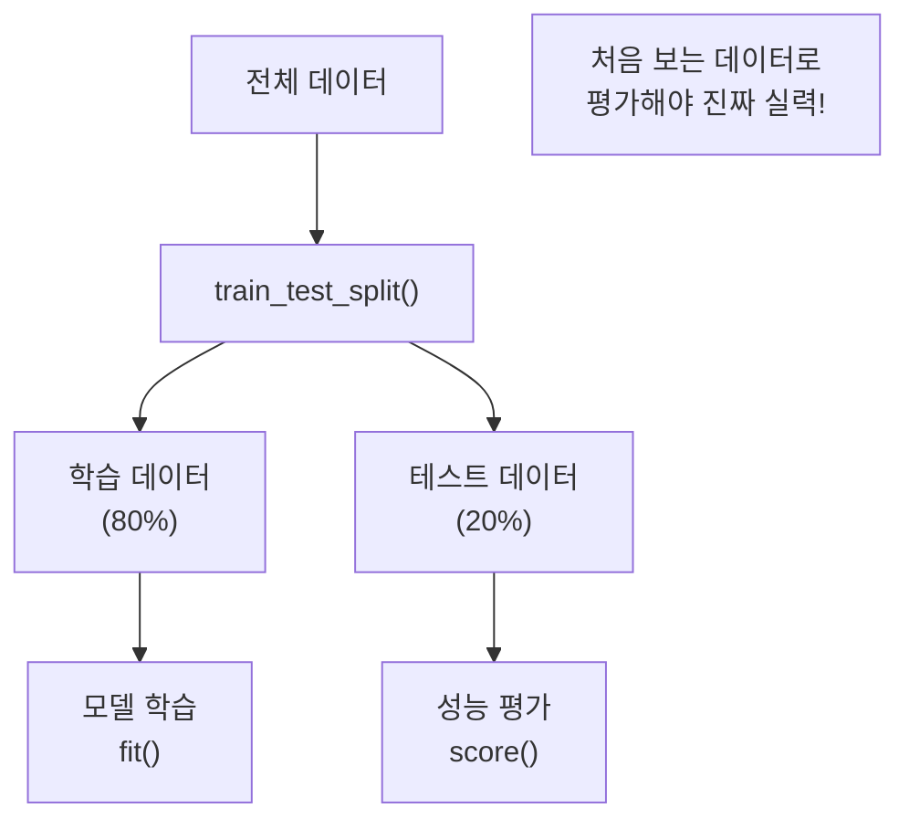

## 10. 데이터 분리 중요성

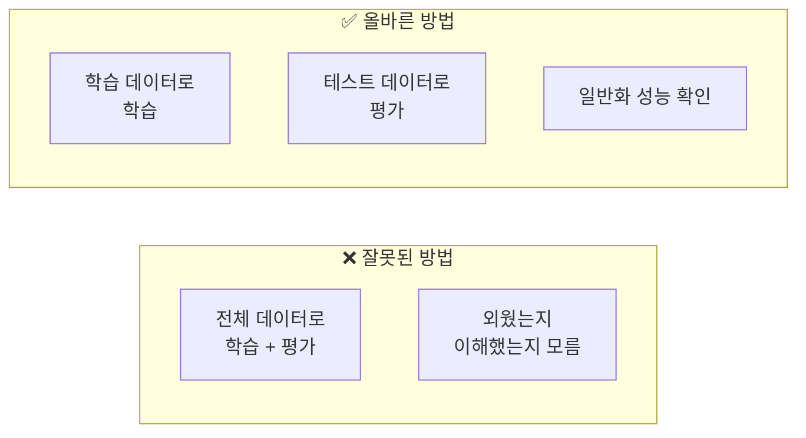

## 11. 머신러닝 전체 워크플로우

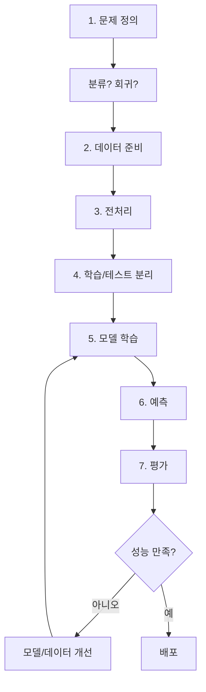

## 12. 제조 현장 문제 유형

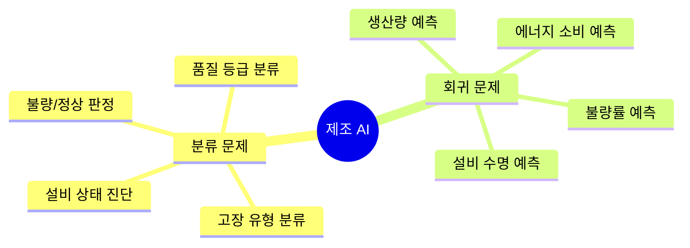

## 13. 강의 구조

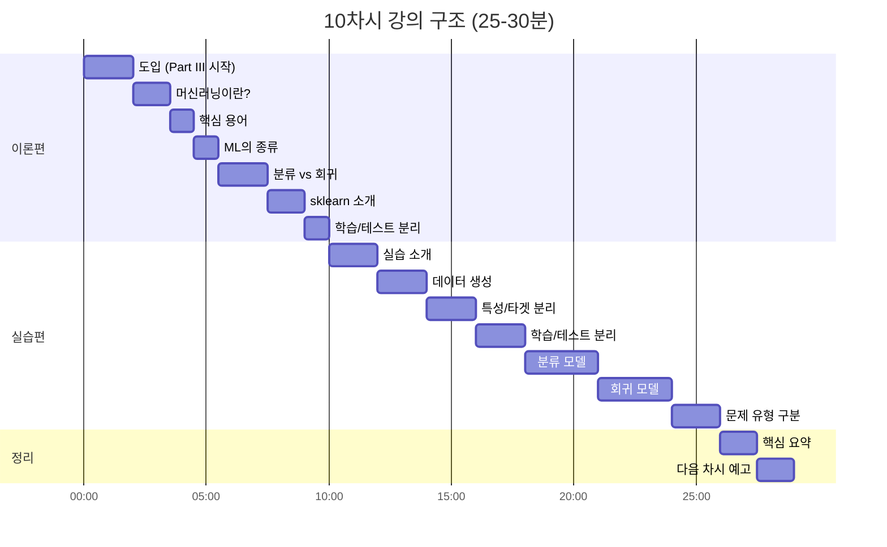

## 14. Part II → Part III 연결

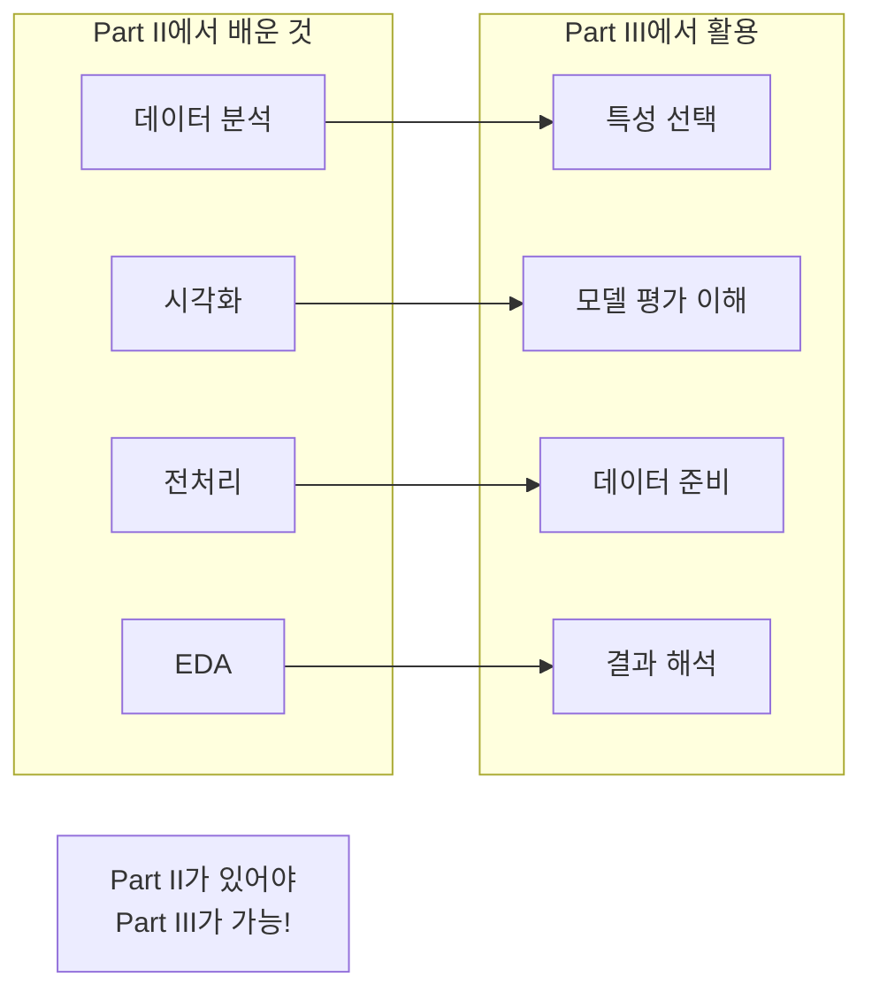
