# [11차시] 분류 모델 (1): 의사결정나무 - 다이어그램

## 1. 의사결정나무 개념

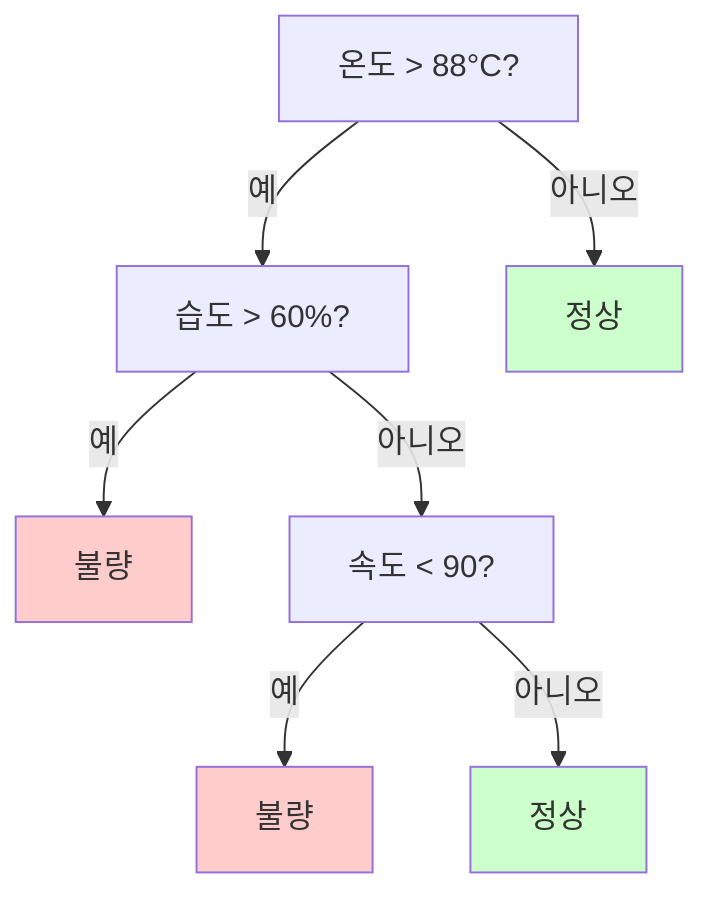

## 2. 트리 구조 용어

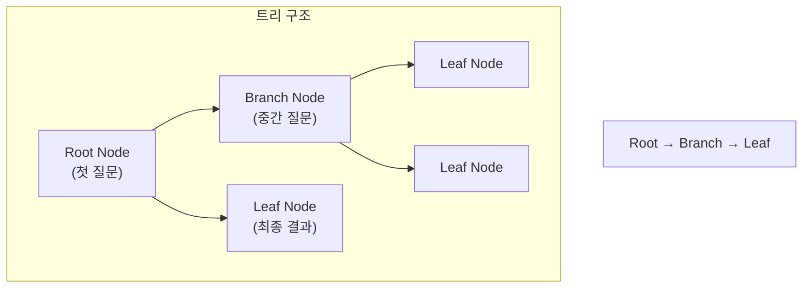

## 3. 좋은 질문 vs 나쁜 질문

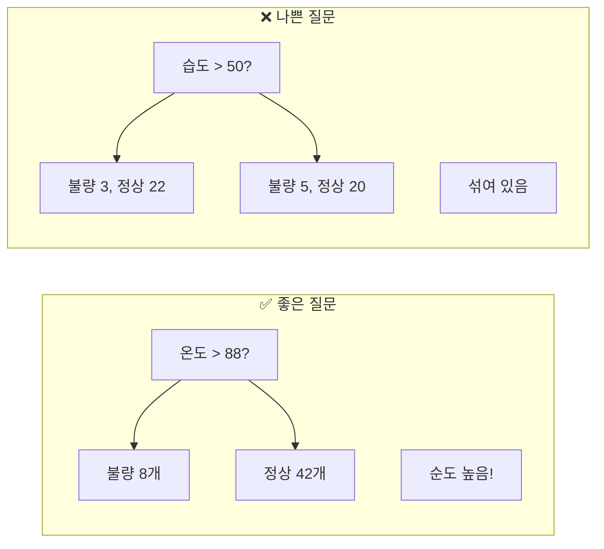

## 4. 정보 이득

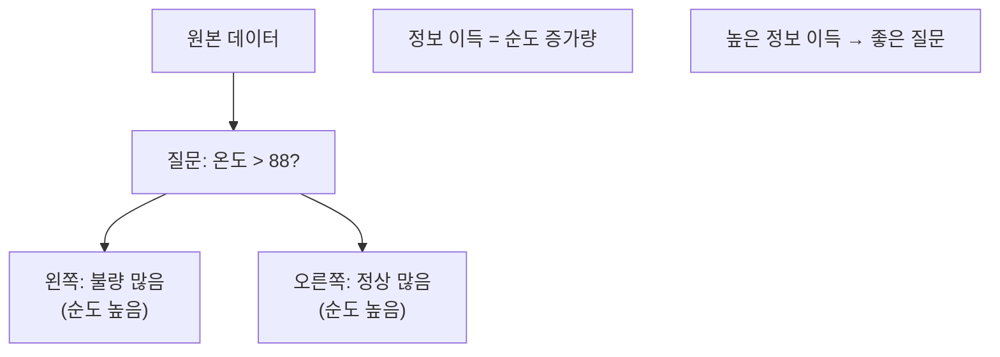

## 5. sklearn 사용 흐름

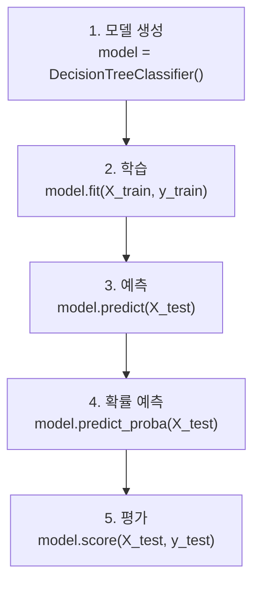

## 6. predict vs predict_proba

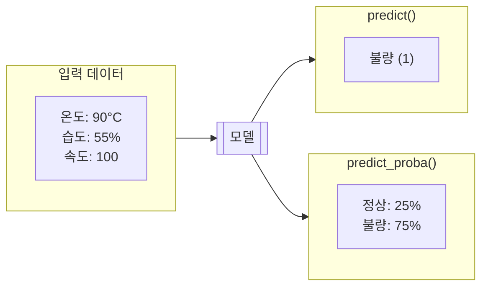

## 7. 과대적합 문제

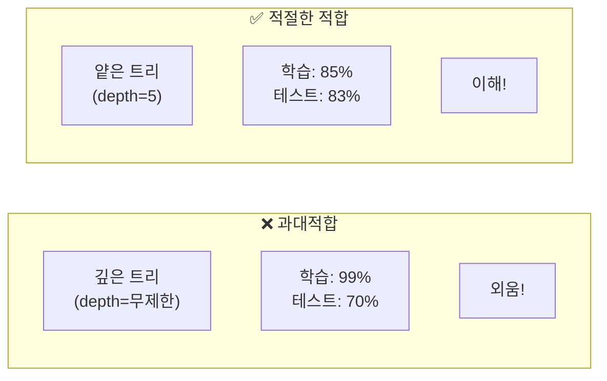

## 8. max_depth 효과

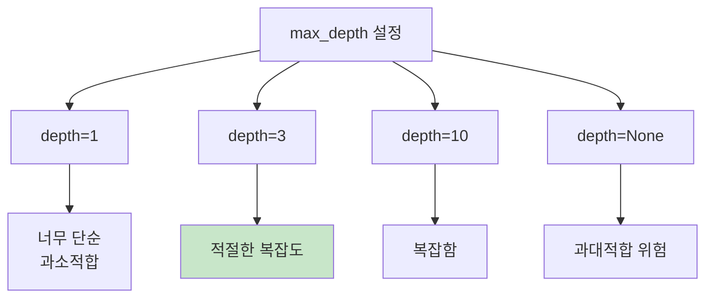

## 9. 학습/테스트 정확도 비교

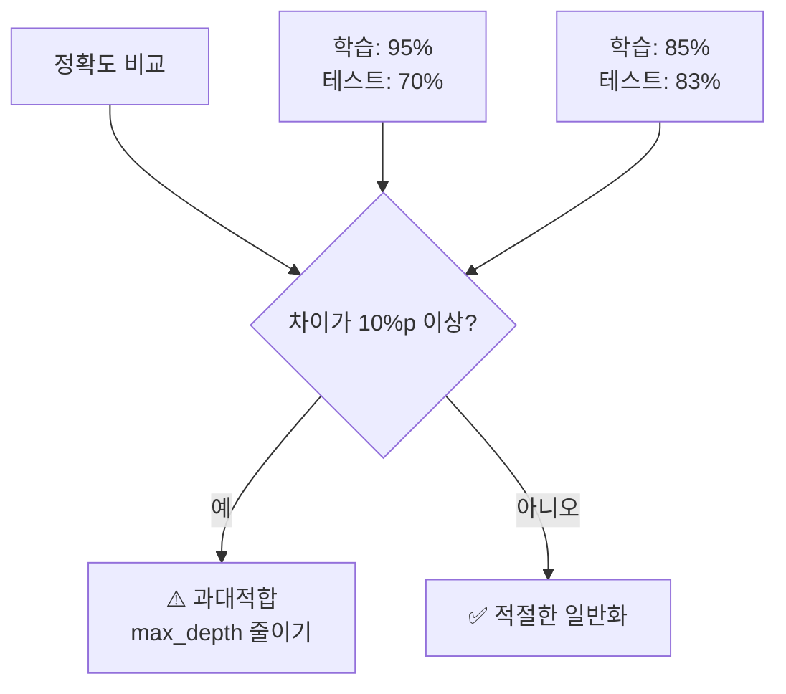

## 10. 특성 중요도

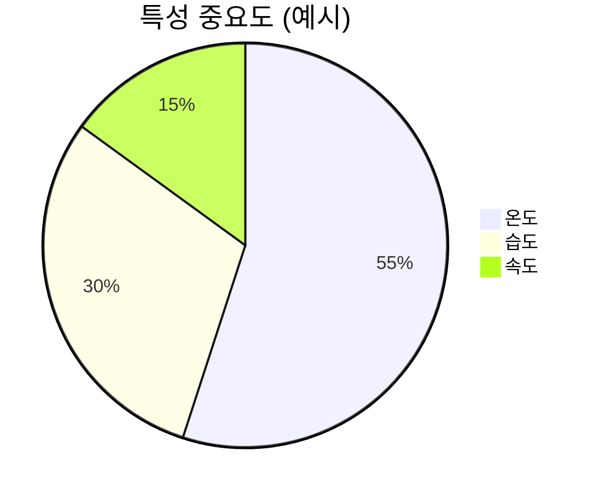

## 11. 의사결정나무 장단점

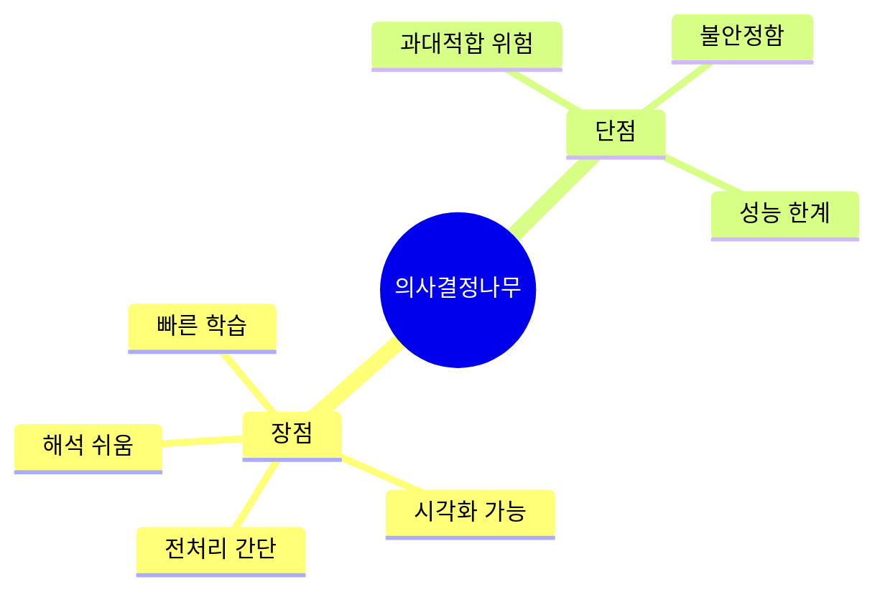

## 12. 전체 모델링 흐름

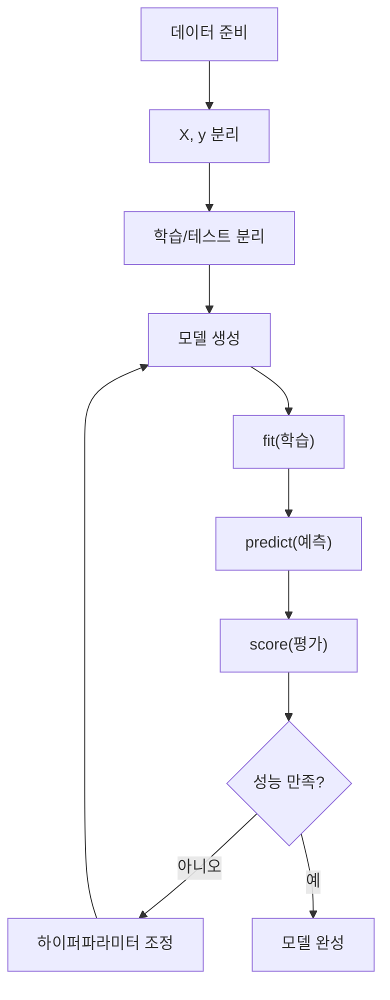

## 13. 강의 구조

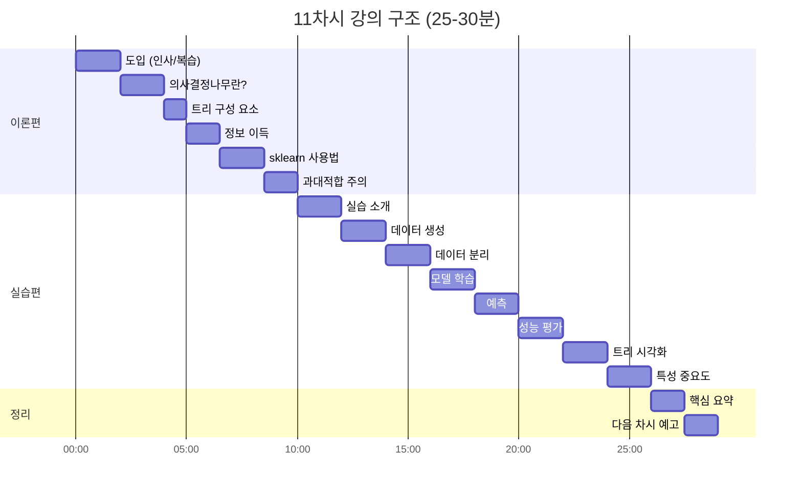

## 14. 의사결정나무 → 랜덤포레스트

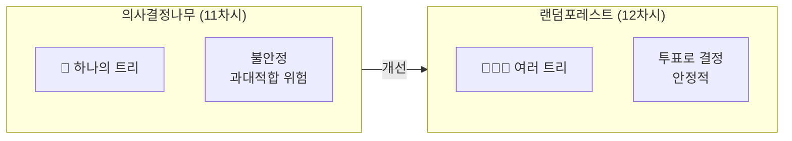
