# [12차시] 분류 모델 (2): 랜덤포레스트 - 다이어그램

## 1. 앙상블 학습 개념

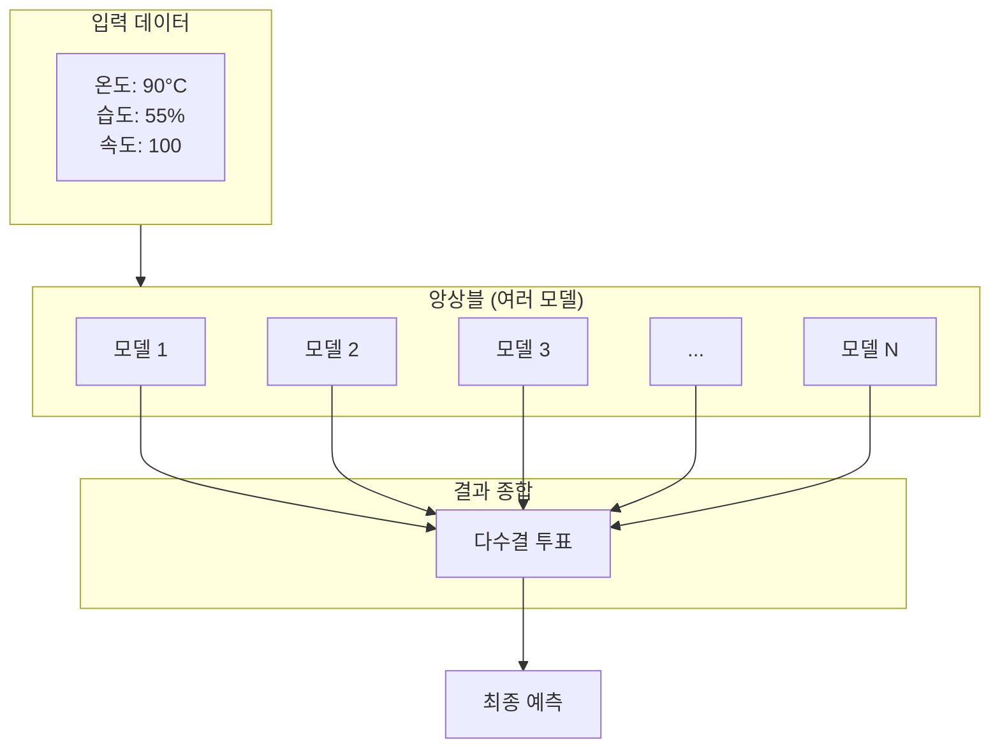

## 2. 랜덤포레스트 구조

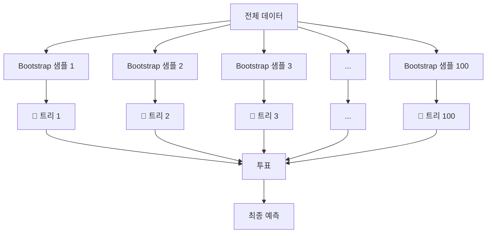

## 3. Bootstrap 샘플링

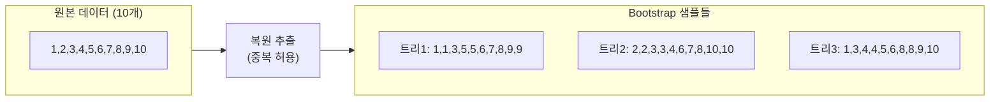

## 4. 특성 랜덤 선택

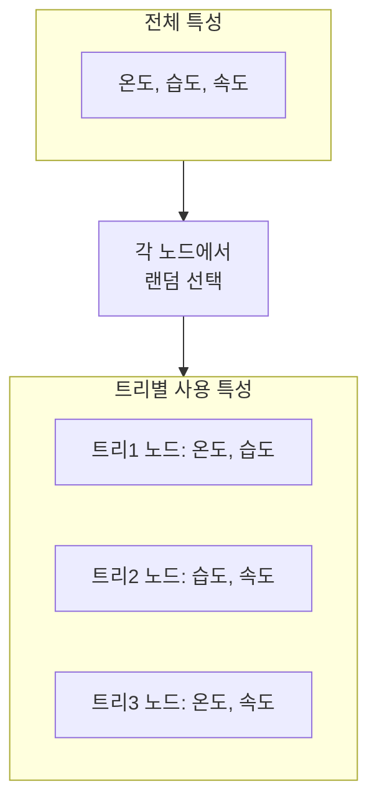

## 5. 다양성이 중요한 이유

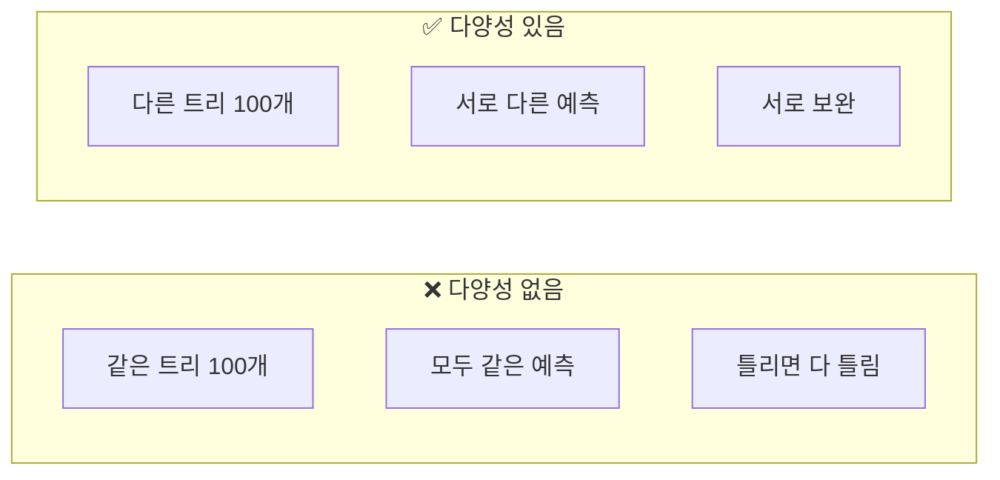

## 6. 투표 과정

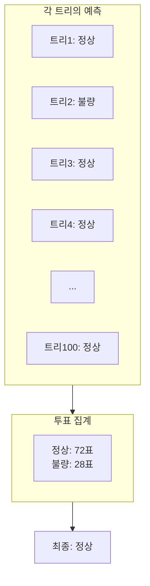

## 7. sklearn 사용 흐름

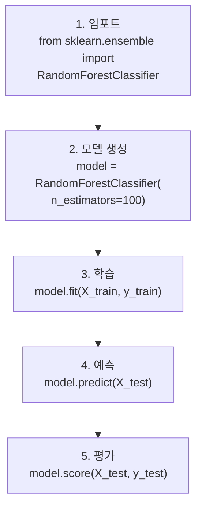

## 8. 주요 하이퍼파라미터

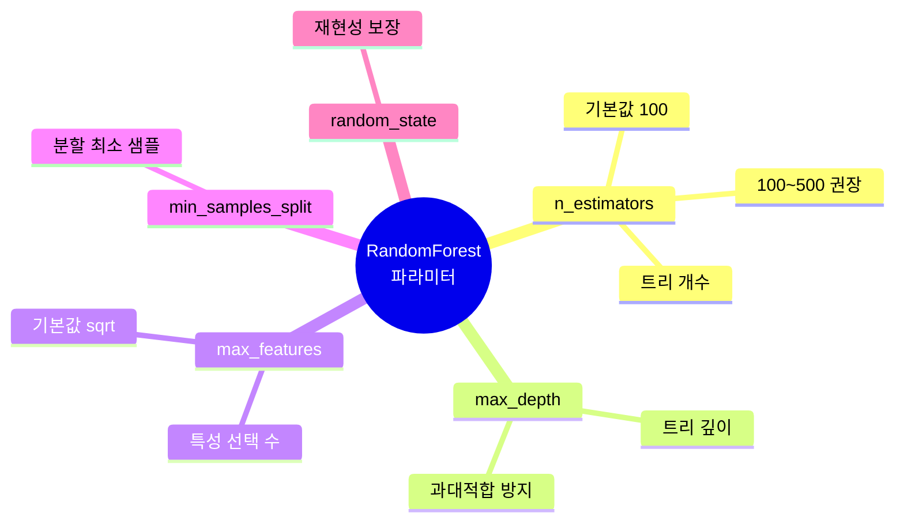

## 9. 의사결정나무 vs 랜덤포레스트

## 10. 특성 중요도 분석

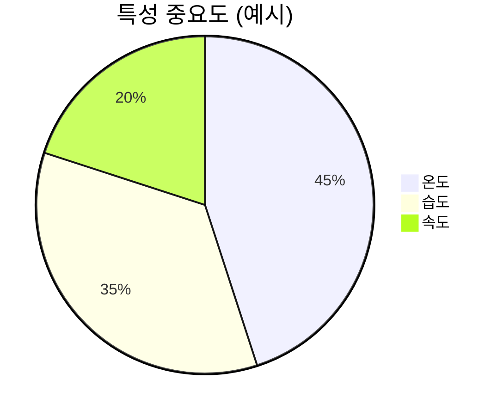

## 11. n_estimators에 따른 성능

## 12. OOB (Out-of-Bag) 점수

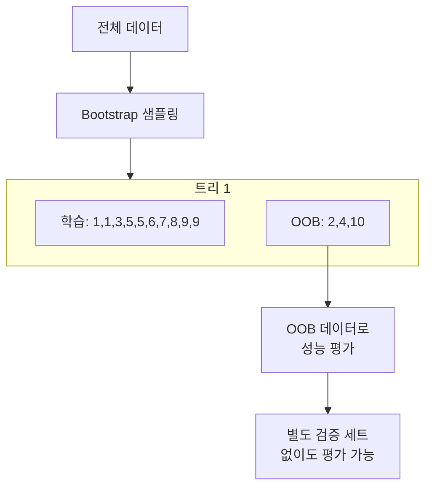

## 13. 랜덤포레스트 장단점

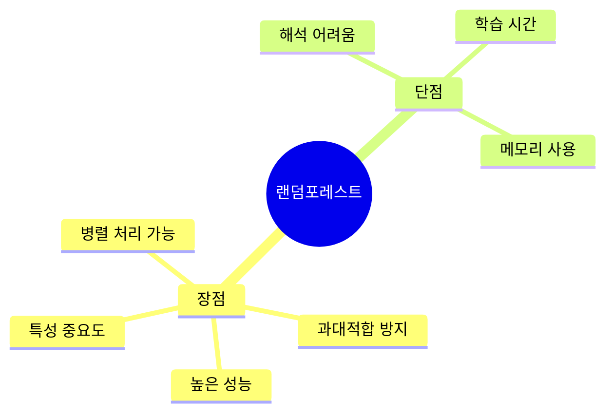

## 14. 강의 구조

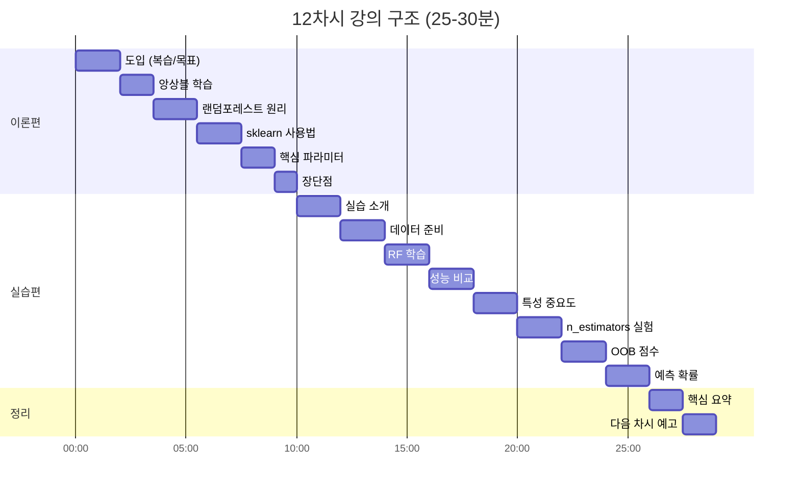

## 15. 모델 선택 가이드

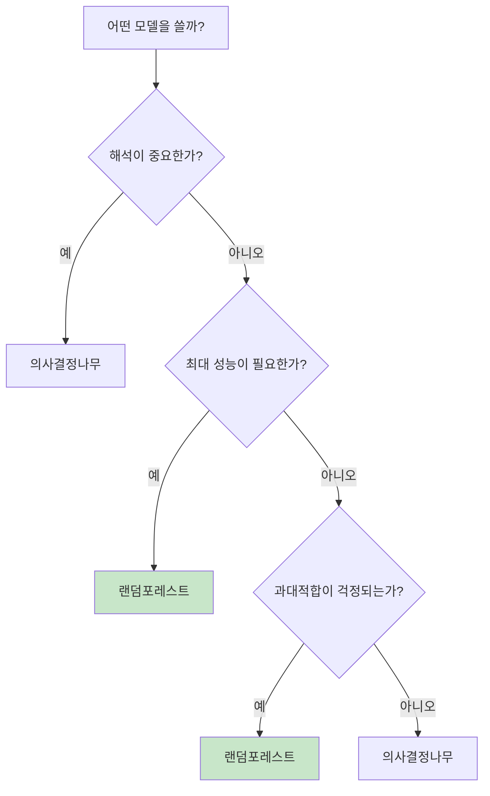
