# [15차시] 모델 설정값 최적화 - 다이어그램

## 1. 파라미터 vs 하이퍼파라미터

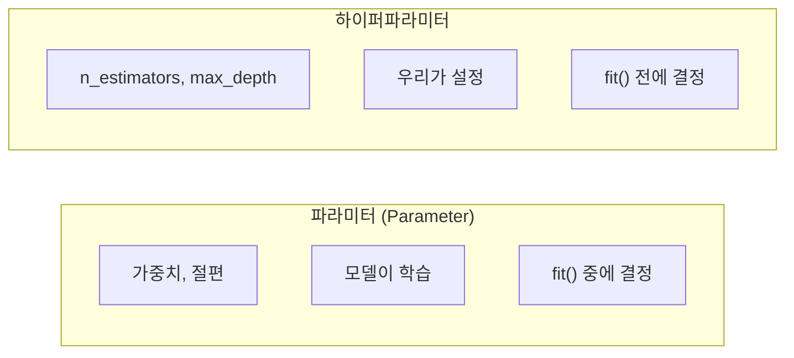

## 2. 하이퍼파라미터 영향

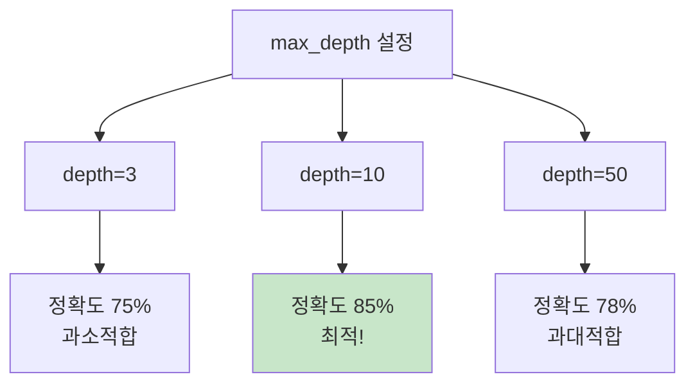

## 3. GridSearchCV 개념

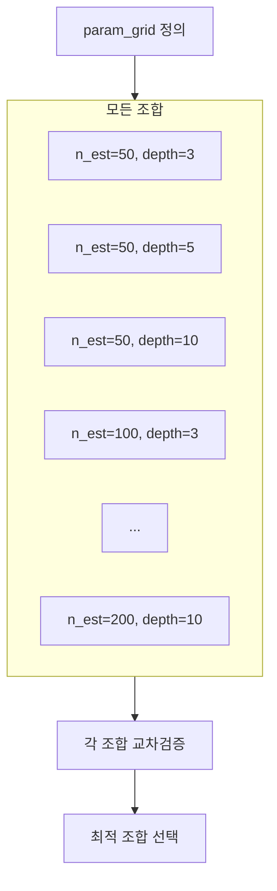

## 4. GridSearchCV 그리드

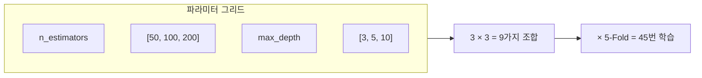

## 5. GridSearchCV 코드 흐름

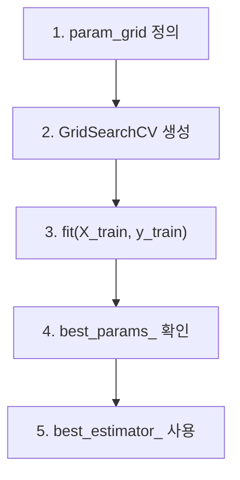

## 6. GridSearchCV 결과

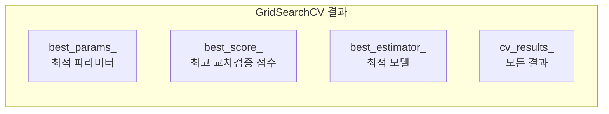

## 7. 조합 폭발 문제

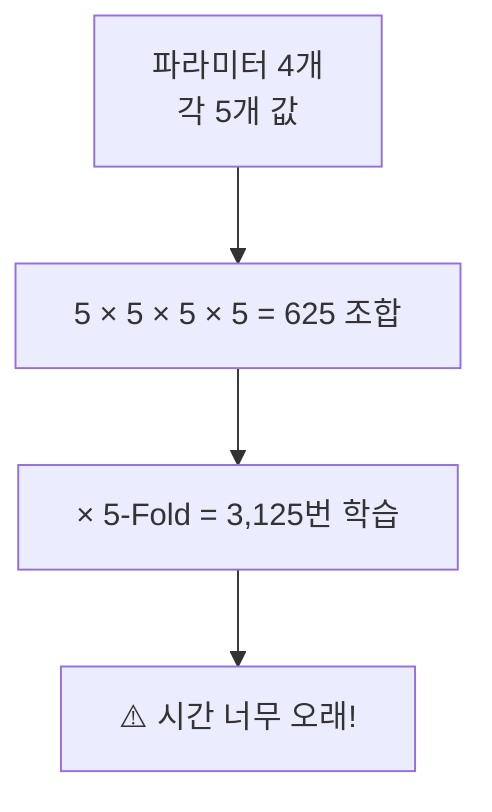

## 8. RandomizedSearchCV

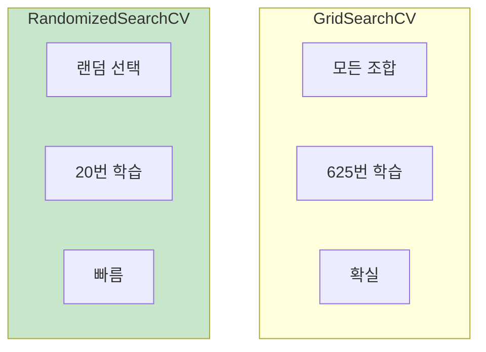

## 9. Grid vs Random 비교

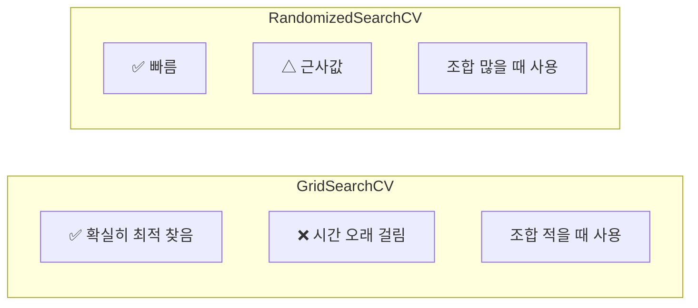

## 10. 추천 전략

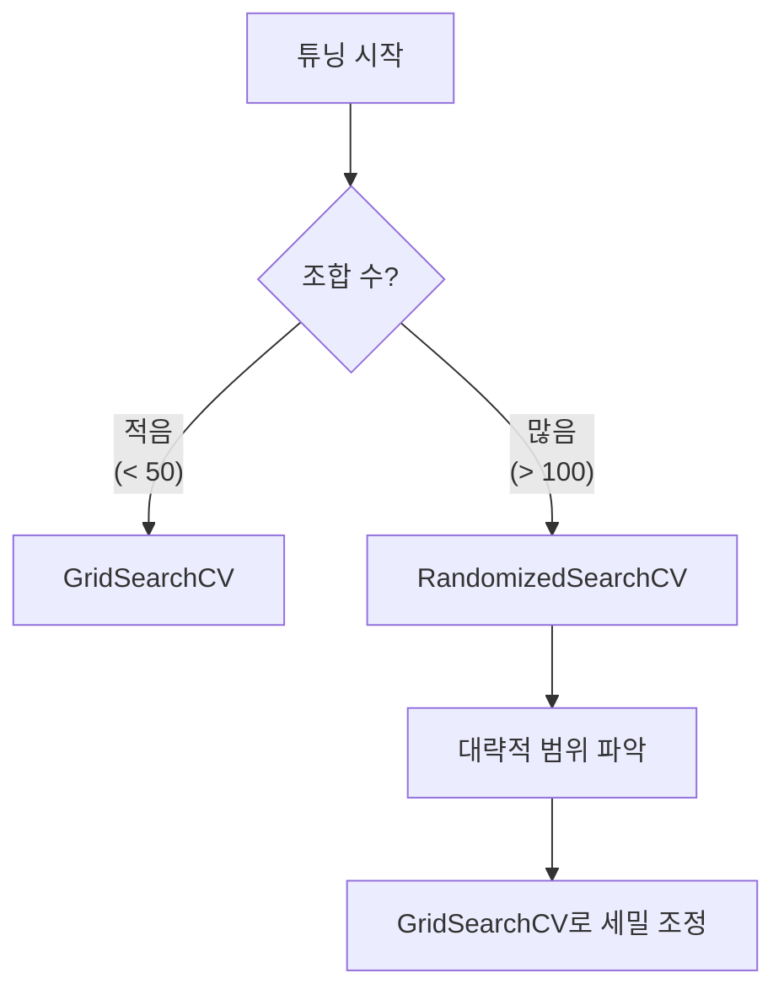

## 11. 랜덤포레스트 주요 하이퍼파라미터

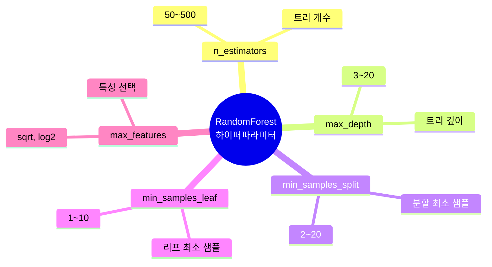

## 12. 튜닝 워크플로우

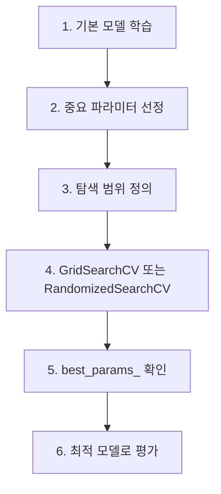

## 13. n_jobs 병렬 처리

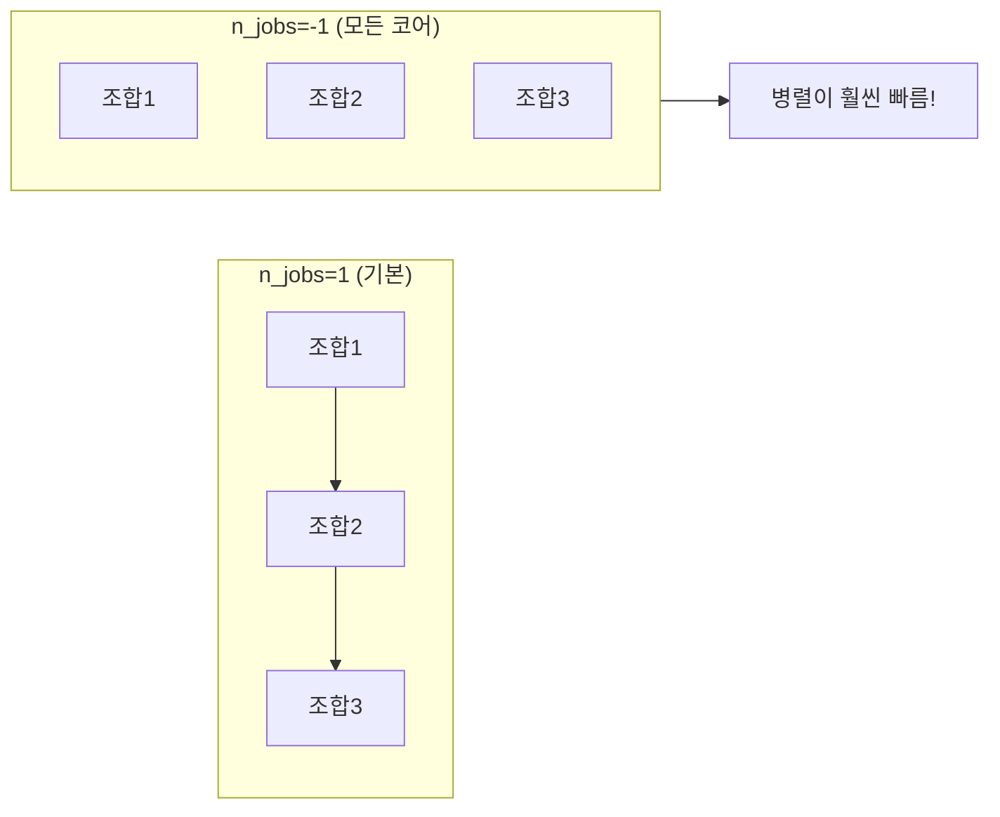

## 14. 강의 구조

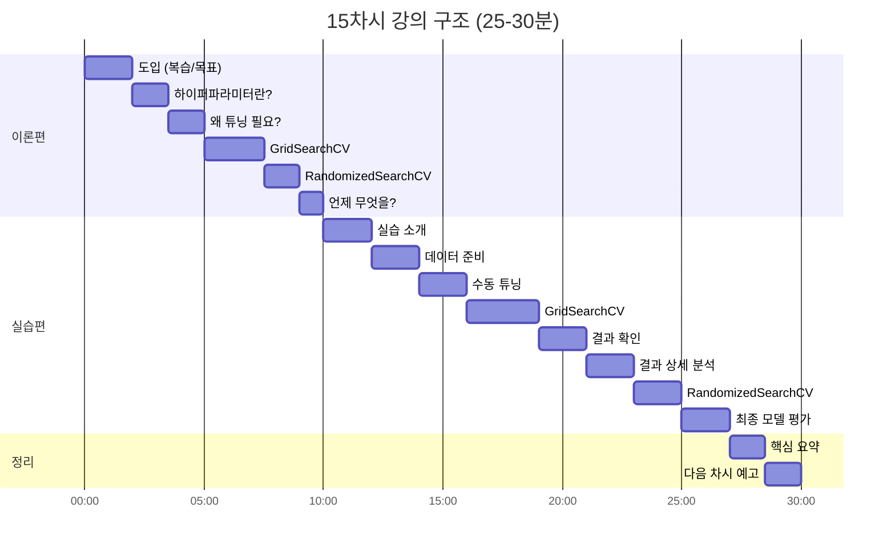

## 15. 핵심 요약

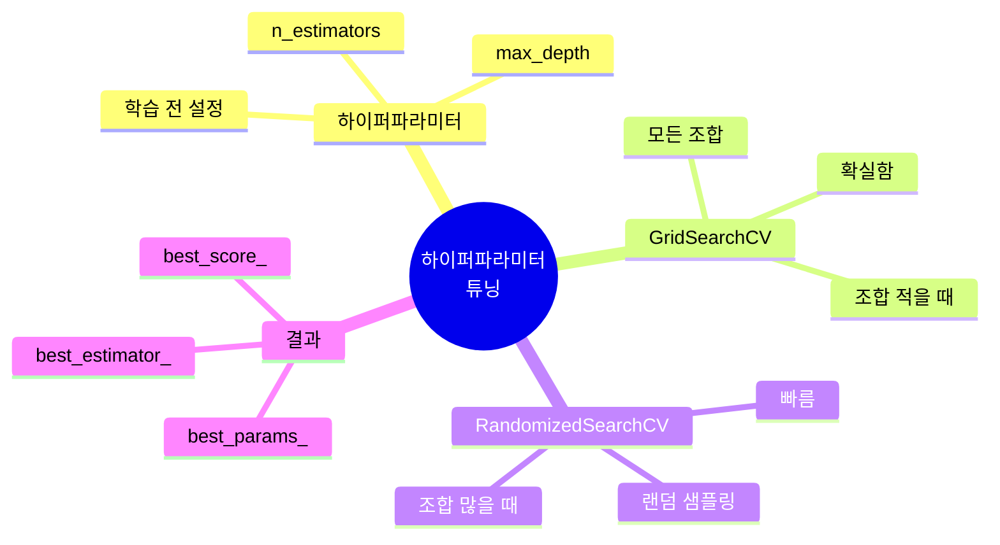

## 16. 실무 팁

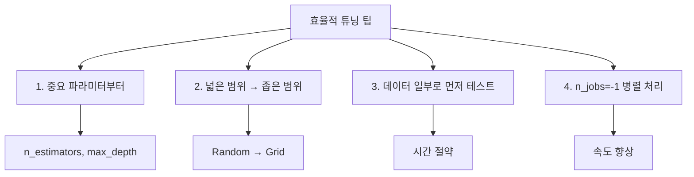
