# [17차시] 시계열 예측 모델 - 다이어그램

## 1. 시계열 예측 개념

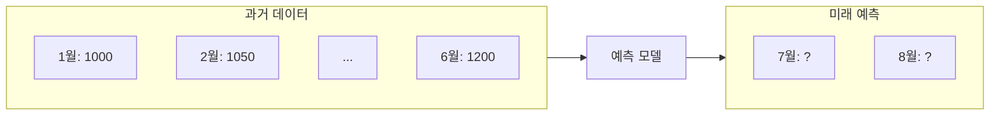

## 2. 제조 현장 예측 활용

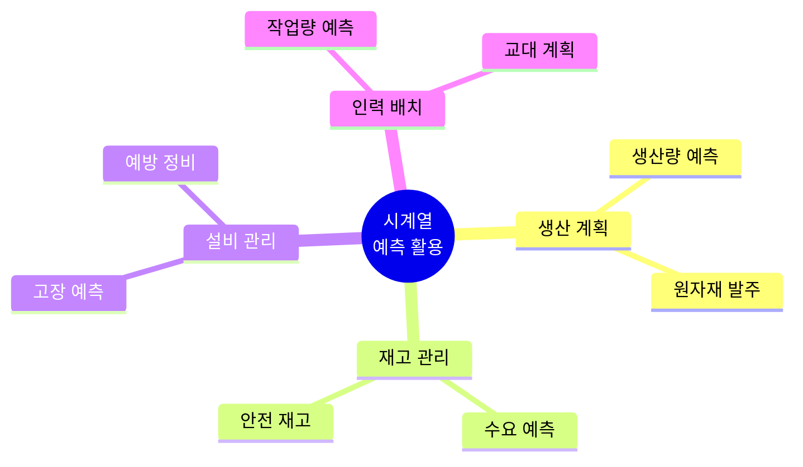

## 3. ML 기반 접근법

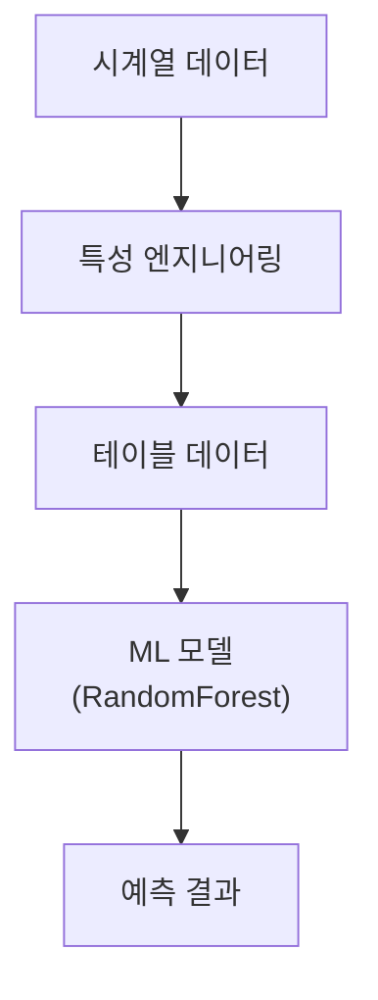

## 4. 특성 엔지니어링 종류

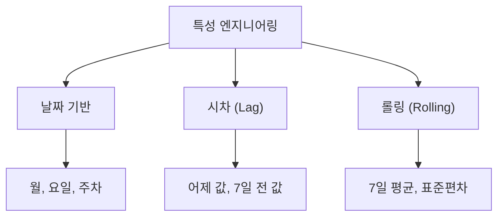

## 5. 시계열 → 테이블 변환

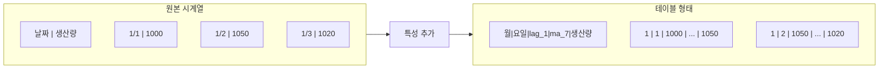

## 6. 시차 특성 (Lag)

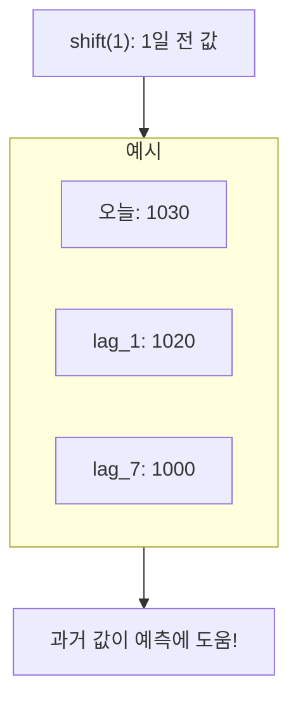

## 7. 롤링 특성 (Rolling)

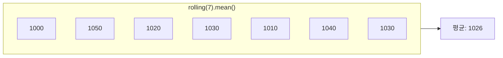

## 8. 데이터 누출 방지

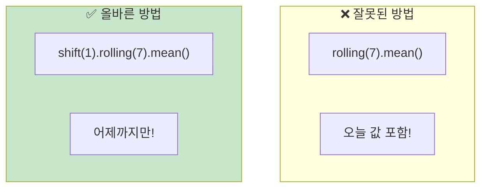

## 9. shift(1) 효과

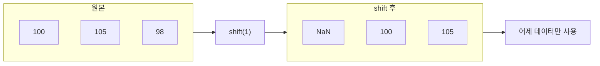

## 10. 시간 기준 분할

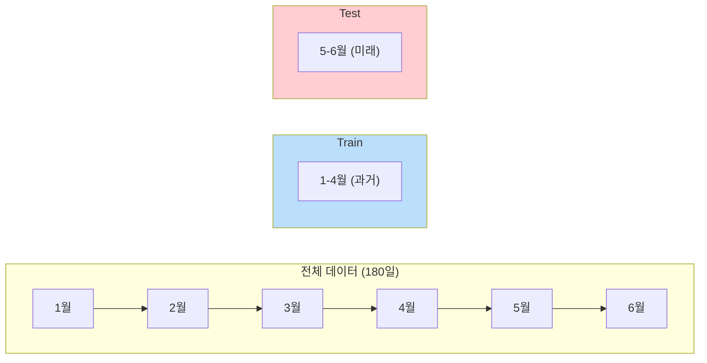

## 11. 잘못된 분할 vs 올바른 분할

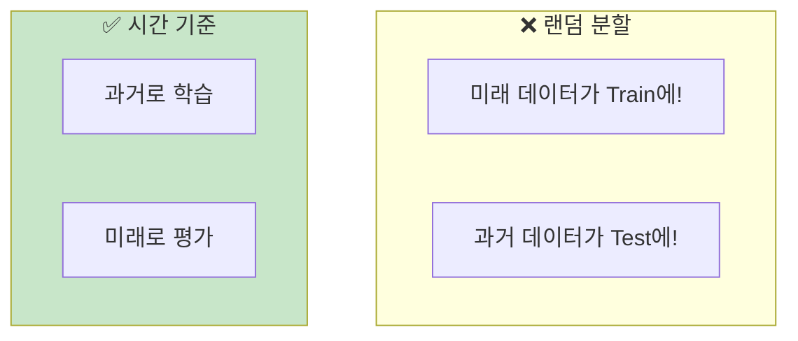

## 12. 예측 모델 학습 과정

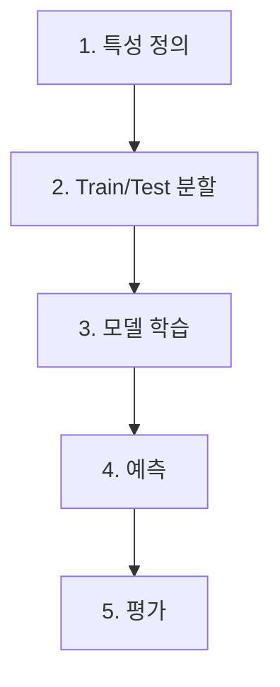

## 13. 평가 지표 비교

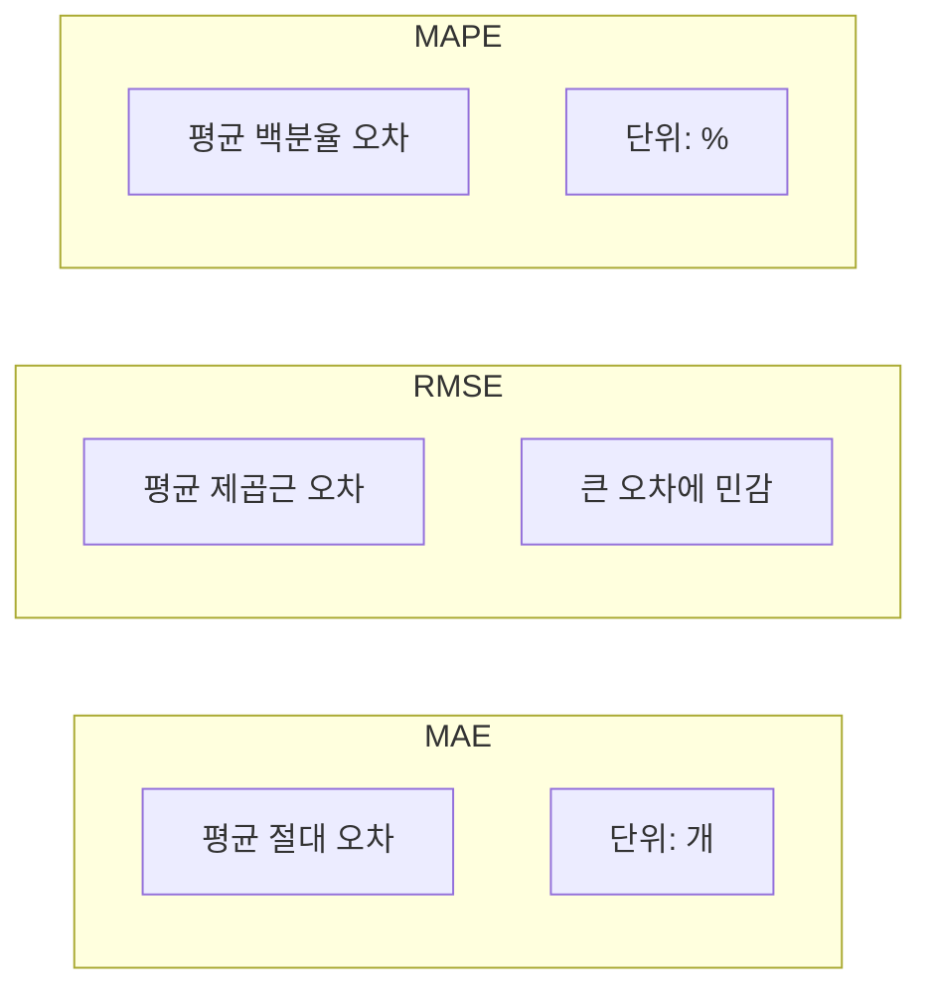

## 14. MAPE 해석

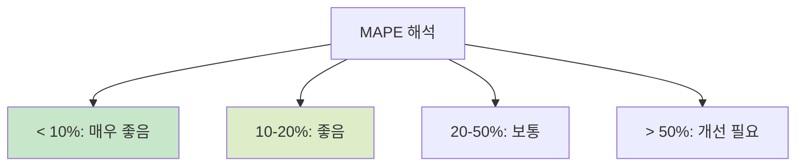

## 15. 특성 중요도

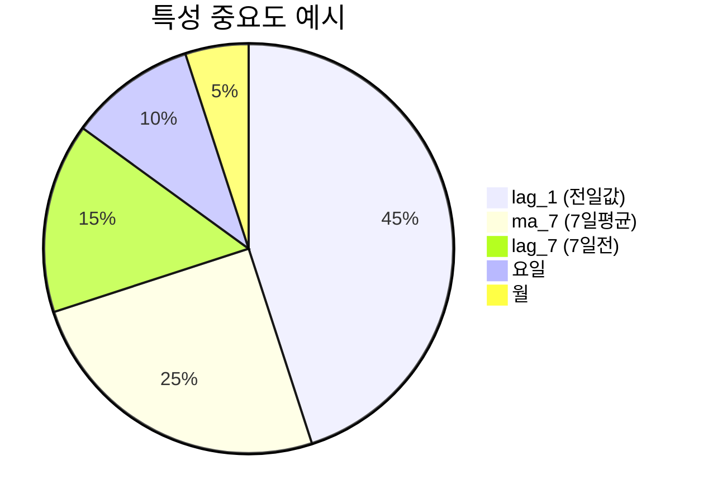

## 16. 전체 워크플로우

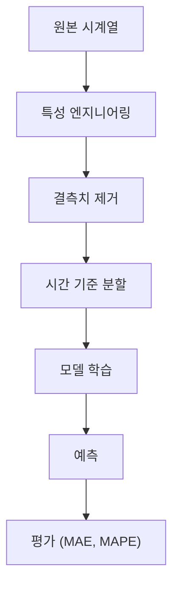

## 17. 강의 구조

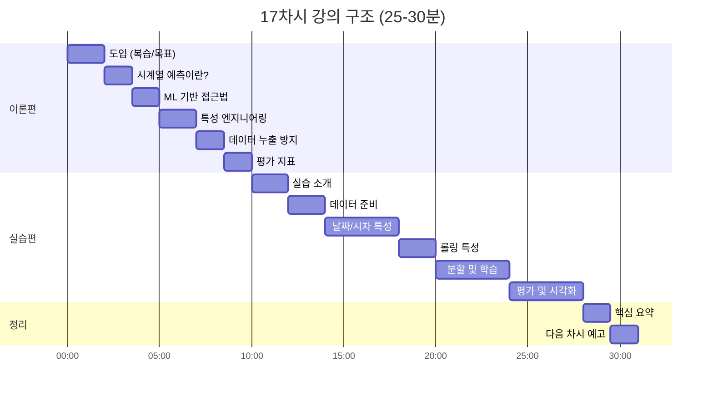

## 18. 핵심 요약

```mermaid
mindmap
  root((시계열<br>예측 모델))
    특성 엔지니어링
      날짜 특성
      Lag 특성
      Rolling 특성
    데이터 누출
      shift(1) 필수
      미래 정보 제외
    분할
      시간 기준
      과거→미래
    평가
      MAE
      RMSE
      MAPE 10-20%
```

## 19. 예측 결과 시각화

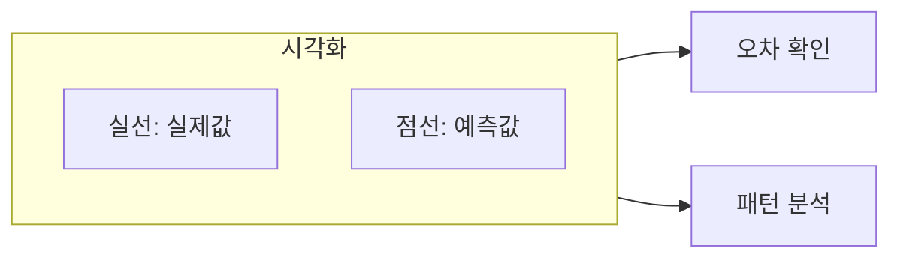

## 20. 실무 적용 팁

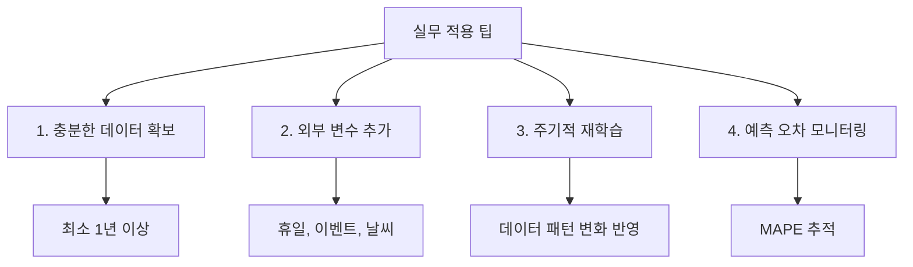
