# [18차시] 딥러닝 입문: 신경망 기초 - 다이어그램

## 1. 머신러닝과 딥러닝

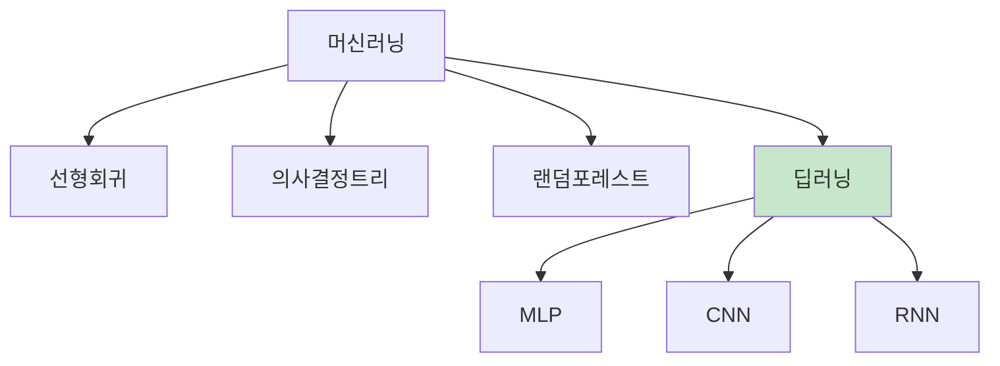

## 2. 생물학적 뉴런

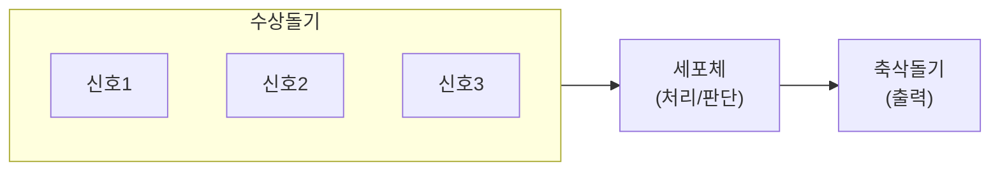

## 3. 인공 뉴런

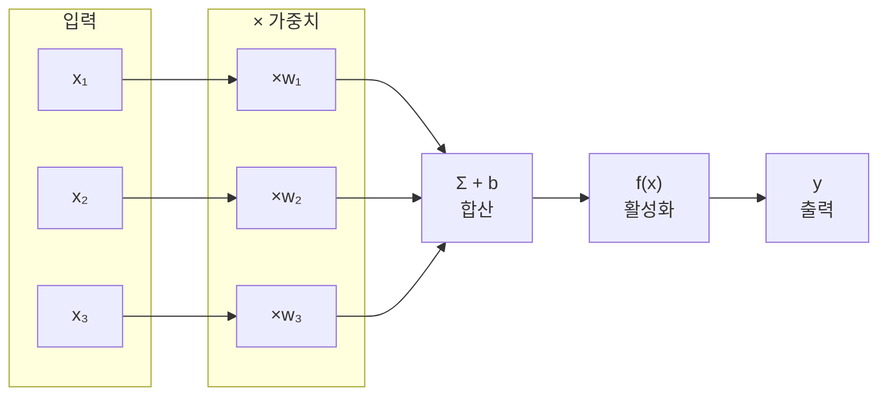

## 4. 가중치와 편향

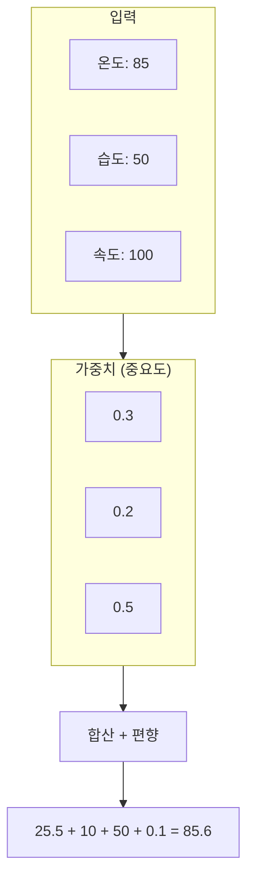

## 5. 활성화 함수 종류

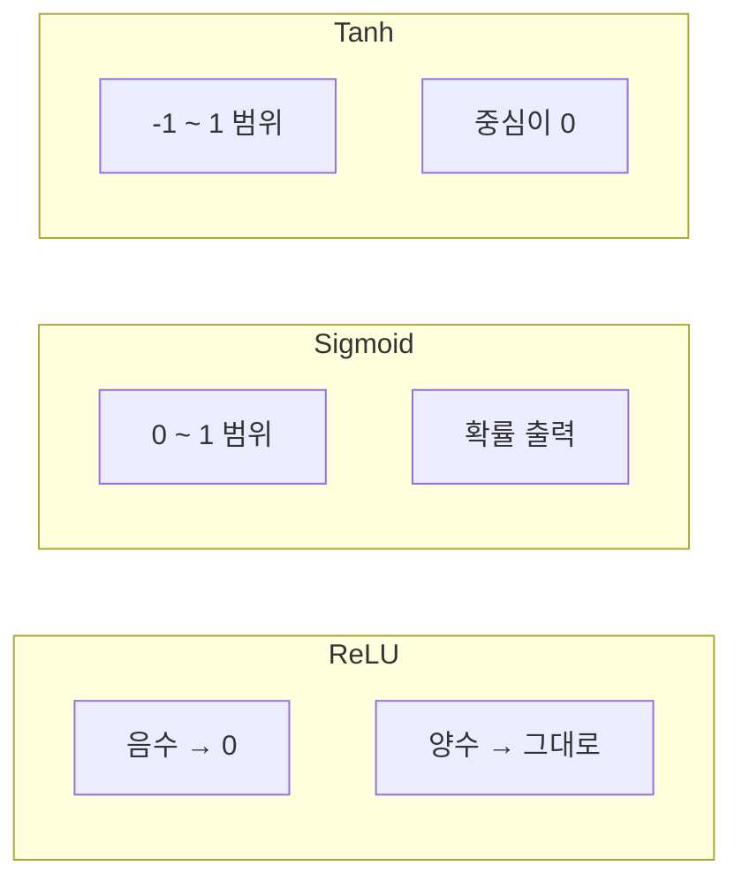

## 6. ReLU 함수

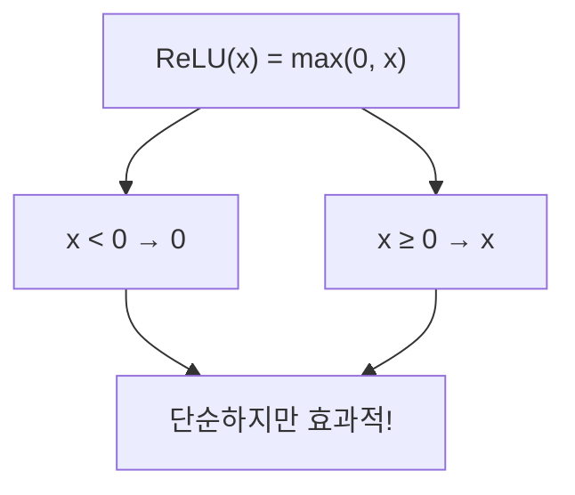

## 7. 신경망 층 구조

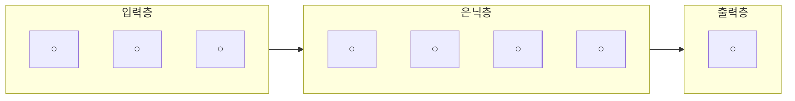

## 8. 심층 신경망 (DNN)

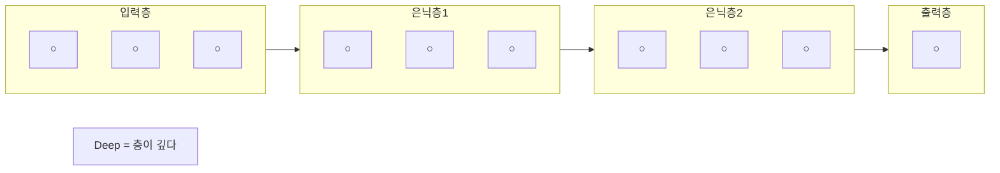

## 9. 순전파

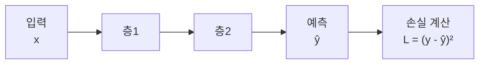

## 10. 역전파

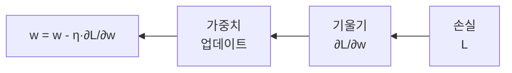

## 11. 학습 과정

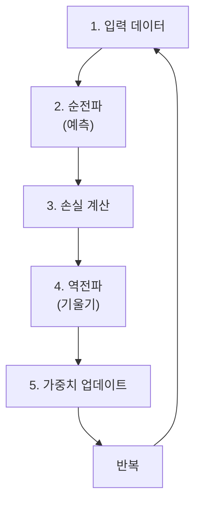

## 12. 경사하강법

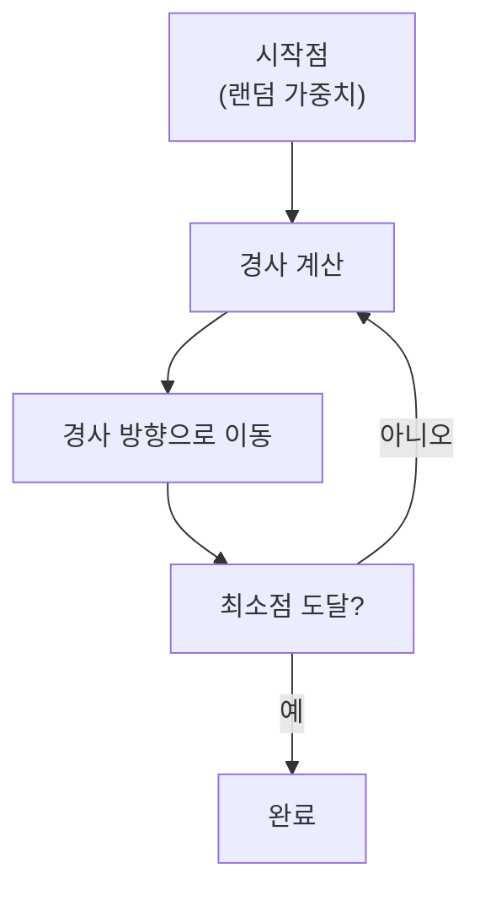

## 13. 손실 함수

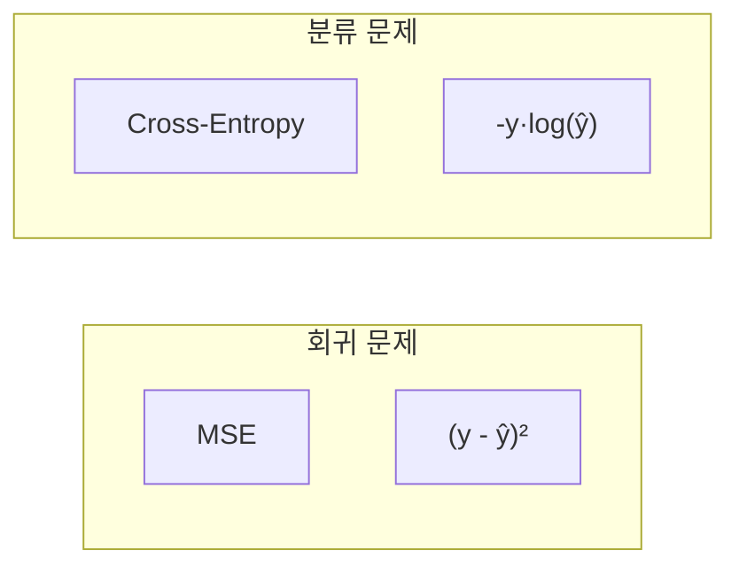

## 14. 딥러닝 vs 머신러닝

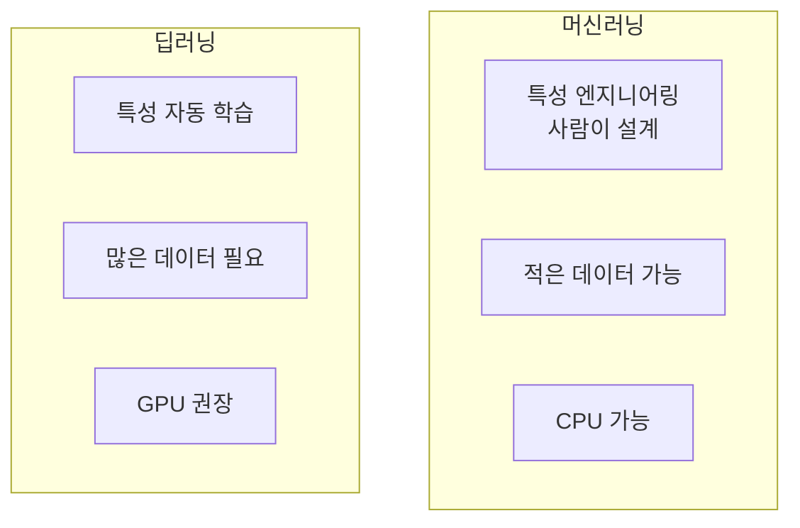

## 15. 제조 현장 적용

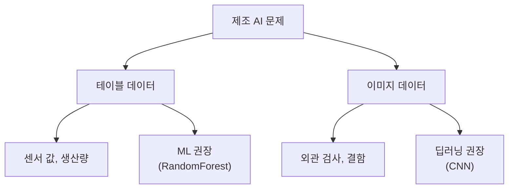

## 16. 뉴런 계산 예시

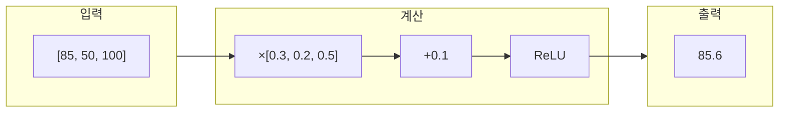

## 17. 층 연결

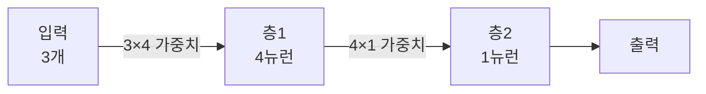

## 18. 강의 구조

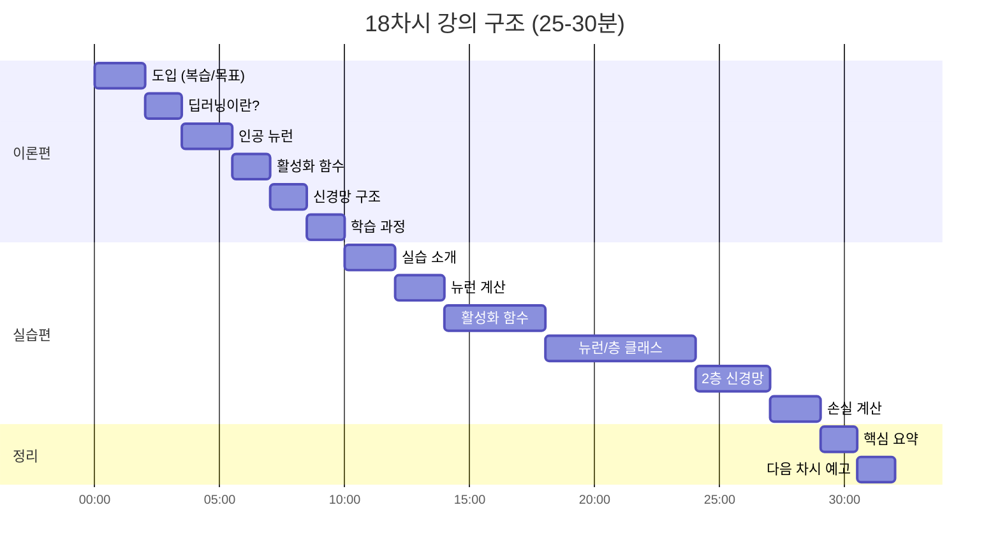

## 19. 핵심 요약

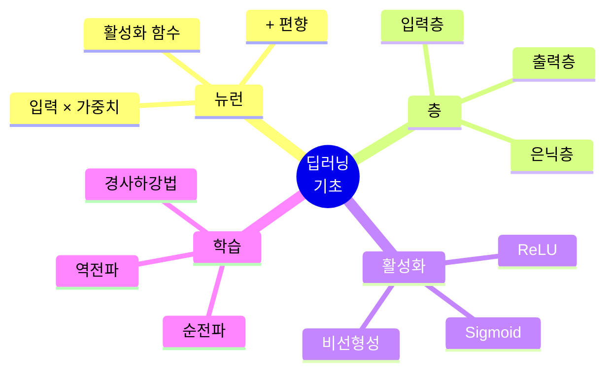

## 20. 다음 단계

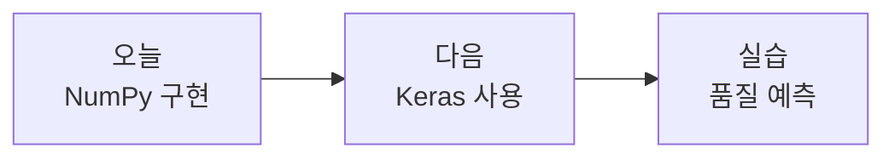
