# [19차시] 딥러닝 실습: MLP로 품질 예측 - 다이어그램

## 1. Keras 위치

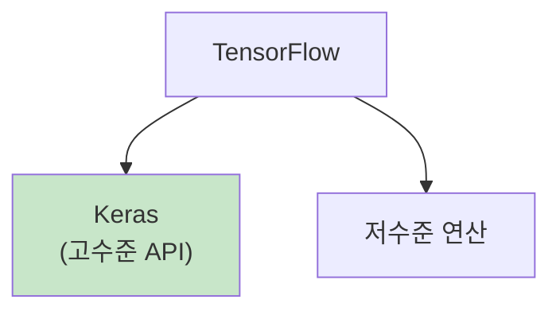

## 2. MLP 구조

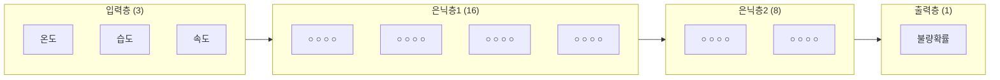

## 3. Sequential 모델 코드

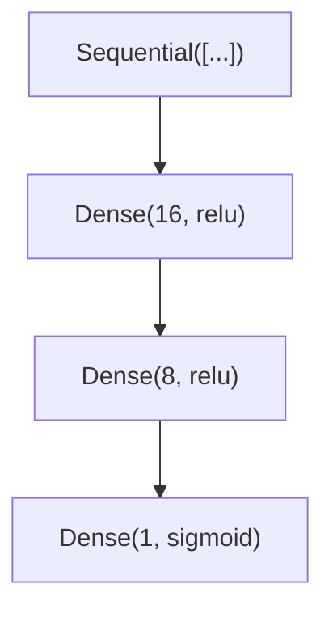

## 4. Dense 층

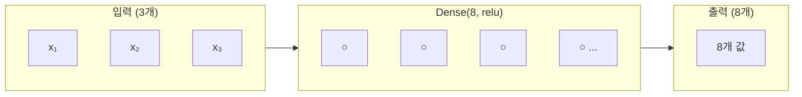

## 5. 활성화 함수 선택

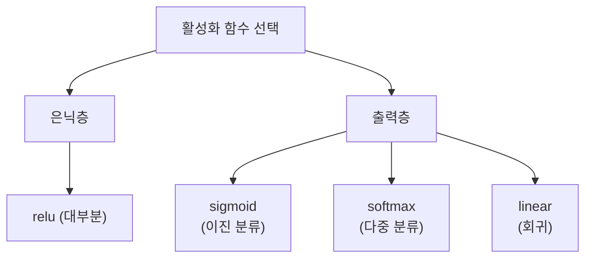

## 6. 모델 구축 흐름

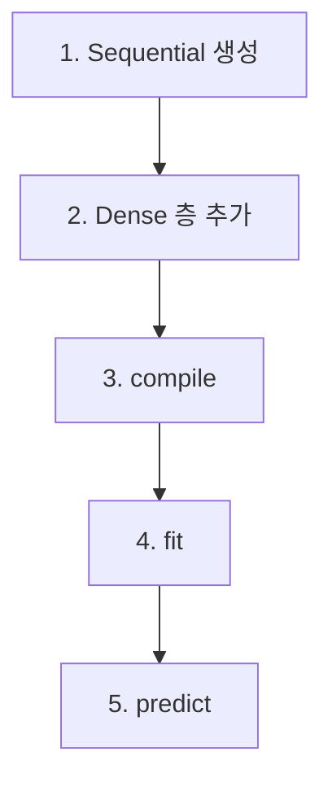

## 7. compile 구성

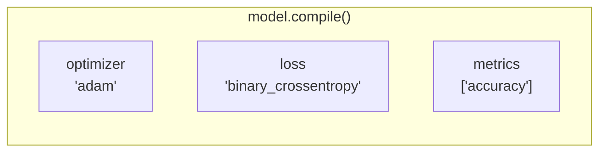

## 8. 손실 함수 선택

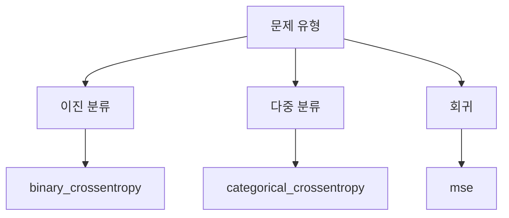

## 9. fit 구성

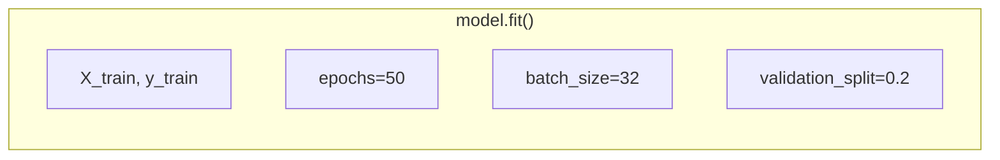

## 10. Epoch와 Batch

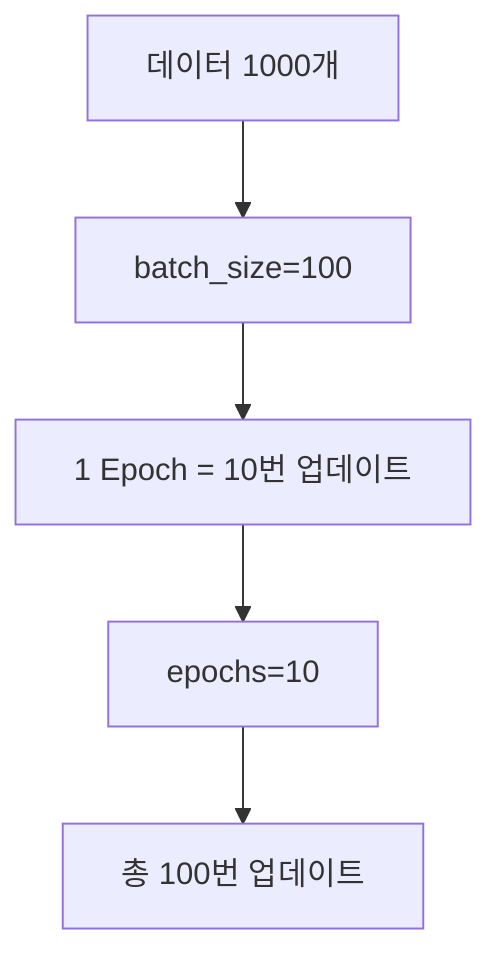

## 11. 학습 과정

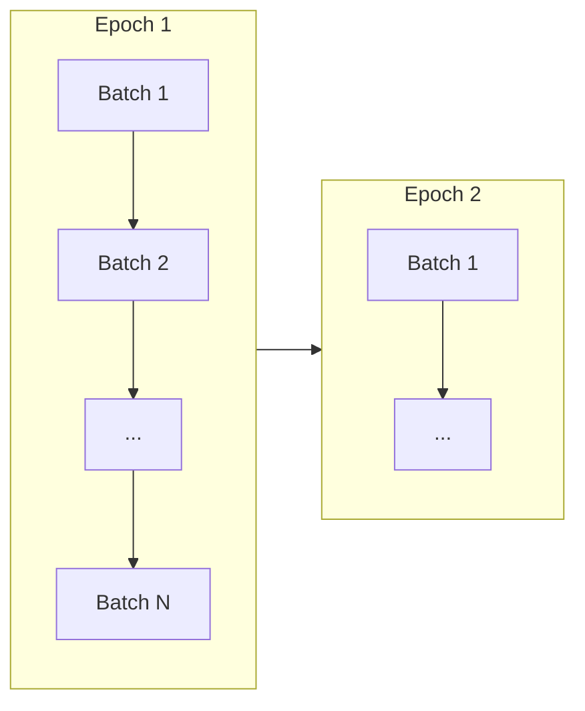

## 12. 학습 곡선

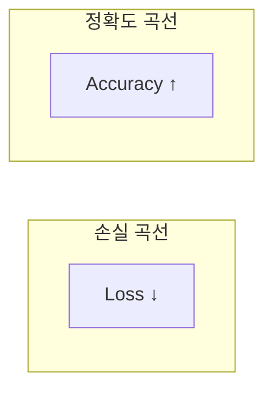

## 13. 과대적합 감지

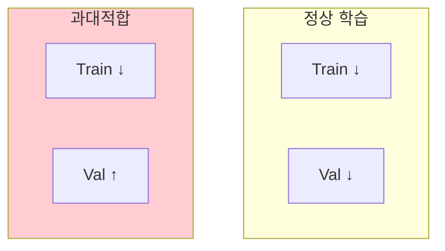

## 14. 데이터 전처리

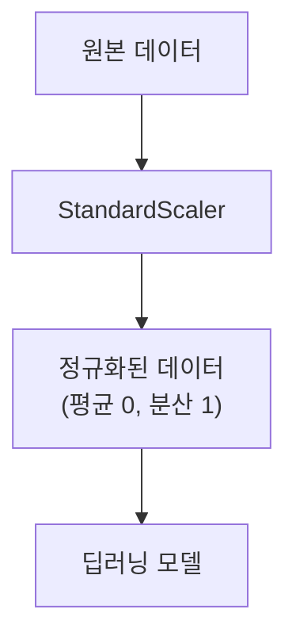

## 15. 예측 과정

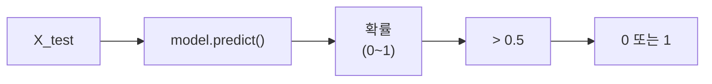

## 16. 평가 흐름

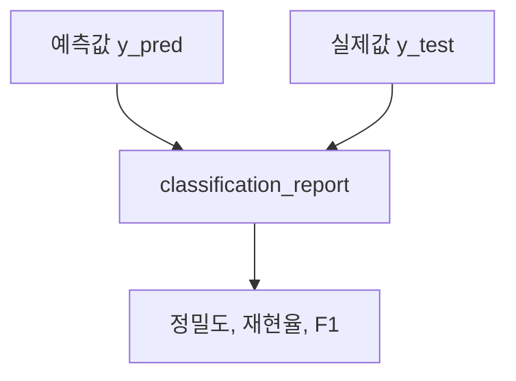

## 17. ML vs DL 비교

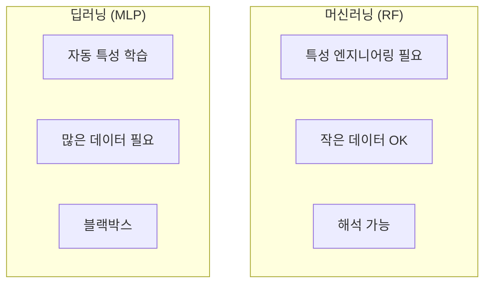

## 18. 강의 구조

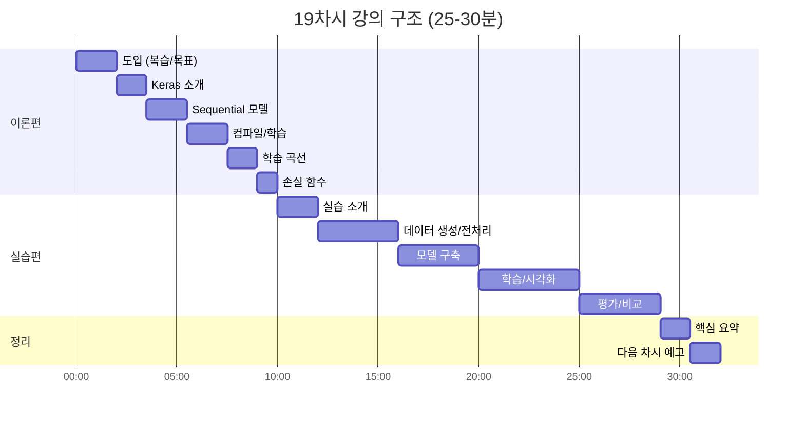

## 19. 핵심 요약

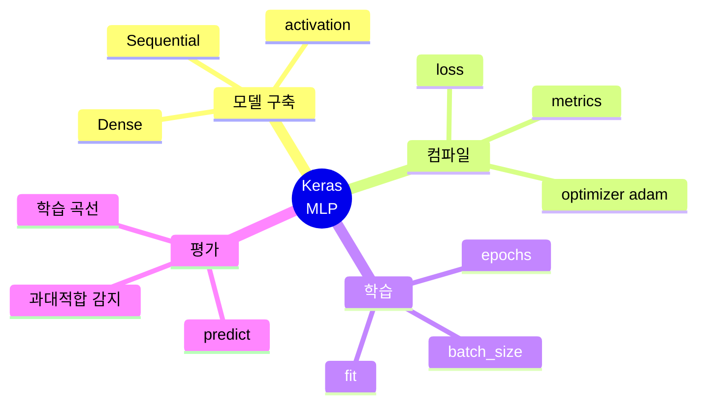

## 20. 제조 품질 예측 적용

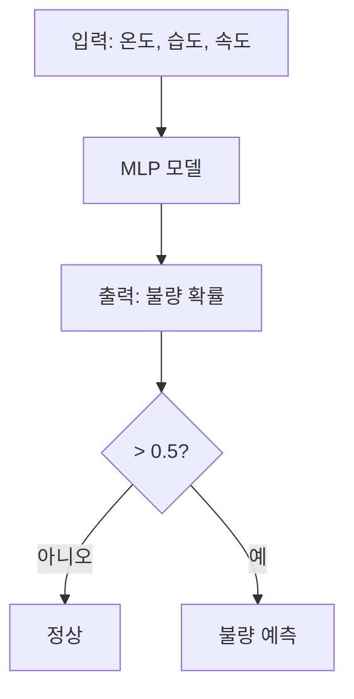
