# [20차시] AI API의 이해와 활용 - 다이어그램

## 1. API 개념

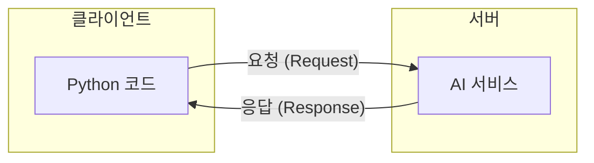

## 2. API 비유: 음식점

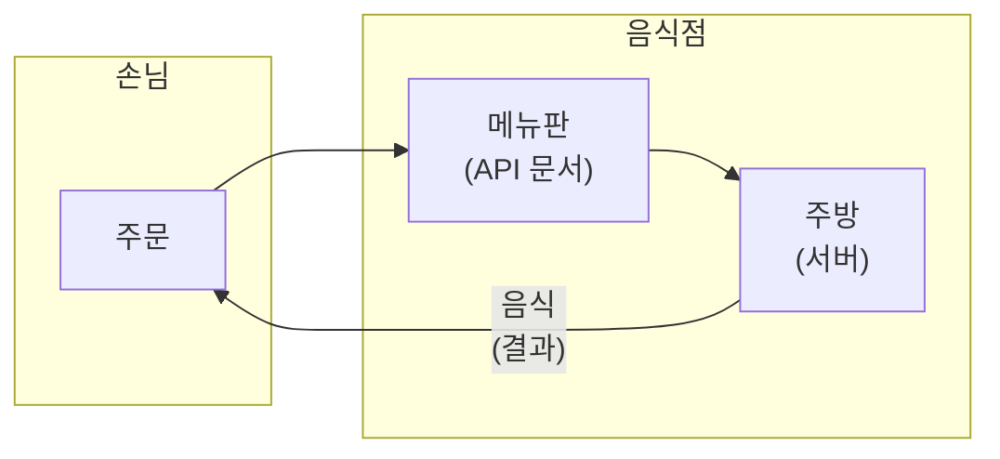

## 3. 웹 API 구조

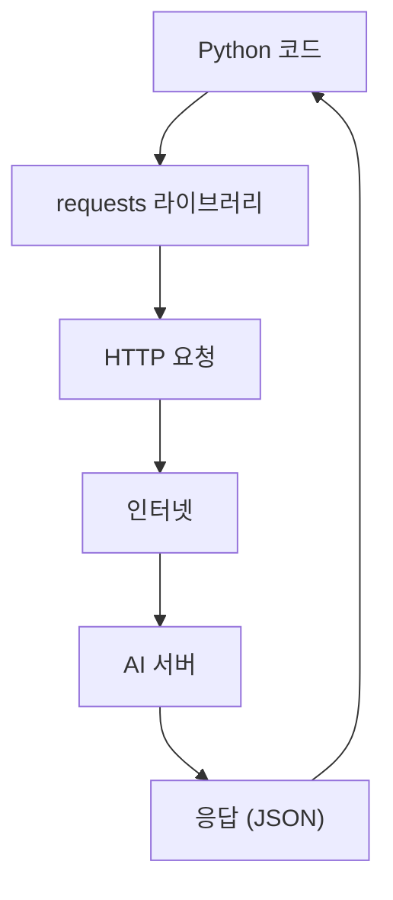

## 4. HTTP 메서드

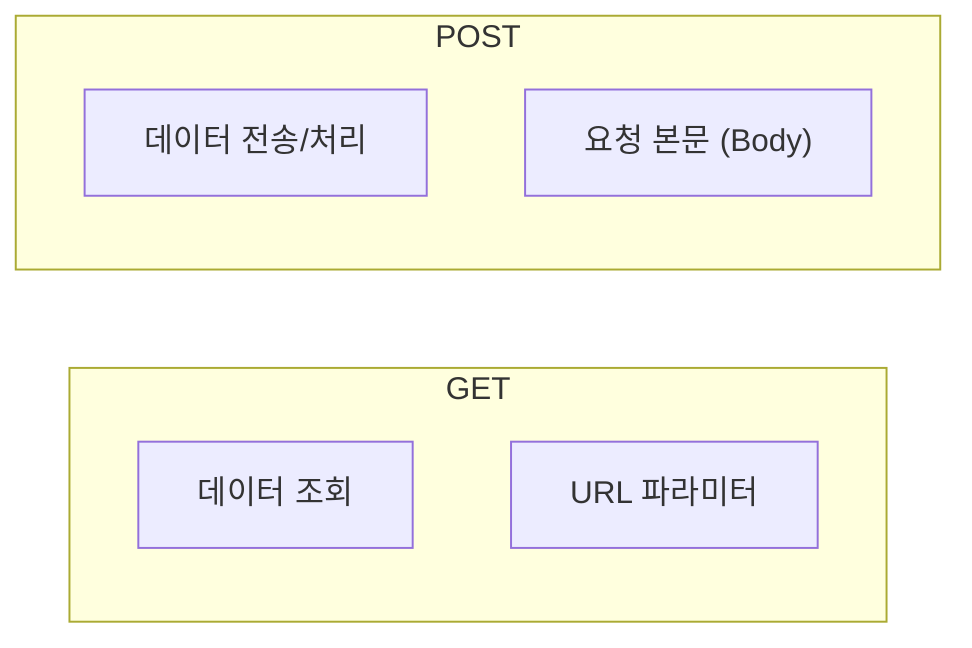

## 5. 요청과 응답

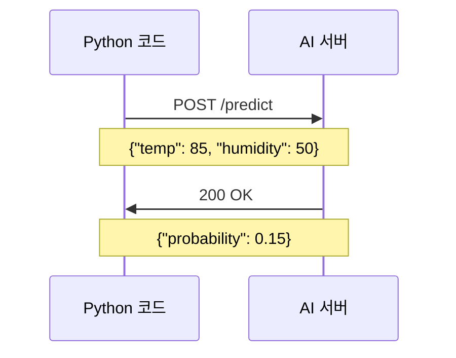

## 6. HTTP 상태 코드

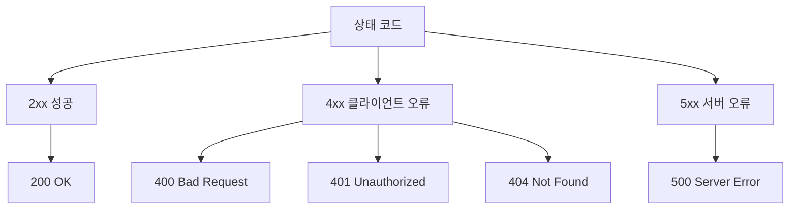

## 7. JSON 형식

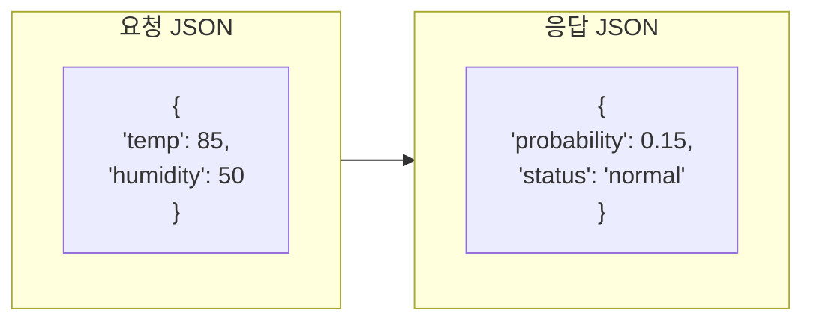

## 8. API 키 인증

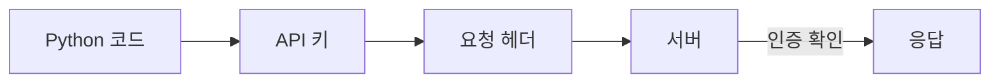

## 9. API 키 보안

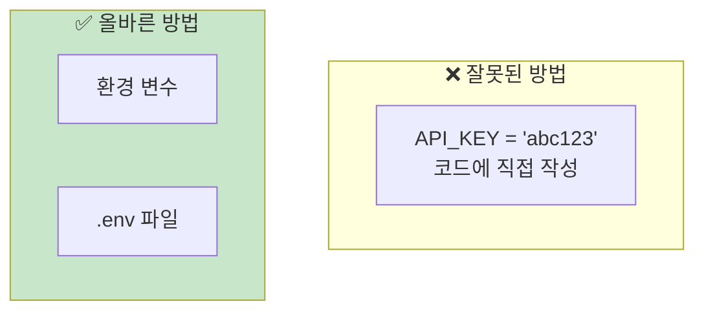

## 10. 환경 변수 사용

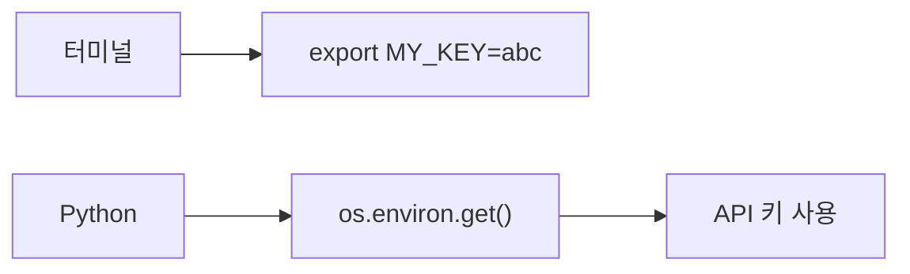

## 11. AI API 종류

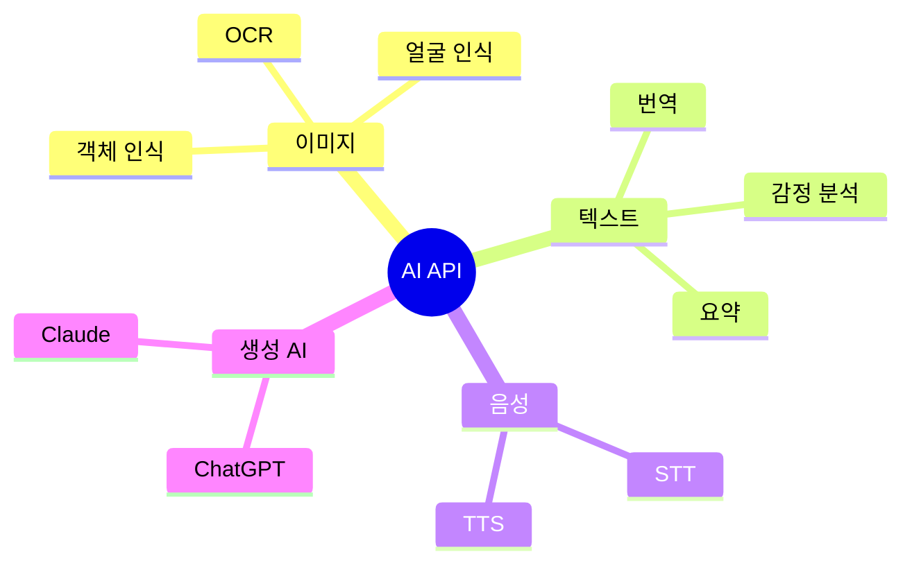

## 12. 직접 개발 vs API 사용

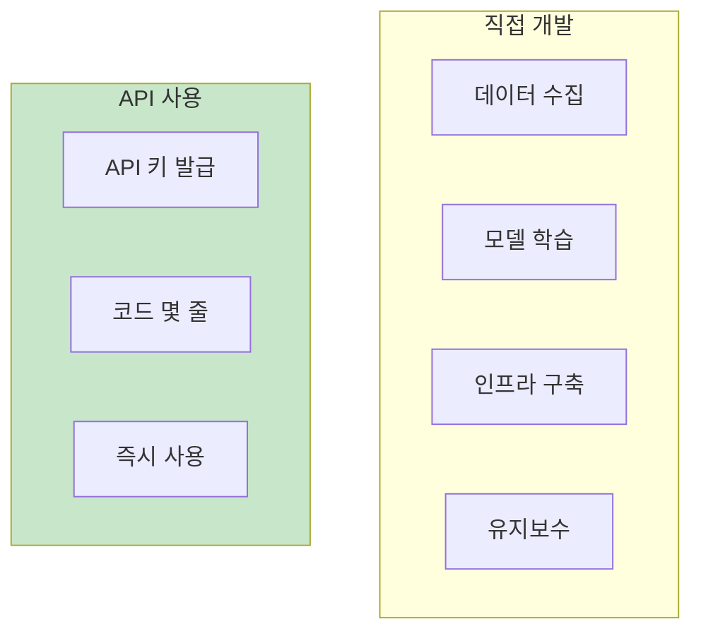

## 13. requests 흐름

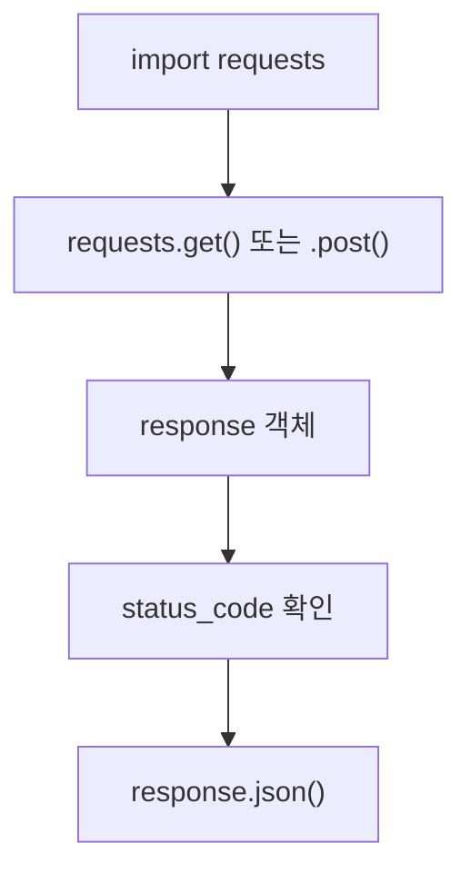

## 14. 오류 처리

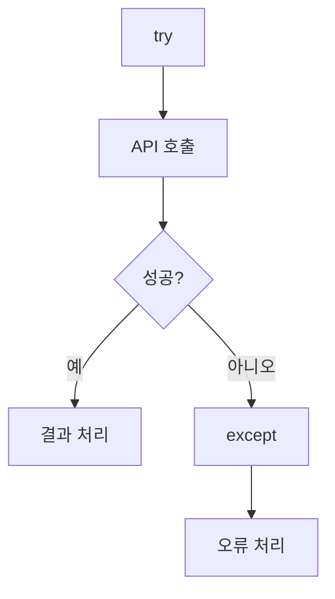

## 15. 타임아웃

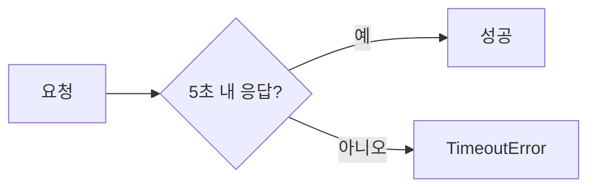

## 16. API 클라이언트 클래스

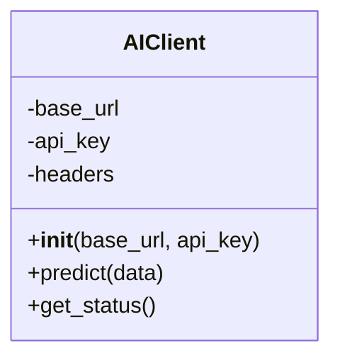

## 17. 제조 분야 AI API 활용

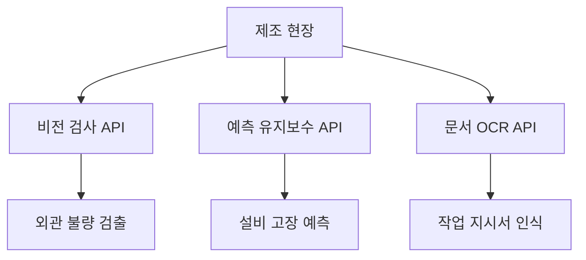

## 18. 강의 구조

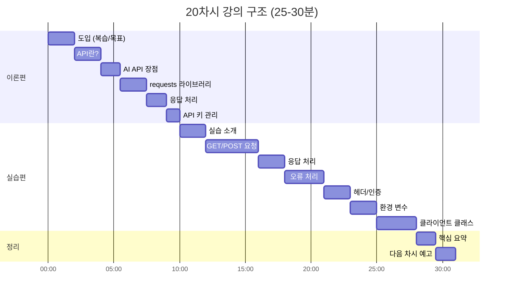

## 19. 핵심 요약

```mermaid
mindmap
  root((AI API<br>활용))
    API
      요청/응답
      HTTP 메서드
      JSON 형식
    requests
      get()
      post()
      headers
    보안
      API 키
      환경 변수
    오류 처리
      try-except
      timeout
      status_code
```

## 20. 다음 단계

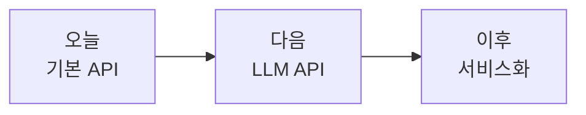
