# [21차시] LLM API와 프롬프트 작성법 - 다이어그램

## 1. LLM이란?

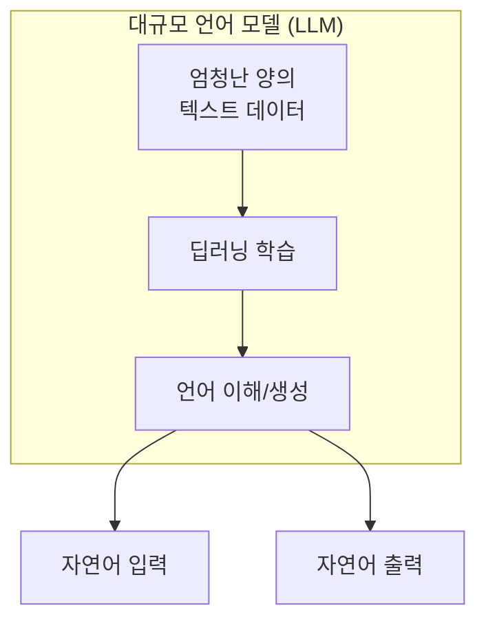

## 2. LLM 종류

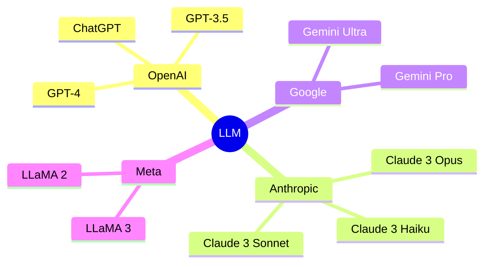

## 3. LLM 능력

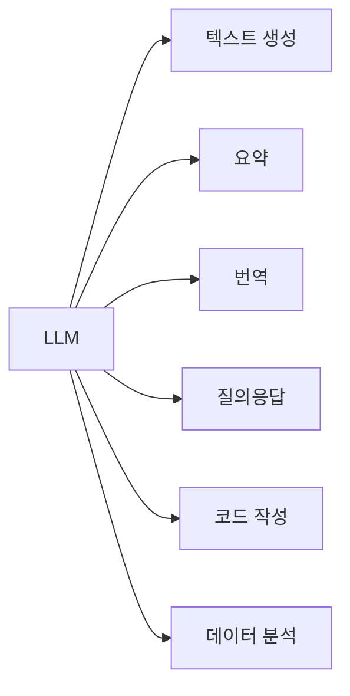

## 4. 제조 현장 LLM 활용

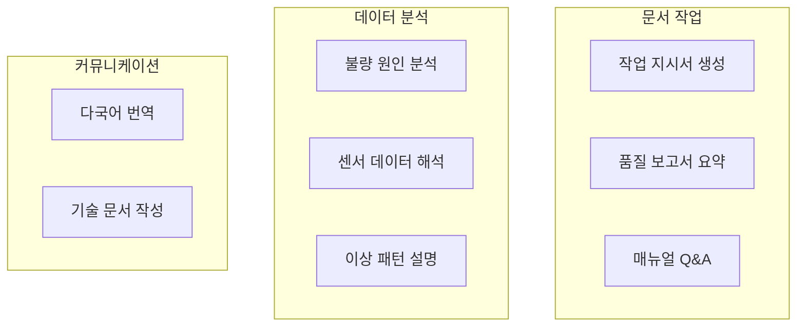

## 5. API 호출 흐름

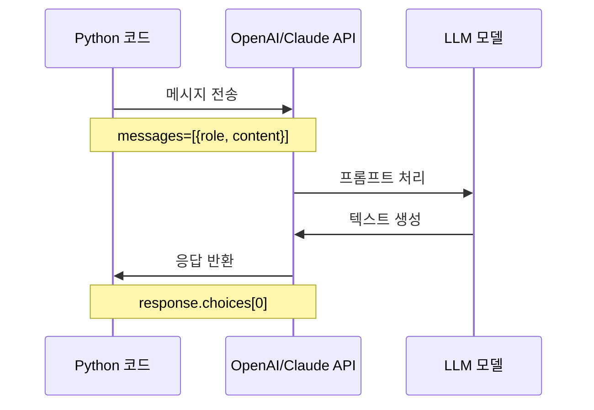

## 6. 메시지 구조

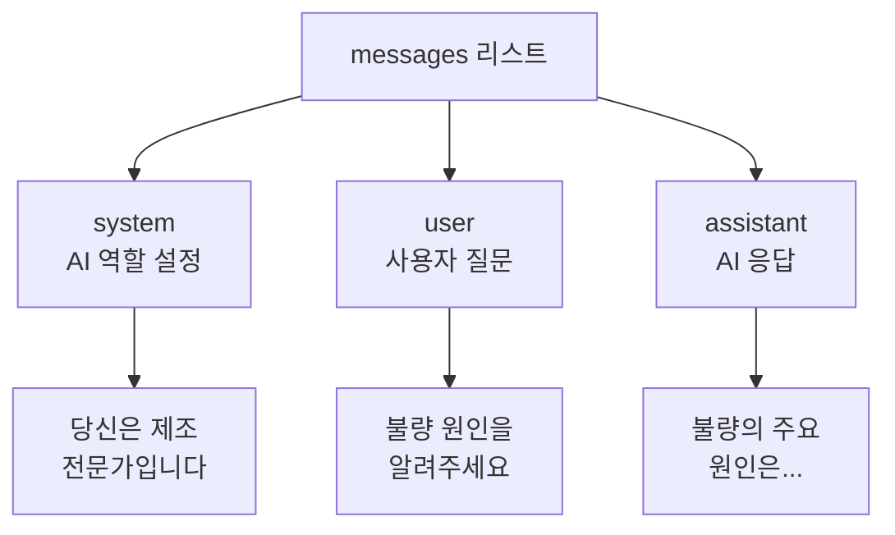

## 7. 메시지 역할별 기능

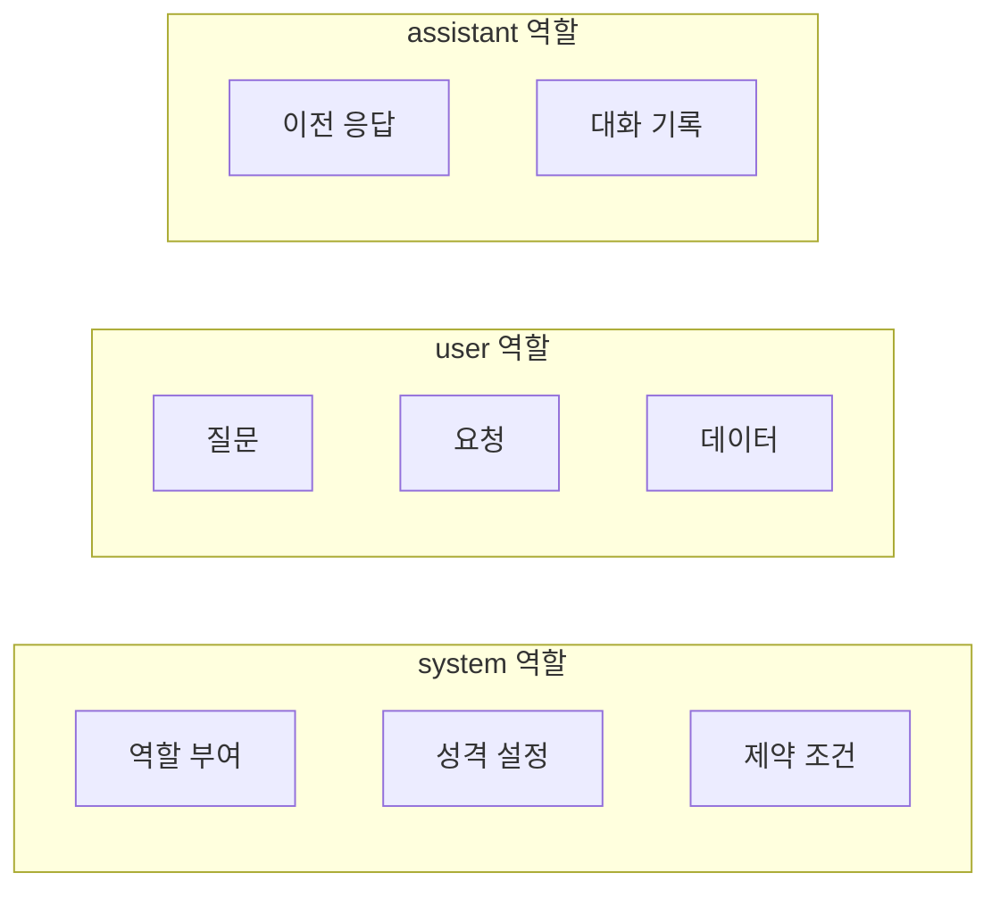

## 8. OpenAI API 구조

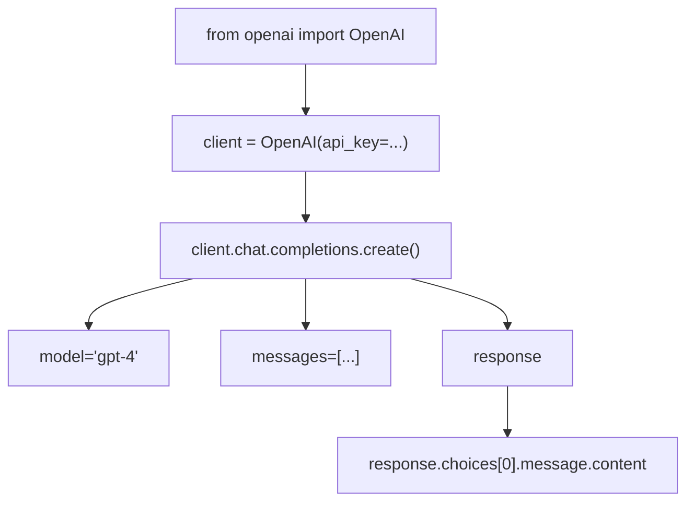

## 9. Claude API 구조

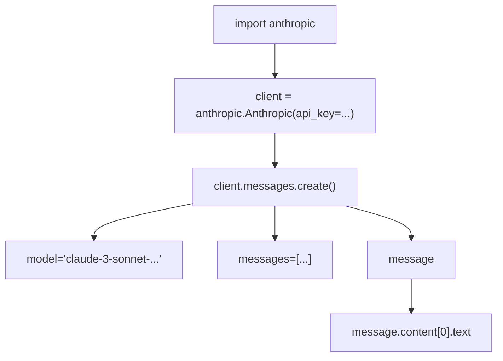

## 10. 프롬프트란?

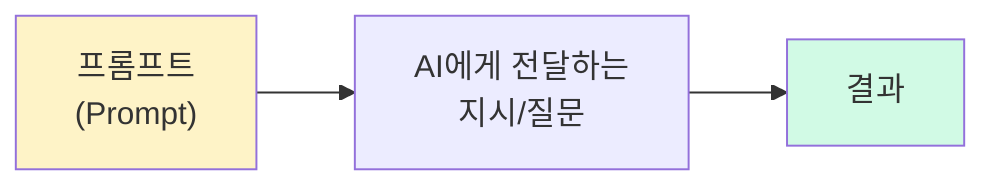

## 11. 좋은 프롬프트 조건

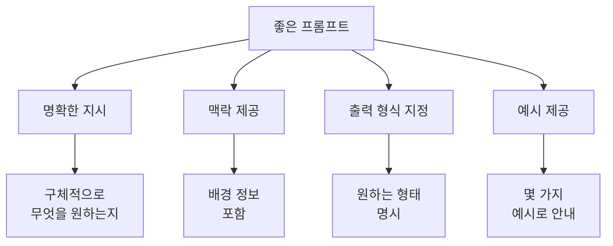

## 12. 프롬프트 구조화

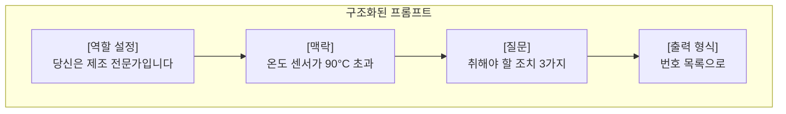

## 13. 프롬프트 비교

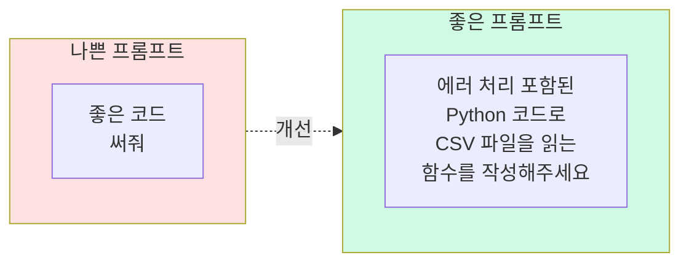

## 14. Few-shot 프롬프트

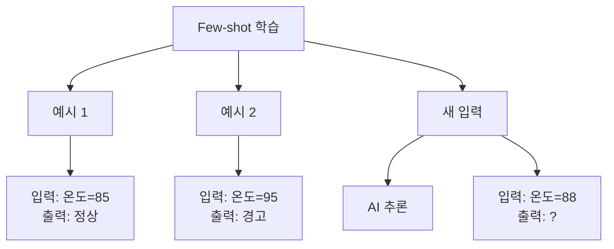

## 15. 멀티턴 대화

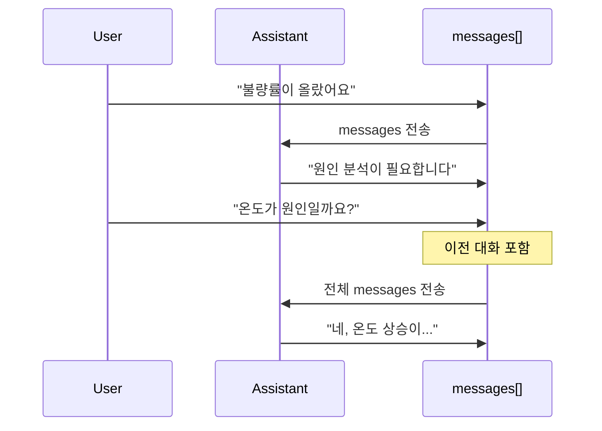

## 16. 대화 기록 유지

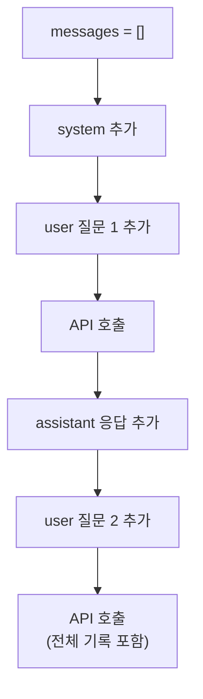

## 17. JSON 응답

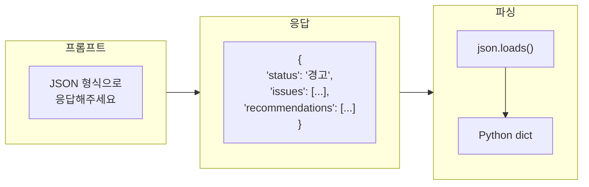

## 18. 강의 구조

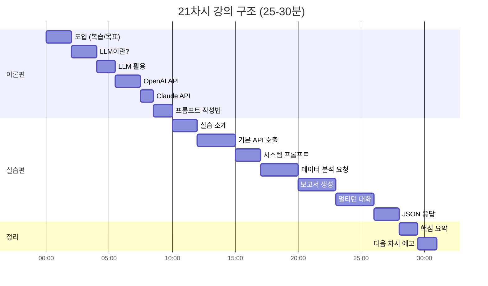

## 19. 핵심 요약

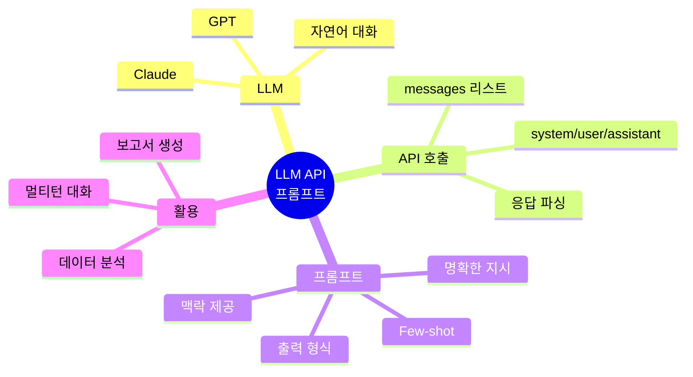

## 20. 다음 단계

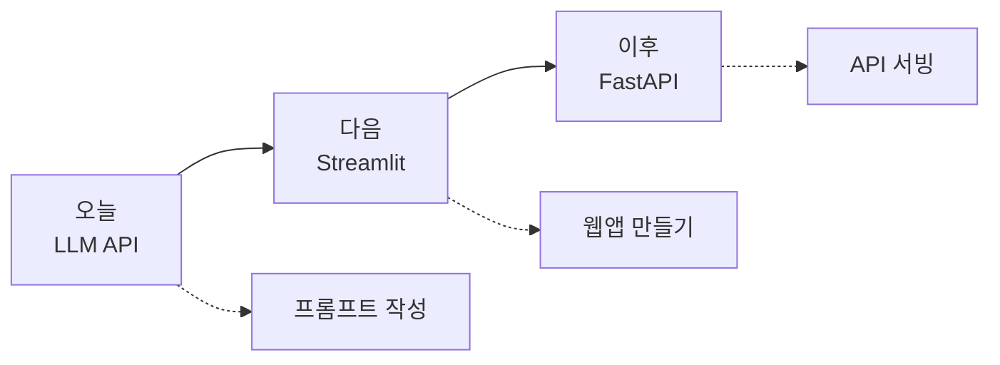
