# [22차시] Streamlit으로 웹앱 만들기 - 다이어그램

## 1. Streamlit이란?

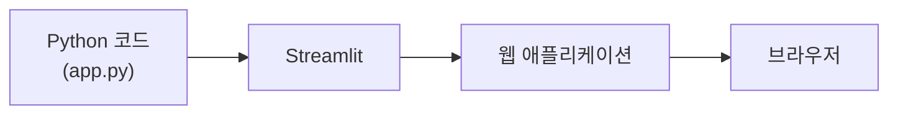

## 2. 기존 방식 vs Streamlit

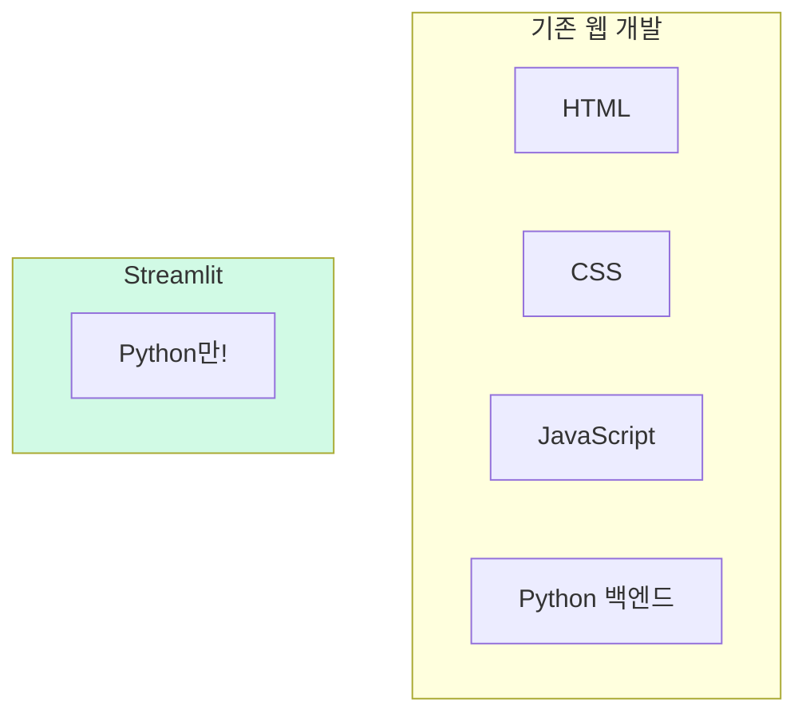

## 3. Streamlit 실행 흐름

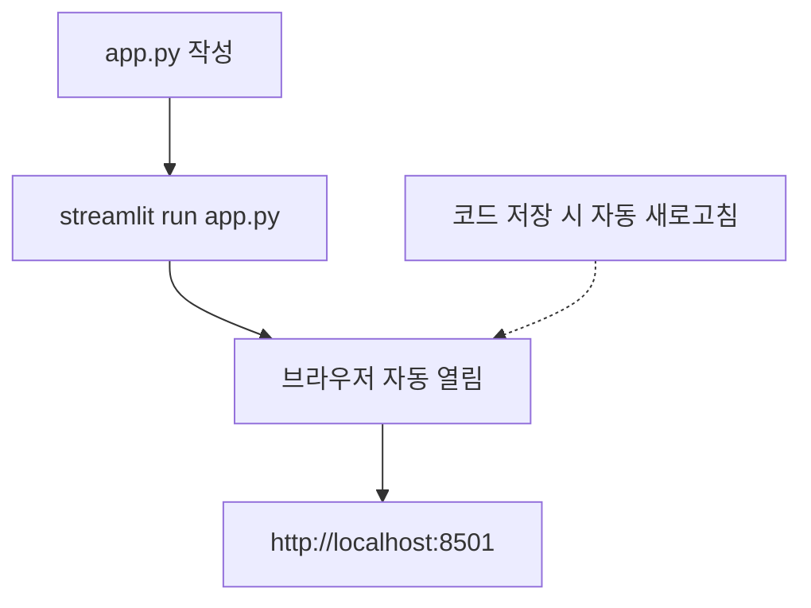

## 4. 텍스트 출력 함수

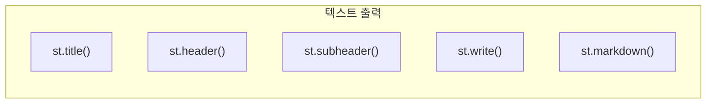

## 5. 입력 위젯 종류

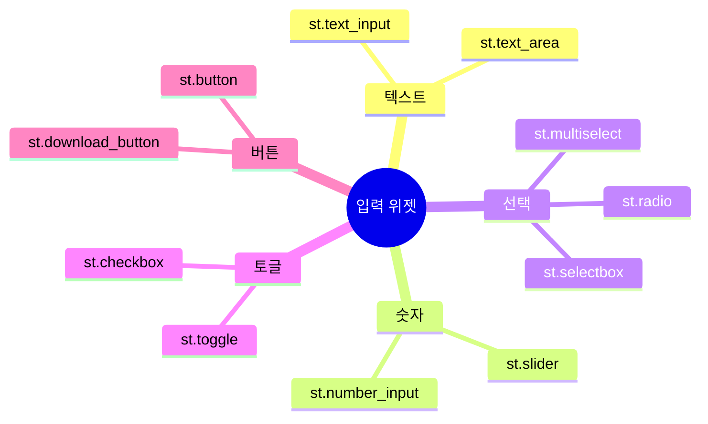

## 6. 슬라이더 구조

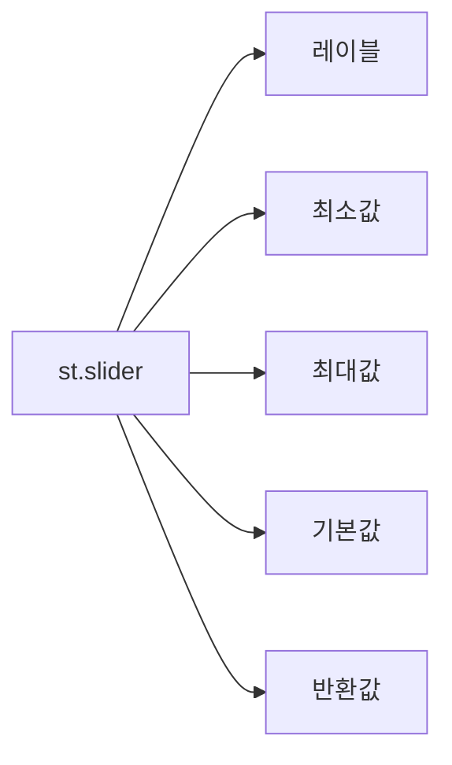

## 7. 레이아웃 구조

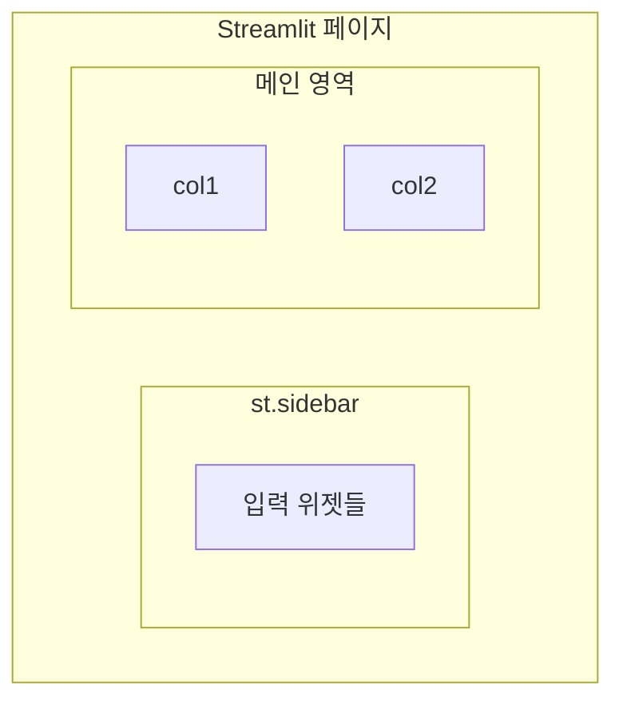

## 8. 사이드바 패턴

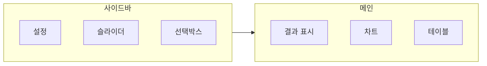

## 9. 컬럼 레이아웃

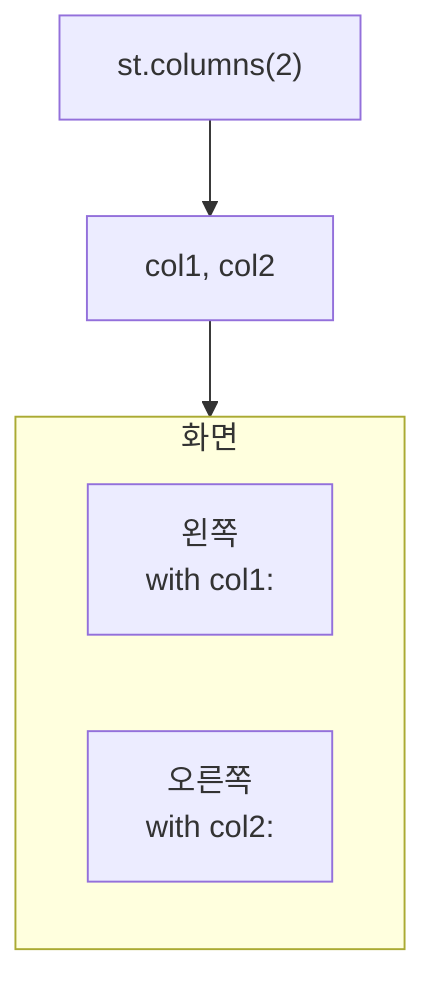

## 10. 시각화 옵션

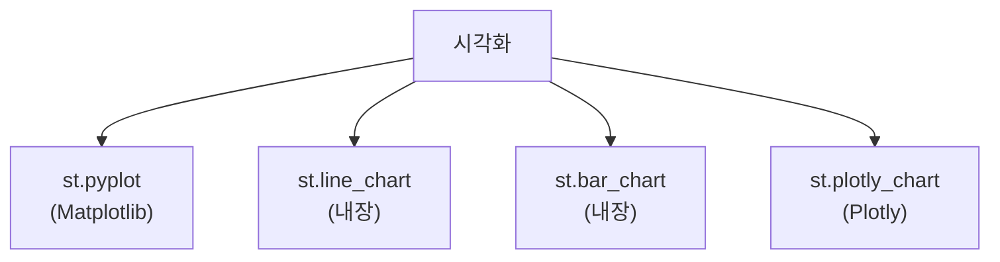

## 11. ML 모델 통합

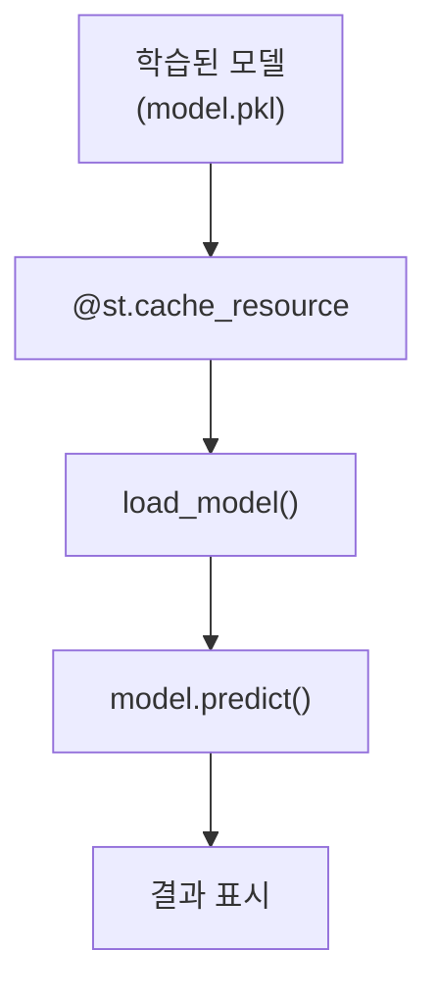

## 12. 캐싱 종류

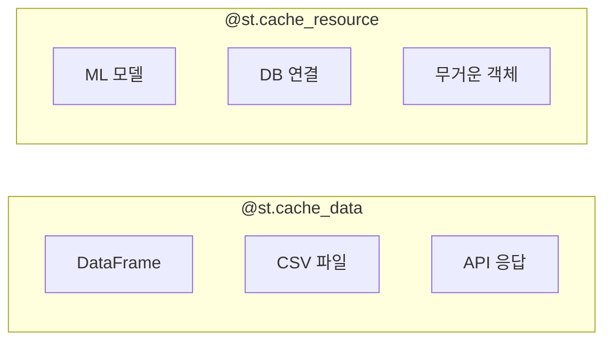

## 13. 파일 업로드

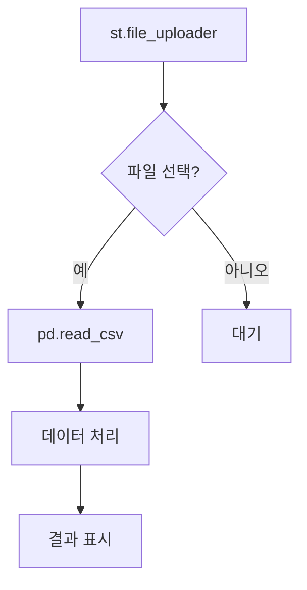

## 14. 세션 상태

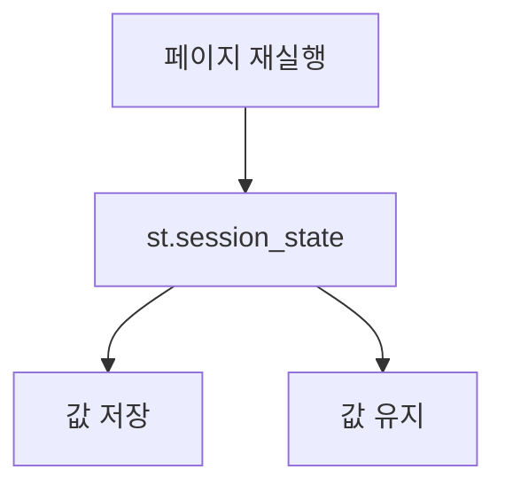

## 15. 품질 예측 앱 구조

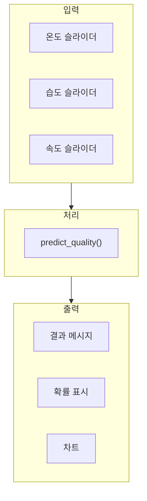

## 16. 결과 표시 위젯

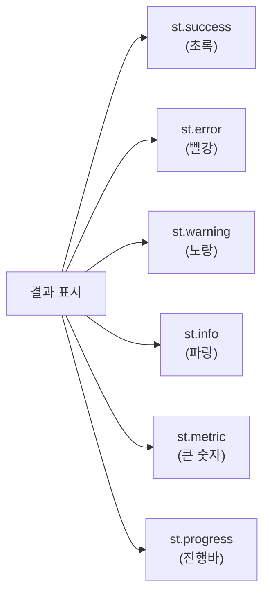

## 17. 배포 흐름

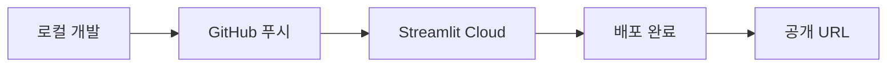

## 18. 강의 구조

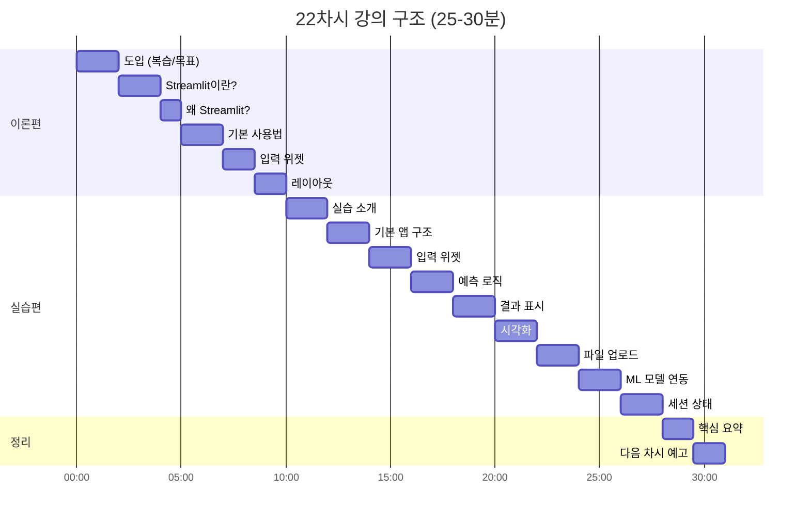

## 19. 핵심 요약

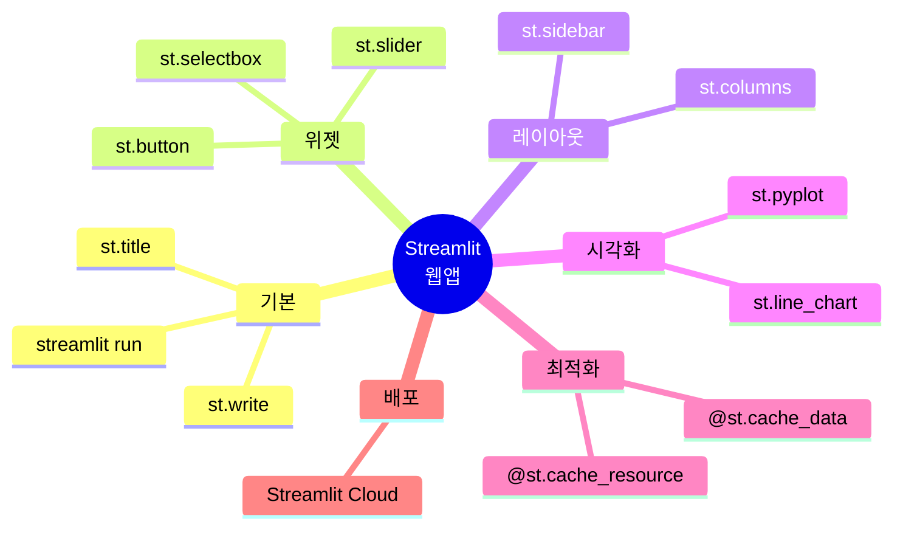

## 20. 다음 단계

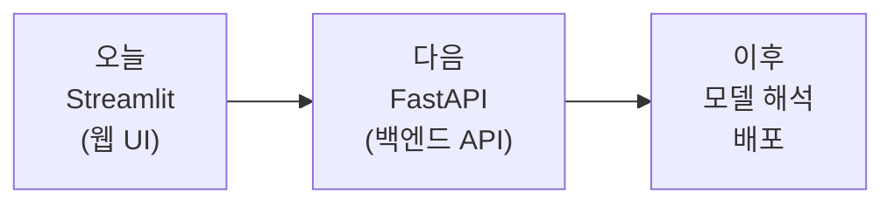
