# [24차시] 모델 해석과 변수별 영향력 분석 - 다이어그램

## 1. 블랙박스 문제

## 2. 모델 해석의 필요성

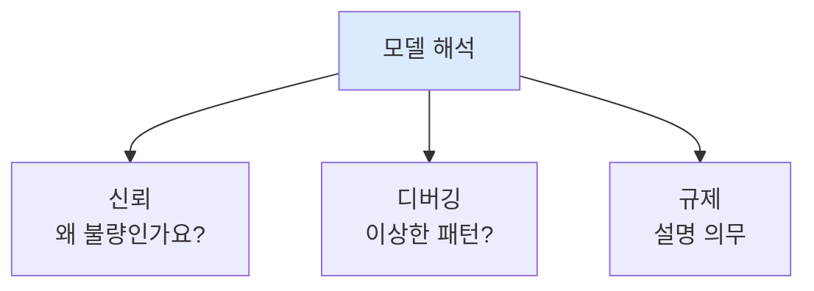

## 3. 특성 중요도 개념

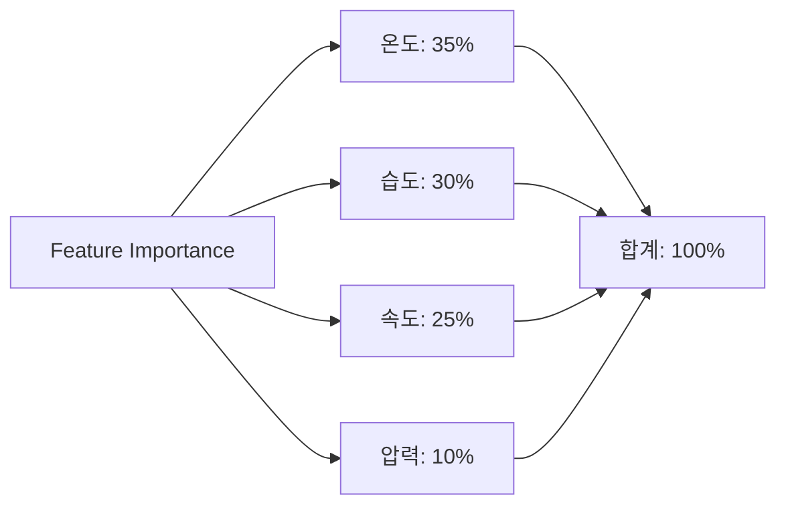

## 4. 트리 기반 모델과 중요도

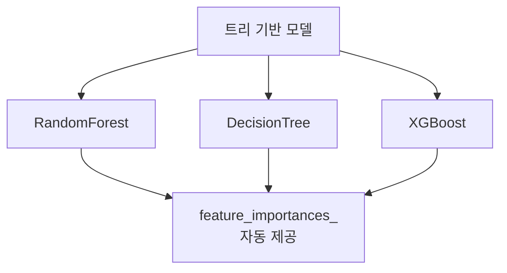

## 5. Feature Importance 코드

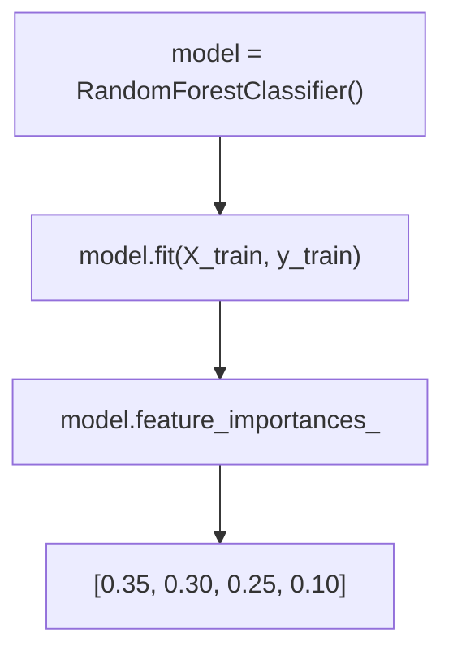

## 6. Permutation Importance 원리

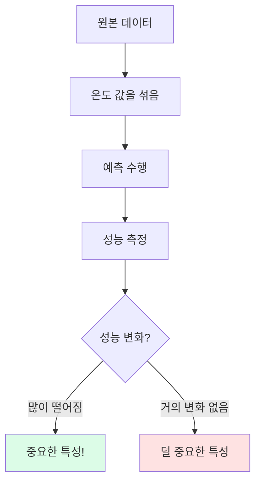

## 7. 두 방법 비교

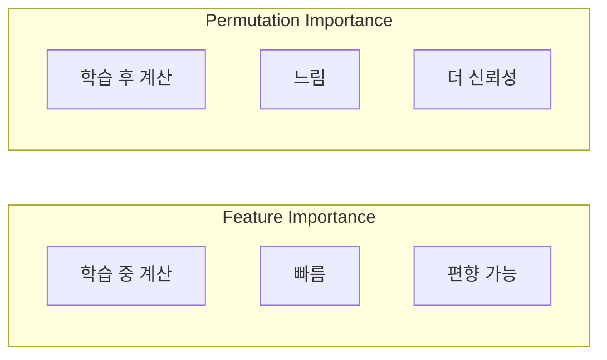

## 8. 제조 데이터 특성 중요도

## 9. 시각화 방법

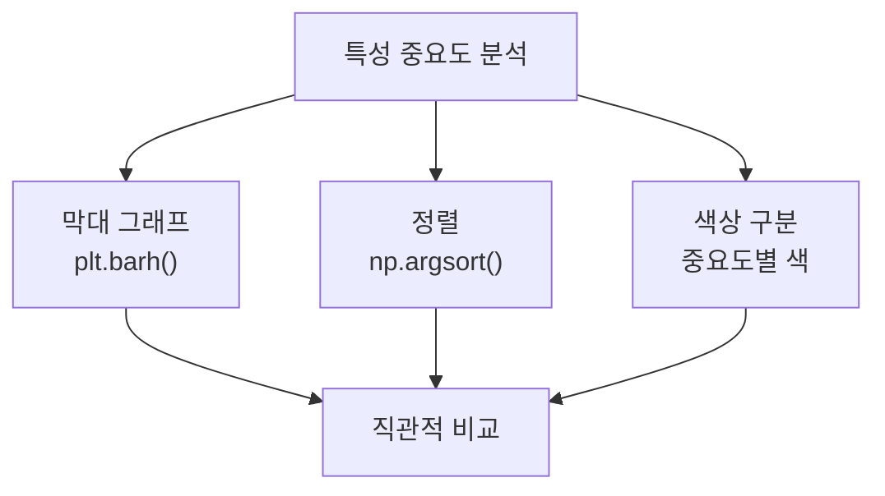

## 10. 상관된 특성 문제

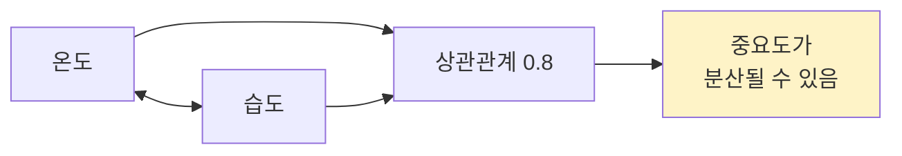

## 11. 인과관계 vs 상관관계

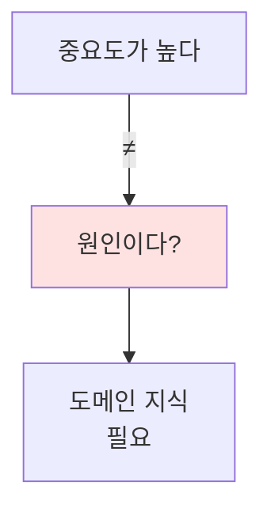

## 12. 분석 워크플로우

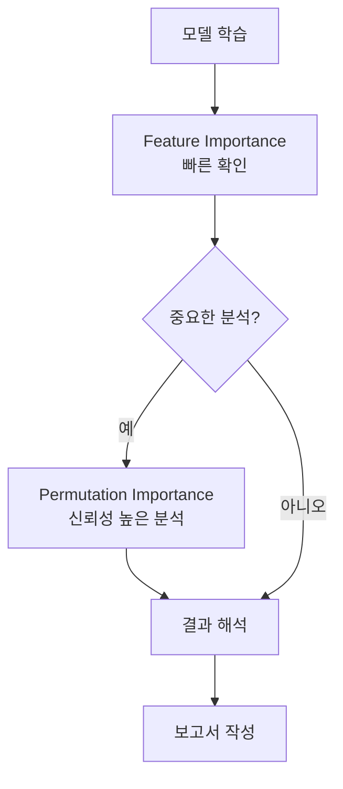

## 13. 비즈니스 인사이트 도출

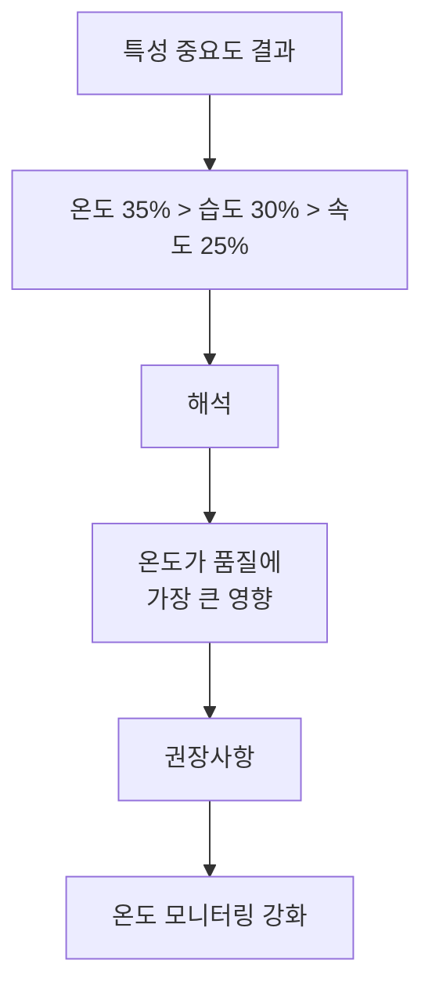

## 14. 실무 보고서 구조

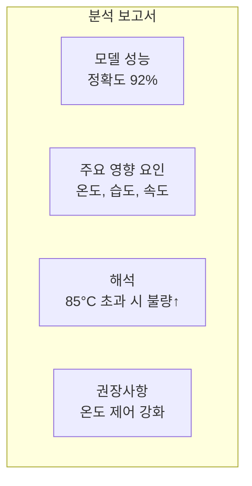

## 15. sklearn.inspection 모듈

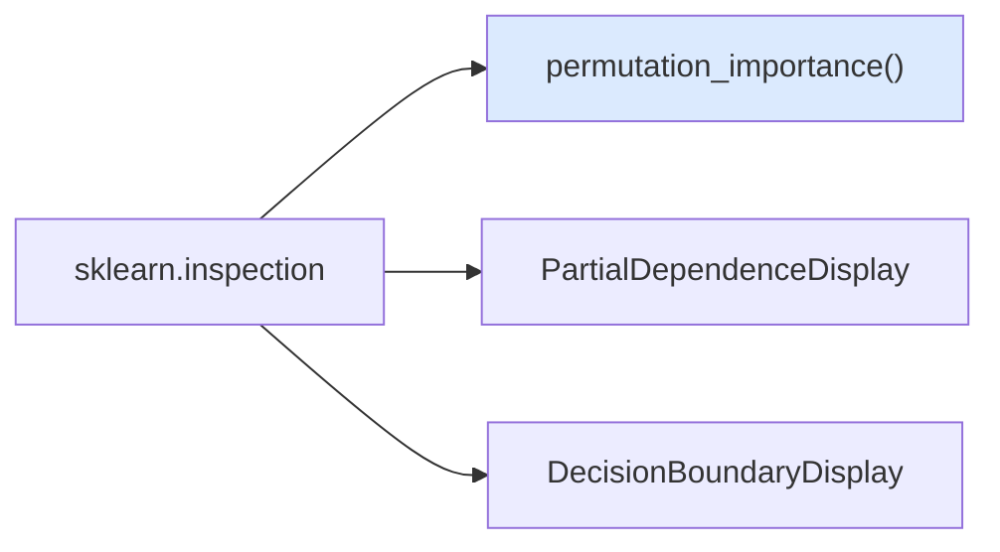

## 16. 고급 해석 기법

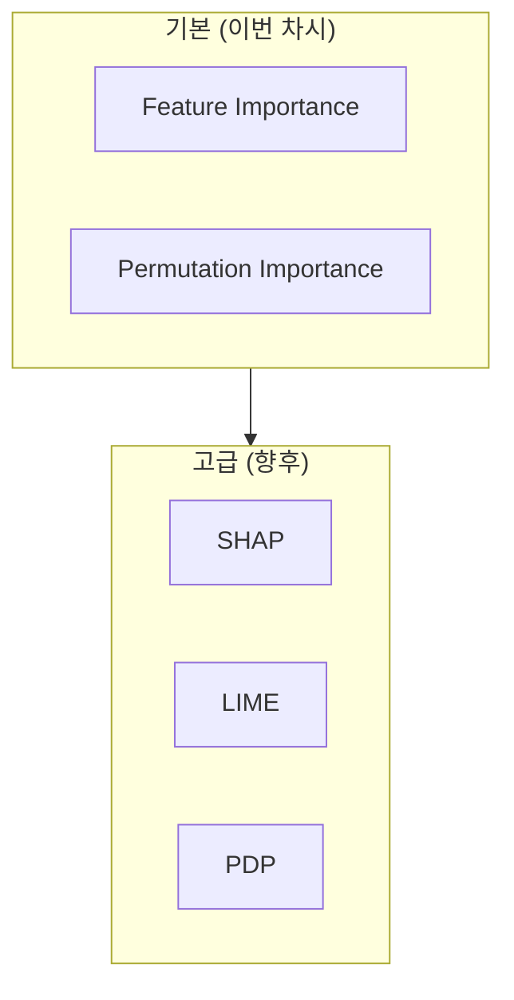

## 17. SHAP 개념

## 18. 강의 구조

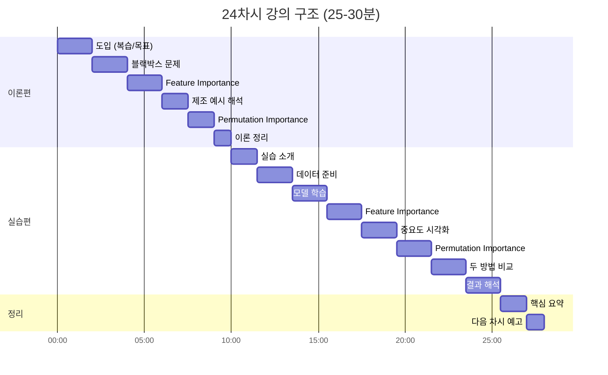

## 19. 핵심 요약

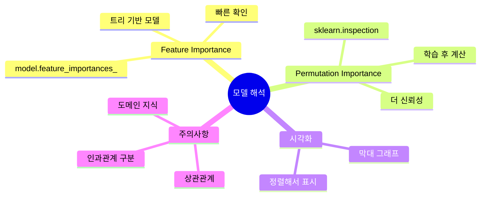

## 20. 다음 단계

