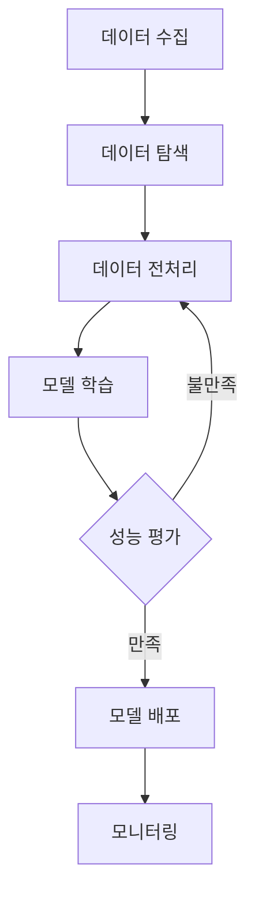
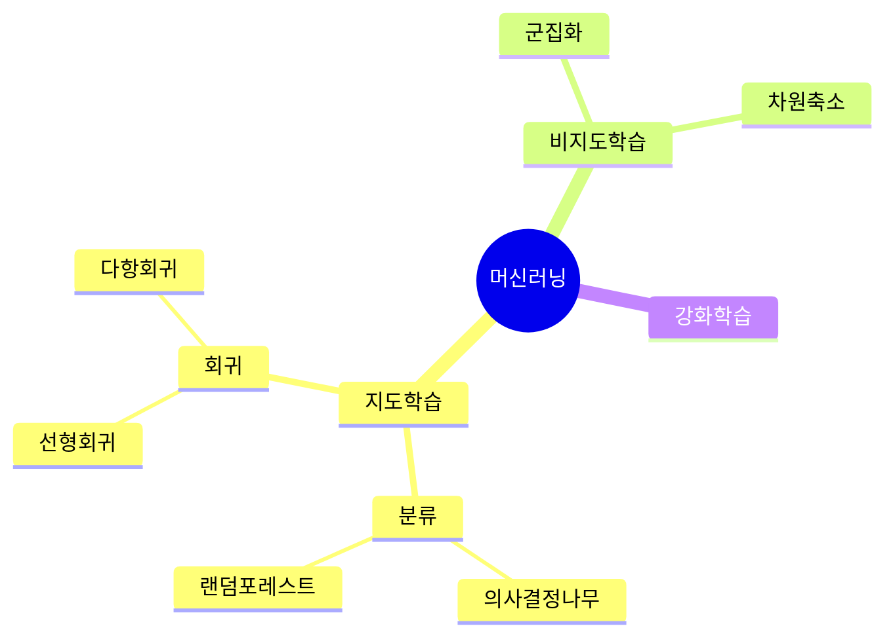
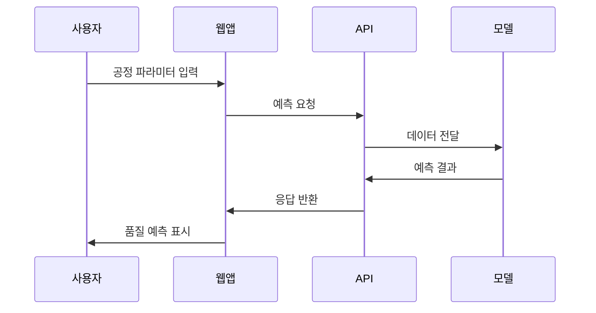
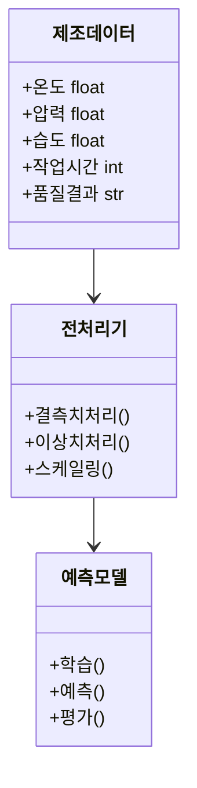

# 26차시 강의안 작성 프롬프트 가이드

## 1. 과정 개요

| 항목 | 내용 |
|------|------|
| 과정명 | 제조데이터를 활용한 AI 이해와 예측 모델 구축 |
| 대상 | 비전공자, AI 입문자 |
| 형식 | 온라인 강의 (녹화 영상) |
| 차시당 시간 | 25분 |
| 총 차시 | 26차시 |

---

## 2. 공통 디자인 가이드라인

### 2.1 슬라이드 디자인 표준

```
색상 팔레트:
- 주색상: #2563EB (파란색) - 제목, 강조
- 보조색상: #10B981 (초록색) - 실습, 코드
- 배경색: #F8FAFC (밝은 회색)
- 텍스트: #1E293B (진한 회색)

폰트:
- 제목: Pretendard Bold, 32pt
- 본문: Pretendard Regular, 18pt
- 코드: D2Coding, 16pt

레이아웃:
- 16:9 비율
- 상단 헤더: 차시 번호 + 차시명
- 하단 푸터: 페이지 번호 / 전체 페이지
```

### 2.2 슬라이드 구성 표준 (14~16장)

| 순서 | 슬라이드 유형 | 내용 |
|:----:|--------------|------|
| 1 | 표지 | 차시명, 학습목표 미리보기 |
| 2 | 학습목표 | 3개 학습목표 (체크박스 형태) |
| 3-4 | 이전 차시 복습 | 핵심 내용 요약 (해당 시) |
| 5-10 | 핵심 내용 | 개념 설명 + 다이어그램 |
| 11-13 | 실습 가이드 | 코드 예시 + 실행 결과 |
| 14 | 핵심 요약 | 3줄 요약 |
| 15 | 다음 차시 예고 | 다음 주제 미리보기 |
| 16 | 마무리 | 학습 체크리스트 |

---

## 3. 25분 강의 시간 배분

| 구간 | 시간 | 내용 | 슬라이드 수 |
|------|------|------|------------|
| 도입 | 2분 | 학습목표, 이전 차시 연결 | 2-3장 |
| 이론 | 8분 | 핵심 개념 설명 | 5-6장 |
| 실습 | 12분 | 코드 실행, 결과 확인 | 4-5장 |
| 정리 | 3분 | 요약, 다음 차시 예고 | 2-3장 |

---

## 4. 차시별 강의안 생성 프롬프트

### Part I. AI 윤리와 환경 구축 (1~3차시)

#### 1차시: AI 활용 윤리와 데이터 보호

```markdown
# 프롬프트

당신은 제조업 AI 교육 전문가입니다. 다음 조건에 맞춰 1차시 강의안을 작성해주세요.

## 차시 정보
- 차시명: AI 활용 윤리와 데이터 보호
- 구분: 이론
- 시간: 25분

## 학습목표
1. AI를 올바르게 사용하기 위한 기본 원칙을 알아본다
2. 제조 현장의 데이터 보안 사고 유형과 예방법을 이해한다
3. AI가 만든 결과물의 저작권 문제를 파악한다

## 학습내용
- 과정 소개: 문제정의-분석-모델링-평가의 학습 흐름
- AI 윤리 4가지 원칙 (공정성, 투명성, 책임성, 안전성)
- 제조업 데이터 보호 규정과 개인정보 처리 기준

## 작성 요구사항
1. 비전공자가 이해하기 쉬운 용어 사용
2. 제조업 현장 사례 중심 설명
3. 각 섹션에 적합한 Mermaid 다이어그램 포함
4. 슬라이드 14~16장 분량으로 구성

## 출력 형식
- Markdown 형식의 강의안
- 각 슬라이드별 내용과 발표 스크립트
- Mermaid 다이어그램 코드
```

#### 2차시: Python 시작하기

```markdown
# 프롬프트

당신은 제조업 AI 교육 전문가입니다. 다음 조건에 맞춰 2차시 강의안을 작성해주세요.

## 차시 정보
- 차시명: Python 시작하기
- 구분: 이론+실습
- 시간: 25분

## 학습목표
1. Anaconda와 Jupyter Notebook을 설치하고 실행한다
2. Python의 기본 데이터 종류(숫자, 문자, 목록 등)를 이해한다
3. 조건문과 반복문으로 간단한 프로그램을 작성한다

## 학습내용
- Anaconda 설치 및 작업 환경 만들기
- Python 기본 데이터 종류와 계산
- 조건문(if-else)과 반복문(for, while) 실습

## 작성 요구사항
1. 설치 과정 스크린샷 위치 표시
2. 제조 현장 데이터 예시 활용 (센서값, 온도 등)
3. 실습 코드는 복사-붙여넣기 가능하게 작성
4. 흔한 오류와 해결법 포함

## 출력 형식
- Markdown 형식의 강의안
- 각 슬라이드별 내용과 발표 스크립트
- 실습 코드 블록
```

#### 3차시: 제조 데이터 다루기 기초

```markdown
# 프롬프트

당신은 제조업 AI 교육 전문가입니다. 다음 조건에 맞춰 3차시 강의안을 작성해주세요.

## 차시 정보
- 차시명: 제조 데이터 다루기 기초
- 구분: 이론+실습
- 시간: 25분

## 학습목표
1. NumPy 배열의 개념과 기본 연산을 이해한다
2. Pandas로 표 형태의 제조 데이터를 다룬다
3. 제조 센서 데이터 CSV 파일을 불러와 살펴본다

## 학습내용
- NumPy 배열 만들기, 선택하기, 계산하기
- Pandas Series와 DataFrame 기초
- 제조 공정 센서 데이터 불러오기 및 탐색

## 제조 데이터 예시
- 공정 센서 데이터: 온도, 압력, 습도, 진동
- 품질 측정 데이터: 치수, 무게, 강도

## 출력 형식
- Markdown 형식의 강의안
- 실습용 샘플 CSV 데이터 구조
- Pandas 명령어 정리표
```

---

### Part II. 기초 수리와 데이터 분석 (4~9차시)

#### 4차시: 데이터 요약과 시각화

```markdown
# 프롬프트

당신은 제조업 AI 교육 전문가입니다. 다음 조건에 맞춰 4차시 강의안을 작성해주세요.

## 차시 정보
- 차시명: 데이터 요약과 시각화
- 구분: 이론+실습
- 시간: 25분

## 학습목표
1. 평균, 중앙값, 표준편차 등 데이터 요약 수치의 의미를 이해한다
2. Matplotlib으로 기본 그래프를 그린다
3. 히스토그램, 상자그림, 산점도를 해석한다

## 학습내용
- 대표값(평균, 중앙값, 최빈값)의 의미
- 퍼짐 정도(분산, 표준편차, 범위) 이해
- 제조 품질 측정값 시각화 실습

## 제조 데이터 시나리오
- 제품 치수 측정값 1000개
- 불량률과 온도 관계 데이터

## Mermaid 다이어그램 요청
- 기술통계량 종류 마인드맵
- 시각화 선택 가이드 플로우차트
```

#### 5차시: 확률분포와 품질 검정

```markdown
# 프롬프트

당신은 제조업 AI 교육 전문가입니다. 다음 조건에 맞춰 5차시 강의안을 작성해주세요.

## 차시 정보
- 차시명: 확률분포와 품질 검정
- 구분: 이론+실습
- 시간: 25분

## 학습목표
1. 정규분포의 개념과 특성을 이해한다
2. 가설검정의 기본 개념과 p-value를 해석한다
3. 제조 불량률 검정을 수행하고 결과를 해석한다

## 학습내용
- 확률분포의 개념과 정규분포
- 68-95-99.7 규칙
- 제조 공정 품질 검정 실습 (t-검정)

## 비전공자 친화적 설명 요청
- 수식 최소화, 직관적 설명 중심
- "품질 관리 기준 충족 여부 판단" 관점으로 설명
- 실제 제조 현장 품질검사 사례 활용
```

#### 6차시: 상관분석과 예측의 기초

```markdown
# 프롬프트

당신은 제조업 AI 교육 전문가입니다. 다음 조건에 맞춰 6차시 강의안을 작성해주세요.

## 차시 정보
- 차시명: 상관분석과 예측의 기초
- 구분: 이론+실습
- 시간: 25분

## 학습목표
1. 상관계수의 의미와 해석 방법을 이해한다
2. 단순회귀분석의 개념과 원리를 이해한다
3. sklearn으로 예측 모델을 만들어본다

## 학습내용
- 상관계수와 해석 기준 (강한/약한 관계)
- 회귀분석의 원리 (최적의 직선 찾기)
- 제조 공정 온도와 불량률 관계 분석 실습

## 제조 데이터 시나리오
- 공정 온도(X) → 불량률(Y) 예측
- 작업 시간(X) → 생산량(Y) 예측
```

#### 7차시: 제조 데이터 전처리 (1)

```markdown
# 프롬프트

당신은 제조업 AI 교육 전문가입니다. 다음 조건에 맞춰 7차시 강의안을 작성해주세요.

## 차시 정보
- 차시명: 제조 데이터 전처리 (1)
- 구분: 실습
- 시간: 25분

## 학습목표
1. 빠진 값(결측치)을 찾아내고 적절히 처리한다
2. 이상한 값(이상치)을 탐지하는 방법을 적용한다
3. 상황에 맞는 데이터 정리 방법을 선택한다

## 학습내용
- 제조 센서 결측치 탐지 및 처리
- 이상치 탐지 방법 (IQR, Z-score)
- 제조 현장 데이터 정리 전략 수립

## 제조 현장 시나리오
- 센서 고장으로 인한 결측치 발생
- 설비 이상으로 인한 비정상 측정값
```

#### 8차시: 제조 데이터 전처리 (2)

```markdown
# 프롬프트

당신은 제조업 AI 교육 전문가입니다. 다음 조건에 맞춰 8차시 강의안을 작성해주세요.

## 차시 정보
- 차시명: 제조 데이터 전처리 (2)
- 구분: 실습
- 시간: 25분

## 학습목표
1. 스케일링(값 범위 조정)의 필요성을 이해한다
2. 범주형 데이터를 숫자로 바꾸는 방법을 적용한다
3. sklearn의 전처리 도구를 활용한다

## 학습내용
- 값 범위 조정 (StandardScaler, MinMaxScaler)
- 범주를 숫자로 변환 (LabelEncoder, OneHotEncoder)
- 제조 데이터 전처리 파이프라인 구성

## Mermaid 다이어그램 요청
- 전처리 파이프라인 흐름도
- 스케일링 전/후 비교 다이어그램
```

#### 9차시: 제조 데이터 탐색 분석 종합

```markdown
# 프롬프트

당신은 제조업 AI 교육 전문가입니다. 다음 조건에 맞춰 9차시 강의안을 작성해주세요.

## 차시 정보
- 차시명: 제조 데이터 탐색 분석 종합
- 구분: 실습
- 시간: 25분
- 과제: 실습과제

## 학습목표
1. 데이터 탐색 분석(EDA)의 전체 흐름을 이해한다
2. 제조 데이터에서 의미 있는 정보를 찾아낸다
3. 스마트공장 품질 데이터를 종합적으로 분석한다

## 학습내용
- 데이터 탐색 5단계 과정
- 변수별/변수간 관계 분석
- 스마트공장 제조 품질 데이터 종합 분석 실습

## 실습과제 안내
- 제공된 스마트공장 데이터셋으로 EDA 수행
- 인사이트 3가지 이상 도출
- 시각화 포함 보고서 제출
```

---

### Part III. 문제 중심 모델링 실습 (10~19차시)

#### 10차시: 머신러닝 소개와 문제 유형

```markdown
# 프롬프트

당신은 제조업 AI 교육 전문가입니다. 다음 조건에 맞춰 10차시 강의안을 작성해주세요.

## 차시 정보
- 차시명: 머신러닝 소개와 문제 유형
- 구분: 이론
- 시간: 25분

## 학습목표
1. 머신러닝이 무엇인지 설명한다
2. 지도학습과 비지도학습을 구분한다
3. 분류 문제와 예측 문제를 구분한다

## 학습내용
- 머신러닝의 개념과 제조업 활용 사례
- 지도학습 vs 비지도학습 vs 강화학습
- 제조 현장의 분류/예측 문제 예시

## 제조업 ML 활용 사례
- 품질 예측: 불량 발생 전 사전 탐지
- 설비 유지보수: 고장 예측 정비
- 공정 최적화: 최적 파라미터 찾기

## Mermaid 다이어그램 요청
- 머신러닝 종류 분류 마인드맵
- 분류 vs 회귀 비교 다이어그램
```

#### 11차시: 분류 모델 (1): 의사결정나무

```markdown
# 프롬프트

당신은 제조업 AI 교육 전문가입니다. 다음 조건에 맞춰 11차시 강의안을 작성해주세요.

## 차시 정보
- 차시명: 분류 모델 (1): 의사결정나무
- 구분: 이론+실습
- 시간: 25분

## 학습목표
1. 의사결정나무의 원리를 설명한다
2. DecisionTreeClassifier로 분류 모델을 만든다
3. 제품 양/불량 분류 예측을 수행한다

## 학습내용
- 의사결정나무의 분류 기준 (질문으로 나누기)
- 학습용/테스트용 데이터 나누기
- 제조 제품 품질 분류 모델 학습

## 제조 데이터 시나리오
- 입력: 온도, 압력, 습도, 작업시간
- 출력: 양품/불량품 분류

## 시각화 요청
- 의사결정나무 시각화 (plot_tree)
- 분류 결과 혼동행렬
```

#### 12차시: 분류 모델 (2): 랜덤포레스트

```markdown
# 프롬프트

당신은 제조업 AI 교육 전문가입니다. 다음 조건에 맞춰 12차시 강의안을 작성해주세요.

## 차시 정보
- 차시명: 분류 모델 (2): 랜덤포레스트
- 구분: 이론+실습
- 시간: 25분

## 학습목표
1. 여러 모델을 조합하는 앙상블 학습의 개념을 설명한다
2. 랜덤포레스트의 원리를 이해한다
3. RandomForestClassifier로 분류 모델을 만든다

## 학습내용
- 여러 모델 조합 개념 (배깅, 부스팅)
- 랜덤포레스트의 작동 원리
- 제조 불량 분류 모델 학습 및 성능 비교

## 비전공자 친화적 설명
- "여러 전문가의 의견을 모아 결정" 비유
- 복잡한 수식 없이 직관적 설명
```

#### 13차시: 예측 모델: 선형회귀와 다항회귀

```markdown
# 프롬프트

당신은 제조업 AI 교육 전문가입니다. 다음 조건에 맞춰 13차시 강의안을 작성해주세요.

## 차시 정보
- 차시명: 예측 모델: 선형회귀와 다항회귀
- 구분: 이론+실습
- 시간: 25분

## 학습목표
1. 예측 문제의 특징을 이해한다
2. 선형회귀로 예측 모델을 만든다
3. 다항회귀로 곡선 관계를 모델링한다

## 학습내용
- 예측 문제와 성능 지표 (MSE, RMSE, R2)
- 선형회귀 모델로 제조 공정 수율 예측
- 다항회귀로 비선형 관계 모델링

## 제조 데이터 시나리오
- 공정 파라미터 → 생산 수율 예측
- 원자재 투입량 → 제품 품질 예측
```

#### 14차시: 모델 평가와 반복 검증

```markdown
# 프롬프트

당신은 제조업 AI 교육 전문가입니다. 다음 조건에 맞춰 14차시 강의안을 작성해주세요.

## 차시 정보
- 차시명: 모델 평가와 반복 검증
- 구분: 이론+실습
- 시간: 25분
- 과제: 실습과제

## 학습목표
1. 반복 검증(교차검증)의 개념과 필요성을 이해한다
2. 과도한 학습/부족한 학습을 진단한다
3. 혼동행렬, 정밀도, 재현율을 해석한다

## 학습내용
- K-Fold 반복 검증
- 과적합 vs 과소적합 진단
- 분류 평가 지표

## 비전공자 친화적 용어
- 교차검증 → 반복 테스트 검증
- 과적합 → 과도한 학습 (외운 것만 맞추는 상태)
- 과소적합 → 부족한 학습 (기본도 못 맞추는 상태)
```

#### 15차시: 모델 설정값 최적화

```markdown
# 프롬프트

당신은 제조업 AI 교육 전문가입니다. 다음 조건에 맞춰 15차시 강의안을 작성해주세요.

## 차시 정보
- 차시명: 모델 설정값 최적화
- 구분: 실습
- 시간: 25분

## 학습목표
1. 모델 설정값(하이퍼파라미터)의 개념을 이해한다
2. GridSearchCV로 최적의 설정값을 찾는다
3. RandomizedSearchCV를 활용한다

## 학습내용
- 학습되는 값 vs 미리 정하는 설정값
- GridSearchCV로 최적 설정 찾기
- RandomizedSearchCV 비교

## 비전공자 친화적 설명
- "요리 레시피에서 불 세기, 시간 조절" 비유
- 하이퍼파라미터 → 모델 설정값
```

#### 16차시: 시계열 데이터 기초

```markdown
# 프롬프트

당신은 제조업 AI 교육 전문가입니다. 다음 조건에 맞춰 16차시 강의안을 작성해주세요.

## 차시 정보
- 차시명: 시계열 데이터 기초
- 구분: 이론+실습
- 시간: 25분

## 학습목표
1. 시간에 따라 변하는 데이터의 특성을 이해한다
2. datetime으로 날짜/시간을 처리한다
3. 제조 설비 센서 시계열 데이터를 시각화한다

## 학습내용
- 시계열 데이터의 구성 요소
- pandas datetime 처리
- 제조 설비 가동률 추세 시각화

## 제조 데이터 시나리오
- 설비 진동 센서 데이터 (1분 단위)
- 공장 전력 사용량 데이터 (시간 단위)
```

#### 17차시: 시계열 예측 모델

```markdown
# 프롬프트

당신은 제조업 AI 교육 전문가입니다. 다음 조건에 맞춰 17차시 강의안을 작성해주세요.

## 차시 정보
- 차시명: 시계열 예측 모델
- 구분: 실습
- 시간: 25분

## 학습목표
1. 시계열 특성을 만들어낸다
2. ML 모델로 시계열을 예측한다
3. 제조 설비 고장 예측 성능을 평가한다

## 학습내용
- Lag 특성, 이동평균 특성 만들기
- ML 모델 기반 설비 상태 예측
- 시계열 반복 검증

## 제조 데이터 시나리오
- 설비 고장 예측 (예측적 유지보수)
- 생산량 예측 (수요 예측)
```

#### 18차시: 딥러닝 입문: 신경망 기초

```markdown
# 프롬프트

당신은 제조업 AI 교육 전문가입니다. 다음 조건에 맞춰 18차시 강의안을 작성해주세요.

## 차시 정보
- 차시명: 딥러닝 입문: 신경망 기초
- 구분: 이론
- 시간: 25분

## 학습목표
1. 신경망의 기본 구조를 이해한다
2. 뉴런과 층의 개념을 설명한다
3. 딥러닝과 머신러닝의 차이를 구분한다

## 학습내용
- 인공 신경망의 구조
- 활성화 함수 (ReLU, Sigmoid) 이해
- 딥러닝의 장단점과 제조업 활용 사례

## 비전공자 친화적 설명
- "뇌의 신경세포 연결을 모방" 비유
- 수식 없이 그림 중심 설명

## Mermaid 다이어그램 요청
- 신경망 구조 다이어그램
- 입력-은닉-출력층 흐름도
```

#### 19차시: 딥러닝 실습: MLP로 품질 예측

```markdown
# 프롬프트

당신은 제조업 AI 교육 전문가입니다. 다음 조건에 맞춰 19차시 강의안을 작성해주세요.

## 차시 정보
- 차시명: 딥러닝 실습: MLP로 품질 예측
- 구분: 실습
- 시간: 25분
- 과제: 실습과제

## 학습목표
1. Keras로 다층 신경망(MLP) 모델을 만든다
2. 모델을 학습하고 평가한다
3. 학습 곡선을 해석한다

## 학습내용
- Keras Sequential 모델 구성
- compile, fit, evaluate 사용법
- 제조 품질 예측 딥러닝 모델

## 코드 템플릿 요청
- 모델 정의 → 컴파일 → 학습 → 평가 전체 흐름
- 학습 곡선 시각화 코드
```

---

### Part IV. AI 서비스화와 활용 (20~26차시)

#### 20차시: AI API의 이해와 활용

```markdown
# 프롬프트

당신은 제조업 AI 교육 전문가입니다. 다음 조건에 맞춰 20차시 강의안을 작성해주세요.

## 차시 정보
- 차시명: AI API의 이해와 활용
- 구분: 이론+실습
- 시간: 25분

## 학습목표
1. API의 개념을 이해한다
2. REST API로 데이터를 주고받는다
3. 공공 제조 데이터 API를 활용한다

## 학습내용
- API와 REST API 개념
- requests 라이브러리 활용
- 공공데이터포털 제조업 API 호출 실습

## 비전공자 친화적 설명
- "식당 주문처럼 요청하고 응답받는 것" 비유
- 실제 API 호출 결과 시연

## 공공데이터 API 예시
- 공공데이터포털 제조업 생산지수 API
- 스마트공장 데이터 API
```

#### 21차시: LLM API와 프롬프트 작성법

```markdown
# 프롬프트

당신은 제조업 AI 교육 전문가입니다. 다음 조건에 맞춰 21차시 강의안을 작성해주세요.

## 차시 정보
- 차시명: LLM API와 프롬프트 작성법
- 구분: 이론+실습
- 시간: 25분

## 학습목표
1. 대규모 언어모델(LLM)의 개념과 활용 사례를 이해한다
2. OpenAI API를 활용하여 텍스트 생성을 수행한다
3. 효과적인 프롬프트 작성 기법을 적용한다

## 학습내용
- LLM 개요 (GPT, Claude 등)
- OpenAI API 활용 (chat completions)
- 프롬프트 작성 기법

## 제조업 LLM 활용 사례
- 설비 매뉴얼 Q&A 챗봇
- 품질 보고서 자동 작성
- 공정 이상 원인 분석 보조

## 프롬프트 기법 정리
- 역할 설정 (Role)
- 예시 제공 (Few-shot)
- 단계별 사고 (Chain of Thought)
```

#### 22차시: Streamlit으로 웹앱 만들기

```markdown
# 프롬프트

당신은 제조업 AI 교육 전문가입니다. 다음 조건에 맞춰 22차시 강의안을 작성해주세요.

## 차시 정보
- 차시명: Streamlit으로 웹앱 만들기
- 구분: 실습
- 시간: 25분

## 학습목표
1. Streamlit의 기본 사용법을 익힌다
2. 대화형 입력 요소를 활용한다
3. 제조 품질 예측 웹앱을 만든다

## 학습내용
- Streamlit 기본 구성 요소
- 입력 요소 (슬라이더, 텍스트 입력, 버튼)
- 제조 품질 예측 모델 연동

## 완성 앱 기능
- 공정 파라미터 입력 (온도, 압력, 습도)
- 품질 예측 결과 표시
- 예측 신뢰도 시각화
```

#### 23차시: FastAPI로 예측 서비스 만들기

```markdown
# 프롬프트

당신은 제조업 AI 교육 전문가입니다. 다음 조건에 맞춰 23차시 강의안을 작성해주세요.

## 차시 정보
- 차시명: FastAPI로 예측 서비스 만들기
- 구분: 실습
- 시간: 25분

## 학습목표
1. FastAPI의 기본 사용법을 익힌다
2. REST API 주소(엔드포인트)를 만든다
3. 제조 품질 예측 API를 구축한다

## 학습내용
- FastAPI 설치 및 기본 구조
- GET/POST 요청 처리 구현
- Pydantic 데이터 검증

## API 엔드포인트 설계
- POST /predict: 품질 예측 요청
- GET /health: 서버 상태 확인
- GET /model-info: 모델 정보 조회
```

#### 24차시: 모델 해석과 변수별 영향력 분석

```markdown
# 프롬프트

당신은 제조업 AI 교육 전문가입니다. 다음 조건에 맞춰 24차시 강의안을 작성해주세요.

## 차시 정보
- 차시명: 모델 해석과 변수별 영향력 분석
- 구분: 이론+실습
- 시간: 25분

## 학습목표
1. 모델 해석의 필요성을 이해한다
2. 변수별 영향력(Feature Importance)을 분석한다
3. Permutation Importance를 활용한다

## 학습내용
- 제조 AI 모델 해석의 중요성
- 나무 기반 모델의 변수별 영향력
- Permutation Importance 실습

## 제조 현장 적용
- "왜 불량이 발생했는가?" 원인 분석
- 품질에 가장 큰 영향을 주는 공정 변수 파악
- 공정 개선 우선순위 결정
```

#### 25차시: 모델 저장과 실무 배포 준비

```markdown
# 프롬프트

당신은 제조업 AI 교육 전문가입니다. 다음 조건에 맞춰 25차시 강의안을 작성해주세요.

## 차시 정보
- 차시명: 모델 저장과 실무 배포 준비
- 구분: 실습
- 시간: 25분

## 학습목표
1. joblib으로 모델을 저장하고 불러온다
2. 모델 버전 관리 방법을 이해한다
3. 실무 배포 체크리스트를 활용한다

## 학습내용
- joblib 모델 저장/불러오기
- 모델 버전 관리 전략
- 제조 현장 배포 체크리스트

## 배포 체크리스트
- [ ] 입력 데이터 검증
- [ ] 예측 결과 기록 (로깅)
- [ ] 성능 모니터링 설정
- [ ] 롤백 계획 수립
```

#### 26차시: AI 프로젝트 종합 실습

```markdown
# 프롬프트

당신은 제조업 AI 교육 전문가입니다. 다음 조건에 맞춰 26차시 강의안을 작성해주세요.

## 차시 정보
- 차시명: AI 프로젝트 종합 실습
- 구분: 실습
- 시간: 25분
- 과제: 최종과제

## 학습목표
1. 전체 AI 파이프라인을 직접 구축한다
2. 데이터 분석부터 서비스 배포까지 통합 실습한다
3. 최종 과제 요구사항을 이해하고 계획을 수립한다

## 학습내용
- 종합 실습: 제조 품질 예측 웹 서비스 구축
- 단계별 체크리스트
- 최종 과제 안내 및 평가 기준
- 후속 학습 안내

## 종합 실습 체크리스트
1. 데이터 탐색 (EDA)
2. 데이터 전처리
3. 모델 학습 및 평가
4. 모델 저장
5. Streamlit/FastAPI 서비스 구현

## 최종 과제 안내
- 제공된 제조 데이터셋으로 품질 예측 서비스 구축
- 제출물: 코드, 보고서, 서비스 데모 영상
- 평가 기준: 정확도, 코드 품질, 서비스 완성도

## 후속 학습 로드맵
- 이미지 분석: CNN (Convolutional Neural Network)
- 시계열 심화: RNN, LSTM
- 자연어 처리: Transformer, BERT
- 생성형 AI: GPT 활용 심화
```

---

## 5. Mermaid 다이어그램 템플릿

### 5.1 흐름도 (Flowchart)



### 5.2 마인드맵 (Mind Map)



### 5.3 시퀀스 다이어그램



### 5.4 클래스 다이어그램 (데이터 구조)



---

## 6. PPTX 변환 가이드

### 6.1 Marp를 활용한 변환

```bash
# Marp CLI 설치
npm install -g @marp-team/marp-cli

# MD → PPTX 변환
marp --pptx 강의안.md -o 강의안.pptx
```

### 6.2 Marp 헤더 템플릿

```yaml
---
marp: true
theme: default
paginate: true
header: '제조데이터 AI | {차시번호}차시'
footer: '© 2026 K-Digital 기초역량훈련'
style: |
  section {
    background-color: #F8FAFC;
    color: #1E293B;
  }
  h1 {
    color: #2563EB;
  }
  code {
    background-color: #E2E8F0;
  }
---
```

### 6.3 슬라이드 구분

```markdown
---
# 슬라이드 1: 표지

# 1차시: AI 활용 윤리와 데이터 보호

**학습목표**
- AI를 올바르게 사용하기 위한 기본 원칙을 알아본다
- 제조 현장의 데이터 보안 사고 유형과 예방법을 이해한다

---
# 슬라이드 2: 학습목표

## 이번 시간에 배울 내용

- [ ] AI 윤리 4가지 원칙 이해
- [ ] 제조업 데이터 보호 규정 파악
- [ ] AI 저작권 이슈 인식

---
```

---

## 7. 파일 생성 체크리스트

각 차시별로 다음 파일을 생성합니다:

```
강의안/
├── 01차시_AI활용윤리/
│   ├── 01차시_강의안.md
│   ├── 01차시_다이어그램.md
│   ├── 01차시_슬라이드.md (Marp 형식)
│   └── 01차시_슬라이드.pptx
├── 02차시_Python시작하기/
│   ├── ...
...
└── 26차시_종합실습/
    ├── 26차시_강의안.md
    ├── 26차시_다이어그램.md
    ├── 26차시_슬라이드.md
    └── 26차시_슬라이드.pptx
```

---

## 8. 품질 체크리스트

각 강의안 작성 후 확인:

- [ ] 학습목표 3개가 명확히 제시되었는가?
- [ ] 제조 데이터 활용 예시가 포함되었는가?
- [ ] 비전공자가 이해하기 쉬운 용어를 사용했는가?
- [ ] 25분 분량에 적합한 내용인가?
- [ ] Mermaid 다이어그램이 포함되었는가?
- [ ] 실습 코드가 복사-붙여넣기 가능한가?
- [ ] 슬라이드 14~16장 분량인가?

---

## 9. 용어 대응표 (전문용어 → 쉬운 표현)

| 전문 용어 | 쉬운 표현 | 설명 |
|----------|----------|------|
| 하이퍼파라미터 | 모델 설정값 | 모델 학습 전 미리 정하는 값 |
| 피처(Feature) | 입력 변수, 특성 | 모델에 넣는 데이터 항목 |
| 타깃(Target) | 예측 대상, 정답 | 맞추려는 값 |
| 오버피팅 | 과도한 학습 | 암기만 해서 새 문제 못 푸는 상태 |
| 언더피팅 | 부족한 학습 | 기본도 이해 못한 상태 |
| 교차검증 | 반복 테스트 검증 | 여러 번 나눠서 검증하기 |
| 정규화/스케일링 | 값 범위 조정 | 큰 값과 작은 값 맞추기 |
| 인코딩 | 숫자로 변환 | 글자를 숫자로 바꾸기 |
| 결측치 | 빠진 값 | 비어 있는 데이터 |
| 이상치 | 튀는 값 | 비정상적으로 크거나 작은 값 |
| 레이블 | 정답표 | 분류 기준 |
| 에폭(Epoch) | 전체 학습 횟수 | 전체 데이터를 몇 번 봤는지 |
| 배치(Batch) | 한 묶음 | 한 번에 학습하는 데이터 수 |
| 손실함수 | 오차 측정 방법 | 얼마나 틀렸는지 계산 |
| 옵티마이저 | 학습 방향 결정자 | 어디로 학습할지 정하는 것 |
| API | 프로그램 소통 창구 | 프로그램끼리 대화하는 방법 |
| 엔드포인트 | API 주소 | 요청을 보내는 곳 |
| 파이프라인 | 처리 흐름 | 데이터가 거치는 단계들 |
| 앙상블 | 여러 모델 조합 | 전문가 여럿이 함께 결정 |
| 활성화 함수 | 신호 전달 규칙 | 신경망에서 값을 변환하는 방식 |

---

## 10. 제조 데이터 시나리오 예시

### 10.1 스마트공장 센서 데이터
```csv
timestamp,temperature,pressure,vibration,humidity,quality
2024-01-01 08:00:00,85.2,101.3,0.42,45.2,정상
2024-01-01 08:01:00,86.1,102.1,0.45,44.8,정상
2024-01-01 08:02:00,92.5,108.7,0.89,48.1,불량
```

### 10.2 설비 상태 데이터
```csv
equipment_id,runtime_hours,maintenance_count,failure_rate,status
EQ001,12500,8,0.02,정상
EQ002,18200,12,0.05,주의
EQ003,25000,18,0.12,점검필요
```

### 10.3 품질 검사 데이터
```csv
batch_id,length_mm,weight_g,hardness,surface_defect,pass_fail
B001,100.2,250.1,45.3,0,합격
B002,99.8,251.2,44.9,0,합격
B003,102.5,248.3,42.1,2,불합격
```

---

## 11. 참고 데이터셋 및 자료

| 데이터셋 | 출처 | 용도 |
|----------|------|------|
| AI Hub 스마트공장 센서 데이터 | aihub.or.kr | 설비 상태 예측 |
| UCI Steel Plates Faults | archive.ics.uci.edu | 불량 분류 |
| Kaggle Predictive Maintenance | kaggle.com | 설비 고장 예측 |
| SECOM 반도체 공정 데이터 | archive.ics.uci.edu | 품질 예측 |
| 공공데이터포털 산업통계 | data.go.kr | 산업 현황 분석 |

---

## 12. 차시별 핵심 키워드

| 차시 | 핵심 키워드 |
|------|-------------|
| 1 | AI 윤리, 공정성, 투명성, 데이터 보안 |
| 2 | Python, Anaconda, Jupyter, 변수, 조건문 |
| 3 | NumPy, Pandas, DataFrame, 센서 데이터 |
| 4 | 평균, 표준편차, 히스토그램, Matplotlib |
| 5 | 정규분포, 가설검정, p-value, 품질 검정 |
| 6 | 상관계수, 회귀분석, sklearn |
| 7 | 결측치, 이상치, 데이터 정리 |
| 8 | 스케일링, 인코딩, 파이프라인 |
| 9 | EDA, 탐색적 분석, 종합 분석 |
| 10 | 머신러닝, 지도학습, 분류/회귀 |
| 11 | 의사결정트리, DecisionTreeClassifier |
| 12 | 랜덤포레스트, 앙상블, 배깅 |
| 13 | 선형회귀, 다항회귀, MSE, R2 |
| 14 | 교차검증, 과적합, 혼동행렬 |
| 15 | 하이퍼파라미터, GridSearchCV |
| 16 | 시계열, datetime, 추세, 계절성 |
| 17 | Lag 특성, 이동평균, 시계열 예측 |
| 18 | 신경망, 뉴런, 활성화 함수 |
| 19 | Keras, MLP, Sequential, 학습곡선 |
| 20 | REST API, requests, 공공데이터 |
| 21 | LLM, OpenAI API, 프롬프트 엔지니어링 |
| 22 | Streamlit, 웹앱, 대화형 UI |
| 23 | FastAPI, 엔드포인트, Pydantic |
| 24 | 모델 해석, Feature Importance |
| 25 | joblib, 모델 저장, 배포 체크리스트 |
| 26 | 종합 실습, 파이프라인, 최종 프로젝트 |

---

*본 프롬프트 가이드는 26차시 전체 강의안 작성의 일관성과 품질을 보장하기 위해 작성되었습니다.*
