# [1차시] AI 활용 윤리와 데이터 보호 - 다이어그램 (보강판)

## 1. AI 학습의 전체 흐름

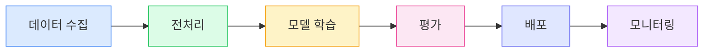

## 2. AI 윤리 4원칙 (중심 구조)

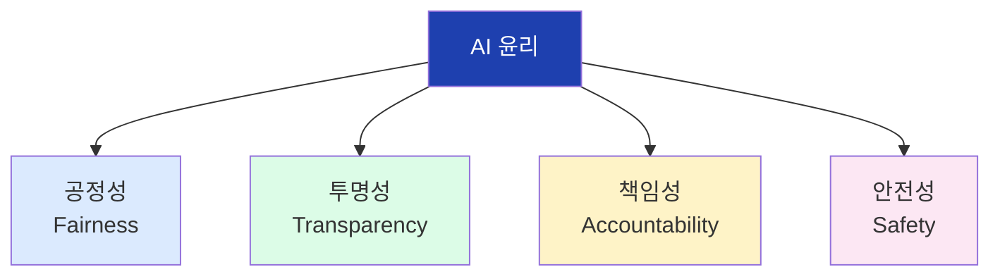

## 3. 공정성 원칙 상세

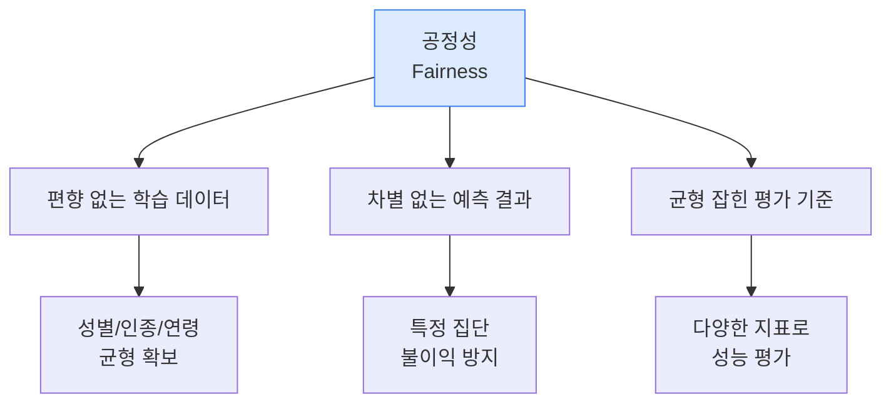

## 4. 투명성 원칙 상세

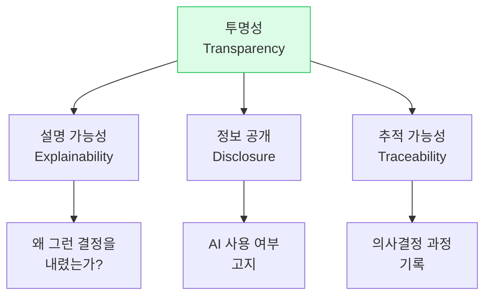

## 5. 책임성 원칙 상세

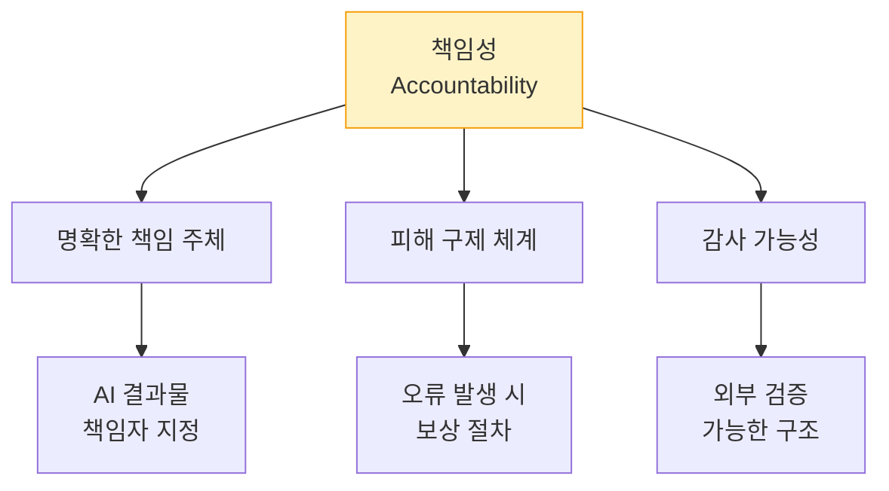

## 6. 안전성 원칙 상세

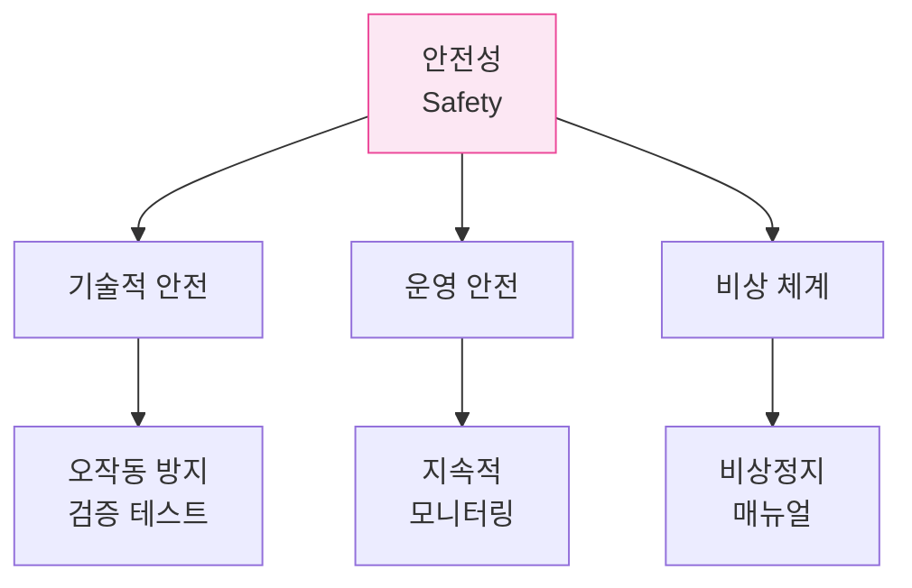

## 7. AI 편향 발생 과정

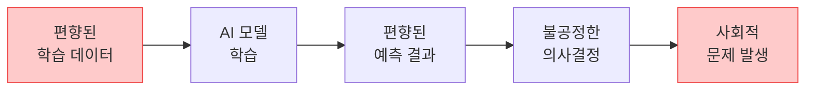

## 8. 아마존 채용 AI 편향 사례

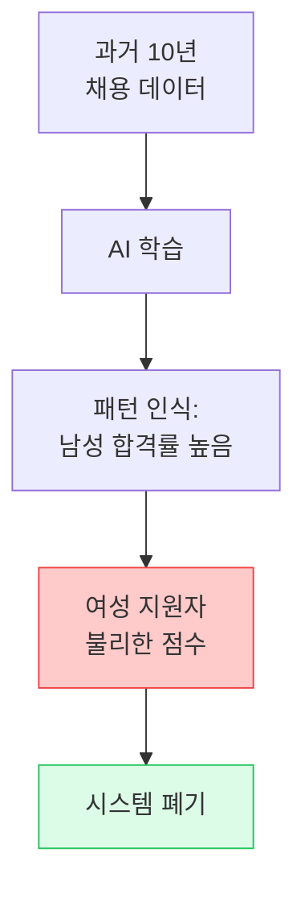

## 9. 블랙박스 vs 화이트박스 모델

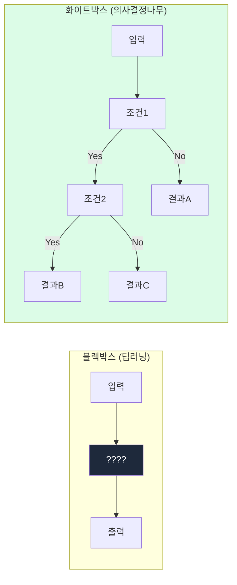

## 10. 책임 소재 체계도

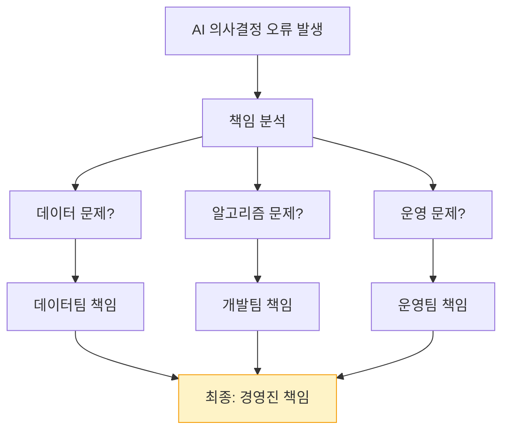

## 11. 데이터 보안 3대 영역

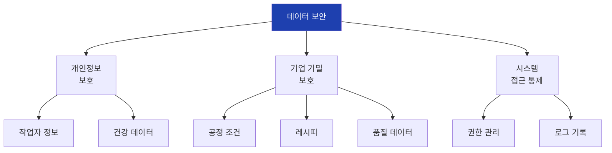

## 12. 삼성전자 ChatGPT 사건 흐름

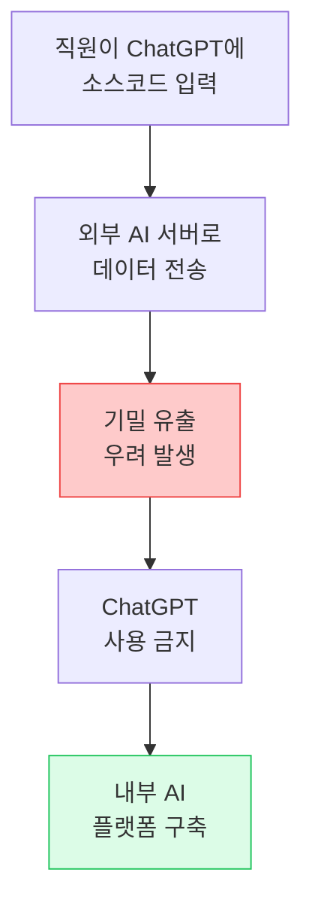

## 13. 내부자 위협 흐름

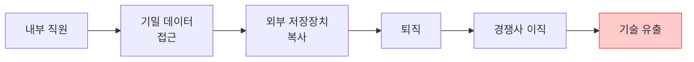

## 14. 공급망 공격 경로

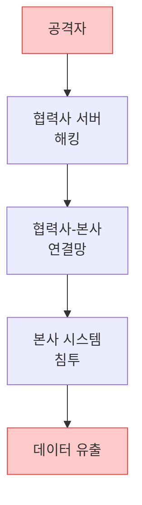

## 15. TSMC 바이러스 감염 사건

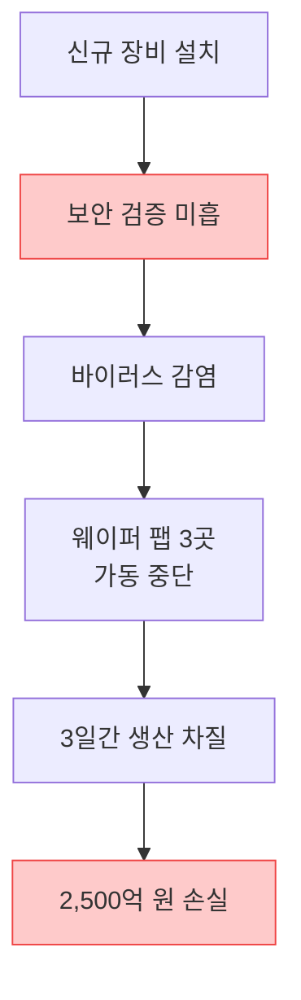

## 16. 보안 수준별 AI 활용 가이드

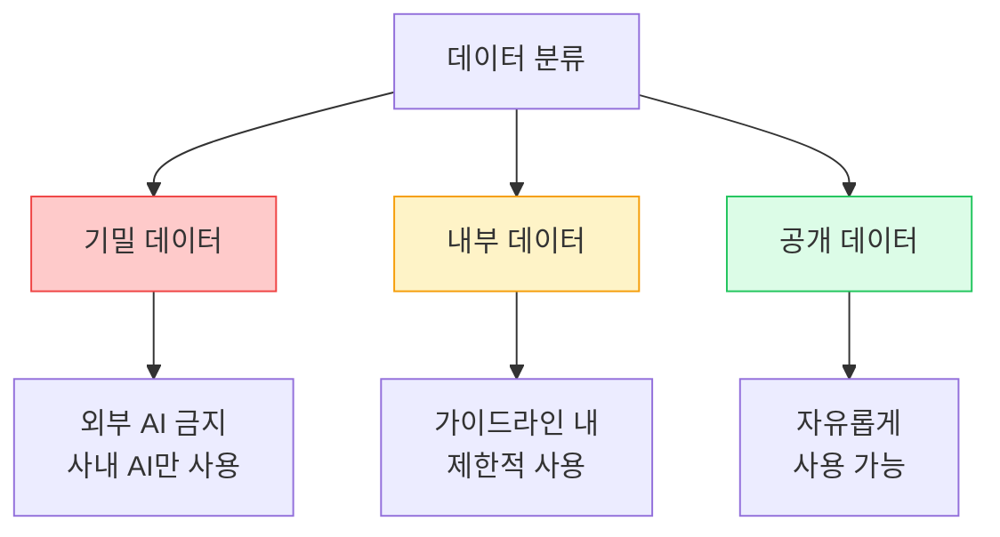

## 17. AI 저작권 논쟁 구조

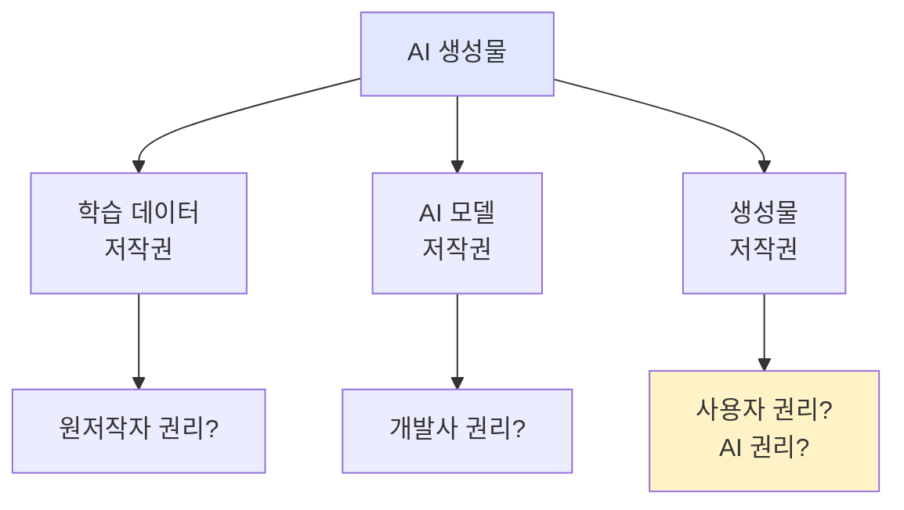

## 18. 주요 오픈소스 라이선스 비교

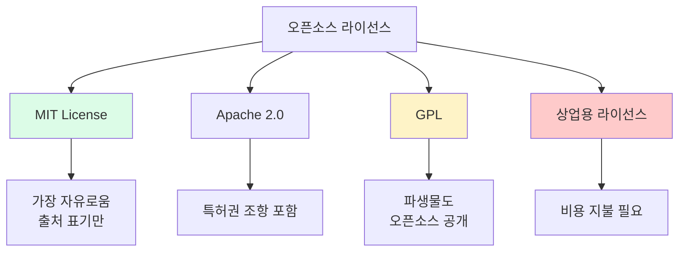

## 19. Getty vs Stability AI 소송 구조

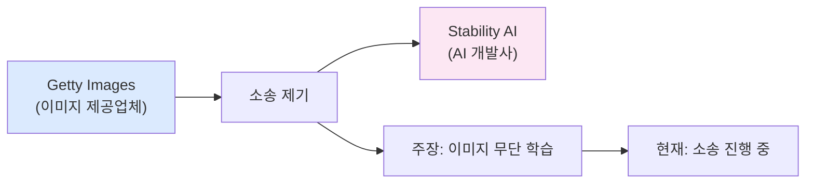

## 20. AI 윤리 점검 프로세스

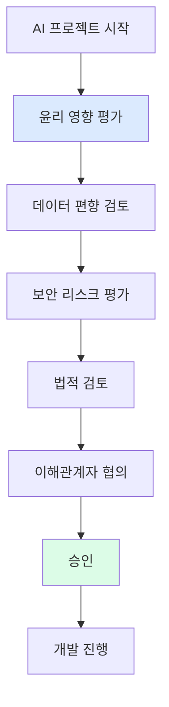

## 21. 국제 AI 윤리 가이드라인 비교

```mermaid
flowchart TD
    A["국제 AI 윤리 기준"]

    A --> B["EU AI Act<br>(2024)"]
    A --> C["한국 AI 윤리기준<br>(2020)"]
    A --> D["OECD AI 원칙<br>(2019)"]

    B --> B1["위험도별<br>규제 차등"]
    C --> C1["사람 중심<br>AI 강조"]
    D --> D1["인류 가치<br>존중"]

    style A fill:#1e40af,color:#fff
```

## 22. AI 위험도 분류 (EU AI Act)

```mermaid
flowchart TD
    A["AI 시스템 위험도"]

    A --> B["금지<br>Unacceptable"]
    A --> C["고위험<br>High-risk"]
    A --> D["제한적<br>Limited"]
    A --> E["최소<br>Minimal"]

    B --> B1["사회적 점수 시스템<br>실시간 생체인식"]
    C --> C1["채용, 신용평가<br>의료 진단 AI"]
    D --> D1["챗봇<br>(고지 의무)"]
    E --> E1["스팸 필터<br>게임 AI"]

    style B fill:#fecaca,stroke:#ef4444
    style C fill:#fef3c7,stroke:#f59e0b
    style D fill:#dbeafe,stroke:#3b82f6
    style E fill:#dcfce7,stroke:#22c55e
```

## 23. 제조업 AI 윤리 적용 영역

```mermaid
flowchart TD
    A["제조업 AI 활용"]

    A --> B["품질 예측"]
    A --> C["설비 이상 탐지"]
    A --> D["작업자 모니터링"]
    A --> E["공정 최적화"]

    B --> B1["공정성: 라인별<br>편향 확인"]
    C --> C1["안전성: 오경보<br>비율 관리"]
    D --> D1["개인정보: 동의<br>및 익명화"]
    E --> E1["투명성: 변경<br>이유 설명"]

    style A fill:#1e40af,color:#fff
```

## 24. AI 도입 체크리스트

```mermaid
flowchart TD
    A["AI 도입 전 체크리스트"]

    A --> B["1. 학습 데이터<br>편향 검토"]
    A --> C["2. 설명 가능성<br>확보"]
    A --> D["3. 책임자<br>지정"]
    A --> E["4. 보안 리스크<br>평가"]
    A --> F["5. 법적 준수<br>확인"]

    style A fill:#dbeafe
```

## 25. 1차시 핵심 요약

```mermaid
flowchart LR
    subgraph 윤리["AI 윤리 4원칙"]
        A1["공정성"]
        A2["투명성"]
        A3["책임성"]
        A4["안전성"]
    end

    subgraph 보안["데이터 보안 3영역"]
        B1["개인정보"]
        B2["기업 기밀"]
        B3["접근 통제"]
    end

    subgraph 법률["법적 이슈"]
        C1["저작권"]
        C2["라이선스"]
    end

    style 윤리 fill:#dbeafe
    style 보안 fill:#dcfce7
    style 법률 fill:#fef3c7
```

## 26. 다음 차시 연결

```mermaid
flowchart LR
    A["1차시<br>AI 윤리와<br>데이터 보호"]
    B["2차시<br>Python<br>시작하기"]
    C["3차시<br>제조 데이터<br>다루기 기초"]
    D["4차시<br>공개 데이터셋<br>확보"]

    A --> B --> C --> D

    style A fill:#dbeafe,stroke:#3b82f6
    style B fill:#dcfce7,stroke:#22c55e
```

## 27. 퀴즈: AI 윤리 원칙 매칭

```mermaid
flowchart LR
    subgraph 상황["상황"]
        Q1["AI 결정 이유를<br>설명할 수 있다"]
        Q2["특정 집단에<br>불이익이 없다"]
        Q3["문제 발생 시<br>책임자가 있다"]
        Q4["오작동 시<br>비상정지 가능"]
    end

    subgraph 원칙["원칙"]
        A1["투명성"]
        A2["공정성"]
        A3["책임성"]
        A4["안전성"]
    end

    Q1 -.-> A1
    Q2 -.-> A2
    Q3 -.-> A3
    Q4 -.-> A4
```

## 28. 토론 주제 구조

```mermaid
flowchart TD
    A["토론 주제"]

    A --> B["토론 1:<br>AI가 작업자 불량률<br>높다고 분석하면?"]
    A --> C["토론 2:<br>보안 vs 편의성<br>어떻게 균형?"]
    A --> D["토론 3:<br>AI 오판단 시<br>책임은 누구?"]

    B --> B1["공정성 관점"]
    C --> C1["위험 수준별 접근"]
    D --> D1["책임 체계 정의"]

    style A fill:#e0e7ff
```
