# [2차시] Python 시작하기 - 다이어그램 (보강판)

## 1. Python의 위치

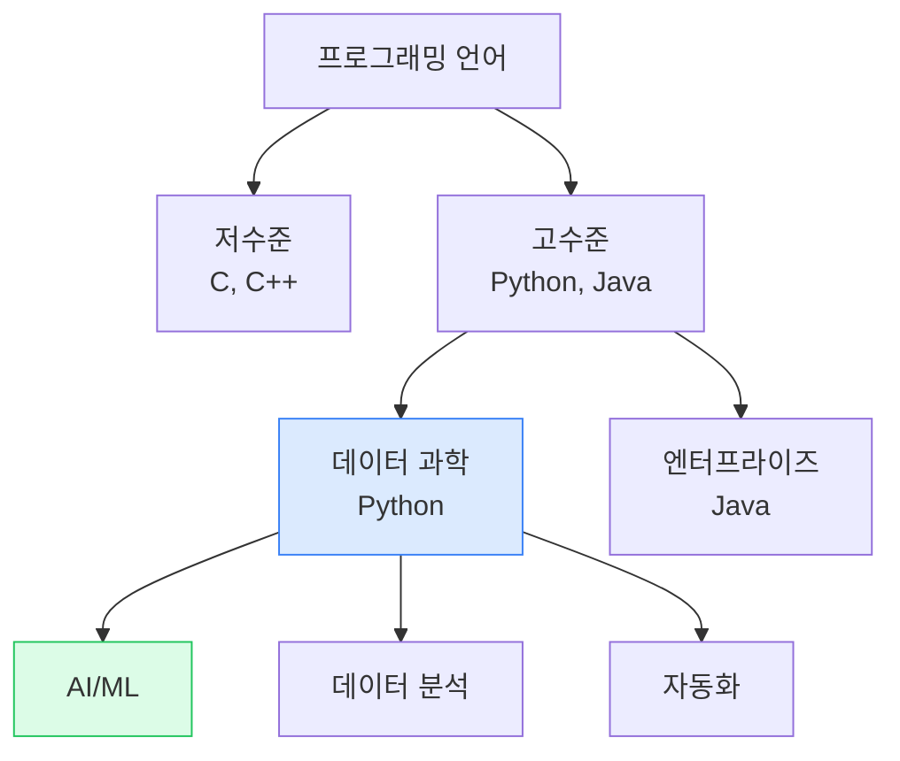

## 2. Python 사용 분야

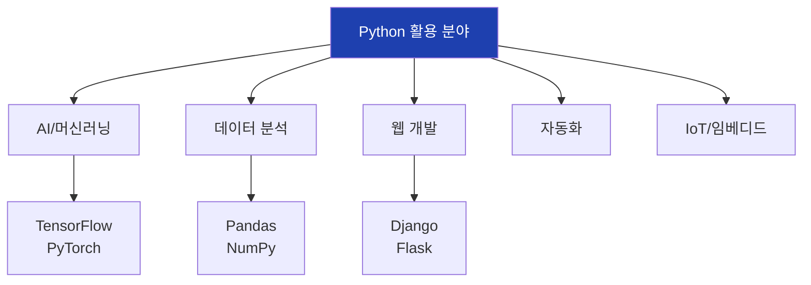

## 3. Python vs 다른 언어

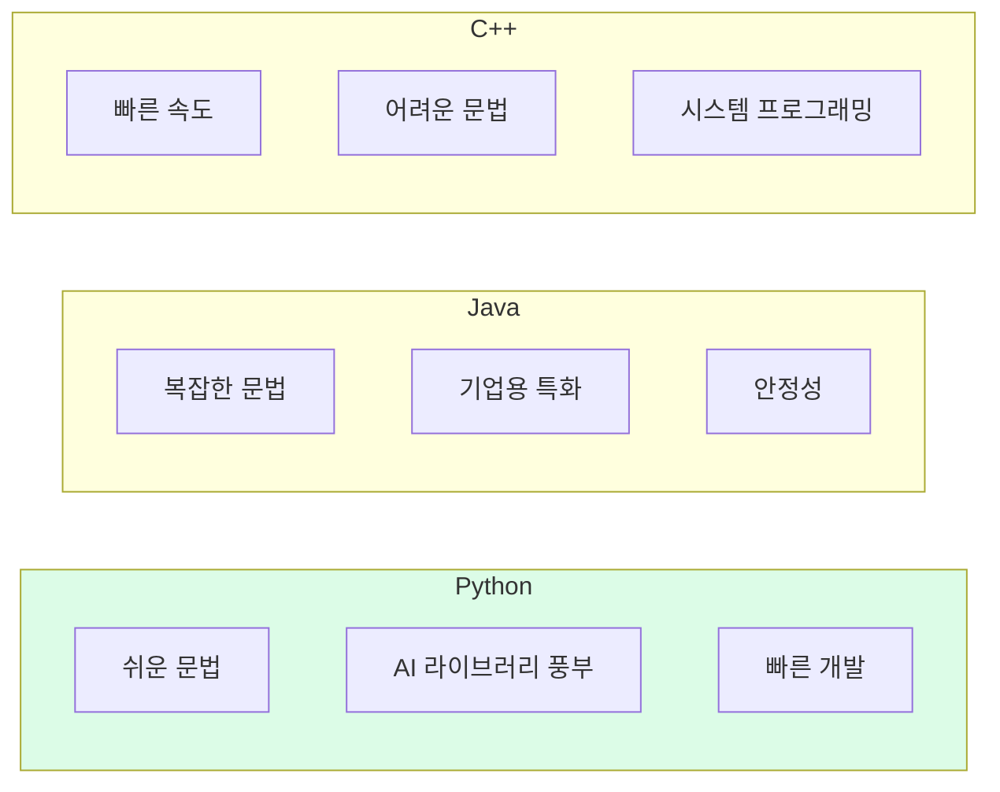

## 4. Hello World 비교

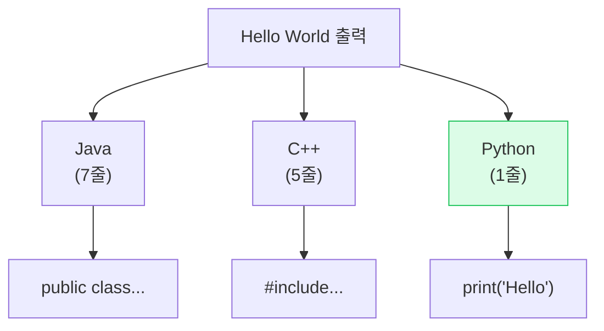

## 5. 개발 환경 구성

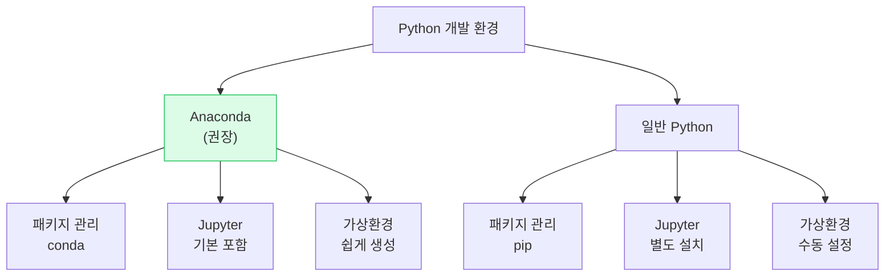

## 6. Anaconda 설치 과정

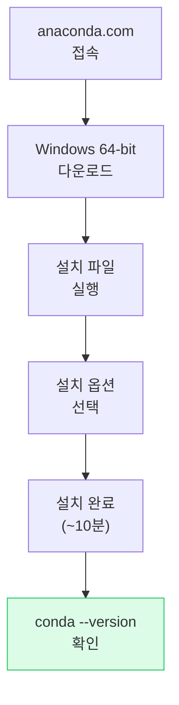

## 7. Jupyter Notebook 구조

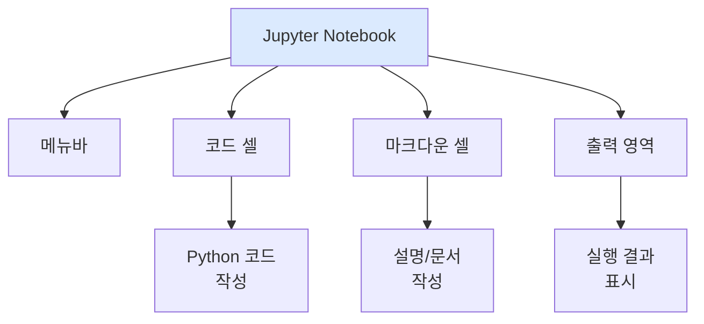

## 8. Jupyter 단축키

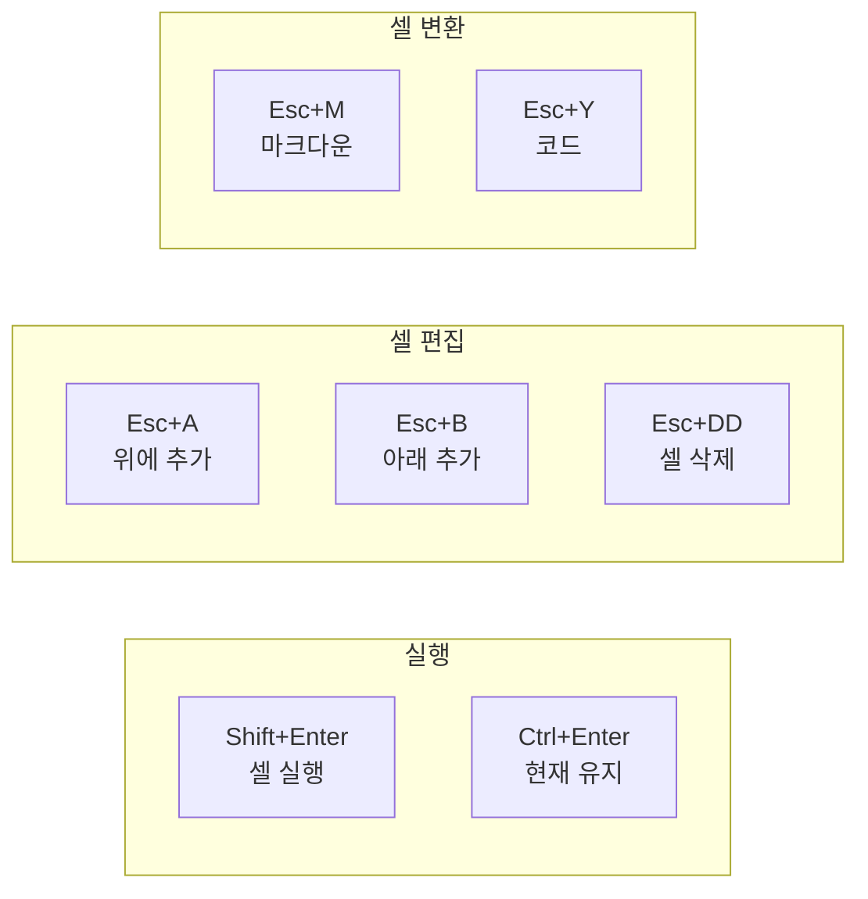

## 9. Python 5가지 자료형

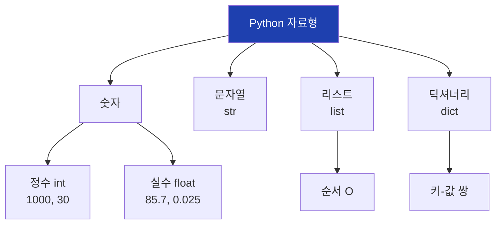

## 10. 정수와 실수

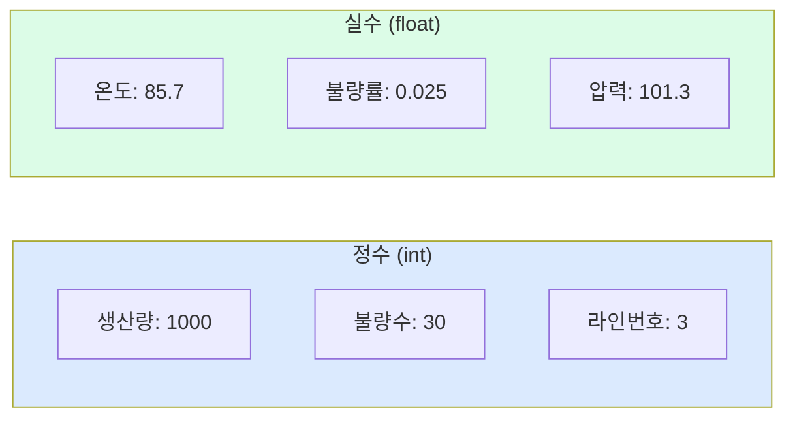

## 11. 문자열 (str)

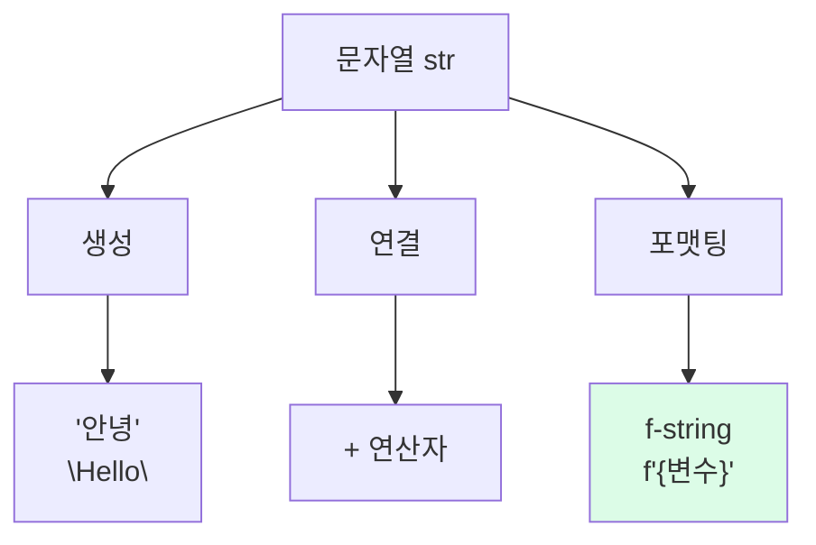

## 12. f-string 포맷팅

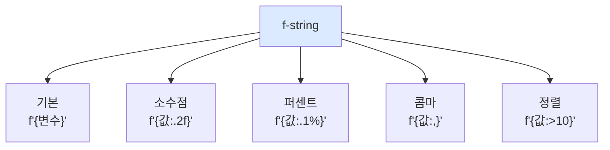

## 13. 리스트 (list)

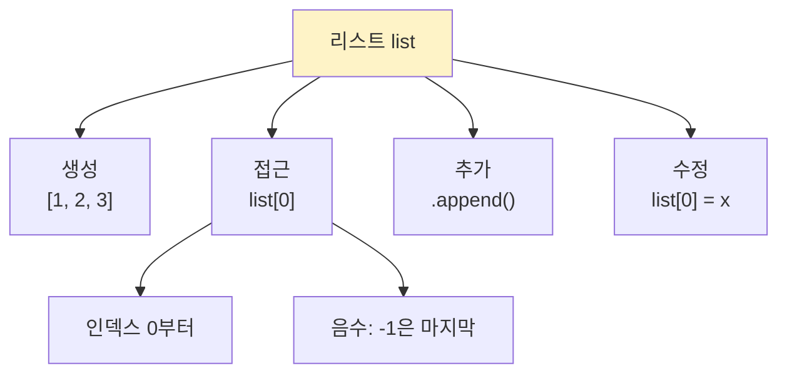

## 14. 리스트 인덱싱

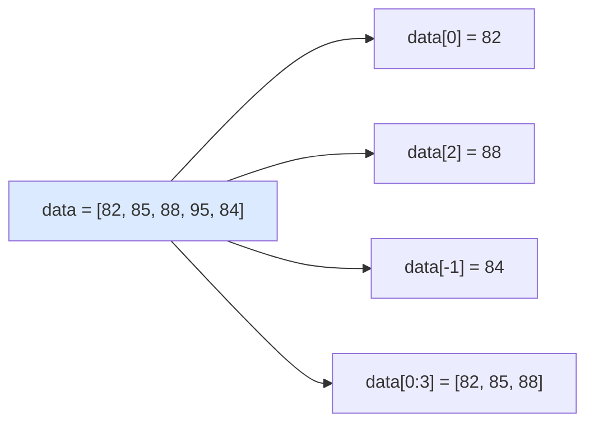

## 15. 딕셔너리 (dict)

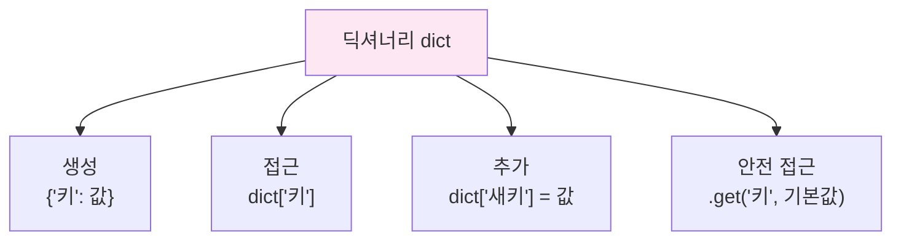

## 16. 딕셔너리 구조

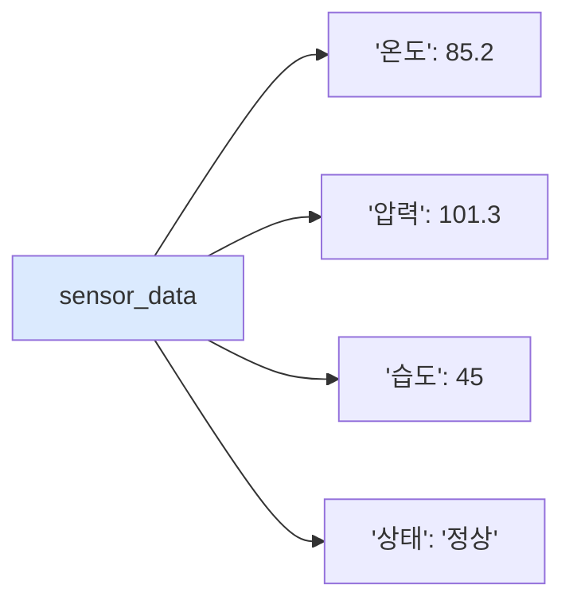

## 17. 조건문 if 구조

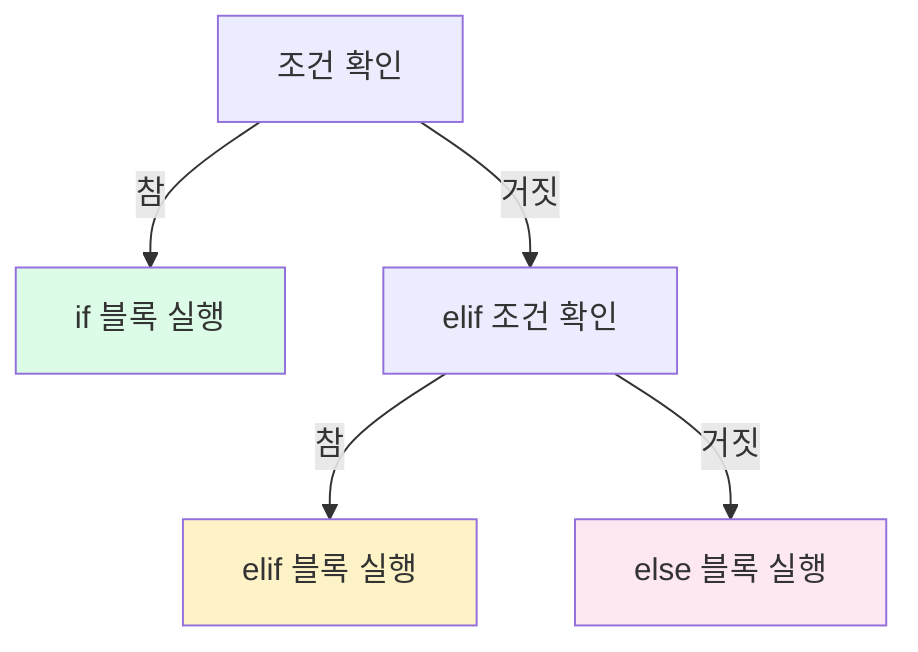

## 18. 품질 등급 판정 흐름

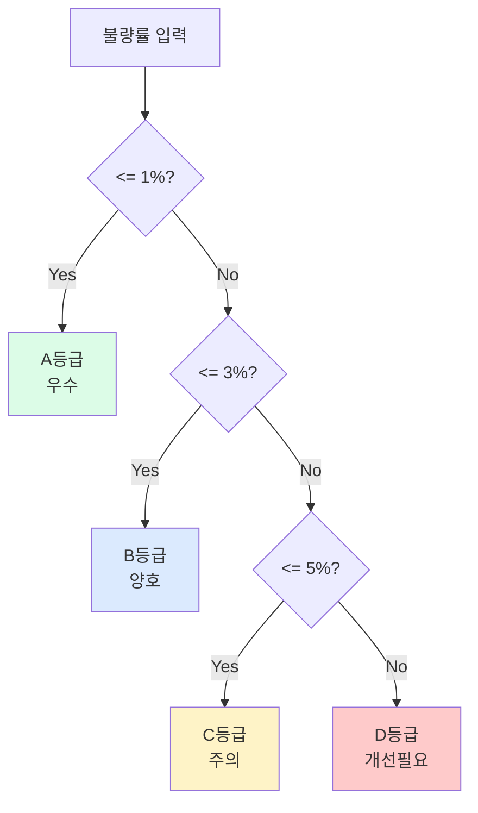

## 19. 반복문 for 구조

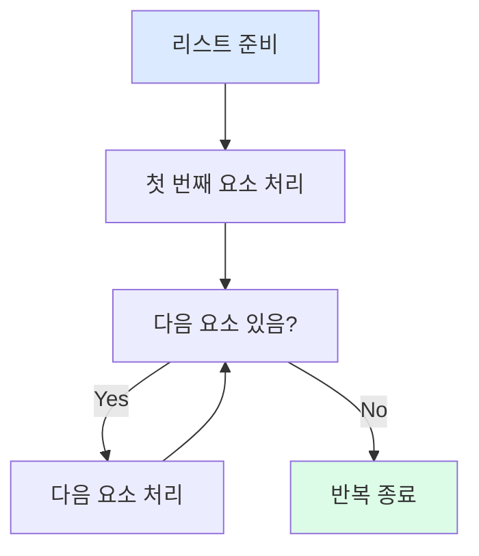

## 20. enumerate 함수

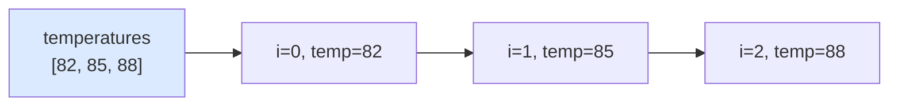

## 21. 제조 데이터 처리 흐름

```mermaid
flowchart TD
    A["센서 데이터<br>수집"]
    B["변수에<br>저장"]
    C["계산<br>불량률 등"]
    D["조건 판정<br>등급 부여"]
    E["결과<br>출력"]

    A --> B --> C --> D --> E

    style A fill:#dbeafe
    style E fill:#dcfce7
```

## 22. 설비 상태 관리 구조

```mermaid
flowchart TD
    A["equipment 딕셔너리"]

    A --> B["EQ-001"]
    A --> C["EQ-002"]
    A --> D["EQ-003"]

    B --> B1["온도: 82"]
    B --> B2["상태: 정상"]

    C --> C1["온도: 91"]
    C --> C2["상태: 주의"]

    D --> D1["온도: 85"]
    D --> D2["상태: 정상"]

    style A fill:#1e40af,color:#fff
```

## 23. 자주 하는 실수

```mermaid
flowchart TD
    A["자주 하는 실수"]

    A --> B["들여쓰기<br>누락"]
    A --> C["콜론(:)<br>누락"]
    A --> D["= vs ==<br>혼동"]
    A --> E["인덱스<br>범위 초과"]

    B --> B1["IndentationError"]
    C --> C1["SyntaxError"]
    D --> D1["할당 vs 비교"]
    E --> E1["IndexError"]

    style A fill:#fecaca
```

## 24. 에러 해결 과정

```mermaid
flowchart TD
    A["에러 발생"]
    B["에러 메시지<br>읽기"]
    C["print로<br>값 확인"]
    D["구글 검색"]
    E["해결책 적용"]
    F["정상 동작"]

    A --> B --> C --> D --> E --> F

    style F fill:#dcfce7
```

## 25. 2차시 학습 흐름

```mermaid
flowchart LR
    A["환경 설정<br>Anaconda"]
    B["자료형<br>5가지"]
    C["제어문<br>if, for"]
    D["실습<br>제조 데이터"]

    A --> B --> C --> D

    style A fill:#dbeafe
    style D fill:#dcfce7
```

## 26. 다음 차시 연결

```mermaid
flowchart LR
    A["2차시<br>Python 기초"]
    B["3차시<br>NumPy/Pandas"]
    C["4차시<br>공개 데이터"]

    A --> B --> C

    style A fill:#dbeafe
    style B fill:#dcfce7
```

## 27. 함수 정의 구조

```mermaid
flowchart TD
    A["def 함수명(매개변수):"]
    B["들여쓰기된<br>코드 블록"]
    C["return 반환값"]

    A --> B --> C

    D["함수 호출<br>함수명(인자)"]
    D --> E["결과 반환"]

    style A fill:#dbeafe
    style E fill:#dcfce7
```

## 28. Python 학습 로드맵

```mermaid
flowchart TD
    A["Python 기초"]

    A --> B["자료형"]
    A --> C["제어문"]
    A --> D["함수"]

    B & C & D --> E["NumPy/Pandas"]

    E --> F["시각화<br>Matplotlib"]
    E --> G["머신러닝<br>Scikit-learn"]

    F & G --> H["딥러닝<br>TensorFlow/PyTorch"]

    style A fill:#dbeafe
    style H fill:#dcfce7
```
