# [3차시] 제조 데이터 다루기 기초 - 다이어그램 (보강판)

## 1. NumPy와 Pandas 역할 비교

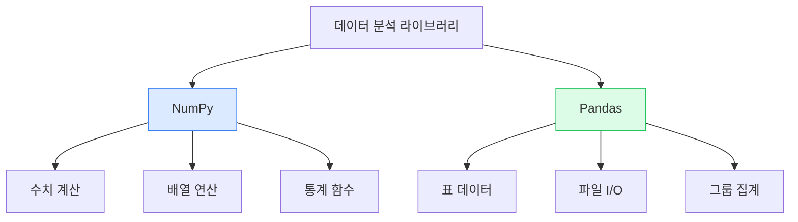

## 2. NumPy 배열 구조

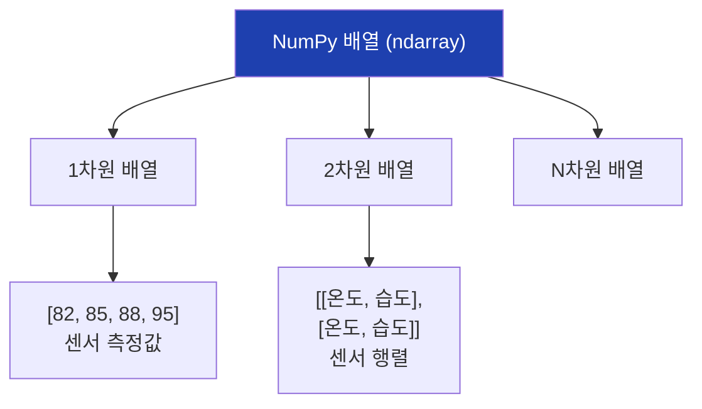

## 3. NumPy vs Python 리스트 속도

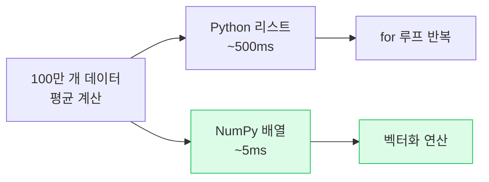

## 4. NumPy 배열 생성 방법

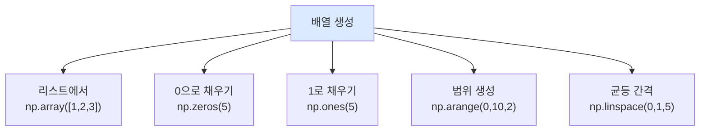

## 5. NumPy 인덱싱

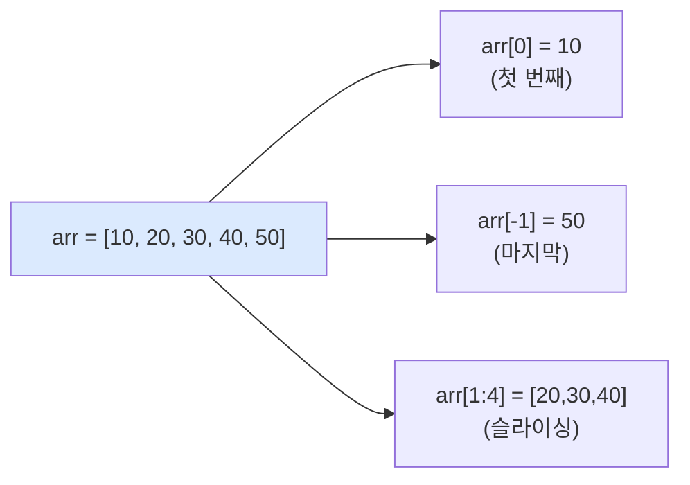

## 6. NumPy 조건 필터링

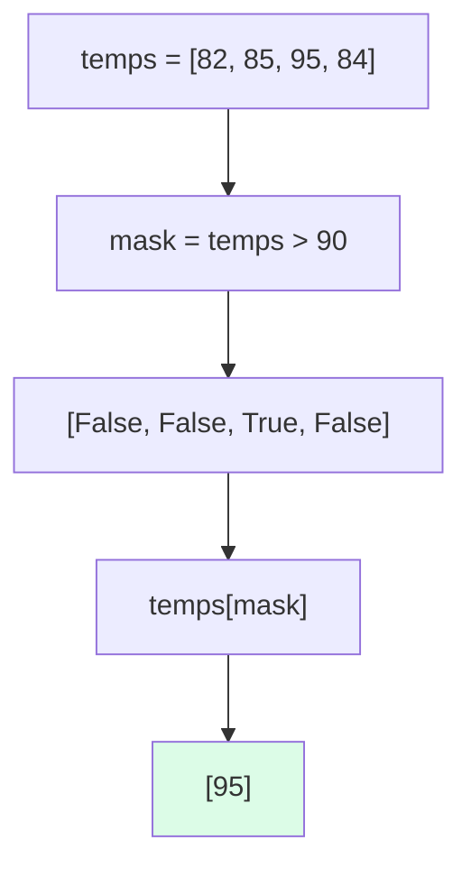

## 7. NumPy 통계 함수

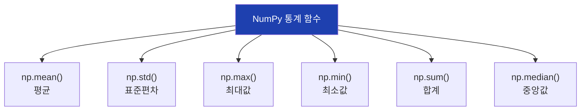

## 8. Pandas 핵심 객체

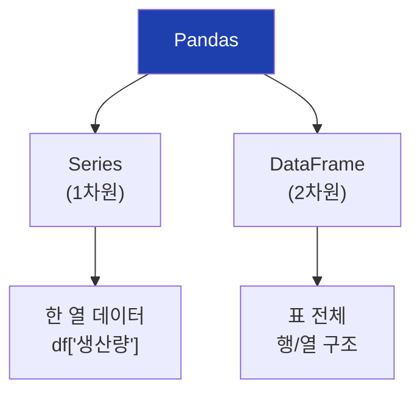

## 9. DataFrame 구조

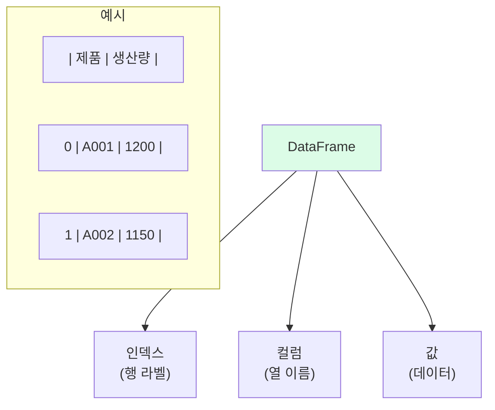

## 10. DataFrame 생성 방법

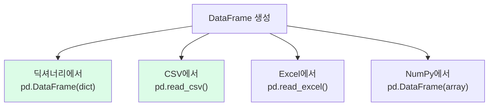

## 11. DataFrame 탐색 메서드

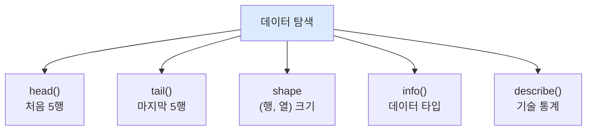

## 12. 열 선택 방법

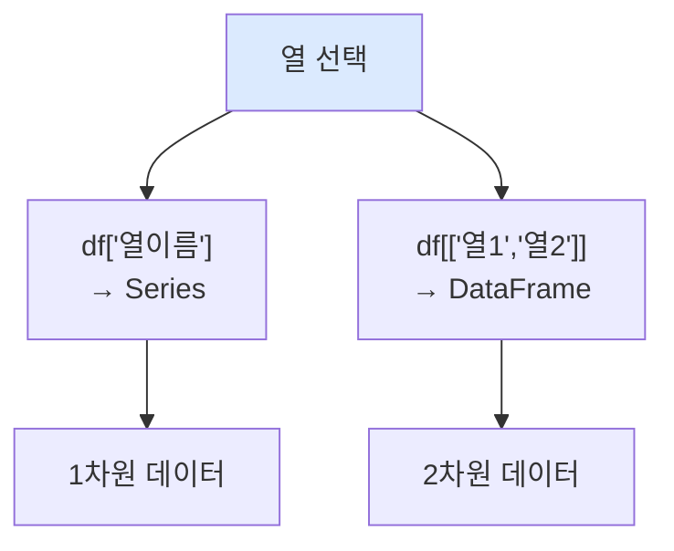

## 13. loc vs iloc

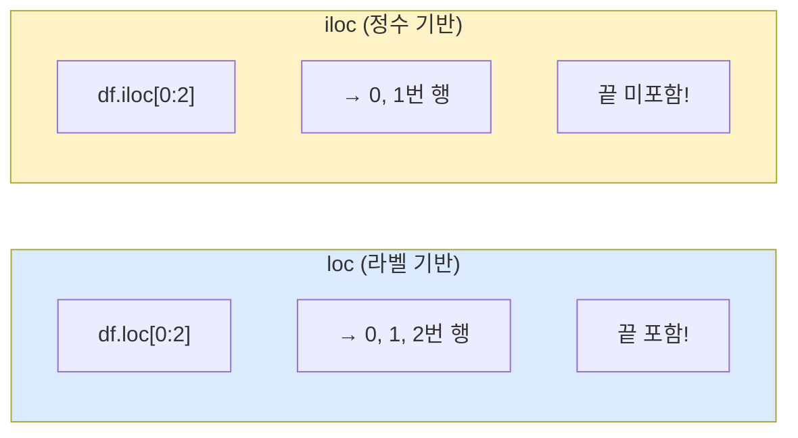

## 14. 조건 필터링 구조

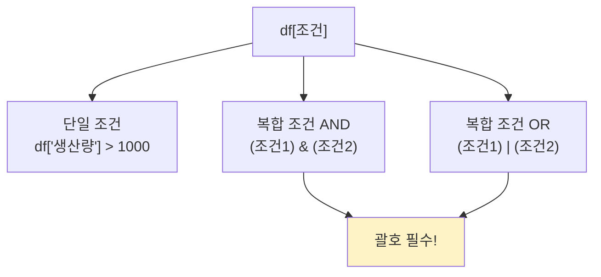

## 15. 새 열 추가

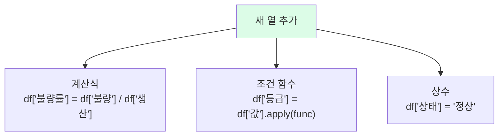

## 16. groupby 집계 흐름

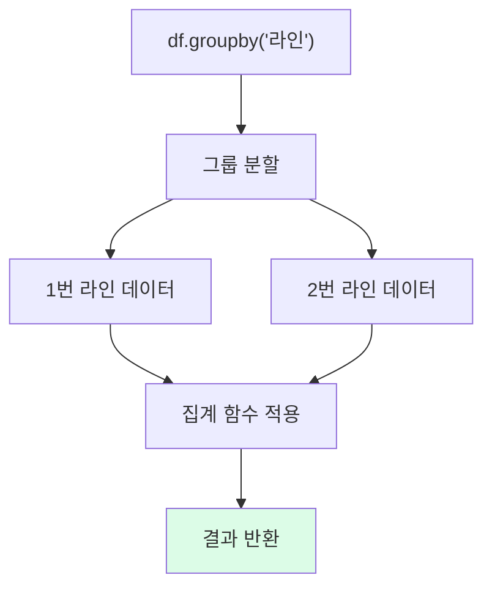

## 17. 집계 함수 종류

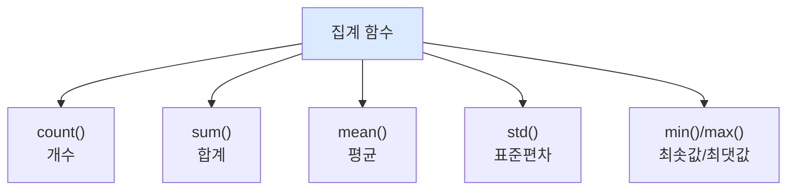

## 18. 결측치 처리 흐름

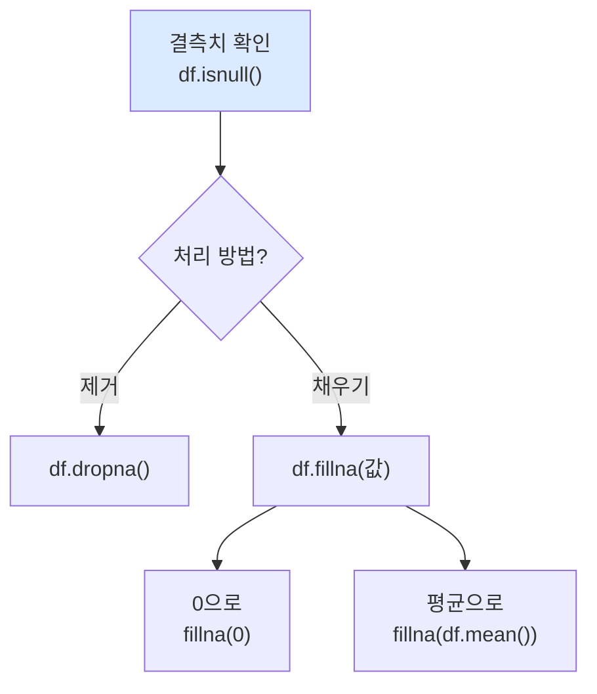

## 19. CSV 파일 처리


## 20. 정렬 방법

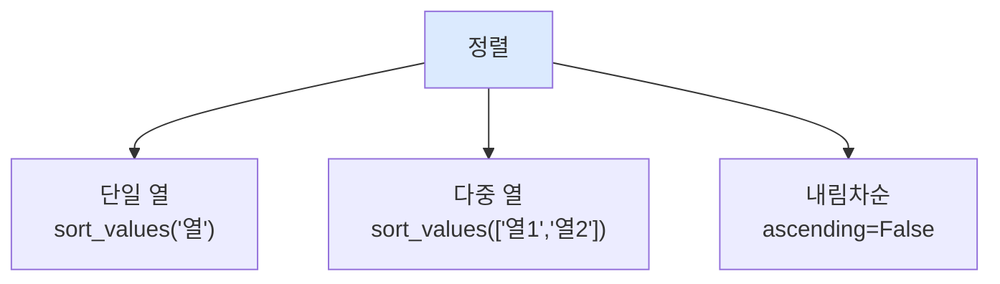

## 21. 제조 데이터 분석 흐름

```mermaid
flowchart TD
    A["데이터 로드<br>read_csv()"]
    B["탐색<br>head, info"]
    C["파생변수<br>불량률 계산"]
    D["필터링<br>이상 데이터"]
    E["집계<br>groupby"]
    F["보고서<br>출력"]

    A --> B --> C --> D --> E --> F

    style A fill:#dbeafe
    style F fill:#dcfce7
```

## 22. 불량률 계산

```mermaid
flowchart LR
    A["불량수"]
    B["생산량"]
    C["불량률"]
    D["등급"]

    A --> C
    B --> C
    C --> D

    C -->|"불량수 / 생산량"| C
    D -->|"A/B/C 분류"| D

    style C fill:#fef3c7
    style D fill:#dcfce7
```

## 23. 라인별 분석 구조

```mermaid
flowchart TD
    A["전체 데이터"]

    A --> B["1번 라인"]
    A --> C["2번 라인"]
    A --> D["3번 라인"]

    B --> B1["평균 생산량"]
    B --> B2["평균 불량률"]

    C --> C1["평균 생산량"]
    C --> C2["평균 불량률"]

    D --> D1["평균 생산량"]
    D --> D2["평균 불량률"]

    style A fill:#1e40af,color:#fff
```

## 24. 이상 데이터 탐지

```mermaid
flowchart TD
    A["데이터"]

    A --> B{"불량률 > 5%?"}

    B -->|Yes| C["이상 데이터"]
    B -->|No| D["정상 데이터"]

    C --> E["원인 분석"]
    C --> F["조치 필요"]

    style C fill:#fecaca
    style D fill:#dcfce7
```

## 25. 3차시 학습 흐름

```mermaid
flowchart LR
    A["NumPy<br>배열/통계"]
    B["Pandas<br>DataFrame"]
    C["데이터 탐색"]
    D["필터/집계"]
    E["보고서"]

    A --> B --> C --> D --> E

    style A fill:#dbeafe
    style E fill:#dcfce7
```

## 26. 다음 차시 연결

```mermaid
flowchart LR
    A["3차시<br>NumPy/Pandas"]
    B["4차시<br>공개 데이터셋"]
    C["5차시<br>기술통계/시각화"]

    A --> B --> C

    style A fill:#dbeafe
    style B fill:#dcfce7
```

## 27. 자주 하는 실수

```mermaid
flowchart TD
    A["자주 하는 실수"]

    A --> B["df['열'] vs df[['열']]<br>Series vs DataFrame"]
    A --> C["and/or 대신<br>& | 사용"]
    A --> D["조건 괄호 누락<br>(조건1) & (조건2)"]
    A --> E["loc vs iloc<br>끝 포함 여부"]

    style A fill:#fecaca
```

## 28. 핵심 메서드 정리

```mermaid
flowchart TD
    subgraph NumPy
        N1["np.array()"]
        N2["mean, max, min"]
        N3["arr[조건]"]
    end

    subgraph Pandas
        P1["pd.DataFrame()"]
        P2["read_csv()"]
        P3["groupby()"]
        P4["head, info, describe"]
    end

    style NumPy fill:#dbeafe
    style Pandas fill:#dcfce7
```
