# [4차시] 공개 데이터셋 확보 및 데이터 생태계 이해 - 다이어그램

## 1. 공공데이터 정의 요소

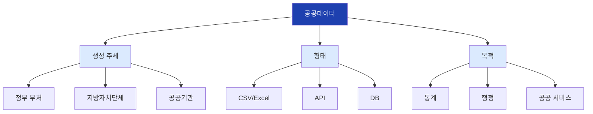

## 2. 공공기관의 범위

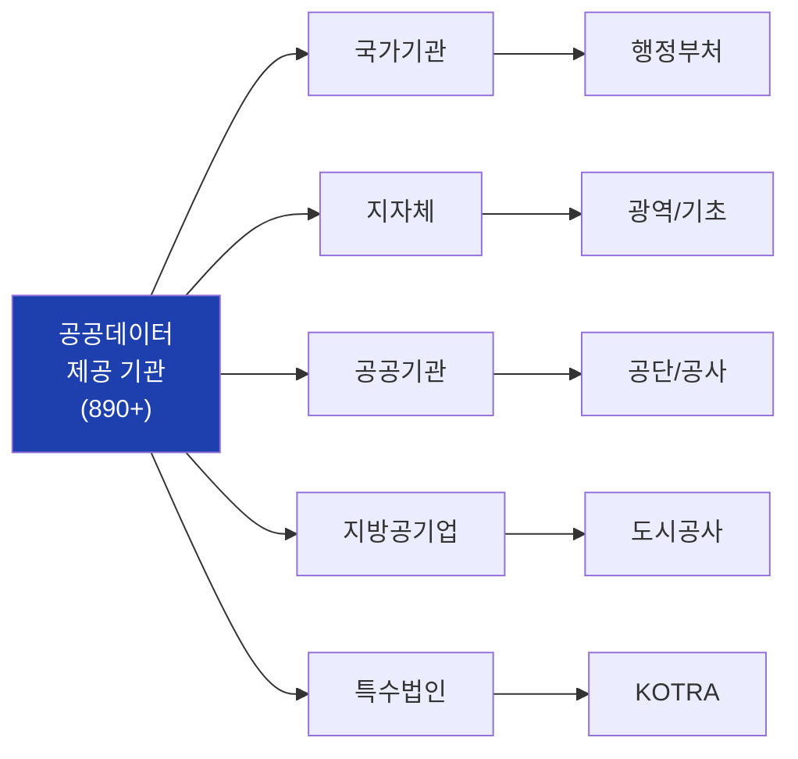

## 3. 공공데이터의 종류

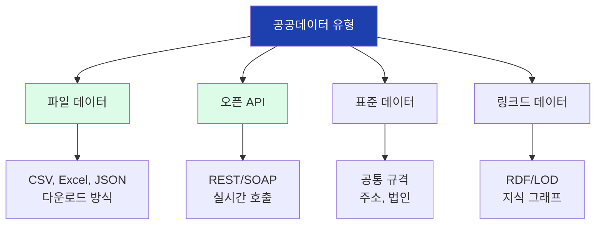

## 4. 공공데이터 제공 5대 원칙

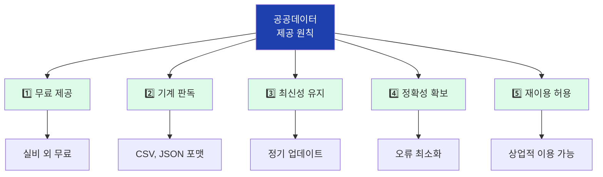

## 5. AI 학습 데이터 파이프라인

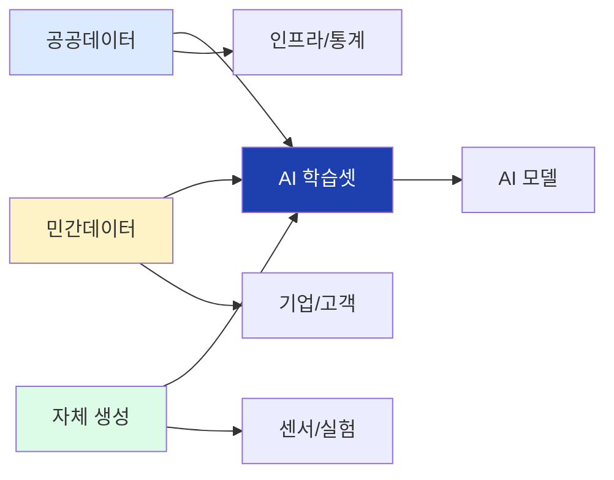

## 6. 공공데이터 활용 예시

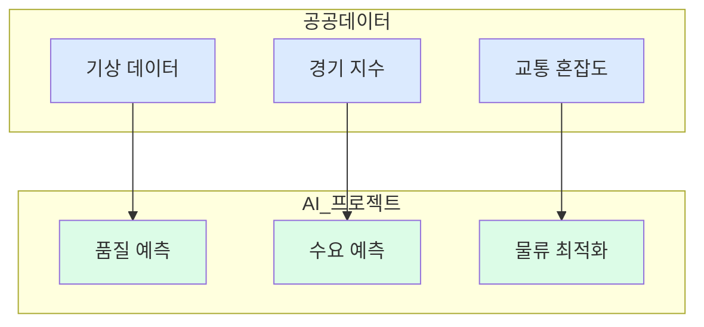

## 7. 국내 4대 데이터 포털

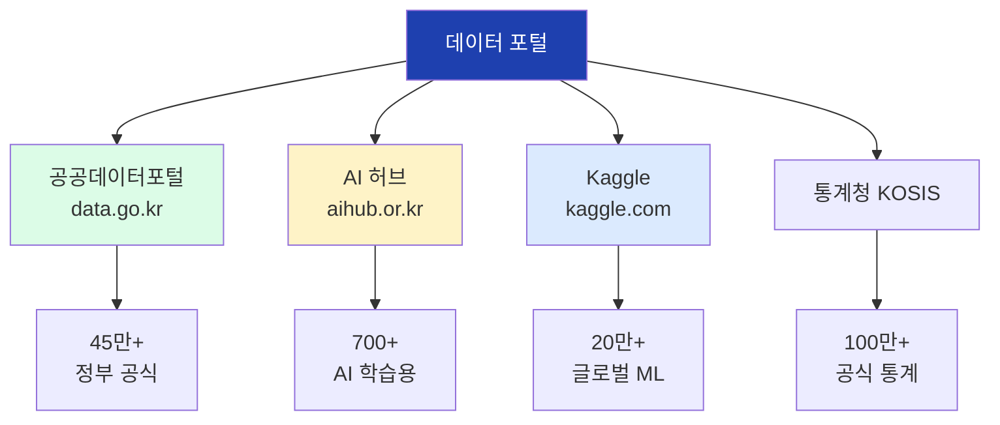

## 8. 공공데이터포털 데이터 구성

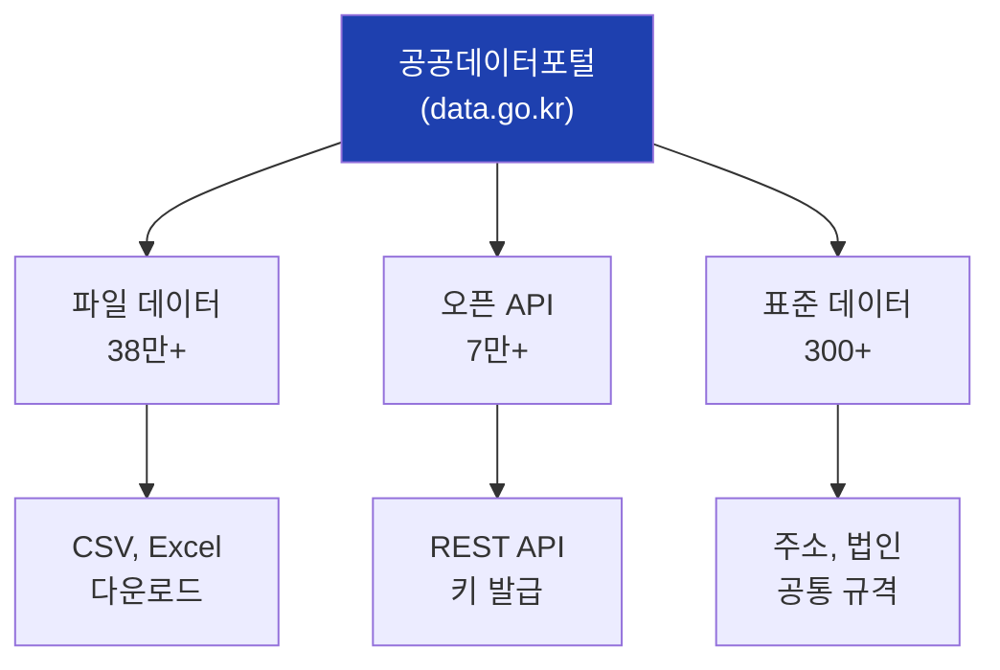

## 9. AI 허브 데이터 카테고리

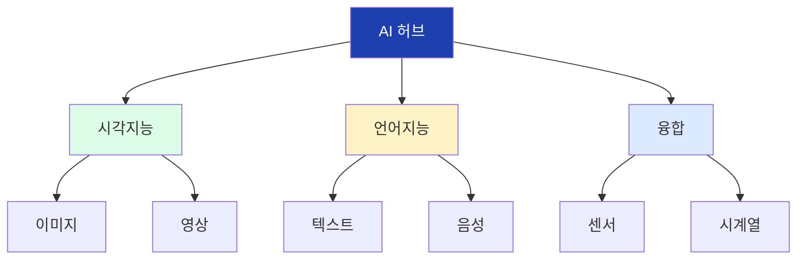

## 10. AI 허브 제조 데이터셋

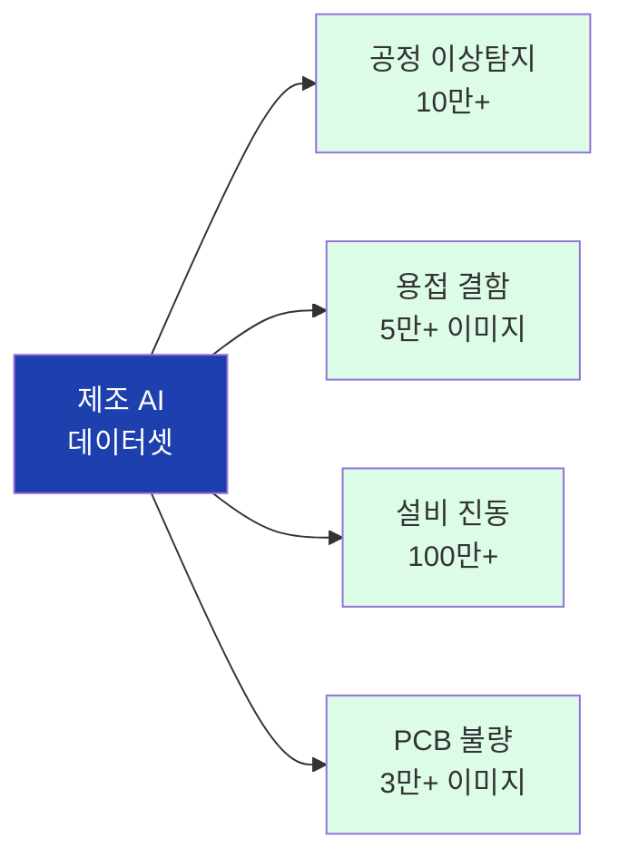

## 11. AI 허브 데이터 패키지 구조

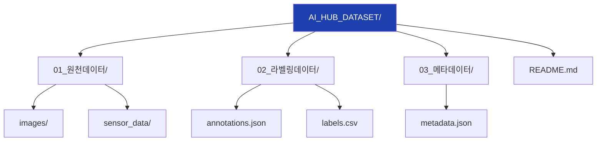

## 12. Kaggle 핵심 기능

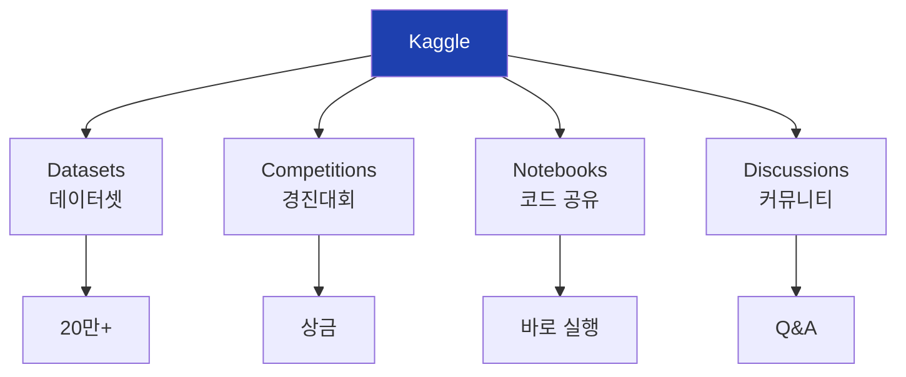

## 13. 포털 선택 가이드

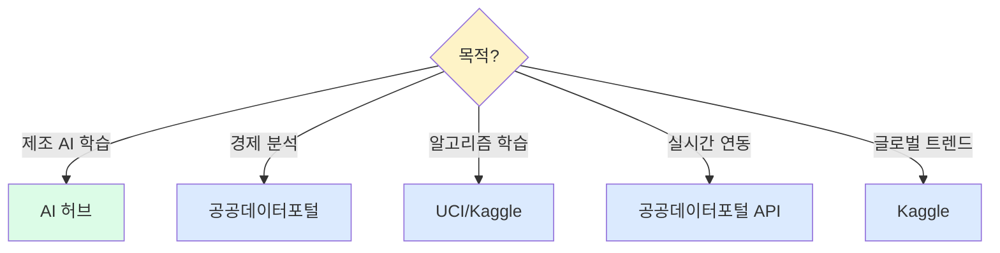

## 14. 테이블 데이터 구조

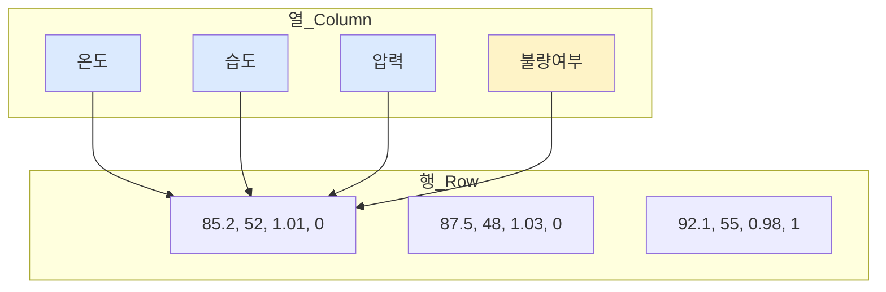

## 15. 행(Row) 관련 용어

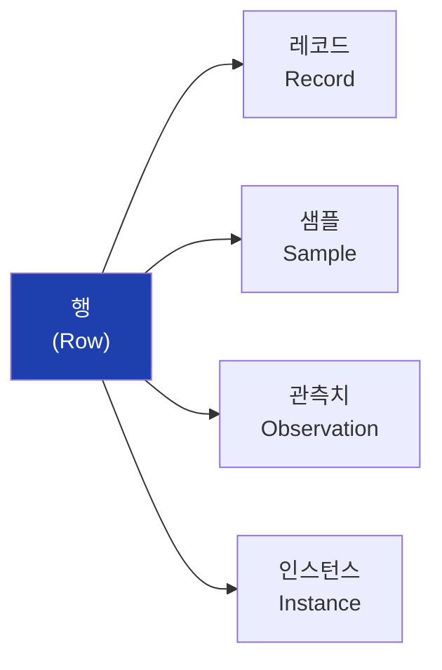

## 16. 열(Column) 관련 용어

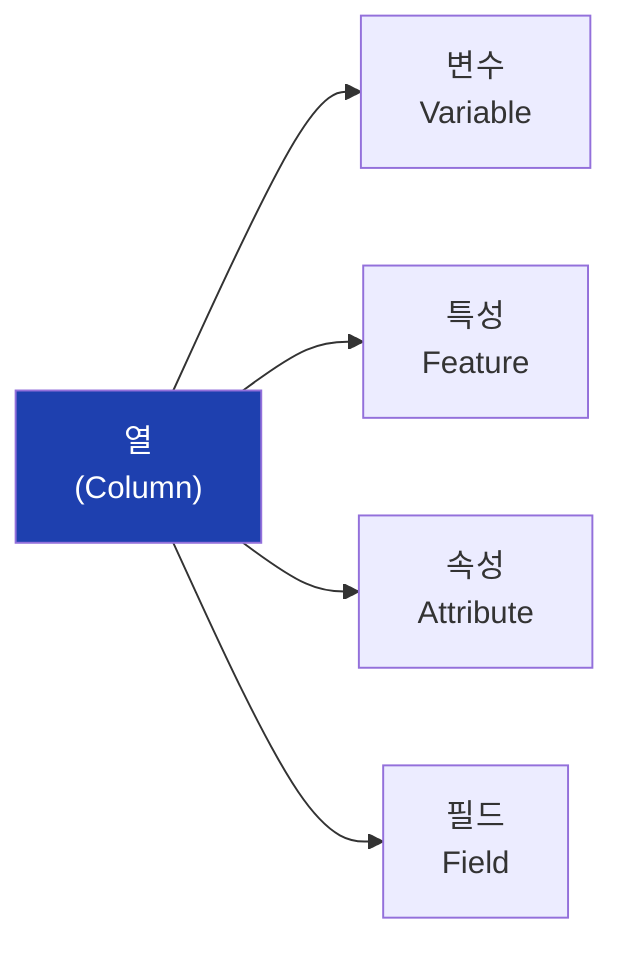

## 17. 독립변수 vs 종속변수

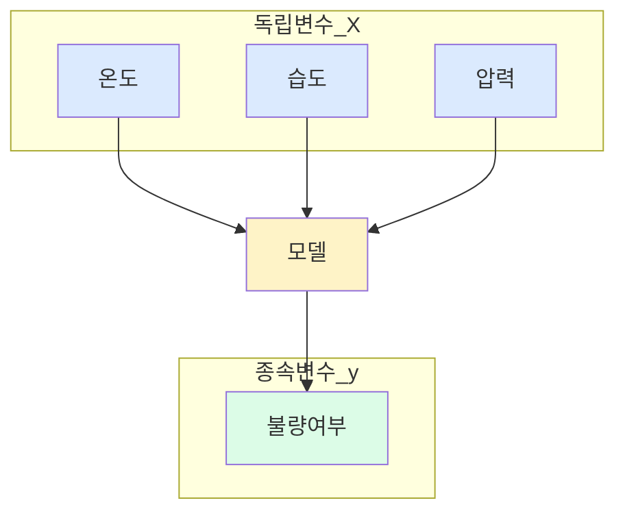

## 18. 변수의 데이터 타입

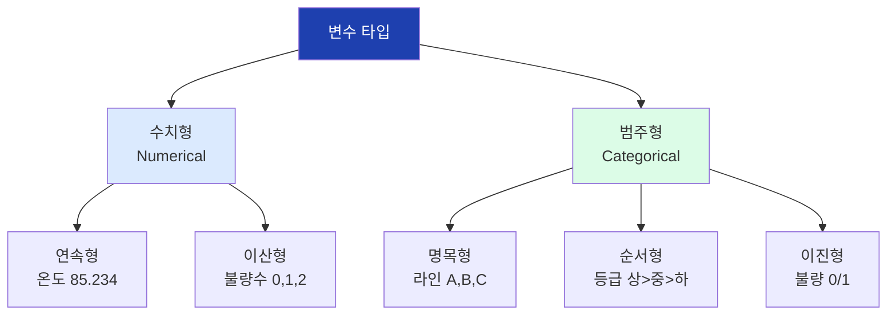

## 19. 데이터 품질 이슈

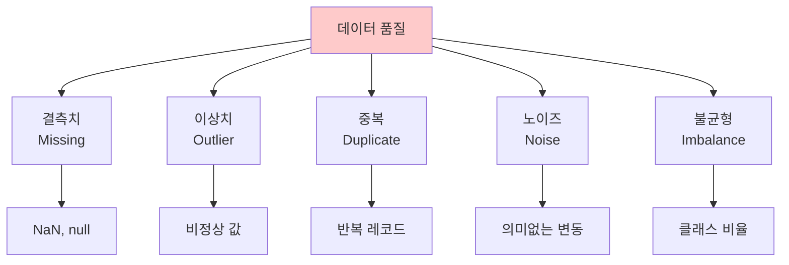

## 20. 데이터셋 분할

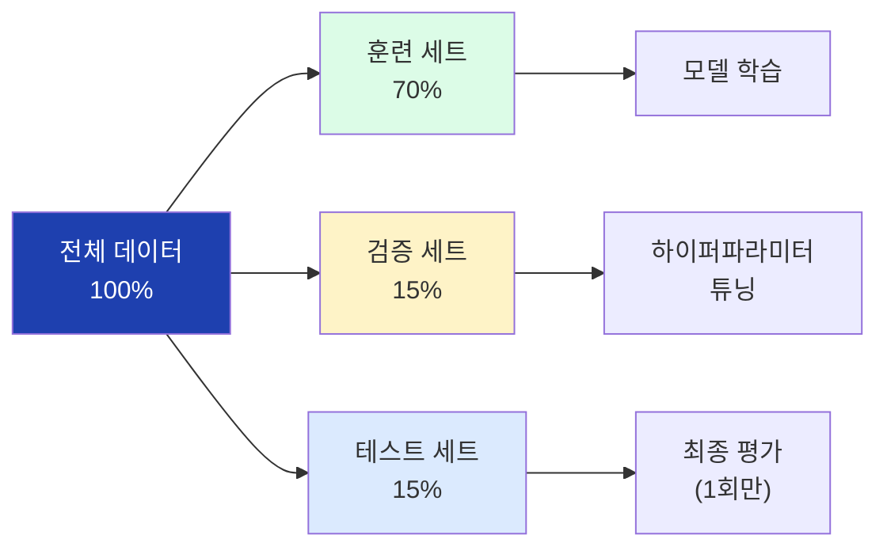

## 21. CSV 파일 구조

```mermaid
flowchart TD
    A["CSV 파일"]

    A --> B["Header<br>(첫 행)"]
    A --> C["Delimiter<br>(구분자)"]
    A --> D["Encoding<br>(인코딩)"]

    B --> B1["온도,습도,압력"]
    C --> C1["쉼표(,) 또는 탭(\\t)"]
    D --> D1["UTF-8 또는 CP949"]

    style A fill:#1e40af,color:#fff
```

## 22. JSON 파일 구조

```mermaid
flowchart TD
    A["JSON 파일"]

    A --> B["Key<br>(키)"]
    A --> C["Value<br>(값)"]
    A --> D["Nested<br>(중첩)"]

    B --> B1["'temperature'"]
    C --> C1["85.2"]
    D --> D1["{'sensor': {'temp': 85}}"]

    style A fill:#1e40af,color:#fff
```

## 23. 메타데이터 구조

```mermaid
flowchart TD
    A["메타데이터"]

    A --> B["name<br>데이터 이름"]
    A --> C["version<br>버전"]
    A --> D["rows/columns<br>크기"]
    A --> E["schema<br>컬럼 정의"]
    A --> F["license<br>라이선스"]

    style A fill:#1e40af,color:#fff
```

## 24. 라이선스 비교

```mermaid
flowchart TD
    A["데이터 라이선스"]

    A --> B["CC0<br>퍼블릭도메인"]
    A --> C["CC-BY"]
    A --> D["CC-BY-NC"]
    A --> E["공공누리"]

    B --> B1["자유 이용"]
    C --> C1["출처 표시"]
    D --> D1["비영리만"]
    E --> E1["유형별 상이"]

    style A fill:#1e40af,color:#fff
    style B fill:#dcfce7
    style C fill:#dcfce7
    style D fill:#fef3c7
    style E fill:#dbeafe
```

## 25. 데이터 다운로드 흐름

```mermaid
flowchart TD
    A["포털 접속"]
    B["회원 가입/로그인"]
    C["데이터 검색"]
    D["다운로드/API 신청"]
    E["데이터 확보"]
    F["구조 확인"]
    G["분석 시작"]

    A --> B --> C --> D --> E --> F --> G

    style A fill:#dbeafe
    style E fill:#dcfce7
    style G fill:#1e40af,color:#fff
```

## 26. 데이터 구조 확인 체크리스트

```mermaid
flowchart TD
    A["데이터 확인"]

    A --> B["1. shape<br>크기"]
    A --> C["2. columns<br>컬럼 목록"]
    A --> D["3. dtypes<br>데이터 타입"]
    A --> E["4. isnull<br>결측치"]
    A --> F["5. describe<br>기술통계"]

    style A fill:#1e40af,color:#fff
    style B fill:#dcfce7
    style C fill:#dcfce7
    style D fill:#dcfce7
    style E fill:#fef3c7
    style F fill:#dcfce7
```

## 27. 용어 매핑

```mermaid
flowchart LR
    subgraph 한국어
        K1["행"]
        K2["열"]
        K3["독립변수"]
        K4["종속변수"]
    end

    subgraph 영어
        E1["Row/Record"]
        E2["Column/Feature"]
        E3["X/Input"]
        E4["y/Target"]
    end

    K1 --> E1
    K2 --> E2
    K3 --> E3
    K4 --> E4

    style K1 fill:#dbeafe
    style K2 fill:#dbeafe
    style K3 fill:#dbeafe
    style K4 fill:#dbeafe
```

## 28. 4차시 학습 흐름

```mermaid
flowchart LR
    A["공공데이터<br>정의"]
    B["포털<br>특성"]
    C["데이터<br>용어"]
    D["실습:<br>다운로드"]
    E["5차시:<br>시각화"]

    A --> B --> C --> D --> E

    style A fill:#dbeafe
    style B fill:#dcfce7
    style C fill:#fef3c7
    style D fill:#dcfce7
    style E fill:#1e40af,color:#fff
```
