# [5차시] 기초 기술통계량과 탐색적 시각화 - 다이어그램

## 1. 대표값의 종류

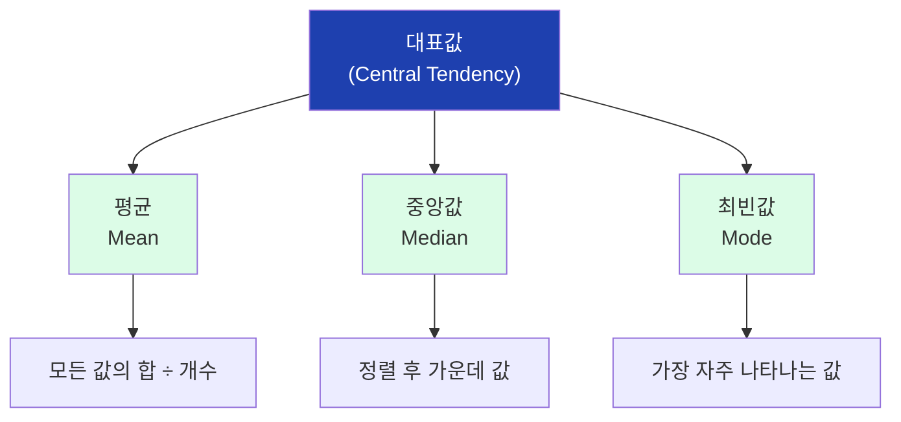

## 2. 평균의 계산

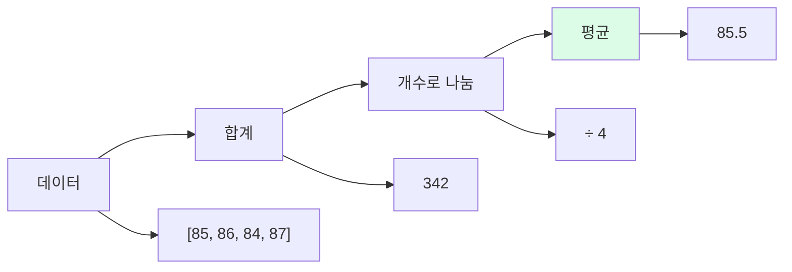

## 3. 평균의 이상치 민감성

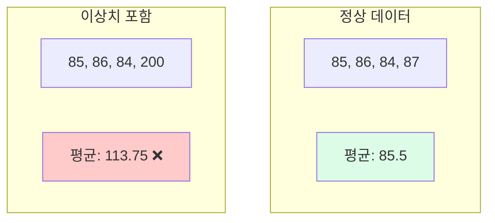

## 4. 중앙값의 강건성

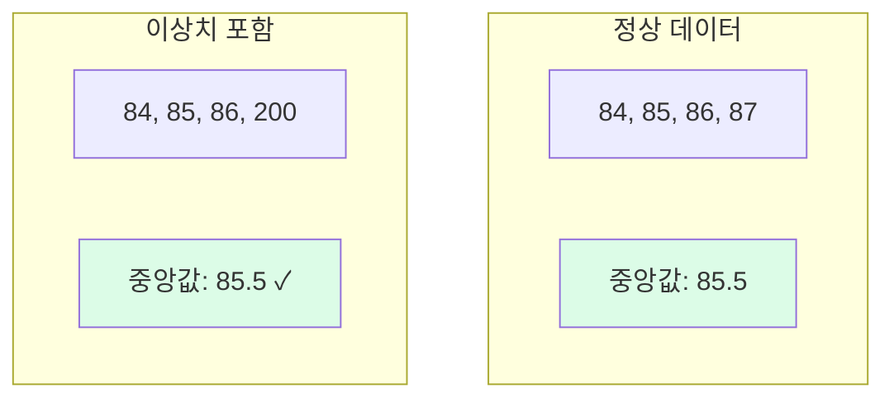

## 5. 중앙값 계산 방법

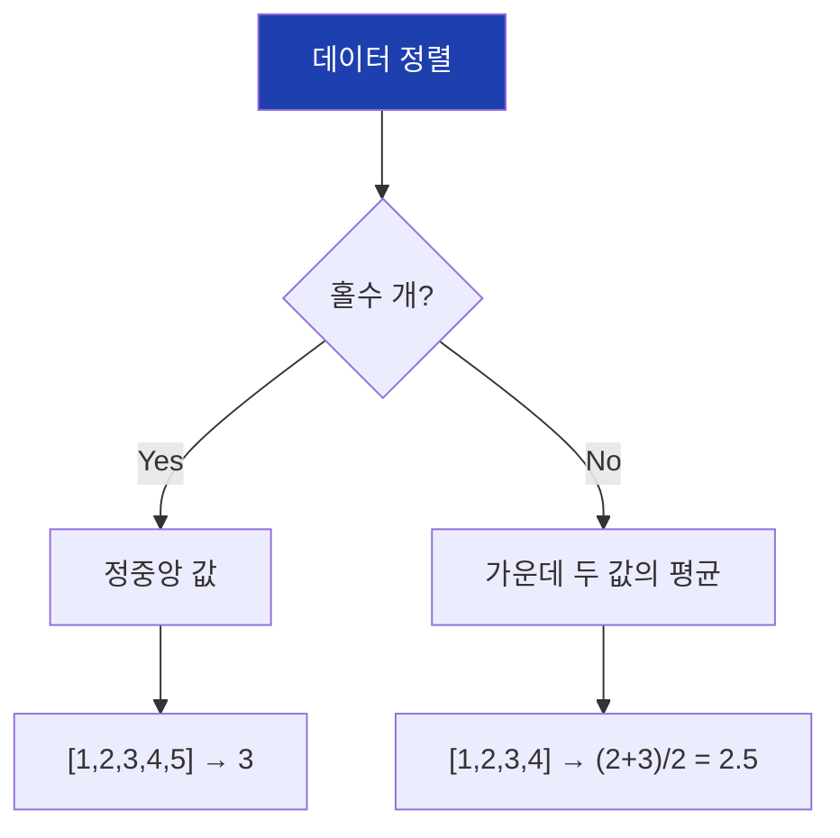

## 6. 분포 형태와 대표값

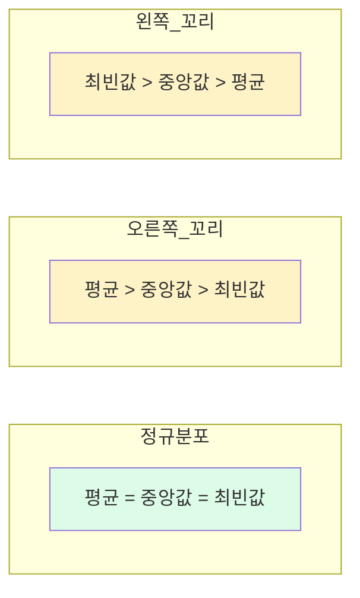

## 7. 산포도의 종류

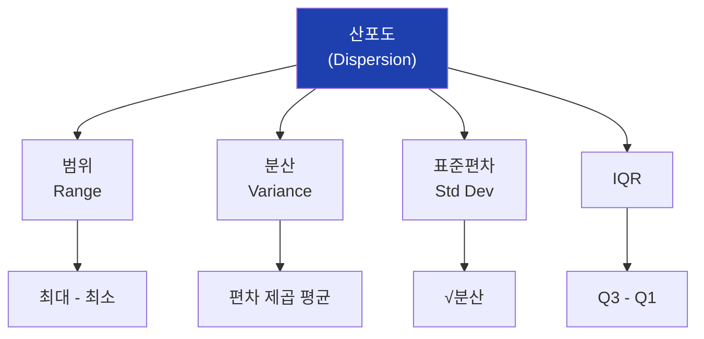

## 8. 분산 계산 과정

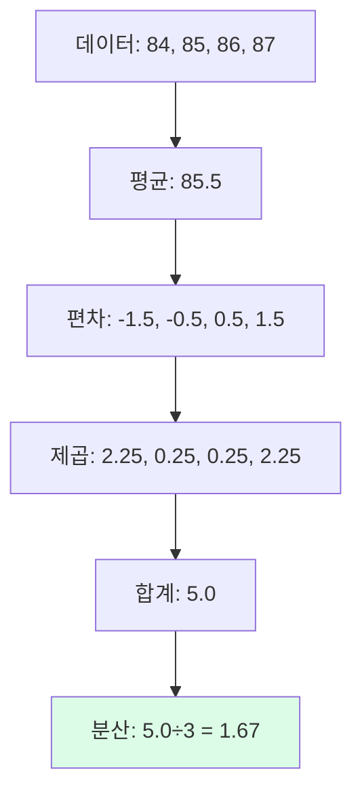

## 9. 표준편차의 의미

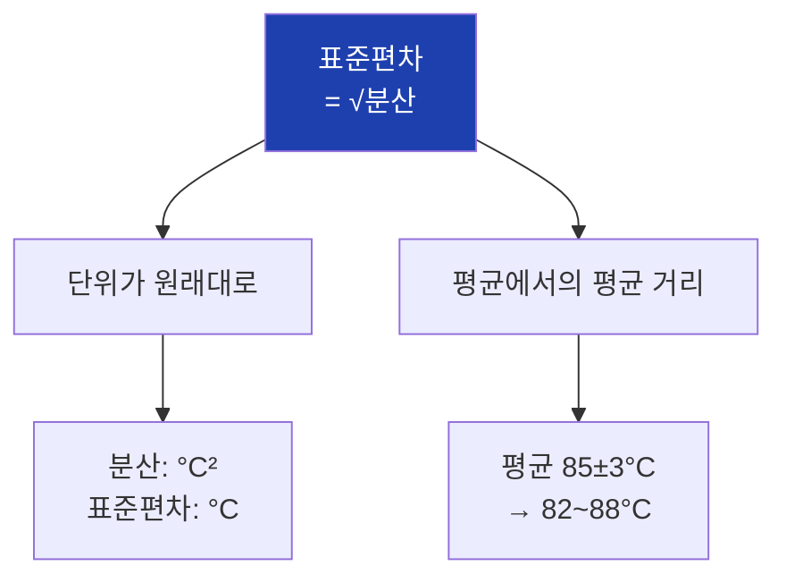

## 10. 68-95-99.7 규칙

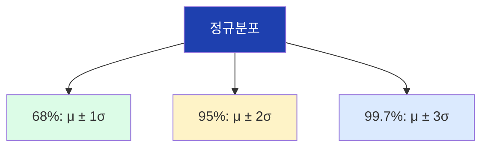

## 11. 사분위수


## 12. IQR과 이상치 탐지

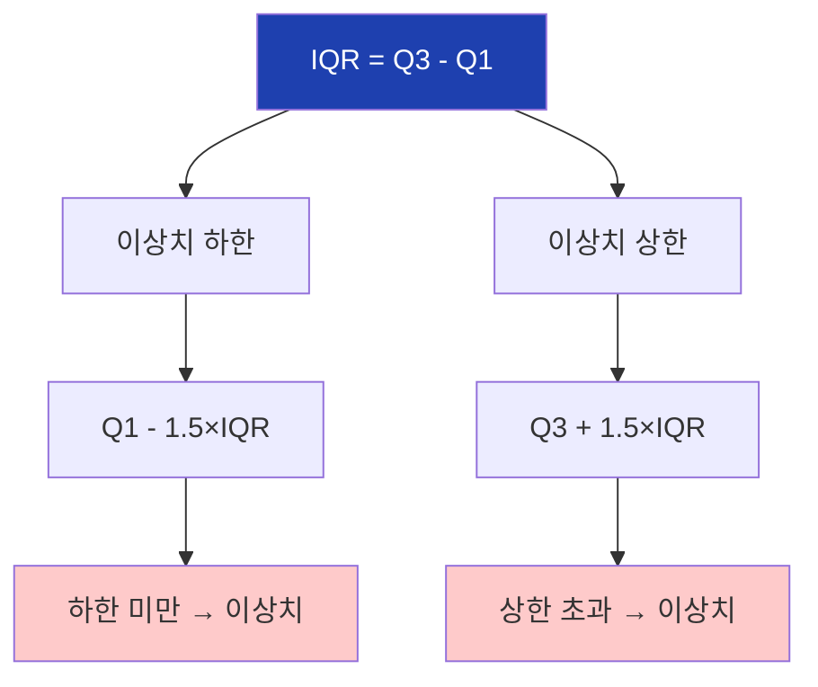

## 13. EDA의 목적

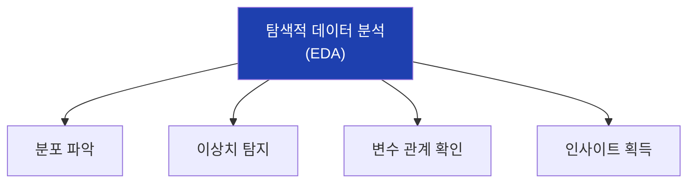

## 14. 핵심 시각화 도구

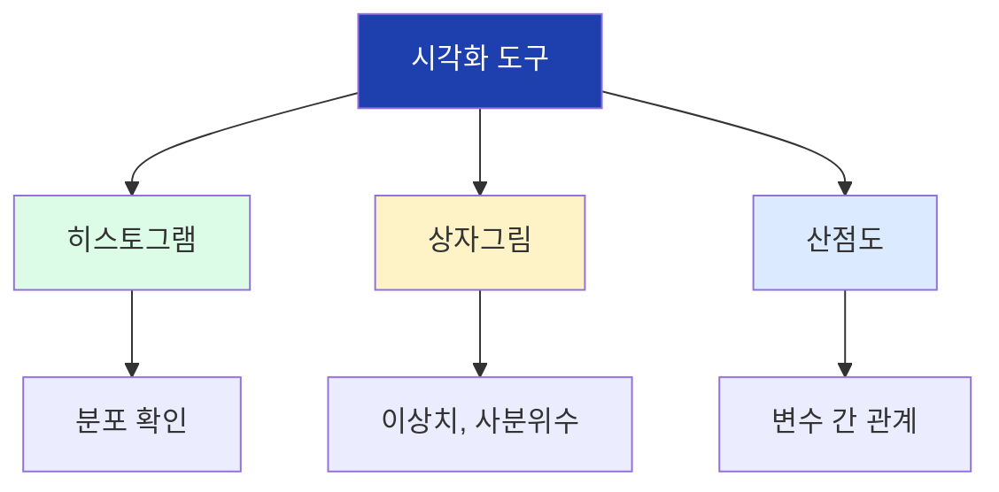

## 15. 히스토그램 구조

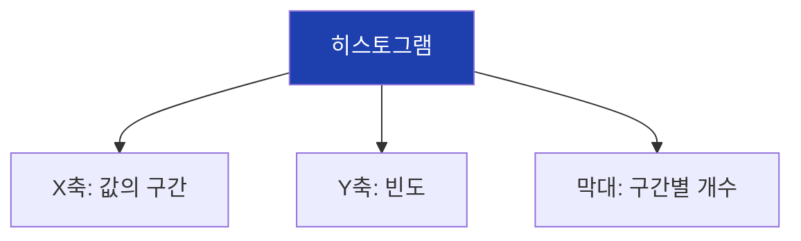

## 16. 히스토그램 해석

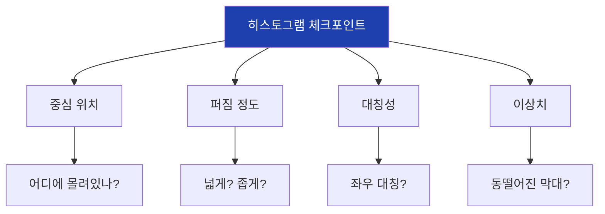

## 17. 상자그림 구조

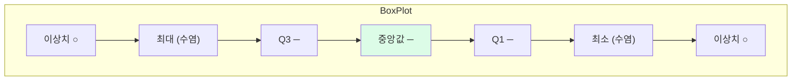

## 18. 상자그림 비교

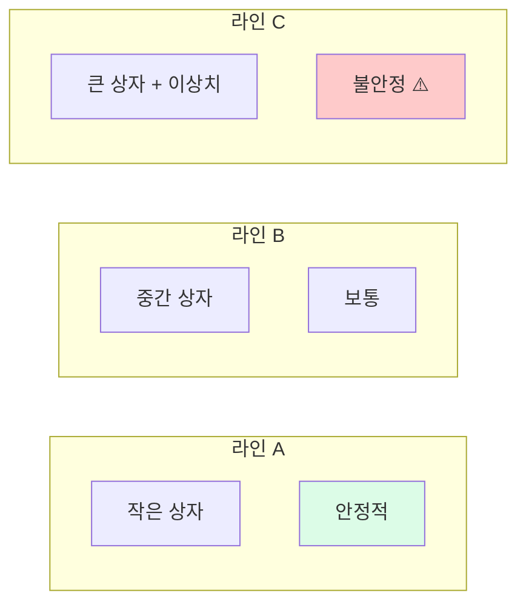

## 19. 산점도 패턴

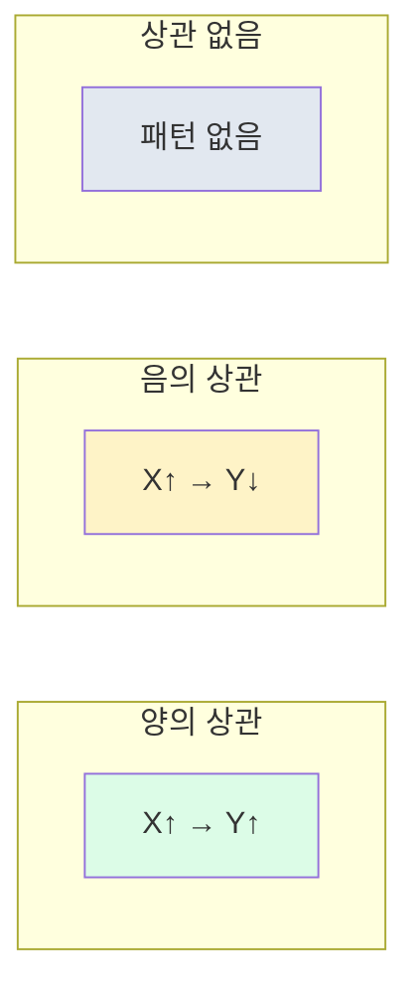

## 20. describe() 결과

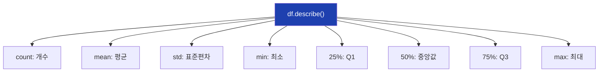

## 21. Matplotlib 기본 흐름

```mermaid
flowchart TD
    A["import matplotlib.pyplot as plt"]
    B["plt.figure()"]
    C["plt.plot() / hist() / scatter()"]
    D["plt.xlabel(), ylabel(), title()"]
    E["plt.show()"]

    A --> B --> C --> D --> E

    style A fill:#dbeafe
    style E fill:#dcfce7
```

## 22. 서브플롯 구조

```mermaid
flowchart TD
    A["fig, axes = plt.subplots(2, 2)"]

    A --> B["axes[0,0]<br>히스토그램"]
    A --> C["axes[0,1]<br>상자그림"]
    A --> D["axes[1,0]<br>산점도"]
    A --> E["axes[1,1]<br>시계열"]

    style A fill:#1e40af,color:#fff
```

## 23. 통계량 vs 시각화

```mermaid
flowchart TD
    A["데이터 분석"]

    A --> B["통계량<br>(숫자)"]
    A --> C["시각화<br>(그래프)"]

    B --> B1["평균, 표준편차"]
    C --> C1["히스토그램, 상자그림"]

    B1 --> D["요약"]
    C1 --> D

    D --> E["인사이트"]

    style E fill:#dcfce7
```

## 24. 앤스콤 콰르텟 교훈

```mermaid
flowchart TD
    A["4개 데이터셋"]

    A --> B["평균 같음"]
    A --> C["분산 같음"]
    A --> D["상관계수 같음"]

    B --> E["그래프는<br>완전히 다름!"]
    C --> E
    D --> E

    E --> F["반드시 시각화 필요"]

    style E fill:#fef3c7
    style F fill:#dcfce7
```

## 25. 데이터 확인 순서

```mermaid
flowchart TD
    A["데이터 확보"]
    B["df.shape"]
    C["df.info()"]
    D["df.describe()"]
    E["히스토그램"]
    F["상자그림"]
    G["산점도"]
    H["분석 시작"]

    A --> B --> C --> D --> E --> F --> G --> H

    style A fill:#dbeafe
    style H fill:#dcfce7
```

## 26. 이상치 탐지 방법

```mermaid
flowchart TD
    A["이상치 탐지"]

    A --> B["통계적 방법"]
    A --> C["시각적 방법"]

    B --> B1["IQR 기준"]
    B --> B2["Z-score (3σ)"]

    C --> C1["상자그림"]
    C --> C2["히스토그램"]

    style A fill:#1e40af,color:#fff
```

## 27. 5차시 학습 흐름

```mermaid
flowchart LR
    A["대표값<br>평균/중앙값"]
    B["산포도<br>표준편차/IQR"]
    C["시각화<br>히스토그램"]
    D["실습<br>Matplotlib"]
    E["6차시:<br>확률분포"]

    A --> B --> C --> D --> E

    style A fill:#dbeafe
    style B fill:#dcfce7
    style C fill:#fef3c7
    style D fill:#dcfce7
    style E fill:#1e40af,color:#fff
```

## 28. 핵심 코드 정리

```mermaid
flowchart TD
    subgraph 통계량
        S1["np.mean()"]
        S2["np.median()"]
        S3["np.std()"]
        S4["df.describe()"]
    end

    subgraph 시각화
        V1["plt.hist()"]
        V2["plt.boxplot()"]
        V3["plt.scatter()"]
    end

    style S4 fill:#dcfce7
    style V1 fill:#dcfce7
```
