# [6차시] 확률분포와 품질검정 기초 - 다이어그램

## 1. 학습 흐름

## 2. 확률분포의 종류

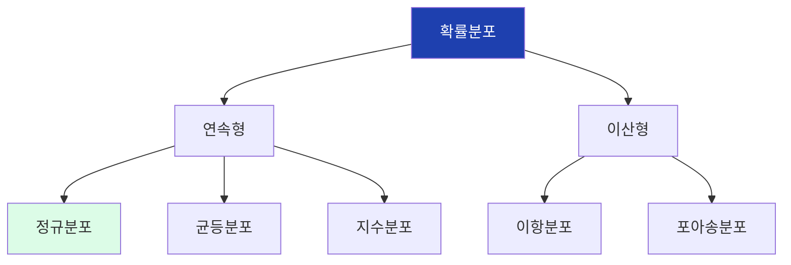

## 3. 정규분포의 특성

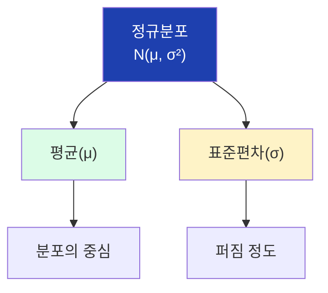

## 4. 정규분포 곡선

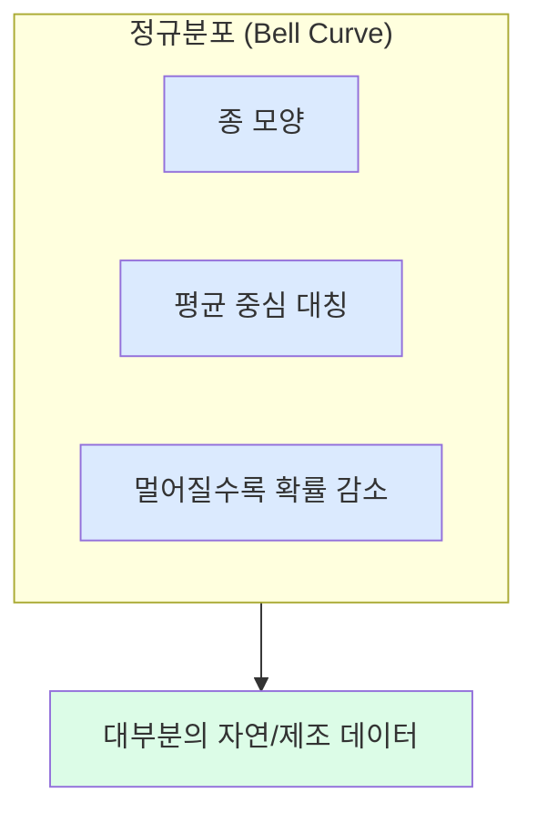

## 5. 68-95-99.7 규칙

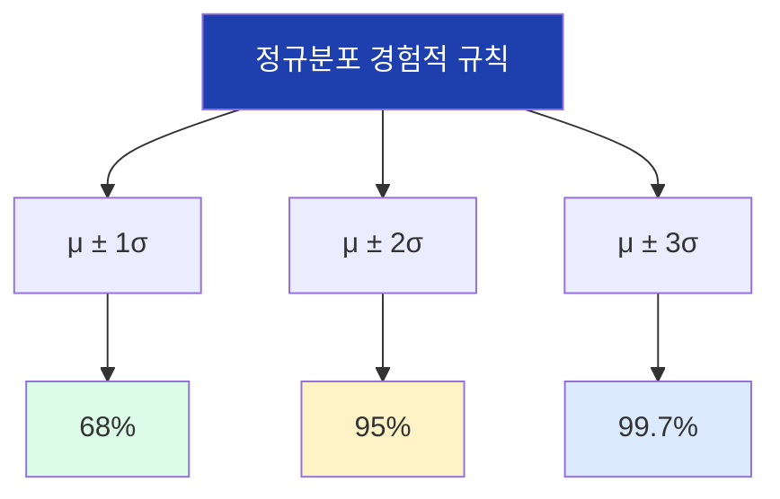

## 6. 68-95-99.7 의미

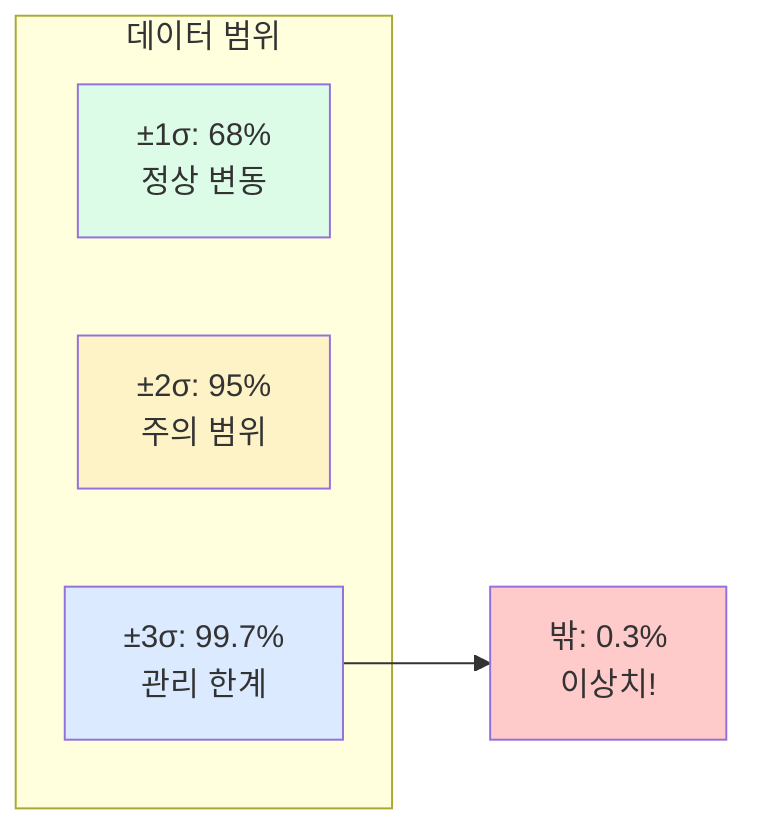

## 7. 품질 관리 기준 예시

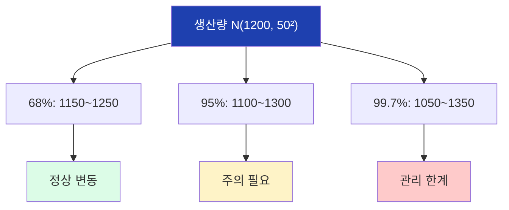

## 8. 이상치란?

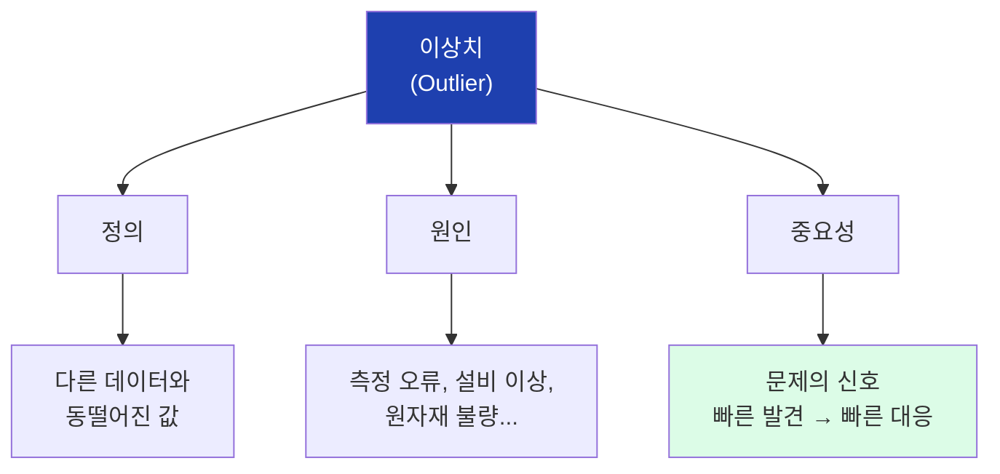

## 9. Z-score 개념

## 10. Z-score 해석

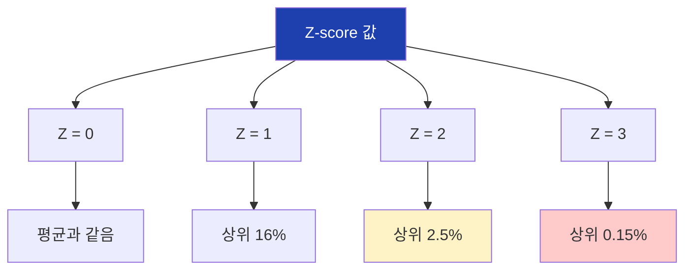

## 11. Z-score 판단 기준

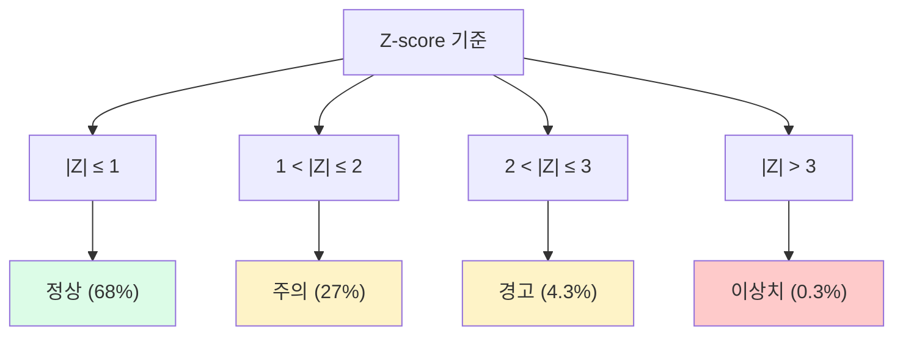

## 12. Z-score 계산 과정

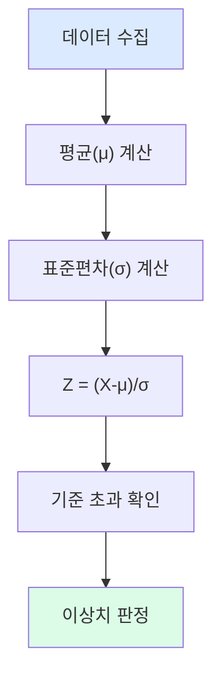

## 13. Z-score vs IQR 비교

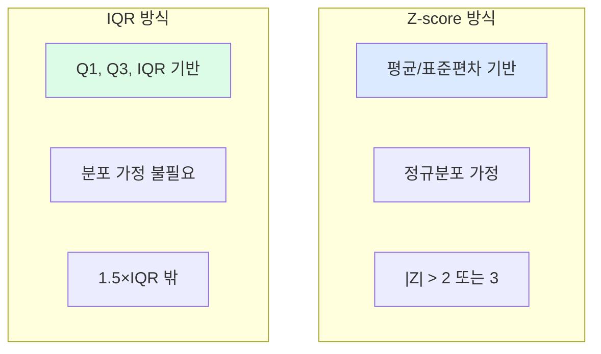

## 14. 이상치 탐지 흐름

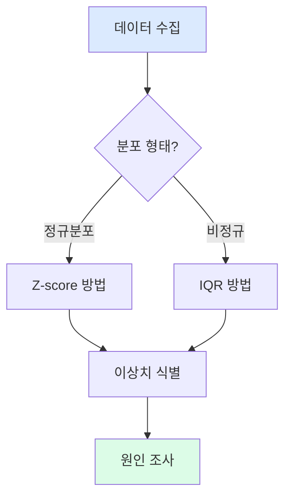

## 15. 실습 흐름

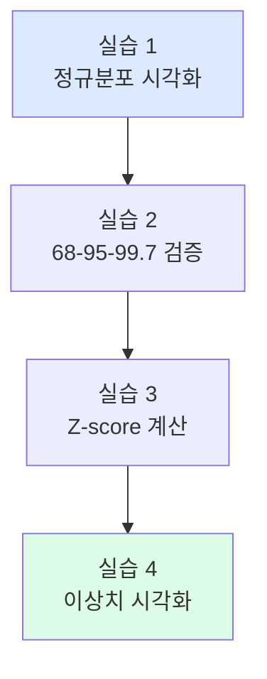

## 16. 핵심 코드 정리

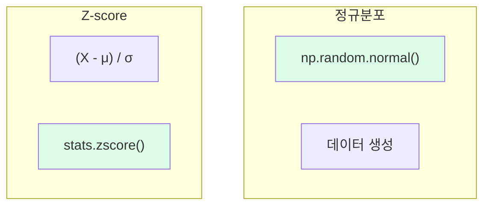

## 17. 6차시 핵심 정리

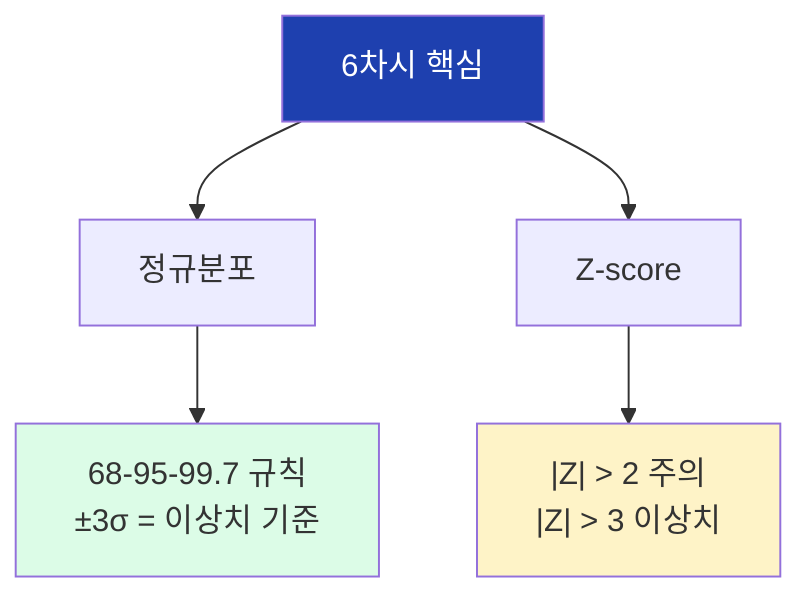

## 18. 다음 차시 예고

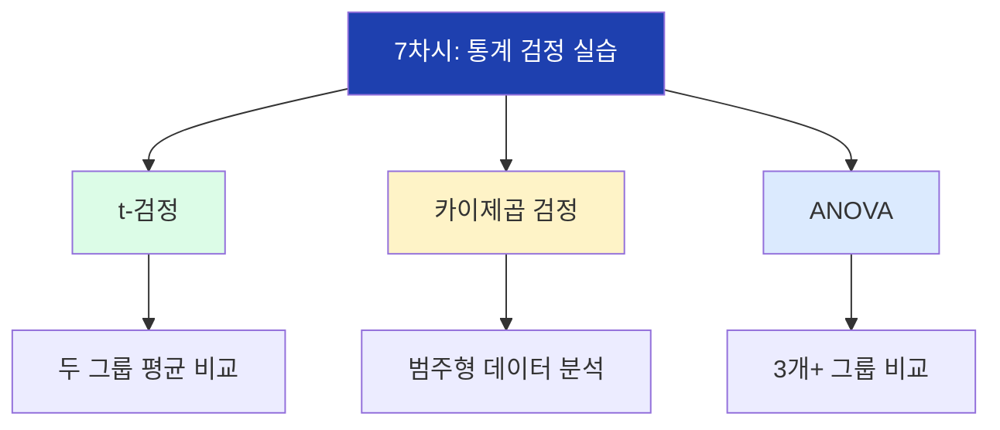
