# 7차시: 통계 검정 실습 - 다이어그램 모음

## 목차
1. [학습 흐름](#1-학습-흐름)
2. [대주제 구조](#2-대주제-구조)
3. [가설검정 개념](#3-가설검정-개념)
4. [p-value 해석 가이드](#4-p-value-해석-가이드)
5. [1종/2종 오류](#5-1종2종-오류)
6. [가설검정 5단계 절차](#6-가설검정-5단계-절차)
7. [t-검정 종류 분류](#7-t-검정-종류-분류)
8. [t-검정 결과 해석](#8-t-검정-결과-해석)
9. [Iris 데이터셋 구조](#9-iris-데이터셋-구조)
10. [ANOVA 개념](#10-anova-개념)
11. [ANOVA 결과 해석](#11-anova-결과-해석)
12. [Wine Quality 분석 흐름](#12-wine-quality-분석-흐름)
13. [카이제곱 검정 개념](#13-카이제곱-검정-개념)
14. [교차표 구조](#14-교차표-구조)
15. [Titanic 분석 흐름](#15-titanic-분석-흐름)
16. [모수 vs 비모수 검정 비교](#16-모수-vs-비모수-검정-비교)
17. [검정 선택 플로우차트](#17-검정-선택-플로우차트)
18. [정규성 검정 절차](#18-정규성-검정-절차)
19. [실습 흐름도](#19-실습-흐름도)
20. [핵심 정리](#20-핵심-정리)
21. [다음 차시 연결](#21-다음-차시-연결)

---

## 1. 학습 흐름

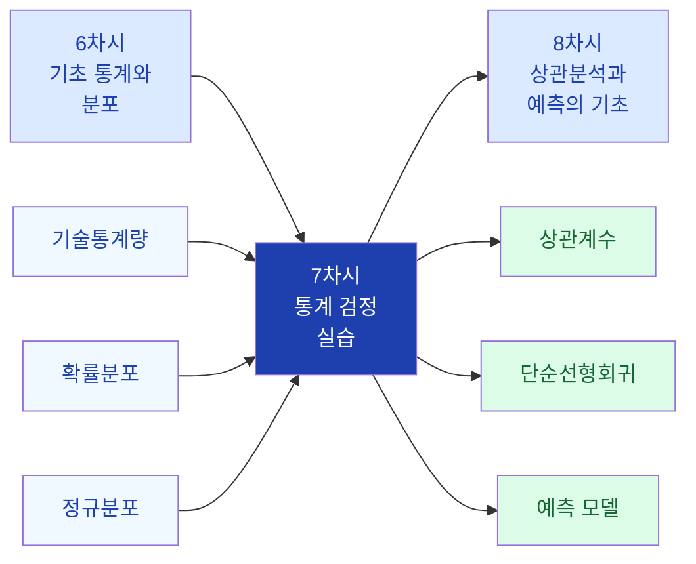
```mermaid
flowchart LR
    A[6차시<br/>기초 통계와<br/>분포] --> B[7차시<br/>통계 검정<br/>실습]
    B --> C[8차시<br/>상관분석과<br/>예측의 기초]

    A1[기술통계량] --> B
    A2[확률분포] --> B
    A3[정규분포] --> B

    B --> C1[상관계수]
    B --> C2[단순선형회귀]
    B --> C3[예측 모델]

    style A fill:#dbeafe,color:#1e40af
    style B fill:#1e40af,color:#fff
    style C fill:#dbeafe,color:#1e40af
    style A1 fill:#f0f9ff,color:#1e40af
    style A2 fill:#f0f9ff,color:#1e40af
    style A3 fill:#f0f9ff,color:#1e40af
    style C1 fill:#dcfce7,color:#166534
    style C2 fill:#dcfce7,color:#166534
    style C3 fill:#dcfce7,color:#166534
```

---

## 2. 대주제 구조

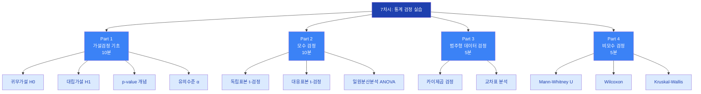
```mermaid
flowchart TB
    MAIN[7차시: 통계 검정 실습]

    MAIN --> P1[Part 1<br/>가설검정 기초<br/>10분]
    MAIN --> P2[Part 2<br/>모수 검정<br/>10분]
    MAIN --> P3[Part 3<br/>범주형 데이터 검정<br/>5분]
    MAIN --> P4[Part 4<br/>비모수 검정<br/>5분]

    P1 --> P1A[귀무가설 H0]
    P1 --> P1B[대립가설 H1]
    P1 --> P1C[p-value 개념]
    P1 --> P1D[유의수준 α]

    P2 --> P2A[독립표본 t-검정]
    P2 --> P2B[대응표본 t-검정]
    P2 --> P2C[일원분산분석 ANOVA]

    P3 --> P3A[카이제곱 검정]
    P3 --> P3B[교차표 분석]

    P4 --> P4A[Mann-Whitney U]
    P4 --> P4B[Wilcoxon]
    P4 --> P4C[Kruskal-Wallis]

    style MAIN fill:#1e40af,color:#fff
    style P1 fill:#3b82f6,color:#fff
    style P2 fill:#3b82f6,color:#fff
    style P3 fill:#3b82f6,color:#fff
    style P4 fill:#3b82f6,color:#fff
    style P1A fill:#dbeafe,color:#1e40af
    style P1B fill:#dbeafe,color:#1e40af
    style P1C fill:#dbeafe,color:#1e40af
    style P1D fill:#dbeafe,color:#1e40af
    style P2A fill:#dbeafe,color:#1e40af
    style P2B fill:#dbeafe,color:#1e40af
    style P2C fill:#dbeafe,color:#1e40af
    style P3A fill:#dbeafe,color:#1e40af
    style P3B fill:#dbeafe,color:#1e40af
    style P4A fill:#dbeafe,color:#1e40af
    style P4B fill:#dbeafe,color:#1e40af
    style P4C fill:#dbeafe,color:#1e40af
```

---

## 3. 가설검정 개념

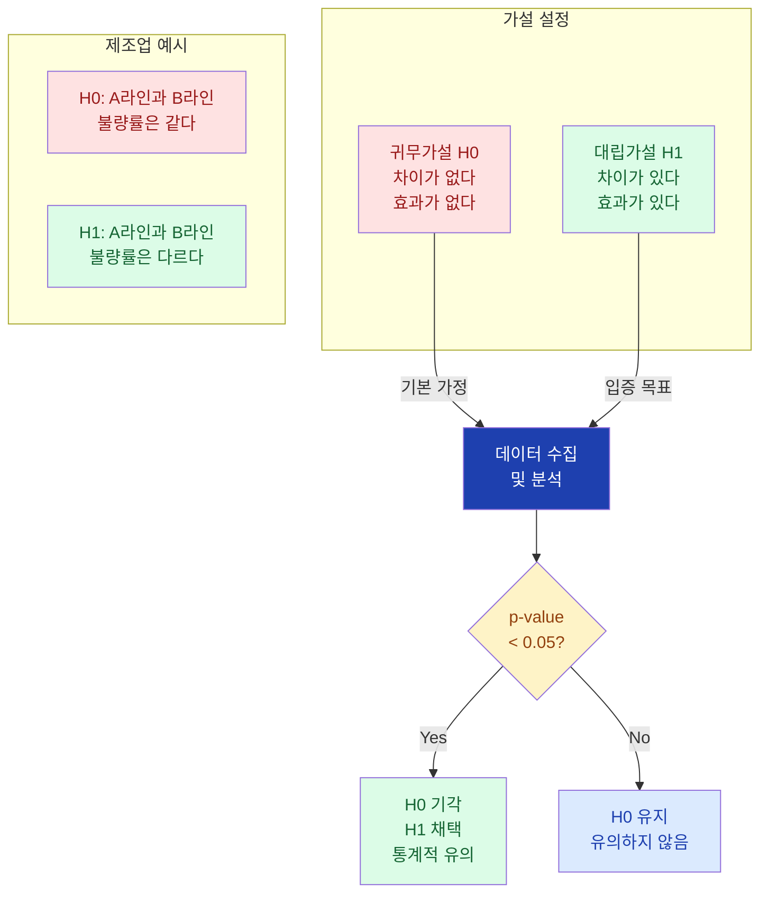
```mermaid
flowchart TB
    subgraph 가설설정["가설 설정"]
        H0[귀무가설 H0<br/>차이가 없다<br/>효과가 없다]
        H1[대립가설 H1<br/>차이가 있다<br/>효과가 있다]
    end

    subgraph 예시["제조업 예시"]
        EX1[H0: A라인과 B라인<br/>불량률은 같다]
        EX2[H1: A라인과 B라인<br/>불량률은 다르다]
    end

    H0 --> |"기본 가정"| CHECK[데이터 수집<br/>및 분석]
    H1 --> |"입증 목표"| CHECK

    CHECK --> RESULT{p-value<br/>< 0.05?}

    RESULT --> |"Yes"| REJECT[H0 기각<br/>H1 채택<br/>통계적 유의]
    RESULT --> |"No"| ACCEPT[H0 유지<br/>유의하지 않음]

    style H0 fill:#fee2e2,color:#991b1b
    style H1 fill:#dcfce7,color:#166534
    style CHECK fill:#1e40af,color:#fff
    style RESULT fill:#fef3c7,color:#92400e
    style REJECT fill:#dcfce7,color:#166534
    style ACCEPT fill:#dbeafe,color:#1e40af
    style EX1 fill:#fee2e2,color:#991b1b
    style EX2 fill:#dcfce7,color:#166534
```

---

## 4. p-value 해석 가이드

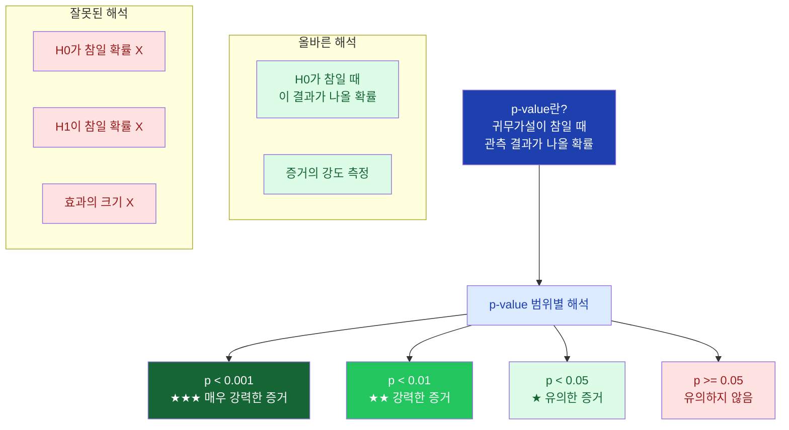
```mermaid
flowchart TB
    PVALUE[p-value란?<br/>귀무가설이 참일 때<br/>관측 결과가 나올 확률]

    PVALUE --> RANGE[p-value 범위별 해석]

    RANGE --> R1["p < 0.001<br/>★★★ 매우 강력한 증거"]
    RANGE --> R2["p < 0.01<br/>★★ 강력한 증거"]
    RANGE --> R3["p < 0.05<br/>★ 유의한 증거"]
    RANGE --> R4["p >= 0.05<br/>유의하지 않음"]

    subgraph 올바른해석["올바른 해석"]
        C1[H0가 참일 때<br/>이 결과가 나올 확률]
        C2[증거의 강도 측정]
    end

    subgraph 잘못된해석["잘못된 해석"]
        W1[H0가 참일 확률 X]
        W2[H1이 참일 확률 X]
        W3[효과의 크기 X]
    end

    style PVALUE fill:#1e40af,color:#fff
    style RANGE fill:#dbeafe,color:#1e40af
    style R1 fill:#166534,color:#fff
    style R2 fill:#22c55e,color:#fff
    style R3 fill:#dcfce7,color:#166534
    style R4 fill:#fee2e2,color:#991b1b
    style C1 fill:#dcfce7,color:#166534
    style C2 fill:#dcfce7,color:#166534
    style W1 fill:#fee2e2,color:#991b1b
    style W2 fill:#fee2e2,color:#991b1b
    style W3 fill:#fee2e2,color:#991b1b
```

---

## 5. 1종/2종 오류

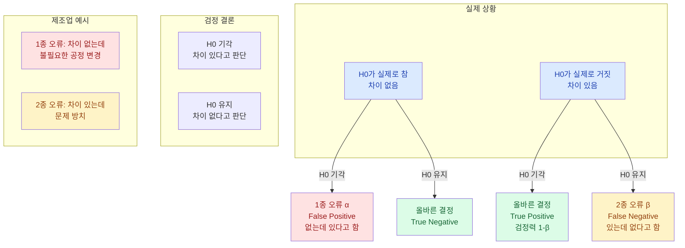
```mermaid
flowchart TB
    subgraph 현실["실제 상황"]
        TRUE_H0[H0가 실제로 참<br/>차이 없음]
        TRUE_H1[H0가 실제로 거짓<br/>차이 있음]
    end

    subgraph 결정["검정 결론"]
        REJECT_H0[H0 기각<br/>차이 있다고 판단]
        ACCEPT_H0[H0 유지<br/>차이 없다고 판단]
    end

    TRUE_H0 --> |"H0 기각"| TYPE1[1종 오류 α<br/>False Positive<br/>없는데 있다고 함]
    TRUE_H0 --> |"H0 유지"| CORRECT1[올바른 결정<br/>True Negative]

    TRUE_H1 --> |"H0 기각"| CORRECT2[올바른 결정<br/>True Positive<br/>검정력 1-β]
    TRUE_H1 --> |"H0 유지"| TYPE2[2종 오류 β<br/>False Negative<br/>있는데 없다고 함]

    subgraph 제조예시["제조업 예시"]
        M1["1종 오류: 차이 없는데<br/>불필요한 공정 변경"]
        M2["2종 오류: 차이 있는데<br/>문제 방치"]
    end

    style TRUE_H0 fill:#dbeafe,color:#1e40af
    style TRUE_H1 fill:#dbeafe,color:#1e40af
    style TYPE1 fill:#fee2e2,color:#991b1b
    style TYPE2 fill:#fef3c7,color:#92400e
    style CORRECT1 fill:#dcfce7,color:#166534
    style CORRECT2 fill:#dcfce7,color:#166534
    style M1 fill:#fee2e2,color:#991b1b
    style M2 fill:#fef3c7,color:#92400e
```

---

## 6. 가설검정 5단계 절차

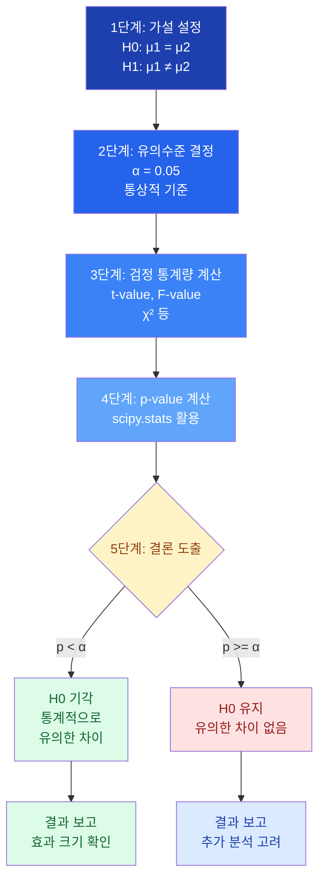
```mermaid
flowchart TB
    S1[1단계: 가설 설정<br/>H0: μ1 = μ2<br/>H1: μ1 ≠ μ2]

    S1 --> S2[2단계: 유의수준 결정<br/>α = 0.05<br/>통상적 기준]

    S2 --> S3[3단계: 검정 통계량 계산<br/>t-value, F-value<br/>χ² 등]

    S3 --> S4[4단계: p-value 계산<br/>scipy.stats 활용]

    S4 --> S5{5단계: 결론 도출}

    S5 --> |"p < α"| REJECT[H0 기각<br/>통계적으로<br/>유의한 차이]
    S5 --> |"p >= α"| ACCEPT[H0 유지<br/>유의한 차이 없음]

    REJECT --> REPORT1[결과 보고<br/>효과 크기 확인]
    ACCEPT --> REPORT2[결과 보고<br/>추가 분석 고려]

    style S1 fill:#1e40af,color:#fff
    style S2 fill:#2563eb,color:#fff
    style S3 fill:#3b82f6,color:#fff
    style S4 fill:#60a5fa,color:#fff
    style S5 fill:#fef3c7,color:#92400e
    style REJECT fill:#dcfce7,color:#166534
    style ACCEPT fill:#fee2e2,color:#991b1b
    style REPORT1 fill:#dcfce7,color:#166534
    style REPORT2 fill:#dbeafe,color:#1e40af
```

---

## 7. t-검정 종류 분류

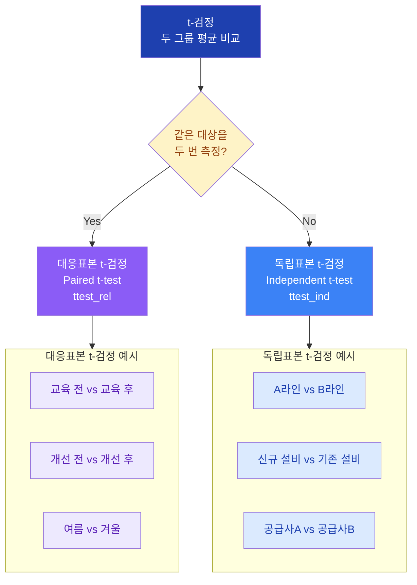
```mermaid
flowchart TB
    TTEST[t-검정<br/>두 그룹 평균 비교]

    TTEST --> Q1{같은 대상을<br/>두 번 측정?}

    Q1 --> |"Yes"| PAIRED[대응표본 t-검정<br/>Paired t-test<br/>ttest_rel]
    Q1 --> |"No"| IND[독립표본 t-검정<br/>Independent t-test<br/>ttest_ind]

    subgraph 독립표본["독립표본 t-검정 예시"]
        I1[A라인 vs B라인]
        I2[신규 설비 vs 기존 설비]
        I3[공급사A vs 공급사B]
    end

    subgraph 대응표본["대응표본 t-검정 예시"]
        P1[교육 전 vs 교육 후]
        P2[개선 전 vs 개선 후]
        P3[여름 vs 겨울]
    end

    IND --> 독립표본
    PAIRED --> 대응표본

    style TTEST fill:#1e40af,color:#fff
    style Q1 fill:#fef3c7,color:#92400e
    style IND fill:#3b82f6,color:#fff
    style PAIRED fill:#8b5cf6,color:#fff
    style I1 fill:#dbeafe,color:#1e40af
    style I2 fill:#dbeafe,color:#1e40af
    style I3 fill:#dbeafe,color:#1e40af
    style P1 fill:#ede9fe,color:#5b21b6
    style P2 fill:#ede9fe,color:#5b21b6
    style P3 fill:#ede9fe,color:#5b21b6
```

---

## 8. t-검정 결과 해석

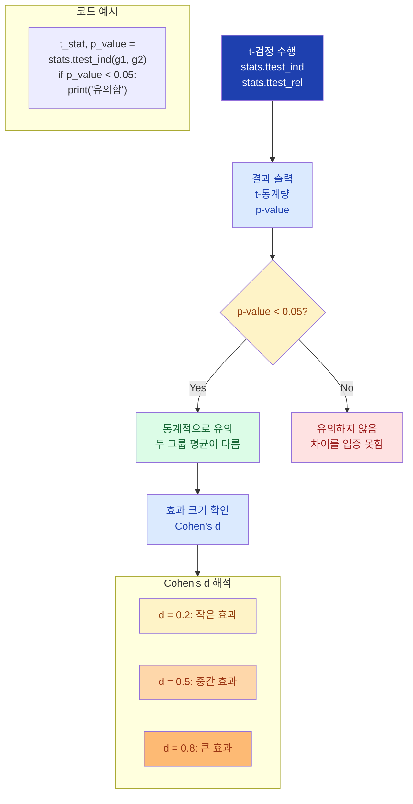
```mermaid
flowchart TB
    INPUT[t-검정 수행<br/>stats.ttest_ind<br/>stats.ttest_rel]

    INPUT --> OUTPUT[결과 출력<br/>t-통계량<br/>p-value]

    OUTPUT --> CHECK{p-value < 0.05?}

    CHECK --> |"Yes"| SIG[통계적으로 유의<br/>두 그룹 평균이 다름]
    CHECK --> |"No"| NSIG[유의하지 않음<br/>차이를 입증 못함]

    SIG --> EFFECT[효과 크기 확인<br/>Cohen's d]

    subgraph 효과크기["Cohen's d 해석"]
        D1["d = 0.2: 작은 효과"]
        D2["d = 0.5: 중간 효과"]
        D3["d = 0.8: 큰 효과"]
    end

    EFFECT --> 효과크기

    subgraph 코드예시["코드 예시"]
        CODE["t_stat, p_value = <br/>stats.ttest_ind(g1, g2)<br/>if p_value < 0.05:<br/>    print('유의함')"]
    end

    style INPUT fill:#1e40af,color:#fff
    style OUTPUT fill:#dbeafe,color:#1e40af
    style CHECK fill:#fef3c7,color:#92400e
    style SIG fill:#dcfce7,color:#166534
    style NSIG fill:#fee2e2,color:#991b1b
    style EFFECT fill:#dbeafe,color:#1e40af
    style D1 fill:#fef3c7,color:#92400e
    style D2 fill:#fed7aa,color:#9a3412
    style D3 fill:#fdba74,color:#9a3412
```

---

## 9. Iris 데이터셋 구조

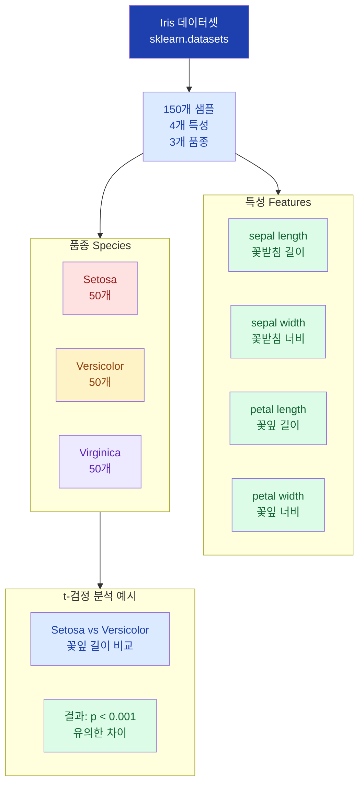
```mermaid
flowchart TB
    IRIS[Iris 데이터셋<br/>sklearn.datasets]

    IRIS --> INFO[150개 샘플<br/>4개 특성<br/>3개 품종]

    subgraph 특성["특성 Features"]
        F1[sepal length<br/>꽃받침 길이]
        F2[sepal width<br/>꽃받침 너비]
        F3[petal length<br/>꽃잎 길이]
        F4[petal width<br/>꽃잎 너비]
    end

    subgraph 품종["품종 Species"]
        S1[Setosa<br/>50개]
        S2[Versicolor<br/>50개]
        S3[Virginica<br/>50개]
    end

    INFO --> 특성
    INFO --> 품종

    subgraph 분석예시["t-검정 분석 예시"]
        A1["Setosa vs Versicolor<br/>꽃잎 길이 비교"]
        A2["결과: p < 0.001<br/>유의한 차이"]
    end

    품종 --> 분석예시

    style IRIS fill:#1e40af,color:#fff
    style INFO fill:#dbeafe,color:#1e40af
    style F1 fill:#dcfce7,color:#166534
    style F2 fill:#dcfce7,color:#166534
    style F3 fill:#dcfce7,color:#166534
    style F4 fill:#dcfce7,color:#166534
    style S1 fill:#fee2e2,color:#991b1b
    style S2 fill:#fef3c7,color:#92400e
    style S3 fill:#ede9fe,color:#5b21b6
    style A1 fill:#dbeafe,color:#1e40af
    style A2 fill:#dcfce7,color:#166534
```

---

## 10. ANOVA 개념

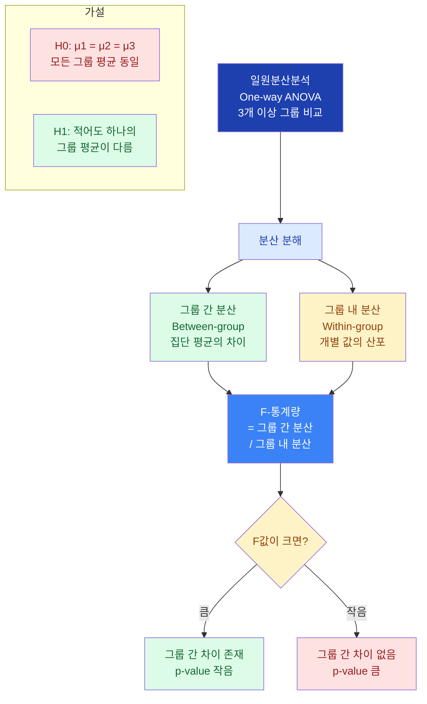
```mermaid
flowchart TB
    ANOVA[일원분산분석<br/>One-way ANOVA<br/>3개 이상 그룹 비교]

    ANOVA --> CONCEPT[분산 분해]

    CONCEPT --> BETWEEN[그룹 간 분산<br/>Between-group<br/>집단 평균의 차이]
    CONCEPT --> WITHIN[그룹 내 분산<br/>Within-group<br/>개별 값의 산포]

    BETWEEN --> FSTAT[F-통계량<br/>= 그룹 간 분산<br/>/ 그룹 내 분산]
    WITHIN --> FSTAT

    FSTAT --> INTERPRET{F값이 크면?}

    INTERPRET --> |"큼"| DIFF[그룹 간 차이 존재<br/>p-value 작음]
    INTERPRET --> |"작음"| SAME[그룹 간 차이 없음<br/>p-value 큼]

    subgraph 가설["가설"]
        H0["H0: μ1 = μ2 = μ3<br/>모든 그룹 평균 동일"]
        H1["H1: 적어도 하나의<br/>그룹 평균이 다름"]
    end

    style ANOVA fill:#1e40af,color:#fff
    style CONCEPT fill:#dbeafe,color:#1e40af
    style BETWEEN fill:#dcfce7,color:#166534
    style WITHIN fill:#fef3c7,color:#92400e
    style FSTAT fill:#3b82f6,color:#fff
    style INTERPRET fill:#fef3c7,color:#92400e
    style DIFF fill:#dcfce7,color:#166534
    style SAME fill:#fee2e2,color:#991b1b
    style H0 fill:#fee2e2,color:#991b1b
    style H1 fill:#dcfce7,color:#166534
```

---

## 11. ANOVA 결과 해석

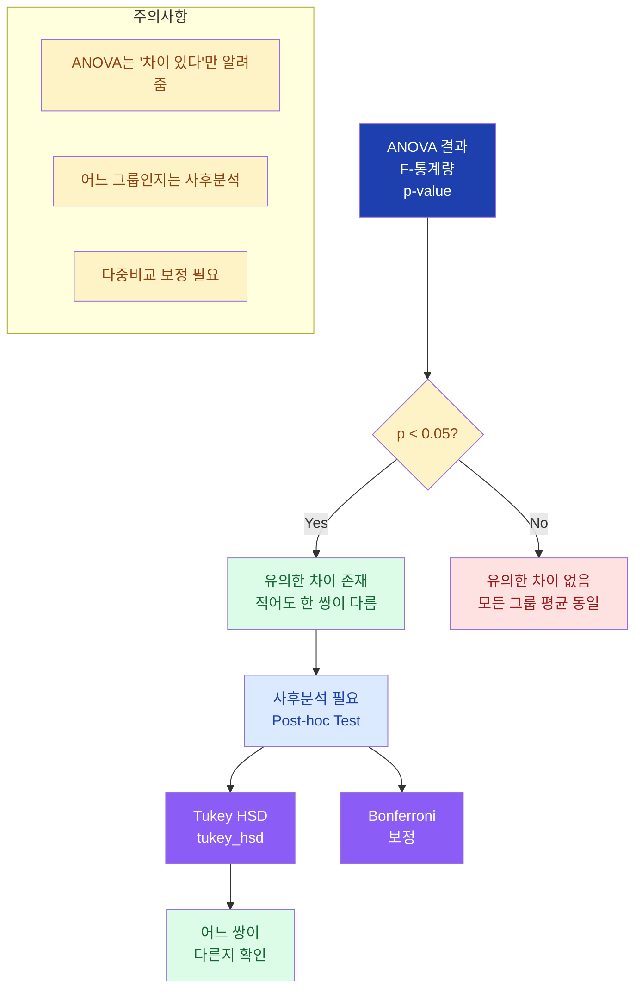
```mermaid
flowchart TB
    RESULT[ANOVA 결과<br/>F-통계량<br/>p-value]

    RESULT --> CHECK{p < 0.05?}

    CHECK --> |"Yes"| SIG[유의한 차이 존재<br/>적어도 한 쌍이 다름]
    CHECK --> |"No"| NSIG[유의한 차이 없음<br/>모든 그룹 평균 동일]

    SIG --> POST[사후분석 필요<br/>Post-hoc Test]

    POST --> TUKEY[Tukey HSD<br/>tukey_hsd]
    POST --> BONF[Bonferroni<br/>보정]

    TUKEY --> PAIR[어느 쌍이<br/>다른지 확인]

    subgraph 주의["주의사항"]
        W1["ANOVA는 '차이 있다'만 알려줌"]
        W2["어느 그룹인지는 사후분석"]
        W3["다중비교 보정 필요"]
    end

    style RESULT fill:#1e40af,color:#fff
    style CHECK fill:#fef3c7,color:#92400e
    style SIG fill:#dcfce7,color:#166534
    style NSIG fill:#fee2e2,color:#991b1b
    style POST fill:#dbeafe,color:#1e40af
    style TUKEY fill:#8b5cf6,color:#fff
    style BONF fill:#8b5cf6,color:#fff
    style PAIR fill:#dcfce7,color:#166534
    style W1 fill:#fef3c7,color:#92400e
    style W2 fill:#fef3c7,color:#92400e
    style W3 fill:#fef3c7,color:#92400e
```

---

## 12. Wine Quality 분석 흐름

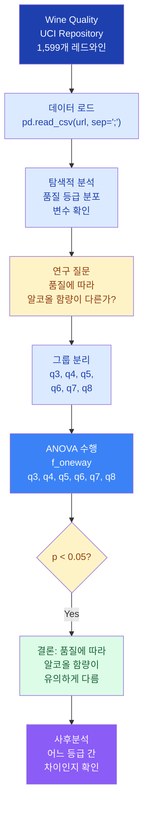
```mermaid
flowchart TB
    DATA[Wine Quality<br/>UCI Repository<br/>1,599개 레드와인]

    DATA --> LOAD["데이터 로드<br/>pd.read_csv(url, sep=';')"]

    LOAD --> EXPLORE[탐색적 분석<br/>품질 등급 분포<br/>변수 확인]

    EXPLORE --> QUESTION[연구 질문<br/>품질에 따라<br/>알코올 함량이 다른가?]

    QUESTION --> GROUP[그룹 분리<br/>q3, q4, q5,<br/>q6, q7, q8]

    GROUP --> ANOVA[ANOVA 수행<br/>f_oneway<br/>q3, q4, q5, q6, q7, q8]

    ANOVA --> RESULT{p < 0.05?}

    RESULT --> |"Yes"| CONCLUDE[결론: 품질에 따라<br/>알코올 함량이<br/>유의하게 다름]

    CONCLUDE --> POSTHOC[사후분석<br/>어느 등급 간<br/>차이인지 확인]

    style DATA fill:#1e40af,color:#fff
    style LOAD fill:#dbeafe,color:#1e40af
    style EXPLORE fill:#dbeafe,color:#1e40af
    style QUESTION fill:#fef3c7,color:#92400e
    style GROUP fill:#dbeafe,color:#1e40af
    style ANOVA fill:#3b82f6,color:#fff
    style RESULT fill:#fef3c7,color:#92400e
    style CONCLUDE fill:#dcfce7,color:#166534
    style POSTHOC fill:#8b5cf6,color:#fff
```

---

## 13. 카이제곱 검정 개념

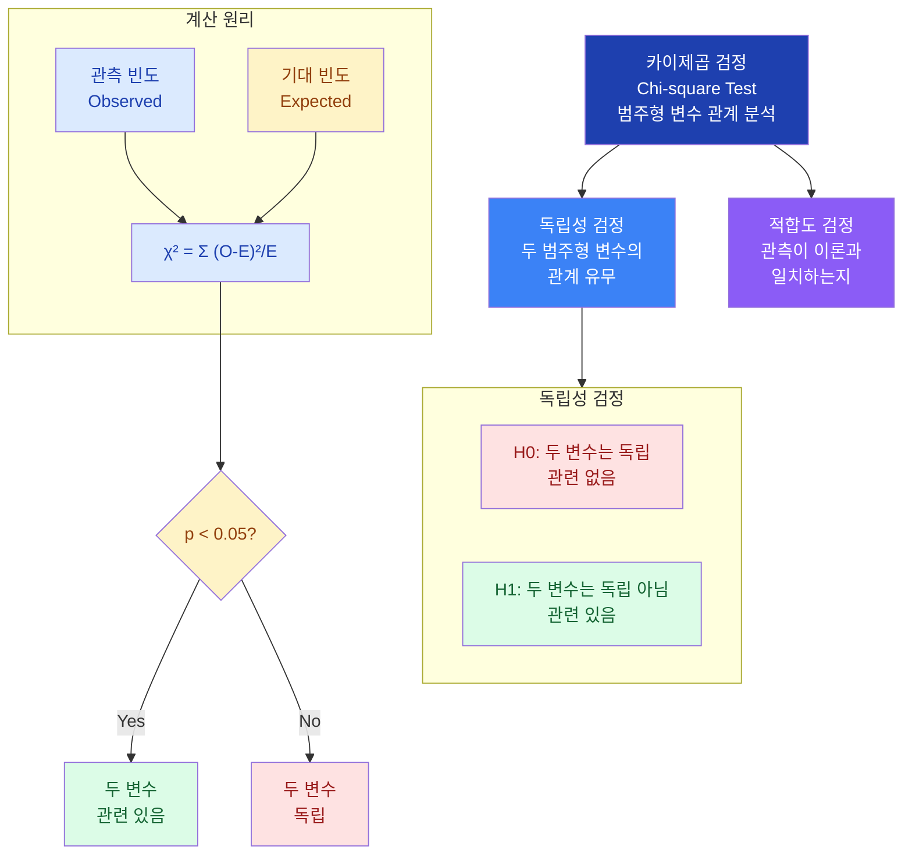
```mermaid
flowchart TB
    CHI[카이제곱 검정<br/>Chi-square Test<br/>범주형 변수 관계 분석]

    CHI --> TYPE1[독립성 검정<br/>두 범주형 변수의<br/>관계 유무]
    CHI --> TYPE2[적합도 검정<br/>관측이 이론과<br/>일치하는지]

    subgraph 독립성["독립성 검정"]
        IND1["H0: 두 변수는 독립<br/>관련 없음"]
        IND2["H1: 두 변수는 독립 아님<br/>관련 있음"]
    end

    TYPE1 --> 독립성

    subgraph 계산["계산 원리"]
        OBS[관측 빈도<br/>Observed]
        EXP[기대 빈도<br/>Expected]
        DIFF["χ² = Σ (O-E)²/E"]
    end

    OBS --> DIFF
    EXP --> DIFF

    DIFF --> PVAL{p < 0.05?}
    PVAL --> |"Yes"| REL[두 변수<br/>관련 있음]
    PVAL --> |"No"| INDEP[두 변수<br/>독립]

    style CHI fill:#1e40af,color:#fff
    style TYPE1 fill:#3b82f6,color:#fff
    style TYPE2 fill:#8b5cf6,color:#fff
    style IND1 fill:#fee2e2,color:#991b1b
    style IND2 fill:#dcfce7,color:#166534
    style OBS fill:#dbeafe,color:#1e40af
    style EXP fill:#fef3c7,color:#92400e
    style DIFF fill:#dbeafe,color:#1e40af
    style PVAL fill:#fef3c7,color:#92400e
    style REL fill:#dcfce7,color:#166534
    style INDEP fill:#fee2e2,color:#991b1b
```

---

## 14. 교차표 구조

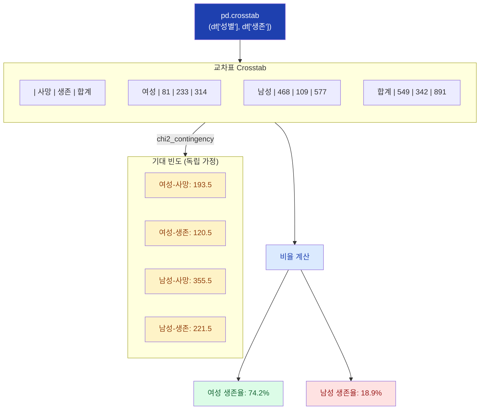
```mermaid
flowchart TB
    subgraph 교차표["교차표 Crosstab"]
        direction TB
        HEADER["      | 사망 | 생존 | 합계"]
        ROW1["여성 |  81 | 233 | 314"]
        ROW2["남성 | 468 | 109 | 577"]
        ROW3["합계 | 549 | 342 | 891"]
    end

    CREATE["pd.crosstab<br/>(df['성별'], df['생존'])"] --> 교차표

    교차표 --> RATIO[비율 계산]

    RATIO --> R1["여성 생존율: 74.2%"]
    RATIO --> R2["남성 생존율: 18.9%"]

    subgraph 기대빈도["기대 빈도 (독립 가정)"]
        E1["여성-사망: 193.5"]
        E2["여성-생존: 120.5"]
        E3["남성-사망: 355.5"]
        E4["남성-생존: 221.5"]
    end

    교차표 --> |"chi2_contingency"| 기대빈도

    style CREATE fill:#1e40af,color:#fff
    style RATIO fill:#dbeafe,color:#1e40af
    style R1 fill:#dcfce7,color:#166534
    style R2 fill:#fee2e2,color:#991b1b
    style E1 fill:#fef3c7,color:#92400e
    style E2 fill:#fef3c7,color:#92400e
    style E3 fill:#fef3c7,color:#92400e
    style E4 fill:#fef3c7,color:#92400e
```

---

## 15. Titanic 분석 흐름

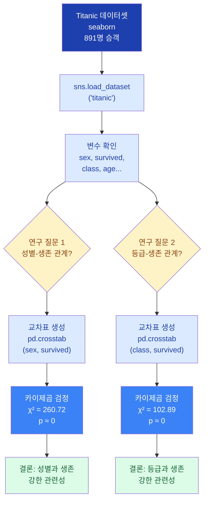
```mermaid
flowchart TB
    DATA[Titanic 데이터셋<br/>seaborn<br/>891명 승객]

    DATA --> LOAD["sns.load_dataset<br/>('titanic')"]

    LOAD --> VARS[변수 확인<br/>sex, survived,<br/>class, age...]

    VARS --> Q1{연구 질문 1<br/>성별-생존 관계?}
    VARS --> Q2{연구 질문 2<br/>등급-생존 관계?}

    Q1 --> CROSS1["교차표 생성<br/>pd.crosstab<br/>(sex, survived)"]
    Q2 --> CROSS2["교차표 생성<br/>pd.crosstab<br/>(class, survived)"]

    CROSS1 --> CHI1["카이제곱 검정<br/>χ² = 260.72<br/>p ≈ 0"]
    CROSS2 --> CHI2["카이제곱 검정<br/>χ² = 102.89<br/>p ≈ 0"]

    CHI1 --> RESULT1[결론: 성별과 생존<br/>강한 관련성]
    CHI2 --> RESULT2[결론: 등급과 생존<br/>강한 관련성]

    style DATA fill:#1e40af,color:#fff
    style LOAD fill:#dbeafe,color:#1e40af
    style VARS fill:#dbeafe,color:#1e40af
    style Q1 fill:#fef3c7,color:#92400e
    style Q2 fill:#fef3c7,color:#92400e
    style CROSS1 fill:#dbeafe,color:#1e40af
    style CROSS2 fill:#dbeafe,color:#1e40af
    style CHI1 fill:#3b82f6,color:#fff
    style CHI2 fill:#3b82f6,color:#fff
    style RESULT1 fill:#dcfce7,color:#166534
    style RESULT2 fill:#dcfce7,color:#166534
```

---

## 16. 모수 vs 비모수 검정 비교

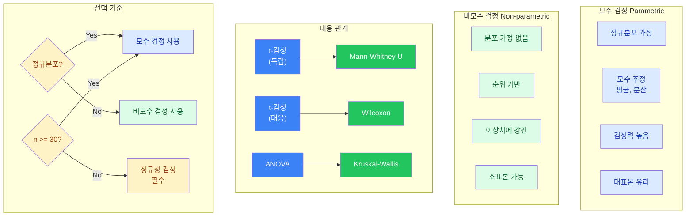
```mermaid
flowchart TB
    subgraph 모수검정["모수 검정 Parametric"]
        P1[정규분포 가정]
        P2[모수 추정<br/>평균, 분산]
        P3[검정력 높음]
        P4[대표본 유리]
    end

    subgraph 비모수검정["비모수 검정 Non-parametric"]
        NP1[분포 가정 없음]
        NP2[순위 기반]
        NP3[이상치에 강건]
        NP4[소표본 가능]
    end

    subgraph 대응관계["대응 관계"]
        M1["t-검정<br/>(독립)"] --> N1["Mann-Whitney U"]
        M2["t-검정<br/>(대응)"] --> N2["Wilcoxon"]
        M3["ANOVA"] --> N3["Kruskal-Wallis"]
    end

    subgraph 선택기준["선택 기준"]
        C1{정규분포?}
        C1 --> |"Yes"| USE_P[모수 검정 사용]
        C1 --> |"No"| USE_NP[비모수 검정 사용]

        C2{n >= 30?}
        C2 --> |"Yes"| USE_P
        C2 --> |"No"| CHECK[정규성 검정<br/>필수]
    end

    style P1 fill:#dbeafe,color:#1e40af
    style P2 fill:#dbeafe,color:#1e40af
    style P3 fill:#dbeafe,color:#1e40af
    style P4 fill:#dbeafe,color:#1e40af
    style NP1 fill:#dcfce7,color:#166534
    style NP2 fill:#dcfce7,color:#166534
    style NP3 fill:#dcfce7,color:#166534
    style NP4 fill:#dcfce7,color:#166534
    style M1 fill:#3b82f6,color:#fff
    style M2 fill:#3b82f6,color:#fff
    style M3 fill:#3b82f6,color:#fff
    style N1 fill:#22c55e,color:#fff
    style N2 fill:#22c55e,color:#fff
    style N3 fill:#22c55e,color:#fff
    style C1 fill:#fef3c7,color:#92400e
    style C2 fill:#fef3c7,color:#92400e
    style USE_P fill:#dbeafe,color:#1e40af
    style USE_NP fill:#dcfce7,color:#166534
    style CHECK fill:#fef3c7,color:#92400e
```

---

## 17. 검정 선택 플로우차트

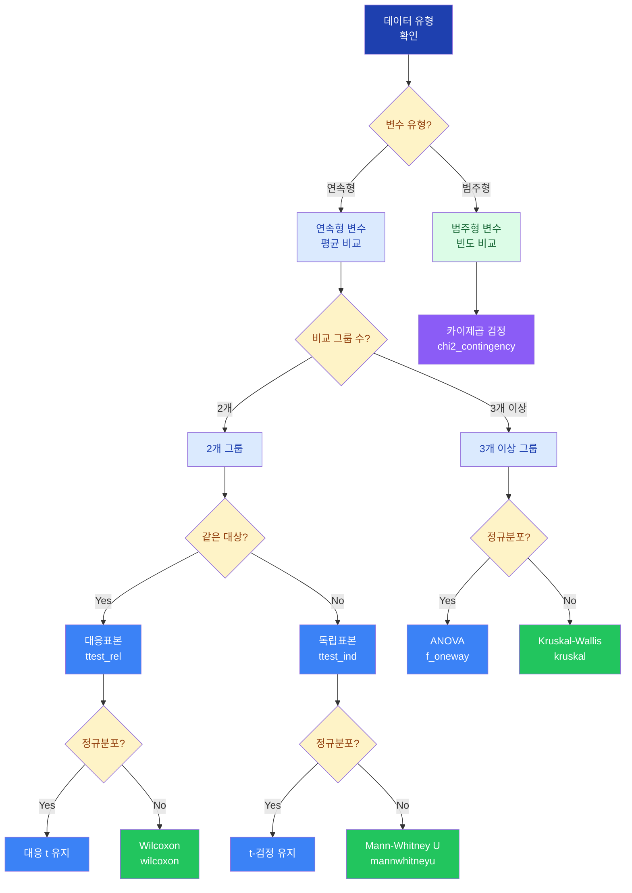
```mermaid
flowchart TB
    START[데이터 유형<br/>확인]

    START --> TYPE{변수 유형?}

    TYPE --> |"연속형"| CONT[연속형 변수<br/>평균 비교]
    TYPE --> |"범주형"| CAT[범주형 변수<br/>빈도 비교]

    CONT --> GROUPS{비교 그룹 수?}

    GROUPS --> |"2개"| TWO[2개 그룹]
    GROUPS --> |"3개 이상"| THREE[3개 이상 그룹]

    TWO --> PAIR{같은 대상?}
    PAIR --> |"Yes"| PAIRED_T[대응표본<br/>ttest_rel]
    PAIR --> |"No"| IND_T[독립표본<br/>ttest_ind]

    THREE --> NORM1{정규분포?}
    NORM1 --> |"Yes"| ANOVA[ANOVA<br/>f_oneway]
    NORM1 --> |"No"| KW[Kruskal-Wallis<br/>kruskal]

    IND_T --> NORM2{정규분포?}
    NORM2 --> |"Yes"| KEEP_T[t-검정 유지]
    NORM2 --> |"No"| MW[Mann-Whitney U<br/>mannwhitneyu]

    PAIRED_T --> NORM3{정규분포?}
    NORM3 --> |"Yes"| KEEP_PT[대응 t 유지]
    NORM3 --> |"No"| WILC[Wilcoxon<br/>wilcoxon]

    CAT --> CHI[카이제곱 검정<br/>chi2_contingency]

    style START fill:#1e40af,color:#fff
    style TYPE fill:#fef3c7,color:#92400e
    style CONT fill:#dbeafe,color:#1e40af
    style CAT fill:#dcfce7,color:#166534
    style GROUPS fill:#fef3c7,color:#92400e
    style TWO fill:#dbeafe,color:#1e40af
    style THREE fill:#dbeafe,color:#1e40af
    style PAIR fill:#fef3c7,color:#92400e
    style PAIRED_T fill:#3b82f6,color:#fff
    style IND_T fill:#3b82f6,color:#fff
    style NORM1 fill:#fef3c7,color:#92400e
    style NORM2 fill:#fef3c7,color:#92400e
    style NORM3 fill:#fef3c7,color:#92400e
    style ANOVA fill:#3b82f6,color:#fff
    style KW fill:#22c55e,color:#fff
    style KEEP_T fill:#3b82f6,color:#fff
    style MW fill:#22c55e,color:#fff
    style KEEP_PT fill:#3b82f6,color:#fff
    style WILC fill:#22c55e,color:#fff
    style CHI fill:#8b5cf6,color:#fff
```

---

## 18. 정규성 검정 절차

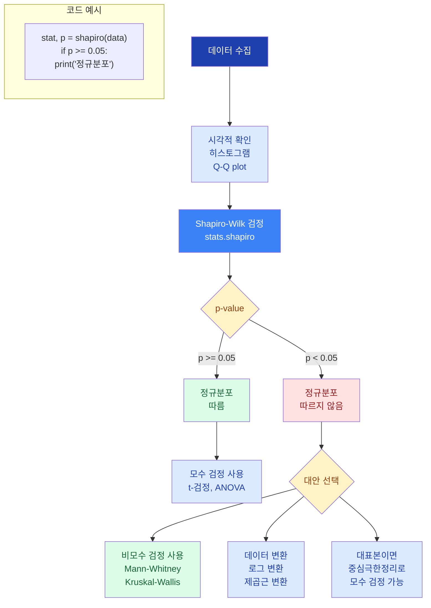
```mermaid
flowchart TB
    DATA[데이터 수집]

    DATA --> VIS[시각적 확인<br/>히스토그램<br/>Q-Q plot]

    VIS --> SHAPIRO[Shapiro-Wilk 검정<br/>stats.shapiro]

    SHAPIRO --> RESULT{p-value}

    RESULT --> |"p >= 0.05"| NORMAL[정규분포<br/>따름]
    RESULT --> |"p < 0.05"| NONNORMAL[정규분포<br/>따르지 않음]

    NORMAL --> PARAM[모수 검정 사용<br/>t-검정, ANOVA]

    NONNORMAL --> OPTIONS{대안 선택}

    OPTIONS --> OPT1[비모수 검정 사용<br/>Mann-Whitney<br/>Kruskal-Wallis]
    OPTIONS --> OPT2[데이터 변환<br/>로그 변환<br/>제곱근 변환]
    OPTIONS --> OPT3[대표본이면<br/>중심극한정리로<br/>모수 검정 가능]

    subgraph 코드["코드 예시"]
        CODE["stat, p = shapiro(data)<br/>if p >= 0.05:<br/>    print('정규분포')"]
    end

    style DATA fill:#1e40af,color:#fff
    style VIS fill:#dbeafe,color:#1e40af
    style SHAPIRO fill:#3b82f6,color:#fff
    style RESULT fill:#fef3c7,color:#92400e
    style NORMAL fill:#dcfce7,color:#166534
    style NONNORMAL fill:#fee2e2,color:#991b1b
    style PARAM fill:#dbeafe,color:#1e40af
    style OPTIONS fill:#fef3c7,color:#92400e
    style OPT1 fill:#dcfce7,color:#166534
    style OPT2 fill:#dbeafe,color:#1e40af
    style OPT3 fill:#dbeafe,color:#1e40af
```

---

## 19. 실습 흐름도

```mermaid
flowchart TB
    subgraph 환경설정["1. 환경 설정"]
        E1[라이브러리 import]
        E2[데이터 로드]
        E3[한글 폰트 설정]
    end

    subgraph 실습1["2. Iris t-검정"]
        T1[품종 데이터 분리]
        T2[기술통계 확인]
        T3[정규성 검정]
        T4[t-검정 수행]
        T5[결과 해석]
    end

    subgraph 실습2["3. Wine ANOVA"]
        A1[품질 그룹 생성]
        A2[그룹별 통계 확인]
        A3[ANOVA 수행]
        A4[사후분석]
    end

    subgraph 실습3["4. Titanic 카이제곱"]
        C1[교차표 생성]
        C2[비율 확인]
        C3[카이제곱 검정]
        C4[기대빈도 비교]
    end

    subgraph 실습4["5. 비모수 검정"]
        N1[정규성 위반 확인]
        N2[Mann-Whitney U]
        N3[모수와 비교]
    end

    환경설정 --> 실습1
    실습1 --> 실습2
    실습2 --> 실습3
    실습3 --> 실습4

    style E1 fill:#dbeafe,color:#1e40af
    style E2 fill:#dbeafe,color:#1e40af
    style E3 fill:#dbeafe,color:#1e40af
    style T1 fill:#3b82f6,color:#fff
    style T2 fill:#3b82f6,color:#fff
    style T3 fill:#3b82f6,color:#fff
    style T4 fill:#3b82f6,color:#fff
    style T5 fill:#3b82f6,color:#fff
    style A1 fill:#8b5cf6,color:#fff
    style A2 fill:#8b5cf6,color:#fff
    style A3 fill:#8b5cf6,color:#fff
    style A4 fill:#8b5cf6,color:#fff
    style C1 fill:#ec4899,color:#fff
    style C2 fill:#ec4899,color:#fff
    style C3 fill:#ec4899,color:#fff
    style C4 fill:#ec4899,color:#fff
    style N1 fill:#22c55e,color:#fff
    style N2 fill:#22c55e,color:#fff
    style N3 fill:#22c55e,color:#fff
```

---

## 20. 핵심 정리

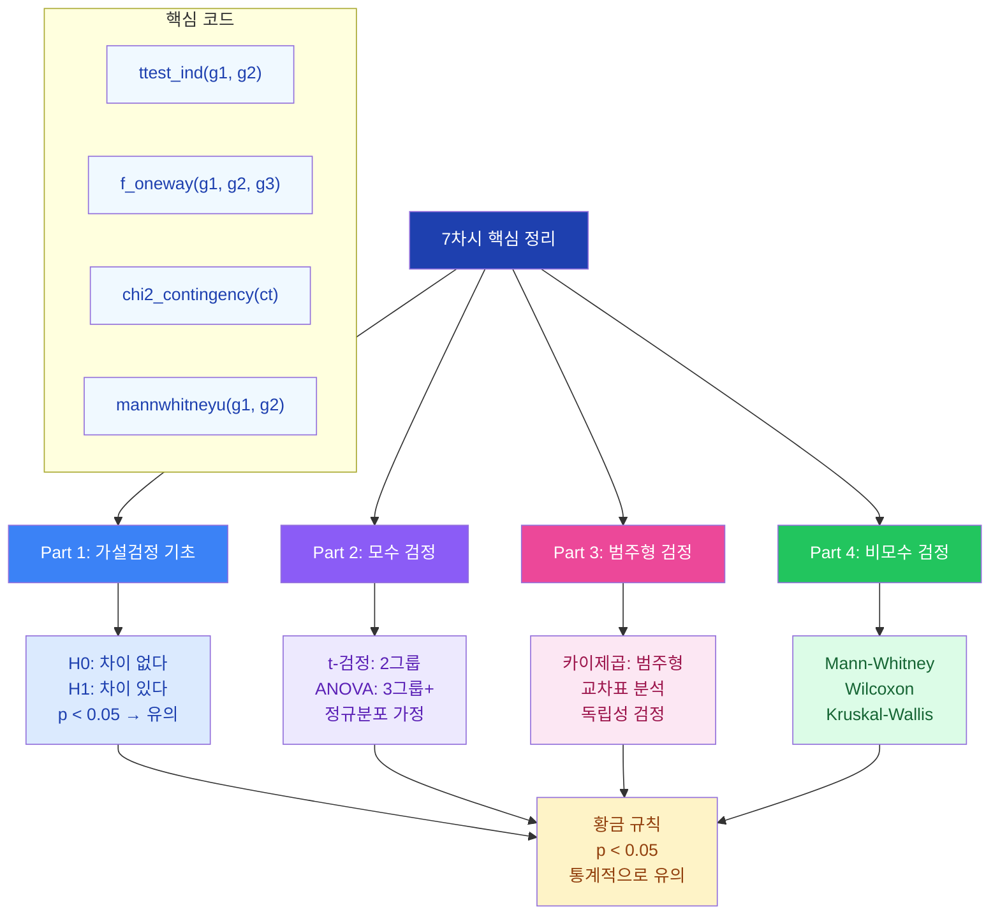
```mermaid
flowchart TB
    TITLE[7차시 핵심 정리]

    TITLE --> PART1[Part 1: 가설검정 기초]
    TITLE --> PART2[Part 2: 모수 검정]
    TITLE --> PART3[Part 3: 범주형 검정]
    TITLE --> PART4[Part 4: 비모수 검정]

    PART1 --> K1["H0: 차이 없다<br/>H1: 차이 있다<br/>p < 0.05 → 유의"]

    PART2 --> K2["t-검정: 2그룹<br/>ANOVA: 3그룹+<br/>정규분포 가정"]

    PART3 --> K3["카이제곱: 범주형<br/>교차표 분석<br/>독립성 검정"]

    PART4 --> K4["Mann-Whitney<br/>Wilcoxon<br/>Kruskal-Wallis"]

    subgraph 핵심코드["핵심 코드"]
        CODE1["ttest_ind(g1, g2)"]
        CODE2["f_oneway(g1, g2, g3)"]
        CODE3["chi2_contingency(ct)"]
        CODE4["mannwhitneyu(g1, g2)"]
    end

    K1 --> GOLDEN[황금 규칙<br/>p < 0.05<br/>통계적으로 유의]
    K2 --> GOLDEN
    K3 --> GOLDEN
    K4 --> GOLDEN

    style TITLE fill:#1e40af,color:#fff
    style PART1 fill:#3b82f6,color:#fff
    style PART2 fill:#8b5cf6,color:#fff
    style PART3 fill:#ec4899,color:#fff
    style PART4 fill:#22c55e,color:#fff
    style K1 fill:#dbeafe,color:#1e40af
    style K2 fill:#ede9fe,color:#5b21b6
    style K3 fill:#fce7f3,color:#9d174d
    style K4 fill:#dcfce7,color:#166534
    style CODE1 fill:#f0f9ff,color:#1e40af
    style CODE2 fill:#f0f9ff,color:#1e40af
    style CODE3 fill:#f0f9ff,color:#1e40af
    style CODE4 fill:#f0f9ff,color:#1e40af
    style GOLDEN fill:#fef3c7,color:#92400e
```

---

## 21. 다음 차시 연결

```mermaid
flowchart TB
    CURRENT[7차시<br/>통계 검정 실습<br/>완료]

    CURRENT --> LEARNED[배운 내용]

    LEARNED --> L1[가설검정 개념]
    LEARNED --> L2[t-검정, ANOVA]
    LEARNED --> L3[카이제곱 검정]
    LEARNED --> L4[비모수 검정]

    CURRENT --> NEXT[8차시<br/>상관분석과<br/>예측의 기초]

    NEXT --> N1[상관계수<br/>Correlation]
    NEXT --> N2[산점도<br/>Scatter Plot]
    NEXT --> N3[단순선형회귀<br/>Linear Regression]
    NEXT --> N4[sklearn<br/>예측 모델]

    subgraph 연결점["연결점"]
        C1["통계 검정 →<br/>유의한 관계 확인"]
        C2["상관분석 →<br/>관계의 강도 측정"]
        C3["회귀분석 →<br/>예측 모델 구축"]
    end

    L1 --> C1
    C1 --> C2
    C2 --> C3
    C3 --> N3

    subgraph 준비물["8차시 준비물"]
        P1[scipy 복습]
        P2[sklearn 설치 확인]
        P3[matplotlib 시각화]
    end

    style CURRENT fill:#1e40af,color:#fff
    style LEARNED fill:#dbeafe,color:#1e40af
    style NEXT fill:#22c55e,color:#fff
    style L1 fill:#dbeafe,color:#1e40af
    style L2 fill:#dbeafe,color:#1e40af
    style L3 fill:#dbeafe,color:#1e40af
    style L4 fill:#dbeafe,color:#1e40af
    style N1 fill:#dcfce7,color:#166534
    style N2 fill:#dcfce7,color:#166534
    style N3 fill:#dcfce7,color:#166534
    style N4 fill:#dcfce7,color:#166534
    style C1 fill:#fef3c7,color:#92400e
    style C2 fill:#fef3c7,color:#92400e
    style C3 fill:#fef3c7,color:#92400e
    style P1 fill:#f0f9ff,color:#1e40af
    style P2 fill:#f0f9ff,color:#1e40af
    style P3 fill:#f0f9ff,color:#1e40af
```

---

## 추가 다이어그램

### 22. 검정 방법 요약표

```mermaid
flowchart LR
    subgraph 상황["상황"]
        S1["2개 독립 그룹"]
        S2["2개 대응 그룹"]
        S3["3개+ 그룹"]
        S4["범주형 vs 범주형"]
    end

    subgraph 모수["모수 검정"]
        P1["ttest_ind()"]
        P2["ttest_rel()"]
        P3["f_oneway()"]
        P4["chi2_contingency()"]
    end

    subgraph 비모수["비모수 검정"]
        NP1["mannwhitneyu()"]
        NP2["wilcoxon()"]
        NP3["kruskal()"]
        NP4["-"]
    end

    S1 --> P1
    S1 --> NP1
    S2 --> P2
    S2 --> NP2
    S3 --> P3
    S3 --> NP3
    S4 --> P4

    style S1 fill:#dbeafe,color:#1e40af
    style S2 fill:#dbeafe,color:#1e40af
    style S3 fill:#dbeafe,color:#1e40af
    style S4 fill:#dbeafe,color:#1e40af
    style P1 fill:#3b82f6,color:#fff
    style P2 fill:#3b82f6,color:#fff
    style P3 fill:#3b82f6,color:#fff
    style P4 fill:#8b5cf6,color:#fff
    style NP1 fill:#22c55e,color:#fff
    style NP2 fill:#22c55e,color:#fff
    style NP3 fill:#22c55e,color:#fff
```

### 23. 제조업 적용 시나리오

```mermaid
flowchart TB
    MFG[제조업 통계 검정<br/>적용 시나리오]

    MFG --> SC1[품질 비교]
    MFG --> SC2[공정 개선]
    MFG --> SC3[불량 분석]
    MFG --> SC4[효과 검증]

    SC1 --> |"A vs B 라인"| T1[독립표본<br/>t-검정]
    SC2 --> |"개선 전후"| T2[대응표본<br/>t-검정]
    SC3 --> |"3개 교대조"| T3[ANOVA]
    SC4 --> |"라인별 불량유형"| T4[카이제곱]

    T1 --> R1["결과: p=0.03<br/>A라인 품질 우수"]
    T2 --> R2["결과: p=0.01<br/>개선 효과 유의"]
    T3 --> R3["결과: p=0.04<br/>교대조 차이 있음"]
    T4 --> R4["결과: p=0.02<br/>라인별 패턴 다름"]

    R1 --> ACT1[B라인 원인 분석]
    R2 --> ACT2[개선 확대 적용]
    R3 --> ACT3[사후분석으로<br/>원인 파악]
    R4 --> ACT4[라인별 맞춤<br/>품질 관리]

    style MFG fill:#1e40af,color:#fff
    style SC1 fill:#dbeafe,color:#1e40af
    style SC2 fill:#dbeafe,color:#1e40af
    style SC3 fill:#dbeafe,color:#1e40af
    style SC4 fill:#dbeafe,color:#1e40af
    style T1 fill:#3b82f6,color:#fff
    style T2 fill:#3b82f6,color:#fff
    style T3 fill:#8b5cf6,color:#fff
    style T4 fill:#ec4899,color:#fff
    style R1 fill:#dcfce7,color:#166534
    style R2 fill:#dcfce7,color:#166534
    style R3 fill:#dcfce7,color:#166534
    style R4 fill:#dcfce7,color:#166534
    style ACT1 fill:#fef3c7,color:#92400e
    style ACT2 fill:#fef3c7,color:#92400e
    style ACT3 fill:#fef3c7,color:#92400e
    style ACT4 fill:#fef3c7,color:#92400e
```

### 24. 주의사항 체크리스트

```mermaid
flowchart TB
    WARN[자주 하는 실수<br/>주의사항]

    WARN --> W1["p=0.06을<br/>'거의 유의'"]
    WARN --> W2["p값만 보고<br/>판단"]
    WARN --> W3["여러 검정 후<br/>유의한 것만"]
    WARN --> W4["표본 작은데<br/>모수 검정"]
    WARN --> W5["ANOVA 유의하면<br/>끝"]

    W1 --> C1["유의하지 않음<br/>기준 준수"]
    W2 --> C2["효과 크기도<br/>함께 확인"]
    W3 --> C3["다중비교<br/>보정 필요"]
    W4 --> C4["비모수 검정<br/>고려"]
    W5 --> C5["사후분석으로<br/>그룹 확인"]

    style WARN fill:#fee2e2,color:#991b1b
    style W1 fill:#fee2e2,color:#991b1b
    style W2 fill:#fee2e2,color:#991b1b
    style W3 fill:#fee2e2,color:#991b1b
    style W4 fill:#fee2e2,color:#991b1b
    style W5 fill:#fee2e2,color:#991b1b
    style C1 fill:#dcfce7,color:#166534
    style C2 fill:#dcfce7,color:#166534
    style C3 fill:#dcfce7,color:#166534
    style C4 fill:#dcfce7,color:#166534
    style C5 fill:#dcfce7,color:#166534
```

---

## 다이어그램 사용 가이드

### 색상 체계

| 용도 | 색상 코드 | 설명 |
|------|----------|------|
| 주요 노드 | `fill:#1e40af,color:#fff` | 진한 파랑 배경, 흰색 텍스트 |
| 보조 노드 | `fill:#dbeafe,color:#1e40af` | 연한 파랑 배경 |
| 결과/성공 | `fill:#dcfce7,color:#166534` | 연한 초록 배경 |
| 경고/오류 | `fill:#fee2e2,color:#991b1b` | 연한 빨강 배경 |
| 주의/판단 | `fill:#fef3c7,color:#92400e` | 연한 노랑 배경 |
| 보라 계열 | `fill:#8b5cf6,color:#fff` | ANOVA, 특수 검정 |
| 분홍 계열 | `fill:#ec4899,color:#fff` | 카이제곱 관련 |
| 초록 계열 | `fill:#22c55e,color:#fff` | 비모수 검정 |

### Mermaid 렌더링 참고사항

- GitHub, VS Code, Notion 등 대부분의 마크다운 뷰어에서 지원
- 슬라이드 도구에서는 이미지로 변환하여 사용 권장
- 온라인 에디터: https://mermaid.live/
