# [8차시] 상관분석과 예측의 기초 - 다이어그램

## 1. 학습 흐름

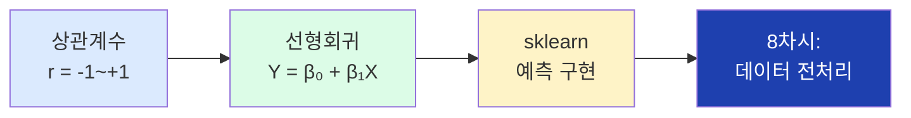

## 2. 상관관계의 종류

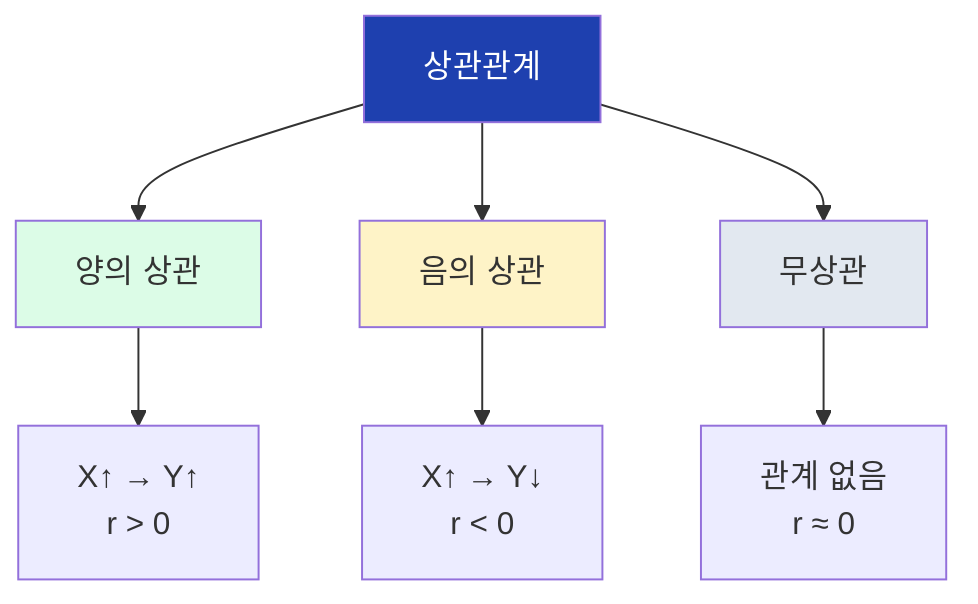

## 3. 상관계수 범위

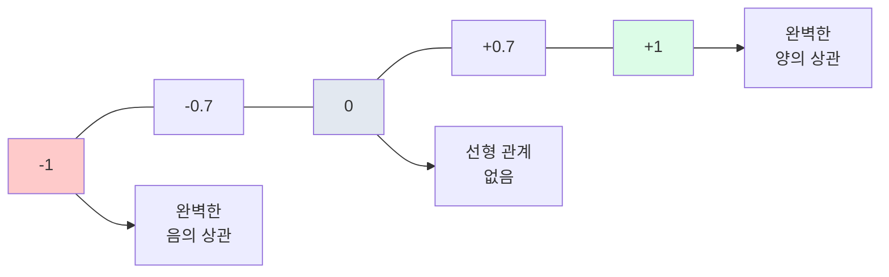

## 4. 상관계수 해석 기준

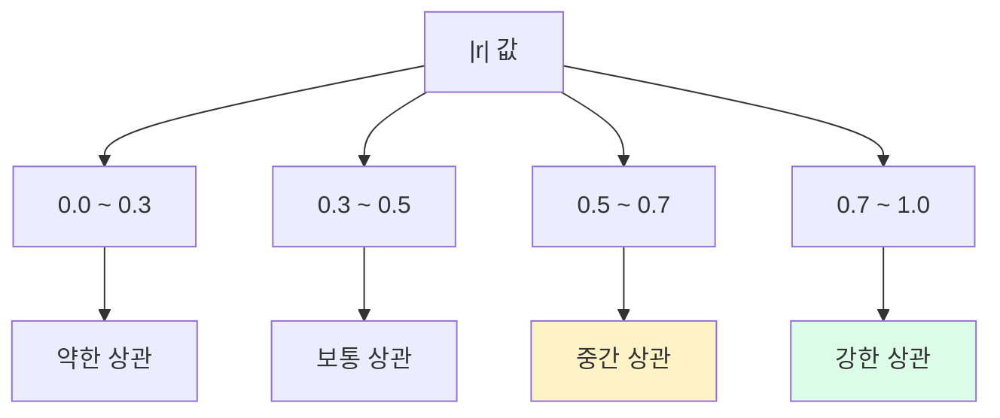

## 5. 상관 vs 인과

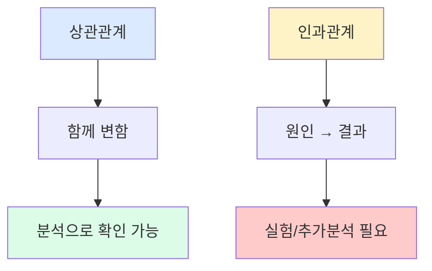

## 6. 허위 상관 예시

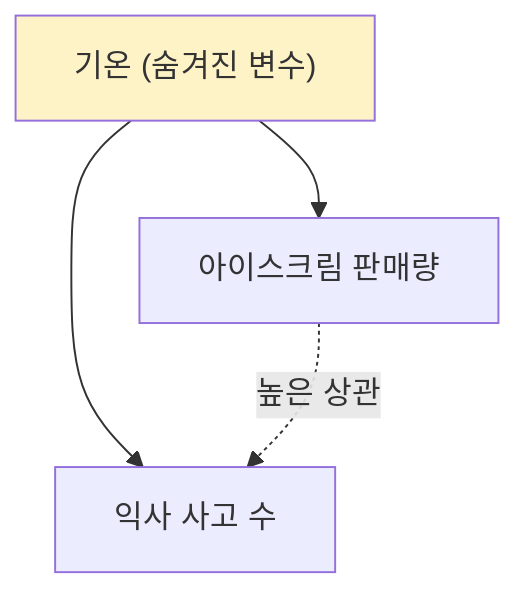

## 7. 상관행렬

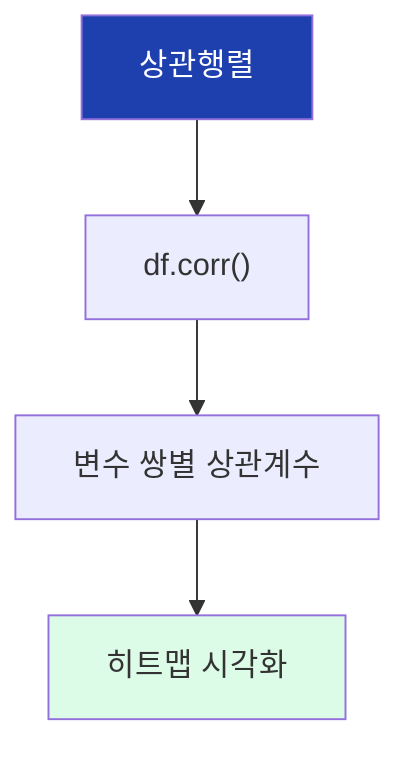

## 8. 회귀분석 용어

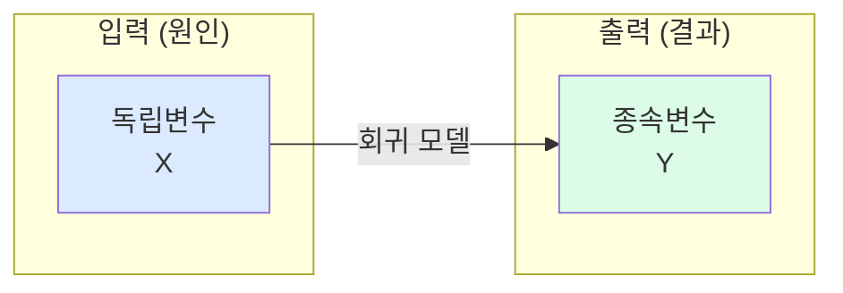

## 9. 단순선형회귀 공식

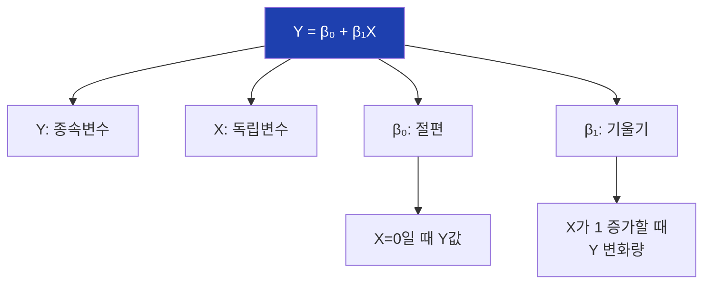

## 10. 회귀선의 의미

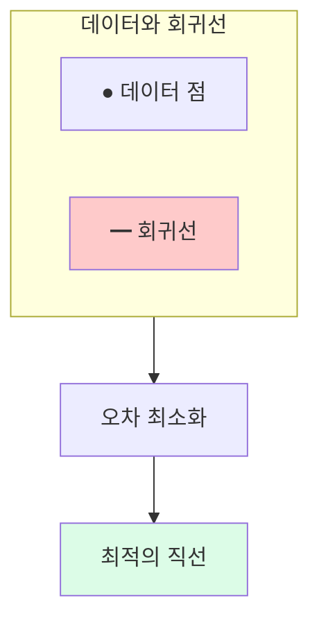

## 11. 최소제곱법 (OLS)

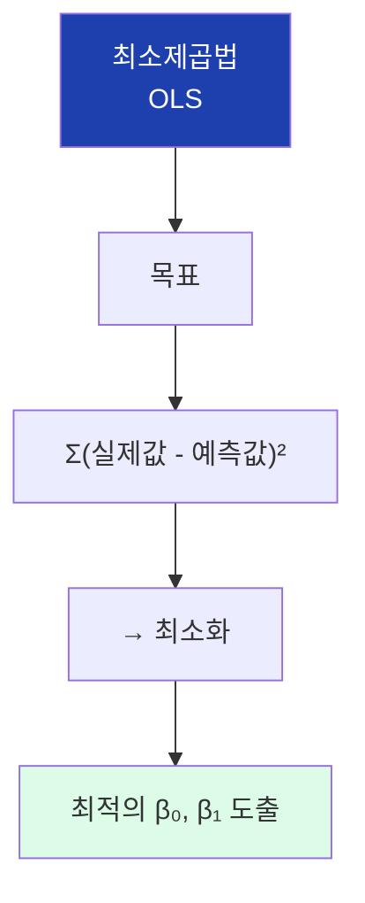

## 12. 잔차 개념

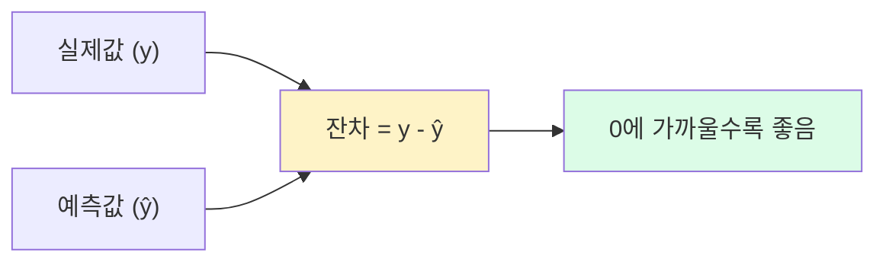

## 13. R² (결정계수)

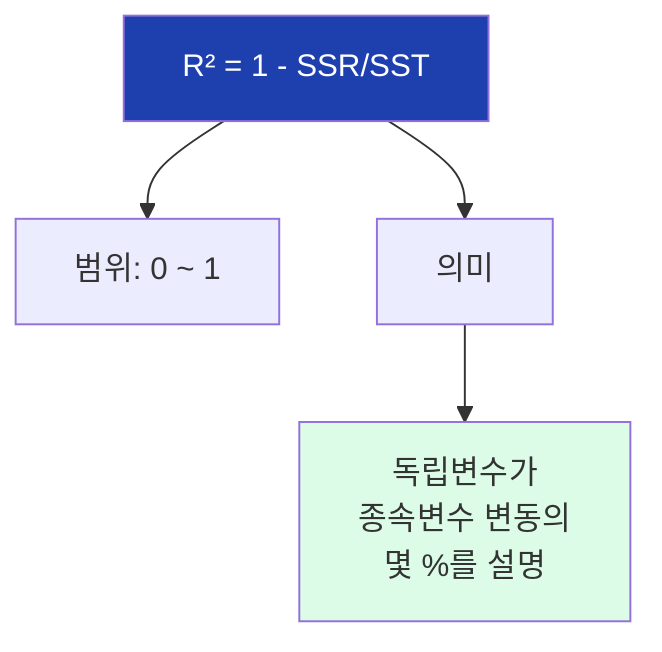

## 14. R² 해석 기준

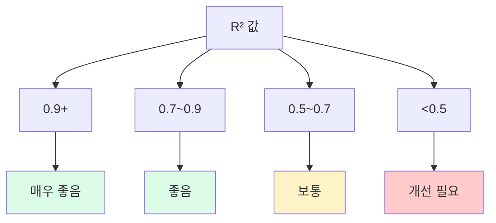

## 15. 회귀 모델 가정

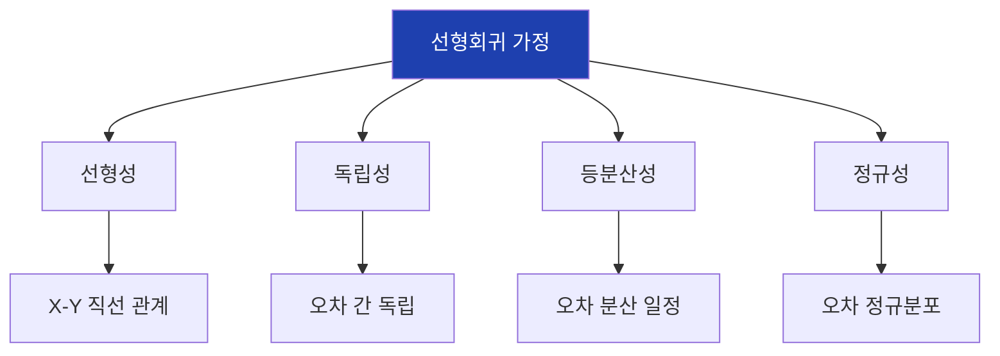

## 16. sklearn 기본 구조

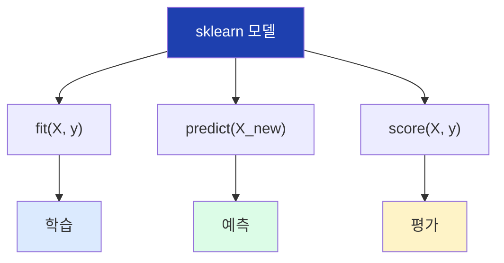

## 17. LinearRegression 사용법

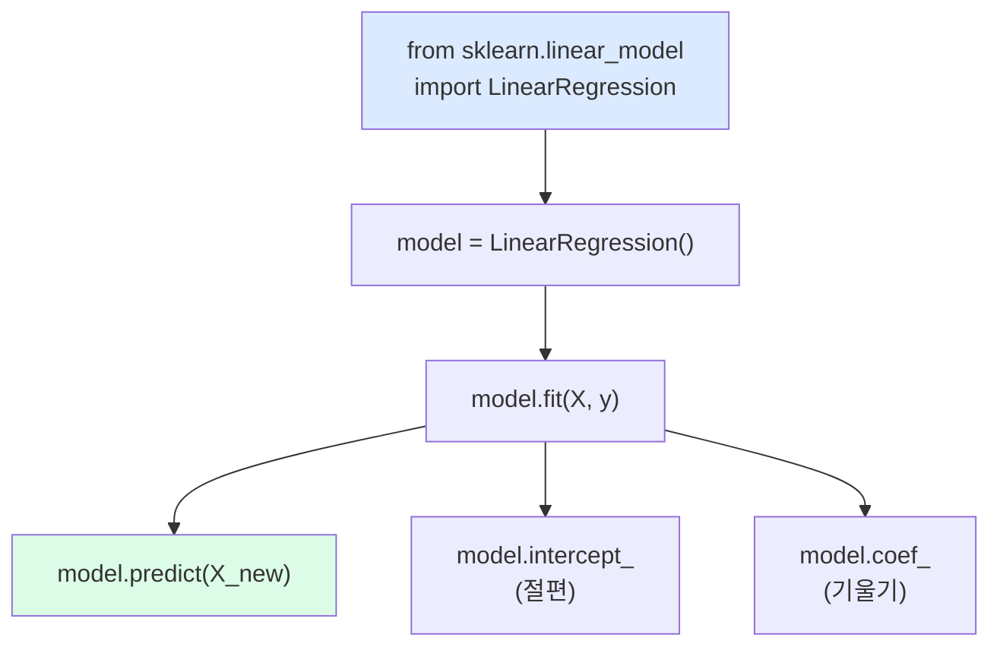

## 18. X 데이터 형태 주의

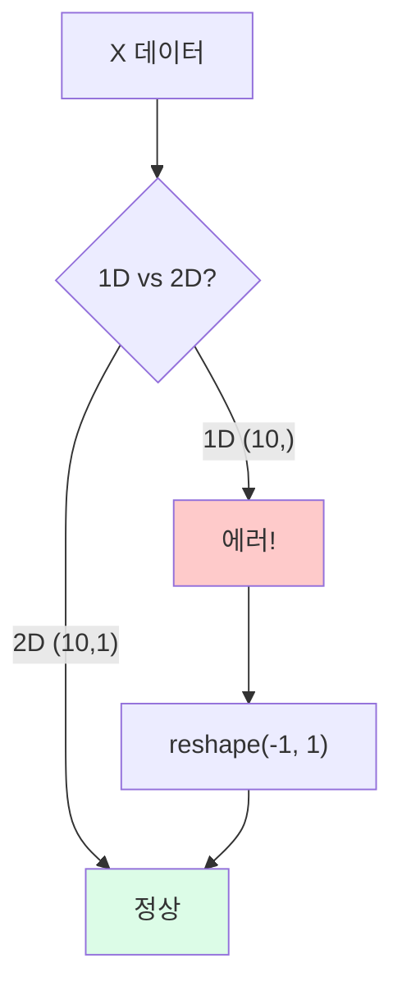

## 19. 모델 평가 지표

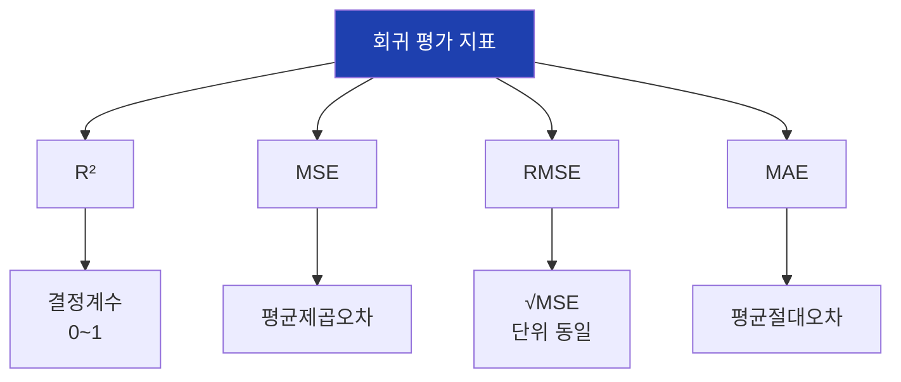

## 20. 잔차 분석

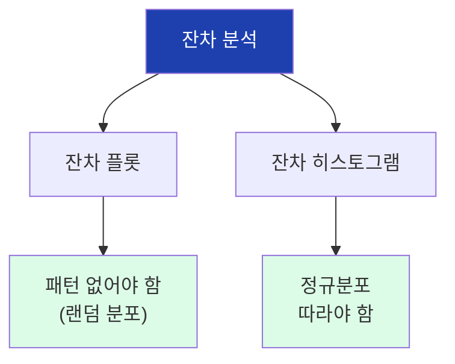

## 21. 예측 활용

```mermaid
flowchart TD
    A["model.predict()"]

    A --> B["순방향 예측"]
    A --> C["역방향 계산"]

    B --> B1["온도 85도<br>→ 불량률?"]
    C --> C1["불량률 5%<br>→ 온도 상한?"]

    style A fill:#1e40af,color:#fff
    style B1 fill:#dcfce7
    style C1 fill:#fef3c7
```

## 22. 다중선형회귀 미리보기

```mermaid
flowchart TD
    subgraph 단순["단순선형회귀"]
        A1["X"]
        A2["Y"]
        A1 --> A2
    end

    subgraph 다중["다중선형회귀"]
        B1["X₁"]
        B2["X₂"]
        B3["X₃"]
        B4["Y"]
        B1 --> B4
        B2 --> B4
        B3 --> B4
    end

    style A2 fill:#dcfce7
    style B4 fill:#dcfce7
```

## 23. 실습 흐름

```mermaid
flowchart TD
    A["데이터 준비"]
    B["산점도 확인"]
    C["상관계수 계산"]
    D["선형회귀 학습"]
    E["회귀선 시각화"]
    F["모델 평가"]
    G["예측 수행"]
    H["잔차 분석"]

    A --> B --> C --> D --> E --> F --> G --> H

    style A fill:#dbeafe
    style H fill:#dcfce7
```

## 24. 상관분석 코드

```mermaid
flowchart TD
    subgraph NumPy
        A1["np.corrcoef(X, Y)[0,1]"]
    end

    subgraph Pandas
        B1["df['X'].corr(df['Y'])"]
        B2["df.corr() (상관행렬)"]
    end

    style A1 fill:#dcfce7
    style B1 fill:#dcfce7
```

## 25. 선형회귀 코드

```mermaid
flowchart TD
    A["LinearRegression()"]
    B[".fit(X, y)"]
    C[".predict(X_new)"]
    D["r2_score(y, y_pred)"]

    A --> B --> C
    C --> D

    style A fill:#dbeafe
    style D fill:#dcfce7
```

## 26. 상관 → 회귀 → 예측

```mermaid
flowchart LR
    A["상관분석"]
    B["회귀분석"]
    C["예측"]

    A -->|"관계 확인"| B
    B -->|"모델 학습"| C

    A --> A1["r = 0.85"]
    B --> B1["Y = 1.5 + 0.05X"]
    C --> C1["X=90 → Y=6.0"]

    style A fill:#dbeafe
    style B fill:#fef3c7
    style C fill:#dcfce7
```

## 27. 핵심 개념 요약

```mermaid
flowchart TD
    A["8차시 핵심"]

    A --> B["상관계수 r"]
    A --> C["선형회귀"]
    A --> D["R²"]

    B --> B1["-1 ~ +1<br>|r|>0.7: 강한상관"]
    C --> C1["Y = β₀ + β₁X"]
    D --> D1["설명력<br>1에 가까울수록 좋음"]

    style A fill:#1e40af,color:#fff
    style B1 fill:#dbeafe
    style C1 fill:#fef3c7
    style D1 fill:#dcfce7
```

## 28. 주의사항

```mermaid
flowchart TD
    A["주의사항"]

    A --> B["상관 ≠ 인과"]
    A --> C["X는 2D 배열"]
    A --> D["잔차 분석 필수"]

    B --> B1["숨겨진 변수 주의"]
    C --> C1["reshape(-1, 1)"]
    D --> D1["패턴 없어야 정상"]

    style A fill:#fecaca
    style B1 fill:#fef3c7
    style C1 fill:#fef3c7
    style D1 fill:#fef3c7
```
