# [9차시] 제조 데이터 전처리 (1) - 다이어그램

## 1. 학습 흐름

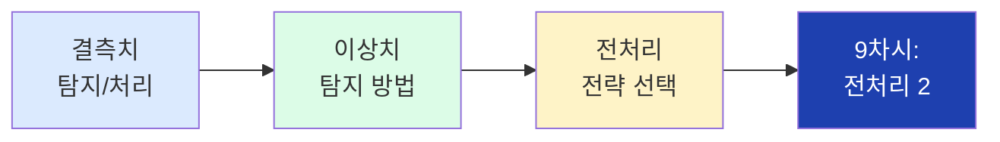

## 2. 전처리의 중요성

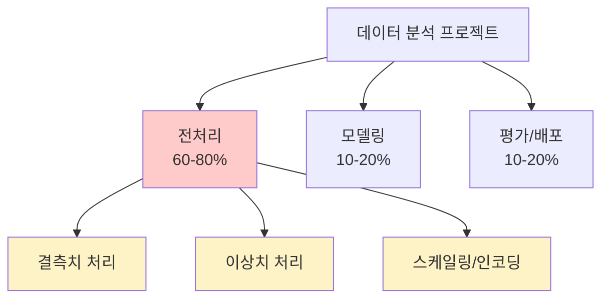

## 3. Garbage In, Garbage Out

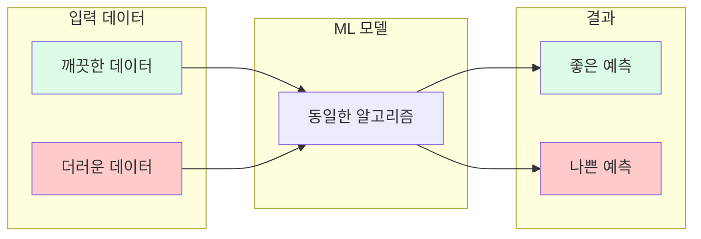

## 4. 결측치 발생 원인

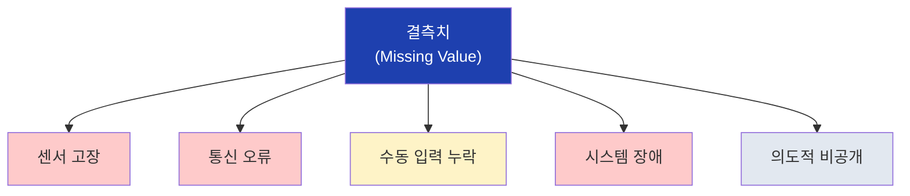

## 5. 결측치 탐지 메서드

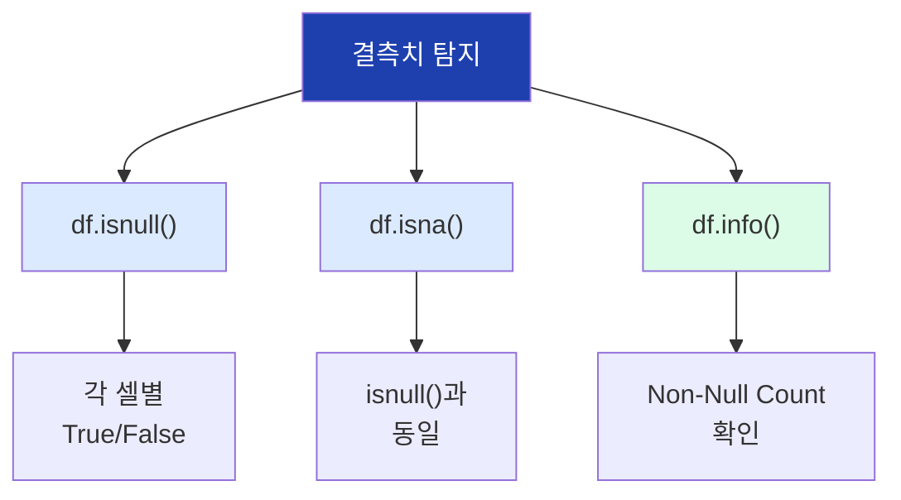

## 6. 결측치 집계

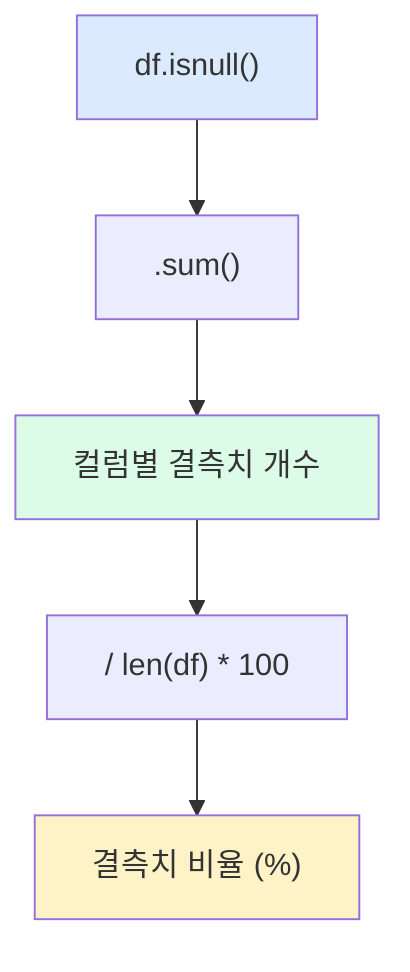

## 7. 결측치 비율 기준

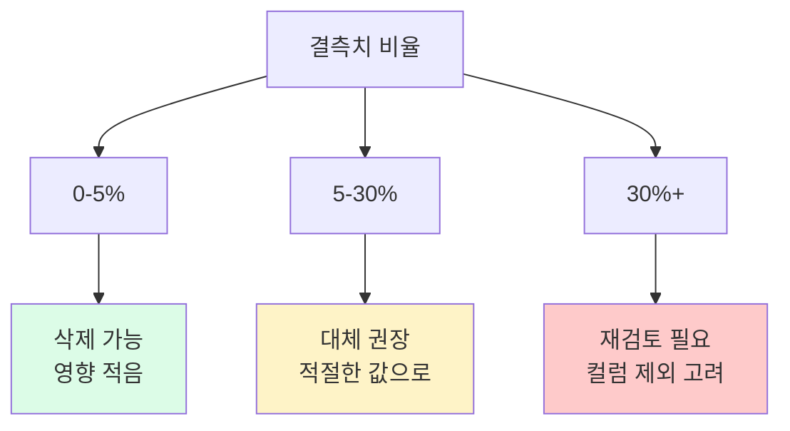

## 8. 결측치 처리 방법

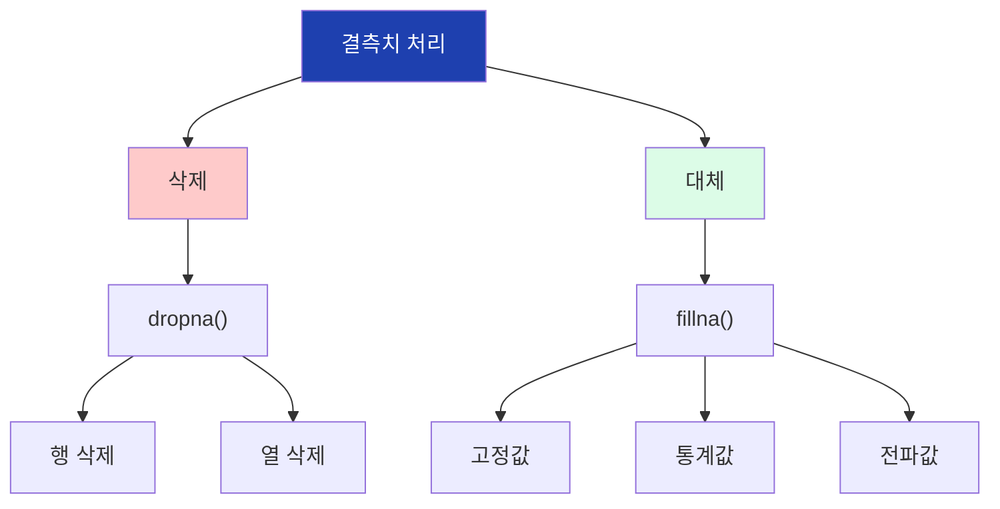

## 9. dropna 옵션

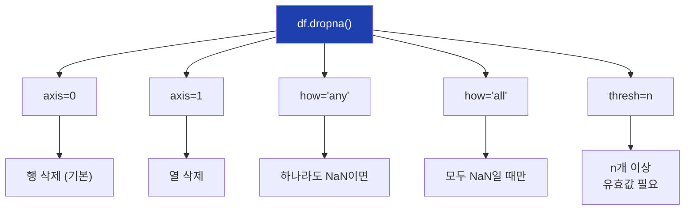

## 10. fillna 옵션

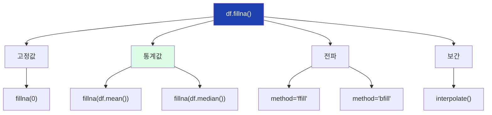

## 11. 대체 전략 선택

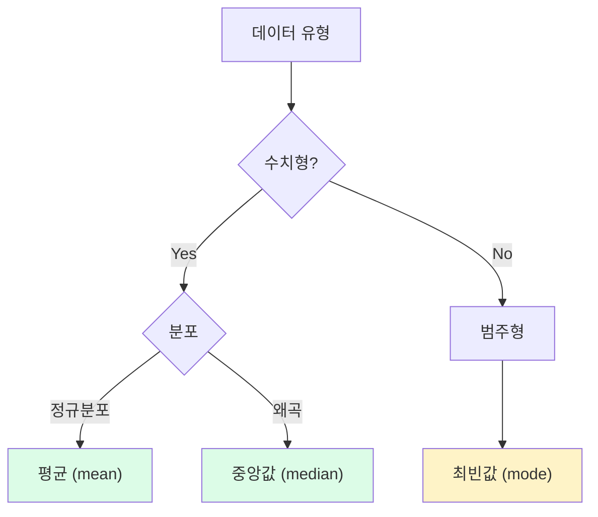

## 12. 시계열 결측치 처리

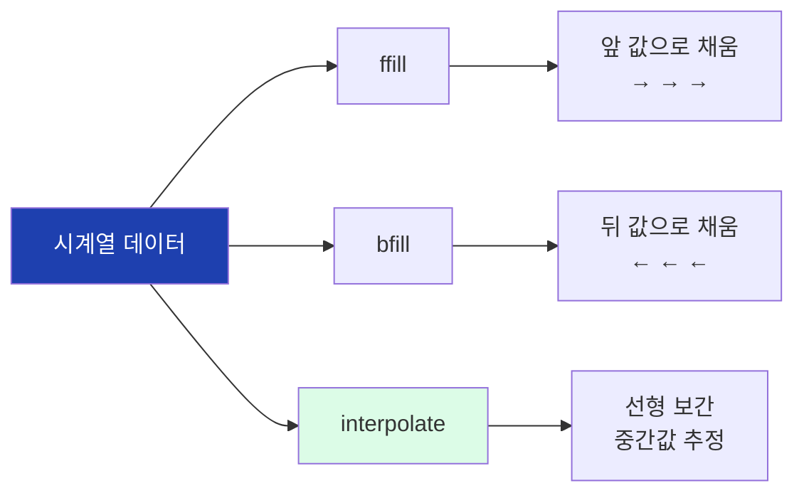

## 13. 이상치란

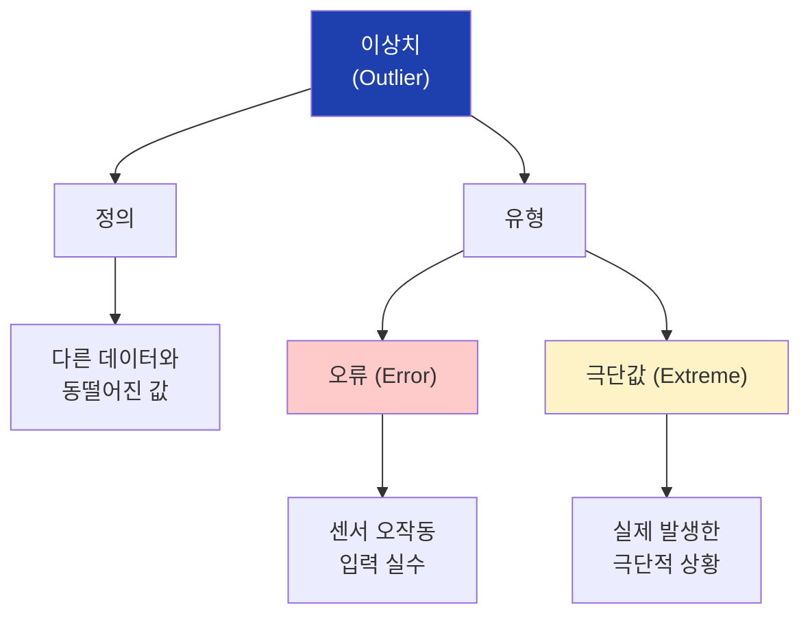

## 14. IQR 개념

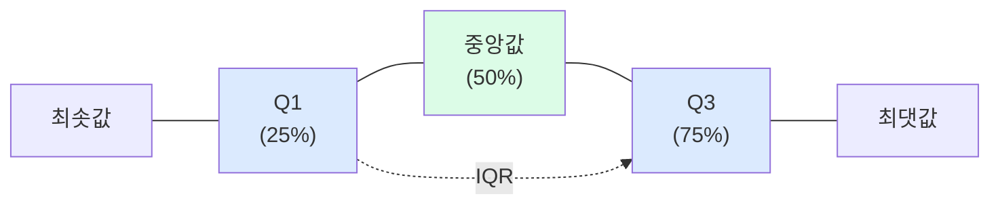

## 15. IQR 이상치 기준

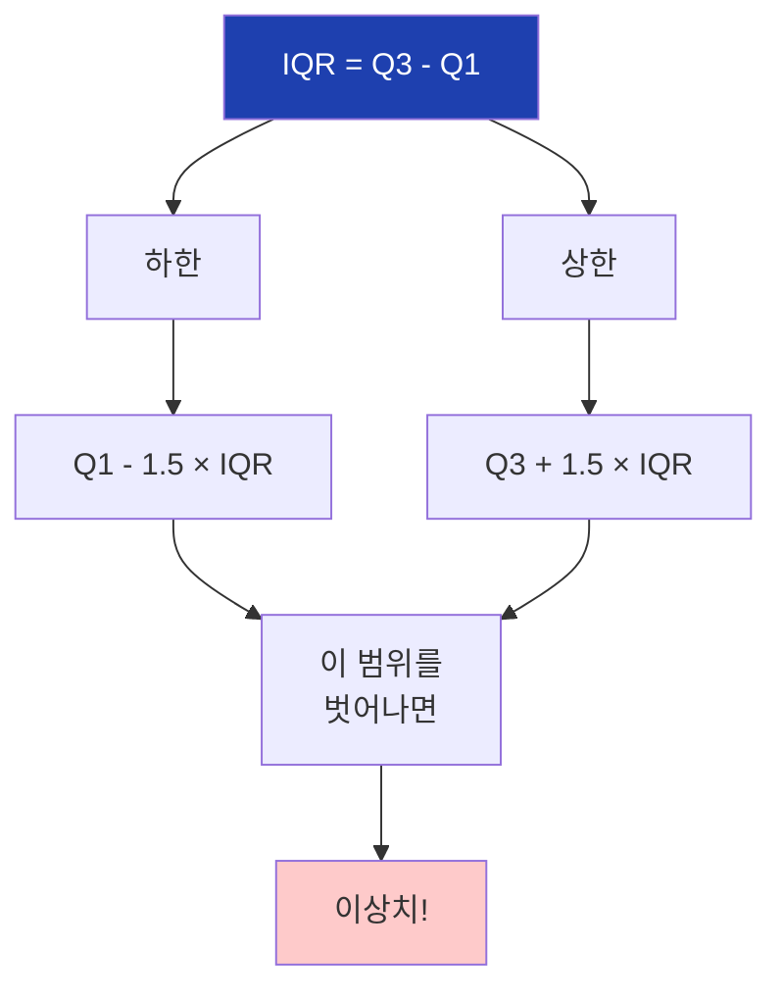

## 16. IQR 시각화

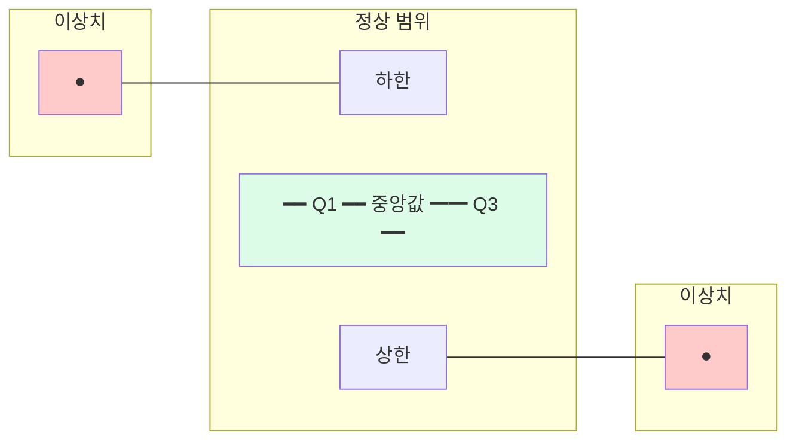

## 17. IQR 계산 코드

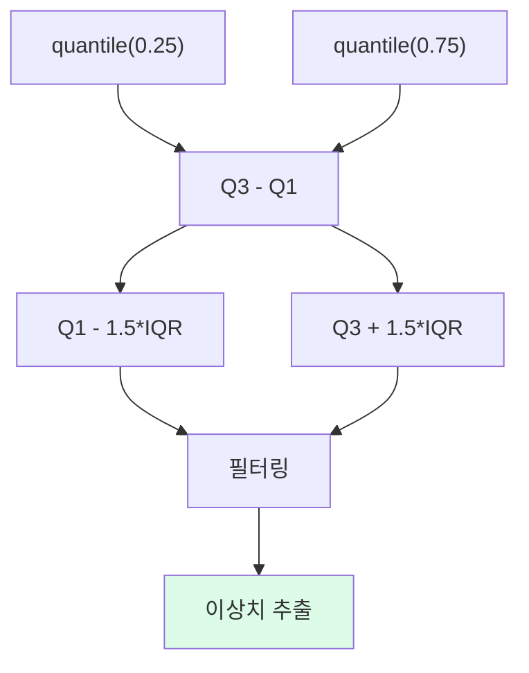

## 18. Z-score 개념

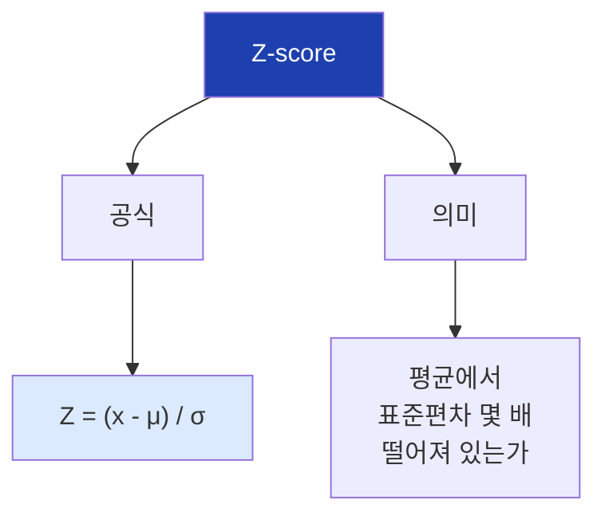

## 19. Z-score 이상치 기준

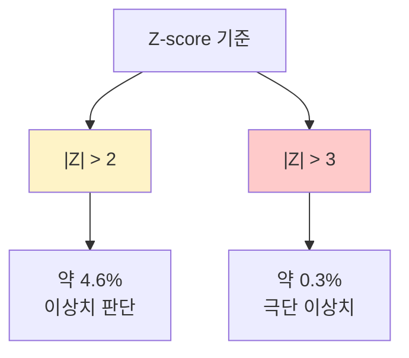

## 20. IQR vs Z-score 비교

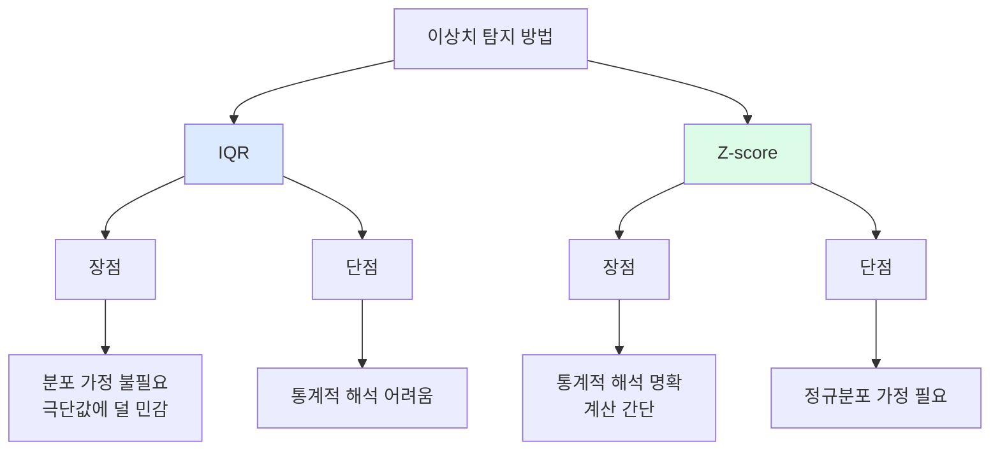

## 21. 이상치 처리 전략

```mermaid
flowchart TD
    A["이상치 처리"]

    A --> B["제거"]
    A --> C["대체"]
    A --> D["유지"]

    B --> B1["행 삭제"]
    C --> C1["Clipping"]
    C --> C2["경계값 대체"]
    D --> D1["플래그 추가"]
    D --> D2["별도 분석"]

    style A fill:#1e40af,color:#fff
    style C fill:#dcfce7
```

## 22. Clipping 개념

```mermaid
flowchart LR
    subgraph 전["처리 전"]
        A1["-50"]
        A2["25"]
        A3["150"]
    end

    subgraph 후["Clipping 후"]
        B1["10"]
        B2["25"]
        B3["50"]
    end

    A1 -->|"clip(10,50)"| B1
    A2 -->|"유지"| B2
    A3 -->|"clip(10,50)"| B3

    style A1 fill:#fecaca
    style A3 fill:#fecaca
    style B1 fill:#dcfce7
    style B3 fill:#dcfce7
```

## 23. clip 함수

```mermaid
flowchart TD
    A["df['col'].clip()"]

    A --> B["lower=값"]
    A --> C["upper=값"]

    B --> B1["하한 미만 →<br>하한값으로 대체"]
    C --> C1["상한 초과 →<br>상한값으로 대체"]

    style A fill:#1e40af,color:#fff
    style B1 fill:#dcfce7
    style C1 fill:#dcfce7
```

## 24. 플래그 추가

```mermaid
flowchart TD
    A["이상치 플래그"]

    A --> B["is_outlier 컬럼"]
    B --> C["True / False"]

    C --> D["활용"]
    D --> D1["이상치만 필터링"]
    D --> D2["모델 학습 시 제외"]
    D --> D3["별도 분석"]

    style A fill:#1e40af,color:#fff
    style D fill:#dcfce7
```

## 25. 전처리 순서

```mermaid
flowchart TD
    A["1단계: 결측치"]
    B["2단계: 이상치"]
    C["3단계: 추가 전처리"]

    A --> B --> C

    A --> A1["isnull → fillna/dropna"]
    B --> B1["IQR/Z-score → clip/제거"]
    C --> C1["스케일링, 인코딩<br>(9차시)"]

    style A fill:#dbeafe
    style B fill:#dcfce7
    style C fill:#fef3c7
```

## 26. 전처리 판단 플로우

```mermaid
flowchart TD
    A["결측치 발견"]

    A --> B{"비율?"}
    B -->|"<5%"| C["삭제"]
    B -->|"5-30%"| D["대체"]
    B -->|">30%"| E["컬럼 제외 고려"]

    D --> F{"수치형?"}
    F -->|Yes| G["mean/median"]
    F -->|No| H["mode"]

    style C fill:#dcfce7
    style D fill:#fef3c7
    style E fill:#fecaca
```

## 27. 이상치 판단 플로우

```mermaid
flowchart TD
    A["이상치 발견"]

    A --> B{"오류인가?"}
    B -->|"명백한 오류"| C["제거/대체"]
    B -->|"실제 극단값"| D["유지/플래그"]
    B -->|"불확실"| E["도메인 전문가<br>확인"]

    C --> F["clip() 또는<br>행 삭제"]
    D --> G["분석에 포함<br>또는 별도 처리"]

    style C fill:#fecaca
    style D fill:#dcfce7
    style E fill:#fef3c7
```

## 28. 전처리 체크리스트

```mermaid
flowchart TD
    A["전처리 체크리스트"]

    A --> B["1. 데이터 형태 확인"]
    A --> C["2. 결측치 현황"]
    A --> D["3. 이상치 탐지"]
    A --> E["4. 분포 확인"]
    A --> F["5. 처리 전략 결정"]
    A --> G["6. 처리 및 검증"]

    B --> B1["df.shape, df.dtypes"]
    C --> C1["df.isnull().sum()"]
    D --> D1["IQR / Z-score"]
    E --> E1["hist(), boxplot()"]

    style A fill:#1e40af,color:#fff
```

## 29. 실습 데이터 구조

```mermaid
flowchart TD
    A["실습 데이터"]

    A --> B["temperature"]
    A --> C["pressure"]
    A --> D["quality"]

    B --> B1["결측: 2개<br>이상치: -50, 150"]
    C --> C1["결측: 1개<br>이상치: 500"]
    D --> D1["결측: 1개<br>범주형"]

    style A fill:#1e40af,color:#fff
    style B1 fill:#fef3c7
    style C1 fill:#fef3c7
    style D1 fill:#dcfce7
```

## 30. 실습 흐름

```mermaid
flowchart TD
    A["데이터 생성"]
    B["결측치 탐지"]
    C["결측치 처리"]
    D["이상치 탐지"]
    E["이상치 처리"]
    F["결과 검증"]

    A --> B --> C --> D --> E --> F

    style A fill:#dbeafe
    style F fill:#dcfce7
```

## 31. 핵심 함수 정리

```mermaid
flowchart TD
    A["전처리 핵심 함수"]

    A --> B["결측치"]
    A --> C["이상치"]
    A --> D["공통"]

    B --> B1["isnull()"]
    B --> B2["dropna()"]
    B --> B3["fillna()"]

    C --> C1["quantile()"]
    C --> C2["clip()"]
    C --> C3["zscore()"]

    D --> D1["info()"]
    D --> D2["describe()"]

    style A fill:#1e40af,color:#fff
```

## 32. 주의사항

```mermaid
flowchart TD
    A["주의사항"]

    A --> B["1. 순서 준수"]
    A --> C["2. 원본 보존"]
    A --> D["3. 문서화"]
    A --> E["4. 검증"]

    B --> B1["결측치 → 이상치"]
    C --> C1["새 컬럼에 결과 저장"]
    D --> D1["왜, 어떻게 처리했는지"]
    E --> E1["처리 전후 비교"]

    style A fill:#fecaca
```

## 33. 다음 차시 연결

```mermaid
flowchart LR
    A["9차시"]
    B["9차시"]

    A --> B

    A --> A1["결측치 처리"]
    A --> A2["이상치 처리"]

    B --> B1["스케일링"]
    B --> B2["인코딩"]
    B --> B3["특성 엔지니어링"]

    style A fill:#dbeafe
    style B fill:#dcfce7
```
