# [10차시] 제조 데이터 전처리 (2) - 다이어그램

## 1. 학습 흐름


## 2. 스케일링 필요성

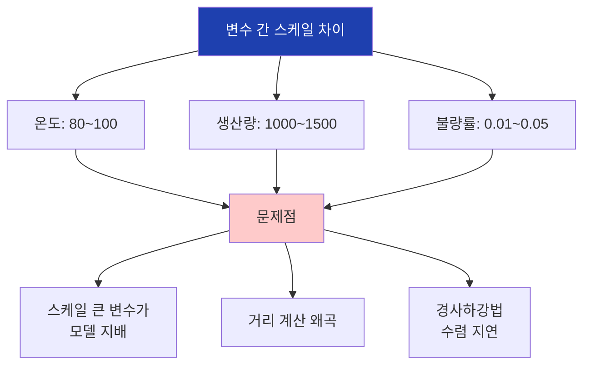

## 3. 스케일링 필요 여부

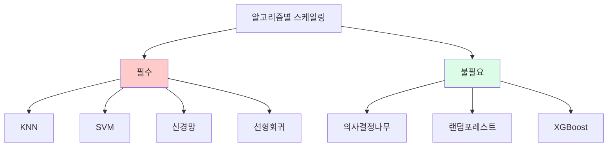

## 4. 표준화 공식

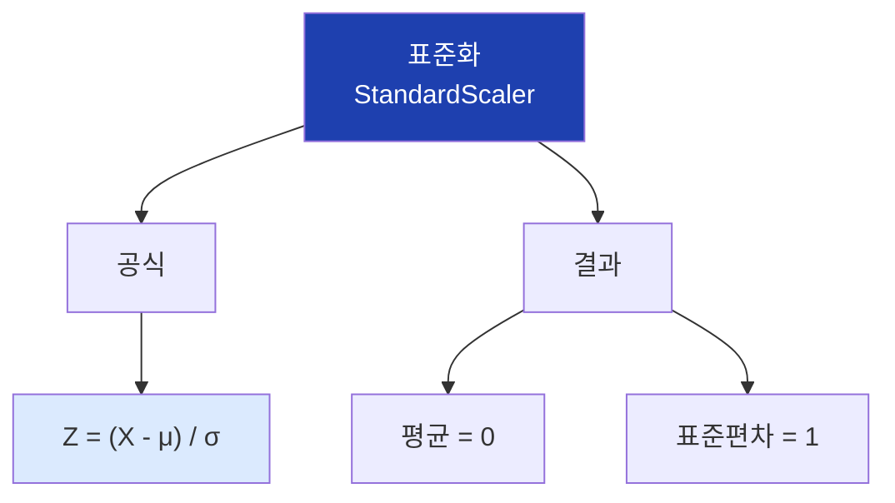

## 5. 정규화 공식

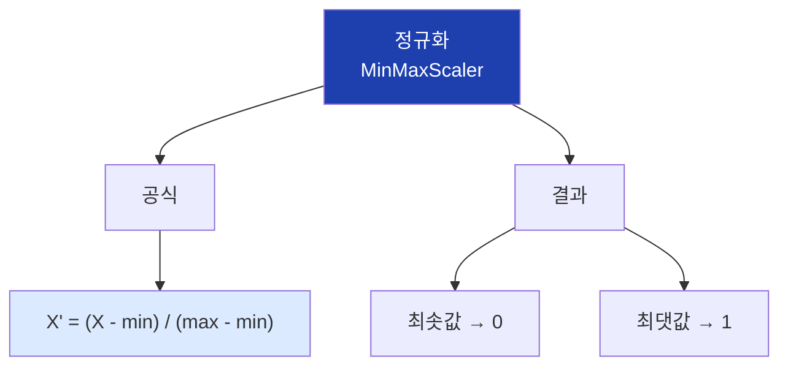

## 6. RobustScaler 공식

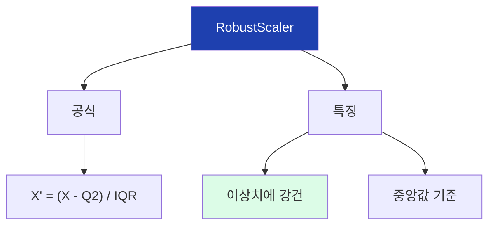

## 7. 스케일링 비교

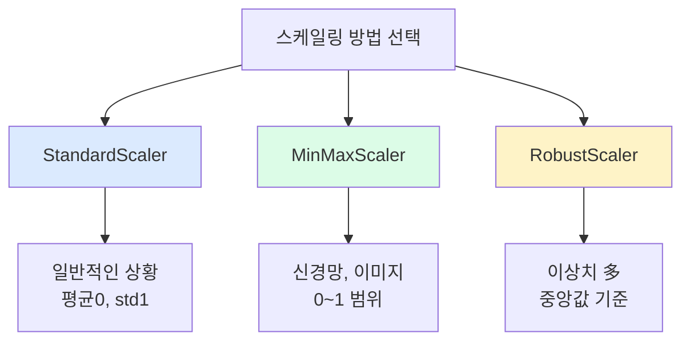

## 8. 스케일링 전후 비교

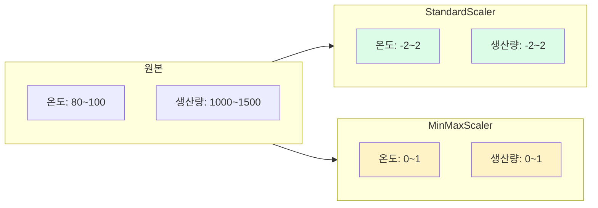

## 9. fit과 transform

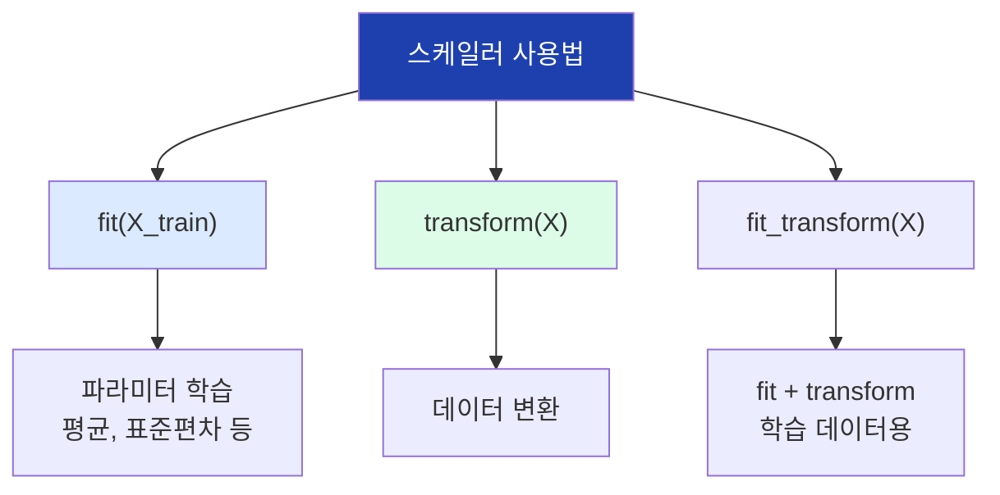

## 10. 데이터 누수 방지

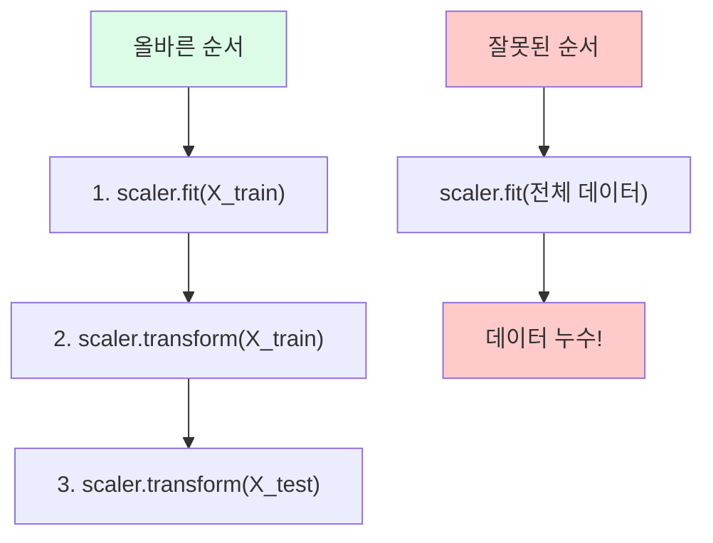

## 11. 범주형 데이터 유형

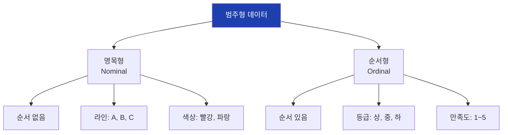

## 12. 레이블 인코딩

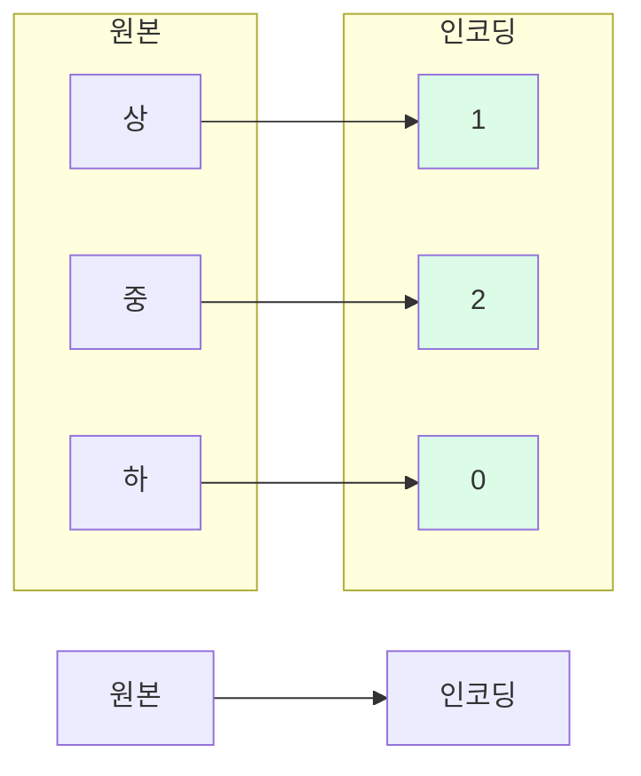

## 13. 레이블 인코딩 특징

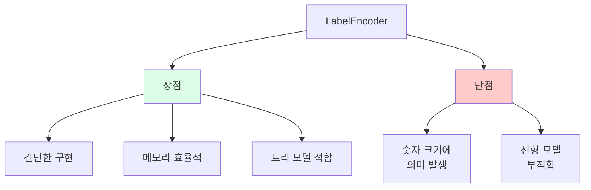

## 14. 원-핫 인코딩

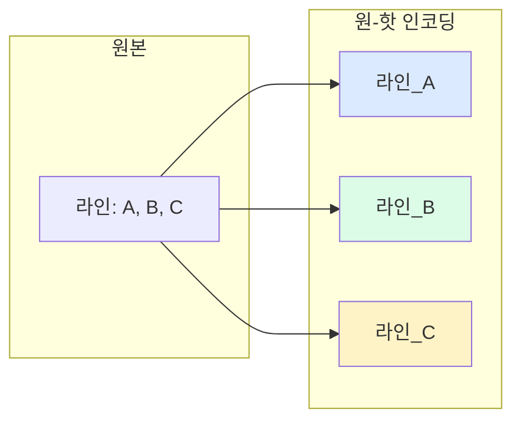

## 15. 원-핫 인코딩 결과

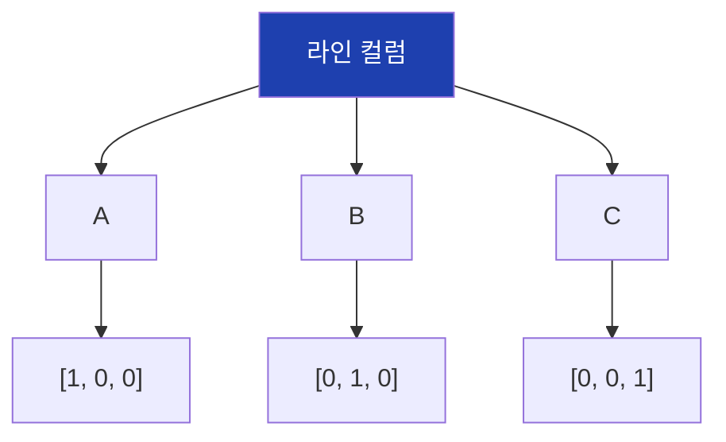

## 16. 인코딩 선택 가이드

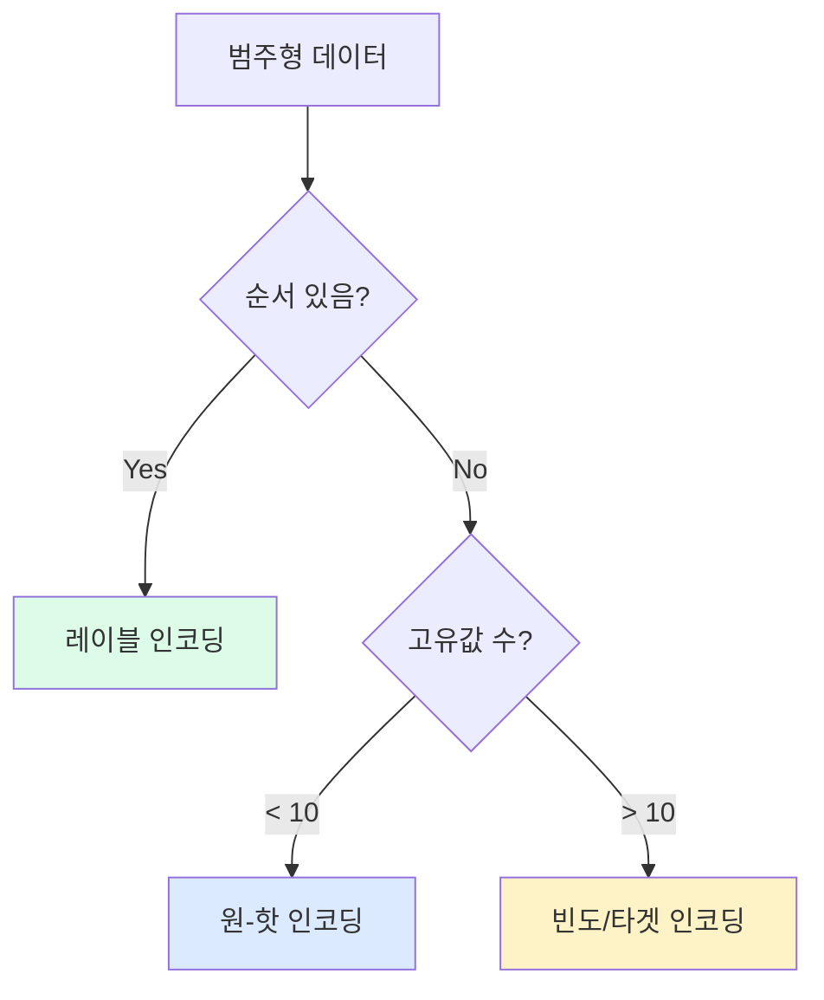

## 17. 다중공선성 문제

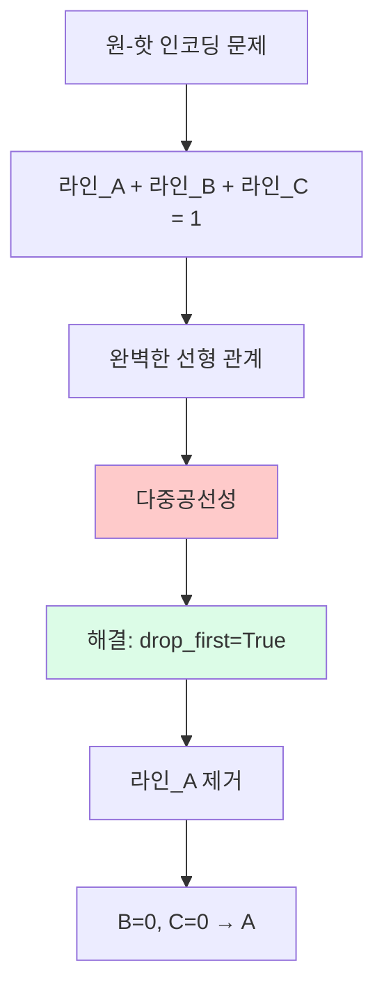

## 18. sklearn 전처리 패턴

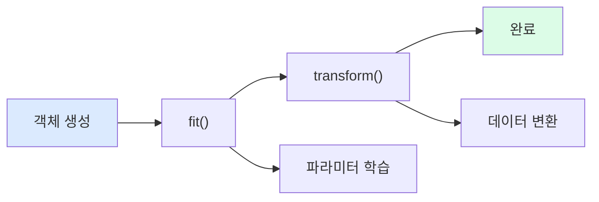

## 19. ColumnTransformer

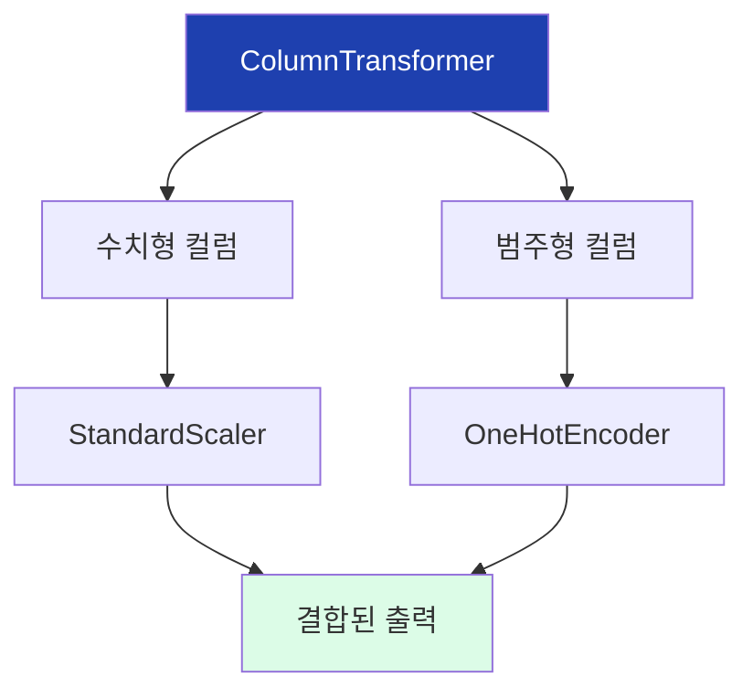

## 20. ColumnTransformer 구조

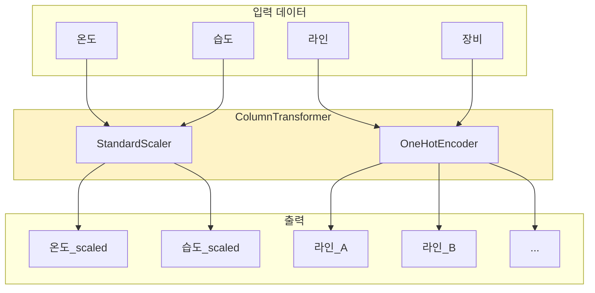

## 21. Pipeline 구조

```mermaid
flowchart TD
    A["Pipeline"]

    A --> B["전처리"]
    B --> C["모델"]

    B --> B1["ColumnTransformer<br>StandardScaler<br>OneHotEncoder"]
    C --> C1["LogisticRegression<br>RandomForest<br>etc."]

    style A fill:#1e40af,color:#fff
```

## 22. Pipeline 사용 흐름

```mermaid
flowchart LR
    A["X_train, y_train"]
    B["pipe.fit()"]
    C["전처리 학습"]
    D["모델 학습"]

    A --> B --> C --> D

    E["X_test"]
    F["pipe.predict()"]
    G["전처리 적용"]
    H["예측"]

    E --> F --> G --> H

    style B fill:#dbeafe
    style F fill:#dcfce7
```

## 23. Pipeline 장점

```mermaid
flowchart TD
    A["Pipeline 장점"]

    A --> B["코드 간결화"]
    A --> C["데이터 누수 방지"]
    A --> D["교차 검증 용이"]
    A --> E["배포 용이"]

    B --> B1["fit/predict<br>한 줄로"]
    C --> C1["자동 분리"]
    D --> D1["GridSearchCV<br>통합"]
    E --> E1["하나의 객체<br>저장/로드"]

    style A fill:#1e40af,color:#fff
```

## 24. Pipeline vs 수동

```mermaid
flowchart TD
    subgraph 수동["수동 방식"]
        A1["scaler.fit(X_train)"]
        A2["X_train_scaled = scaler.transform(X_train)"]
        A3["model.fit(X_train_scaled, y_train)"]
        A4["X_test_scaled = scaler.transform(X_test)"]
        A5["y_pred = model.predict(X_test_scaled)"]
        A1 --> A2 --> A3 --> A4 --> A5
    end

    subgraph Pipeline["Pipeline"]
        B1["pipe.fit(X_train, y_train)"]
        B2["y_pred = pipe.predict(X_test)"]
        B1 --> B2
    end

    style 수동 fill:#fecaca
    style Pipeline fill:#dcfce7
```

## 25. 전처리 파이프라인 저장

```mermaid
flowchart LR
    A["학습 완료된<br>Pipeline"]
    B["joblib.dump()"]
    C["파일 저장<br>.pkl"]

    A --> B --> C

    D["새 데이터"]
    E["joblib.load()"]
    F["predict()"]

    D --> E --> F

    style A fill:#dbeafe
    style C fill:#dcfce7
```

## 26. 종합 전처리 파이프라인

```mermaid
flowchart TD
    A["원본 데이터"]

    A --> B["수치형 전처리"]
    A --> C["범주형 전처리"]

    B --> D["SimpleImputer<br>(결측치)"]
    D --> E["StandardScaler<br>(스케일링)"]

    C --> F["SimpleImputer<br>(결측치)"]
    F --> G["OneHotEncoder<br>(인코딩)"]

    E --> H["결합"]
    G --> H

    H --> I["모델"]

    style A fill:#1e40af,color:#fff
    style H fill:#fef3c7
    style I fill:#dcfce7
```

## 27. 역변환

```mermaid
flowchart LR
    A["원본 데이터"]
    B["스케일링"]
    C["스케일링된 데이터"]
    D["역변환"]
    E["원본 스케일"]

    A --> B --> C --> D --> E

    B --> B1["scaler.fit_transform()"]
    D --> D1["scaler.inverse_transform()"]

    style C fill:#fef3c7
    style E fill:#dcfce7
```

## 28. 핵심 정리

```mermaid
flowchart TD
    A["10차시 핵심"]

    A --> B["스케일링"]
    A --> C["인코딩"]
    A --> D["Pipeline"]

    B --> B1["StandardScaler<br>MinMaxScaler<br>RobustScaler"]
    C --> C1["LabelEncoder<br>OneHotEncoder"]
    D --> D1["ColumnTransformer<br>+ Model"]

    style A fill:#1e40af,color:#fff
```

## 29. 주의사항 정리

```mermaid
flowchart TD
    A["주의사항"]

    A --> B["fit은 학습<br>데이터만"]
    A --> C["전처리기와<br>모델 함께 저장"]
    A --> D["인코딩 방법<br>데이터 유형별"]

    B --> B1["데이터 누수 방지"]
    C --> C1["일관된 전처리"]
    D --> D1["순서 있음→레이블<br>순서 없음→원핫"]

    style A fill:#fecaca
```

## 30. 다음 차시 연결

```mermaid
flowchart LR
    A["8차시"]
    B["10차시"]
    C["10차시"]

    A --> B --> C

    A --> A1["결측치/이상치"]
    B --> B1["스케일링/인코딩"]
    C --> C1["EDA 종합"]

    style A fill:#e2e8f0
    style B fill:#dbeafe
    style C fill:#dcfce7
```
