# [11차시] 제조 데이터 탐색 분석 종합 - 다이어그램

## 1. 학습 흐름


## 2. Part II 학습 여정

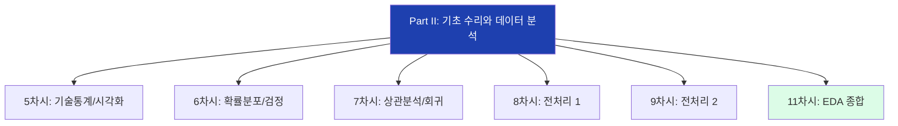

## 3. EDA란?

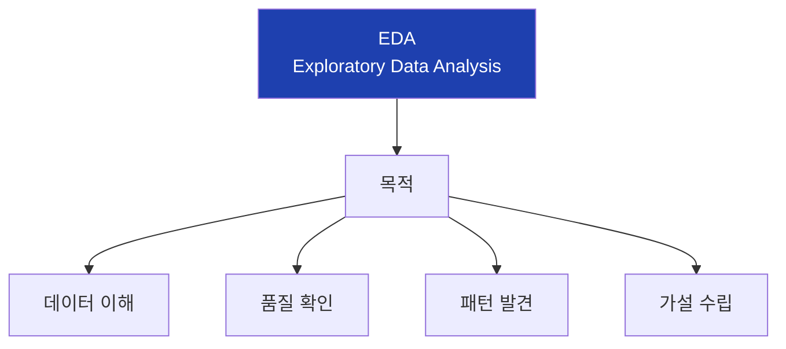

## 4. EDA vs 확증적 분석


## 5. EDA 5단계

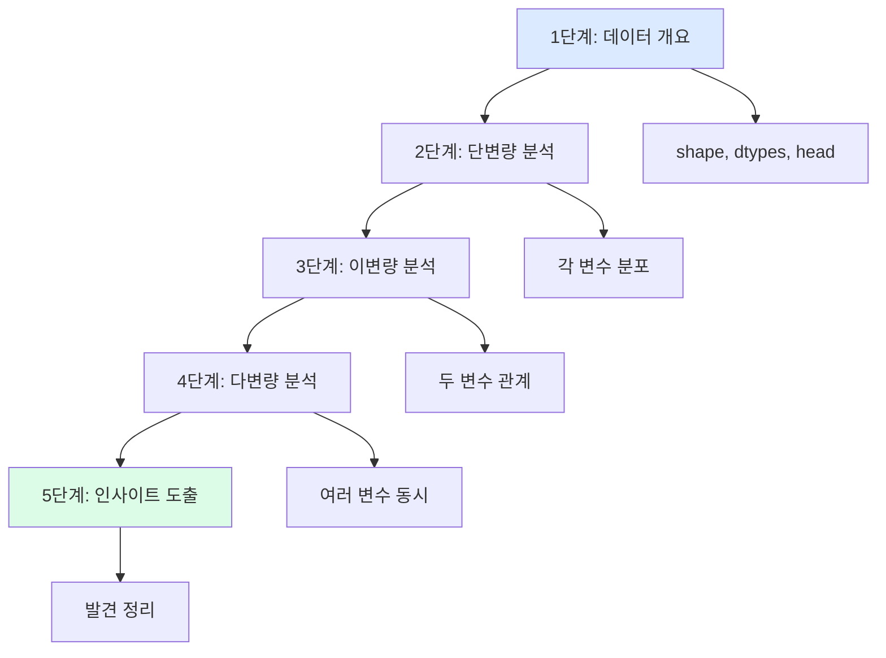

## 6. 1단계: 데이터 개요

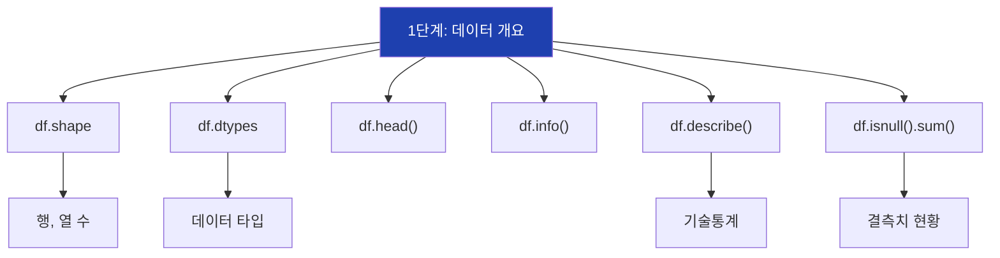

## 7. 2단계: 단변량 분석

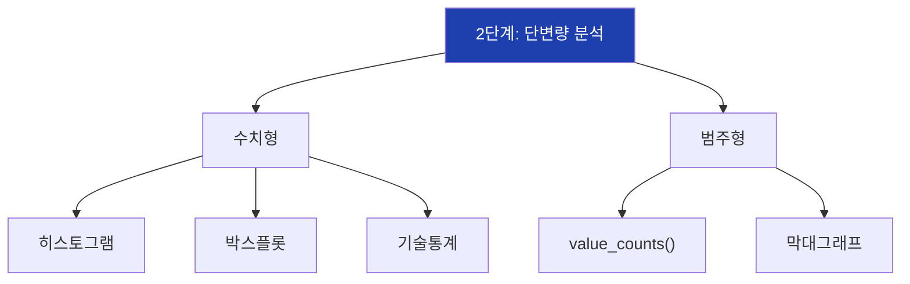

## 8. 3단계: 이변량 분석

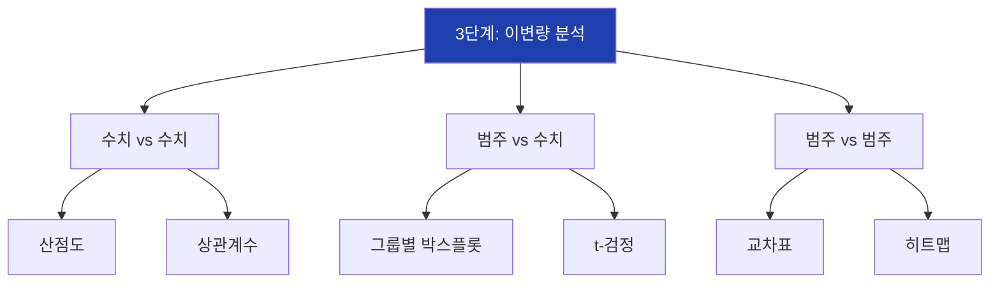

## 9. 4단계: 다변량 분석

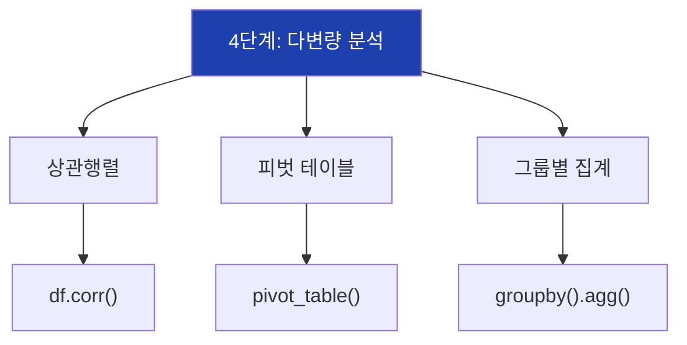

## 10. 인사이트 3요소

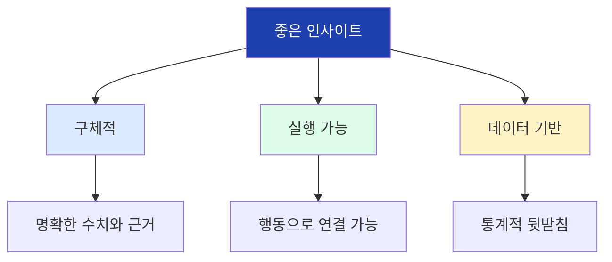

## 11. 인사이트 비교

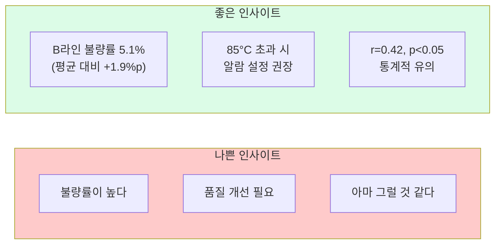

## 12. 인사이트 도출 프레임워크

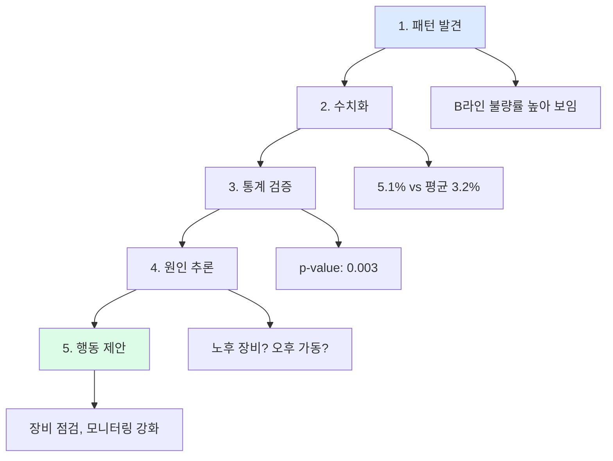

## 13. 인사이트 유형

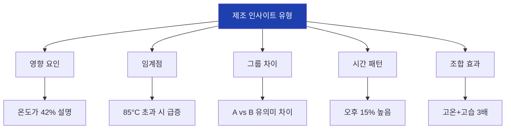

## 14. 가설 수립

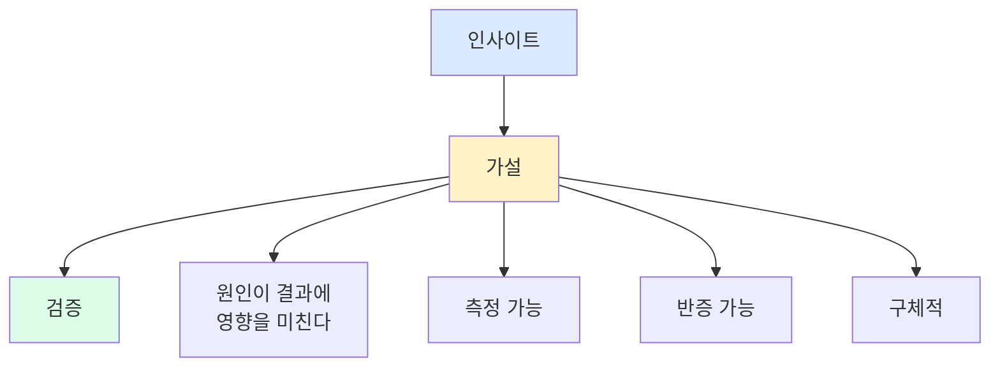

## 15. EDA 체크리스트

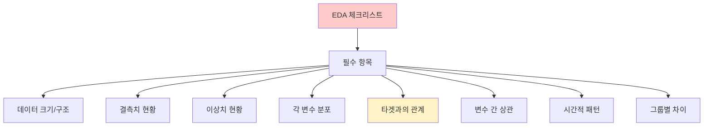

## 16. 실습 시나리오

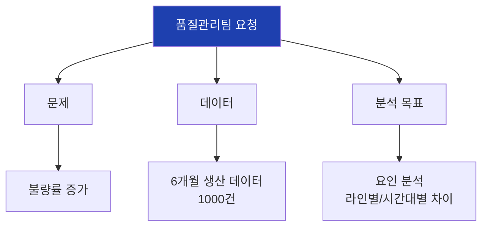

## 17. 실습 데이터 구조

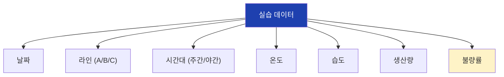

## 18. EDA 워크플로우

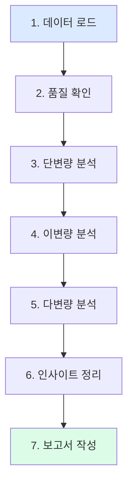

## 19. 대시보드 구성

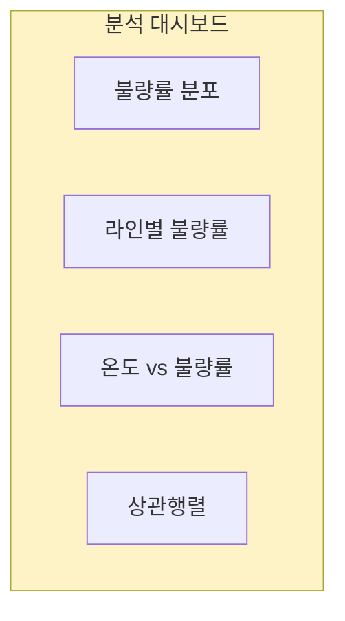

## 20. 보고서 구조

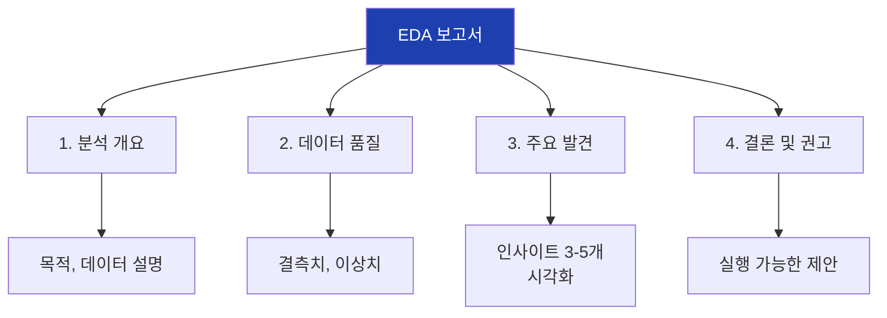

## 21. 권고사항 분류

```mermaid
flowchart TD
    A["권고사항"]

    A --> B["즉시 실행"]
    A --> C["단기 개선"]
    A --> D["장기 개선"]

    B --> B1["B라인 긴급 점검"]
    B --> B2["온도 경계값 알람"]

    C --> C1["야간 모니터링 강화"]
    C --> C2["환경 관리 개선"]

    D --> D1["예측 모델 개발"]
    D --> D2["센서 추가 설치"]

    style B fill:#fecaca
    style C fill:#fef3c7
    style D fill:#dcfce7
```

## 22. Part II 역량 정리

```mermaid
flowchart TD
    A["Part II 역량"]

    A --> B["기술통계"]
    A --> C["시각화"]
    A --> D["통계검정"]
    A --> E["상관분석"]
    A --> F["전처리"]
    A --> G["EDA"]

    B --> B1["데이터 요약"]
    C --> C1["분포 확인"]
    D --> D1["차이 검증"]
    E --> E1["관계 파악"]
    F --> F1["데이터 정제"]
    G --> G1["인사이트 도출"]

    style A fill:#1e40af,color:#fff
```

## 23. 시각화 원칙

```mermaid
flowchart TD
    A["효과적인 시각화"]

    A --> B["단순화"]
    A --> C["강조"]
    A --> D["맥락"]

    B --> B1["핵심 메시지 하나"]
    C --> C1["중요 부분 하이라이트"]
    D --> D1["비교 기준 제공"]

    style A fill:#1e40af,color:#fff
```

## 24. 인사이트 우선순위

```mermaid
flowchart TD
    A["우선순위 평가"]

    A --> B["영향력"]
    A --> C["실행 가능성"]
    A --> D["신뢰도"]
    A --> E["비용"]

    B --> B1["타겟에 큰 영향"]
    C --> C1["바로 적용 가능"]
    D --> D1["통계적 유의"]
    E --> E1["개선 비용"]

    style A fill:#1e40af,color:#fff
```

## 25. 분석 결과 정리 형식

```mermaid
flowchart TD
    A["인사이트 문서화"]

    A --> B["제목"]
    A --> C["발견 내용"]
    A --> D["수치적 근거"]
    A --> E["통계적 검증"]
    A --> F["권고 사항"]

    B --> B1["라인 B 불량률 이상"]
    C --> C1["타 라인 대비 높음"]
    D --> D1["5.1% vs 3.2%"]
    E --> E1["p-value: 0.003"]
    F --> F1["장비 점검 실시"]

    style A fill:#1e40af,color:#fff
```

## 26. Part II → Part III 연결

```mermaid
flowchart LR
    A["Part II<br>데이터 분석"]
    B["Part III<br>머신러닝"]

    A --> B

    A --> A1["기술통계"]
    A --> A2["전처리"]
    A --> A3["EDA"]

    B --> B1["분류"]
    B --> B2["회귀"]
    B --> B3["모델 평가"]

    style A fill:#dbeafe
    style B fill:#dcfce7
```

## 27. 핵심 정리

```mermaid
flowchart TD
    A["11차시 핵심"]

    A --> B["EDA 5단계"]
    A --> C["인사이트 3요소"]
    A --> D["체크리스트"]

    B --> B1["개요 → 단변량 →<br>이변량 → 다변량 →<br>인사이트"]
    C --> C1["구체적<br>실행 가능<br>데이터 기반"]
    D --> D1["타겟 관계<br>반드시 확인"]

    style A fill:#1e40af,color:#fff
```

## 28. 다음 차시 예고

```mermaid
flowchart LR
    A["11차시"]
    B["11차시"]

    A --> B

    A --> A1["EDA 종합"]
    B --> B1["머신러닝 소개"]
    B --> B2["지도/비지도학습"]
    B --> B3["분류 vs 회귀"]

    style A fill:#dbeafe
    style B fill:#dcfce7
```
