# [12차시] 머신러닝 소개와 문제 유형 - 다이어그램

## 1. 학습 흐름

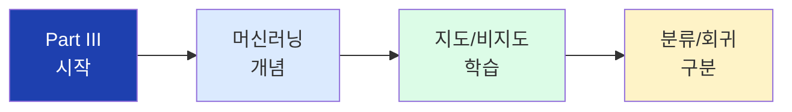

## 2. Part I-III 여정

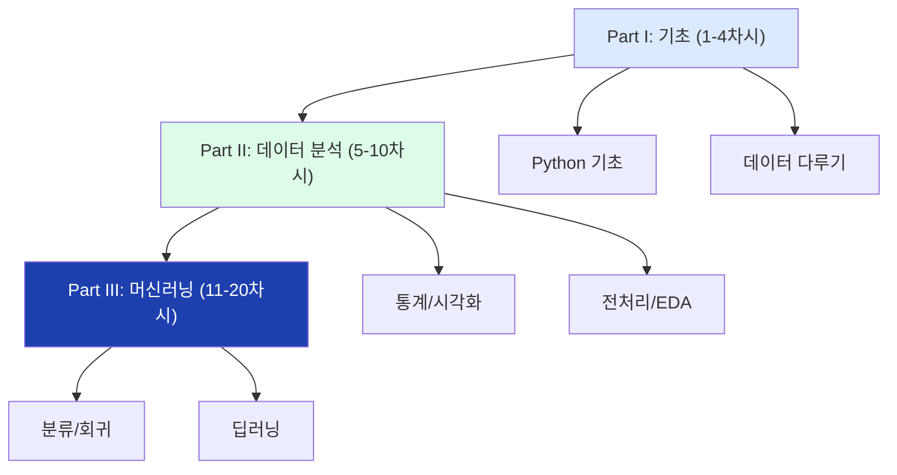

## 3. 머신러닝이란

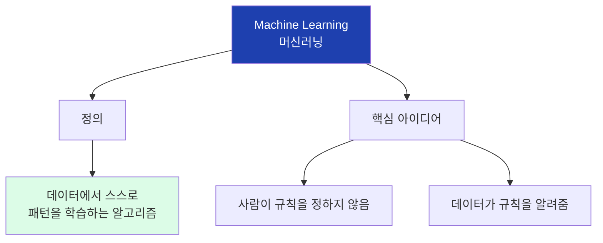

## 4. 전통 프로그래밍 vs 머신러닝

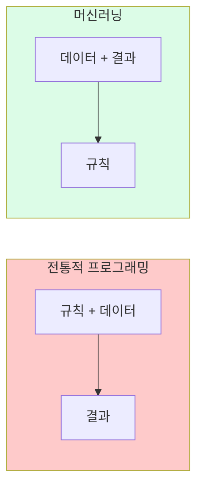

## 5. 전통 방식 흐름

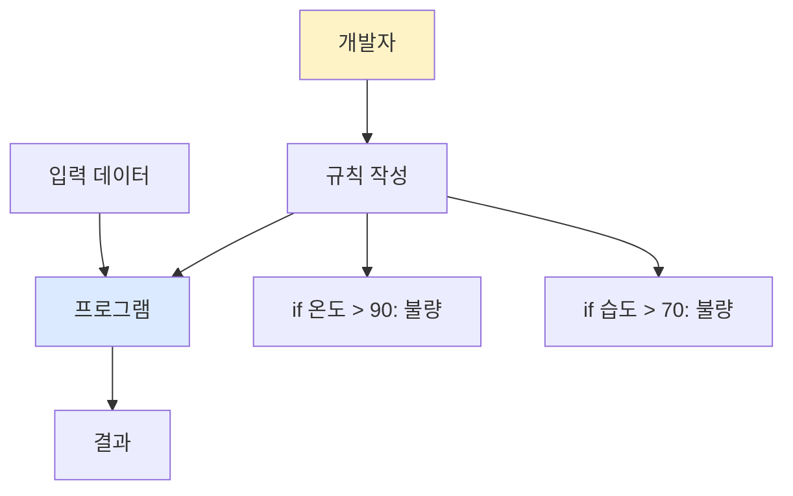

## 6. 머신러닝 방식 흐름

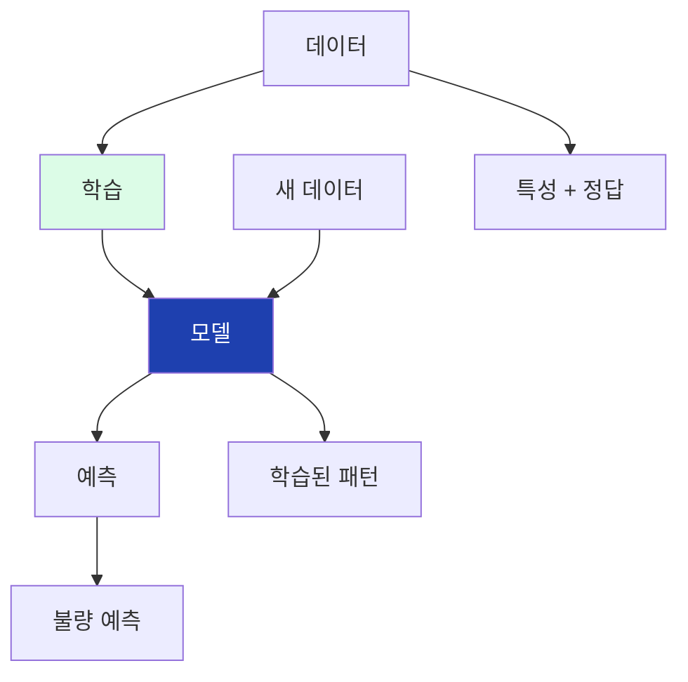

## 7. 머신러닝 학습 과정

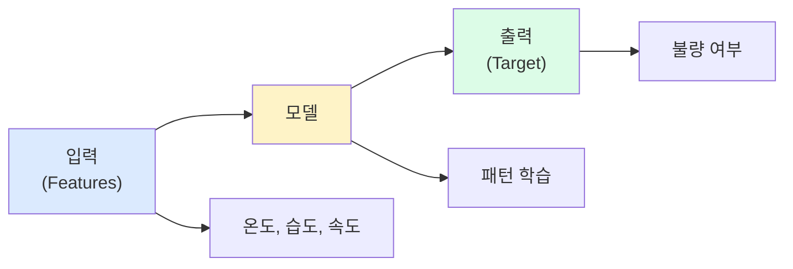

## 8. 핵심 용어

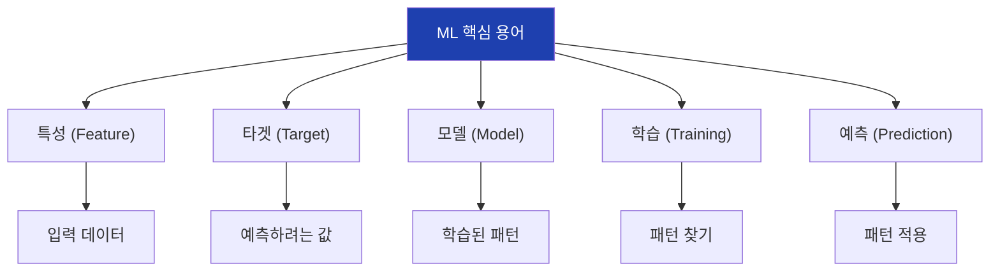

## 9. ML 적합한 경우

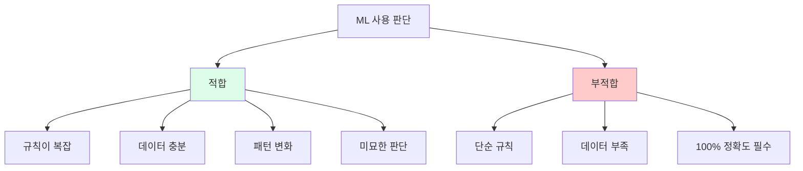

## 10. 제조 현장 ML 활용

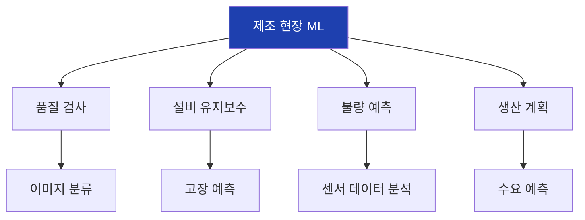

## 11. 머신러닝 종류

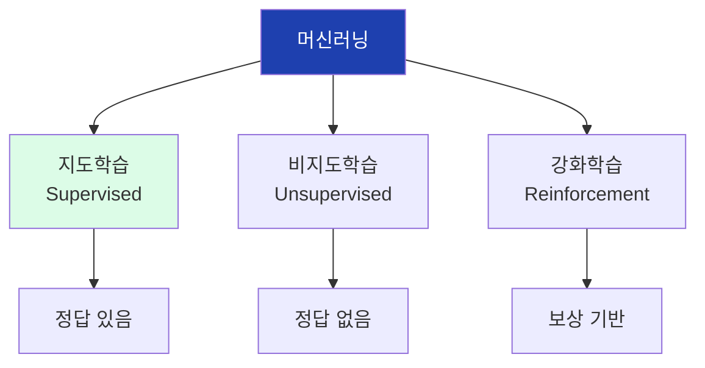

## 12. 지도학습

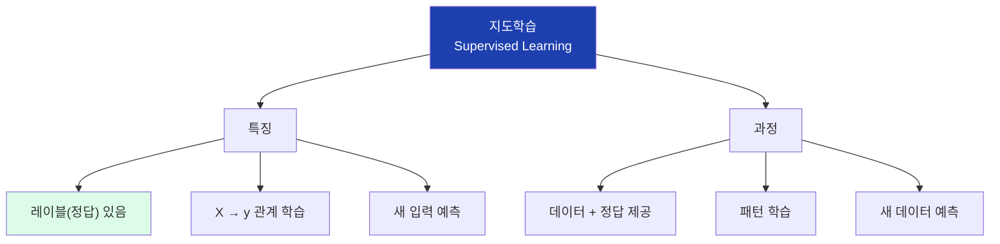

## 13. 지도학습 과정

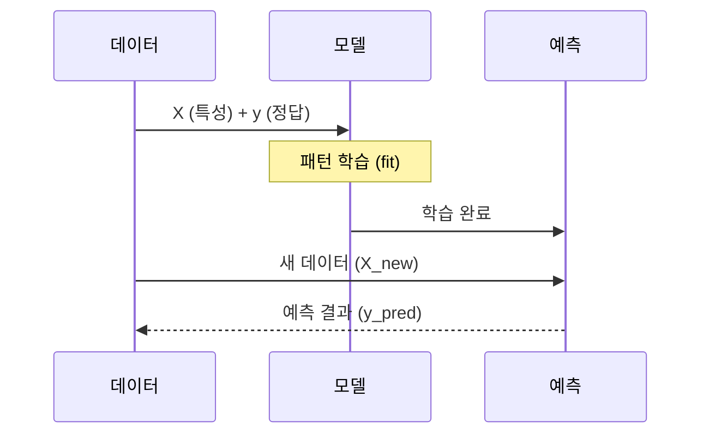

## 14. 지도학습 제조 예시

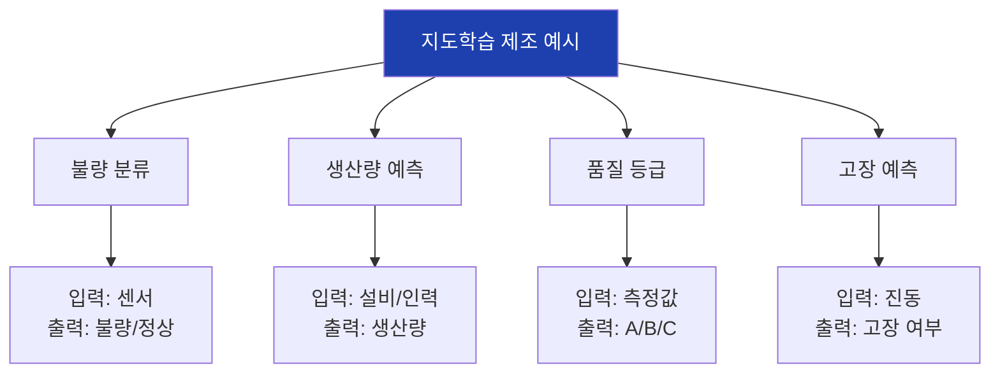

## 15. 비지도학습

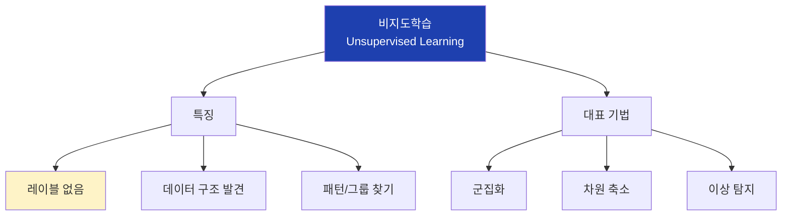

## 16. 비지도학습 과정

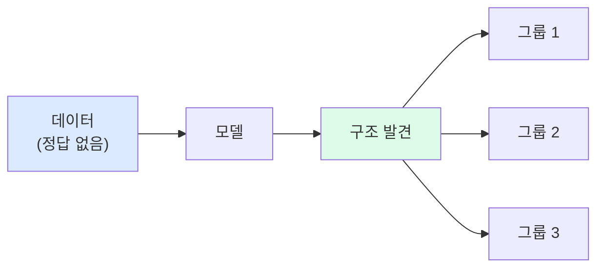

## 17. 지도학습 vs 비지도학습

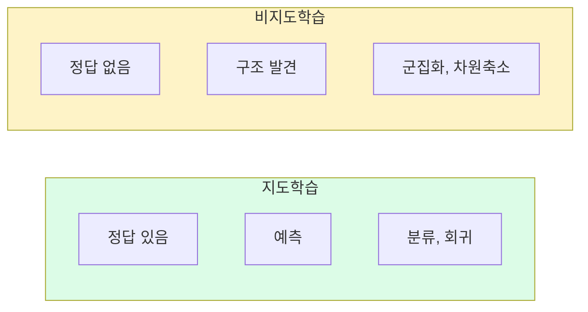

## 18. 지도학습의 두 문제

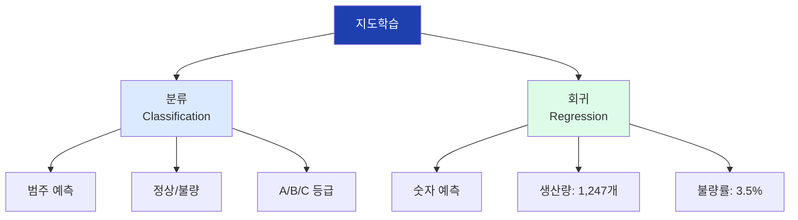

## 19. 분류

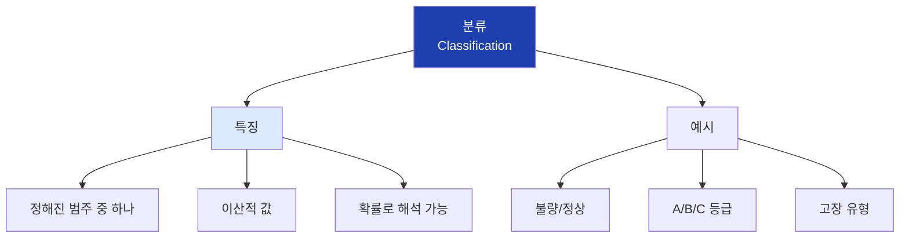

## 20. 이진 분류 vs 다중 분류

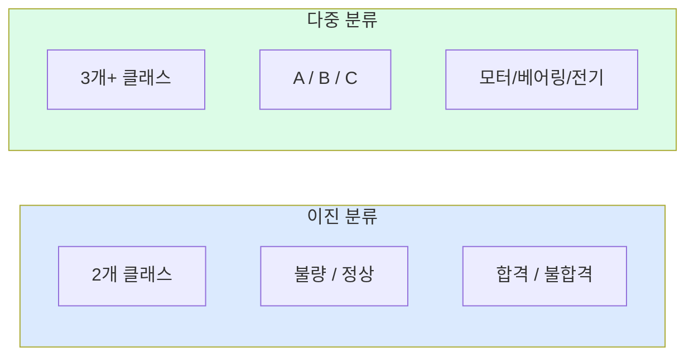

## 21. 회귀

```mermaid
flowchart TD
    A["회귀<br>Regression"]

    A --> B["특징"]
    B --> B1["연속적인 숫자"]
    B --> B2["어떤 값이든 가능"]
    B --> B3["오차 최소화"]

    A --> C["예시"]
    C --> C1["생산량: 1,247개"]
    C --> C2["불량률: 3.5%"]
    C --> C3["수명: 87일"]

    style A fill:#1e40af,color:#fff
    style B fill:#dcfce7
```

## 22. 분류 vs 회귀 구분

```mermaid
flowchart TD
    A["출력이 뭔가요?"]

    A --> B["범주"]
    A --> C["숫자"]

    B --> B1["분류"]
    B1 --> B2["~인가요?<br>어떤 종류?"]

    C --> C1["회귀"]
    C1 --> C2["얼마나?<br>몇 개?"]

    style A fill:#fef3c7
    style B1 fill:#dbeafe
    style C1 fill:#dcfce7
```

## 23. 문제 유형 판단

```mermaid
flowchart LR
    A["질문"]

    A --> B{"범주형?"}

    B -->|Yes| C["분류"]
    B -->|No| D["회귀"]

    C --> C1["불량인가요?"]
    C --> C2["어떤 등급?"]

    D --> D1["생산량은?"]
    D --> D2["몇 %?"]

    style C fill:#dbeafe
    style D fill:#dcfce7
```

## 24. sklearn 개요

```mermaid
flowchart TD
    A["scikit-learn"]

    A --> B["장점"]
    B --> B1["일관된 API"]
    B --> B2["다양한 알고리즘"]
    B --> B3["전처리/평가 도구"]
    B --> B4["풍부한 문서"]

    A --> C["핵심 패턴"]
    C --> C1["fit: 학습"]
    C --> C2["predict: 예측"]
    C --> C3["score: 평가"]

    style A fill:#1e40af,color:#fff
    style C fill:#dcfce7
```

## 25. sklearn 기본 흐름

```mermaid
flowchart TD
    A["1. 데이터 준비"]
    B["2. 모델 생성"]
    C["3. 학습 (fit)"]
    D["4. 예측 (predict)"]
    E["5. 평가 (score)"]

    A --> B --> C --> D --> E

    A --> A1["X, y 분리"]
    B --> B1["ModelClass()"]
    C --> C1["model.fit(X, y)"]
    D --> D1["model.predict(X_new)"]
    E --> E1["model.score(X, y)"]

    style A fill:#dbeafe
    style E fill:#dcfce7
```

## 26. 학습/테스트 분리

```mermaid
flowchart TD
    A["전체 데이터"]

    A --> B["학습 데이터<br>80%"]
    A --> C["테스트 데이터<br>20%"]

    B --> B1["패턴 학습"]
    C --> C1["성능 평가"]

    style A fill:#1e40af,color:#fff
    style B fill:#dbeafe
    style C fill:#dcfce7
```

## 27. train_test_split

```mermaid
flowchart LR
    A["X, y"]
    B["train_test_split"]
    C["X_train<br>y_train"]
    D["X_test<br>y_test"]

    A --> B
    B --> C
    B --> D

    C --> C1["학습용 80%"]
    D --> D1["평가용 20%"]

    style B fill:#fef3c7
```

## 28. 분류 모델 흐름

```mermaid
flowchart TD
    A["DecisionTreeClassifier"]

    A --> B["생성"]
    B --> B1["model = DecisionTreeClassifier()"]

    A --> C["학습"]
    C --> C1["model.fit(X_train, y_train)"]

    A --> D["예측"]
    D --> D1["y_pred = model.predict(X_test)"]

    A --> E["평가"]
    E --> E1["accuracy = model.score()"]

    style A fill:#1e40af,color:#fff
    style E fill:#dcfce7
```

## 29. 회귀 모델 흐름

```mermaid
flowchart TD
    A["LinearRegression"]

    A --> B["생성"]
    B --> B1["model = LinearRegression()"]

    A --> C["학습"]
    C --> C1["model.fit(X_train, y_train)"]

    A --> D["예측"]
    D --> D1["y_pred = model.predict(X_test)"]

    A --> E["평가"]
    E --> E1["r2 = model.score()"]

    style A fill:#1e40af,color:#fff
    style E fill:#dcfce7
```

## 30. 모델 일관된 API

```mermaid
flowchart TD
    A["sklearn 모든 모델"]

    A --> B["fit(X, y)"]
    A --> C["predict(X)"]
    A --> D["score(X, y)"]

    B --> B1["학습"]
    C --> C1["예측"]
    D --> D1["평가"]

    E["DecisionTree"] --> A
    F["RandomForest"] --> A
    G["LinearRegression"] --> A
    H["SVM"] --> A

    style A fill:#1e40af,color:#fff
```

## 31. 실습 데이터 구조

```mermaid
flowchart TD
    A["실습 데이터"]

    A --> B["특성 (X)"]
    B --> B1["temperature"]
    B --> B2["humidity"]
    B --> B3["speed"]

    A --> C["타겟 (y)"]
    C --> C1["defect<br>(분류)"]
    C --> C2["production<br>(회귀)"]

    style A fill:#1e40af,color:#fff
    style C1 fill:#dbeafe
    style C2 fill:#dcfce7
```

## 32. 분류/회귀 동시 실습

```mermaid
flowchart LR
    A["같은 특성<br>X"]

    A --> B["분류 모델"]
    A --> C["회귀 모델"]

    B --> B1["defect<br>불량 여부"]
    C --> C1["production<br>생산량"]

    style A fill:#fef3c7
    style B1 fill:#dbeafe
    style C1 fill:#dcfce7
```

## 33. 새 데이터 예측

```mermaid
flowchart TD
    A["새 제품 데이터"]
    B["학습된 모델"]
    C["예측 결과"]

    A --> B --> C

    A --> A1["온도: 87<br>습도: 55<br>속도: 105"]

    C --> C1["분류: 정상/불량"]
    C --> C2["회귀: 1,234개"]

    style B fill:#1e40af,color:#fff
    style C fill:#dcfce7
```

## 34. 실습 전체 흐름

```mermaid
flowchart TD
    A["데이터 생성"]
    B["X, y 분리"]
    C["train/test 분리"]
    D["모델 학습"]
    E["예측"]
    F["평가"]

    A --> B --> C --> D --> E --> F

    style A fill:#dbeafe
    style F fill:#dcfce7
```

## 35. Part III 커리큘럼

```mermaid
flowchart TD
    A["Part III: 머신러닝"]

    A --> B["12차시: ML 소개"]
    A --> C["12-13차시: 분류 모델"]
    A --> D["14차시: 회귀 모델"]
    A --> E["15-16차시: 평가/튜닝"]
    A --> F["17-18차시: 시계열"]
    A --> G["19-20차시: 딥러닝"]

    style A fill:#1e40af,color:#fff
    style B fill:#dcfce7
```

## 36. 핵심 정리

```mermaid
flowchart TD
    A["12차시 핵심"]

    A --> B["머신러닝"]
    A --> C["학습 유형"]
    A --> D["문제 유형"]

    B --> B1["데이터에서<br>패턴 자동 학습"]

    C --> C1["지도학습: 정답 있음"]
    C --> C2["비지도학습: 정답 없음"]

    D --> D1["분류: 범주 예측"]
    D --> D2["회귀: 숫자 예측"]

    style A fill:#1e40af,color:#fff
```

## 37. sklearn 패턴 정리

```mermaid
flowchart LR
    A["모델 생성<br>ModelClass()"]
    B["학습<br>fit(X, y)"]
    C["예측<br>predict(X)"]
    D["평가<br>score(X, y)"]

    A --> B --> C --> D

    style A fill:#dbeafe
    style B fill:#dcfce7
    style C fill:#fef3c7
    style D fill:#fecaca
```

## 38. 다음 차시 연결

```mermaid
flowchart LR
    A["12차시<br>ML 소개"]
    B["12차시<br>의사결정나무"]

    A --> B

    A --> A1["개념 이해"]
    A --> A2["sklearn 기초"]

    B --> B1["첫 분류 모델"]
    B --> B2["트리 구조 해석"]

    style A fill:#dbeafe
    style B fill:#dcfce7
```
